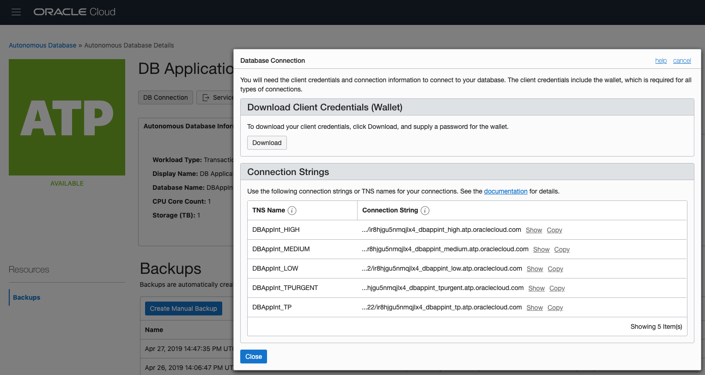

Application Development

Date: May 22, 2019

Lab Guide Mark Down Conversion Template Information *(remove this
section before publishing)*

In general, the simpler the better.

  - Label every image with a figure number starting from \#1, counting
    to the total number of figures or ‘images’. This will help you keep
    track of images as they are generated in the /media subfolder.

  - When using bullets, only use the standard bullet, do not use check
    marks or arrows, they will not translate in the final markdown.

  - Images will all be left justified and displayed at their normal
    size.

  - For code examples and any other distinctive formatting like tables,
    highlights, etc. you will need to format the markdown directly.

  - After you are finished, *update* the Table of Contents – *right
    click* on the Table of Contents, and select Update Field from pop-up
    menu. Select “Update Entire Table” radio button and click on the OK
    button. It will retain navigation after the markdown conversion. You
    will need to remove the page numbers manually.

  - Install Python if you do not have it, and refer to conversion
    scripts below

  - [https://github.com/jjking2019/ospa-github-ideas/blob/master/docx\_md\_converter\_scripts.md](https://github.com/jjking2019/ospa-github-ideas/blob/master/docx_md_converter_scripts.md)

  - Delete this section before publishing

Sample Table of Contents

[Lab Guide Overview 4](#lab-guide-overview)

[Lab Purpose and Rules 4](#lab-purpose-and-rules)

[Labs 4](#labs)

[Lab 1: Introduction, setup, and demo
4](#lab-1-introduction-setup-and-demo)

[Lab 2: Spreadsheet-based Business Objects
5](#lab-2-spreadsheet-based-business-objects)

[Lab 3: Web and Mobile Apps 6](#lab-3-web-and-mobile-apps)

[Lab 4: Data from service 6](#lab-4-data-from-service)

[Extra Lab 5: Add Data Using REST Call
6](#extra-lab-5-add-data-using-rest-call)

[Extra Lab 6: Review and edit JavaScript code “under the covers” of VBCS
7](#extra-lab-6-review-and-edit-javascript-code-under-the-covers-of-vbcs)

[Appendix: Name of Appendix 7](#appendix-name-of-appendix)

# Lab Guide Overview

## Lab Purpose and Rules

These labs are designed to provide you with an introduction to using
Visual Builder to create Web and Mobile applications and to prepare you
to demonstrate Visual Builder to customers or to use Visual Builder to
demonstrate other products to Oracle’s customers.

Here are some general guidelines that will help you get the most from
these lab exercises.

  - Read through an entire exercise before executing any of the steps.
    Becoming familiar with the expected flow will enhance your learning
    experience.

  - Ask before you do. If you have any questions, please ask the
    instructor before you march down a path that may lead to wasting
    your time.

  - Follow the steps as shown in the Lab Guide. This is a live
    environment. If you want to do something that is not in the labs,
    ask the lab instructor first. In particular, do not create, delete,
    or alter any cloud objects without asking first.

  - There is no prize for finishing first; there is no penalty for
    finishing last. The goal is to gain a firm understanding of Oracle
    Visual Builder.

  - Ask questions freely. The only dumb questions are those that are not
    asked.

# Labs

In these labs you will use Visual Builder to help Mama Maggy’s by adding
product ordering and order tracking solutions.

The lab is presented in four parts: Lab 1 – Introduction and Setup, Lab
2 - Spreadsheet-based Business Objects, Lab 3 – Web and Mobile Apps, Lab
4 – Data from Service. There are two additional “extra” labs available
for anyone who happens to finish early. No prior experience with Visual
Builder is assumed or necessary.

**Prerequisite**: Before starting these labs, you should have an OCI
login and

**NOTE:** Content is driven by external factors such as user data
entries and login date. As a result, what you see displayed in your
environment may not exactly match with the lab screenshots. Screenshots
are provided solely for illustrative purposes to help guide you through
the user interface.

# Lab 1: Introduction, setup, and demo

In this lab you will make sure you can access the VBCS instance for your
classroom and supporting lab files.

1.  Log into class tenancy using cloud.oracle.com

Figure – Log In

2.  On some systems you will see a “dashboard” as shown below

Figure - Dashboard

Click the “Visual Builder” service

(if your dashboard does not show “Visual Builder” – click “Customize
Dashboard”)

Scroll to “Visual Builder” and click the “Show Button”

3.  On other systems you may see this style of Dashboard; once again,
    click “Visual Builder”

4.  Ss

5.  
# Lab 2: Spreadsheet-based Business Objects

Visual Builder provides two main methods to access data: built-in
business objects, and service connections. This lab focuses on creating
and using built-in business objects using spreadsheet (.csv/.xlsx)
files.

1.  Open…

2.  Click….

# Lab 3: Web and Mobile Apps

Visual Builder provides an easy-to-use WSYIWG (What You See Is What You
Get) graphical interface for ‘painting’ applications and providing
values declaratively allowing people who are not professional developers
to create applications. Professional developers can use Visual Builder
too; they might also choose to use it’s more advanced features and
coding capabilities to make applications more-robust.

In this lab you will create a Web application to allow Mama Maggy
managers/franchisees to order products used in making pizza. You will
also create Mobile application allowing them to track their order
status.\\

3.  Open…

4.  Click….

# Lab 4: Data from service

While using Visual Builder’s built-in business objects is useful; they
limit applications to data found within the Visual Builder instance.
Most modern applications will use data from varied source both in and
outside of an organization’s systems. This is accomplished using service
connections that take advantage of RESTful APIs exposed by databases and
other providers. API stands for Application Programmer Interface; a
pre-defined calling mechanism used to read and modify data using
standardized calls over the internet with HTTP/HTTPS (often called
RESTful APIs). This is the most common way of using external data in
modern applications. In this Lab you will add useful information to your
application using RESTful API calls.

5.  Open…

6.  Click….

# Extra Lab 5: Add Data Using REST Call

Visual Builder provides two main methods to access data: built-in
business objects, and service connections. This lab focuses on creating
and using built-in business objects using spreadsheet (.csv/.xlsx)
files.

7.  Open…

8.  Click….

# Extra Lab 6: Review and edit JavaScript code “under the covers” of VBCS

Visual Builder provides two main methods to access data: built-in
business objects, and service connections. This lab focuses on creating
and using built-in business objects using spreadsheet (.csv/.xlsx)
files.

9.  Open…

10. Click….

# Table of Contents

[Lab Guide Overview 4](#lab-guide-overview)

[Lab Purpose and Rules 4](#lab-purpose-and-rules)

[Labs 4](#labs)

[Lab 1: Introduction, setup, and demo
4](#lab-1-introduction-setup-and-demo)

[Lab 2: Spreadsheet-based Business Objects
5](#lab-2-spreadsheet-based-business-objects)

[Lab 3: Web and Mobile Apps 6](#lab-3-web-and-mobile-apps)

[Lab 4: Data from service 6](#lab-4-data-from-service)

[EXTRA Lab 5: ADD DATA USING REST CALL
6](#extra-lab-5-add-data-using-rest-call)

[extra Lab 6: Review and edit JavaScript code “under the covers” of VBCS
7](#extra-lab-6-review-and-edit-javascript-code-under-the-covers-of-vbcs)

[Appendix: Name of Appendix 7](#appendix-name-of-appendix)

# Appendix: Name of Appendix
