Updated: January 14, 2019

## Introduction

This tutorial is based on the official [Oracle WebLogic Kubernetes Operator](https://github.com/oracle/weblogic-kubernetes-operator/blob/master/site/installation.md) installation guide.

To run the operator in a Kubernetes cluster, you need to build the Docker image and then deploy it to your cluster. The operator sources can be found on github.com and is built using Apache Maven. In this tutorial you can build WebLogic Kubernetes Operator and upload to Container Registry (OCIR) for later deployment:


**_To log issues_**, click here to go to the [github oracle](https://github.com/oracle/learning-library/issues/new) repository issue submission form.

## Objectives

- Setup Environment

## Required Artifacts

- [Oracle Cloud Infrastructure](https://cloud.oracle.com/en_US/cloud-infrastructure) enabled account.
- [Github](sign.up.github.md) account.
- [Oracle Container Pipelines (former Wercker)](sign.up.wercker.md) account.
- [Docker](sign.up.docker.md) account.

# Build the Docker image for the operator and push to Oracle Cloud Infrastructure Registry (OCIR)

## Setup Environment

### **STEP 1**: Log in to your Oracle Cloud Infrastructure (OCI)

- If you are using a Trial Account, **you must wait until you receive this email** indicating that your Cloud Account has been provisioned. _Please note that this email may arrive in your spam or promotions folder pending your email settings._

  

- Once you receive the **Get Started with Oracle Cloud** Email, make note of your **Username, Password and Cloud Account Name**.

  

- From any browser go to:

    [https://cloud.oracle.com/en_US/sign-in](https://cloud.oracle.com/en_US/sign-in)

- Enter your **Cloud Account Name** in the input field and click the **My Services** button. If you have a trial account, this can be found in your welcome email. Otherwise, this will be supplied by your workshop instructor.

  

- Enter your **Username** and **Password** in the input fields and click **Sign In**. If you have a trial account, these can be found in your welcome email. Otherwise, these will be supplied by your workshop instructor.

  

**NOTE**: If you have used your trial account already, you may have been prompted to change the temporary password listed in the welcome email. In that case, enter the new password in the password field.

- In the top left corner of the dashboard, click the **hamburger menu**

  

- Click to expand the **Services** submenu, then click **Compute**

  

- On the OCI Console sign in page, enter the same **Username** as you did on the previous sign in page. If you are using a trial account and this is your first time logging into the OCI Console, enter the **temporary password** from your trial account welcome email. If you have already visited the OCI Console and changed your password, enter your **new password**. Otherwise, this password will be supplied by your workshop instructor.

  

### **STEP 2**: Get Authentication Token to use Oracle Cloud Infrastructure Registry (OCIR)

- Once you logged in click your name on top-rigth corner and select **User Settings**. 

  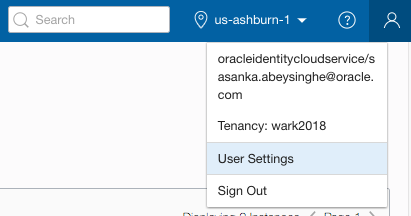
 
- On the user details page select **Auth Tokens** in the left menu. Click **Generate Token**.
  
  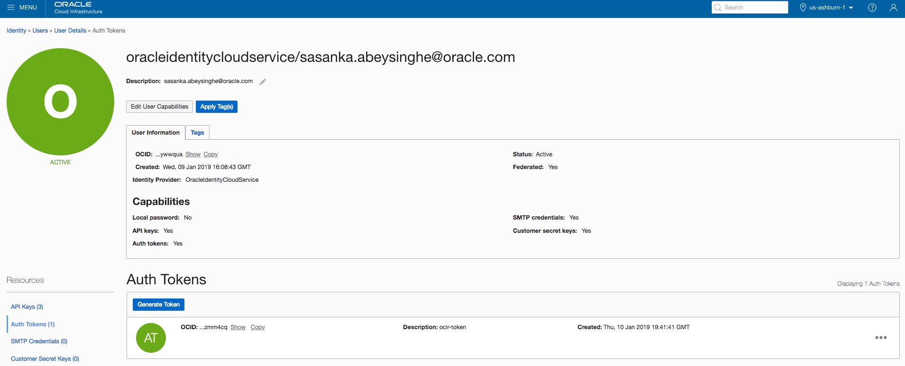 
  
-  Enter a friendly description for the auth token and click **Generate Token**.

  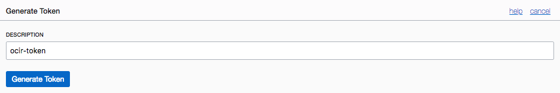

- The new auth token is displayed. **Copy** the auth token immediately to a secure location from where you can retrieve it later, because you won't see the auth token again in the Console. **Close** the Generate Token dialog.

 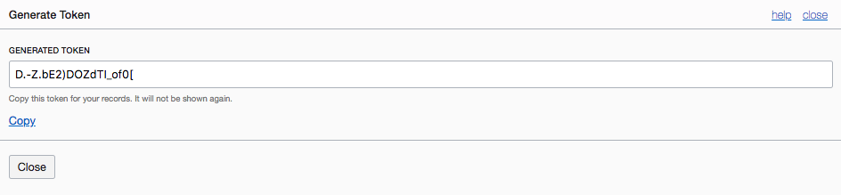

  
- From the OCI Console navigation menu, select **Developer Services->Registry (OCIR)**.
  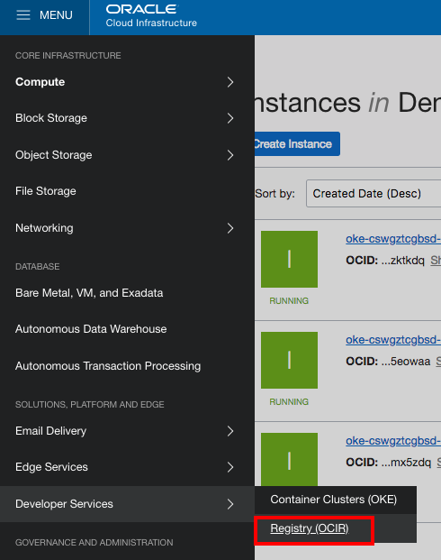
### **STEP 3**: Accept Licence Agreement to use Oracle WebLogic Server image from Docker Store

If you have not used the base image [`Oracle WebLogic Serve`](https://hub.docker.com/_/oracle-weblogic-server-12c) before, you will need to visit the [Docker Store web interface](https://hub.docker.com/_/oracle-weblogic-server-12c) and accept the license agreement before the Docker Store will give you permission to pull that image.

Open [https://hub.docker.com/_/oracle-weblogic-server-12c](https://hub.docker.com/_/oracle-weblogic-server-12c) in a new browser and click **Log In**.

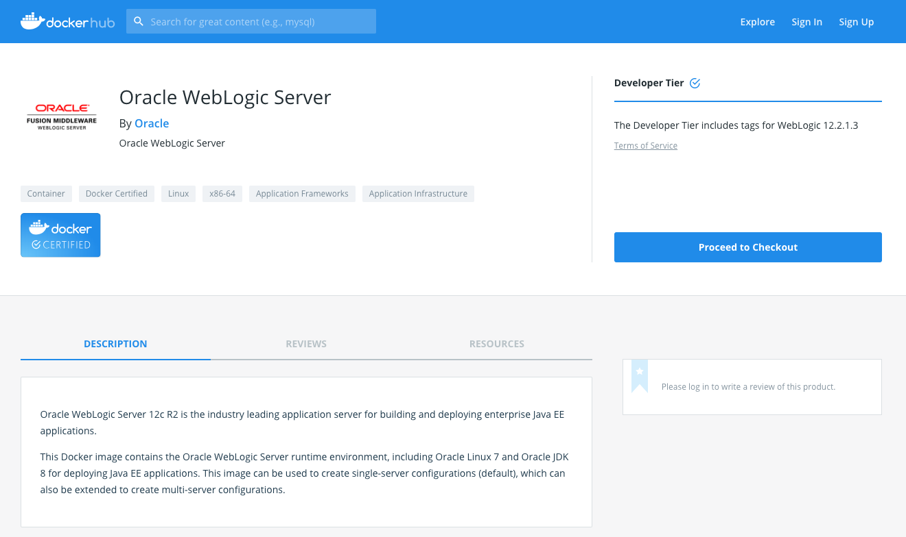

Enter your account details and click **Login**.


Click **Proceed to Checkout**.

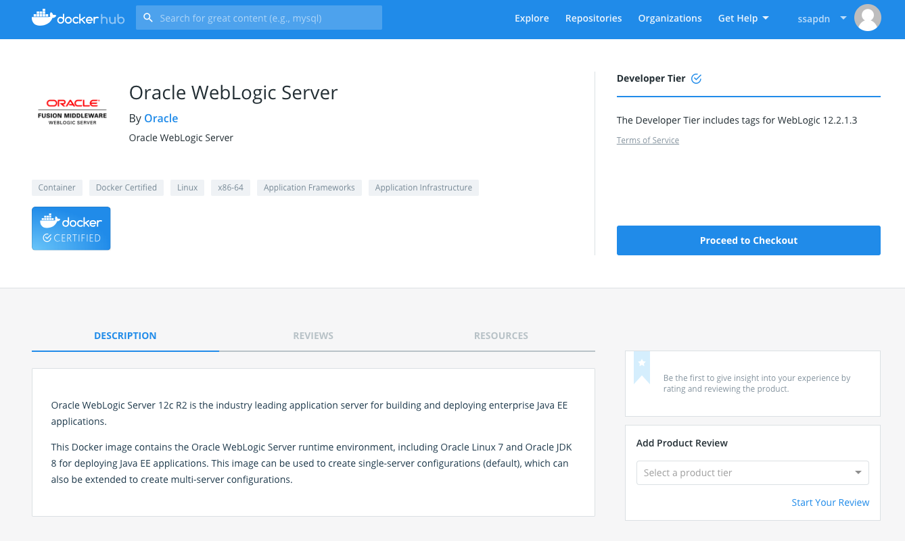

Complete your contact information and accept agreements. Click **Get Content**.


Now you are ready to pull the  image on docker enabled host after authenticating yourself in Docker Hub using your Docker Hub credentials.

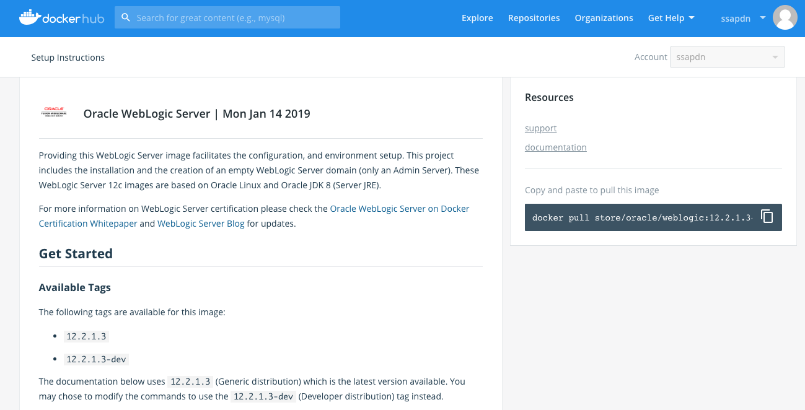

### **STEP 4**: Pull Docker images for the operator and push to Oracle Cloud Infrastructure Registry (OCIR)

- Open Terminal (Linux/Mac users) or Command Line (Windows users) and use your docker credentials to access your docker account.
        ```
        docker login
        ```
  

- Run the following commands
        ```
        docker pull oracle/weblogic-kubernetes-operator:1.0
        ```
  
        ```
        docker pull store/oracle/weblogic:12.2.1.3
        ```
 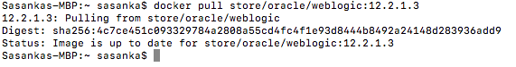 
        ```
        docker pull traefik:1.4.5
        ```
   
    
- Log in to the OCIR Docker registry by entering this command:
        ```
        docker login iad.ocir.io
        ```
- When prompted for your username, enter your OCI tenancy name/oci username and auth token.
    
- Push Docker images into OCIR:
        ```
        docker push iad.ocir.io/wark2018/weblogic-kubernetes-operator:latest
        docker push iad.ocir.io/wark2018/weblogic:12.2.1.3
        docker push iad.ocir.io/wark2018/traefik:1.4.5
        ```
 
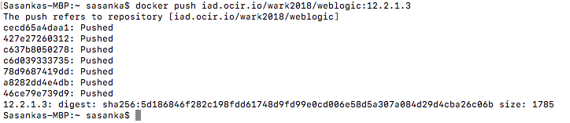 
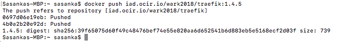 

- From the OCI Console navigation menu, select **Developer Services->Registry (OCIR)**.
  

- Click Registry tab and you can see pushed docker images.
  
    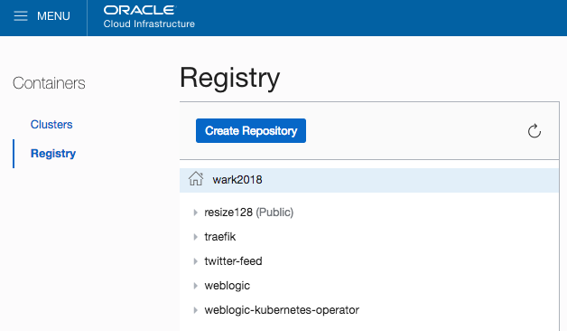

