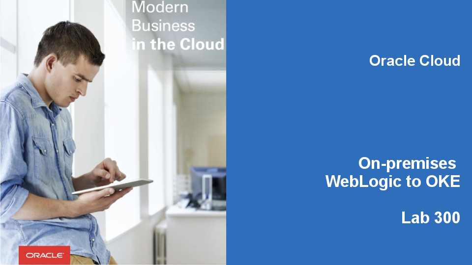

  
Updated: Date

## Introduction

In this lab, we describe the steps to run a WebLogic cluster using the Oracle Cloud Infrastructure (OCI) Container Engine for Kubernetes. The Kubernetes managed service is fully integrated with the underlying Oracle Cloud Infrastructure (OCI), making it easy to provision a Kubernetes cluster and to provide the required services, such as a load balancer, volumes, and network fabric.

**_To log issues_**, click here to go to the [github oracle](https://github.com/oracle/learning-library/issues/new) repository issue submission form.

## Objectives

- Test accessibility and set up the RBAC policy for the OCI Container Engine for the Kubernetes cluster
- Set up the NFS server
- Modify the configuration YAML files to reflect the Docker images’ names in the OCIR

## Required Artifacts

- Docker images:
    - WebLogic Server (weblogic-12.2.1.3:latest).
    - WebLogic Kubernetes Operator (weblogic-operator:latest)
    - Traefik Load Balancer (traefik:1.4.5)
- A workstation with Docker and kubectl, installed and configured.
- The Oracle Container Engine for Kubernetes on OCI.
- OCI Container Engine for Kubernetes nodes are accessible using ssh.
- The Oracle Cloud Infrastructure Registry to push the WebLogic Server, Operator, and Load Balancer images.

# Prepare the WebLogic Kubernetes Operator environment

### **STEP 1**: Test accessibility and set up the RBAC policy for the OKE cluster

- To check the accessibility to the OCI Container Engine for Kubernetes nodes, enter the command:
      ```
      kubectl get nodes
      ```


- In order to have permission to access the Kubernetes cluster, you need to authorize your OCI account as a cluster-admin on the OCI Container Engine for Kubernetes cluster.  This will require your OCID, which is available on the OCI console page, under your user settings.
  


      ```
      kubectl create clusterrolebinding my-cluster-admin-binding --clusterrole=cluster-admin --user==<Paste your User OCID Here>
      ```


### **STEP 2**: Set up the NFS server

- In the above step, let’s install the NFS server on Node1 with the IP address 129.213.34.235, and use Node2 (IP:129.213.60.103)and Node3 (IP:132.145.138.193) as clients. Log in to each of the nodes using ssh to retrieve the private IP address, by executing the command:
      ```
      ssh -i ~/.ssh/id_rsa opc@[Public IP of Node]
      ip addr | grep ens3
      ```
~/.ssh/id_rsa is the path to the private ssh RSA key.
- Type **yes** and **press enter** when asked if you want to continue connecting

    

- Retrieve private IP address executing this command:
     ```
	$ ip addr | grep ens3
     ```
    
    Find the inet value. For example the private address in the example above: 10.0.96.2

    Repeat the query for each node. Note the IP addresses for easier usage:

| Nodes:             | Public IP       | Private IP |
|--------------------|-----------------|------------|
| Node1 - NFS Server | 129.213.34.235  | 10.0.96.2  |
| Node2              | 129.213.60.103  | 10.0.32.2  |
| Node3              | 132.145.138.193 | 10.0.64.2  |


- Log in using `ssh` to **Node1**, and set up NFS Server:
    ```
	$ ssh -i ~/.ssh/id_rsa opc@129.213.34.235
    ```
    

- Change to *root* user.
     ```
	[opc]$ sudo su -
     ```
- Create `/scratch/external-domain-home/pv001` shared directory for domain binaries.
     ```
	[root]$ mkdir -m 777 -p /scratch/external-domain-home/pv001
	[root]$ chown -R opc:opc /scratch
    ```
- Modify `/etc/exports` to enable Node2, Node3 access to Node1 NFS server.
     ```
	[root]$ vi /etc/exports
     ```
**NOTE!** By the default the NFS server has to be installed but stopped on OKE node. If the NFS is not installed on node then run `yum install -y nfs-utils` first as super user.

- Add private IP addresses of Node2 and Node3.
     ```
	/scratch 10.0.11.3(rw)
	/scratch 10.0.10.3(rw)
	~                                                                                                                                                                               
	~                                                                                                                                                                               
	~                                                                                                                                                                               
	~                                                                                                                                                                               
	~                                                                                                                                                                               
	~                                                                                                                                                                               
	~                                                                                                                                                                               
	"/etc/exports" 2L, 46C
     ```
- Save the changes and restart NFS service.
     ```
	[root]$ systemctl restart nfs
     ```
- Type **exit** to end *root* session.
     ```
	[root]$ exit
     ```
- Node1 preparation is done type **exit** again to end the *ssh* session.
    ```
	[opc]$ exit
    ```
### **STEP 3**: Configure NFS clients

- Log in using `ssh` to **Node2** and configure NFS client:
     ```
	$ ssh -i ~/.ssh/id_rsa opc@129.213.60.103  
     ```

- Change to *root* user.
    ```
	[opc]$ sudo su -
    ```
- Create `/scratch` shared directory.
    ```
	[root]$ mkdir /scratch
    ```
- Edit the `/etc/fstab` file.
    ```
	[root]$ vi /etc/fstab
    ```
- Add the internal IP address and parameters of **Node1 - NFS server**. Append as last row.
    ```
	#
	# /etc/fstab
	# Created by anaconda on Fri Feb  9 01:25:44 2018
	#
	# Accessible filesystems, by reference, are maintained under '/dev/disk'
	# See man pages fstab(5), findfs(8), mount(8) and/or blkid(8) for more info
	#
	UUID=7247af6c-4b59-4934-a6be-a7929d296d83 /                       xfs     defaults,_netdev,_netdev 0 0
	UUID=897D-798C          /boot/efi               vfat    defaults,uid=0,gid=0,umask=0077,shortname=winnt,_netdev,_netdev,x-initrd.mount 0 0
	######################################
	## ORACLE BARE METAL CLOUD CUSTOMERS
	##
	## If you are adding an iSCSI remote block volume to this file you MUST
	## include the '_netdev' mount option or your instance will become
	## unavailable after the next reboot.
	##
	## Example:
	## /dev/sdb /data1  ext4    defaults,noatime,_netdev    0   2
	##
	## More information:
	## https://docs.us-phoenix-1.oraclecloud.com/Content/Block/Tasks/connectingtoavolume.htm
	##
	10.0.96.2:/scratch /scratch  nfs nfsvers=3 0 0
	~                                                                                                                                                                               
	~                                                                                                                                                                               
	~                                                                                                                                                                               
	~                                                                                                                                                                               
	~                                                                                                                                                                               
	~                                                                                                                                                                               
	~                                                                                                                                                                               
	~                                                                                                                                                                               
	"/etc/fstab" 24L, 957C
    ```
    
- Save changes. Mount the shared `/scratch` directory.
    ```
	[root]$ mount /scratch
    ```
- Restart the NFS service.
    ```
	[root]$ systemctl restart nfs
    ```
- Type **exit** to end *root* session.
    ```
		[root]$ exit
    ```
- Node2 preparation is done type **exit** again to end the *ssh* session.
    ```
	[opc]$ exit
    ```
- Log in using `ssh` to **Node3** and configure NFS client:
    ```
	$ ssh -i ~/.ssh/id_rsa opc@132.145.138.193
    ```
- Change to *root* user.
    ```
	[opc]$ sudo su -
    ```
- Create `/scratch` shared directory.
    ```
	[root]$ mkdir /scratch
    ```
- Edit the `/etc/fstab` file.
    ```
	[root]$ vi /etc/fstab
    ```
- Add the internal IP address and parameters of **Node1 - NFS server**. Append as last row.
    ```
	#
	# /etc/fstab
	# Created by anaconda on Fri Feb  9 01:25:44 2018
	#
	# Accessible filesystems, by reference, are maintained under '/dev/disk'
	# See man pages fstab(5), findfs(8), mount(8) and/or blkid(8) for more info
	#
	UUID=7247af6c-4b59-4934-a6be-a7929d296d83 /                       xfs     defaults,_netdev,_netdev 0 0
	UUID=897D-798C          /boot/efi               vfat    defaults,uid=0,gid=0,umask=0077,shortname=winnt,_netdev,_netdev,x-initrd.mount 0 0
	######################################
	## ORACLE BARE METAL CLOUD CUSTOMERS
	##
	## If you are adding an iSCSI remote block volume to this file you MUST
	## include the '_netdev' mount option or your instance will become
	## unavailable after the next reboot.
	##
	## Example:
	## /dev/sdb /data1  ext4    defaults,noatime,_netdev    0   2
	##
	## More information:
	## https://docs.us-phoenix-1.oraclecloud.com/Content/Block/Tasks/connectingtoavolume.htm
	##
	10.0.96.2:/scratch /scratch nfs nfsvers=3 0 0
	~                                                                                                                                                                               
	~                                                                                                                                                                               
	~                                                                                                                                                                               
	~                                                                                                                                                                               
	~                                                                                                                                                                               
	~                                                                                                                                                                               
	~                                                                                                                                                                               
	~                                                                                                                                                                               
	"/etc/fstab" 24L, 957C
    ```
    
- Save changes. Mount the shared `/scratch` directory.
    ```
	[root]$ mount /scratch
    ```
- Restart the NFS service.
    ```
	[root]$ systemctl restart nfs
    ```
- Type **exit** to end *root* session.
    ```
	[root]$ exit
    ```
- Node3 preparation is done type **exit** again to end the *ssh* session.
    ```
	[opc]$ exit
    ```
### **STEP 4**: Modify the configuration YAML files to reflect the Docker image names in the OCIR

- Use Git to download the WebLogic Kubernetes Operator project:
    ```
	[git clone -b "v1.1" https://github.com/oracle/weblogic-kubernetes-operator.git
    ```
    

- Modify the YAML inputs to reflect the image names:
    ```
    cd /weblogic-kubernetes-operator/kubernetes
    ```
- Open and modify the following parameters in the **create-weblogic-operator-inputs.yaml** input file:
    ```
    targetNamespaces: domain1
    weblogicOperatorImage: oracle/weblogic-kubernetes-operator:1.0
    ```  
- Save the changes. Open and modify the following parameters in the **create-weblogic-domain-inputs.yaml** input file:
    ```
    domainUID: domain1  
    weblogicDomainStoragePath: /scratch/external-domain-home/pv001
    exposeAdminT3Channel: true
    exposeAdminNodePort: true
    loadBalancer: TRAEFIK
    ```
### **STEP 5**: Deploy WebLogic Kubernetes Operator and WebLogic Domain

- Create output directory for the operator and domain scripts.
    ```
    mkdir -p /PATH_TO/output
    mkdir -p /PATH_TO/domain_output
    ```
- Run the create operator script, pointing it at your inputs file and the output directory. The best to execute in the locally cloned weblogic-kubernetes-operator/kubernetes folder:
    ```
    ./create-weblogic-operator.sh -i create-weblogic-operator-inputs.yaml -o /PATH_TO/weblogic-output-directory
    ```
    

- Run this command to check the operator pod status:
    ```
    kubectl get pods -n weblogic-operator
    ```
    

- Create the persistent volume directory on the NFS server
    ```
    ssh -i /Users/sasanka/.ssh/id_rsa opc@129.213.150.77
    chmod 777 /scratch/external-domain-home/pv001
    ```
- Create namespace domain1, execute this command: 
    ```
    kubectl create namespace domain1
    ```
- The username and password credentials for access to the Administration Server must be stored in a Kubernetes secret in the same namespace that the domain will run in. The script does not create the secret in order to avoid storing the credentials in a file. Oracle recommends that this command be executed in a secure shell and that the appropriate measures be taken to protect the security of the credentials. To create the secret, issue the following command:
    ```
    kubectl -n domain1 create secret generic domain1-weblogic-credentials --from-literal=username=weblogic --from-literal=password=welcome1
    ```
- Finally, run the create script, pointing it at your inputs file and the output directory:
    ```
    ./create-weblogic-domain.sh –i create-weblogic-domain-job-inputs.yaml  -o /path/to/domain_output
    ```
    

- To check the status of the WebLogic cluster, run this command:
    ```
    kubectl get pods -n domain1
    ```
    
- Let’s see how the load balancer works. For that, let’s access the WebLogic Server Administration Console and deploy the testwebapp.war application. In the customized inputs for the WebLogic domain, we have specified to expose the AdminNodePort. To review the port number, run this command:
    ```
    kubectl describe service domain1-admin-server -n domain1
    ```
    

- Let’s use one of the node’s external IP addresses to access the Administration Console. Example: http://129.213.150.77:30701/console/
    
    

### **STEP 6**: Test Alpha Office Product Catalog war file

- Log in to the WebLogic Server Administration Console using the credentials weblogic/welcome1.

    
    
- Click Lock & Edit.

   

- Under Domain Structure, click Deployments.

   

- On the Deployments page, click Install.

   

- On the Install page, click upload your file(s).

   

- On the Install Application Assistant page, click Browse near the Deployment Archive field, and select the alphaOffice.war application that you downloaded earlier.

   

- The name of the selected deployment archive file appears next to the Browse button. Click Next.

   

- Make sure that the deployment archive file is selected, near the bottom of the page, and then click Next.

   

- You can install the deployment as either an application or a library. For this tutorial, we'll install it as an application. Click Next button.

   

- Select the servers or clusters to which you want to deploy the application. For this tutorial, we'll deploy the application to all the servers in the cluster. So click All servers in the cluster, and then click Next. 
Note that the the cluster name (WebLogic alphaOff_cluster in this example) would be the first eight characters of your service instance's name followed by _cluster.

   

- On the Optional Settings page, click Next. The default settings are adequate for this tutorial.

   

- Review the configuration settings. You can choose to fine-tune your configuration; but for this tutorial, select No, I will review the configuration later, and then click Finish.

   

- A message is displayed that the application was deployed successfully.

   

- In the Change Center, click Activate Changes.

   

- The application is in the Prepared state and ready to be started.

   

- In the WebLogic Server Administration Console, on the Summary of Deployments page, go to the Control tab.

   

- In the Deployments table, select the check box near the application that you just deployed. Click Start, and then select Servicing all requests.

   

- Click Yes to confirm the deployment.

   

- The application is now in the Active state and is ready to accept requests.

   

- Enter the URL that you identified in the previous step in a browser. 
If you see the untrusted security certificate warning, add the certificate to your browser, as an exception, and continue. The text of this warning and the steps to proceed depend on your browser. In Firefox, for example, you can proceed by clicking Advanced and then Add Exception. 
  - The URL for the application would be in the format **https://managedServer_publicIP/contextRoot** 
   Example: http://129.213.150.77/alpha-office-product-catalog/products.jsp

- Once the app is running it will appear something like this

 

