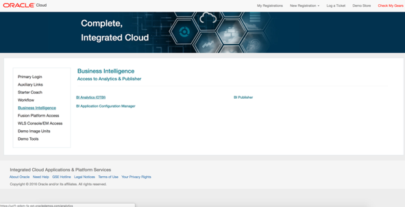
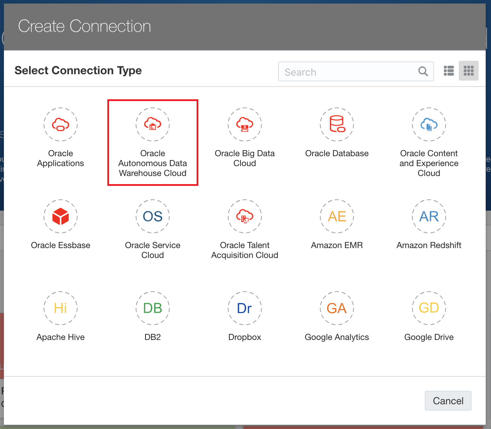
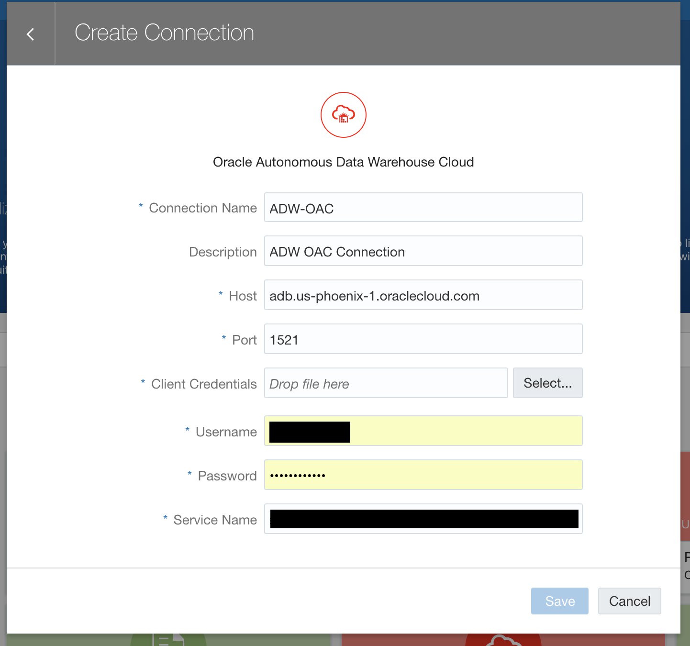

<table class="tbl-heading"><tr><td class="td-logo">

February 28, 2019
</td>
<td class="td-banner">
# Lab 3: Connections from Oracle Analytics Cloud
</td></tr><table>

## Introduction

This lab walks you through the steps to connect to the ERP application and the Oracle Autonomous Data Warehouse (ADW) from Oracle Analytics Cloud (OAC).

## Objectives

-   Learn how to connect to your ERP application from Oracle Analytics Cloud
-   Learn how to connect to your Autonomous Data Warehouse from Oracle Analytics Cloud

## Required Artifacts

-   The following lab requires an ERP application, Oracle Autonomous Data Warehouse Instance and an Oracle Analytics cloud instance. Please follow the steps in previous labs to provision them.

# Part 1. Connecting to ERP application from Oracle Analytics Cloud

In this section you will be connecting to your ERP application from Oracle Analytics Cloud.

#### **STEP 1: Access your ERP Cloud Application**
-  Log into Oracle Transaction Business Intelligence

-  Open the pre-built analyses that you want to review. 

-  **Note:** For future reference, please take note of the titles of the analyses you are reviewing as you will need these to make a connection with Oracle Analytics Cloud.

-  After reviewing the analyses, there is no other information that can be derived from the data there. So, this is where you will use Oracle Analytics Cloud to investigate further.

#### **STEP 2: Go to "Create" -> "Connection" in Oracle Analytics Cloud**
- Choose Oracle Applications in the pop-up menu 

#### **STEP 3: Enter Connection Details**
- Connection Name: Give a name of your choice
- Description: Give a description of your choice
- Host: ERP Application URL
- Username: Credentials to access ERP application
- Password: Password for the given username

#### **STEP 4: Choose the data to add**
Pull in curated data from the analysis previously built in ERP application

#### **STEP 5: Click Add Button to add the dataset**

# Part 2. Connecting to Autonomous Data Warehouse from Oracle Analytics Cloud

In this section you will be connecting to your Autonomous Data Warehouse from Oracle Analytics Cloud.

## Downloading the Connection Wallet

As ADW only accepts secure connections to the database, you need to download a wallet file containing your credentials first. The wallet can be downloaded either from the instance's details page, or from the ADW service console.

#### **STEP 6: Download the Connection Wallet**

-   In your database's instance details page, click **DB Connection**.

-   Under Download a Connection Wallet, click **Download**.

-   Specify a password of your choice for the wallet. You will need this password when connecting to the database via SQL Developer later, and is also used as the JKS keystore password for JDBC applications that use JKS for security. Click **Download** to download the wallet file to your client machine.
*Note: If you are prevented from downloading your Connection Wallet, it may be due to your browser's pop-blocker. Please disable it or create an exception for Oracle Cloud domains.*

- Unzip the downloaded file. We will use the cwallet.sso file to connect from Oracle Analytics Cloud.

#### **STEP 7: Go to "Create" -> "Connection" in Oracle Analytics Cloud**
- Choose Oracle Autonomous Data Warehouse Cloud in the pop-up menu 

#### **STEP 8: Enter Connection Details**

-   Fill in the connection details as below:

    -   **Connection Name:** Give a name of your choice

    -   **Description:** Give a description of your choice

    -   **Host:** Details of where your ADWC is hosted. Ex: adb.us-ashburn-1.oraclecloud.com

    -   **Port:** 1521

    -   **Client Credentials:** Click the **Select button** to point to the location of the cwallet.sso file from the previous step.

    -   **Username:** ADWC Database Username

    -   **Password:** The password for the specified user

    -   **Service Name:** Complete service name obtained from the ADW instance information page.

-   Save your connection by clicking the **Save** button. An entry for the new connection appears under Data -> Connections.

#### **STEP 9: Enter Connection Details**
- Select the table and data by following these steps:

<table>
<tr><td class="td-logo"></td>
<td class="td-banner">
## Great Work - All Done!
**You are ready to move on to the next lab. You may now close this tab.**
</td>
</tr>
<table>
