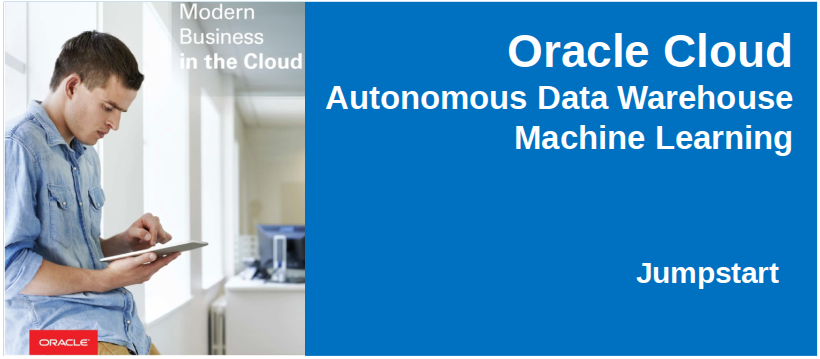

  

# Oracle Autonomous Data Warehouse Machine Learning Demo Lab

## Introduction
_Time to Complete: 30 minutes_

  In this demo lab, you will begin your machine learning development journey by importing an Apache Zeppelin Notebook into Oracle Machine Learning and then use ADWC's Machine Learning to predict customer good credit given detailed demographic information.

## Objectives

- Get hands-on with Oracle's Autonomous Data Warehouse Machine Learning
- Explore the Apache Zeppelin notebook interface
- Create an Attribute Importance Model using the DBMS_Predictive_Analytics.Expain procedure
- Identify customer attributes that are the best predictors of good credit
- Predict credit worthiness of new customers

## Instructions

### Download your Apache Zeppelin Notebook.

**Right click to Download**

[Credit_Score_Predictions.json](https://github.com/downloads/dgcameron/adwcjs/Credit_Score_Predictions.json)

### Log into Oracle Machine Learning.

- Use the following URL to sign into Machine Learning.  Use your assigned userid, with password `Alpha2018___`:  `https://adwc.uscom-east-1.oraclecloud.com/omlusers/login.html?tenant=OCID1.TENANCY.OC1..AAAAAAAA3FF5N7TZN3BUPBW7D5NHFCNUAGNCA5KN7KW4ODBMZMP5FHH6FWLA&database=ORCL&redirect_uri=https://adwc.uscom-east-1.oraclecloud.com/omlusers/api/oauth2/v1/login`

  

