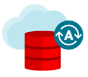
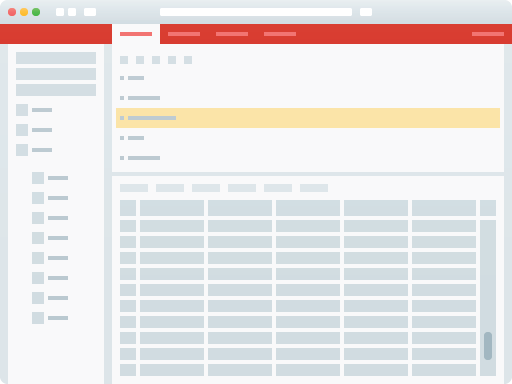

---
# Build, test and deploy applications on Oracle's Cloud! #
The Oracle Learning Library is a place to explore Oracle's products and services.   This library of assests cover everything from the worlds first autonomous database to our world class Generation 2 infrastructure and much more.  Leverage our completely to build, test, and deploy applications on Oracle's Cloud—for free. 

Sign up [here](https://oracle.com/free) to create your account. Visit one of our libraries or start with one of our Quick Start labs. 

## Oracle GitHub Libraries ## 
| | | ||
| ------------- | ------------- |------------- | ------------- |
| 

|

|

|

|
| [Data Management](data-management-library)|[Cloud Infrastructure](oci-library)| [NA Solution Workshops]()|[OSPA](ospa-library)|

## Oracle Cloud Quick Start ##

Just created an Oracle Cloud Free Tier account? Let us get you started.

|  | Provision ADB|
| ------------- | ------------- |
| 

  | Oracle Cloud's Free Tier includes 2 Oracle Autohomous Databases.  Create a world class database on Oracle's Exadata infrastructure in minutes (10 mins).  [Go!](data-management-library/autonomous-database/ziplab) |

|  | Create a Compute Instance|
| ------------- | ------------- |
| 

 | Oracle Cloud's Free Tier includes Oracle Cloud Infrastructure Compute VMs; Block, Object, and Archive Storage; Load Balancer; Monitoring and Notifications.  Create a compute instance now! (10 mins) [Go!](data-management-library/autonomous-database/ziplab) |

|  | Load ADB fron OCI Object Storage with SQL Developer Web|
| ------------- | ------------- |
| 

 | Stage your cloud data in OCI Object Storage.  Provision an ADB instance, connect with SQL Developer Web and load your data directly to ADB. (25 minutes) [Go!](data-management-library/autonomous-database/ziplab) |

|  | Monolithic to Microservices on ATP|
| ------------- | ------------- |
| 

| Let's really explore what you can do in the cloud.  Create a docker application and move it to Kubernetes using all the new skills you've learned. (2 hours) [Go!](data-management-library/autonomous-database/ziplab) |

## How the Free Tier Works ##
Use your Always Free resources as long as you want with no time constraints—subject only to the capacity limits noted. When your 30-day trial period for the expanded set of services ends, you can continue using Always Free services with no interruption.

## [Contributing](CONTRIBUTING.md)
Pull requests are currently not being accepted. See [CONTRIBUTING](CONTRIBUTING.md) for details.

## [License](LICENSE.md)
Copyright (c) 2014, 2016 Oracle and/or its affiliates
The Universal Permissive License (UPL), Version 1.0
