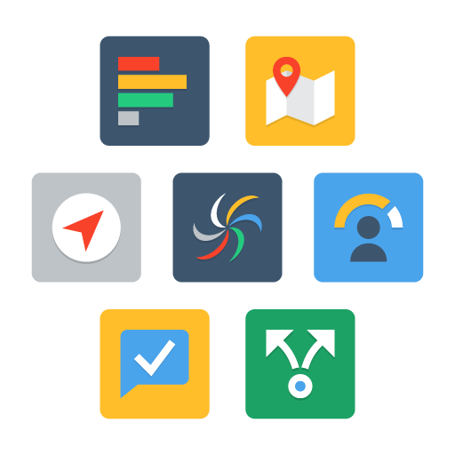

The Oracle Data Management Library is the central location for workshops related to all things Autonomous Database (ADB) Database, Big Data, Data Integration, Machine Learning and Security.  Across multiple deployment options:  on-premises and in the cloud.  

To get started, choose one (or more!) of the defined learning paths below:

## **Autonomous Database Workshop Library Highlights**

|  | OOW19 Drop-in Zip Labs|
| ------------- | ------------- |
|   | Drop-In labs are short (15-20 mins), self-paced, hands-on labs for the Oracle Cloud. Choose from several labs to explore Autonomous Database using Oracle Trial accounts.   **[Click here to launch the lab series](autonomous-database/ziplabs)**  |
|  |**Autonomous Database Certification Labs**|
|  | An Oracle Autonomous Database 2019 Specialist has demonstrated the knowledge required to provision, manage, and migrate to Autonomous Transaction Database (ATP) and Autonomous Data Warehouse (ADW).  It is designed for database administrators, monitors, and Dev Ops admins who want to validate their knowledge and skills. To learn more about this certification click [here](https://education.oracle.com/oracle-autonomous-database-cloud-2019-certified-specialist/trackp_OADB19).  The Database PM team partnered with OSPA to create a series of labs to support the certification. **[Click here to launch the lab series](autonomous-database/certification)** |
| | **ADW Journey Workshop**|
|  | Provision an ADW instance, run queries, load data, manage, scale and use various tools against the ADW instance (Oracle Machine Learning SQL Notebooks, Data Visualization Desktop and Data Integration Platform Cloud). **[Click here to launch the lab](autononmous-database/autonomous-data-warehouse/journey4-adwc)**
| | **ADB Dedicated Workshop**|
|  | Provision Exadataa in a private OCI network, an Autonomous Container Database and databases on your dedicated Exadata Infrastructure.  Build and deploy Python, node.js and Java applications stacks on dedicated autonomoous, use OCI cli commands and more! **[Click here to launch the lab](autonomous-transaction-processing/dedicated)**
 

## **Security Workshop Library Highlights**

|  | OOW19 Data Safe Labs|
| ------------- | ------------- |
| | Practice the main features in Oracle Data Safe, including Activity Auditing, Data Discovery, Data Masking, User Assessment, and Security Assessment.   **[Click here to launch the lab series](security/data-safe)**  |

## **Develop on ADB Library Highlights**

|  | OOW19 APEX Labs|
| ------------- | ------------- |
|  |  Upload a spreadsheet into an Oracle database table and create an application based on this new table. You will then play with the Interactive Report and improve the attached form. Lastly add a Calendar page and then link it to the existing form page.   **[Click here to launch the lab series](autonomous-database/ziplabs/2019/atp-apex-spreadsheet-app)**  |

## **Database Tools Library Highlights**

New Library coming soon!

## Helpful Links ##

**Autonomous Database Cloud Specialist Certification** - [Learn More]([here](https://education.oracle.com/oracle-autonomous-database-cloud-2019-certified-specialist/trackp_OADB19))

