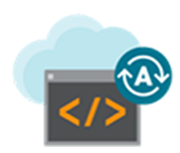

# Oracle Data Management Library

The Oracle Data Management Library is the central location for workshops related to all things Database, Big Data, Data Integration, Machine Learning and Security.  Across multiple deployment options:  on-premises and in the cloud.  

To get started, choose one (or more!) of the defined learning paths below:

## **Autonomous Database Library**

### OOW Drop-in Zip Labs ###

|  | |
| ------------- | ------------- |
|    | Drop-In labs are short (15-20 mins), self-paced, hands-on labs for the Oracle Cloud. Choose from several labs to explore Autonomous Database using Oracle Trial accounts. |
| |**[Click here to launch the lab series](autonomous-database/ziplabs)**  |

### Certification Labs ###

|  | |
| ------------- | ------------- |
|   | An Oracle Autonomous Database 2019 Specialist has demonstrated the knowledge required to provision, manage, and migrate to Autonomous Transaction Database (ATP) and Autonomous Data Warehouse (ADW).  It is designed for database administrators, monitors, and Dev Ops admins who want to validate their knowledge and skills. To learn more about this certification click [here](https://education.oracle.com/oracle-autonomous-database-cloud-2019-certified-specialist/trackp_OADB19).  The Database PM team partnered with OSPA to create a series of labs to support the certification. |
| |**[Click here to launch the lab series](autonomous-database/certification)** |

---

### ADW Workshop ###

#### Workshop goals: ####

- Get comfortable with Oracle's public cloud services
- Provision a new ADW instance
- Run sample queries against the sample data sets
- Load data from the object store
- Query external data from the object store
- Manage and Monitor an ADW instance
- Scale an ADW instance
- Use Oracle Machine Learning SQL notebooks
- Use Oracle Data Visualization Desktop (DVD) with ADW
- Use Oracle Data Integration Platform Cloud (DIPC) with ADW

 **[Click here to launch the lab](autonomous-data-warehouse/journey4-adwc)**

 ---

 ### ATP - Dedicated Workshop

#### Workshop goals: ####

- Prepare your private network in the Oracle Cloud Infrastructure
- Provision Exadata Infrastructure in a private OCI network
- Provision an Autonomous Container Database
- Provision databases on your dedicated Autonomous Infrastructure
- Setup VPN Connectivity to your Autonomous Exadata Infrastructure
- Configure a development system for use with your dedicated autonomous database
- Build and deploy Python application stacks on dedicated autonomous infrastructure
- Build and deploy node.js application stacks on dedicated autonomous infrastructure
- Build and deploy Java application stacks on dedicated autonomous infrastructure
- Use OCI CLI commands to work with your Autonomous databases
- Invoke and use the sqldevweb console
- Build apex applications on dedicated autonomous database
- Manage database & performance using SQL Developer Web and Performance Hub
- Migrate an on-prem application schema using Data Pump
- Setup live migration of business critical databases using Oracle Goldengate replication

 **[Click here to launch the lab](autonomous-transaction-processing/dedicated)**
 
 ---

 ## Security Library ##

Workshop Goals:

- Coming soon

