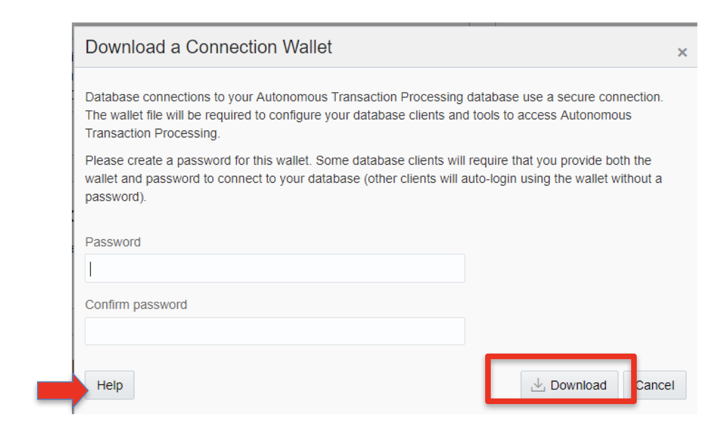
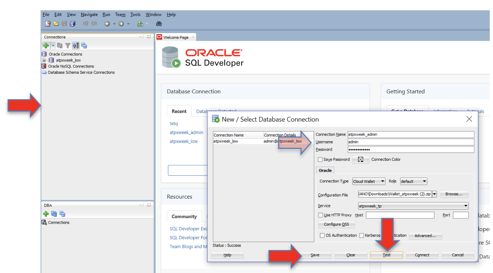
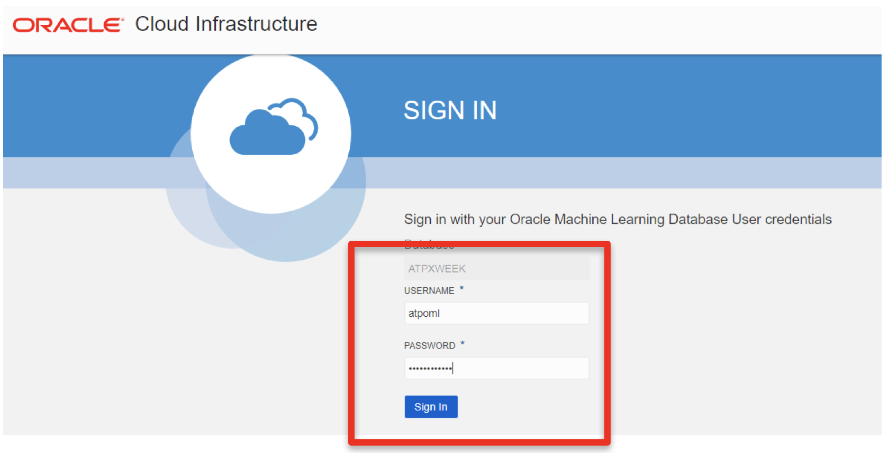
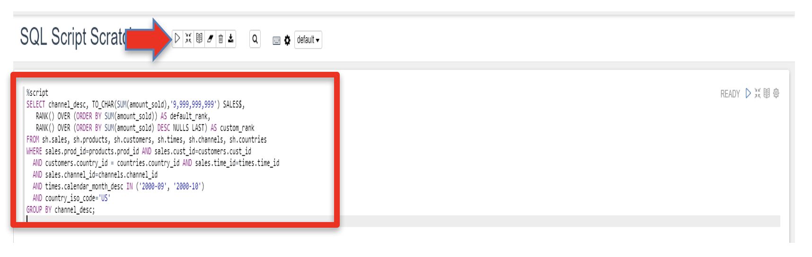

# Connecting to Autonomous Database

## Table of Contents

- [Module 1: Download Client Credentials](#module-1--download-the-client-credentials-wallet)
- [Module 2: Explore credentials wallet file information](#module-2--examining-the-wallet-file)
- [Module 3: Connect to your ATP instance with SQL Developer](#module-3--connecting-to-the-database-using-sql-developer)
- [Module 4: Connect to your ATP instance with Oracle ML Notebooks](#module-4--connecting-to-the-database-using-oracle-machine-learning-oml)

***** 

## Module 1:  Download the Client Credentials (wallet)

The connection wallet provides the only authentication information that
can be used to connect to your ATP database. This wallet must be
downloaded to the client that will be connecting to the database. The
wallet can be downloaded from two locations, the Database Details page
or the Service Console

1. The wallet is downloaded from the **Administration** page in the ATP
service console. Continuing from where we left off in the previous lab,
select **Download Client Credentials:**


<p align="center">Figure 1-1</p>

2. Specify a password of your choice for the wallet. Note that this
password is separate from the **Admin** user password created earlier
(but the same password can be used). Make sure you know where the file
gets downloaded to so you can find it on your system.


<p align="center">Figure 1-2</p>

3. **Alternatively** use the DB Connection button in the main Database
Details page to download the credentials:


<p align="center">Figure 1-3</p>

4. This step opens up a screen where the wallet can be downloaded as well as
connection strings be copied from (more on this in other modules)


[Back to Top](#table-of-contents)

***** 

## Module 2:  Examining the Wallet File

1. Navigate to the location in your system where the file was downloaded
(typically your DOWNLOADS directory). 
2. In this example the file will be called *wallet\_ATPXWEEK.zip*, the format of the file is always
“wallet\_$dbname.zip”. 
3. Extract the contents of the wallet into a
directory (using a zip utility, usually by right clicking on the file),
you will find the following files:


<p align="center">Figure 2-1</p>

4. There are 4 files you will be working with during the different labs.
Some tools use the wallet file (.zip) and some use specific files
contained in the wallet. The files used in the labs are:

1.  **wallet\_ATPXWEEK.zip** – the wallet itself

2.  **sqlnet.ora** – points to the location of the wallet for sqlnet
    connections

3.  **tnsnames.ora** – connection description for the database service
    (please note this file contains connection description for all the
    databases that exist in that cloud account)

4.  **ojdbc.properties** – points to the location of the wallet for jdbc
    connections
    
[Back to Top](#table-of-contents)   

***** 

## Module 3:  Connecting to the Database using SQL Developer 

*(Make sure you are running the latest version of SQL Developer 18.4. Some older versions will not work with ATP, see lab introductions on how to install)*

1. Start SQL Developer (by clicking the icon on your desktop or selecting
from the Windows Start menu) and create a connection for your database
using the default administrator account, ADMIN, by following these
steps.

2. Click the **Create Connection** icon in the Connections toolbox on the
top left of the SQL Developer homepage.


<p align="center">Figure 3-1</p>

3. The new Database Connection screen will appear:


<p align="center">Figure 3-2</p>

4. Fill in the connection details as below:

**Connection Name:** `admin`
**Username:** `admin`
**Password:** *The admin password you specified during database provisioning*
**Connection Type:** *Cloud Wallet*
**Configuration File:** Enter the full path for the wallet file you downloaded before (in my example wallet\_ATPXWEEK.zip), or click the Browse button to point to the location of the file.


<p align="center">Figure 3-3</p>

**Service:** *select the service configured specifically for ATP services ( **$dbname\_TP** service) for you database. Many services may be listed but make sure you pick the one for with the database name you created. In this example its **atpxweek\_TP.

5. Test your connection by clicking the **Test** button, if it succeeds

6. Save your connection information by clicking **Save**

7. Connect to your database by clicking the **Connect** button.

8. See below for completed input and test. Notice also that after you save
your connection it will appear on the list of connections on the top
left corner of the main dashboard, under connections.


<p align="center">Figure 3-4</p>

9. Now that you are connected run test a query. The ATP (or ADW) database
you created contains the sample Oracle Sales History (SH) schema, we
will use this schema to run a test query to make sure everything is
working correctly. 

10. Copy the SQL below and paste it on the query builder
screen in SQL Developer (with standard Windows copy and paste), then
click F5 or the “Run Script” button as indicated below. Make sure you
are connected to your database, per the last step on the previous
process.

```
    SELECT channel_desc, TO_CHAR(SUM(amount_sold),'9,999,999,999')
    SALES$,  
    RANK() OVER (ORDER BY SUM(amount_sold)) AS default_rank,  
    RANK() OVER (ORDER BY SUM(amount_sold) DESC NULLS LAST) AS
    custom_rank  
    FROM sh.sales, sh.products, sh.customers, sh.times, sh.channels,
    sh.countries  
    WHERE sales.prod_id=products.prod_id AND
    sales.cust_id=customers.cust_id  
    AND customers.country_id = countries.country_id AND
    sales.time_id=times.time_id  
    AND sales.channel_id=channels.channel_id  
    AND times.calendar_month_desc IN ('2000-09', '2000-10')  
    AND country_iso_code='US'  
    GROUP BY channel_desc;
```


<p align="center">Figure 3-4</p>

11. And you will see the result of your query on the bottom **Script Output** section


<p align="center">Figure 3-5</p>

**You have successfully connected and run an operation against ATP with SQL Developer. We will use SQL Developer throughout other labs.**

[Back to Top](#table-of-contents) 
***** 

## Module 4:  Connecting to the Database using Oracle Machine Learning (OML)

Another tool that can be used to connect and develop in ATP is the
included Oracle Machine Learning OML Notebook based environment. Because
OML is easy to access from anywhere and included with the ATP service it
provides an easy and fast environment to work with ATP. This
browser-based application provides a web interface to run SQL queries
and scripts, which can be grouped together within a notebook. Notebooks
can be used to build single reports, collections of reports and
dashboards. OML provides a simple way to share workbooks with other OML
users.

## OML Key Features

  - Collaborative SQL notebook UI for data scientists  

  - Packaged with Oracle Autonomous Transaction Processing Cloud Service

  - Easy access to shared notebooks, templates, permissions, scheduler,
    etc.

  - Access to 30+ parallel, scalable in-database implementations of
    [machine learning
    algorithms](https://docs.oracle.com/en/database/oracle/oracle-database/12.2/dmcon/algorithms.html#GUID-B901A29B-218C-4F37-91E0-AA94631364E3)

  - SQL and PL/SQL scripting language support

  - Enables and Supports Deployments of Enterprise Machine Learning
    Methodologies.

Once you have a database created in ATP, we need to create an OML user,
which is equivalent to creating a database user.

1. If you are not already logged into the ATP Service Console, in the main
ATP service page select Service Console:


<p align="center">Figure 4-1</p>

2. On the next page log in with your ADMIN ATP user name/password and click **Sign in:**

3. Select Administration from the top left and once on the Administration
page select **Manage Oracle ML Users**:


<p align="center">Figure 4-2</p>

4. If required (you may not see this page), log into the OML Administration
console which is different than the database administration console but
uses the same ADMIN account created when the database was created. Fill
in the **ADMIN password** and click **Sign In**


<p align="center">Figure 4-3</p>

5. Next create the actual OML user. Click the **Create** button:


<p align="center">Figure 4-4</p>

6. This will open up the user creation page, fill in the information for
your new OML user and click **Create**. This is a completely new user
account that will be used anytime you want to access OML. Make sure you
keep this information. Notice that you can specify an email address
where your user information and a direct link to the OML login will be
emailed to you. This will help you later when you need to reconnect to
OML.


<p align="center">Figure 4-5</p>

7. **You now have a new OML user\!** To connect to OML as your new user,
click on the Home Icon on the top right, pointed at by the arrow (or the
link you received by email). This will open up a new tab with the OML
home page. This time log in with the user you just created.


<p align="center">Figure 4-6</p>


<p align="center">Figure 4-7</p>


8. You are connected as an OML Notebook user. Run the same query we ran in
SQL Developer now in OML. Select **Run SQL Scripts** from Quick Actions:


<p align="center">Figure 4-8</p>

9. Copy the same SQL statement you ran in SQL Developer above and paste it
right under the **%script** statement then select the **Run all
Paragraphs** icon, as shown below:


<p align="center">Figure 4-9</p>

10. The results are shown below (and same as on SQL Developer):


<p align="center">Figure 4-10</p>

**You have successfully connected and run an operation against ATP with Oracle OML. We will use OML in other labs.**

***END OF LAB***

[Back to Top](#table-of-contents)   
