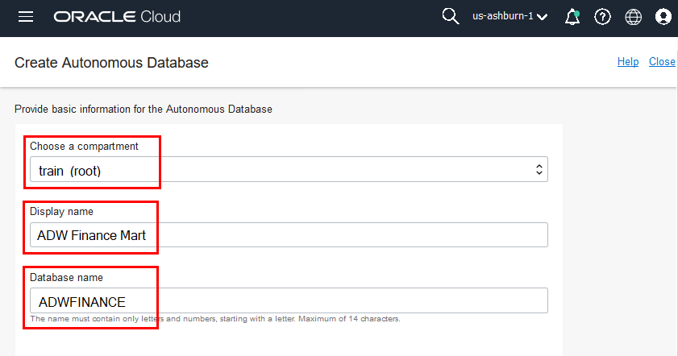
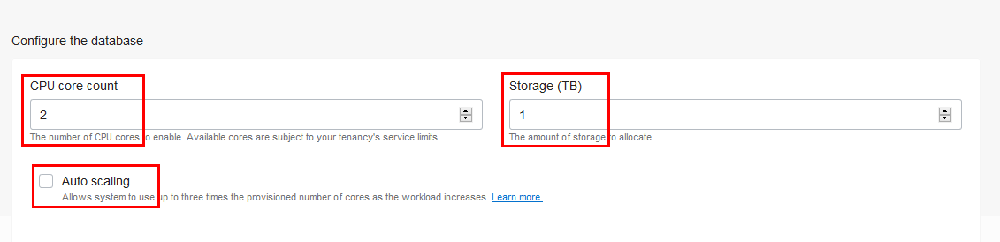
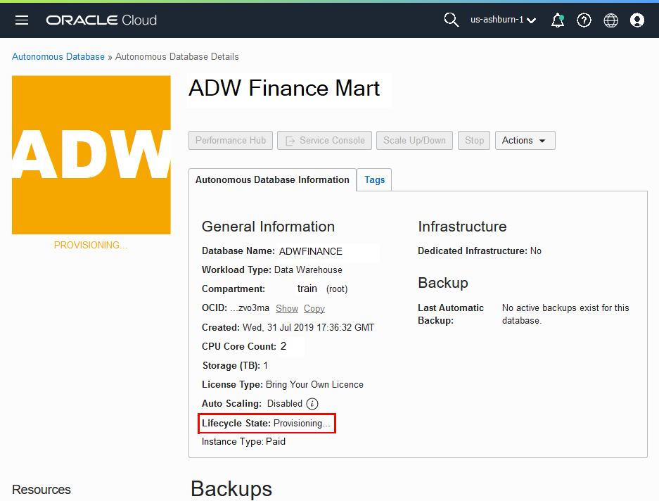
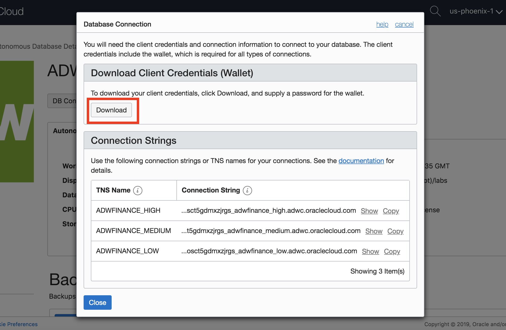

<table class="tbl-heading"><tr><td class="td-logo">

<!-- August 26, 2019 -->
</td>
<td class="td-banner">
# Lab 1: Getting Started with Autonomous Data Warehouse (ADW)
</td></tr><table>

## Introduction

This lab walks you through the steps to get started using the Oracle Autonomous Data Warehouse (ADW) on Oracle Infrastructure Cloud (OCI). You will provision a new ADW instance and connect to the database using Oracle SQL Developer.

<a href="https://www.youtube.com/watch?v=Q6hxMaAPghI&autoplay=0&html5=1" target="_blank">Click here to watch a video demonstration</a> of provisioning a new autonomous data warehouse.

<a href="https://www.youtube.com/watch?v=PHQqbUX4T50&autoplay=0&html5=1" target="_blank">Click here to watch a video demonstration</a> of connecting to your new Autonomous Data Warehouse using SQL Developer.

To **log issues**, click <a href="https://github.com/millerhoo/journey4-adwc/issues/new" target="_blank"> here </a> to go to the github oracle repository issue submission form.

## Objectives

-   Learn how to provision a new Autonomous Data Warehouse

-   Learn how to connect to your new Autonomous Data Warehouse

## Required Artifacts

-   The following lab requires an Oracle Public Cloud account. You may use your own cloud account, a cloud account that you obtained through a trial, or a training account whose details were given to you by an Oracle instructor.

-   Oracle SQL Developer 19.2 or later is recommended (see <a href="http://www.oracle.com/technetwork/developer-tools/sql-developer/downloads/index.html" target="_blank">Oracle Technology Network download site.</a>)
    Please use SQL Developer version 18.3 or later as this version contains enhancements for key Autonomous Data Warehouse features, including using ADW behind a VPN or Firewall.

    **Note:** If you are a Windows user on 64-bit platform, download the 'Windows 64-bit with JDK 8 included' distribution as it includes both Java 8 and the Java Cryptography Extension (JCE) files necessary to run SQL Developer and connect to your Autonomous Data Warehouse.
    If you are a non-Windows user, download and install the appropriate [Java 8 JDK](http://www.oracle.com/technetwork/java/javase/downloads/jdk8-downloads-2133151.html) for your Operating System. Download and extract the [Java Cryptography Encryption Archive](http://www.oracle.com/technetwork/java/javase/downloads/jce8-download-2133166.html) to the directory as indicated in the README.txt.

# Part 1. Provisioning an ADW Instance

In this section you will be provisioning an ADW instance using the cloud console.

#### **STEP 1: Sign in to Oracle Cloud**

-   Go to [cloud.oracle.com](https://cloud.oracle.com), click **Sign In** to sign in with your Oracle Cloud account.

-   Enter your **Cloud Account Name** and click **Next**.

-   Enter your Oracle Cloud **username** and **password**, and click **Sign In**.

#### **STEP 2: Create an ADW Instance**

-   Once you are logged in, you are taken to the cloud services dashboard where you can see all the services available to you. Click the navigation menu in the upper left to show top level navigation choices.

__Note:__ You can also directly access your Autonomous Data Warehouse service in the __Quick Actions__ section of the dashboard.

- Click **Autonomous Data Warehouse**.

- Make sure your workload type is __Data Warehouse__ or __All__ to see your Autonomous Data Warehouse instances. You can use the __List Scope__ drop-down menu to select a compartment. Select your __root compartment__, or __another compartment of your choice__ where you will create your new ADW instance. If you want to create a new compartment or learn more about them, click <a href="https://docs.cloud.oracle.com/iaas/Content/Identity/Tasks/managingcompartments.htm#three" target="_blank">here</a>.

 __Note__ - Avoid the use of the ManagedCompartmentforPaaS compartment as this is an Oracle default used for Oracle Platform Services.
- This console shows that no databases yet exist. If there were a long list of databases, you could filter the list by the state of the databases (available, stopped, terminated, and so on). You can also sort by __Workload Type__. Here, the __Data Warehouse__ workload type is selected.

- You can see your current default **region** in the top, right hand corner of the page. Go ahead and select a different available region such as **Phoenix** or **Toronto**.

 

-  Click **Create Autonomous Database** to start the instance creation process.

-  This brings up the __Create Autonomous Database__ screen where you will specify the configuration of the instance.
- Provide basic information for the autonomous database:

 - __Choose a compartment__ - Select a compartment for the database from the drop-down list.
 - __Display Name__ - Enter a memorable name for the database for display purposes. For this lab, use __ADW Finance Mart__.
 - __Database Name__ - Use letters and numbers only, starting with a letter. Maximum length is 14 characters. (Underscores not initially supported.) For this lab, use __ADWFINANCE__.

 

- Choose a workload type. Select the workload type for your database from the choices:

 - __Data Warehouse__ - For this lab, choose __Data Warehouse__ as the workload type.
 - __Transaction Processing__ - Alternately, you could have chosen Transaction Processing as the workload type.

 

- Configure the database:

 - __Always Free__ - For this lab, do not select this option.
 - __CPU core count__ - Number of CPUs for your service. For this lab, specify __2 CPUs__.
 - __Storage (TB)__ - Select your storage capacity in terabytes. For this lab, specify __1 TB__ of storage.
 - __Auto Scaling__ - For this lab, __do not__ specify auto scaling.

  

- Create administrator credentials:

 - __Password and Confirm Password__ - Specify the password for ADMIN user of the service instance. The password must meet the following requirements:
 - The password must be between 12 and 30 characters long and must include at least one uppercase letter, one lowercase letter, and one numeric character.
 - The password cannot contain the username.
 - The password cannot contain the double quote (") character.
 - The password must be different from the last 4 passwords used.
 - The password must not be the same password that is set less than 24 hours ago.
 - Re-enter the password to confirm it. Make a note of this password.

   

- Choose a license type. For this lab, choose __License Included__. The two license types are:

 - __Bring Your Own License (BYOL)__ - Select this type when your organization has existing database licenses.
 - __License Included__ - Select this type when you want to subscribe to new database software licenses and the database cloud service.

- Click __Create Autonomous Database__.

-  Your instance will begin provisioning. In a few minutes the state will turn from Provisioning to Available. At this point, your Autonomous Data Warehouse database is ready to use! Have a look at your instance's details here including its name, database version, CPU count and storage size.

# Part 2. Connecting to ADW

## Downloading the Connection Wallet

As ADW only accepts secure connections to the database, you need to download a wallet file containing your credentials first. The wallet can be downloaded either from the instance's details page, or from the ADW service console.

#### **STEP 4: Download the Connection Wallet**

-   In your database's instance details page, click **DB Connection**.

-   Under Download a Connection Wallet, click **Download**.

-   Specify a password of your choice for the wallet. You will need this password when connecting to the database via SQL Developer later, and is also used as the JKS keystore password for JDBC applications that use JKS for security. Click **Download** to download the wallet file to your client machine.
*Note: If you are prevented from downloading your Connection Wallet, it may be due to your browser's pop-blocker. Please disable it or create an exception for Oracle Cloud domains.*

## Connecting to the database using SQL Developer

Start SQL Developer and create a connection for your database using the default administrator account 'ADMIN' by following these steps.

#### **STEP 5: Connect to the database using SQL Developer**

-   Click the **New Connection** icon in the Connections toolbox on the top left of the SQL Developer homepage.

-   Fill in the connection details as below:

    -   **Connection Name:** admin_high

    -   **Username:** admin

    -   **Password:** The password you specified during provisioning your instance

    -   **Connection Type:** Cloud Wallet

    -   **Configuration File:** Enter the full path for the wallet file you downloaded before, or click the **Browse button** to point to the location of the file.

    -   **Service:** There are 3 pre-configured database services for each database. Pick **&lt;databasename&gt;_high** for this lab. For
        example, if you the database you created was named adwfinance, select adwfinance_high as the service.

*Note* : SQL Developer versions prior to 18.3 ask for a **Keystore Password.** Here, you would enter the password you specified when downloading the wallet from ADW.

-   Test your connection by clicking the **Test** button, if it succeeds save your connection information by clicking **Save**, then connect to your database by clicking the **Connect** button. An entry for the new connection appears under Connections.

-   If you are behind a VPN or Firewall and this Test fails, make sure you have <a href="https://www.oracle.com/technetwork/developer-tools/sql-developer/downloads/index.html" target="_blank">SQL Developer 18.3</a> or higher. This version and above will allow you to select the "Use HTTP Proxy Host" option for a Cloud Wallet type connection. While creating your new ADW connection here, provide your proxy's Host and Port. If you are unsure where to find this, you may look at your computer's connection settings or contact your Network Administrator.

<table>
<tr><td class="td-logo"></td>
<td class="td-banner">
## Great Work - All Done!
**You are ready to move on to the next lab. You may now close this tab.**
</td>
</tr>
<table>
