# Connecting to Autonomous Database

## Table of Contents

- [Module 1: Download Client Credentials](#module-1--download-the-client-credentials-wallet)
- [Module 2: Explore credentials wallet file information](#module-2--examining-the-wallet-file)
- [Module 3: Connect to your ATP instance with SQL Developer](#module-3--connecting-to-the-database-using-sql-developer)
- [Module 4: Connect to your ATP instance with Oracle ML Notebooks](#module-4--connecting-to-the-database-using-oracle-machine-learning-oml)

***** 

## Module 1:  Download the Client Credentials (wallet)

The connection wallet provides the authentication information that
can be used to connect to your Autonomous database.  The
wallet can be downloaded from two locations, the Database Details page
or the Service Console, under the Administration tab.

1.  Let's download the wallet from the Database Details page. Click on **DB Connection**.

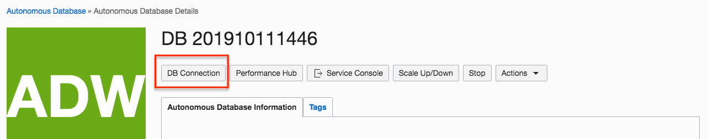
<p align="center">Figure 1-1</p>

2. Here you will click on **Download** to download the wallet.  You can also veiw the connection strings to use with your TNS names.

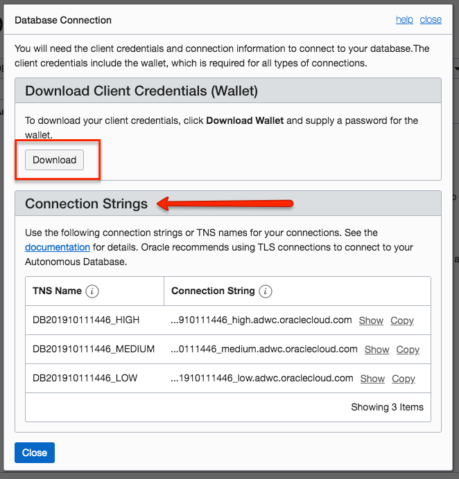
<p align="center">Figure 1-2</p>

3. Specify a password of your choice for the wallet. Note that this
password is separate from the **Admin** user password created earlier
(but the same password can be used). 

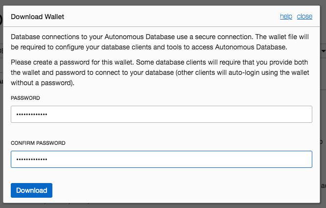
<p align="center">Figure 1-3</p>

4.  Make sure you know where the file  gets downloaded to so you can find it on your system.  Depending on your browser, you can open your file window or open the zip file by select the 'V' by the file name.

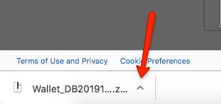
<p align="center">Figure 1-4</p>

5. **Alternatively** you can download the wallet from the Service Console. The wallet is downloaded from the **Administration** page in the Autonomous Database service console. 

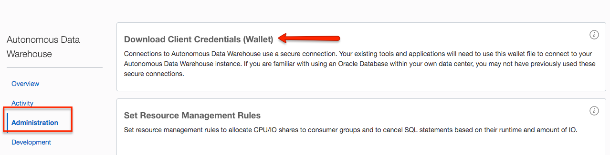
<p align="center">Figure 1-5</p>


[Back to Top](#table-of-contents)

***** 

## Module 2:  Examining the Wallet File

1. Navigate to the location in your system where the file was downloaded
(typically your DOWNLOADS directory). 

2. The format of the file is always
“wallet\_$dbname.zip”.   My zip file was called Wallet_DB201910111446.zip because that is the name of my database.

3. Extract the contents of the wallet into a
directory (using a zip utility, usually by right clicking on the file),
you will find the following files:

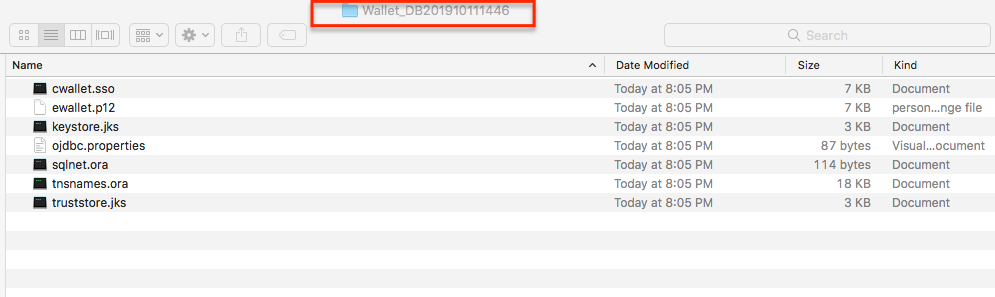
<p align="center">Figure 2-1</p>

4. There are 4 files you will be working with during the different labs.
Some tools use the wallet file (.zip) and some use specific files
contained in the wallet. 

*  **Wallet_DB201910111446.zip** – the wallet itself

*  **sqlnet.ora** – points to the location of the wallet for sqlnet
    connections

*  **tnsnames.ora** – connection description for the database service
    (please note this file contains connection description for all the
    databases that exist in this cloud account)

*  **ojdbc.properties** – points to the location of the wallet for jdbc
    connections
    
[Back to Top](#table-of-contents)   

***** 

## Module 3:  Connecting to the Database using SQL Developer 

We are going to use SQL Developer Web interface from the Oracle Cloud.  

1. From the **Service Console**, click on **Development**.  This will display the options that you can run directly from the Oracle Cloud.  Click on **SQL Developer Web**.


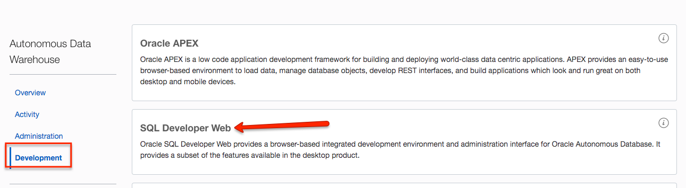
<p align="center">Figure 3-1</p>

2.  Connect to SQL Dev Web by supplying your login credentials and press **Sign in**. For the Username/Password, you can use **admin** and the password when you provisioned your autonomomous database.

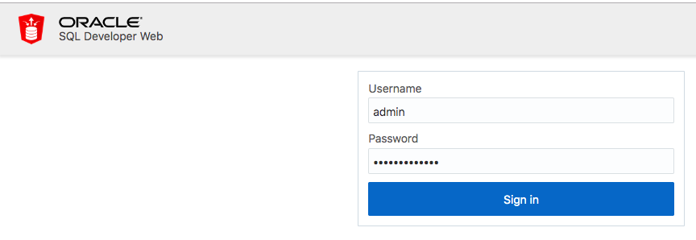
<p align="center">Figure 3-2</p>

3.  Once you are connected, a new tab will open for Sql Developer Worksheet.    If this is the first time that you have logged in, you can view a quick highlight of the features.

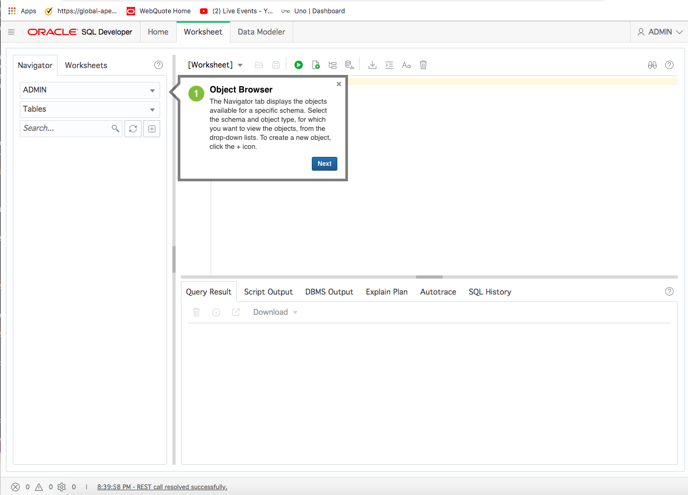
<p align="center">Figure 3-3</p>

4. You can view the features at anytime, by clicking on the binoculars on the right had side of the page.

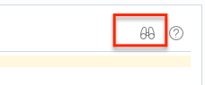
<p align="center">Figure 3-4</p>

5. Now that you are connected, we will run a query. The Autonomus database
you created contains the sample Oracle Sales History (SH) schema, we
will use this schema to run a test query to make sure everything is
working correctly. 

6. Copy the SQL below and paste it into the worksheet (with standard Windows copy and paste), then click on the “Run Script” button as indicated below. 

```
    SELECT channel_desc, TO_CHAR(SUM(amount_sold),'9,999,999,999')
    SALES$,  
    RANK() OVER (ORDER BY SUM(amount_sold)) AS default_rank,  
    RANK() OVER (ORDER BY SUM(amount_sold) DESC NULLS LAST) AS
    custom_rank  
    FROM sh.sales, sh.products, sh.customers, sh.times, sh.channels,
    sh.countries  
    WHERE sales.prod_id=products.prod_id AND
    sales.cust_id=customers.cust_id  
    AND customers.country_id = countries.country_id AND
    sales.time_id=times.time_id  
    AND sales.channel_id=channels.channel_id  
    AND times.calendar_month_desc IN ('2000-09', '2000-10')  
    AND country_iso_code='US'  
    GROUP BY channel_desc;
```

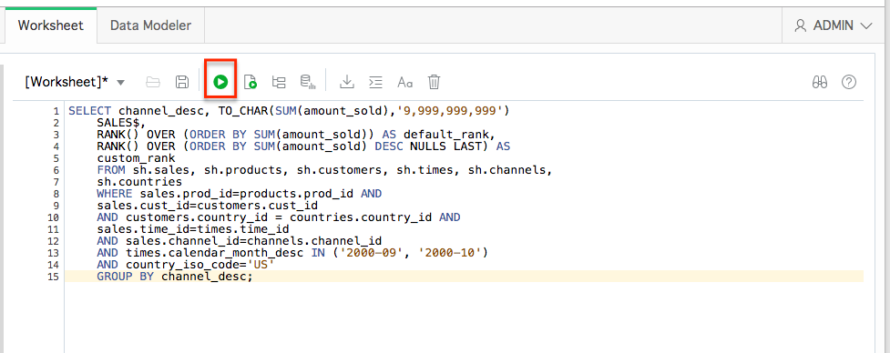
<p align="center">Figure 3-5</p>

7. You will see the result of your query on the bottom **Query Result** section

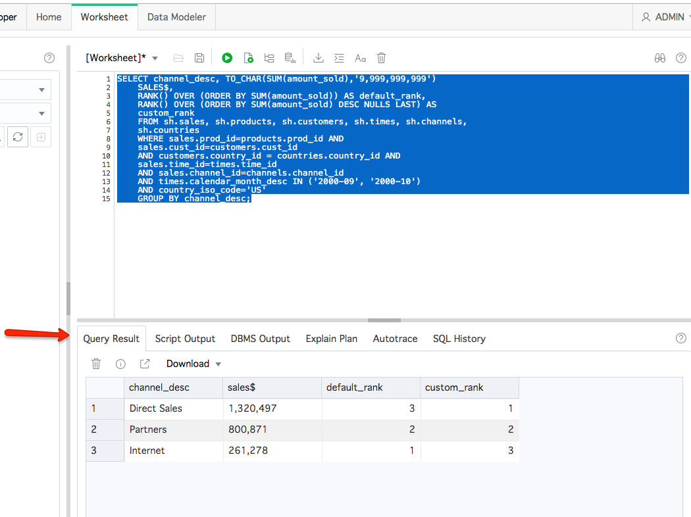
<p align="center">Figure 3-6</p>

8.  SQL Developer Web also has a feature called **Data Modeler**.  Click on the **Data Modeler** tab.  Change the schema from Admin to SH, and select Tables object.  You will see the sample data tables that are owned by SH.  Then drag the Channels table and Cost table into the Data Modeler section.  It will then pictorially show you the relationship between the two tables.

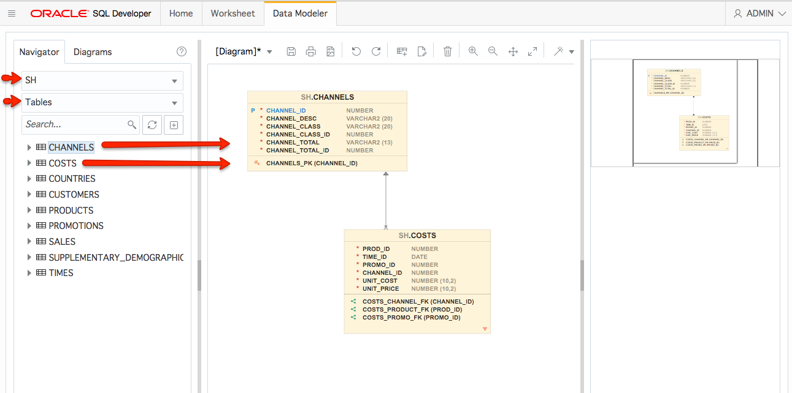
<p align="center">Figure 3-7</p>

[Back to Top](#table-of-contents) 
***** 

## Module 4:  Connecting to the Database using Oracle Machine Learning (OML)

Another tool that can be used to connect and develop in Autonomous Database is the
included Oracle Machine Learning OML Notebook based environment. Because
OML is easy to access from anywhere and included with the Autonomous service it
provides an easy and fast environment to work with ATP. This
browser-based application provides a web interface to run SQL queries
and scripts, which can be grouped together within a notebook. Notebooks
can be used to build single reports, collections of reports and
dashboards. OML provides a simple way to share workbooks with other OML
users.

## OML Key Features

  - Collaborative SQL notebook UI for data scientists  

  - Packaged with Oracle Autonomous Transaction Processing Cloud Service

  - Easy access to shared notebooks, templates, permissions, scheduler,
    etc.

  - Access to 30+ parallel, scalable in-database implementations of
    [machine learning
    algorithms](https://docs.oracle.com/en/database/oracle/oracle-database/12.2/dmcon/algorithms.html#GUID-B901A29B-218C-4F37-91E0-AA94631364E3)

  - SQL and PL/SQL scripting language support

  - Enables and Supports Deployments of Enterprise Machine Learning
    Methodologies.

Once you have a database created in Autonomous Database, we need to create an OML user,
which is equivalent to creating a database user.

1. If you are not already logged into the Service Console, in the main
Autonomous Database details page select Service Console:

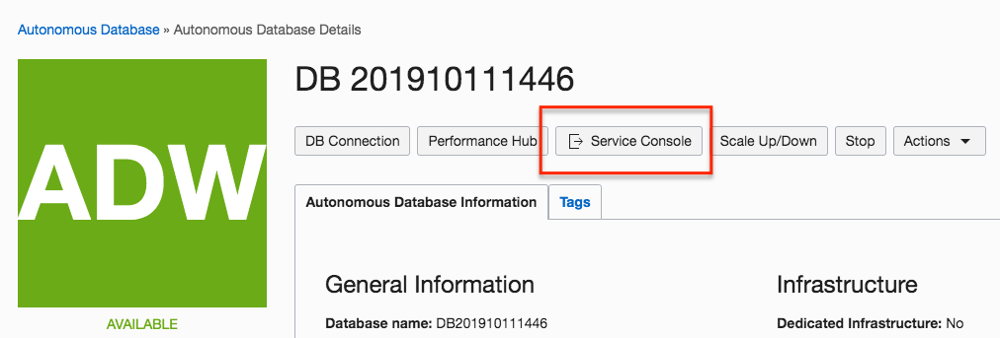
<p align="center">Figure 4-1</p>


2. Select Administration from the top left and once on the Administration
page select **Manage Oracle ML Users**:

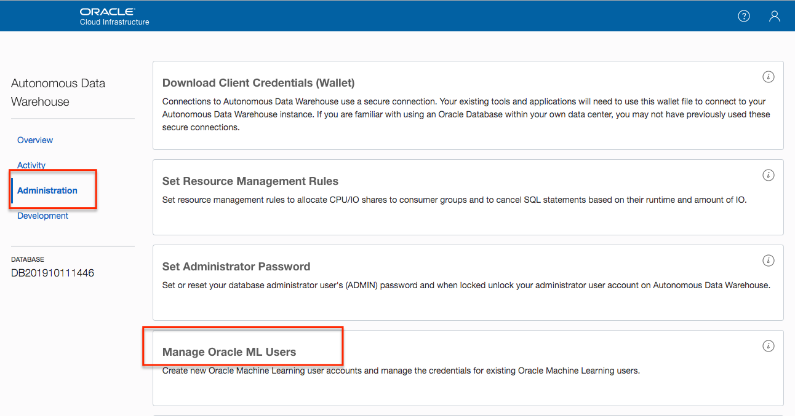
<p align="center">Figure 4-2</p>

3. If required (you may not see this page), log into the OML Administration
console which is different than the database administration console but
uses the same ADMIN account created when the database was created. Fill
in the **ADMIN password** and click **Sign In**

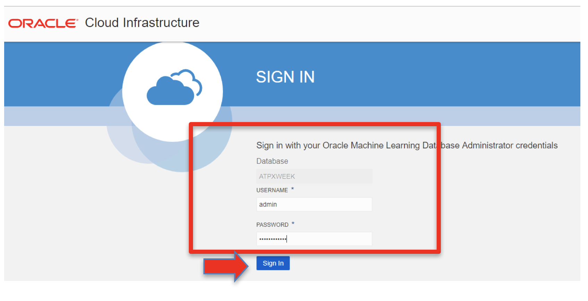
<p align="center">Figure 4-3</p>

4. Next create the actual OML user. Click the **Create** button:


<p align="center">Figure 4-4</p>

5. This will open up the user creation page, fill in the information for
your new OML user and click **Create**. This is a completely new user
account that will be used anytime you want to access OML. Make sure you
keep this information. Notice that you can specify an email address
where your user information and a direct link to the OML login will be
emailed to you. This will help you later when you need to reconnect to
OML.  Unchceck Generate Password ... and supply a password for the new OML user.

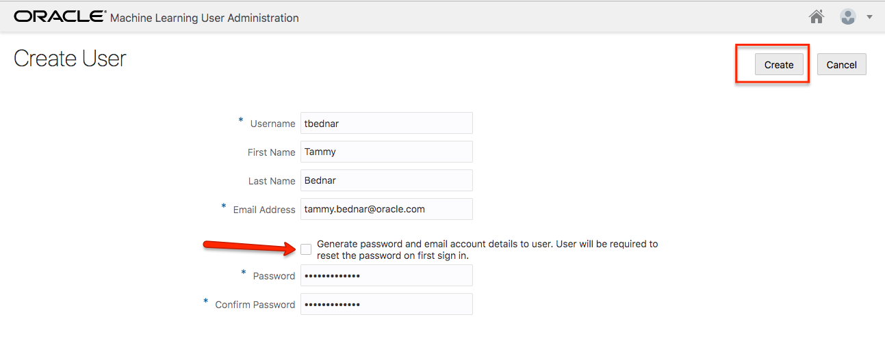
<p align="center">Figure 4-5</p>

6. **You now have a new OML user\!** To connect to OML as your new user,
click on the Home Icon on the top right, pointed at by the arrow (or the
link you received by email). This will open up a new tab with the OML
home page. This time log in with the user you just created.

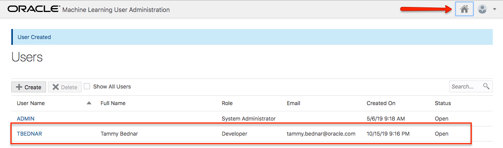
<p align="center">Figure 4-6</p>

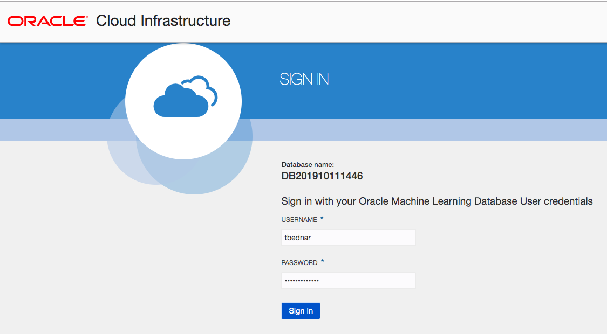
<p align="center">Figure 4-7</p>


7. You are connected as an OML Notebook user. Run the same query we ran in
SQL Developer now in OML. Select **Run SQL Scripts** from Quick Actions:

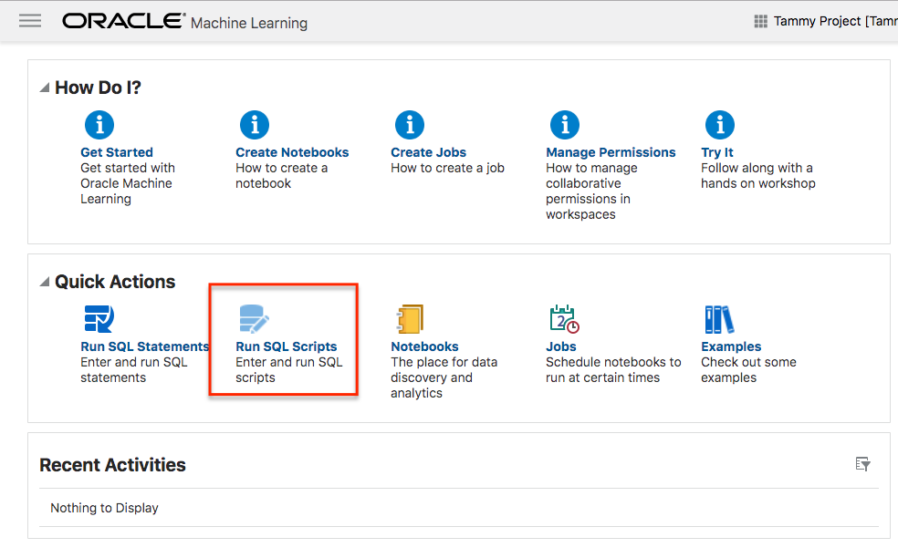
<p align="center">Figure 4-8</p>

8. Copy the same SQL statement you ran in SQL Developer above and paste it
right under the **%script** statement then select the **Run all
Paragraphs** icon, as shown below:

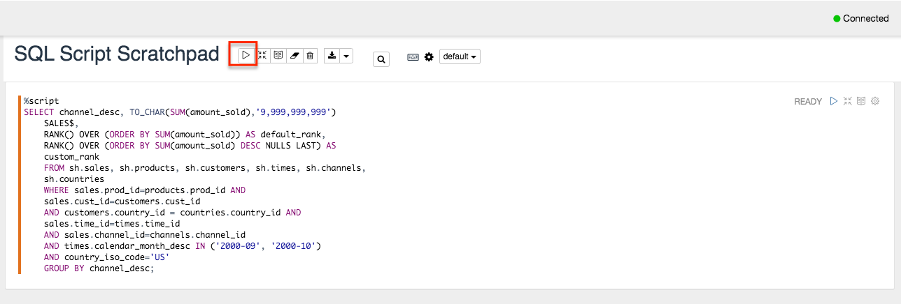
<p align="center">Figure 4-9</p>

9. The results are shown below (and same as on SQL Developer):

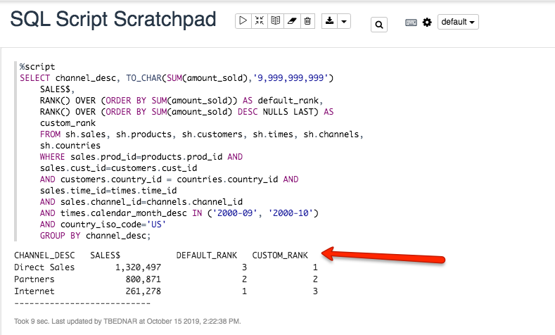
<p align="center">Figure 4-10</p>

**You have successfully connected and run an operation against an Autonomous Database with Oracle OML.  We will use OML in other labs.**

**For an additional OML Hands on Lab experience, there is a Qloudable lab called: Using Machine Learning in ADW.  Go to: [Qloudable Login for Oracle](https://ocitraining.qloudable.com/private/publisher/oci-jumpstart?ch=OCIemp&token=PhoR4eoMLsTQvrRZLrwpUVYk8a6VgOSZM3kNKp4qp0sEPWVH).  If you do not have a Qlouable account, create one.  There are quite a few labs that can be run for free.**

***END OF LAB***

[Back to Top](#table-of-contents)   
