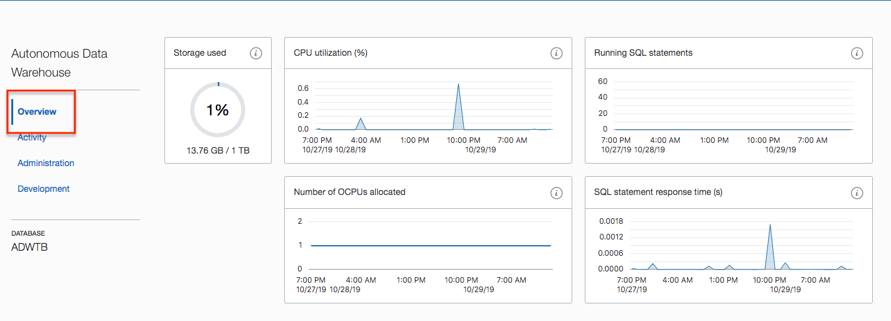
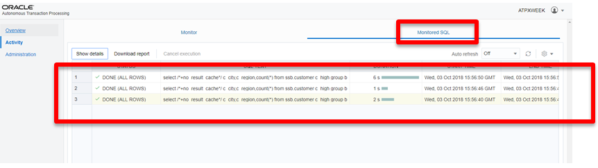
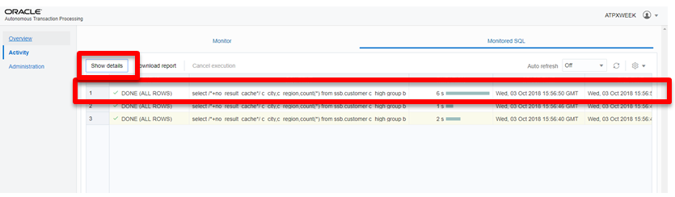
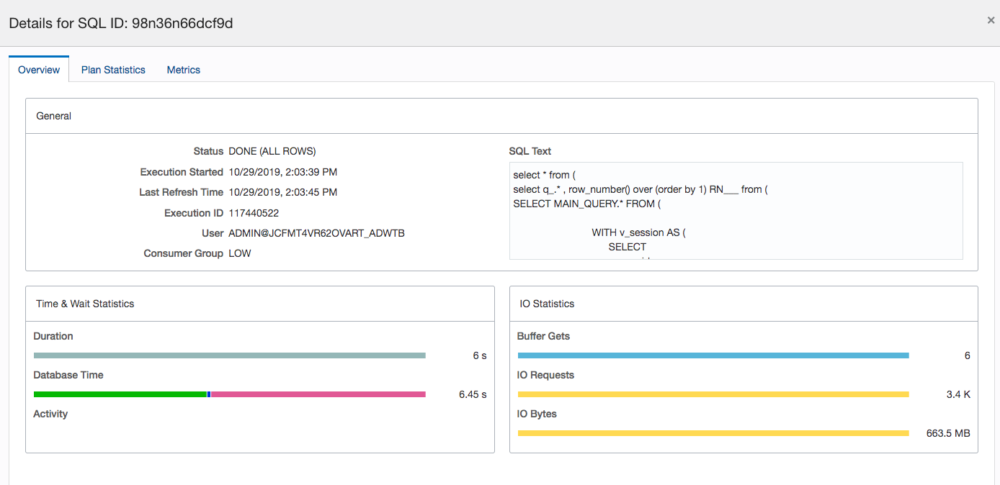
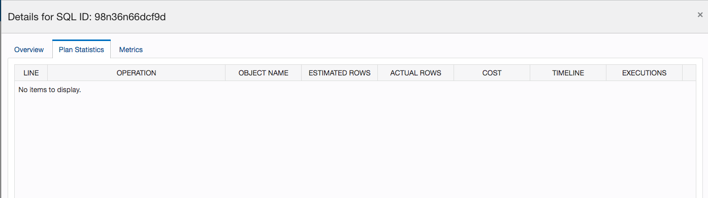
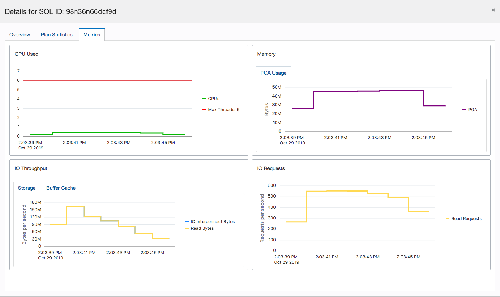

# Performance Monitoring with the Autonomous Console

1. From the Cloud Console used during the provisioning exercise click on your
Autonomous instance:

Figure 1-1

2. Select the **Service Console**:

Figure 1-2

You will be presented the **Overview** page. The **Overview** page shows
real-time and historical information about the utilization of the service. The
components on this page are:

-   **Storage :** This chart shows the total and used storage capacity of the
    service. It indicates what percentage of the space is currently in-use.

-   **CPU utilization (%):** This chart shows the historical CPU utilization of
    the service.

-   **Running SQL statements :** This chart shows the average number of running
    SQL statements historically.

-   **Number of OCPUs allocated :** This chart shows the actual number of OCPUs allocated by the service.

-   **SQL statement response time (s) :** SQL statement response time (s)

    
    
Figure 1-3

    3. After reviewing the information on this page, select **Activity** on the
    left. The **Activity** page has two main tabs - **Monitor** and **Monitored
    SQL**.

    The **Monitor** tab (also the landing tab for Activity) shows real-time and
    historical information about the utilization of the service. The components
    on this page are:

-   **Database Activity:** This chart shows the average number of sessions in
    the database using CPU or waiting on a wait event.

-   **CPU Utilization:** This chart shows the CPU utilization of each consumer
    group.

-   **Running Statements:** This chart shows the average number of running SQL
    statements in each consumer group.

-   **Queued Statements:** This chart shows the average number of queued SQL
    statements in each consumer group.

    4. Explore the **Monitor** tab. Notice that as you hover over each chart you
    will see the different metrics for the different services. Running the
    cursor over any of the graphs will provide more detailed information. The
    default is to report **Real Time** activity, but specific time period
    activity can be examined by selecting the **Time Period** button.

    
    
Figure 1-4

5. To analyse specific SQL statements, click on the **Monitored SQL** button. This
displays SQL that ran or is running in chronological order. The view below
displays the queries ran in SQL Developer in earlier labs. Line 1 contains the
query run in the **\_TP** service and line 3 contains the query run in the
**\_HIGH** service

Figure 1-5

6. Analyse statements you ran to get additional insight into how they executed and
why they executed differently. In this example I select row 1 by clicking
anywhere in the row and then **Show Details:**

Figure 1-6

7. The overview tab provides information about the SQL that was executed, user,
times, and service used (consumer group). Notice that this was the query
executed in the **\_TP** service and it executed in 6 seconds (look at Duration
in the Time & Wait Statistics block, lower left). 

Figure 1-7

8. Click on **Plan Statistics**.  If there were statistics on the tables, they would be displayed here.

Figure 1-8

8. Click on the **Metrics** window.  **Metrics** will display four charts to view **CPU Used**, **Memory**, **IO Throughput** (**Storage** & **Buffer Cache** options), and **IO Requests**.

Figure 1-9

***END OF LAB***

