# Provisioning an Autonomous Database

## Table of Contents

- [Module 1: Learn how to login to the Oracle Cloud Console](#module-1--learn-how-to-login-to-the-oracle-cloud-console)
- [Module 2: Learn how to provision a new Autonomous Database](#module-2--learn-how-to-provision-a-new-autonomous-database)
- [Module 3: Exploring the Autonomous Database Console](#module-3--explore-explore-console)

***** 

## Module 1:  Learn How to Login to the Oracle Cloud Console

In this section you will be provisioning an Autonomous database using the cloud
console.

1. Go to [www.oracle.com](https://wwww.oracle.com), click on the "Person" icon to sign in with your Oracle Cloud account.

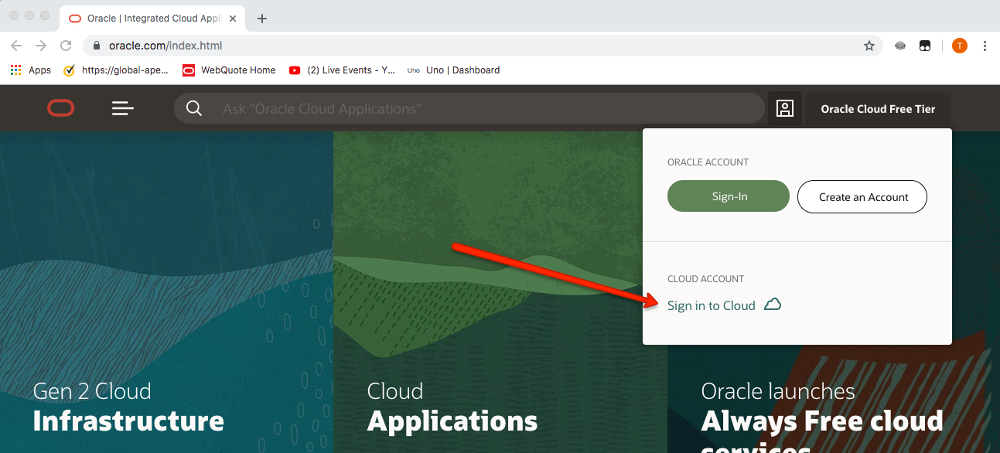

Figure 1-1

2. Enter your Cloud Tenancy Name and click **Next**. 

Figure 1-2

3. Enter your Cloud username and password, and click **Sign In**. 

Figure 1-3

4. This will bring you to the main cloud page which may differ depending on whether
this cloud account has been used before and the main portal customized. Below
you will see the main screen for a new account, that shows Quick Actions.  From here you can launch different Oracle cloud services. In the
top left select the "hamberger" menu highlighted in red:

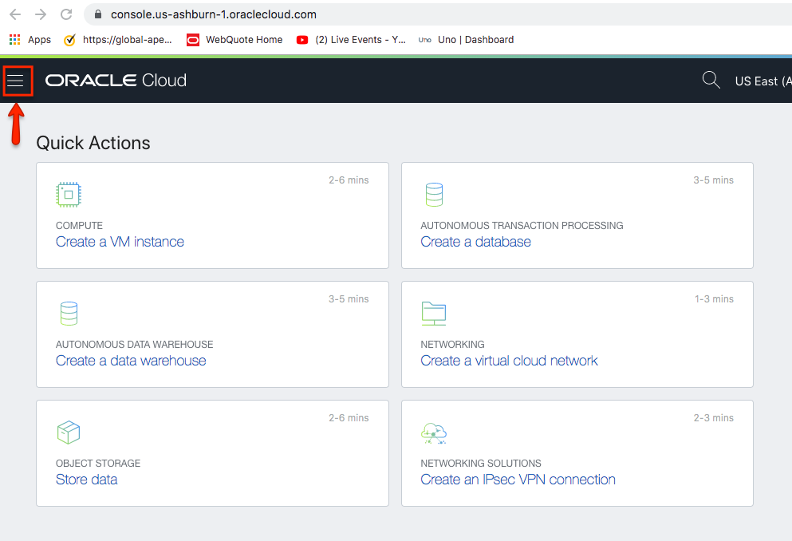

Figure 1-4

5. Select **Autonomous Transaction Processing or Autonomous Data Warehouse** from the drop down menu

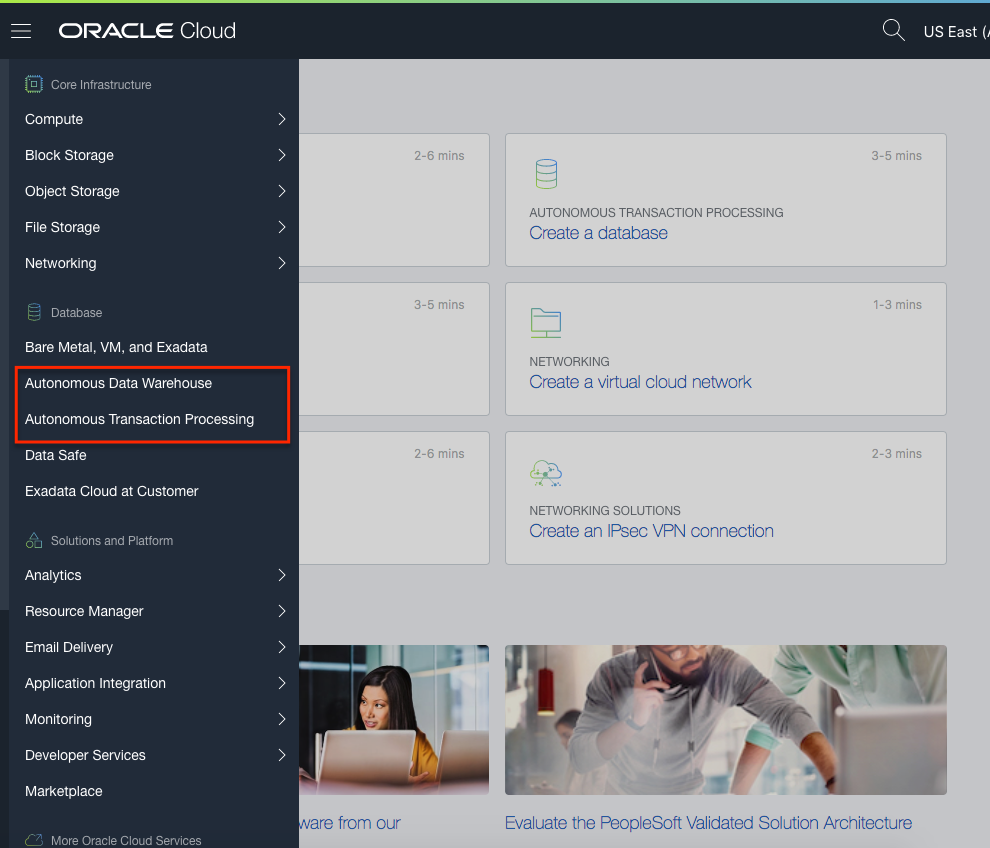

Figure 1-5

This will put you in the main Autonomous Database Service Console (see below).
Any ADB Databases created will be listed here. You can also create and access
databases from this page.

It is possible to use different compartments to separate databases into
different associated groups, please make sure to choose the Compartment that has been assigned to you for this lab.

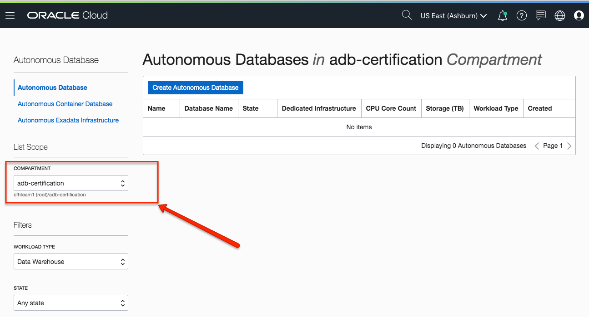

Figure 1-6

***** 

[Back to Top](#table-of-contents)

## Module 2:  Learn How to Provision a New Autonomous Database

1. Click on the “**Create Autonomous Database**” button, as
shown below:

Figure 2-1

2. The following information must be filled in this page:

**Compartment** – This can be changed, to organize and isolate databases

**Display Name –** The name of the service displayed

**Database Name –** The name of the actual database

After filling fields, you will select a workload type and deployment option. Please select Data Warehouse or Transaction Processing.  Then select Serverless or Dedicated.  For our lab, you will select Serverless.

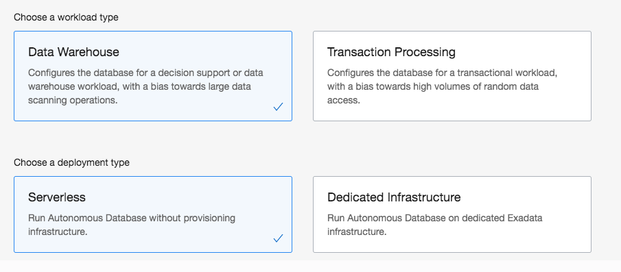

Figure 2-2

Now continue to enter the following information: 

**CPU Core Count –** Number of CPU’s allocated to the database (min 1)

**Storage –** Storage allocated to database in Terabytes (min 1)

By clicking on **Auto scaling**, the CPUs will autonomatically scale to acomodate the workload.  Please keep default of checked.  

There will be database releases ready for customers to test out upgrades.  19c Preview wull be available for the next few months.  Please do not select this option.

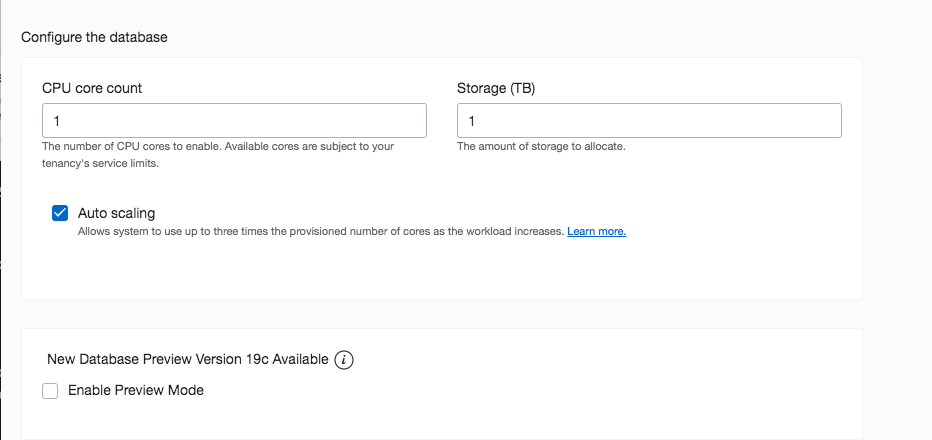

Figure 2-3

**Password –** Database “Admin” user password

**Confirm password –** Re-type Database “Admin” user password

**License Type –** Select whether customer is using existing on-premises
database licenses (BYOL) or requires new licences. Customer charge will be based
on selected option.  Select BYOL

When you click on "Show Advanced Options", you can add tags.  You do not need to add any tags at this time.

**TAGS –** a metadata system that allows you to organize and track resources
within your tenancy. Tags are composed of keys and values that can be attached
to resources.

Click on **Create Autonomous Database** 

You will be placed on the Database Details page and your database will be in
“**Provisioning**” status. The Database Details page displays more information
about your instance, notice the various menu buttons that help you manage your
new instance.

Figure 2-4

The status will automatically change to “**Available**” when the database is
ready in a few minutes…Your Autonomous database is up and running! Take notice
of the green color of the ATP logo indicating the service is available and
commands to start, stop, terminate, and scale the service.

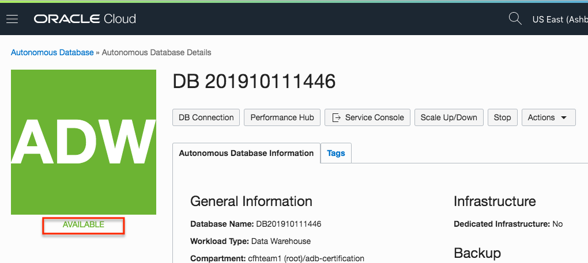

Figure 2-5

***** 

[Back to Top](#table-of-contents)

## Module 3: Exploring the Autonomous Database Console

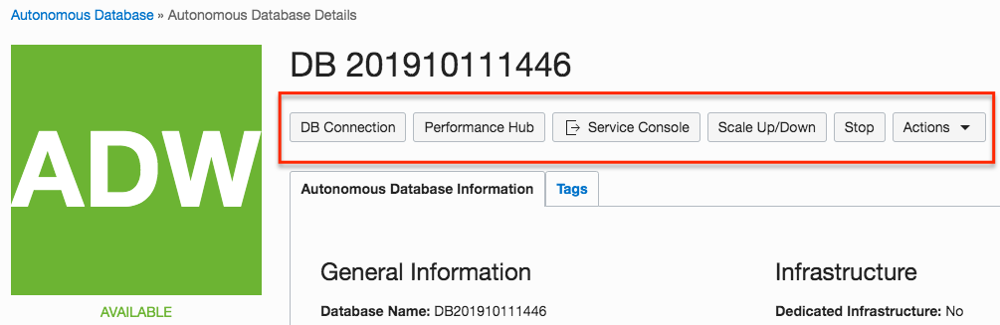

Figure 3-1

1. The DB Connection page provides you the ability to download the client credentials and connection information to connect to your database

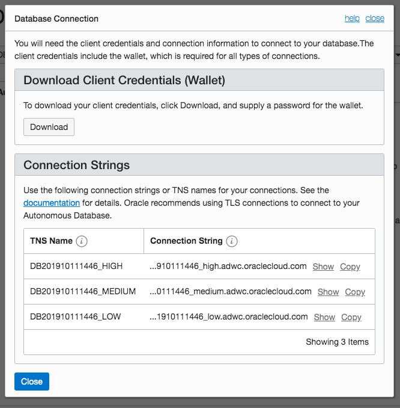

Figure 3-2

2. The Performance Hub allows you to view real-time and historical performance data from the Performance Hub. Performance Hub shows Active Session History (ASH) Analytics and SQL Monitoring.

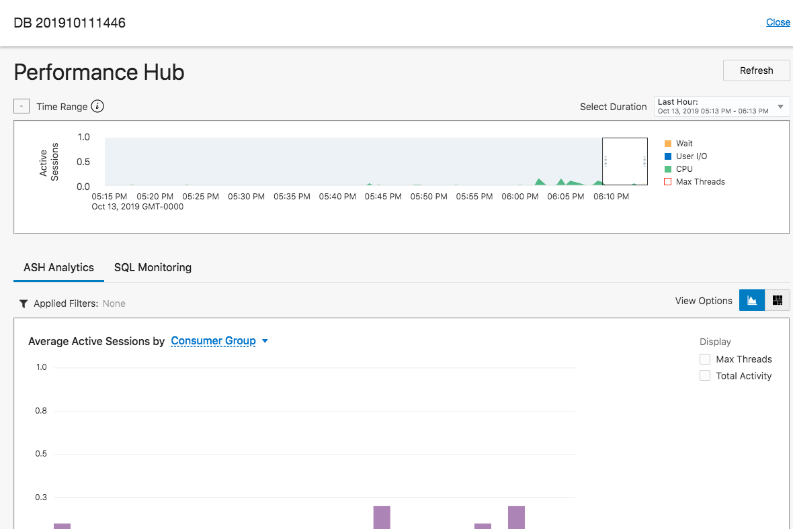

Figure 3-3

3.  The **Scale Up/Down** tab provides the ability to turn on/off the auton scale option or change the base CPU and Storage.

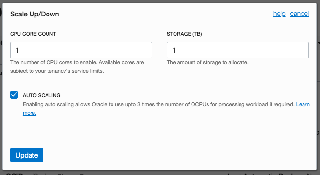

Figure 3-4

4. If you want to stop your database, click on the **Stop** tab and confirm to stop the database.

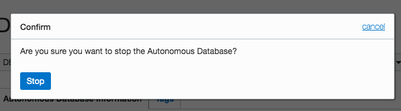

Figure 3-5

5.  The **Actions** pull down provides a number of actions tha can be performned against the database.  These include Restore from backup, Create clone database, update Access Control List, change your Admin Password, Update License Type, Move your database into a different compartment, update associated Tags, or Terminiate the database instance.

Figure 3-6

6.  If you scoll down the page, you will see **Metrics**.  There is a chart for each metric. In each chart you can select the Interval and Statistic or use the default values.  To create an alarm on a metric, click Options and select Create an Alarm on this Query. 

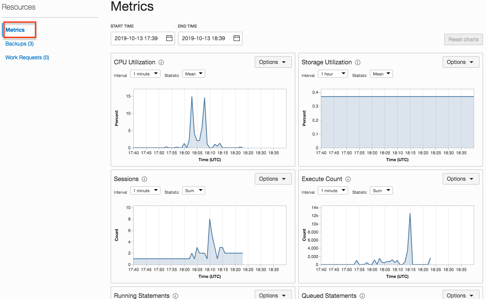

Figure 3-7

7.  If you select **Backups**, you can view backups that have been made for your Autonomous Database.  You Autonomous Database is automatically backed up for you. The retention period for backups is 60 days. You can restore and recover your database to any point-in-time in this retention period.  You can also create *Manual** backups. The manual backups are put in your Cloud Object Storage bucket. When you initiate a point-in-time recovery Autonomous Data Warehouse decides which backup to use for faster recovery.

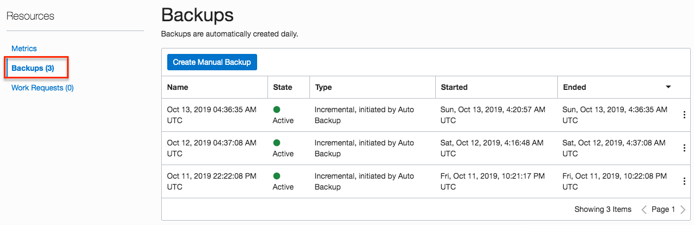

Figure 3-8

8.  **Work Requests** is an activity log that enables you to track each step in an operation's progress. Each work request has an Oracle Cloud Identifier (OCID) that allows you to interact with it programmatically.

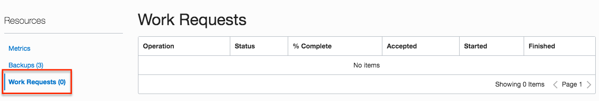

Figure 3-9

9. Now connect to your database, click the Service Console button:

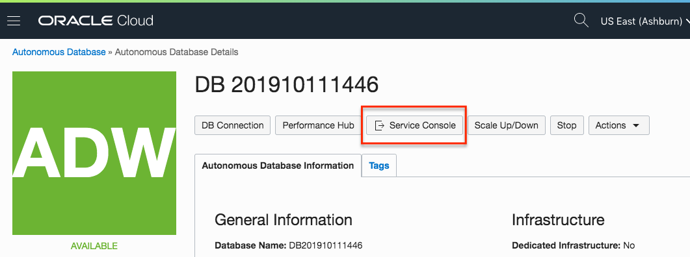

Figure 3-10

You will be placed in the Service Console page. The Overview tab shows general information about the utilization of the service. You can bookmark the service console URL and go to that URL directly without logging in to the Oracle Cloud Infrastructure console. If you logout and use the bookmark, then to see the service console you need to enter the ADMIN username, the password.  

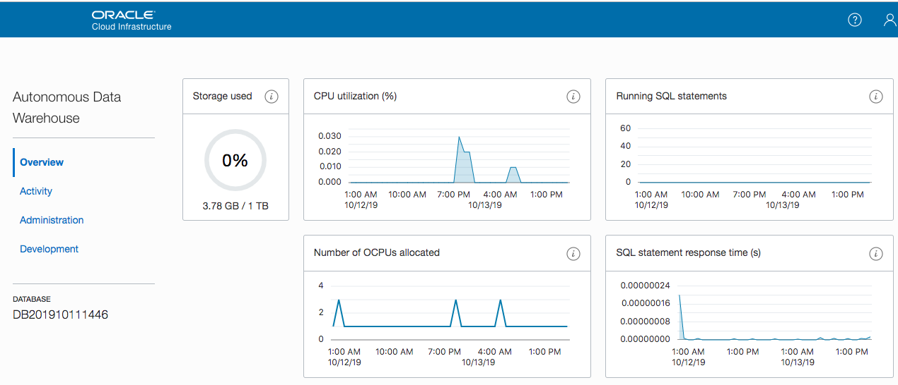

Figure 3-11

10. If you select **Activity** tab, this page shows real-time and historical information about the utilization of the service.  To see earlier data click **Time period**. The default retention period for performance data is eight days. The retention time can be changed by changing the Automatic Workload Repository retention setting with the PL/SQL procedure DBMS_WORKLOAD_REPOSITORY.MODIFY_SNAPSHOT_SETTINGS. Be aware that increasing the retention time results in more storage usage for performance data. 

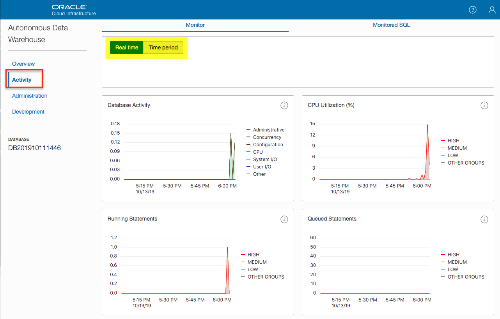

Figure 3-12

11. On the administration page there are five options:

**Download Client Credentials (Wallet) –** this contains the credentials files
used for connectivity to the instance from client applications, tools

**Set Resource Management Rules –** Autonomous Database has pre-created user resource groups, those can be managed here

**Set Administrator Password –** used to change the “Admin” account password

**Manage Oracle ML Users –** Notebook development environment that can be used
with Autonous Database

**Send Feedback to Oracle –** email feedback on Autonomous Database

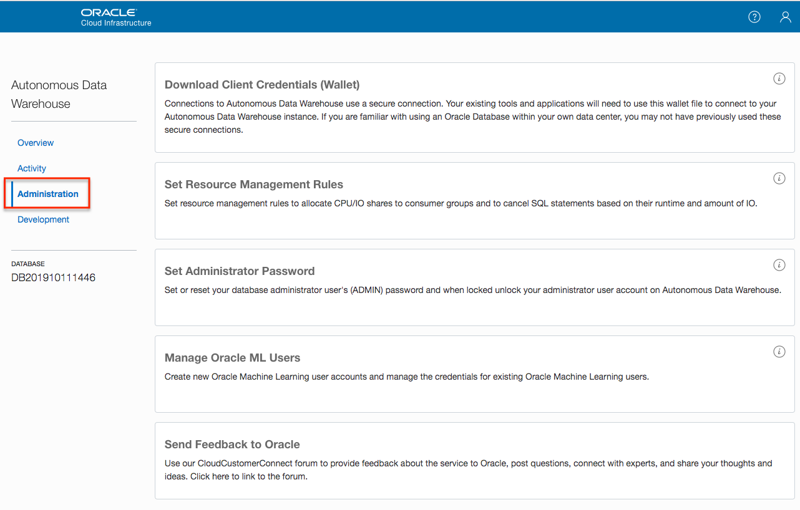

Figure 3-13

12.  The Development tab provides five selections that are built into the Autonomous Database platform to help guide developers to fast deploument.

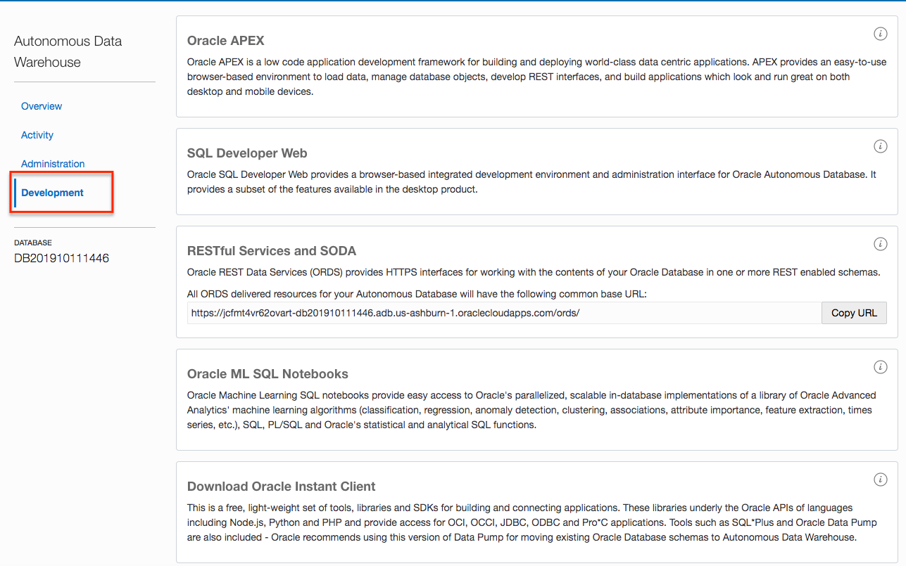

Figure 3-14

**Oracle APEX -** is a low-code development platform that enables you to build scalable, secure enterprise apps with world-class features.

**SQL Developer Web -** is a browser-based interface of Oracle SQL Developer.

**RESTful Services and SODA -** provides HTTPS interfaces for working with the contents of your Oracle Database in REST enabled schemas.

**Oracle ML SQL Notebooks -** is a cloud-based notebook application which provides simple querying, data-visualization, and collaboration capabilities. The notebook is designed to be used alongside other business intelligence applications.

**Download Oracle Instant Client –** points to different clients that can be
used to connect to the database (like sql\*plus)

**You have successfully provisioned an Autonomous Database**

***END OF LAB***

[Back to Top](#table-of-contents)   
