# Managing and maintaining the Autonomous Database

## Table of Contents

- [Module 1: Starting the Autonomous Database](#module-1--starting-the-autonomous-database)
- [Module 2: Changing the ADMIN password](#module-2--changing-the-admin-password)
- [Module 3: Creating Autonomous Database Users](#module-2--creating-autonomous-database-users)
- [Module 4: Stopping the Autonomous Database](#module-1--stopping-the-autonomous-database)

***** 

## Module 1:  Starting the Autonomous Database

If your database is not running, please start it up using the following steps:

1. From the **Details** page of your ADB service, click **Start** to start your
service.

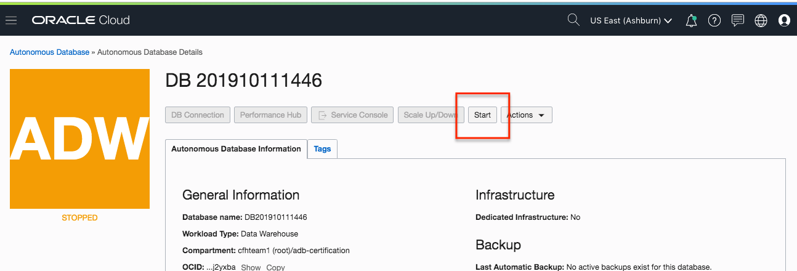

Figure 1-1

2. Click **Start** again when prompted for confirmation.

Figure 1-2

The ADB service will take a few seconds to start. For example, if you
provisioned ATP service, you would notice the status of **STARTING** as follows:

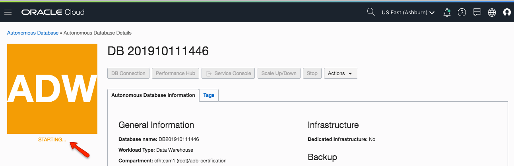

Figure 1-3

When the service is started, the status will change to **AVAILABLE**.

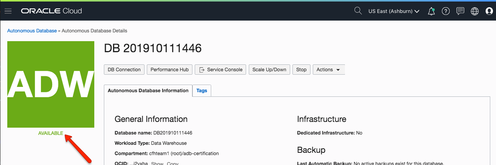

Figure 1-4

[Back to Top](#table-of-contents)

## Module 2: Changing the ADMIN password

You many need to change the ADMIN password. 

You can change the password from the details page under **ACTIONS** or click on **Administration** --> **Set Administrator Password**.  

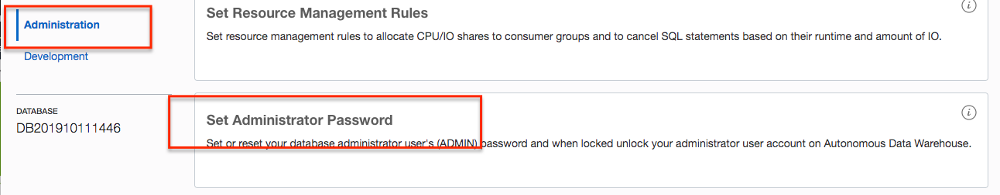

Figure 2-1

Update the password.

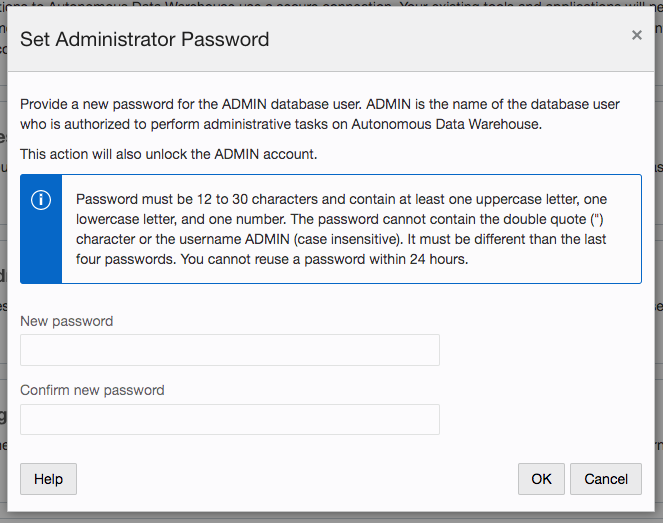

Figure 2-1

[Back to Top](#table-of-contents)

## Module 3: Creating Autonomous Database Users

To create users in your database, connect to the database as the ADMIN use SQL Developer Web tool.  From your database details page, click on **Service Console** --> **Development** --> **SQL Developer Web**.  

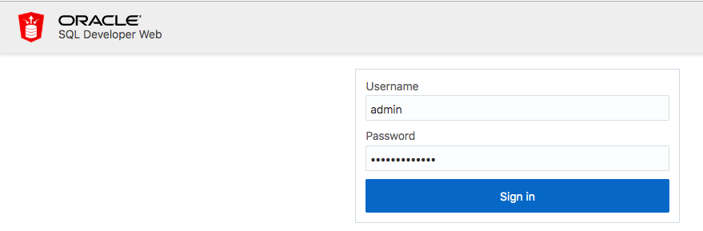

Figure 3-1

As the ADMIN user run the following SQL statement.  You can use any name for the new user.

>create user tammy;

>alter user tammy identified by AABBcc123456# account unlock;

>grant create session, dwrole to tammy;

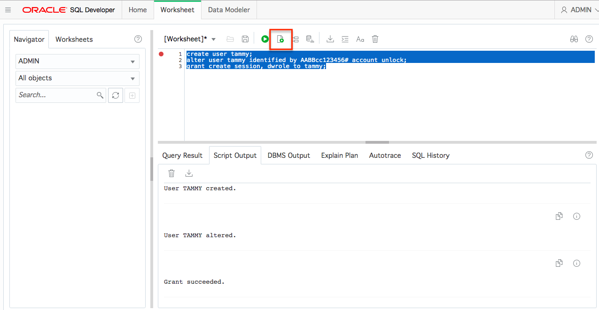

Figure 3-2

Was your user created?

> select * from all_users where usernmae ='TAMMY';

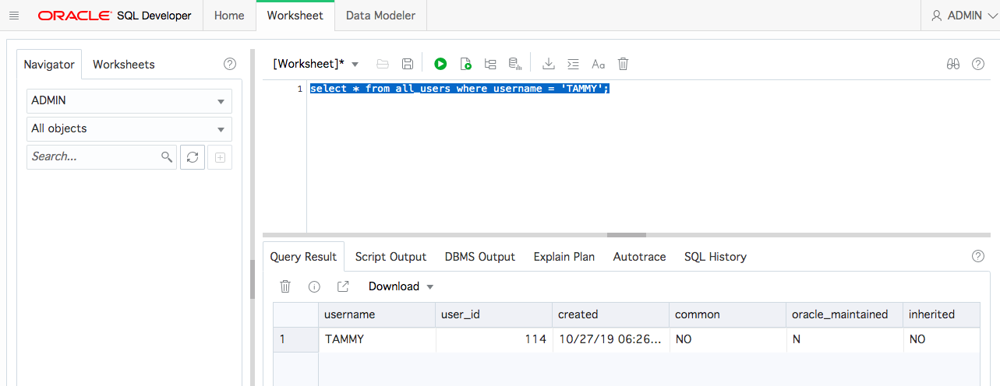

Figure 3-3

To allow that user to access the SQL Developer Web, you will need to REST enable it.  Execute the following:

BEGIN

    ords_admin.enable_schema (
        p_enabled               => TRUE,
        p_schema                => 'THATJEFFSMITH',
        p_url_mapping_type      => 'BASE_PATH',
        p_url_mapping_pattern   => 'tjs',
        p_auto_rest_auth        => TRUE
    );
    COMMIT;
END;
/

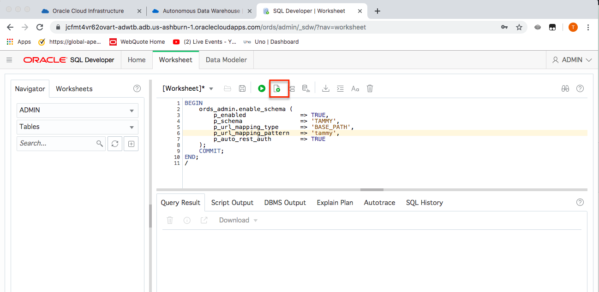

Figure 3-4

If you run this above code, you’ll be able to login to SQL Developer Web with the new usser. Just mind that the URL will look have to look something like this…

https://yourservicedomain-1.oraclecloudapps.com/ords/tammy/_sdw/?nav=worksheet

Copy the URL from your browser that you are currently logged into as ADMIN in SQL Developer web.

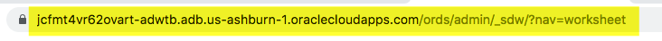

Figure 3-5

Now paste that URL to another browswer window and change /admin/ to /tammy/

Note that I have /tammy/ in the URL? That’s the p_url_mapping_pattern. If you go to the same URL but with /admin/ in the link and try to login as TAMMY/AABBcc123456#, you will get bad user/password.

Log into SQL Developer Web as your new user and password that you assigned to them.

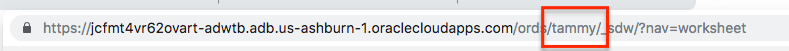

Figure 3-6

Figure 3-7

[Back to Top](#table-of-contents)

## Module 4:  Stopping the Autonomous Database

1. Sign in to your Autonomous Database **Service Console** and browse to the
A**utonomous Database Details** page of your service. Select the Stop button.

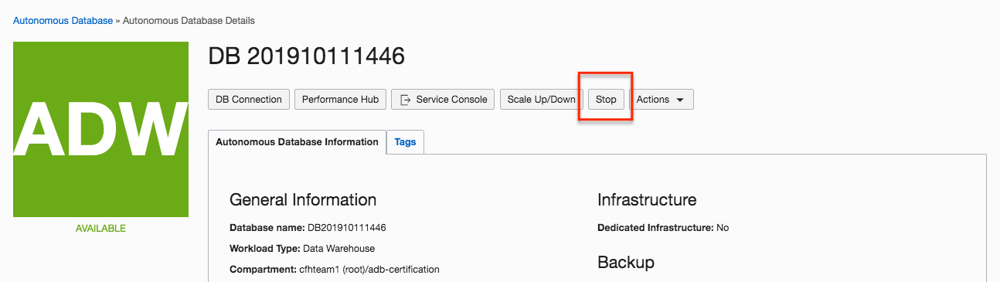

Figure 4-1

The ADB service will go into stopping status. Notice the status of **STOPPING**.

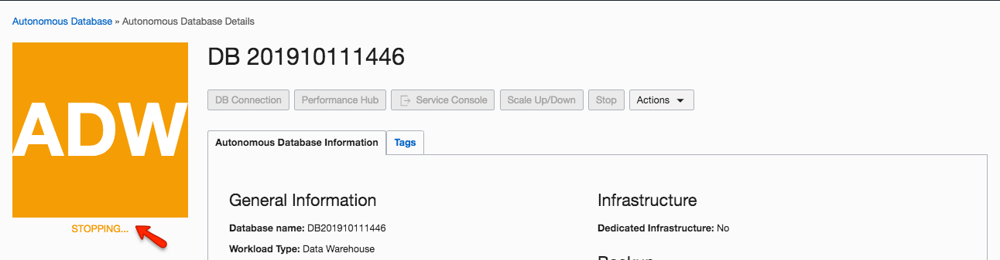

Figure 4-2

When the service is stopped, the status will change to **STOPPED**.

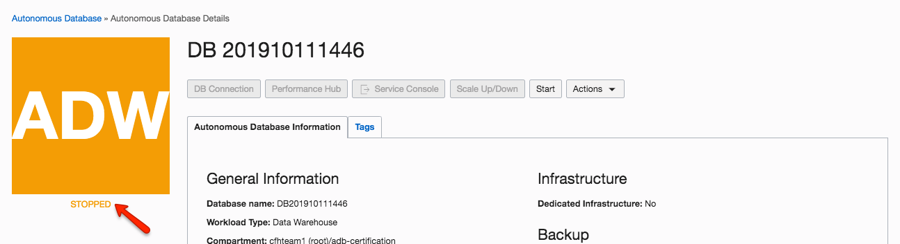

Figure 4-3

[Back to Top](#table-of-contents)

