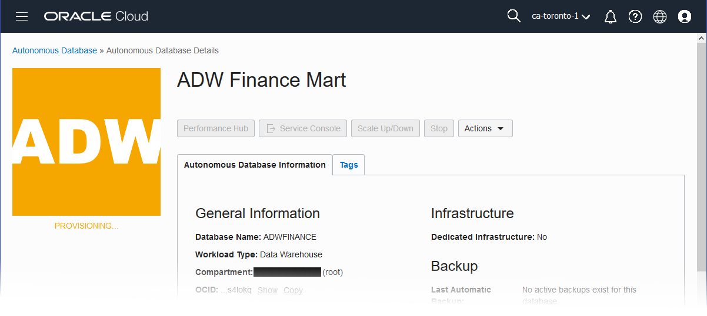
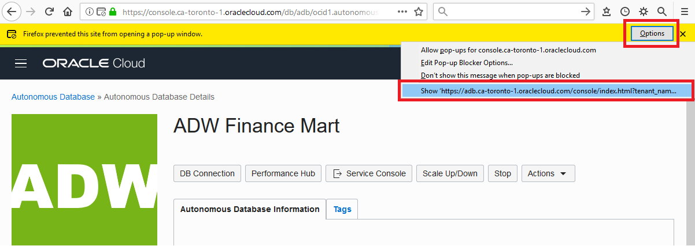
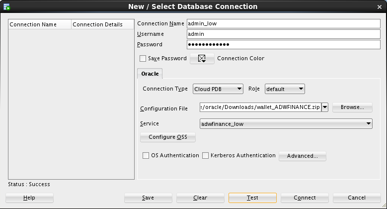

# Provisioning Autonomous Data Warehouse and Connecting with SQL Developer #

## Before You Begin ##
This 15-minute lab walks you through the steps to get started using the Oracle Autonomous Data Warehouse (ADW) on Oracle Cloud Infrastructure (OCI). You will provision a new ADW database and connect to the database using Oracle SQL Developer.

### Background ###
Autonomous Data Warehouse is built around the market leading Oracle database and comes with fully automated data warehouse specific features that deliver outstanding query performance.  This environment is delivered as a fully managed cloud service running on optimized high-end Oracle hardware systems.  You don’t need to spend time thinking about how you should store your data, when or how to back it up or how to tune your queries.  We take care of everything for you.  You can select the exact combination of storage and CPUs to fit your project and your budget. We keep all of your data safe and secure.  It’s always backed up and always encrypted in Oracle’s cloud.  Using our client tools you load all kinds of different types of data from worksheets on your computer, webstore log files to data files stored in Oracle’s cloud-based object store and load that data into your Autonomous Data Warehouse.

Oracle’s Autonomous Data Warehouse is the perfect quick-start service for fast data loading and sophisticated data reporting and analysis.  Oracle manages everything for you so you can focus on your data.

### What Do You Need? ###
* Access to an instance of Oracle Autonomous Data Warehouse Cloud
* [Oracle SQL Developer 18.2](http://www.oracle.com/technetwork/developer-tools/sql-developer/overview/index.html)  (already installed)
* [Oracle's Java Development Kit 8 (JDK 8)](http://www.oracle.com/technetwork/java/javase/downloads/index.html) (already installed)
* [Java Cryptography Extension (JCE) Unlimited Strength Jurisdiction Policy Files](https://www.oracle.com/technetwork/java/javase/downloads/jce8-download-2133166.html) (already installed)

## Create an ADW Instance ##
1. Sign in to the Oracle Cloud Platform. 
2. Click the menu icon to expand the menu on the left edge of the screen.
3. Click **Autonomous Date Warehouse**.

    

    [Description of the illustration OCIMenu.png](files/OCIMenu.txt)

4. Click the **Create Autonomous Database** button to start the instance creation process.
5. On the Create Autonomous Database page, enter the following information:
     * **Compartment**: For this lab, we'll use the `root` compartment.
     * **Display Name**: `ADW Finance Mart`
     * **Database Name**: `ADWFINANCE`
     * **Workload Type**: `Data Warehouse`
     * **CPU Core Count**: `1`
     * **Storage (TB)**:  `1`
     * **Auto Scaling**: Unchecked
     * **Administrator Credentials**: Create a password for the ADMIN user of the service instance. You'll need this password in the upcoming steps to download the credential wallet and connect to the database from Oracle SQL Developer.
     * **License Type**: `Bring Your Own License`
6. Click the **Create Autonomous Database** button to start provisioning the instance. 
7. You're taken to the instance page which displays detail about your instance. This includes a State field indicating that the instance is **Provisioning**. When it's complete, the State field changes from **Provisioning** to **Available**. If the status doesn't change after few minutes, try refreshing the page.

    

    [Description of the illustration adw_provisioning_state.png](files/adw_provisioning_state.txt)

## Download the Credentials Zip File ##
Once you have created the data warehouse, download the credentials zip file for client access to that data warehouse. As ADW only accepts secure connections to the database, you need to download a wallet file containing your credentials first. You will use this file to connect SQL Developer to your Autonomous Data Warehouse database.

1. Click the **Service Console** button.

    

    [Description of the illustration open_service_console.png](files/open_service_console.txt)

2. Depending on your browser settings, you may need to give permission for the Service Console to open in a new tab. In Firefox:
     * Click **Options**
     * Click the final option to **Show** the content.

    

    [Description of the illustration ShowNewTab.png](files/ShowNewTab.txt)
    
3. The service console opens to the **Overview** page. Click **Development** in the left navigation pane.
4. Click **SQL Developer Web**.
5. Sign in.
     * **Username**: `ADMIN`
     * **Password**: Enter the password you created earlier.

3. The service console opens to the **Overview** page. Click **Administration** in the left navigation pane.
4. Click **Download a Connection Wallet**.
5. You are prompted to create a password for the credentials zip file. Enter a password This password is separate from the Admin user password created earlier.  
     * Note: Version 18.2.0 of SQL Developer drops the requirement to enter the ATP keystore password and does not provide the keystore password field in the dialog for creating a connection. If using SQL Developer version 18.2.0 or newer, you do not use the password you just created.
7. Click **Download**.
6. Make note of where the zip file is stored. This will most likely be the downloads directory (Oracle's Home/Downloads). You'll use the zip file in the next step to define a SQL Developer connection to your Autonomous Data Warehouse Cloud database.

## Connect to the Database using SQL Developer ##
1. Open SQL Developer on your local computer. 
2. In the Connections panel, right-click **Connections** and select **New Connection**.

    

    [Description of the illustration select_new_connection.png](files/select_new_connection.txt)
    
3. Fill in the connection details:
     * **Connection Name**: `admin_low`
     * **Username**: `admin`
     * **Password**: Enter the admin user's password that you specified when provisioning the service instance.
     * **Connection Type**: `Cloud PDB` (Note: This may also be called `Cloud Wallet`)
     * **Configuration File**: Click **Browse**, and select the **Client Credentials** zip file you downloaded from the ADW service console.
     * **Keystore Password**:
        * **For SQL Developer 18.2.0 or newer**: Starting with version 18.2.0, SQL Developer does not require that you enter a Keystore Password and does not provide the Keystore Password field.
        * **For SQL Developer older version**: Enter the password that was generated when you downloaded the Client Credentials zip file from the Autonomous Data Warehouse Cloud service console.
     * **Service**: There are 3 pre-configured database services for each database. Pick `adwfinance_low`. These service levels map to the LOW, MEDIUM, and HIGH consumer groups, which provide different levels of performance and concurrency.

    

    [Description of the illustration NewConnection.png](files/NewConnection.txt)

4. Click **Test**. "Status: Success" should display at the left-most bottom of the New/Select Database Connection dialog.
5. Click **Save** to save the connecton information.
6. Click **Connect** to connect the database. An entry for the new connection appears under Connections. A new worksheet also appears.
7. Repeat the previous steps to create another connection. Use the same information as before with, with the following exceptions:
    * **Connection Name**: `admin_high`
    * **Service**: `adwfinance_high`

Keep SQL Developer open. You'll need it in the next lab when you examine the differences between low and high database service levels.

## Want to Learn More? ##
* [Autonomous Cloud Platform Courses](https://learn.oracle.com/pls/web_prod-plq-dad/dl4_pages.getpage?page=dl4homepage&get_params=offering:35573#filtersGroup1=&filtersGroup2=.f667&filtersGroup3=&filtersGroup4=&filtersGroup5=&filtersSearch=) from Oracle University 
* [Autonomous Data Warehouse Cloud Certification]((https://education.oracle.com/en/data-management/autonomous-database/product_817?certPage=true) from Oracle University
* [ADW Test Drive Workshop](https://oracle.github.io/learning-library/workshops/journey4-adwc/?page=README.md)

