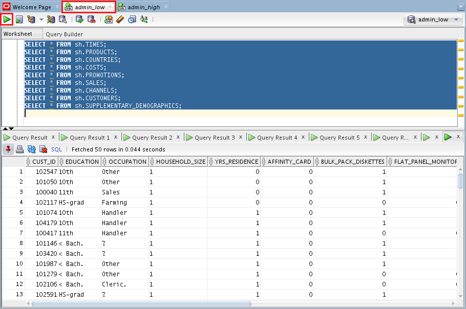

# Working with Database Services and Sample Data Sets #

## Before You Begin ##
In this 10-minute lab, you will explore the provided sample data sets and experiment with the choices of database services that come with your ADWC instance.

### Background ###
Autonomous Data Warehouse Cloud provides three database services that you can choose when connecting to your database. These are named as HIGH, MEDIUM, and LOW services and provide different levels of performance and concurrency. 

* The HIGH database service provides the maximum amount of resources for a query, this also means the number of concurrent queries you can run in this service will not be as much as the other services. 
* The MEDIUM database service provides multiple compute and IO resources for a query. This service also provides more concurrency compared to the HIGH database service. 
* The LOW database service provides the least amount of resources for a query, this also means the number of concurrent queries you can run in this service will be higher than the other services. 

As a user you need to pick the database service based on your performance and concurrency requirements.

This lab uses the LOW and HIGH database services to understand the performance differences between them. The lab will run queries on sample data set provided out of the box with ADWC. ADWC provides the Oracle Sales History (SH) sample schema and the Star Schema Benchmark (SSB) data set, these data sets are in the SH and SSB schemas respectively. 


### What Do You Need? ###
* Access to an instance of Oracle Autonomous Data Warehouse Cloud
* [Oracle SQL Developer 18.2](http://www.oracle.com/technetwork/developer-tools/sql-developer/overview/index.html)  (already installed)
* [Oracle's Java Development Kit 8 (JDK 8)](http://www.oracle.com/technetwork/java/javase/downloads/index.html) (already installed)
* [Java Cryptography Extension (JCE) Unlimited Strength Jurisdiction Policy Files](https://www.oracle.com/technetwork/java/javase/downloads/jce8-download-2133166.html) (already installed)
* You must have completed the previous lab **Provisioning Autonomous Data Warehouse Cloud and Connecting with SQL Developer**.


## Connect and Query with the LOW Database Service ##
1. Open SQL Developer. 
2. If you're not already connected, expand the list of connections and double click the **admin_low** connection to connect to the database. After you enter the admin signin credentials, a SQL worksheet will open.

    

    [Description of the illustration connections.jpg](files/connections.txt)

3. Copy and paste this code into the SQL Developer worksheet:

   ````SQL
   select /* low */ c_city,c_region,count(*)
   from ssb.customer c_low
   group by c_region, c_city
   order by count(*);
   ````

4. Click **Run Script (or F5)** in SQL Developer so that all the rows are displayed on the screen.
5. Note the response time.
    
    

    [Description of the illustration responseTime.jpg](files/responseTime.txt)


## Connect and Query with the HIGH Database Service ##
1. If you're not already connected, double click the **admin_high** connection to connect to the database. After you enter the admin signin credentials, a SQL worksheet will open.
2. Copy and paste this code into the SQL Developer worksheet:

   ````SQL
   select /* high */ c_city,c_region,count(*) 
   from ssb.customer c_high
   group by c_region, c_city
   order by count(*);
   ````

3. Click **Run Script** in SQL Developer.
4. Note the response time.

A query running in the HIGH database service can use more resources and run faster compared to a query running in the LOW database service. As you scale up the compute capacity of your ADWC service, you'll realize the queries get faster in the HIGH database service.


## Explore the Query Results Caching ##
ADWC will caches the results of a query. If you run the same queries again, you'll see they run much faster.

1. Click **Run Script** again for `admin_high` so that all the rows are displayed on the screen.
2. Note the improved response time!


## Explore the Sample Data ##
The ADWC sample data is robust and is helpful to leveraged for testing purposes. In this part of the lab, you'll examine the sample data categories and ways to breakdown that data. You'll explore the SH schema which is accessible through LOW database services.

1. Navigate to the `admin_low` worksheet.
2. Enter the following queries:
   ````SQL
   SELECT * FROM sh.TIMES;
   SELECT * FROM sh.PRODUCTS;
   SELECT * FROM sh.COUNTRIES;
   SELECT * FROM sh.COSTS;
   SELECT * FROM sh.PROMOTIONS;
   SELECT * FROM sh.SALES;
   SELECT * FROM sh.CHANNELS;
   SELECT * FROM sh.CUSTOMERS;
   SELECT * FROM sh.SUPPLEMENTARY_DEMOGRAPHICS;
   ````
3. Highlight all these queries in the worksheet (Ctrl + A).
4. Click the **Run Statement** button.
5. You should see many tabs created in SQL Developer, each displaying tables for the categories of sample data.

    

    [Description of the illustration SampleData1.png](files/SampleData1.txt)

6. Close all the Query Result tabs.
7. Now replace the code in the worksheet with another query. This query produces a breakdown by SKU for the total products sold.
   ````SQL
   select co.country_name, p.prod_name,
   sum(s.AMOUNT_SOLD), sum(p.PROD_MIN_PRICE*s.QUANTITY_SOLD), 
   sum(p.PROD_LIST_PRICE*s.QUANTITY_SOLD), sum(s.QUANTITY_SOLD)
   from sh.sales s, sh.products p, sh.customers c, sh.countries co, sh.channels cn, sh.PROMOTIONS pm, sh.SUPPLEMENTARY_DEMOGRAPHICS sd
   where s.time_id = '01-JAN-98'
   and s.prod_id = p.prod_id
   and s.cust_id = c.cust_id
   and c.country_id = co.country_id
   and s.channel_id = cn.channel_id
   and s.promo_id = pm.promo_id
   and s.cust_id = sd.cust_id(+)
   group by co.country_name, p.prod_name
   order by co.country_name, 3 desc;
   ````
8. Click the **Run Statement** button.
9. You should see one new Query Result tab showing the results as a table.


## Want to Learn More? ##
* [Autonomous Cloud Platform Courses](https://learn.oracle.com/pls/web_prod-plq-dad/dl4_pages.getpage?page=dl4homepage&get_params=offering:35573#filtersGroup1=&filtersGroup2=.f667&filtersGroup3=&filtersGroup4=&filtersGroup5=&filtersSearch=) from Oracle University 
* [Autonomous Data Warehouse Cloud Certification](https://education.oracle.com/es/data-management/autonomous-data-warehouse-cloud/product_807?certPage=true) from Oracle University
* [ADWC Test Drive Workshop](https://oracle.github.io/learning-library/workshops/journey4-adwc/?page=README.md)
