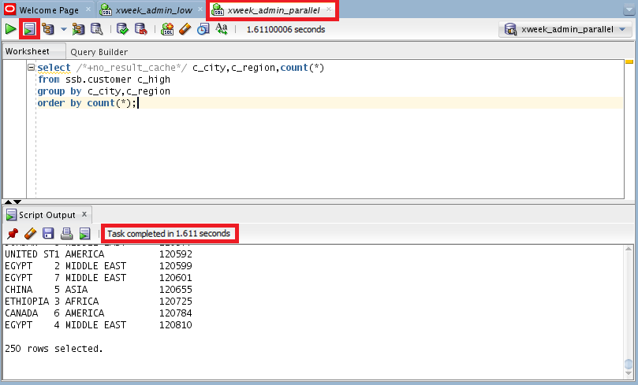

# Scaling, Performance, and Monitoring in ATP #

## Before You Begin ##
In this 15-minute lab, you will scale up your ATP instance by increasing the number of CPU’s allocated to the instance. Using the same queries from the previous, lab you will explore the impact of allocating and removing CPU’s from the instance.

### Background ###
Autonomous Transaction Processing allows you to scale the CPU core count and storage allocation. You can monitor the effects of this change through the graphs in Activity section of the Service Console.

### What Do You Need? ###
* Access to an instance of Oracle Autonomous Transaction Processing
* [Oracle SQL Developer 18.2](http://www.oracle.com/technetwork/developer-tools/sql-developer/overview/index.html)  (already installed)
* [Oracle's Java Development Kit 8 (JDK 8)](http://www.oracle.com/technetwork/java/javase/downloads/index.html) (already installed)
* [Java Cryptography Extension (JCE) Unlimited Strength Jurisdiction Policy Files](https://www.oracle.com/technetwork/java/javase/downloads/jce8-download-2133166.html) (already installed)
* You must have completed the previous lab **Working with Database Services and ATP Consumer Groups**.


## Scaling Up the ATP Instance ##
1. Sign in to the Oracle Cloud Platform. 
2. Click the menu icon to expand the menu on the left edge of the screen.
3. Click **Services**.
4. Click **Autonomous Transaction Processing**.

    

    [Description of the illustration MyServicesMenu.png](files/MyServicesMenu.txt)

5. You're taken to the ATP Cloud Console you used during the provisioning lab. Click the name of the ATP instance you created earlier. 

    

    [Description of the ATPMenu.png](files/ATPMenu.txt)

6. You're taken to the instance page. You may also have this page already available if you've kept your browser tabs open from the previous labs. Notice that among the details displayed about your ATP instance, there are currently has 2 CPU’s allocated.
7. Click the **Scale Up/Down** button.
8. This opens a Scale Up/Down menu. Within this menu:
     * Increase the **CPU Core Count** to 4
     * Leave the **Storage (TB)** value unchanged at 1.
9. Click the **Update** button which confirms these settings and closes the menu. 
10. You're taken back to the instance page. Notice the instance's status now reads `SCALING IN PROGRESS`

    

    [Description of the ScalingInProgress1.png](files/ScalingInProgress1.txt)

The page will automatically refresh once the scale operation has completed and the CPU Core Count will update to “4”. The “ATP” square remains green during the scaling process. No interruption to the service occurs during scaling operations! 

## Test Your Changes ##
1. Open Oracle SQL Developer
2. Ensure the two connections from the previous lab are still working, `xweek_admin_low` and `xweek_admin_parallel`. If they aren't, reestablish the connections.
3. Worksheets for both connection should contain the same code as before:

   ````SQL
   select /*+no_result_cache*/ c_city,c_region,count(*) 
   from ssb.customer c_high
   group by c_city,c_region
   order by count(*);
   ````

4. Click **Run Script** for the `xweek_admin_low` database service. Note the execution time.

    

    [Description of the illustration ResponseTimeLow.png](files/ResponseTimeLow.txt)

5. Click **Run Script** for  the `xweek_admin_parallel` database service. Note the execution time.

    

    [Description of the illustration ResponseTimeParallel.png](files/ResponseTimeParallel.txt)

The timing for the LOW service remains unchanged, despite increasing the CPUs from 2 to 4. The LOW service does not parallelize transactions to take advantage of increased CPUs. The PARALLEL service previously executed in half the time as the LOW service. Now the the CPUs have been doubled, the execution time is halved again. It's now approximately one fourth that of the LOW service, reflecting the use of the additional CPU’s.


## Monitoring Activity from the Console ##
1. Go back to the Oracle Cloud.
2. From the instance page, click the **Service Console** button.

    

    [Description of the ServiceConsoleButton.png](files/ServiceConsoleButton.txt)
3. Depending on your browser settings, you may need to give permission for the Service Console to open in a new tab.
4. Once on the console select **Activity** from the left margin. A dashboard of activity on your instance is displayed in four tiles, Database Activity, CPU Utilization, Running Statements, Queued Statements. This information is displayed by defined service. The default is to report Real Time activity, but specific time period activity can be examined by selecting the **Time Period** button.
5. Run your cursor over any of the graphs to see more detailed information.
    
    

    [Description of the illustration activity-monitor.png](files/activity-monitor.txt)


6. To see specific SQL statement, click the **Monitored SQL** tab. This displays SQL that has run or is running in chronological order.
7. Judging from the **Duration** property, select a SQL statement associated with the LOW service. The row will turn blue when it's selected.
8. Click the **Show details** button.
    
    

    [Description of the illustration activity-monitored-sql.png](files/activity-monitored-sql.txt)

9. The Details window pops up. The Overview tab on this page provides information about the SQL that was executed such as the sql text, user, times, and service used.
10. Click the **Parallel** tab. Because this is a LOW service, we wouldn't expect to find anything. In fact, you're taken to an empty page indicationg there was no parallelization for this query.
    
    

    [Description of the illustration details-overview.png](files/details-overview.txt)

11. Click the **x** in the top right corner to close the details window. This will return you to Monitored SQL page.
12. Judging from the **Duration** property, select the most recent SQL statement associated with a PARALLEL service.
13. Click the **Show details** button.
14. Click the **Parallel** tab.
15. Expand the **Parallel Set** and notice how the query was executed in parallel, with 4 parallel threads. In the image below, each thread took about 1.5 seconds for the total of about 6 seconds. This is because the PARALLEL service automatically parallelizes transactions depending on the number of CPU’s available.

    

    [Description of the illustration details-parallel.png](files/details-parallel.txt)


## Scaling Down the ATP Instance ##
1. Navigate back to the instance page. Unless you've been closing your browser tabs, you should still have a tab loaded to this page.
2. Click the **Scale Up/Down** button.
3. This opens a Scale Up/Down menu. Within this menu:
     * Decrease the **CPU Core Count** to 2
     * Leave the **Storage (TB)** value unchanged at 1.
4. Click the **Update** button which confirms these settings and closes the menu. 
5. You're taken back to the instance page where the status again reads `SCALING IN PROGRESS`.

    

    [Description of the ScalingInProgress2.png](files/ScalingInProgress2.txt)


## Want to Learn More? ##
* [Autonomous Cloud Platform Courses](https://learn.oracle.com/pls/web_prod-plq-dad/dl4_pages.getpage?page=dl4homepage&get_params=offering:35573#filtersGroup1=&filtersGroup2=.f667&filtersGroup3=&filtersGroup4=&filtersGroup5=&filtersSearch=) from Oracle University 
* [ATP Self-Guided Hands-On Workshop](https://cloudsolutionhubs.github.io/autonomous-transaction-processing/workshops/?page=README.md)
