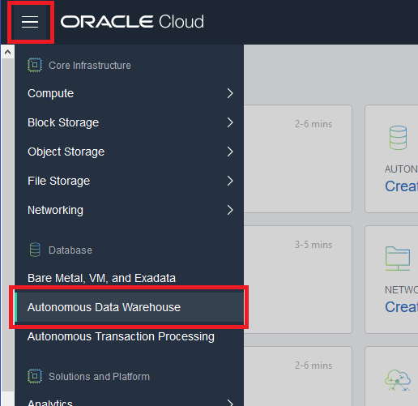
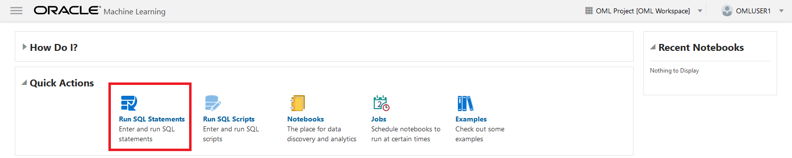
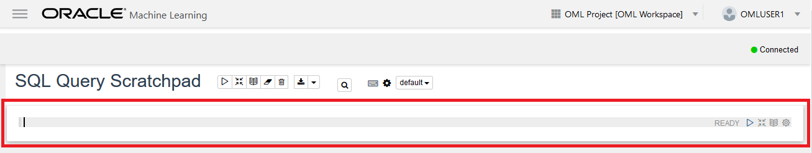

# Getting Started With Oracle Machine Learning Notebooks #

## Before You Begin ##
In this 15-minute lab you will get started with the Oracle Machine Learning (OML) notebook application provided through ADW. This browser-based application provides a web interface to run SQL queries and scripts, which can be grouped together within a notebook. Notebooks can be used to build single reports, collections of reports, and dashboards.

### Background ###
Oracle Machine Learning is a SQL notebook interface for data scientists to perform machine learning in the Oracle Autonomous Data Warehouse (ADW). Notebook technologies allows for the creation of scripts while supporting the documentation of assumptions, approaches and rationale to increase data science team productivity. Oracle Machine Learning SQL notebooks, based on Apache Zeppelin technology, enables collaborate allowing teams to build, evaluate and deploy predictive models and analytical methodologies in the Oracle Autonomous Data Warehouse. The same notebook can be opened simultaneously by different users and any changes made are immediately updated for other team members.

Oracle Machine Learning SQL notebooks provide easy access to Oracle's parallelized, scalable in-database implementations of a library of Oracle Advanced Analytics' machine learning algorithms (classification, regression, anomaly detection, clustering, associations, attribute importance, feature extraction, times series, etc.), SQL, PL/SQL and Oracle's statistical and analytical SQL functions. Oracle Machine Learning SQL notebooks and Oracle Advanced Analytics' library of machine learning SQL functions combined with PL/SQL allow companies to automate their discovery of new insights, generate predictions and add "AI" to data viz dashboards and enterprise applications.


### What Do You Need? ###
* Access to an instance of Oracle Autonomous Data Warehouse (ADW)
* Have completed the previous lab **Provisioning Autonomous Data Warehouse**.


## Create an OML User ##
1. Sign in to the [Oracle Cloud](https://cloud.oracle.com/home).
2. Click the menu icon to expand the menu on the left edge of the screen.
3. Click **Autonomous Date Warehouse**.

    

    [Description of the illustration OCIMenu.png](files/OCIMenu.txt)

4. Click the name of the instance you created in the previous lab.
5. You're taken to the instance page which displays details about your instance. Make sure your ADW instance finished provisioning. It should have a status of AVAILABLE. If it's still provisining, please wait until this completes.
6. Click the **Service Console** button.
7. Depending on your browser settings, you may need to give permission for the Service Console to open in a new tab. In Firefox:
     * Click **Preferences**
     * Click the final option to **Show** the content.

    

    [Description of the illustration ShowNewTab.png](files/ShowNewTab.txt)

8. The service console opens in the **Overview** mode. Click **Administration** in the left navigation pane.
9. Click **Manage Oracle ML Users**.

    

    [Description of the illustration ServiceConsole.png](files/ServiceConsole.txt)

10. If prompted login as the user admin with the password you specified when creating the ADW instance.
11. Click the **Create** button to create a new OML user. This will also create a new database user with the same name. The newly created user will be able to use the OML notebook application.

    

    [Description of the illustration CreateUser.png](files/CreateUser.txt)

12. You're taken to the Create Users page. Enter the following information:
     * **Username**: `omluser1`
     * **First Name**: `OML`
     * **Last Name**: `User1`
     * **Email Address**: For easy access, enter the same email address you used to login to your cloud account.
     * **Password:** Uncheck the box to auto generate a password. Instead create a new password yourself.
13. Click the **Create** button. You're taken back to the Users page where the new user is now listed.
14. You'll also recieve a confirmation email that your OML user has been created. This email contains a direct link to the OML application sign in, and your password if you chose to auto-generate one.


## Sign in to OML ##
1. Go to the OML sign in page. You have two options to navigate there:
     * Click the link included in your confirmation, or... 
     * Click the **Home** button on the Users page.

    

    [Description of the illustration CreateUser2.png](files/CreateUser2.txt)

2. Sign in using these credentials:
     * Part 1 (This part may already be done):
        * **Tenant**: This is the Cloud Account name you chose when you first registered for your trial. 
        * **Database**: `ADWFINANCE`
     * Part 2:
        * **Username**: `omluser1`
        * **Password**: Use the password you just created.
3. You're taken to the OML home page.
    

## Open a New SQL Query Scratchpad ##
1. Click **Run SQL Statements** in the Quick Actions window.

    

    [Description of the illustration QuickActions.png](files/QuickActions.txt)

2. You're taken to a SQL Query Scratchpad. You'll notice a white panel below the title. This is the “paragraph” zone. Within a scratchpad you can have multiple paragraphs. Each paragraph can contain one SQL statement or a SQL script.
    
    

    [Description of the illustration SQLParagraph.png](files/SQLParagraph.txt)

3. Copy this code: 
   ````SQL
    SELECT 
     p.prod_category_desc,
     t.calendar_year as year,
     t.calendar_month_desc as Month,
     TRUNC(SUM(amount_sold)) as revenue,
     TRUNC(AVG(SUM(amount_sold)) over (PARTITION BY t.calendar_year ORDER BY p.prod_category_desc, t.calendar_month_desc ROWS 2 PRECEDING)) as avg_3M_revenue,
     TRUNC(AVG(SUM(amount_sold)) over (ORDER BY p.prod_category_desc, t.calendar_month_desc ROWS 5 PRECEDING)) as avg_6M_revenue,
     TRUNC(AVG(SUM(amount_sold)) over (ORDER BY p.prod_category_desc, t.calendar_month_desc ROWS 11 PRECEDING)) as avg_12M_revenue 
    FROM sh.sales s, sh.times t, sh.products p
    WHERE s.time_id = t.time_id
    AND s.prod_id = p.prod_id
    AND prod_category_desc = 'Electronics'
    GROUP BY p.prod_category_desc, t.calendar_year, calendar_month_desc
    ORDER BY p.prod_category_desc, t.calendar_year, calendar_month_desc;
   ````
4. Left-click the paragraph zone so it turns gray.
5. Paste the code using the keyboard shortcut **CTRL+V**. You won't be able to paste by right-clicking. 
6. Press the button to run the paragraph. It's located in the top right corner of the SQL paragraph area.

    

    [Description of the illustration RunParagraph.png](files/RunParagraph.txt)

7. Observe the results. If the Zip Lab event has quizzes, you'll need this output to answer a quiz question.

    

    [Description of the illustration SQLOutput.png](files/SQLOutput.txt)


## Change the Report Type ##
The report menu bar lets you change the table to a graph and/or export the result set to a CSV or TSV file. When you change the report type to one of the graphs, a Settings link appears to the right of the menu. Settings
allows you to control the layout of columns within the graph.

   

   [Description of the illustration ReportMenuBar.png](files/ReportMenuBar.txt)

1. Change the report type to a bar chart.
2. Click **Settings** to unfold the settings panel.

    

    [Description of the illustration BarChart1.png](files/BarChart1.txt)


## Change the Layout of the Graph ##
Now that we're showing a bar graph, let's see how the output can be customized. To add a column to one of the Keys, Groups of Values panels just drag and drop the column name into the required panel. To remove a column from the Keys, Groups of Values panel just click on the **x** next to the column name displayed in the relevant
panel.

1. If you don't see the keys and values panel click on the settings drop down. This will show the columns available and the keys, groups and values columns.
2. Remove all columns from the both the Keys and Values panels.
3. Drag and drop **MONTH** into the **Keys** panel.
4. Drag and drop **REVENUE** into the **Values** panel.
5. Drag and drop **AVG_12M_REVENUE** into the **Values** panel.

    

    [Description of the illustration BarChart2.png](files/BarChart2.txt)


## Tidy up the Report ##
1. Click **Settings** to hide the layout controls.
2. Click the **Hide editor** button which is to the right of the "Run this paragraph" button.

    

    [Description of the illustration HideEditor.png](files/HideEditor.txt)

3. Now only the output is visible.

    

    [Description of the illustration BarChart3.png](files/BarChart3.txt)


## Save the Scratchpad as a New Notebook ##
The SQL Scratchpad we're using is simply a default type notebook with a system generated name. You can change the name of the scratchpad and save it for later use by your team.

1. Click the menu icon in left corner of the page to expand a navigation menu, and select **Home**.
2. Click **Notebooks** in the Quick Actions panel.
3. Click on the comment field of the SQL Query Scratchpad record. Don't click on the hyperlink of the notebook or it will launch it. After you click, the item becomes selected (highlighted in blue) and the menu buttons above will activate.
4. Click the **Edit** button to pop-up the settings dialog for this notebook.
5. Modify the details for this notebook to something more informative:
     * **Name**: `Sales Analysis Over Time`
     * **Comment**: `Sales analysis bar graph`
     * **Connection**: `Global` 
        Note: Connection information is read-only. It's managed by the Autonomous Data Warehouse.
6. Click **OK** to save your notebook. You will see that your SQL Query Scratchpad notebook is now renamed to the new name you specified.

    

    [Description of the illustration Notebooks.png](files/Notebooks.txt)

You've opened quite a few tabs finishing this lab. Close the last three browser tabs for the Cloud. For the next labs, the only tab you'll need is for the ADW instance's details page.


[Description of the illustration adw_instance.png](files/adw_instance.txt)

## Want to Learn More? ##
* [Data Management Cloud Courses](https://learn.oracle.com/pls/web_prod-plq-dad/dl4_pages.getpage?page=dl4homepage&get_params=offering:35573#filtersGroup1=&filtersGroup2=.f667&filtersGroup3=&filtersGroup4=&filtersGroup5=&filtersSearch=) from Oracle University 
* [Autonomous Database Cloud Certification](https://education.oracle.com/en/data-management/autonomous-database/product_817?certPage=true) from Oracle University
* [ADW Test Drive Workshop](https://oracle.github.io/learning-library/workshops/journey4-adwc/?page=README.md)
