# Creating an APEX Application from a Spreadsheet for ATP #

## Before You Begin ##
This 15-minute lab walks you through uploading a spreadsheet into an Oracle database table, and then creating an application based on this new table. You will then play with the Interactive Report and improve the attached form. Lastly, you will add a Calendar page and then link it to the existing form page. This lab is written for Autonomous Transaction Processing (ATP), but may also be completed in Autonomous Data Warehouse (ADW).

## Background ##
Rather than trying to email a spreadsheet to gather information from different people, simply use the Oracle Cloud to create an app in minutes, and email the URL. This single source-of-truth, multi-user, secured, scalable app is so much better than having 20 (incomplete) spreadsheets!

### What Do You Need? ###
* Access to an instance of Oracle ATP.
* Complete the previous lab **Provisioning Autonomous Transaction Processing**.


## Access Application Express (APEX) ##
1. Sign in to the Oracle Cloud. 
2. Click the menu icon to expand the menu on the left edge of the screen.
3. Click **Autonomous Transaction Processing**.

    

    [Description of the illustration OCIMenu.png](files/OCIMenu.txt)

4. Click the name of the instance you created in the previous lab. 
5. You're taken to the instance page which displays details about your instance. 
6. Click the **Service Console** button.
7. Depending on your browser settings, you may need to give permission for the Service Console to open in a new tab. In Firefox:
     * Click **Preferences**
     * Click the final option to **Show** the content.

    

    [Description of the illustration ShowNewTab.png](files/ShowNewTab.txt)

8. The service console opens to the **Overview** page. Click **Development** in the left navigation pane.
9. Click the **APEX** button.
10. Enter your OCI password to sign into APEX Administrative Services.
11. Click **Sign In to Administration**.

    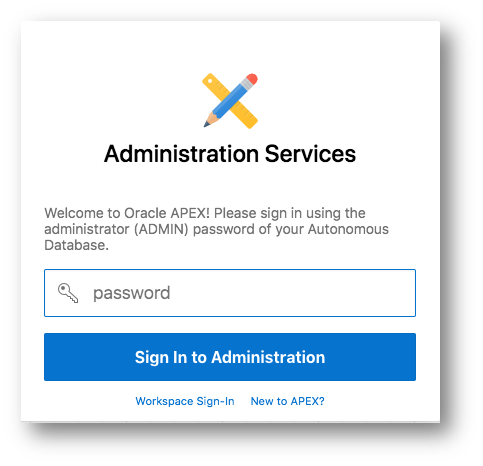


## Create a Workspace for a New User ##
If this is your first time entering APEX, you'll need to create a workspace. Otherwise, skip to the next section.

1. Click the **Create Workspace** button.
2. Identify a user for the new workspace. Remember this information so you can log in later:
     * **Database User**: `ZipLabs`
     * **Password**: Click the **?** icon to see the password complexity rules. 
     * **Workspace Name**: `ZipLabs`
3. Click **Create Workspace**.

    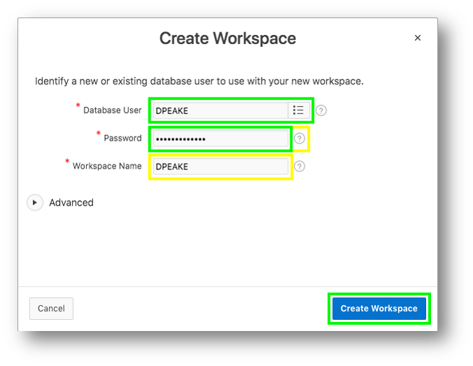


## Log into your Workspace ##
If you're signed in as an existing user, skip to the next section. Otherwise if you're a new user or signed in as Admin, follow these steps.

1. Click on the link within the success message {easiest technique} OR Click on the Admin user (top right), click **Sign Out**, and then click **Return to Sign In Page**.

    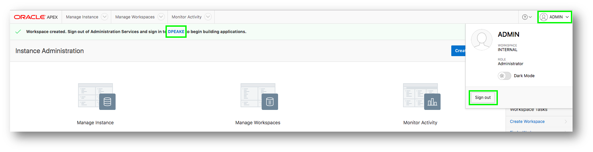

2. Sign in using the credentials from the previous section.
     * **Workspace**: `ZipLabs`
     * **Username**: `ZipLabs`
     * **Password**: Use your password from the previous section.
     * **Remember workspace and username**: Check this box.
3. Click **Sign In**.
4. If this is the first time entering a the Workspace, the new user must reset their password. Click the **Set APEX Account Password** button.
5. Enter the following information for your new user profile:
    * **Email Address**: Enter your email address
    * **Password**: Click the **?** icon to see the password complexity rules. 
6. Click **Apply Changes**.

    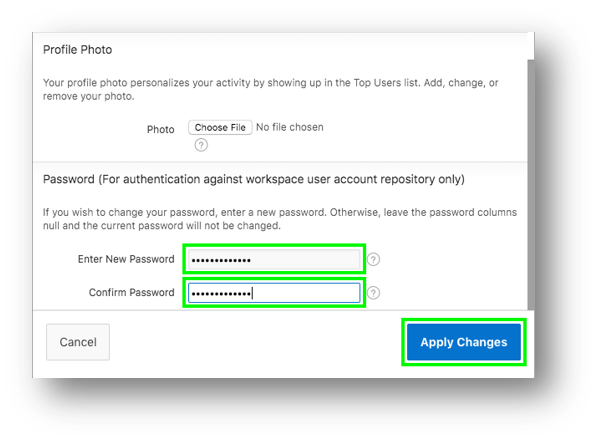


## Create an App from a Spreadsheet ##
1. Log in and create a new app.
    * Log into your workspace.
    * Click **App Builder**.
    * Click **Create a New App**.

    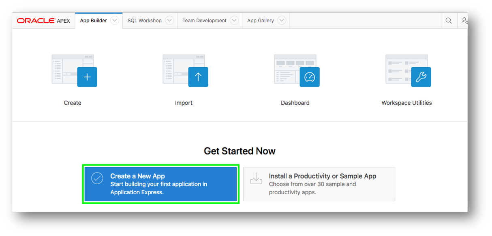

2. Click **From a File** as the application type.

    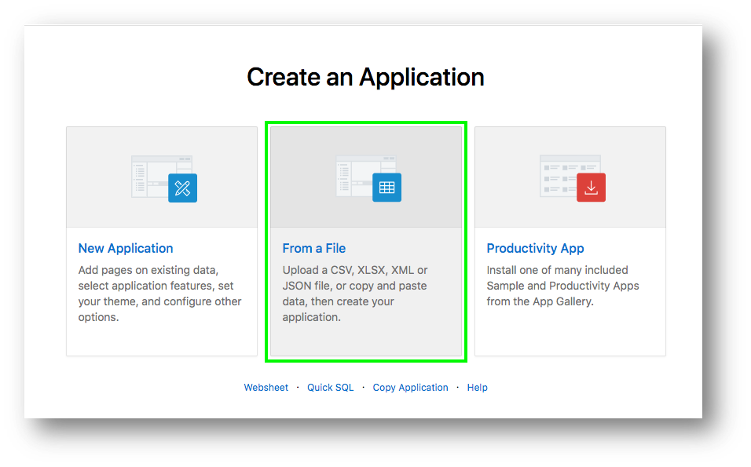

3. Load sample data.
    * Click **Copy and Paste**.
    * Select **Project and Tasks** for the sample data set.
    * Click **Next**.

    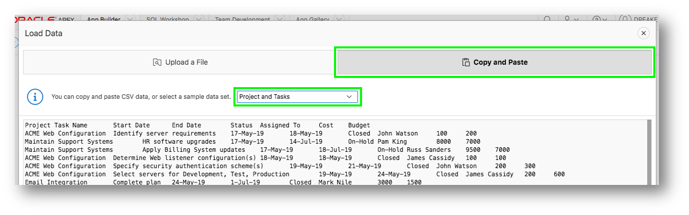

4. Name the table.
    * Enter the table name `SPREADSHEET`.
    * Click **Load Data**.

    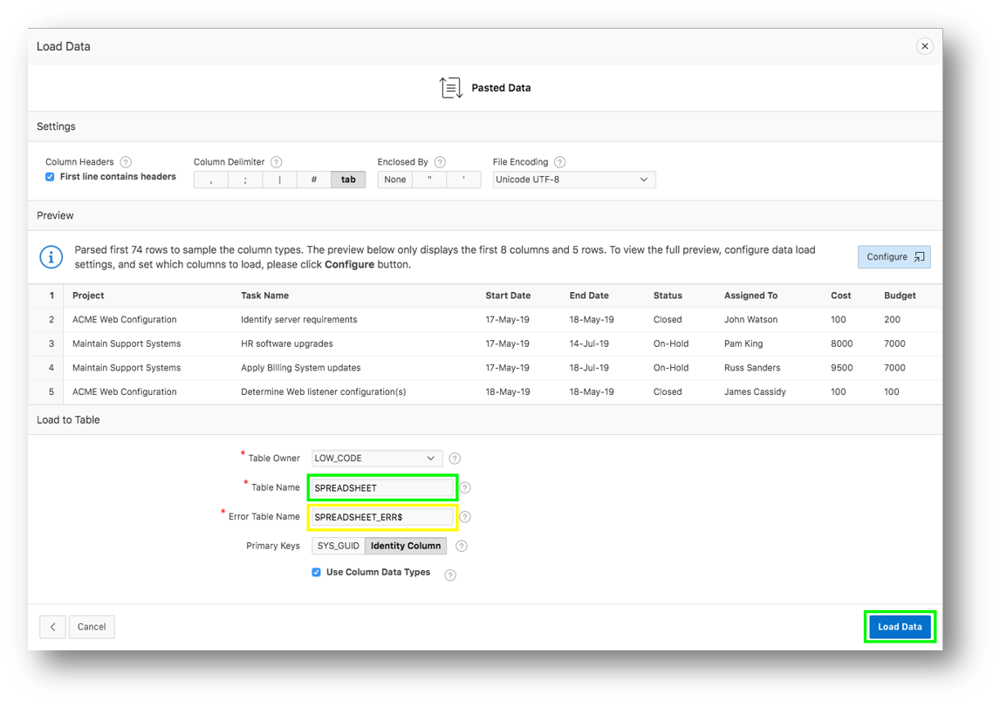

5. Verify the records loaded.
    * Check that 73 rows are loaded.
    * Click **Continue to Create Application Wizard**.

    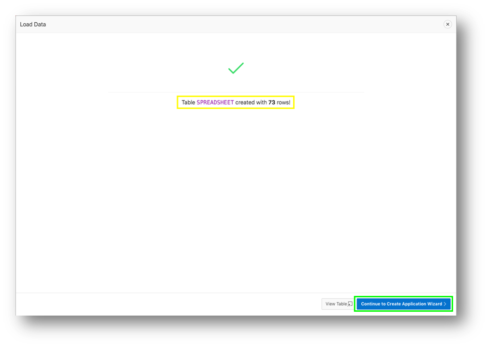

6. Name the application.
    * Enter the name `App from a Spreadsheet`.
    * Next to Features, click **Check All**.

    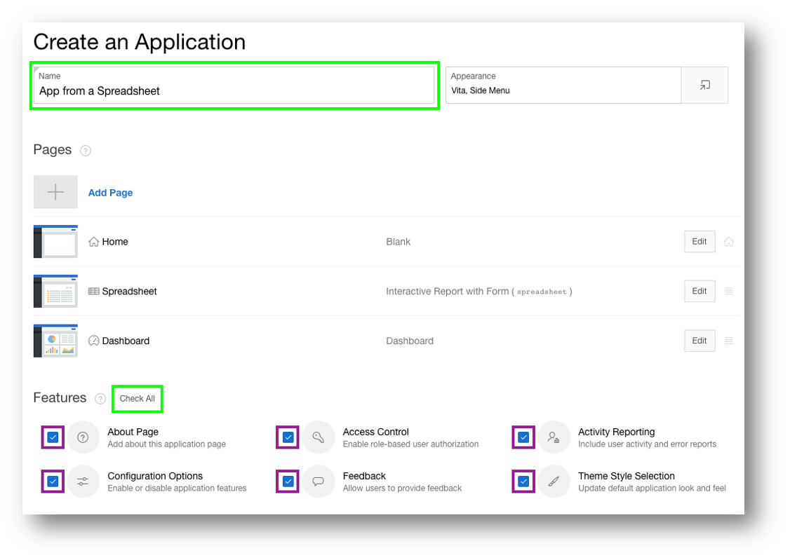

7. Click **Create Application**.

    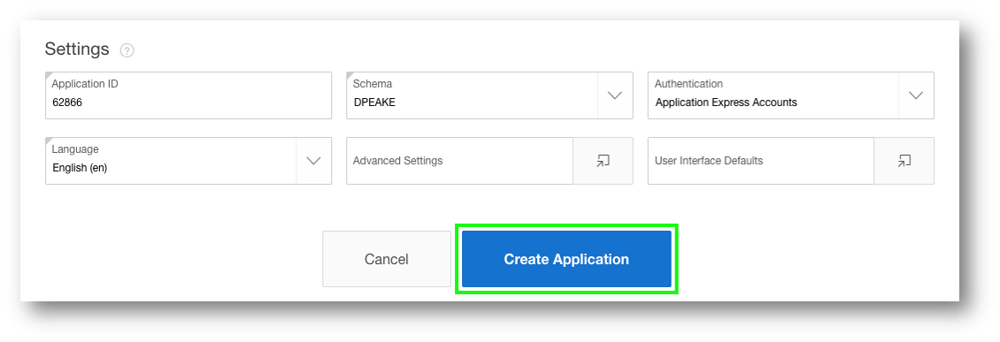

8. Your new application is displayed in Page Designer. This is where you can run the application from.
    * Click **Run Application**.
    * Enter your user credentials. This is for the user `ZipLabs`.

    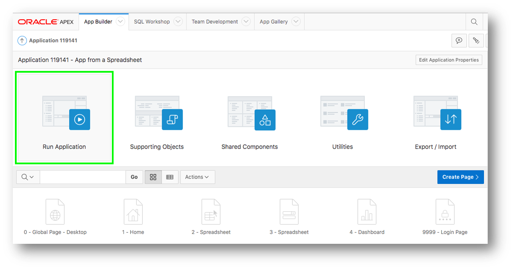

9. Your application should be running and is displayed in Page Designer.

    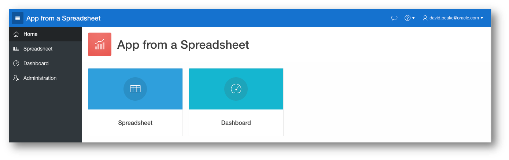


## Improve the Report and Form
1. Sort the interactive report.
    * Click **Spreadsheet**.
    * Click **Actions**, select **Data**, select **Sort**.

    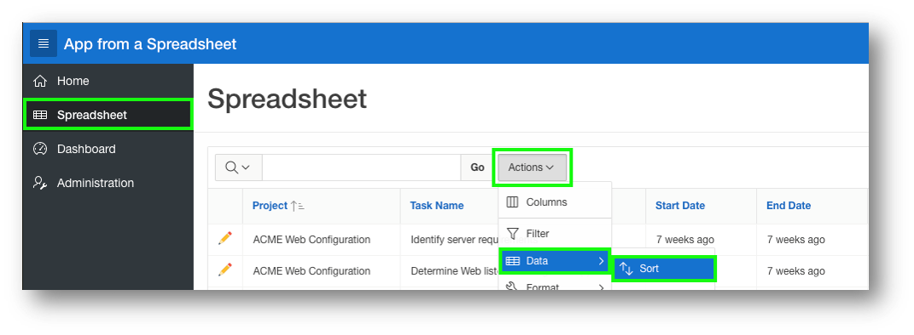

    * For 1, select **Start Date**.
    * For 2, select **End Date**.
    * Click **Apply**.

    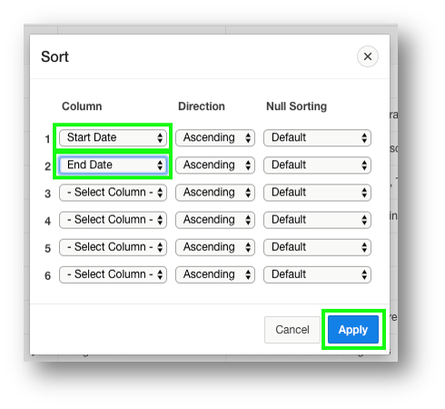

2. Add a computation.
    * Click **Actions**, select **Data**, select **Compute**.
    * **Column Label**: `Budget V Cost`
    * **Format Mask**: `$5,234.10`
    * **Computation Expression enter** `I – H`
    * Click **Apply**.

    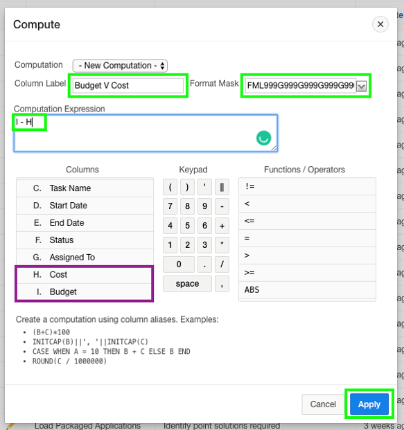

3. Add a chart.
    * Click **Actions**, select **Chart**.
    * **Label**: `Project`
    * **Value**: `**Budget V Cost`
    * **Function**: `Sum`.
    * **Sort**: `Label – Ascending`
    * **Orientation**: `Horizontal`
    * Click **Apply**.

    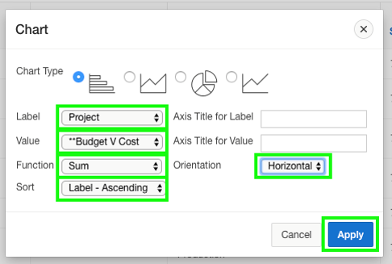

    * Use **View Report / View Chart** icons to switch views.

    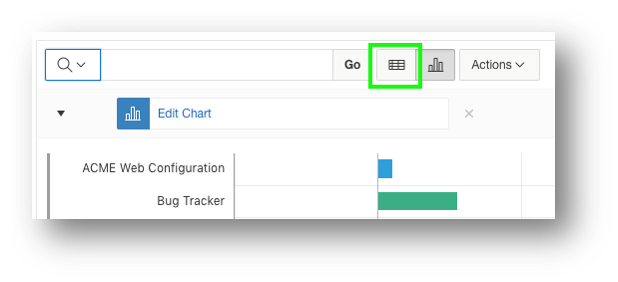

    

4. Save the report.
    * Click **Actions**, select **Report**, select **Save Report**.
    * For Save, select **As Default Report Settings**.

    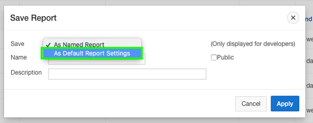

    * **Default Report Type**: `Alternative`.
    * **Name**: `Date Review`.
    * Click **Apply**.

    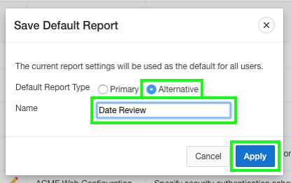

5. Restrict the status.
    * In the runtime environment, click the **edit** icon on a record. A modal page will be displayed.
    * In the Developer Toolbar, click **Quick Edit**.
    * Hover over the **Status** item (until a blue outline appears) and click the mouse. Page Designer displays with focus on the Status item.

    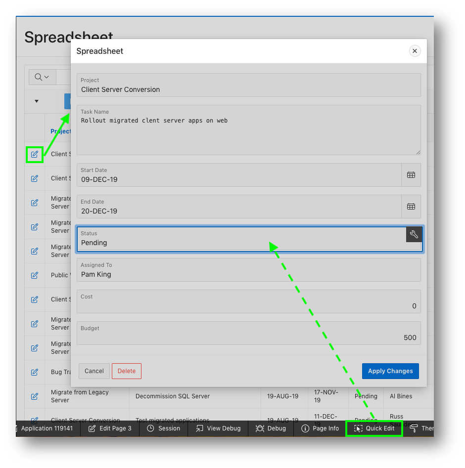

    * In Page Designer, within the Property Editor (right pane), for Type select **Select List**.
    * Under List of Values, for Type select **SQL Query**.
    * Next to SQL Query, click **Code Editor**.

    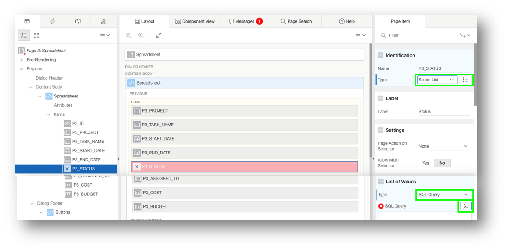

    * Within the Code Editor, enter the following:
   ````SQL
   select distinct status d, status r
   from spreadsheet
   order by 1
   ````
    * Click **Validate**.
    * Click **OK**.

    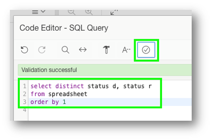

    * **Display Extra Values**: `No`
    * **Null Value Display**: `- Select Status -`
    * Click **Save** (In the toolbar - top right).

    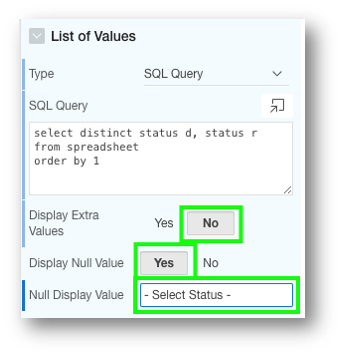

6. Run the application.
    * Navigate back to the runtime environment.
    * Refresh the browser.
    * Edit a record.
    * Click **Status**.

    


## Want to Learn More? ##
* [Autonomous Database Cloud Certification](https://education.oracle.com/en/data-management/autonomous-database/product_817?certPage=true) from Oracle University
* [Data Management Cloud Courses](https://learn.oracle.com/pls/web_prod-plq-dad/dl4_pages.getpage?page=dl4homepage&get_params=offering:35573#filtersGroup1=&filtersGroup2=.f667&filtersGroup3=&filtersGroup4=&filtersGroup5=&filtersSearch=) from Oracle University
* [Oracle Application Express Training and Certification](https://education.oracle.com/database-application-development/oracle-apex/product_172) from Oracle University
