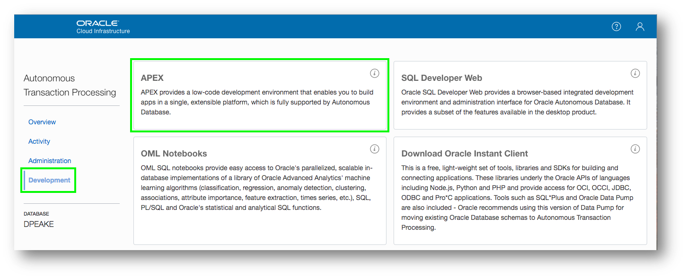

# Oracle APEX on ATP Hands-On Lab 
## *Creating an App from a Spreadsheet* for Oracle Autonomous Transaction Processing Service
### Overview
This lab walks you through uploading a spreadsheet into an Oracle database table, and then creating an application based on this new table. You will then play with the Interactive Report and improve the attached form. Lastly, you will add a Calendar page and then link it to the existing form page.

Rather than trying to email a spreadsheet to gather information from different people, simply create an app in minutes, and email the URL. This single source-of-truth, multi-user, secured, scalable app is so much better than having 20 (incomplete) spreadsheets!

### What Do You Need? ###
* Access to an instance of Oracle Autonomous Data Transaction Processing (ATP) or Oracle Autonomous Data Warehouse (ADW)

## Section 1
### Getting Started - Obtaining a Workspace
_Note: If you have a workspace on the Autonomous Database Cloud Service then you can skip this section and move to Section 2._

### Step 1.1 - Accessing APEX
* Sign into your Oracle Cloud service
* Click the hamburger (top left),  select Autonomous Data Warehouse or Autonomous Transaction Processing, based on which service(s) you have defined.

* Click **Your Database** from the list

* Click **Service Console** 

* Click **Development**
* Click **APEX** ***

### Step 1.2 - Creating a Workspace

* To sign into APEX Administrative Services for Password enter your OCI Password
* Click **Sign In to Administration**

* Given this is your first time entering APEX, click **Create Workspace**

* For Database User enter an appropriate name
* Enter a Password *Click the ? Icon to see password complexity rules*

* Click **Create Workspace**

_Note: The Database User will be used for the Workspace Name. If you want you can update the Workspace Name_

### Step 1.3 - Log into your New Workspace
* Click on the link within the success message {easiest technique} OR Click on the Admin user (top right), click **Sign Out**, and then click **Return to Sign In Page**

* Sign into your new Workspace 

    - Workspace – enter ***Your Workspace Name***

    - Username – enter ***Your Database User***

    - Password – enter ***Your OCI Password***

    - Remember workspace and username - **Check**

* Click **Sign In**

_Note: Enter the Workspace Name and Database User entered in Step 2c above_

* Given this is your first time entering your new Workspace, click **Set APEX Account Password**

* For your user profile enter the following:

    - Email Address - enter ***your email address***

    - Enter New Password - enter ***your OCI Password***

    - Confirm Password - enter ***your OCI Password***

* Click **Apply Changes**

## Section 2
### Building your first app - Creating an App from a Spreadsheet

### Step 2.1 - Logging In
* Log into your workspace
* Click **App Builder**
* Click **Create a New App**

### Step 2.2 - Selecting App Type
* Click **From a File**

### Step 2.3 - Loading Sample Data
* Click **Copy and Paste**

* For Sample Data Set select **Project and Tasks**

* Click **Next**

### Step 2.4 - Naming the Table
* Enter Table Name ***SPREADSHEET***

* Click **Load Data**

### Step 2.5 - Verifying Records Loaded
* Check that 73 rows are loaded

* Click **Continue to Create Application Wizard**

### Step 2.6 - Naming the App
* Enter Name ***App from a Spreadsheet***

* Next to Features, click **Check All**

### Step 2.7 - Create Application
* Click **Create Application**

### Step 2.8 - App in Page Designer
* Your new application will be displayed in Page Designer

* Click **Run Application**

### Step 2.9 - Runtime App
* Enter your user credentials

* Play around with your new application

## Section 3
### Using the Runtime Environment - Improving the Report and Form

### Step 3.1 - Sort the Interactive Report
* Your new application will be displayed in Page Designer

* Click **Spreadsheet**
* Click **Actions**, select **Data**, select **Sort**

* For 1, select **Start Date** 
* For 2, select **End Date**
* click **Apply**

### Step 3.2 - Add a Computation
* Click **Actions**, select **Data**, select **Compute**
* Column Label enter **Budget V Cost**
* Format Mask select **$5,234.10**
* Computation Expression enter **I – H**
* Click **Apply**

### Step 3.3 - Add a Chart
* Click **Actions**, select **Chart**
* Label select **Project**
* Value select __**Budget V Cost__
* Function select **Sum**
* Sort select **Label – Ascending**
* Orientation select **Horizontal**
* Click **Apply**

* Use **View Report / View Chart** icons to switch views ***

### Step 3.4 - Save Report
* Click **Actions**, select **Report**, select **Save Report**
* For Save, select **As Default Report Settings**

* Default Report Type, select **Alternative**
* Name, enter **Date Review**
* Click **Apply**

### Step 3.5 - Restrict the Status
* In the runtime environment, click the edit icon on a record
* A modal page will be displayed
* In the Developer Toolbar, click **Quick Edit**
* Hover over the **Status** item (until a blue outline appears) and click the mouse
* Page Designer displays with focus on the Status item

* In Page Designer, within the Property Editor (right pane), for Type select **Select List**
* Under List of Values, for Type select **SQL Query**
* Next to SQL Query, click **Code Editor**

* Within the Code Editor, enter the following:

        select distinct status d, status r
        from spreadsheet
        order by 1

* Click **Validate**
* Click **OK**

* Display Extra Values, select **No**
* Null Value Display, enter **- Select Status -**
* Click **Save** (In the toolbar - top right)

### Step 3.6 - Run the App
* Navigate back to the runtime environment
* Refresh the browser
* Edit a record
* Click **Status**

## Want to Learn More? ##
* [Autonomous Database Cloud Certification](https://education.oracle.com/en/data-management/autonomous-database/product_817?certPage=true) from Oracle University
* [Autonomous Cloud Platform Courses](https://learn.oracle.com/pls/web_prod-plq-dad/dl4_pages.getpage?page=dl4homepage&get_params=offering:35573#filtersGroup1=&filtersGroup2=.f667&filtersGroup3=&filtersGroup4=&filtersGroup5=&filtersSearch=) from Oracle University
* [Oracle Application Express Training and Certification](https://education.oracle.com/database-application-development/oracle-apex/product_172) from Oracle University

