# Creating an APEX Application from Existing Tables for ATP #

## Before You Begin ##
This 15-minute lab walks you through creating an application based on existing tables in your Oracle Database. Go from zero to hero in a ridiculously short period of time! This lab is written for Autonomous Transaction Processing (ATP), but may also be completed in Autonomous Data Warehouse (ADW).

### What Do You Need? ###
* Access to an instance of Oracle ATP.
* Complete the previous lab **Provisioning Autonomous Transaction Processing**.

## Access Application Express (APEX) ##
1. Sign in to the Oracle Cloud. 
2. Click the menu icon to expand the menu on the left edge of the screen.
3. Click **Autonomous Transaction Processing**.

    

    [Description of the illustration OCIMenu.png](files/OCIMenu.txt)

4. Click the name of the instance you created in the previous lab. 
5. You're taken to the instance page which displays details about your instance. 
6. Click the **Service Console** button.
7. Depending on your browser settings, you may need to give permission for the Service Console to open in a new tab. In Firefox:
     * Click **Preferences**
     * Click the final option to **Show** the content.

    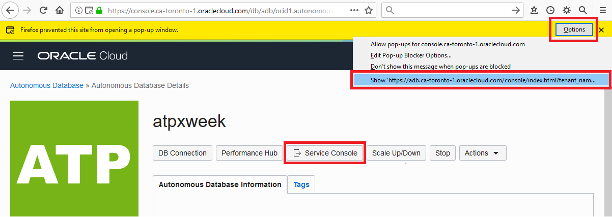

    [Description of the illustration ShowNewTab.png](files/ShowNewTab.txt)

8. The service console opens to the **Overview** page. Click **Development** in the left navigation pane.
9. Click the **Application Express** button.
10. Enter your OCI password to sign into APEX Administrative Services.
11. Click **Sign In to Administration**.

    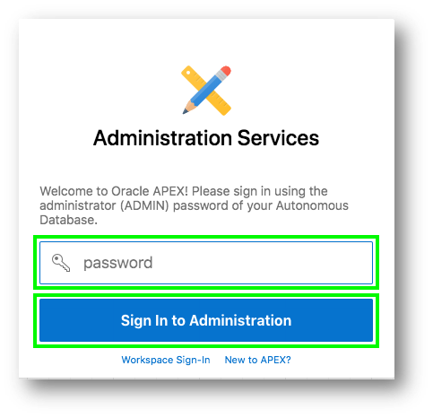

## Create a Workspace for a New User ##
If this is your first time entering APEX, you'll need to create a workspace. Otherwise, skip to the next section.

1. Click the **Create Workspace** button.
2. Identify a user for the new workspace. Remember this information so you can log in later:
     * **Database User**: `ZipLabs`
     * **Password**: Click the **?** icon to see the password complexity rules. 
     * **Workspace Name**: `ZipLabs`
3. Click **Create Workspace**.

    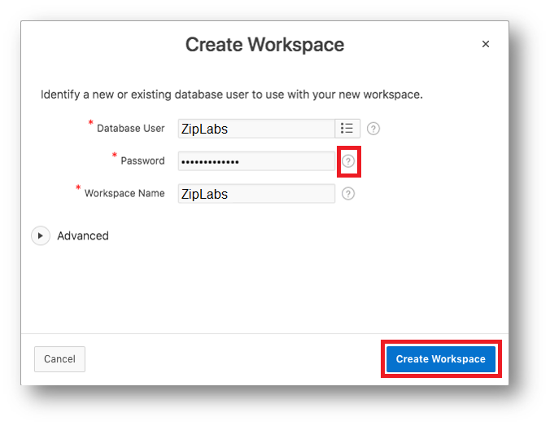

## Log into your Workspace ##
If you're signed in as an existing user, skip to the next section. Otherwise if you're a new user or signed in as Admin, follow these steps.

1. Click on the link within the success message {easiest technique} OR Click on the Admin user (top right), click **Sign Out**, and then click **Return to Sign In Page**.

    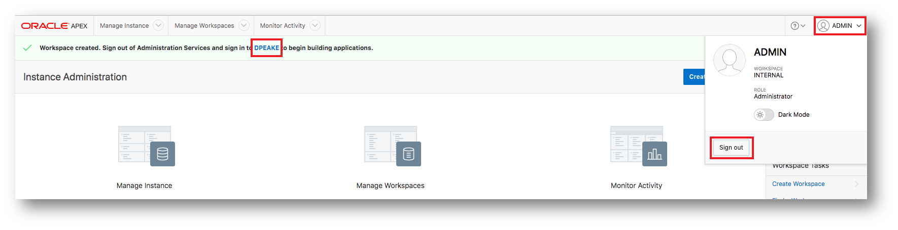

2. Sign in using the credentials from the previous section.
     * **Workspace**: `ZipLabs`
     * **Username**: `ZipLabs`
     * **Password**: Use your password from the previous section.
     * **Remember workspace and username**: Check this box.
3. Click **Sign In**.
4. If this is the first time entering a the Workspace, the new user must reset their password. Click the **Set APEX Account Password** button.
5. Enter the following information for your new user profile:
    * **Email Address**: Enter your email address
    * **Password**: Click the **?** icon to see the password complexity rules. 
6. Click **Apply Changes**.

    

## Install Sample Tables to Create Tables and View ## 

1. From the main menu, select **SQL Workshop**, select **Utilities**, click **Sample Datasets**.

    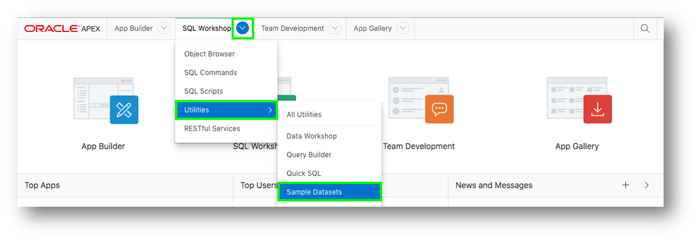

2. Create the Project tables. Note that we do not want to create an application directly on the tables.
    * On the Project Data row, click **Install**.

    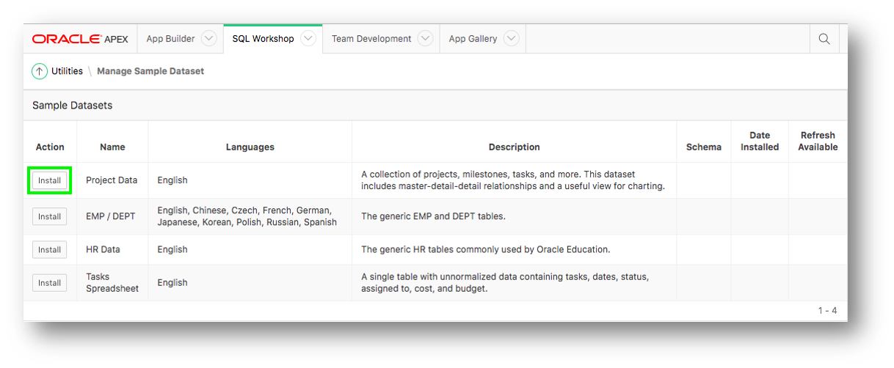

    * Click **Next**.
    * Click **Install Dataset**.
    * Click **Exit**. 

3. Review the database objects.
    * In the App Builder Menu, select **SQL Workshop**, and click **Object Browser**.

    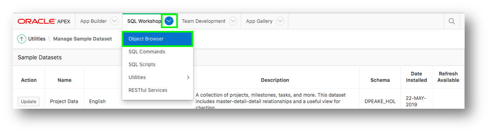

    * Click on the tables and the various tabs (such as Data, Constraints, etc.) to review the table details.

    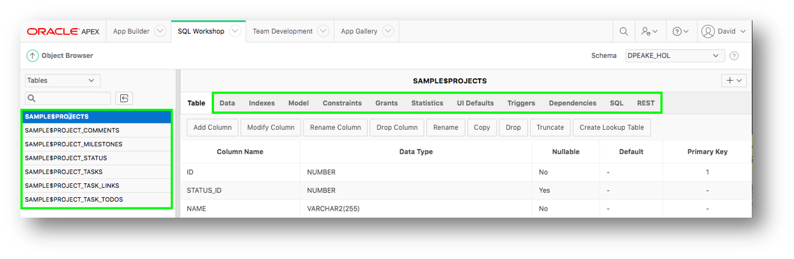

## Use the Create Application Wizard to Build Your App 

1. Create an app.
    * In the App Builder menu, click **App Builder**.
    * Click **Create**.

    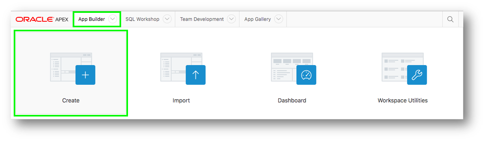

2. Click **New Application**.
3. Set the app's name an appearance.
    * For Name enter **Projects**.
    * Click **Appearance**.

    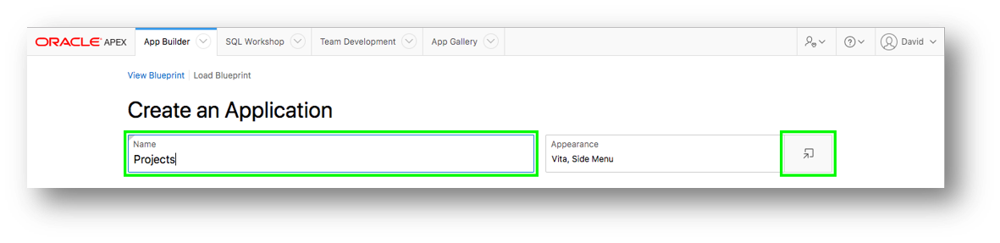

    * For Theme Style select **Vita – Slate**.
    * Click **Choose New Icon**.
    * Select the icon color and an icon.
    * Click **Set Application Item**.
    * Click **Save Changes**.

    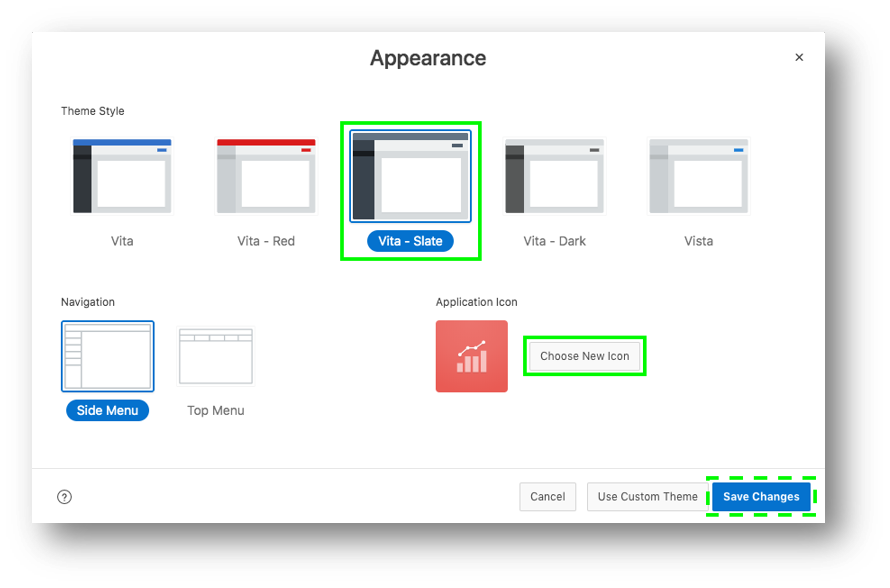

4. Add the Dashboard Page.
    * Click **Add Page**.
    * Click **Dashboard**.

    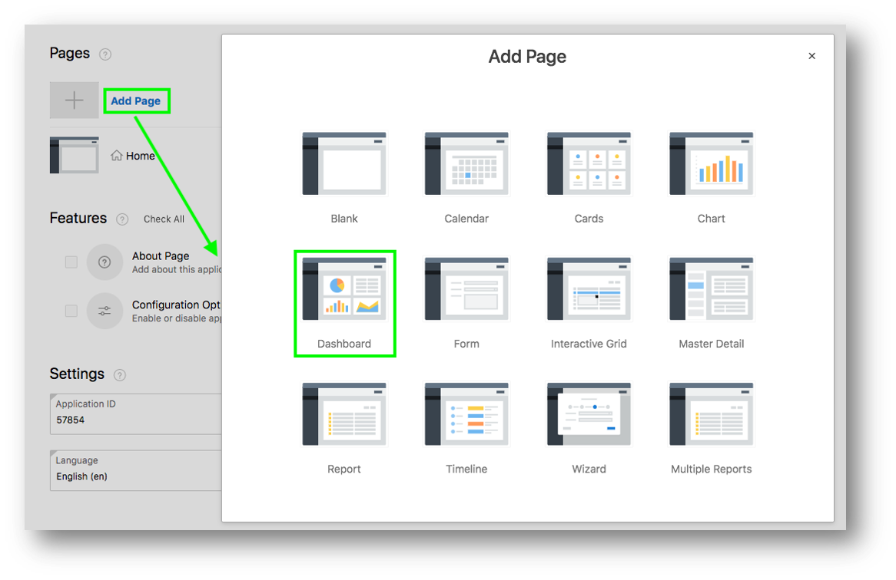

    * For Chart 1, enter the following:
        * **Chart Type**: `Bar`
        * **Chart Name**: `Budget versus Cost`
        * **Table or View**: `SAMPLE$PROJECTS_V`
        * **Label Column**: `NAME`
        * **Value Column**: `BUDGET_V_COST`

    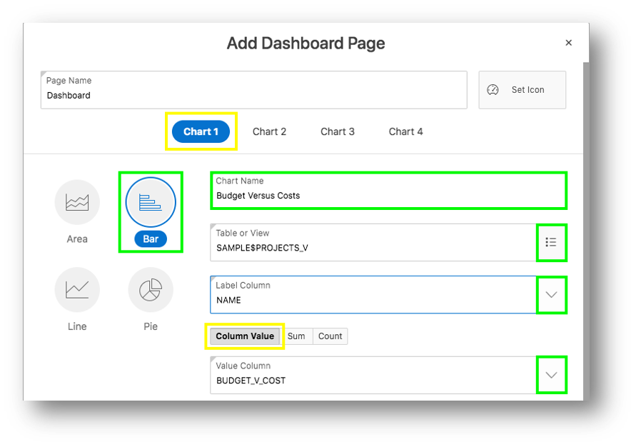

    * For Chart 2, enter the following:
        * **Chart Type**: `Pie`
        * **Chart Name**: `Project Status`
        * **Table or View**: `SAMPLE$PROJECTS_V`
        * **Label Column**: `Status`
        * **Type**: `Count`

    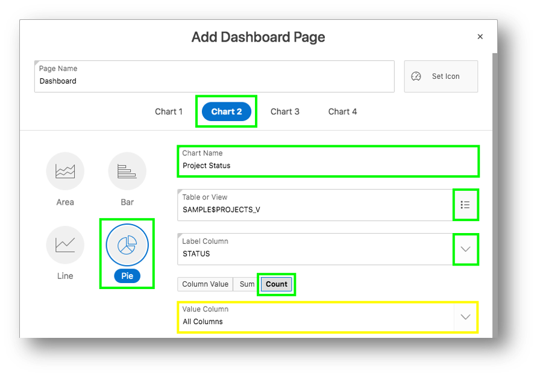

    * For Chart 3, enter the following:
        * **Chart Type**: `Bar`
        * **Chart Name**: `Project Leads`
        * **Table or View**: `SAMPLE$PROJECTS_V`
        * **Label Column**: `PROJECT_LEAD`
        * **Type**: `Count`

    * Click **Add Page**.

    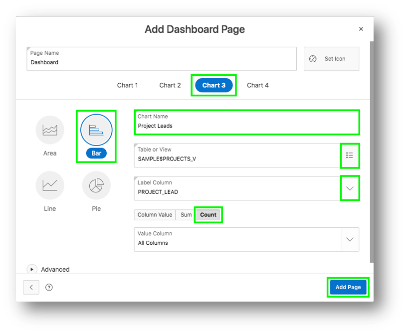

5. Add the Project Page.
    * Click **Add Page**.
    * Click **Cards**.
    * Enter the following:
        * **Page Name**: `Projects`
        * **Table**: `SAMPLE$PROJECTS`
        * **Card Title**: `NAME`
        * **Description**: `Description`
        * **Additional Text**: `PROJECT_LEAD`
    * Click **Add Page**.

    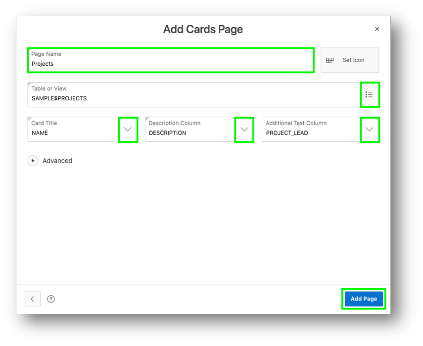

6. Add the Milestone Pages.
    * Click **Add Page**.
    * Click **Report**.
    * Enter the following:
        * **Page Name**: `Milestones`
        * **Table**: `SAMPLE$PROJECT_MILESTONES`
        * **Include Form**: Check this box.
        * **Lookup Key 1**: `PROJECT_ID`
        * **Display Col 1**: `SAMPLE$PROJECTS.NAME`
    * Click **Add Page**

    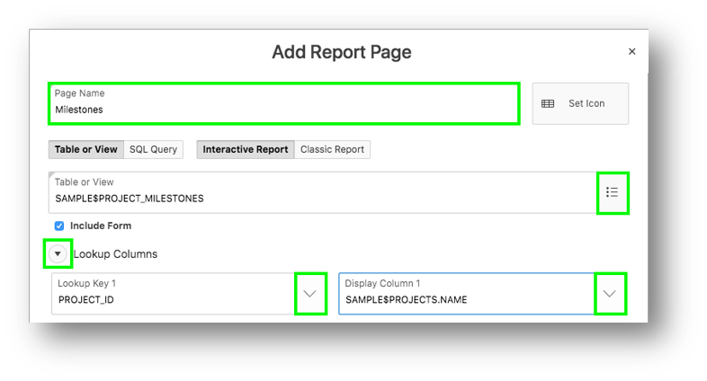

7. Add the Task Pages.
    * Click **Add Page**.
    * Click **Report**.
    * Enter the following:
        * **Page Name**: `Tasks`
        * **Table**: `SAMPLE$PROJECT_TASKS`
        * **Include Form**: Check this box.
        * **Lookup Key 1**: `PROJECT_ID`
        * **Display Col 1**: `SAMPLE$PROJECTS.NAME`
        * **Lookup Key 2**: `MILESTONE_ID`
        * **Display Col 2**: `SAMPLE$PROJECT_MILESTONES.NAME`
    * Click **Add Page**.

    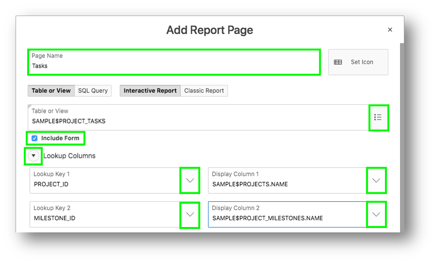

8. Add a Calendar Page.
    * Click **Add Page**.
    * Click **Calendar**.
    * Enter the following:
        * **Page Name**: `Tasks`
        * **Table**: `SAMPLE$PROJECT_TASKS`
        * **Display Column**: `NAME`
        * **Start Date Column**: `START_DATE`
        * **End Date Column**: `END_DATE`
    * Click **Add Page**.

    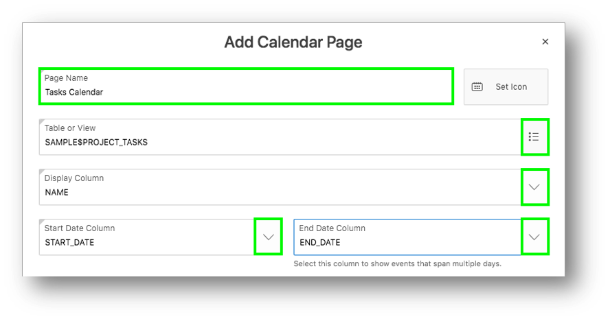

9. Include All Features
    * Next to Features, click **Check All**.
    * Click **Create Application**.

    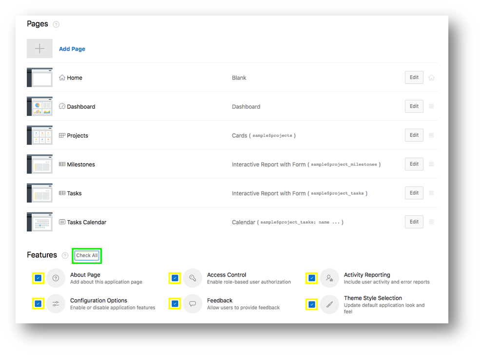

10. You'll see your new application displayed in Page Designer. Click **Run Application**.

    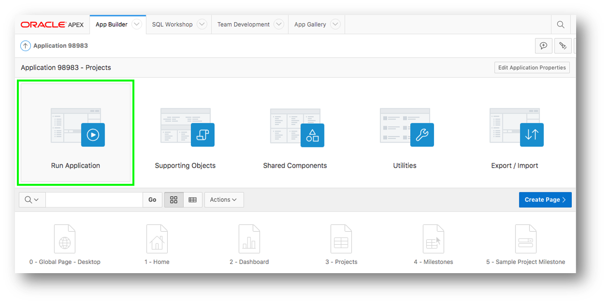

11. Run the application.
    * Enter your user credentials.
    * Play around with your new application.

    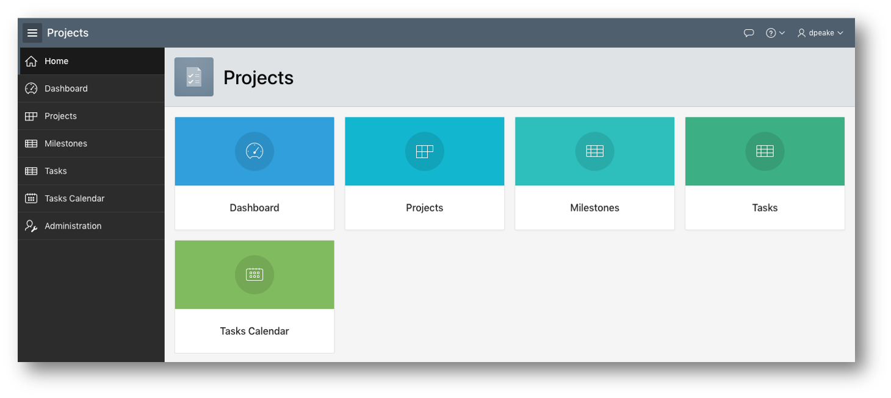

## Want to Learn More? ##
* [Autonomous Database Cloud Certification](https://education.oracle.com/en/data-management/autonomous-database/product_817?certPage=true) from Oracle University
* [Data Management Cloud Courses](https://learn.oracle.com/pls/web_prod-plq-dad/dl4_pages.getpage?page=dl4homepage&get_params=offering:35573#filtersGroup1=&filtersGroup2=.f667&filtersGroup3=&filtersGroup4=&filtersGroup5=&filtersSearch=) from Oracle University
* [Oracle Application Express Training and Certification](https://education.oracle.com/database-application-development/oracle-apex/product_172) from Oracle University

