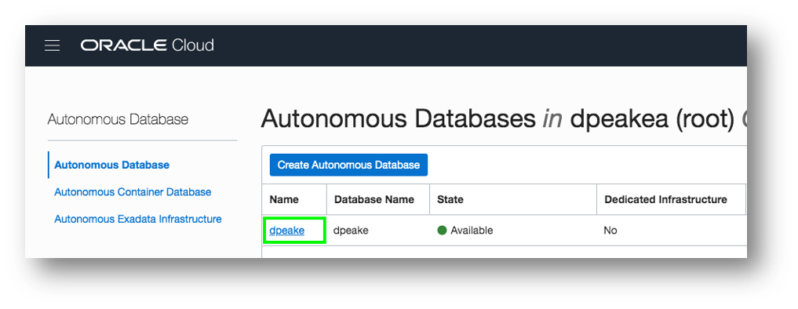
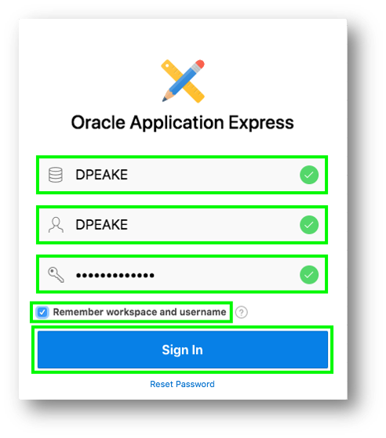
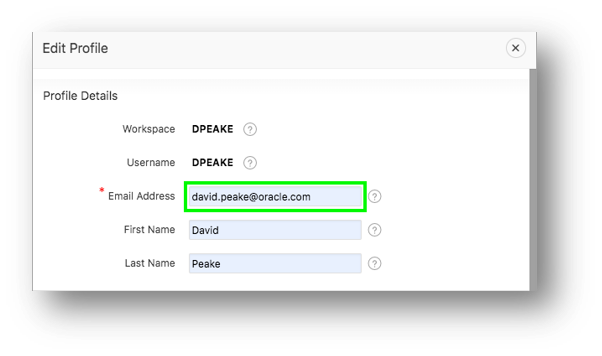
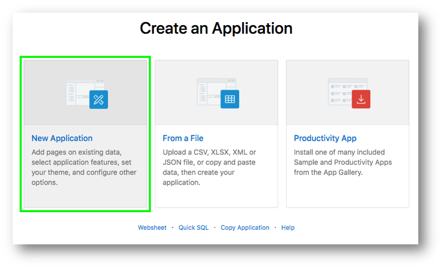

# Oracle APEX Hands-On Lab 
## *Creating an App based on Existing Tables* for Oracle Autonomous Transaction Processing Service 
### Overview
This lab walks you through creating an application based on existing tables in your Oracle Database. Go from zero to hero in a ridiculously short period of time!

### What Do You Need? ###
* Access to an instance of Oracle Autonomous Data Transaction Processing (ATP) or Oracle Autonomous Data Warehouse (ADW)

## Section 1
### Getting Started - Obtaining a Workspace
_Note: If you have a workspace on the Autonomous Database Cloud Service then you can skip this section and move to Section 2._

### Step 1.1 - Accessing APEX
* Sign into your Oracle Cloud service
* Click the hamburger (top left),  select Autonomous Data Warehouse or Autonomous Transaction Processing, based on which service(s) you have defined.

* Click **Your Database** from the list

* Click **Service Console** 

* Click **Development**
* Click **APEX** ***

### Step 1.2 - Creating a Workspace

* To sign into APEX Administrative Services for Password enter your OCI Password
* Click **Sign In to Administration**

* Given this is your first time entering APEX, click **Create Workspace**

* For Database User enter an appropriate name
* Enter a Password *Click the ? Icon to see password complexity rules*

* Click **Create Workspace**

_Note: The Database User will be used for the Workspace Name. If you want you can update the Workspace Name_

### Step 1.3 - Log into your New Workspace
* Click on the link within the success message {easiest technique} OR Click on the Admin user (top right), click **Sign Out**, and then click **Return to Sign In Page**

* Sign into your new Workspace 

    - Workspace – enter ***Your Workspace Name***

    - Username – enter ***Your Database User***

    - Password – enter ***Your OCI Password***

    - Remember workspace and username - **Check**

* Click **Sign In**

_Note: Enter the Workspace Name and Database User entered in Step 2c above_

* Given this is your first time entering your new Workspace, click **Set APEX Account Password**

* For your user profile enter the following:

    - Email Address - enter ***your email address***

    - Enter New Password - enter ***your OCI Password***

    - Confirm Password - enter ***your OCI Password***

* Click **Apply Changes**

## Section 2
### Building your tables and view - Installing Sample Tables

### Step 2.1 - Logging In
* In the main menu, select **SQL Workshop**, select **Utilities**, click **Sample Datasets**

### Step 2.2 - Creating the EMP and DEPT Tables
* On the Project Data row, click **Install**

* Click **Next**
* Click **Install Dataset**
* Click **Exit**

    *We do not want to create an application directly on the tables*

### Step 2.3 - Review Database Objects
* In the App Builder Menu, select **SQL Workshop**, and click **Object Browser**.

* Click on the tables and the various tabs (such as Data, Constraints, etc.) to review the table details

## Section 3
### Building your app - Using the Create Application Wizard

### Step 3.1 - Creating an App
* In the App Builder menu, click **App Builder**
* Click **Create**

### Step 3.2 - Selecting App Type
* Click **New Application**

### Step 3.3 - Naming the App
* For Name enter **Projects**
* Click **Appearance**

* For Theme Style select **Vita – Slate**
* Click **Choose New Icon**
* Select the icon color and an icon
* Click **Set Application Item**
* Click **Save Changes**

### Step 3.4 - Add the Dashboard Page
* Click **Add Page**
* Click **Dashboard**

* For Chart 1, enter the following:

    - Chart Type – select **Bar**
    - Chart Name – enter **Budget versus Cost**
    - Table or View – select **SAMPLE$PROJECTS_V**
    - Label Column – select **NAME**
    - Value Column – select **BUDGET_V_COST**

* For Chart 2, enter the following:

    - Chart Type – select **Pie**
    - Chart Name – enter **Project Status**
    - Table or View – select **SAMPLE$PROJECTS_V**
    - Label Column – select **Status**
    - Type – select **Count**

* For Chart 3, enter the following:

    - Chart Type – select **Bar**
    - Chart Name – enter **Project Leads**
    - Table or View – select **SAMPLE$PROJECTS_V**
    - Label Column – select **PROJECT_LEAD**
    - Type – select **Count**

* Click **Add Page**

### Step 3.5 - Add the Project Page
* Click **Add Page**
* Click **Cards**
* Enter the following:

    - Page Name - enter **Projects** 
    - Table - select **SAMPLE$PROJECTS**
    - Card Title - select **NAME**
    - Description - select **Description**
    - Additional Text - select **PROJECT_LEAD**

* Click **Add Page**

### Step 3.6 - Add the Milestone Pages
* Click **Add Page**
* Click **Report**
* Enter the following:

    - Page Name - enter **Milestones**
    - Table - select **SAMPLE$PROJECT_MILESTONES**
    - Check **Include Form**
    - Lookup Key 1 - select **PROJECT_ID**
    - Display Col 1 - select **SAMPLE$PROJECTS.NAME**

* Click **Add Page**

### Step 3.7 - Add the Task Pages
* Click **Add Page**
* Click **Report**
* Enter the following:

    - Page Name - enter **Tasks**
    - Table - select **SAMPLE$PROJECT_TASKS**
    - Check **Include Form**
    - Lookup Key 1 - select **PROJECT_ID**
    - Display Col 1 - select **SAMPLE$PROJECTS.NAME**
    - Lookup Key 2 - select **MILESTONE_ID**
    - Display Col 2 - select **SAMPLE$PROJECT_MILESTONES.NAME**

* Click **Add Page**

### Step 3.8 - Add a Calendar Page
* Click **Add Page**
* Click **Calendar**
* Enter the following:

    - Page Name - enter **Tasks**
    - Table - select **SAMPLE$PROJECT_TASKS**
    - Display Column - select **NAME**
    - Start Date Column - select **START_DATE**
    - End Date Column - select **END_DATE**

* Click **Add Page**

### Step 3.9 - Include All Features
* Next to Features, click **Check All**

* Click **Create Application**

### Step 3.10 - App in Page Designer
* Your new application will be displayed in Page Designer
* Click **Run Application**

### Step 3.11 - Runtime App
* Enter your user credentials
* Play around with your new application

## Want to Learn More? ##
* [Autonomous Database Cloud Certification](https://education.oracle.com/en/data-management/autonomous-database/product_817?certPage=true) from Oracle University
* [Data Management Cloud Courses](https://learn.oracle.com/pls/web_prod-plq-dad/dl4_pages.getpage?page=dl4homepage&get_params=offering:35573#filtersGroup1=&filtersGroup2=.f667&filtersGroup3=&filtersGroup4=&filtersGroup5=&filtersSearch=) from Oracle University
* [Oracle Application Express Training and Certification](https://education.oracle.com/database-application-development/oracle-apex/product_172) from Oracle University

