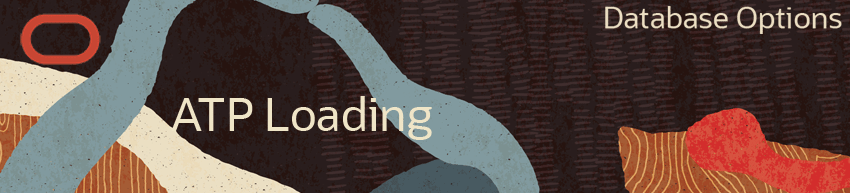

  

# Lab Introduction #
This 20-minute lab walks you through the steps to provision an ATP database and get data from an external database and load it into the Oracle Autonomous Data Warehouse (ADW) on Oracle Cloud Infrastructure (OCI), using SQL Developer Web. 

### Background ###
You can load data into Autonomous Database using Oracle Database tools and 3rd party data integration tools. Data can be loaded:
* from files local to your client computer, or
* from files stored in a cloud-based object store

For the fastest data loading experience Oracle recommends uploading the source
files to a cloud-based object store before loading the data into your Autonomous Database.

Today we will use the PL/SQL package **DBMS_CLOUD**. The DBMS_CLOUD package supports loading
data files from the following Cloud sources: 
1. Oracle Cloud Infrastructure Object Storage (OCI Object Storage)
2. Oracle Cloud Infrastructure Object Storage Classic
3. Amazon AWS S3

This tutorial shows how to load data from OCI Object
Storage using two of the procedures in the DBMS_CLOUD package:
* `create_credential`: Stores the object store credentials in your Autonomous Database schema.
* `copy_data`: Loads the specified source file to a table. 


# Lab Sections #
1. Login to the Oracle Cloud
2. Lab setup
3. Monitoring the In-Memory Column Store
2. Querying In-Memory Column Store Tables
4. In-Memory Joins and Aggregations

# Lab Assumptions #
- Each participant has been provided a username and password to the tenancy c4u03
- Each participant has completed the Environment Setup lab.


## Section 1: Login to your Oracle Cloud Account

1.  From any browser go to www.oracle.com to access the Oracle Cloud.

    

2. Click the icon in the upper right corner.  Click on **Sign in to Cloud** at the bottom of the drop down.  *NOTE:  Do NOT click the Sign-In button, this will take you to Single Sign-On, not the Oracle Cloud*

        

3. Enter your **Cloud Account Name**: `c4u03` in the input field and click the **My Services** button. 

      

4.  Enter your **Username** and **Password** in the input fields and click **Sign In**.

     


## Create an ATP Instance ##
1. Sign in to the [Oracle Cloud](https://cloud.oracle.com/home).
2. Click the menu icon to expand the menu on the left edge of the screen.
3. Click **Autonomous Transaction Processing**.

    

    [Description of the illustration OCIMenu.png](files/OCIMenu.txt)

4. Click the **Create Autonomous Database** button to start the instance creation process.
5. On the Create Autonomous Database page, enter the following information:
     * **Compartment**: For this lab, we'll use the `root` compartment.
     * **Display Name**: `atpxweek`
     * **Database Name**: `atpxweek`
     * **Workload Type**: `Transaction Processing`
     * **Deploymen Type**: `Serverless`
     * **CPU Core Count**: `1`
     * **Storage (TB)**:  `1`
     * **Administrator Credentials**: Create a password for the ADMIN user of the service instance. Remember this password! You'll need it in later labs to sign in to various services like Performance Hub and SQL Developer Web.
     * **License Type**: `Bring Your Own License`
6. Click the **Create Autonomous Database** button to start provisioning the instance. 
7. You're taken to the instance's details page. Details include a State field, which indicates the instance is **Provisioning**. When it's complete, the State field changes from **Provisioning** to **Available**. If the status doesn't change after few minutes, try refreshing the page.

    

    [Description of the illustration atp_instance.png](files/atp_instance.txt)


## Load a data file to your Object Store ##
Oracle Cloud Infrastructure offers two distinct storage class tiers.  Object Storage, for data which you need fast, immediate and frequent access and Archive Storage, for data which you seldom or rarely access.  In this ziplab you will stage data into an object store in the Oracle Cloud Infrastructure Object Storage service.

1. Login to your Oracle Cloud Infrastructure Console
2. Select **Object Storage** -> **Object Storage** from the drop down menu on the top left of the Oracle Cloud Infrastructure console.

    

3. Select **Create Bucket** to create a bucket to load your data in.  This will be your staging area.  Later in this lab you will move the data from this staging area to your ADW instance.
For this lab, we'll use the `root` compartment.

    

4. Enter the following information: 
    * **Bucket Name**:  `bucket-<city you were born in>-<your initials>`  (example: *bucket-london-kam*)
    * **Storage Tier**:  `Standard`
    * **Encryption**: `Encrypt using Oracle Managed Keys`

    

5. Click **Create Bucket**.
6. Click on the bucket name you just created.  

    
 
7. Review the screen. Note you have created an empty bucket with no objects in it and the visibility is set to private. 

    

8. Click **[here](https://www.oracle.com/webfolder/technetwork/tutorials/obe/cloud/adwc/OBE_Loading%20Your%20Data/files/datafiles_for_sh_tables.zip)** to download the zip file with the objects you will be importing into cloud storage.  The file will download to your desktop.  
9. Double click and **extract** the folder to your desktop.

9. Click the **Upload Object** button at the bottom of the page to begin selecting the data files to upload to the bucket.  

10. Choose all the files you just extracted, drag and drop them into the upload objects window.

    
    
10. Select the ten data files and click **Open**.  Once the files are finished loading, click **Upload Objects** to load. 

    

11. Once complete, verify **all** *.dat files have a status of `Finished` and click **Close**.
12. Your bucket should have 10 objects loaded.  If this were a true data load, you may be loading *hundreds* of large files here.
12. The final step will be to change the visibility of your bucket. Click the **Edit Visibility** button at the top of your Bucket Details screen.

    

13. Change the visibility to **Public**, accept all other defaults.  Click **Save Changes**.

    

14. Your bucket should now be visible and public.  Verify and proceed to setting up your Auth token.

    


## Create an Object Store Auth Token ##

To load data from the OCI object store, you need to create an Auth Token for your object store account. The
communication between your Autonomous Database and the object store relies on this Auth Token and username/password authentication.

1. If you have logged out of Oracle Cloud Infrastructure Object Storage, please log back in.
2. From the menu on the top left select **Identity->Users**. Once on the Users Page click on your username

     

3. Select your username.  Click **Auth Tokens** under **Resources** on the left of the console. _Note: This will be the the username you created when you launched your trial NOT ziplab_user_.

     

4. Click **Generate Token**.

     

5. A pop-up dialog appears. Set the Auth Token by performing the following steps:
    * In the pop-up dialog, enter a description.  Click the **Generate Token** button.
    
    

    * Copy the generated token to notepad located on your desktop. The token does not appear again and you WILL NEED this token to load your data into ADW.

    

    * Click **Close**.


## Create Object Store Credentials in your Autonomous Database ##

Now that you have created an object store Auth Token, its time to store the credentials of the object store in ADW instance.

1. Let's navigate to SQL Developer web to prepare your ADW instance for the staged data.  
Go back to your ADW instance via the menu.

    

2. Click on the ADW instance you created in a previous exercise and verify it is still running.

    

3. Click on **Service Console**.  If the service console does not open a new tab, ensure pop up blocker is turned off for your browser.  Click on **Development** to access the developer tools for ADB.

    

4. Click on **SQL Developer Web**.

    

5. Enter your database admin username from the previous exercise and login to your ADW instance. 

    _Note:  When you provisioned your ADW instance you wrote down an admin password for your new database.  Use this to log in to SQL Developer web.  You can go back to your ADW instance and reset your admin password via the menu._
    
    

6. SQL Developer Web has an interface similar to the installed client.  Note where the Worksheet is and the Query Results.
7. Copy the pl/sql procedure into SQL Developer Web. Fill in the username and password using the Oracle Cloud username you signed up with and the auth token you saved earlier. The create_credential procedure of the DBMS_CLOUD package stores the object store credentials in your database. This pl/sql procedure takes in the following arguments:
    * credential name
    * Oracle cloud username
    * Authorization token created earlier

    ```SQL
    begin  
    DBMS_CLOUD.create_credential (  
    credential_name => 'OBJ_STORE_CRED',  
    username => '<enter your username\>',  
    password => '\<enter your savedAuth Token\>'  
    ) ;  
    end;  
    /
    ```

    

8. Press the green arrow to run the worksheet.  Once the correct information is entered, you should get a message that the ``PL/SQL procedure completed``
9. Your object store's credentials are stored in
your ADW instance now.  


## Copy Data from Object Store to Autonomous Database Tables ##
Before data is copied, the tables and objects need to be created in ADW.  In this lab you will create the target objects.

1. Download the sql script to create the tables for your ADB instance **[here](files/adw-loading.sql)**.  Open up the file in notepad from your desktop.   _(Remember to click the back button to return to this window)_ This script will be used to create the tables and constraints.

2. Copy and paste the commands in your SQL Developer Web worksheet area overwriting any existing commands.

    

3. Select the entire script and press the green play button.

    

4. Once the script has run review the output to ensure the tables and constraints have been created successfully.  

    

5. Now you have empty tables and staged data in the OCI Object store. To get the data from the object store to your ADB instance, you need to get some information about the object. To move the data we will be using the dbms_cloud.copy_data procedure.  The procedure takes information about the location of the data you staged in your object store.  Review the procedure.

    ````SQL    
    begin
    dbms_cloud.copy_data(
        table_name =>'<ENTER_TABLE_NAME>',
        credential_name =>'OBJ_STORE_CRED',
        file_uri_list =>'<entertenancy-bucket-address>/chan_v3.dat',
        format => json_object('ignoremissingcolumns' value 'true', 'removequotes' value 'true')
    );
    end;
    /
    ````

5. Leave SQL Developer Web open in a tab and go back to your tenancy and select **Object Storage->Object Storage** from the menu. Select your bucket. 
6. In the objects section, locate one of the data files.  Click on the three dots on the right. 

    

7. Click **View Object Details**.  

    

8. Right click on the URI Path and select Copy Link Location. Paste the URI into a notepad. In the script that will be provided the file and table names are already there. You are going to remove the file name from the end and that is the URI you will use in the following steps.

    

9. Download this [sql script](files/adw-loading-copy-data.sql)  to load your tables. _(Remember to click the back button to return)_.  Replace the file_uri_list with the string you saved in notepad. The script already has the correct table names, just replace the tenancy address. 

    ````SQL
    begin
        dbms_cloud.copy_data(
            table_name =>'<ENTER_TABLE_NAME>',
            credential_name =>'OBJ_STORE_CRED',
            file_uri_list =>'<replace this urlpart>'/chan_v3.dat,
            format => json_object('ignoremissingcolumns' value 'true', 'removequotes' value 'true')
        );
    end;
    /
    ````

10. Paste the sql script into SQL Workshet.
11. For each of the URI in the script you will need to replace only the first portion of the file_uri_list leaving the file name as is. Leave the table names intact as they are preset for you in the sql script.

    

12. This time click the run script button.

    

13. In the Script Output, once you see the message `PL/SQL procedure successfully completed.`, Query a few of the tables to see the rows that were inserted.  
    ````SQL
    select * from sales;
    select * from customers;
    ````

Success! Notice that the data has been copied from the object store to the tables in your ADW instance.

This can be done for multiple tables providing an easy migration path from your existing databaset to Autonomous Database.

## Want to Learn More? ##
* [Autonomous Database Cloud Certification](https://education.oracle.com/en/data-management/autonomous-database/product_817?certPage=true) from Oracle University
* [Data Management Cloud Courses](https://learn.oracle.com/pls/web_prod-plq-dad/dl4_pages.getpage?page=dl4homepage&get_params=offering:35573#filtersGroup1=&filtersGroup2=.f667&filtersGroup3=&filtersGroup4=&filtersGroup5=&filtersSearch=) from Oracle University 


