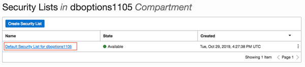

  


## Create Networking For Database Options/EM

1. Go to your browser to the tab with your logged in access to the Oracle Cloud.  Click on the hamburger menu.
 

2.  Click on **Networking** -> **Virtual Cloud Networks** to create a virtual cloud network for your instance.  Each particpant will create their own network, unless noted otherwise.

3.  Before creating the VCN, it is important you **select the correct compartment**.  If you are in a roadshow, you will be provided with the correct compartment.  In this example we will use `dboptions1105`.  **Do NOT select the root compartment**.
  
    
  
4.  Click the **Create Virtual Cloud Network** button.
    

5.  Enter the following:
    - **Name**:  Enter the name for your vcn 
    - **Create in Compartment**: Select the dboptions compartment
    - Select the 2nd radio button - **Create VCN PLUS RELATED RESOURCES**
    - Uncheck USE DNS HOSTNAMES IN THIS VCN
    - Accept all other defaults

    Scroll down and click the Create button.  Click Close after your VCN is created.
  
    

6. Now that the VCN is created, let's create the security list.  Click on the **Security Lists** link under the **Resources** section on the left hand side of your browser.

    

7.  Click on the **Default Security List**.

    

7. Click **Add Ingress Rules** to create rules for a future lab.

    

8.  Update the SOURCE CIDR and the PORT RANGE and click the **+Additional Ingress Rules** button.

    ````
    SOURCE RANGE: 0.0.0.0/0
    PORT RANGE:  8085
    ````
    

9.  Under Ingress Rule 2, add the same SOURCE CIDR value and a destination port range of 9080.  Repeat step 8 and 9 until you've added 10 rules.

    ````
    SOURCE RANGE: 0.0.0.0/0
    PORT RANGE:  9080

    SOURCE RANGE: 0.0.0.0/0
    PORT RANGE:  8002

    SOURCE RANGE: 0.0.0.0/0
    PORT RANGE:  18002

    SOURCE RANGE: 0.0.0.0/0
    PORT RANGE:  5600

    SOURCE RANGE: 0.0.0.0/0
    PORT RANGE:  443

    SOURCE RANGE: 0.0.0.0/0
    PORT RANGE:  7803

    SOURCE RANGE: 0.0.0.0/0
    PORT RANGE:  4903

    SOURCE RANGE: 0.0.0.0/0
    PORT RANGE:  7301

    SOURCE RANGE: 0.0.0.0/0
    PORT RANGE:  9851
    ````
      

10. Click **Add Ingress Rules** to proceed.  Once complete, the Ingress Rules should have the following port ranges.  Double check these values to ensure they are correct.

     

[Back to Top](#table-of-contents)