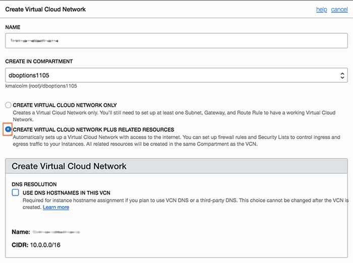
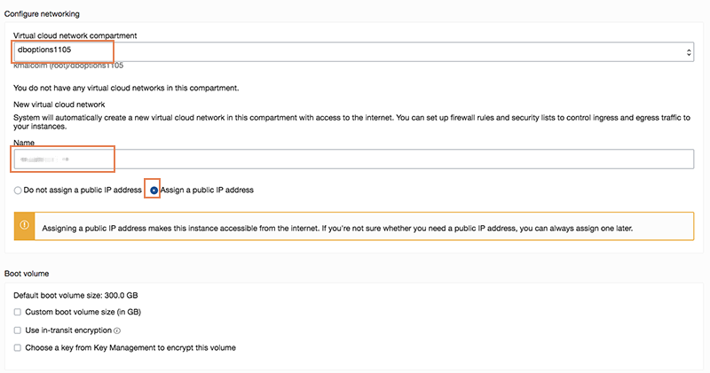

  

# Introduction #
This lab will show you how to login to the cloud and setup your environment in preparation for the day.  Many of our on-premises labs have been moved into OCI.  In this lab, you will create an OCI Compute instnace using the 19c Developer image in the Oracle Marketplace. 

# Lab Sections #
1. Login to the Oracle Cloud
2. Create an ssh key pair
3. Download Marketplace initialization zip
2. Create a compute instnance

# Lab Assumptions #
- Each participant has been provided a username and password to the tenancy c4u03


## Section 1: Login to your Oracle Cloud Account

1.  From any browser go to www.oracle.com to access the Oracle Cloud.

    

2. Click the icon in the upper right corner.  Click on **Sign in to Cloud** at the bottom of the drop down.  *NOTE:  Do NOT click the Sign-In button, this will take you to Single Sign-On, not the Oracle Cloud*

        

3. Enter your **Cloud Account Name**: `c4u03` in the input field and click the **My Services** button. 

      

4.  Enter your **Username** and **Password** in the input fields and click **Sign In**.

     

  **NOTE**: You will likely be prompted to change the temporary password listed in the welcome email. In that case, enter the new password in the password field.

5. Once you successfully login, you will be presented with the Oracle Cloud homepage.  Click on the hamburger icon in the upper left corner.
   

## Section 2 - Create an SSH Key Pair

### MAC Users ###
1.  Open up a terminal and type the following commands
2.  ````
    cd ~
    ssh-keygen -b 2048 -t rsa -f optionskey
    cd .ssh
    more optionskey.pub
    ````
3.  Copy the contents of `optionskey.pub` into notepad.  Your key file should be one line. You will need this to access your instance.  

### Windows Users ###

`Need to update for windows`
1.  Open up puttygen 
2.  ````
    cd ~
    ssh-keygen -b 2048 -t rsa -f optionskey
    cd .ssh
    more optionskey.pub
    ````
3.  Copy the contents of `optionskey.pub` into notepad.  Your key file should be one line. You will need this to access your instance.  

## Section 3 - Donwload Marketplace Initialization Zip File
1.  Click  [here](https://community.oracle.com/servlet/JiveServlet/download/1031489-6-462822/oci-db-app-script-examples.zip) to download the marketplace zip file.

2.  Save it to your downloads folder

3.  Extract the folder and locate the Standardinitio.sh file. You will need this later when you create your compute instance.

  


## Section 4 - Create a Compute Instance with the DB Marketplace Image

1. Select **Compute** -> **Instances** to go to the screen to create your instance.
  

7. Before creating the instance, it is important you **select the correct compartment**.  Your instructor will provide you the correct compartment.  In this example we will use `dboptions1105`.  


8. Click the **Create Instance** button.


9. Enter your desired instance name.  Use your first initial, middle initial and last name.  *Do NOT enter kdmishra, that is for example purposed only*.  Click on the **Change Image Source** button.


10.  This is the OCI Marketplace.  In the Browse All Images screen, click on **Oracle Images** to select your Oracle Database Marketplace image.  Select the **Oracle Database app** in the marketplace.


11. Accept the standards and conditions and click the **Select Image** button.


12. Click **Show Shape, Network, Storage Options**.  Accept the defaults.  The instance type we are creating is a Virtual Machine.


13.  In the VCN section, ensure you have the correct dboptions compartment selected.  Click on the radio button to **Create VCN Plus Related Resources**.


  

14.  Click on the radio button to **Assign a public address**


15.  Paste your SSH key pub file contents into this window.


16.  Click on **Show Advanced Options**.  Choose the dboptions compartment.  Click on the Choose cloud-init script file.  Click **Choose File**


17.  Select the extracted StandardIO-cloud-init script.  There are multiple scripts dependent on the shape you want


18.  Once your script is loaded, you should see it in the window.


19.  Click the button to create your instance.  Your instance will be in provisioning state.  Verify that you chose the correct image.  In a few minutes you can also verify that you have a public IP address.  View the Work Requests at the bottom, this will show where your instance is.


