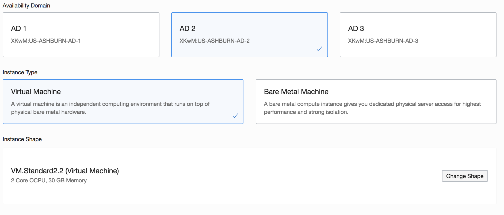

  

## Table of Contents 
- [Introduction](#introduction)
- [Lab Assumptions](#lab-assumptions)
- [Section 1-Login to the Oracle Cloud](#section-1-login-to-the-oracle-cloud)
- [Section 2-Create an SSH key pair](#section-2-create-an-ssh-key-pair)
- [Section 3-Download Marketplace Initialization Zip](#section-3-download-marketplace-initialization-zip)
- [Section 4-Create Networking and Select Region](#section-4-create-networking-and-select-region)
- [Section 5-Create Compute Instance](#section-5-create-compute-instance)
- [Section 6-Setup OCI CLI](#section-6-setup-oci-cli)
- [Section 7-Finish Environment Setup](#section-7-finish-environment-setup)

## Introduction
This lab will show you how to login to the cloud and setup a compute instance using the [Oracle Database](https://cloudmarketplace.oracle.com/marketplace/en_US/listing/47726045) image in the Oracle Cloud Marketplace. You will then setup the Oracle Cloud Command Line Interface (CLI) to download files necessary for the lab.

The Oracle Cloud Marketplace is an online store dedicated to marketing cloud business apps and professional services offered by Oracle and it's cloud partners. 

The automation is driven by the same framework that powers the decade long Oracle VM Templates for Oracle Database which have thousands of downloads and customers using it.

Automatically deploy a fully functional Database environment by leveraging a simple cloud-config script.  The deployment allows for basic customization of the environment, further configurations, like adding extra disks and NICs, is possible post-deployment.


## Lab Assumptions
- Each participant has been provided an account on the c4u03 tenancy and the network (VCN) has been pre-created.
- Each participant has been sent two emails, one from noreply@accountrecovery.oci.oraclecloud.com  with their username and another from the Database PM gmail account with their temporary password.

# Lab Settings
- **Tenancy**:  c4u03
- **Username/Password**:  Follow instructions below to access
- **Compartment**: \<Provided by Oracle\>
- **VCN**: \<Provided by Oracle\>
- **Region**: \<Provided by Oracle\>


## Section 1-Login to the Oracle Cloud 
1.  You should have received an email from Oracle Cloud with your tenancy and username.  Click on the **Sign In to Oracle Cloud** link.  

    

2.  For this event, we are using OCI IAM users.  You should have received a 2nd email with your one-time password.  Enter your username (found in the first email) and your password (second email from DB PM).  You will then be taken to a screen to change your password.  Choose a new password that you can remember and click **Sign In**

    


3. Once you successfully login, you will be presented with the Oracle Cloud homepage. If you get an *Email Activation Unsuccessful* message, check to see if you can still access the cloud by looking for the hamburger menu to the left. 
   

[Back to Top](#table-of-contents)

## Section 2-Create an SSH key pair

### MAC Users ###
1.  Open up a terminal and type the following commands.  When prompted for a passphrase click **enter**. *Do not enter a passphrase*.
     ````
    cd ~
    cd .ssh
    ssh-keygen -b 2048 -t rsa -f optionskey
    ````

     

3.  Inspect your .ssh directory.  You should see two files.  optionskey and optionskey.pub.  Copy the contents of the pub file `optionskey.pub` into notepad.  Your key file should be one line. You will need this to access your instance in Section 5.  

    ````
    ls -l .ssh
    more optionskey.pub
    ````

### For Windows: Using GitBash or Windows Subsystem for Linux (WSL) ### 

1. Open the terminal tool of your choice
1. Type the following command at the prompt to generate keys for your instance.
    ````
    ssh-keygen -f optionskey
    ````
1. Press enter to accept the default values
1. Do not assign a password for this exercise. (note you should always assign an SSH key password in production)
1. Type the following to retrieve your public key.  You will need this to access your instance in Section 5.  
    ````
    cat ~/.ssh/optionskey.pub 
    ````


### For Windows: Using PuttyGen ### 

1. Open PuttyGen
1. Click the [Generate] button

     
1. Move your mouse around the screen randomly until the progress bar reaches 100%
1. Click the [Save private key] button. Name the file `optionskey`.  This file will not have an extension.

     
1. Save the public key (displayed in the text field) by copying it to the clipboard and saving it manually to a new text file. Name the file `optionskey.pub`.   You will need this to access your instance in Section 5.  

1. Note: Sometimes PuttyGen does not save the public key in the correct format. The text string displayed in the window is correct so we just copy/paste.


[Back to Top](#table-of-contents)

## Section 3-Download Marketplace Initialization Zip
1.  Click  \<[**here**](https://community.oracle.com/servlet/JiveServlet/download/1031489-6-462822/oci-db-app-script-examples.zip)\> to download the marketplace initialization zip file.

2.  Save it to your downloads folder

3.  Unzip the folder and locate the `StandardIO-db.cloud-init` file. You will need this later when you create your compute instance.

    


[Back to Top](#table-of-contents)

## Section 4-Create Networking and Select Region

The VCN, Virtual Cloud Network, has been precreated for you. 

1.  Change your region to ensure you are creating your objects in the correct region.  

2. Click on the US East(Ashburn) drop down.  Select the region that you are instructed by the PM team.

    

## Section 5-Create Compute Instance

1. Go back to your browser to the tab with your logged in access to the Oracle Cloud.  Click on the hamburger menu.
 

2. Select **Compute** -> **Instances** to go to the screen to create your instance.
  

3. Before creating your instance, it is important you **select the correct compartment**.  If you are in a PM sponsored roadshow, this will be provided to you.  **Do NOT select the c4u03 compartment, objects here will be deleted**.
   
   

4. Click the **Create Instance** button.


5. Enter your desired instance name.  Use your first initial, middle initial and last name.  *Do NOT enter kdmishra, that is for example purposes only*.  Click on the **Change Image Source** button.


6. This is the OCI Marketplace library of images.  In the **Browse All Images** screen, click on **Oracle Images** to select your Oracle Database Marketplace image.  Select the **Oracle Database** app name in the marketplace.  Click the down arrow to select the database version.


6. Select the 19c version.  18c is selected by default.  Ensure you choose 19c.  Version numbers subject to change from image.  


    

    

7. Scroll down, accept the standards and conditions and click the **Select Image** button.


8. Click **Show Shape, Network, Storage Options** if it is hidden.  
    - **AD**:  Instances will need to be balanced across Availability Domains (ADs) to accomodate limits in the tenancy.  
    - If your last name is:
        - **A-I** -> select `AD1`
        - **J-M** -> select `AD2`
        - **N-Z** -> select `AD3`
    - Each availability domain has a limit on the number of instances that can be created.  This ensures a balance across ADs.
    - **Instance Type**:  The instance type we are creating is a **Virtual Machine**.  
    - **Instance Shape**:  Select the **change shape** button and select `VMStandard 2.2`.  Click the **Select Shape** button to apply the change.  

    

9. In the Configure networking section, select the dboptions compartment and the VCN you created in an earlier section. If you are in a Roadshow, use the VCN precreated by Product Management.  Click on the radio button to **Assign a public address**.  This is important.  DO NOT OVERLOOK THIS STEP!!!!!!!


10. Paste your SSH key pub file contents from the earlier section into this window.  It should be one line.


11. Click on **Show Advanced Options**.  Choose the dboptions compartment.  Click on the Choose cloud-init script file.  Click **Choose File**.


12. Select the extracted `StandardIO-cloud-init` script.  There are multiple scripts dependent on the shape you want.  For this lab, we will be using the Standard IO.


13. Once your script is loaded, you should see it in the window.


14. Click the **Create** button to create your instance.  Your instance will be in the provisioning state for about 4 minutes.  Verify that you chose the correct image.  In a few minutes you can also verify that you have a public IP address.  View the Work Requests at the bottom, this will show where your instance is.


15. Once the instance moves to the `Running` state, locate your **public IP address** and jot it down. 

[Back to Top](#table-of-contents)

## Section 6-Setup OCI CLI 

Now that you have your instance, once you are able to ssh in, you will set up the OCI Command Line interface. While the instance is being created, the ssh daemon is shut off.  This means you will not be able to login until the ssh daemon is started.  This could take around 5-7 minutes.  Once 5 minutes has passed, you should be able to ssh into the instance.  **YOU MAY NOT BE ABLE TO SSH INTO YOUR INSTANCE UNTIL THE INIT SCRIPT IS COMPLETE, PLEASE BE PATIENT AND DO NOT CREATE ANOTHER INSTANCE**

### Connecting via MAC or Windows CYGWIN Emulator
1.  Open up a terminal (MAC) or cygwin emulator as the opc user.  Enter yes when prompted.

    ````
    ssh -i ~/.ssh/optionskey opc@<Your Compute Instance Public IP Address>
    ````
     

2.  Proceed to the Install CLI section.

### Connecting via Windows

1.  Open up putty and create a new connection.

    ````
    ssh -i ~/.ssh/optionskey opc@<Your Compute Instance Public IP Address>
    ````
     

2.  Enter a name for the session and click **Save**.

     

3. Click **Connection** > **Data** in the left navigation pane and set the Auto-login username to root.

4. Click **Connection** > **SSH** > **Auth** in the left navigation pane and configure the SSH private key to use by clicking Browse under Private key file for authentication.

5. Navigate to the location where you saved your SSH private key file, select the file, and click Open.

     

6. The file path for the SSH private key file now displays in the Private key file for authentication field.

7. Click Session in the left navigation pane, then click Save in the Load, save or delete a stored session section.

8. Click Open to begin your session with the instance.

### Install CLI

1.  Download the Oracle Cloud CLI install script.  

    ````
    bash -c "$(curl –L https://raw.githubusercontent.com/oracle/oci-cli/master/scripts/install/install.sh)"
    ````
     

3.  Accept all the defaults.  This will install packages like python, configparser, etc.  Do not install any additional scripts.  When prompted to *Modify profile to update your $PATH and enable shell/tab completion now? (Y/n)* enter **Y** to update your $PATH and enable shell/tab completion.

     

     

4.  You will be prompted at the end to run an exec command to restart your shell. Do that now.
    ````
    exec -l $SHELL
    ````
4.  Once you verify installation is successful, verify the install by running the oci command with the -v option.  This will tell you the version of oci installed (2.6.10 and later)

    ````
    oci -v
    ````

7.  To setup OCI CLI you will need to provide your instance with your **OCI ID** and **Tenancy ID**. To locate your user details, go to the upper left corner and click on the circular icon-> **User Settings**.  Note the region in which you are working (upper left corner).  

     

     

4.  Now that the binaries are complete.  You will need to provide your tenancy id and user id.  Go back to your browswer and click on the hamburger menu.
     

5.  Click **Administration** -> **Tenancy** Details

     

6.  Click **Show** to show the full tenancy id.  This is the unique identifier for the tenancy you are working in.  Click **Copy** and copy that to your notepad.

      

8.  Go back to your terminal window and run the oci setup commands to complete configuration.  Accept the default location when prompted.  Enter **Y** to generate an RSA key pair (no passphrase needed).

    ````
    oci setup config
    ````
    - Location for your config: *Press enter*
    - **User OCID**:  Paste your OCI ID from the previous step
    - **Tenancy OCID**:  Paste your tenancy ID from the previous step
    - **Enter a region**:  Find your region in your browser in the top right
    - **Generate a new RSA Key Pair**:  Y
    - Press enter for the last 3 questions accepting the defaults

     **BE SURE TO PASTE THE CORRECT VALUES OR SETUP WILL NOT WORK**

     

9. Go to the hidden .oci directory and examime the public key file and the config file.

    ````
    cd /home/opc/.oci
    more config
    more /home/opc/.oci/oci_api_key_public.pem
    ````
     

     

10. Now that you have installed cli and configured it, you need to add an API key to your user profile.  Go back to your browswer and click the user icon (top Rrght of your browswer) and click **User Settings**. Click **API Keys** and **Add Public Key**.

     

     

     

     

10. Paste the content of oci_api_key_public.pem copied earlier and click Add.A new finger print will be generated. Switch to the SSH terminal session and type:
    ````
    more /home/opc/.oci/config
    ````

    Compare the fingerprint in the output of config file to the one in OCI console window and make sure they match.

10. Now let's test.  Enter the following command.  Ignore any python related errors.  The --output table formats the cli to return the command results in table format.
    ````
    oci os object list -bn DBOptions --output table
    ````
     


## Section 7-Finish Environment Setup

1. Congrats! You have Oracle Cloud command line access to your newly created instance!  Let's  download the files you will need for these labs from object storage. A storage bucket `DBOptions` has been created that has all the files you need for the series of labs in this roadshow.  YOu will be downloading the files directly to the instance you just created using the oci cli `bulk-download` command.  It may take some time (2-3 mins), please be patient.
    ````
    cd /home/opc/
    oci os object bulk-download -bn DBOptions --download-dir /home/opc
    ````
        


      

2. Now that your files are downloaded, run the scripts to import the schemas to prepare for the In-Memory lab.
    ````
    cd /home/opc/
    sudo mv labs.zip /home/oracle
    sudo mv ssb.dmp /home/oracle
    sudo chown oracle:oinstall /home/oracle/labs.zip 
    sudo chown oracle:oinstall /home/oracle/ssb.dmp
    sudo su - oracle
    unzip labs.zip
    ````

3. The next two labs, In-Memory and Multitenant need additional schemas and pluggable databases created.  Run the scripts in the background to create them as the oracle user.  Let's run the multitenant script.  This script takes approximately 15-30 minutes to complete and runs as a unix job in the background.  Ignore the error about the SYS password.  To check status you can use the jobs command.
    ````
    cd /home/oracle/labs
    nohup /home/oracle/labs/multitenant/createCDBs.sh &> nohupmultitenant.out&
    ```` 
    
4. Now let's run the script to setup the In-Memory lab.  This script takes approximately 10 minutes to complete.  This script also runs in the background. 
    ````
    nohup /home/oracle/labs/inmemory/importssb.sh &> nohupinmemory.out&
    ````

4. Type jobs to see the two scripts running.  Tail -f each output file to check the status.
    ````
    jobs
    more nohupinmemory.out
    tail -f nohupmultitenant.out
    ````
      

       

      

     

5. The 1st Multitenant setup script creates two additional listeners and 2 container databases, CDB1 and CDB2.  After 20 minutes, go back to your terminal and check to see if the scripts completed using the comnands below,
    ````
    ps -ef | grep tns
    ps -ef | grep pmon
    ````

       

 6.  Set the databases to start upon boot.  Exit the oracle shell and modify the oratab file.

        ````
        exit
        sudo sed -i 's/:N/:Y/g' /etc/oratab
        ````    

7. Congratulations, you finished!  This is the end of the environment setup lab!  Let's shut down your instance. You wil start it back up when the Roadshow begins.  

8.  Go back to your instance in the web by clicking on the hamburger icon and selecting **Compute**->**Instances**.

      

9.  Click the **Stop** button. 

     

10.  Click **OK**

  

11. Once you confirm your instance has stopped, you can close your browser.

   
    

[Back to Top](#table-of-contents)