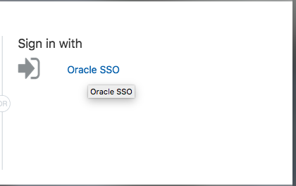
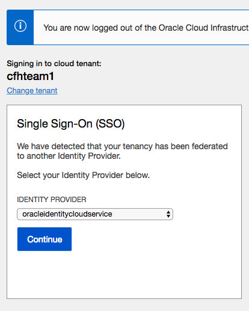

  

# Introduction #
This lab will show you how to login to the cloud and setup your environment in preparation for the day.  Many of our on-premises labs have been moved into OCI.  In this lab, you will create an OCI Compute instance using the [Oracle Database](https://cloudmarketplace.oracle.com/marketplace/en_US/listing/47726045) image in the Oracle Cloud Marketplace. 

The Oracle Cloud Marketplace is an online store dedicated to marketing cloud business apps and professional services offered by Oracle and it's cloud partners. 

The automation is driven by the same framework that powers the decade long Oracle VM Templates for Oracle Database which have thousands of downloads and customers using it.

Automatically deploy a fully functional Database environment by leveraging a simple cloud-config script.  The deployment allows for basic customization of the environment, further configurations, like adding extra disks and NICs, is possible post-deployment.


# Lab Assumptions #
- Each participant has been provided an account on the c4u03

# Table of Contents #

- [Section 1: Login to the Oracle Cloud](#lab-introduction)
- [Section 2: Create an SSH key pair](#lab-sections)
- [Section 3: Download Marketplace initialization zip and Script Zip File](#section-1--login-to-your-oracle-cloud-account)
- [Section 4:  Create Networking](#section-2--lab-setup)
- [Section 5:  Create Compute Instance](#section-3--monitoring-the-in-memory-column-store)
- [Section 6:  Extract Lab Scripts and Prep Environment](#section-6--extract lab-scripts-and-prep-environment)


## Section 1: Login to Your Oracle Cloud Account
----------------

1.  From any browser go to www.oracle.com to access the Oracle Cloud.

    

2. Click the icon in the upper right corner.  Click on **Sign in to Cloud** at the bottom of the drop down.  *NOTE:  Do NOT click the Sign-In button, this will take you to Single Sign-On, not the Oracle Cloud*

        

3. Enter your **Cloud Account Name**: `c4u03` in the input field and click the **My Services** button. 

      

4.  If your username/password was provided follow step 4a.  If your password leverages single sign on, proceed to step 4b.

    4A. USERNAME/PASSWORD
    
    Enter your **Username** and **Password** in the input fields and click **Sign In**.

     

    **NOTE**: You will likely be prompted to change the temporary password listed in the welcome email. In that case, enter the new password in the password field.

    4B. SINGLE SIGN ON
    
    Select the **Sign in with Oracle SSO** link and enter your SSO credentials.

     
    
     


5. Once you successfully login, you will be presented with the Oracle Cloud homepage.  
   

## Section 2 - Create an SSH Key Pair

### MAC Users ###
1.  Open up a terminal and type the following commands.  When prompted for a passphrase click enter. Do not enter a passphrase.
     ````
    cd ~
    cd .ssh
    ssh-keygen -b 2048 -t rsa -f optionskey
    ````

     

3.  Inspect your .ssh directory.  You should see two files.  optionskey and optionskey.pub.  Copy the contents of the pub file `optionskey.pub` into notepad.  Your key file should be one line. You will need this to access your instance in Section 5.  

    ````
    ls -l .ssh
    more optionskey.pub
    ````

### Windows Users ###

`Need to update for windows`
1.  Open up puttygen 

2.  Enter the following commands in your terminal
    ````
    cd ~
    ssh-keygen -b 2048 -t rsa -f optionskey
    cd .ssh
    more optionskey.pub
    ````
3.  Copy the contents of `optionskey.pub` into notepad.  Your key file should be one line. You will need this to access your instance.  

## Section 3 - Download Marketplace Initialization & Script Zip File
1.  Click  [here](https://community.oracle.com/servlet/JiveServlet/download/1031489-6-462822/oci-db-app-script-examples.zip) to download the marketplace initialization zip file.

2.  Save it to your downloads folder

3.  Unzip the folder and locate the StandardIO-db.cloud-init file. You will need this later when you create your compute instance.

  

4. Click [here]() to download the scripts.zip file.  You will ftp this file to your newly created compute instance later in this lab.

## Section 4 - Create Networking

If you are in a PM sponsored Roadshow, skip this step.  Your VCN has already been created for you.

1. Go back to your browser to the tab with your logged in access to the Oracle Cloud.  Click on the hamburger menu.
 

2.  Click on **Networking** -> **Virtual Cloud Networks** to create a virtual cloud network for your instance.  Each particpant will create their own network, unless noted otherwise.

3.  Before creating the VCN, it is important you **select the correct compartment**.  If you are in a roadshow, you will be provided with the correct compartment.  In this example we will use `dboptions1105`.  **Do NOT select the root compartment**.
  
    
  
4.  Click the Create Virtual Cloud Network button.
    

5.  Enter the following:
    - Name:  Enter the name for your vcn (i.e. first initial,middle initial, lastname)
    - Create in Compartment: Select the dboptions compartment
    - Select the 2nd radio button - Create VCN PLUS RELATED RESOURCES
    - Uncheck DNS RESOLUTION
    - Accept all other defaults

    Scroll down and click the Create button.  Click Close after your VCN is created.
  
    

6. Once the VCN is created, create the security list.  Click on the Security Lists link under the Resources section.

    

7.  Click **Add Ingress Rules** to create rules for a future lab.

    

8.  Update the SOURCE CIDR and the PORT RANGE.  

    ````
    SOURCE RANGE: 0.0.0.0/0
    PORT RANGE:  8085
    ````
    

9.  Click on **Additional Ingress Rule** to add additional rules.  Under Ingress Rule 2, add the same SOURCE CIDR value and a destination port range of 9080.  Repeat step 8 and 9 until you've added 5 rules.

    ````
    SOURCE RANGE: 0.0.0.0/0
    PORT RANGE:  9080

    SOURCE RANGE: 0.0.0.0/0
    PORT RANGE:  8002

    SOURCE RANGE: 0.0.0.0/0
    PORT RANGE:  18002

    SOURCE RANGE: 0.0.0.0/0
    PORT RANGE:  5600
    ````
      

10. Once complete, the Ingress Rules should have the following port range.  Double check these values to ensure they are correct.

     

## Section 5 - Create a Compute Instance with the DB Marketplace Image

1. Go back to your browser to the tab with your logged in access to the Oracle Cloud.  Click on the hamburger menu.
 

2. Select **Compute** -> **Instances** to go to the screen to create your instance.
  

3. Before creating the instance, it is important you **select the correct compartment**.  Your instructor will provide you the correct compartment.  In this example we will use `dboptions1105`.  **Do NOT select the root compartment**.


4. Click the **Create Instance** button.


5. Enter your desired instance name.  Use your first initial, middle initial and last name.  *Do NOT enter kdmishra, that is for example purposes only*.  Click on the **Change Image Source** button.


6.  This is the OCI Marketplace library of images.  In the Browse All Images screen, click on **Oracle Images** to select your Oracle Database Marketplace image.  Select the **Oracle Database** app name in the marketplace.


7. Scroll down, accept the standards and conditions and click the **Select Image** button.


8. Click **Show Shape, Network, Storage Options** if its hideen.  Accept the defaults.  The instance type we are creating is a Virtual Machine.  Keep the selected shape.


9.  In the Configure networking section, select the dboptions compartment and the VCN you created in an earlier section. If you are in a Roadshow, use the VCN precreated by Product Management.  Click on the radio button to **Assign a public address**.  This is important.  DO NOT OVERLOOK THIS STEP!!!!!!!


10.  Paste your SSH key pub file contents from the earlier section into this window.  It should be one line.


11.  Click on **Show Advanced Options**.  Choose the dboptions compartment.  Click on the Choose cloud-init script file.  Click **Choose File**.


12.  Select the extracted StandardIO-cloud-init script.  There are multiple scripts dependent on the shape you want.  For this lab, we will be using the Standard IO.


18.  Once your script is loaded, you should see it in the window.


19.  Click the button to create your instance.  Your instance will be in provisioning state.  Verify that you chose the correct image.  In a few minutes you can also verify that you have a public IP address.  View the Work Requests at the bottom, this will show where your instance is.


20.  Locate your public IP address and jot it down. 

## Section 6:  Extract Lab Scripts and Prep Environment ##
-------------------
1.  Open up a terminal (MAC) or cygwin emulator as the opc user

    ````
    sftp -i ~/.ssh/optionskey opc@<Your Compute Instance Public IP Address>
    ````

2.  Use SFTP to transfer the zip file you downloaded earlier to your instance. 

    ````
    cd <Location where file was downloaded>
    cp scripts.zip ~
    cd ~
    sftp -i ~/.ssh/optionskey opc@<Enter Your IP Address>
    sftp> put scripts.zip
    sftp> exit
    ````

3.  Once the transfer is complete.  SSH into your instance as the opc user 

    ````
    ssh -i ~/.ssh/optionskey opc@<Your Compute Instance Public IP Address>
    chmod 777 scripts.zip
    sudo su - oracle
    unzip /home/opc/scripts.zip .
  
    ````


