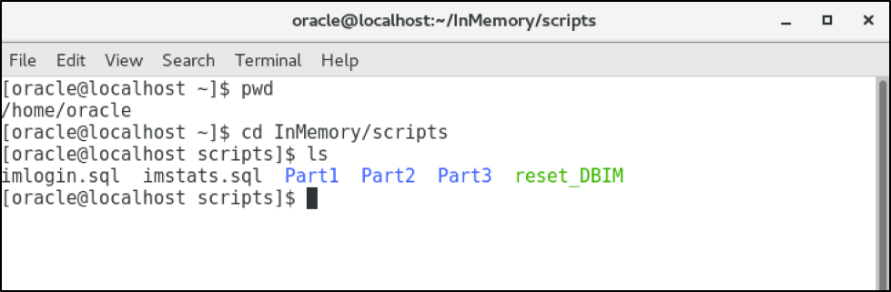

  

# Table of Contents #

- [Lab Introduction](#lab-introduction)
- [Setup](#setup)
- [Section 1: PDB Hot Clones](#section-1-pdb-hot-clones)
- [section 2: PDB Refresh](#section-2-pdb-refresh)
- [Section 3: PDB Relocation](#section-3-pdb-relocation)


## Lab Introduction
This series of labs will improve your operational efficiency with pluggable databases. We will cover PDB Hot clones, followed by PDB refresh and then finally a PDB relocate. 

The time to provision a database can take days to weeks. The effort to keep that database in sync with critical, production data is yet another challenge, particularly as that data continues to grow. PDB hot cloning demonstrates the ease of online database provisioning of ‘hot’ data with little or no impact on the source database.OPEX saving with streamlined cloning operations, improved time to market through fast online database provisioning in sync with production data, CAPEX saving on robust, fully integrated cloning solution, easy integration with automation frameworks, DBaaS. OPEX saving with streamlined cloning operations, improved time to market through fast online database provisioning in sync with production data, CAPEX saving on robust, fully integrated cloning solution, easy integration with automation frameworks, DBaaS. 

PDB Hot Cloning provides fast provisioning of hot data, however, to keep in sync with the source, hot cloning still requires one to drop and recreate the clone from source, or, unplug, archive and drop the PDB and then recreate from source. PDB hot cloning is a required technology for fast cloning on hot data, however, operationally speaking, hot clone by itself is cumbersome when there is a requirement to keep in sync with the source and incur little data copy costs. PDB refresh addresses this requirement. PDB refresh provides a means to hot clone a refreshable PDB master clone from which test, dev, UAT and BI environments can clone. A refreshable clone copies the base source once, and then maintains a synchronized copy based on iterative redo apply and transaction rollback at open to ensure transaction consistency. This lab walks you through creating a refreshable master clone and refreshing the master clone from a hot data source. In addition to the business benefits described above for PDB hot cloning, PDB refresh keeps a master clone in sync with an advancing hot data source with much less data copy than iterative hot clones. This allows agile development on hot data without impacting the source.

It is not uncommon that a database may go down for planned maintenance, or non-critical workload would need to be stopped to satisfy the compute resource requirements of more important workload. Or, you simply want to migrate your database to new hardware. PDB Near Zero Downtime (NZD) Relocate is intended to address these use cases by providing online relocation of a PDB from one physical server to another with little or no impact to the connected clients. 

## Setup

### Lab Assumptions
- Each participant has been provided a username and password to the tenancy c4u03.
- Each participant has completed the Environment Setup lab.
- Each participant has created an OCI compute instance using the database template.

There are two container databases running:
- CDB1 running on port 1523
- CDB2 running on port 1524

### Lab Setup

All the scripts for this lab are located in the /home/oracle/multitenant/scripts folder.  

1.  To access the scripts, secure shell into the OCI compute instance.

2.  Change to the ssh directory and ssh into your instance.  The public IP address can be found by going to Compute -> Instance.

    ````
    cd .ssh
    ssh -i optionskey opc@<your public ip address>
    ls
    ````

     


## Section 1: PDB Hot Clones
This section looks at how to hot clone a pluggable database.

The tasks you will accomplish in this lab are:
- Create a pluggable database ``OE`` in the container database ``CDB1``
- Create a load against the pluggable database ``OE``
- Create a hot clone ``OE_DEV`` in the container database ``CDB2`` from the pluggable database ``OE``

1. Connect to ``CDB1``
````
sqlplus /nolog
connect sys/oracle@localhost:1523/cdb1 as sysdba
````

2. Create a pluggable database ``OE`` with an admin user of ``SOE``
````
create pluggable database oe admin user soe identified by soe roles=(dba);
alter pluggable database oe open;
alter session set container = oe;
grant create session, create table to soe;
alter user soe quota unlimited on system;
````

3. Connect as ``SOE`` and create the ``sale_orders`` table
````
connect soe/soe@localhost:1523/oe
CREATE TABLE sale_orders 
(ORDER_ID      number, 
 ORDER_DATE    date, 
 CUSTOMER_ID   number);
 ````
 4. Open a new terminal window, sudo to the oracle user and execute write-load.sh. Leave this window open and running throughout the rest of the multitenant labs.
 <Image of script>

 5. Connect to ``CDB2`` and create the pluggable ``OE_DEV`` from the database link ``oe@cdb1_link``
````
connect sys/oracle@localhost:1524/cdb2 as sysdba
create pluggable database oe_dev from oe@cdb1_link;
alter pluggable database oe_dev open;
````

6. Connect as ``SOE`` to ``OE_DEV`` and check the number of records in the ``sale_orders`` table
````
connect soe/soe@localhost:1524/oe_dev
select count(*) from sale_orders;
````

7. Connect as ``SOE`` to ``OE`` and check the number of records in the ``sale_orders`` table
````
connect soe/soe@localhost:1523/oe
select count(*) from sale_orders;
````

8. Close and remove the ``OE_DEV`` pluggable database
````
connect sys/oracle@localhost:1524/cdb2 as sysdba
alter pluggable database oe_dev close;
drop pluggable database oe_dev including datafiles;
````

9. Leave the ``OE`` open with the load running against it for the rest of the labs.

You can see that the clone of the pluggable database worked without having to stop the load on the source database. In the next lab you will look at how to refresh a clone.

## Section 2: PDB Refresh
This section looks at how to hot clone a pluggable database, open it for read only and then refresh the database.

The tasks you will accomplish in this lab are:
- Leverage the ``OE`` pluggable database from the previous lab with the load still running against it.
- Create a hot clone ``OE_REFRESH`` in the container database ``CDB2`` from the pluggable database ``OE``
- Refresh the ``OE_REFRESH`` pluggable database.

1. Connect to ``CDB2``
````
sqlplus /nolog
connect sys/oracle@localhost:1524/cdb2 as sysdba
````

2. Create a pluggable database ``OE_REFRESH`` with manual refresh mode from the database link ``oe@cdb1_link``
````
create pluggable database oe_refresh from oe@cdb1_link refresh mode manual;
alter pluggable database oe_refresh open read only;
````

3. Connect as ``SOE`` to the pluggable database ``OE_REFRESH`` and count the number of records in the sale_orders table
````
conn soe/soe@localhost:1524/oe_refresh
select count(*) from sale_orders;
````

4. Close the pluggable database ``OE_REFRESH`` and refresh it from the ``OE`` pluggable database
````
conn sys/oracle@localhost:1524/oe_refresh as sysdba

alter pluggable database oe_refresh close;

alter session set container=oe_refresh;
alter pluggable database oe_refresh refresh;
alter pluggable database oe_refresh open read only;
````

5. Connect as ``SOE`` to the pluggable dataabse ``OE_REFRESH`` and count the number of records in the ``sale_orders`` table. You should see the number of records change.
````
conn soe/soe@localhost:1524/oe_refresh
select count(*) from sale_orders;
````

6. Close and remove the ``OE_DEV`` pluggable database
````
conn sys/oracle@localhost:1524/cdb2 as sysdba

alter pluggable database oe_refresh close;
drop pluggable database oe_refresh including datafiles;
````

7. Leave the ``OE`` open with the load running against it for the rest of the labs.

## Section 3: PDB Relocation

This section looks at how to relocate a pluggable database from one container database to another. One important note, either both container databases need to be using the same listener in order for sessions to keep connecting or local and remote listeners need to be setup correctly. For this lab we will change ``CDB2`` to use the same listener as ``CDB1``

The tasks you will accomplish in this lab are:
- Change ``CDB2`` to use the same listener as ``CDB1``
- Relocate the pluggable database ``OE`` from ``CDB1`` to ``CDB2`` with the load still running

1. Change ``CDB2`` to use the listener ``LISTCDB1``
````
sqlplus /nolog
conn sys/oracle@localhost:1524/cdb2 as sysdba;
alter system set local_listener='LISTCDB1' scope=both;
````

2. Connect to ``CDB2`` and relocate ``OE`` using the database link ``oe@cdb1_link``
````
conn sys/oracle@localhost:1523/cdb2 as sysdba;
create pluggable database oe from oe@cdb1_link relocate;
alter pluggable database oe open;
show pdbs
````

3. Connect to ``CDB1`` and see what pluggable databases exist there
````
conn sys/oracle@localhost:1523/cdb1 as sysdba
show pdbs
````

4. Close and remove the ``OE`` pluggable database
````
conn sys/oracle@localhost:1523/cdb2 as sysdba

alter pluggable database oe close;
drop pluggable database oe including datafiles;
````