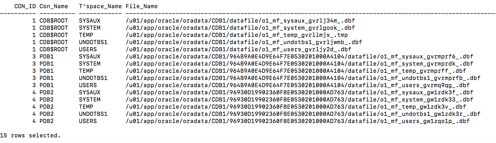
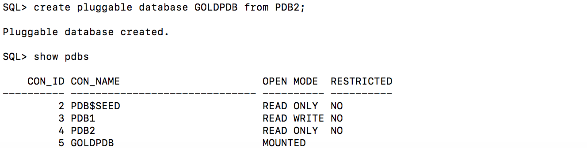
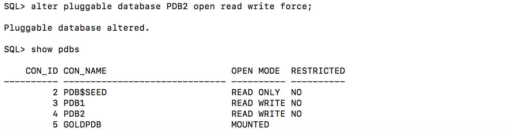
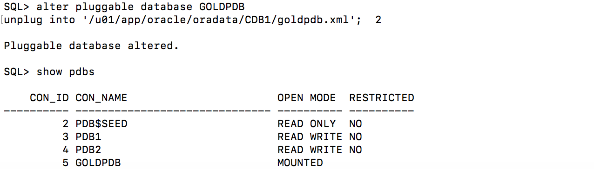
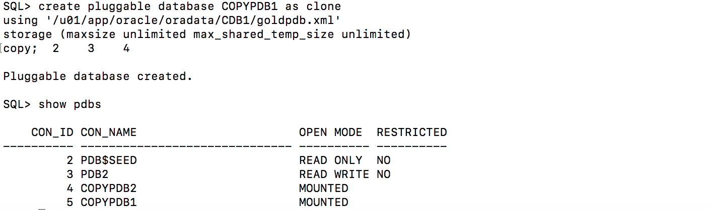
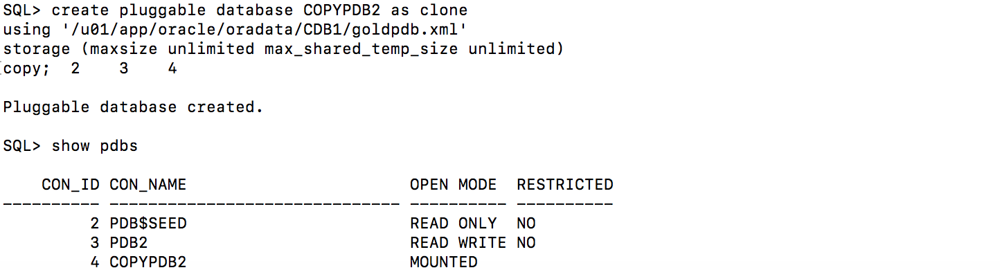
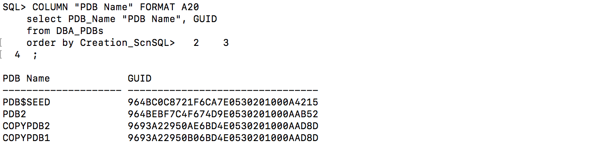

  

# Table of Contents #

- [Lab Introduction](#lab-introduction)
- [Setup](#setup)
- [Section 1: Create PDB](#section-1-create-pdb)
- [Section 2: Clone a PDB](#section-2-clone-a-pdb)
- [Section 3: Unplug a PDB](#section-3-unplug-a-pdb)
- [Section 4: Plug in a PDB](#section-4-plug-in-a-pdb)
- [Section 5: Drop a PDB](#section-5-drop-a-pdb)
- [Section 6: Clone an Unplugged PDB](#section-6-clone-an-unplugged-pdb)
- [Section 7: PDB Hot Clones](#section-7-pdb-hot-clones)
- [Section 8: PDB Refresh](#section-8-pdb-refresh)
- [Section 9: PDB Relocation](#section-9-pdb-relocation)
- [Conclusion](#conclusion)

## Lab Introduction
From the point of view of an application, the PDB is the database, in which applications run unchanged. PDBs can be very rapidly provisioned and a pluggable database is a portable database, which makes it very easy to move around, perhaps for load balancing or migration to the Cloud.

Many PDBs can be plugged into a single Multitenant Container Database or CDB. From the point of view of a DBA, the CDB is the database. Common operations are performed at the level of the CDB enabling the DBA to manage many as one for operations such as upgrade, configuration of high availability, taking backups; but we retain granular control when appropriate. This ability to manage many as one enables tremendous gains in operational efficiency.

Enormous gains in technical efficiency are enabled by a shared technical infrastructure. There’s a single set of background processes and a single, global memory area – the SGA – shared by all the PDBs. The result is that with this architecture we can consolidate more applications per server.


## Setup

### Lab Assumptions
- Each participant has been provided a username and password to the tenancy c4u03.
- Each participant has completed the Environment Setup lab.
- Each participant has created an OCI compute instance using the database template.

There are two container databases running:
- CDB1 running on port 1523
- CDB2 running on port 1524

### Lab Setup

All the scripts for this lab are located in the /u01/app/oracle/labs/multitenant folder.  

1.  To access the scripts, secure shell into the OCI compute instance.

2.  Change to the ssh directory and ssh into your instance.  The public IP address can be found by going to Compute -> Instance.

    ````
    cd .ssh
    ssh -i optionskey opc@<your public ip address>
    ls
    sudo su - oracle
    cd /home/oracle/labs/multitenant
    ````
[Back to Top](#table-of-contents)


## Section 1: Create PDB
This section looks at how to create a new PDB.

The tasks you will accomplish in this lab are:
- Create a pluggable database **PDB2** in the container database **CDB1**  

1. Connect to **CDB1**  

    ````
    sqlplus /nolog
    connect sys/oracle@localhost:1523/cdb1 as sysdba
    ````

2. Check to see who you are connected as. At any point in the lab you can run this script to see who or where you are connected.  

    ````
    select
      'DB Name: '  ||Sys_Context('Userenv', 'DB_Name')||
      ' / CDB?: '     ||case
        when Sys_Context('Userenv', 'CDB_Name') is not null then 'YES'
          else  'NO'
          end||
      ' / Auth-ID: '   ||Sys_Context('Userenv', 'Authenticated_Identity')||
      ' / Sessn-User: '||Sys_Context('Userenv', 'Session_User')||
      ' / Container: ' ||Nvl(Sys_Context('Userenv', 'Con_Name'), 'n/a')
      "Who am I?"
      from Dual
      /
    ````

    

3. Create a pluggable database **PDB2**.  

    ````
    show  pdbs;
    create pluggable database PDB2 admin user PDB_Admin identified by oracle;
    alter pluggable database PDB2 open;
    show pdbs;
    ````
    

    

    

4. Change the session to point to **PDB2**.  

    ````
    alter session set container = PDB2;
    ````
   

5. Grant **PDB_ADMIN** the necessary privileges and create the **USERS** tablespace for **PDB2**.  

    ````
    grant sysdba to pdb_admin;
    create tablespace users datafile size 20M autoextend on next 1M maxsize unlimited segment space management auto;
    alter database default tablespace Users;
    grant create table, unlimited tablespace to pdb_admin;
    ````

   

6. Connect as **PDB_ADMIN** to **PDB2**.  

    ````
    connect pdb_admin/oracle@localhost:1523/pdb2
    ````

7. Create a table **MY_TAB** in **PDB2**.  

    ````
    create table my_tab(my_col number);

    insert into my_tab values (1);

    commit;
    ````

   

8. Change back to **SYS** in the container database **CDB1** and show the tablespaces and datafiles created.  

    ````
    connect sys/oracle@localhost:1523/cdb1 as sysdba

    COLUMN "Con_Name" FORMAT A10
    COLUMN "T'space_Name" FORMAT A12
    COLUMN "File_Name" FORMAT A120
    SET LINESIZE 220
    SET PAGES 9999

    with Containers as (
      select PDB_ID Con_ID, PDB_Name Con_Name from DBA_PDBs
      union
      select 1 Con_ID, 'CDB$ROOT' Con_Name from Dual)
    select
      Con_ID,
      Con_Name "Con_Name",
      Tablespace_Name "T'space_Name",
      File_Name "File_Name"
    from CDB_Data_Files inner join Containers using (Con_ID)
    union
    select
      Con_ID,
      Con_Name "Con_Name",
      Tablespace_Name "T'space_Name",
      File_Name "File_Name"
    from CDB_Temp_Files inner join Containers using (Con_ID)
    order by 1, 3
    /
    ````
   

[Back to Top](#table-of-contents)


## Section 2: Clone a PDB
This section looks at how to clone a PDB

The tasks you will accomplish in this lab are:
- Clone a pluggable database **PDB2** into **PDB3**


1. Connect to **CDB1**.  

    ````
    sqlplus /nolog
    connect sys/oracle@localhost:1523/cdb1 as sysdba
    ````

2. Change **PDB2** to read only.  

    ````
    alter pluggable database PDB2 open read only force;
    show pdbs
    ````

   

   
   
3. Create a pluggable database **PDB3** from the read only database **PDB2**.  

    ````
    create pluggable database PDB3 from PDB2;
    alter pluggable database PDB3 open force;
    show pdbs
    ````
   

4. Change **PDB2** back to read write.  

    ````
    alter pluggable database PDB2 open read write force;
    show pdbs
    ````
   

5. Connect to **PDB2** and show the table **MY_TAB**.  

    ````
    connect pdb_admin/oracle@localhost:1523/pdb2
    select * from my_tab;
    ````
 
   

6. Connect to **PDB3** and show the table **MY_TAB**.  

    ````
    connect pdb_admin/oracle@localhost:1523/pdb3
    select * from my_tab;
    ````
   


[Back to Top](#table-of-contents)

## Section 3: Unplug a PDB
This section looks at how to unplug a PDB

The tasks you will accomplish in this lab are:
- Unplug **PDB3** from **CDB1**

1. Connect to **CDB1**.  

    ````
    sqlplus /nolog
    connect sys/oracle@localhost:1523/cdb1 as sysdba
    ````

2. Unplug **PDB3** from **CDB1**.  

    ````
    show pdbs
    alter pluggable database PDB3 close immediate;

    alter pluggable database PDB3
    unplug into
    '/u01/app/oracle/oradata/CDB1/pdb3.xml';

    show pdbs
    ````

   

3. Remove **PDB3** from **CDB1**.  

    ````
    drop pluggable database PDB3 keep datafiles;

    show pdbs
    ````

   

4. Show the datafiles in **CDB1**.  

    ````
    COLUMN "Con_Name" FORMAT A10
    COLUMN "T'space_Name" FORMAT A12
    COLUMN "File_Name" FORMAT A120
    SET LINESIZE 220
    SET PAGES 9999

    with Containers as (
      select PDB_ID Con_ID, PDB_Name Con_Name from DBA_PDBs
      union
      select 1 Con_ID, 'CDB$ROOT' Con_Name from Dual)
    select
      Con_ID,
      Con_Name "Con_Name",
      Tablespace_Name "T'space_Name",
      File_Name "File_Name"
    from CDB_Data_Files inner join Containers using (Con_ID)
    union
    select
      Con_ID,
      Con_Name "Con_Name",
      Tablespace_Name "T'space_Name",
      File_Name "File_Name"
    from CDB_Temp_Files inner join Containers using (Con_ID)
    order by 1, 3
    /
    ````

    

5. Look at the XML file for the pluggable database **PDB3**.  

    ````
    host cat /u01/app/oracle/oradata/CDB1/pdb3.xml
    ````
    

[Back to Top](#table-of-contents)


## Section 4: Plug in a PDB
This section looks at how to plug in a PDB

The tasks you will accomplish in this lab are:
- Plug **PDB3** into **CDB2**

1. Connect to **CDB2**  

    ````
    sqlplus /nolog
    connect sys/oracle@localhost:1524/cdb2 as sysdba

    COLUMN "Who am I?" FORMAT A120
    select
      'DB Name: '  ||Sys_Context('Userenv', 'DB_Name')||
      ' / CDB?: '     ||case
        when Sys_Context('Userenv', 'CDB_Name') is not null then 'YES'
        else 'NO'
        end||
      ' / Auth-ID: '   ||Sys_Context('Userenv', 'Authenticated_Identity')||
      ' / Sessn-User: '||Sys_Context('Userenv', 'Session_User')||
      ' / Container: ' ||Nvl(Sys_Context('Userenv', 'Con_Name'), 'n/a')
      "Who am I?"
    from Dual
    /

    show pdbs
    ````
    

2. Check the compatibility of **PDB3** with **CDB2**  

    ````
    begin
      if not
        Sys.DBMS_PDB.Check_Plug_Compatibility
        ('/u01/app/oracle/oradata/CDB1/pdb3.xml')
      then
        Raise_Application_Error(-20000, 'Incompatible');
      end if;
    end;
    /
    ````


3. Plug **PDB3** into **CDB2**  

    ````
    create pluggable database PDB3
    using '/u01/app/oracle/oradata/CDB1/pdb3.xml'
    move;

    show pdbs
    alter pluggable database PDB3 open;
    show pdbs
    ````

    

4. Review the datafiles in **CDB2**  

    ````
    COLUMN "Con_Name" FORMAT A10
    COLUMN "T'space_Name" FORMAT A12
    COLUMN "File_Name" FORMAT A120
    SET LINESIZE 220
    SET PAGES 9999


    with Containers as (
      select PDB_ID Con_ID, PDB_Name Con_Name from DBA_PDBs
      union
      select 1 Con_ID, 'CDB$ROOT' Con_Name from Dual)
    select
      Con_ID,
      Con_Name "Con_Name",
      Tablespace_Name "T'space_Name",
      File_Name "File_Name"
    from CDB_Data_Files inner join Containers using (Con_ID)
    union
    select
      Con_ID,
      Con_Name "Con_Name",
      Tablespace_Name "T'space_Name",
      File_Name "File_Name"
    from CDB_Temp_Files inner join Containers using (Con_ID)
    order by 1, 3
    /
    ````

    

5. Connect as **PDB_ADMIN** to **PDB3** and look at **MY_TAB**;  

    ````
    connect pdb_admin/oracle@localhost:1524/pdb3

    select * from my_tab;
    ````

    


[Back to Top](#table-of-contents)


## Section 5: Drop a PDB
This section looks at how to drop a pluggable database.

The tasks you will accomplish in this lab are:
- Drop **PDB3** from **CDB2**

1. Connect to **CDB2**  

    ````
    sqlplus /nolog
    connect sys/oracle@localhost:1524/cdb2 as sysdba
    ````

2. Drop **PDB3** from **CDB2**  

    ````
    show pdbs

    alter pluggable database PDB3 close immediate;

    drop pluggable database PDB3 including datafiles;

    show pdbs
    ````

    

[Back to Top](#table-of-contents)


## Section 6: Clone an Unplugged PDB
This section looks at how to create a gold copy of a PDB and clone it into another container.

The tasks you will accomplish in this lab are:
- Create a gold copy of **PDB2** in **CDB1** as **GOLDPDB**
- Clone **GOLDPDB** into **COPYPDB1** and **COPYPDB2** in **CDB2**

1. Connect to **CDB1**  

    ````
    sqlplus /nolog
    connect sys/oracle@localhost:1523/cdb1 as sysdba
    ````

2. Change **PDB2** to read only  

    ````
    alter pluggable database PDB2 open read only force;
    show pdbs
    ````

3. Create a pluggable database **GOLDPDB** from the read only database **PDB2**  

    ````
    create pluggable database GOLDPDB from PDB2;
    alter pluggable database GOLDPDB open force;
    show pdbs
    ````

    

4. Change **PDB2** back to read write  

    ````
    alter pluggable database PDB2 open read write force;
    show pdbs
    ````

    

5. Unplug **GOLDPDB** from **CDB1**  

    ````
    show pdbs
    alter pluggable database GOLDPDB close immediate;

    alter pluggable database GOLDPDB
    unplug into '/u01/app/oracle/oradata/CDB1/goldpdb.xml';

    show pdbs
    ````

    

6. Remove **GOLDPDB** from **CDB1**  

    ````
    drop pluggable database GOLDPDB keep datafiles;

    show pdbs
    ````

7. Connect to **CDB2**  

    ````
    connect sys/oracle@localhost:1524/cdb2 as sysdba
    ````

8. Validate **GOLDPDB** is compatibile with **CDB2**  

    ````
    begin
      if not
        Sys.DBMS_PDB.Check_Plug_Compatibility
    ('/u01/app/oracle/oradata/CDB1/goldpdb.xml')
      then
        Raise_Application_Error(-20000, 'Incompatible');
      end if;
    end;
    /
    ````

9. Create a clone of **GOLDPDB** as **COPYPDB1**  

    ````
    create pluggable database COPYPDB1 as clone
    using '/u01/app/oracle/oradata/CDB1/goldpdb.xml'
    storage (maxsize unlimited max_shared_temp_size unlimited)
    copy;
    show pdbs
    ````

    

10. Create another clone of **GOLDPDB** as **COPYPDB2**  

    ````
    create pluggable database COPYPDB2 as clone
    using '/u01/app/oracle/oradata/CDB1/goldpdb.xml'
    storage (maxsize unlimited max_shared_temp_size unlimited)
    copy;
    show pdbs
    ````

    

11. Open all of the pluggable databases  

    ````
    alter pluggable database all open;

    show pdbs
    ````
    

12. Look at the GUID for the two cloned databases  

    ````
    COLUMN "PDB Name" FORMAT A20
    select PDB_Name "PDB Name", GUID
    from DBA_PDBs
    order by Creation_Scn
    /
    ````
    

[Back to Top](#table-of-contents)

## Section 7: PDB Hot Clones
This section looks at how to hot clone a pluggable database.

The tasks you will accomplish in this lab are:
- Create a pluggable database **OE** in the container database **CDB1**
- Create a load against the pluggable database **OE**
- Create a hot clone **OE_DEV** in the container database **CDB2** from the pluggable database **OE**

1. Connect to **CDB1**  

    ````
    sqlplus /nolog
    connect sys/oracle@localhost:1523/cdb1 as sysdba
    ````

2. Create a pluggable database **OE** with an admin user of **SOE**  

    ````
    create pluggable database oe admin user soe identified by soe roles=(dba);
    alter pluggable database oe open;
    alter session set container = oe;
    grant create session, create table to soe;
    alter user soe quota unlimited on system;
    ````

    

3. Connect as **SOE** and create the **sale_orders** table  

    ````
    connect soe/soe@localhost:1523/oe
    CREATE TABLE sale_orders 
    (ORDER_ID      number, 
    ORDER_DATE    date, 
    CUSTOMER_ID   number);
    ````
 
 4. Open a new terminal window, sudo to the oracle user and execute write-load.sh. Leave this window open and running throughout the rest of the multitenant labs.  

     ````
    sudo su - oracle
    cd /home/oracle/labs/multitenant
    ./write-load.sh
    ````
    Leave this window open and running for the next few labs.

5. Go back to your original terminal window.  Connect to **CDB2** and create the pluggable **OE_DEV** from the database link **oe@cdb1_link**  

    ````
    connect sys/oracle@localhost:1524/cdb2 as sysdba
    create pluggable database oe_dev from oe@cdb1_link;
    alter pluggable database oe_dev open;
    ````

6. Connect as **SOE** to **OE_DEV** and check the number of records in the **sale_orders** table  

    ````
    connect soe/soe@localhost:1524/oe_dev
    select count(*) from sale_orders;
    ````

7. Connect as **SOE** to **OE** and check the number of records in the **sale_orders** table  

    ````
    connect soe/soe@localhost:1523/oe
    select count(*) from sale_orders;
    ````

8. Close and remove the **OE_DEV** pluggable database  

    ````
    connect sys/oracle@localhost:1524/cdb2 as sysdba
    alter pluggable database oe_dev close;
    drop pluggable database oe_dev including datafiles;
    ````

9. Leave the **OE** pluggable database open with the load running against it for the rest of the labs.

You can see that the clone of the pluggable database worked without having to stop the load on the source database. In the next lab you will look at how to refresh a clone.

[Back to Top](#table-of-contents)


## Section 8: PDB Refresh
This section looks at how to hot clone a pluggable database, open it for read only and then refresh the database.

The tasks you will accomplish in this lab are:
- Leverage the **OE** pluggable database from the previous lab with the load still running against it.
- Create a hot clone **OE_REFRESH**` in the container database **CDB2** from the pluggable database **OE**
- Refresh the **OE_REFRESH**` pluggable database.

1. Connect to **CDB2**  

    ````
    sqlplus /nolog
    connect sys/oracle@localhost:1524/cdb2 as sysdba
    ````

2. Create a pluggable database **OE_REFRESH**` with manual refresh mode from the database link **oe@cdb1_link**  

    ````
    create pluggable database oe_refresh from oe@cdb1_link refresh mode manual;
    alter pluggable database oe_refresh open read only;
    ````

3. Connect as **SOE** to the pluggable database **OE_REFRESH**` and count the number of records in the sale_orders table  

    ````
    conn soe/soe@localhost:1524/oe_refresh
    select count(*) from sale_orders;
    ````

4. Close the pluggable database **OE_REFRESH**` and refresh it from the **OE** pluggable database  

    ````
    conn sys/oracle@localhost:1524/oe_refresh as sysdba

    alter pluggable database oe_refresh close;

    alter session set container=oe_refresh;
    alter pluggable database oe_refresh refresh;
    alter pluggable database oe_refresh open read only;
    ````

5. Connect as **SOE** to the pluggable dataabse **OE_REFRESH**` and count the number of records in the **sale_orders** table. You should see the number of records change.  

    ````
    conn soe/soe@localhost:1524/oe_refresh
    select count(*) from sale_orders;
    ````

6. Close and remove the **OE_DEV** pluggable database  

    ````
    conn sys/oracle@localhost:1524/cdb2 as sysdba

    alter pluggable database oe_refresh close;
    drop pluggable database oe_refresh including datafiles;
    ````

7. Leave the **OE** pluggable database open with the load running against it for the rest of the labs.

[Back to Top](#table-of-contents)


## Section 9: PDB Relocation

This section looks at how to relocate a pluggable database from one container database to another. One important note, either both container databases need to be using the same listener in order for sessions to keep connecting or local and remote listeners need to be setup correctly. For this lab we will change **CDB2** to use the same listener as **CDB1**.

The tasks you will accomplish in this lab are:
- Change **CDB2** to use the same listener as **CDB1**
- Relocate the pluggable database **OE** from **CDB1** to **CDB2** with the load still running
- Once **OE** is open the load should continue working.

1. Change **CDB2** to use the listener **LISTCDB1**  

    ````
    sqlplus /nolog
    conn sys/oracle@localhost:1524/cdb2 as sysdba;
    alter system set local_listener='LISTCDB1' scope=both;
    ````

2. Connect to **CDB2** and relocate **OE** using the database link **oe@cdb1_link**  

    ````
    conn sys/oracle@localhost:1523/cdb2 as sysdba;
    create pluggable database oe from oe@cdb1_link relocate;
    alter pluggable database oe open;
    show pdbs
    ````

3. Connect to **CDB1** and see what pluggable databases exist there  

    ````
    conn sys/oracle@localhost:1523/cdb1 as sysdba
    show pdbs
    ````

4. Close and remove the **OE** pluggable database  

    ````
    conn sys/oracle@localhost:1523/cdb2 as sysdba

    alter pluggable database oe close;
    drop pluggable database oe including datafiles;
    ````

5. The load program isn't needed anymore and that window can be closed.

6. If you are going to continue to use this environment you will need to change **CDB2** back to use **LISTCDB2**

    ````
    sqlplus /nolog
    conn sys/oracle@localhost:1523/cdb2 as sysdba;
    alter system set local_listener='LISTCDB2' scope=both;
    ````

[Back to Top](#table-of-contents)


## Conclusion
Now you've had a chance to try out the Multitenant option. You were able to create, clone, plug and unplug a pluggable database. You were then able to accomplish some advanced tasks that you could leverage when maintaining a large multitenant environment. 