  

# Table of Contents #

- [Lab Introduction](#lab-introduction)
- [Lab Sections](#lab-sections)
- [Section 1: Login to Your Oracle Cloud Account](#section-1--login-to-your-oracle-cloud-account)
- [Section 2:  Lab Setup](#section-2--lab-setup)
- [Section 3:  Monitoring the In-Memory Column Store](#section-3--monitoring-the-in-memory-column-store)
- [Section 4:  Querying the In-Memory Column Store](#section-4--querying-the-in-memory-column-store)
- [Conclusion](#conclusion)


## Lab Introduction 
This lab guide shows ways of interacting with Oracle Database 19c from Python. The exercise requires a running instance of Oracle 19c, and appropriate access privileges to the database for the user that is going to interact with it. The setup required on the Python side is part of the exercise. The script demonstrates Python on Oracle Database 19c capabilities through a set of exercises:
- Setting up Python: Software download and installation
- Introduction to Python Tools and IDE
- Working with Python: Hello World
- Querying data in Oracle Database 19c from Python
- Parse JSON data stored in Oracle Database 19c with Python
- Working with SDO_GEOMETRY objects in Python


# Lab Sections #
1. Login to the Oracle Cloud
2. Software Download and Installation
3. Monitoring the In-Memory Column Store
2. Querying In-Memory Column Store Tables
4. In-Memory Joins and Aggregations

# Lab Assumptions #
- Each participant has been provided a username and password to the tenancy c4u03
- Each participant has completed the Environment Setup lab.


## Section 1: Login to Your Oracle Cloud Account

1.  From any browser go to www.oracle.com to access the Oracle Cloud.

    

2. Click the icon in the upper right corner.  Click on **Sign in to Cloud** at the bottom of the drop down.  *NOTE:  Do NOT click the Sign-In button, this will take you to Single Sign-On, not the Oracle Cloud*

        

3. Enter your **Cloud Account Name**: `c4u03` in the input field and click the **My Services** button. 

      

4.  Enter your **Username** and **Password** in the input fields and click **Sign In**.

     


## Section 2 - Lab Setup

### Setup Python

Python comes preinstalled on most Linux distributions, and it is available as a package on others. The Python packages can be obtained from the software repository of your Linux distribution using the package manager. There are two Python versions available, 2.X and 3.X, the VM used for this lab comes preinstalled with Python 2.6.

1. Open up a terminal and ssh into your compute instance as the opc user

    ````
    ssh -i optionskey opc@<your ip address>
    python -V
    ````

2.  If python is not installed install it by running the command
    ````
    sudo yum install <package-name>

### CX_ORACLE

cx_Oracle is a python module that enables access to Oracle databses.  THis module is supported by Oracle 11.2 and higher and works for both Python 2.X and 3.X.  To install cx_Oracle, Oracle Instant Client and pip have to be installed.

#### Oracle Instant Client

A package that allows Python to interact with the Oracle Database. Oracle Instant Client enables development and production deployment of Oracle Database applications. It is used for popular languages and environments including Node.js, Python and PHP, as well as providing access for OCI, OCCI, JDBC, ODBC and Pro*C applications. In our case, Oracle Instant Client is used as a middle layer by the Python database module (cx_Oracle) to enable interaction with Oracle database from Python code.

1.  Install the Oracle Instant client using the yjm repository

    ````
    sudo yum install oracle-instantclient18.3-basic.x86_64
    ````

    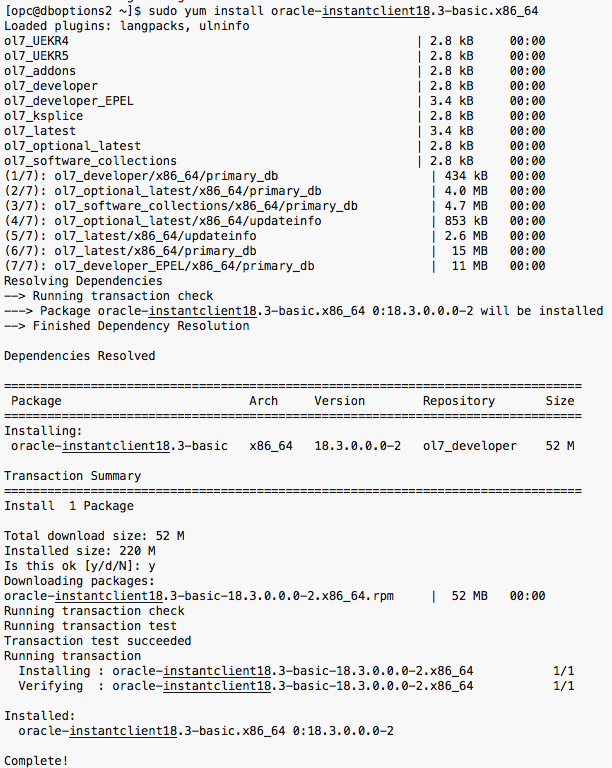  

2. Inside the directory where the Oracle Instant Client has been extracted, create a symbolic link:

    ````
    sudo ln -s /usr/lib/oracle/18.3/client64/lib/libclntsh.so.18.1 /usr/lib/oracle/18.3/client64/lib/libclntsh.so
    ````

    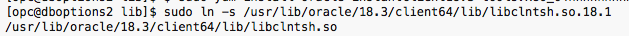  

#### PIP

Pip is a package management system used to install and manage software packages written in Python. Pip will be used to install cx_Oracle.

1. Switch user (su) to the Oracle user and make a downloads directory

    ````
    sudo su - oracle
    cd /u01/app
    mkdir downloads
    exit
    ````
    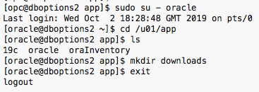  

 2. Download get-pip.py file from: https://bootstrap.pypa.io/get-pip.py

    ````
    sudo wget https://bootstrap.pypa.io/get-pip.py
    ````
    
    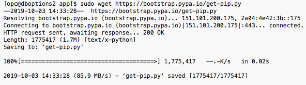     


 3. The Pip installation file is a Python script and you can install it by invoking the Python interpreter and executing the script:

    ````
    sudo wget https://bootstrap.pypa.io/get-pip.py
    ````
    
         

 4. The Pip installation file is a Python script and you can install it by invoking the Python interpreter and executing the script:

    ````
    sudo python get-pip.py
    ````
    
    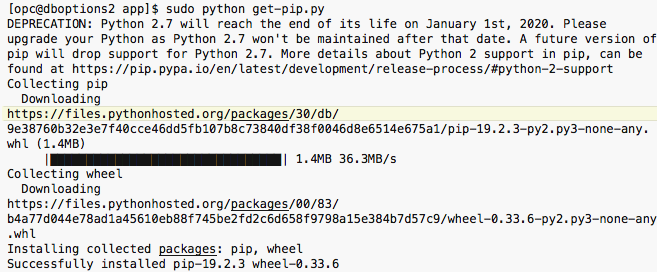  

    ````
    pip list
    ````   

    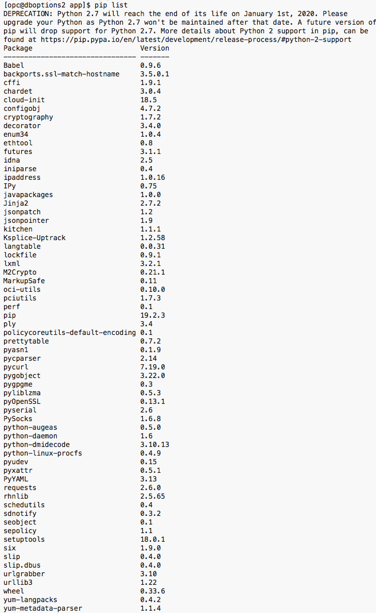        

#### Installing cx_ORACLE

1. Now that the prereqs are installed, it's time to install cx_Oracle.  Switch to the **oracle** user.  cx_Oracle is installed using pip, the utility you just installed.

    ````
    sudo su - oracle
    . oraenv [ORCL]
    export LD_RUN_PATH=/u01/app/oracle/product/19c/dbhome_1
    exit
    ````
    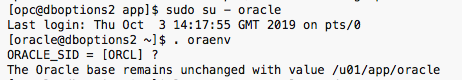   
    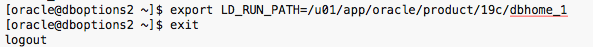   

2.  Then, install the cx_Oracle package with pip (as the opc user)

    ````
    sudo pip install cx_Oracle
    ````

3.  Install python tools

    ````
    sudo yum install python-tools
    ````

    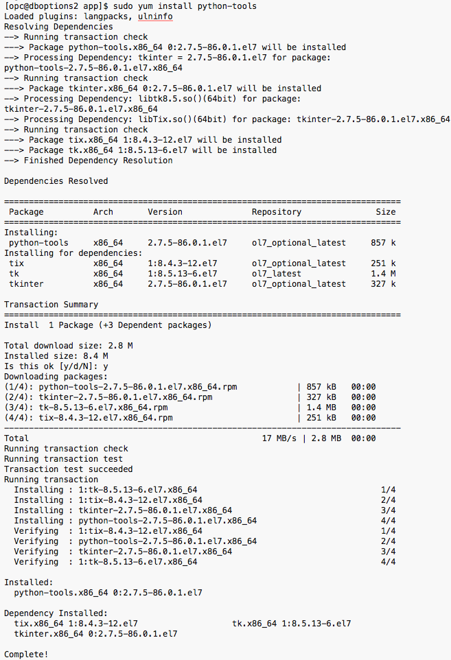  

4.  Test your installation by launching the python console as the oracle user

    ````
    sudo su - oracle
    . oraenv
    export LD_RUN_PATH=/u01/app/oracle/product/19c/dbhome_1
    python
    > help('modules')
    ````

    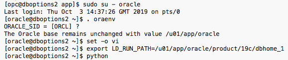  

5.  Connect to the Oracle database and print the version of the database via python. THis confirms you are connected to an Oracle instance and returns the database version. 

    ````
    > import cx_Oracle
    > con = cx_Oracle.connect('system/Ora_DB4U@orcl')
    > print con.version
    19.3.0.0.0 (example output)
    > quit()
    ````

## Section 3 - Python Programming

There are several ways to execute Python code.  Here, we start with the presentation of two ways to execute Python code from the command line. The first is to execute code interactively i.e. executing commands directly in the interpreter. The other way is to save your code in a .py file and invoke the interpreter to execute the file. Finally, we present how to execute Python code using IDLE.

### Run Code Interactively

1. To execute code from command line open the Python command line editor and type the following commands, one by one (each line is one command): 

    ````
    $ python
    > var1 = "hello world"
    > var1
    ‘hello world’
    ````

    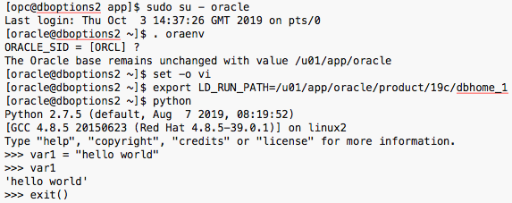  

2.  Open up a text editor (like vi) and type the following script.

    ````
    var1 = "hello world"
    print var1
    ````

3.  Save the file as test.py in the /home/oracle directory.

    ````
    python /home/oracle/test.py
    ````

    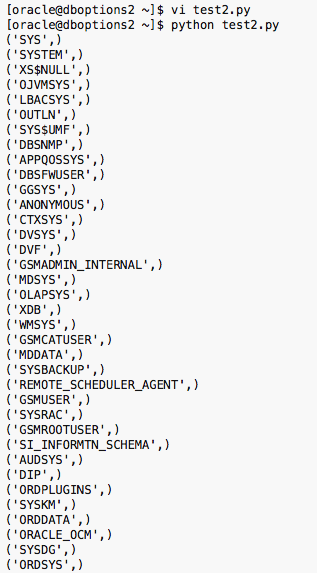  

### Query the Oracle Database

Retrieving records from Oracle database using cursors is a simple as embedding the SQL statement within the cursor().execute statement.

1.  Open up a text editor and enter the following query.  Save the script as /home/oracle/db_connect.py.
    ````
    ## Run a first sample query
    ## import module cx_Oracle
    import cx_Oracle

    ## Set up a DB connection
    con = cx_Oracle.connect('oe/oe@pdb01')

    ## Open a cursor
    cur = con.cursor()

    ## Run a query
    cur.execute('select CUSTOMER_ID, CUST_FIRST_NAME, CUST_LAST_NAME from CUSTOMERS order by CUSTOMER_ID')

    ## Display result set
    for row in cur:
    print row

    ## Close cursor
    cur.close()

    ## Close DB connection
    con.close()
    ````

2.  Now run it.
    ````
    python /home/oracle/db_connect.py
    ````