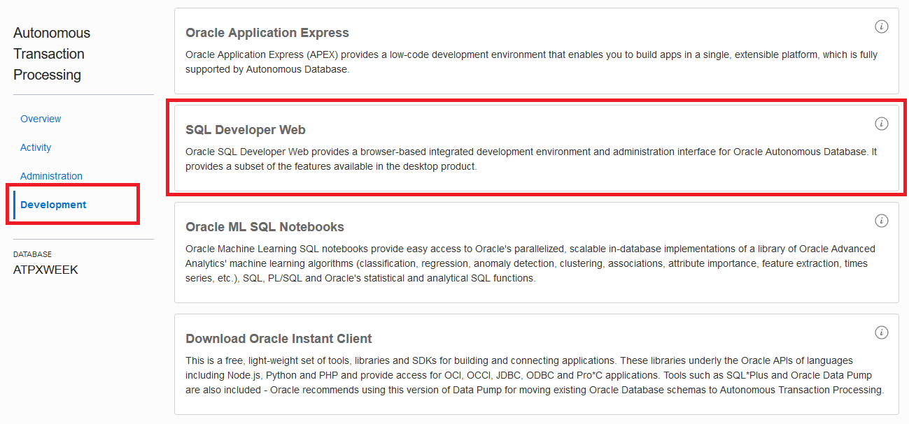

# Using Performance Hub to Analyze Resource Demand from Queries #

## Before You Begin ##
This 15-minute lab shows you how to run a few queries in SQL Developer Web and monitor those queries through the Performance Hub. SQL Developer Web and Performance Hub are available for both Autonomous Data Warehouse (ADW) and Autonomous Transaction Processing (ATP).

### Background ###
SQL Developer Web is a browser-based interface of Oracle SQL Developer. It provides a subset of the features from the desktop version.

The Performance Hub is an HTML5 browser-based interface which offers real time SQL monitoring and active session history performance reporting. If you have a hot query or laggy application, you can use this tool to see exactly where time is being spent.

You'll perform your queries on the Star Schema Benchmark (SSB) sample data. This is 1 TB of read-only data available in all ADW and ATP instances. As well-known large data set, SSB is a helpful schema to test the performance of your services.


### What Do You Need? ###
* Access to an instance of Oracle ATP.
* Have completed the previous lab **Provisioning Autonomous Transaction Processing**.


## STEP 1: Navigate to the Instance's Details Page ##
1. Sign in to the Oracle Cloud. 
2. Click the menu icon to expand the menu on the left edge of the screen.
3. Click **Autonomous Transaction Processing**.

    

    [Description of the illustration OCIMenu.png](files/OCIMenu.txt)

4. Click the name of the instance you created in the previous lab. 
5. You're taken to the instance page which displays details about your instance. Notice the buttons for Performance Hub and Service Console. You'll need both in the upcoming steps.

    

    [Description of the illustration atp_instance.png](files/atp_instance.txt)


## STEP 2: Run a Simple Query ##
In the next steps, you'll run a few queries in SQL Developer Web on the SSB sample data. You'll measure the effects in Performance Hub.

1. Click the **Performance Hub** button. It may take a few seconds for Performance Hub to draw open for the first time.
2. You'll notice three areas as Performance Hub opens. They all appear as clean slates the first time you open Performance Hub.
    * The top area will show actvity over a long-term. A slider lets you pick a timeframe to zoom in on. 
    * The middle area will showing the results of zooming in. 
    * The bottom area will list individual queries.
3. Close Performance Hub by clicking **Close** in the top-right corner.
4. Click the **Service Console** button.
5. Depending on your browser settings, you may need to give permission for the Service Console to open in a new tab. In Firefox:
     * Click **Preferences**
     * Click the final option to **Show** the content.

    

    [Description of the illustration ShowNewTab.png](files/ShowNewTab.txt)

3. The service console opens to the **Overview** page. Click **Development** in the left navigation pane.
4. Click **SQL Developer Web**.

    

    [Description of the illustration ServiceConsole.png](files/ServiceConsole.txt)

5. Sign in using the admin credentials you chose when creating the ATP instance.
    * **Username**: `ADMIN`
    * **Password**: Use the password you created or auto-generated
6. Paste this simple query into the worksheet:
 ````SQL
select c_city,c_region,count(*) 
from ssb.customer c_high
group by c_city,c_region
order by count(*);
````
7. Click **Run Script (or F5)**.

    

    [Description of the illustration SQL_Worksheet.png](files/SQL_Worksheet.txt)

8. Notice the gear icon in the bottom-left corner. It spins to indicate a query is running. The work should end within a few seconds. 

    

    [Description of the illustration Executing_Query.png](files/Executing_Query.txt)

9. The results are reported below the worksheet.
10. Go back to the browser tab for the ATP instance's details.
11. Open **Performance Hub**.
12. Notice there is slight activity due to your query.


## STEP 3: Run a Demanding Query ##
A more-demanding query will reveal lots of activity in Performance Hub. Like with any troublesome query, Performace Hub is a great tool to drill down and investigate where time and resources are spent.

1. Navigate back to the SQL Developer Web tab.
2. Replace the previous query with this:
 ````SQL
select sum(lo_revenue), d_year, p_brand1
from ssb.lineorder, ssb.dwdate, ssb.part, ssb.supplier
where lo_orderdate = d_datekey
and lo_partkey = p_partkey
and lo_suppkey = s_suppkey
and p_category = 'MFGR#12'
and s_region = 'AMERICA'
group by d_year, p_brand1
order by d_year, p_brand1;
````
3. Click **Run Script (or F5)**.
4. Notice the gear in the bottom-left corner keeps spinning. What's taking so long?
5. Navigate back to the Performance Hub tab. You'll notice lots of activity statistics coming in. The peaks of this new activity dwarf that of the previous query. If you can't see the new activity yet, click the **Refresh** button in the top-right corner.

    

    [Description of the illustration Refresh.png](files/Refresh.txt)

6. Scroll down to the second area for ASH Analytics, which zooms in on the timeframe you specify.
7. Performance Hub provides many different dimensions and filters to help you analyze and troubleshoot. 
    * Use the dropdown to change the average active sessions filter from **Consumer Group** to **Wait Class**.

    

    [Description of the illustration WaitClass.png](files/WaitClass.txt)
    
    * Click a green CPU bar to apply a filter for that source.
    * Remove the filter clicking the **x**.

    

    [Description of the illustration RemoveFilter.png](files/RemoveFilter.txt)

8. Scroll down to the **SQL ID** area. Here you'll find a listing of individual queries.
9. Click on your query. 

    

    [Description of the illustration SQL_ID.png](files/SQL_ID.txt)

10. Click on your query.
11. You're taking to the **SQL Details** page. Ensure your query's activity is still within the timeframe slider. If it isn't, adjust the slider.
12. Click the **Execution Statistics** tab.

    

    [Description of the illustration SQL_Details.png](files/SQL_Details.txt)

13. Scroll down. As you scroll, you'll notice statistics for your query indicating where time and resources are spent.

    

    [Description of the illustration Statistics.png](files/Statistics.txt)

You can close Performance Hub and SQL Developer Web. You've finished this lab.


## Want to Learn More? ##
* [Data Management Cloud Courses](https://learn.oracle.com/pls/web_prod-plq-dad/dl4_pages.getpage?page=dl4homepage&get_params=offering:35573#filtersGroup1=&filtersGroup2=.f667&filtersGroup3=&filtersGroup4=&filtersGroup5=&filtersSearch=) from Oracle University 
* [Autonomous Database Cloud Certification](https://education.oracle.com/en/data-management/autonomous-database/product_817?certPage=true) from Oracle University
* [SQL Courses](https://education.oracle.com/database-application-development/sql-and-pl-sql/product_178) from Oracle University 
* [Data Warehouse Courses and Certification](https://education.oracle.com/data-warehouse/data-warehousing/product_152) from Oracle University 
