# Assess Database Configurations and Users on Oracle Data Safe

## Before You Begin
### Objectives
- Run a Security Assessment job against a target database
- Run a User Assessment job against a target database
- Analyze the user assessment results
- Analyze the security assessment results

### Requirements
To complete this lab, you need to have the following:
- Login credentials and a tenancy name for the Oracle Cloud Infrastructure Console
- Oracle Data Safe enabled in a region of your tenancy
- A registered target database in Oracle Data Safe with sample audit data
- Audit collection started on your target database in Oracle Data Safe. If not, see **Provision Audit and Alert Policies**.

### Assumptions

This lab assumes that you are already signed in to the Oracle Data Safe Console. If not, see [View a Registered Target Database](?lab=lab-1-view-registered-target-database), steps 1 and 2.

## **STEP 1**: Run a Security Assessment job against a target database
You can use Security Assessment to evaluate the current security state of your target databases and receive recommendations on how to mitigate the identified risks.

- In the Oracle Data Safe Console, click the **Home** tab, and then click the **Security Assessment** tab.

   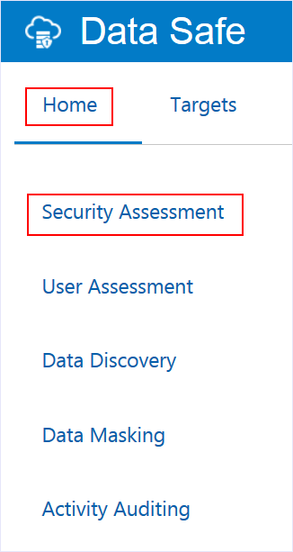

- On the **Security Assessment** page, select the check box for your target database, and then click **Assess**.

   

- While the assessment is running, continue to the next step.

  The assessment takes approximately 2-3 minutes to complete.

## **STEP 2**: Run a User Assessment job against a target database

You can use User Assessment to identify user settings and risks on your target databases.

- Click the **User Assessment** tab.

   

- On the **User Assessment** page, select the check box for your target database, and then click **Assess**.

  The assessment takes approximately 10 seconds.

   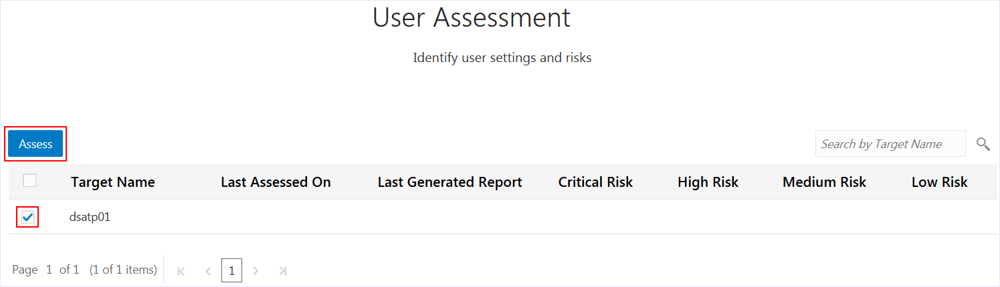

## **STEP 3**: Analyze the user assessment results

- When the user assessment is completed, notice the following on the **User Assessment** page:

  A green check mark is displayed in the **Last Generated Report** column.

  You can view the number of **Critical Risk**, **High Risk**, **Medium Risk**, and **Low Risk** users.

  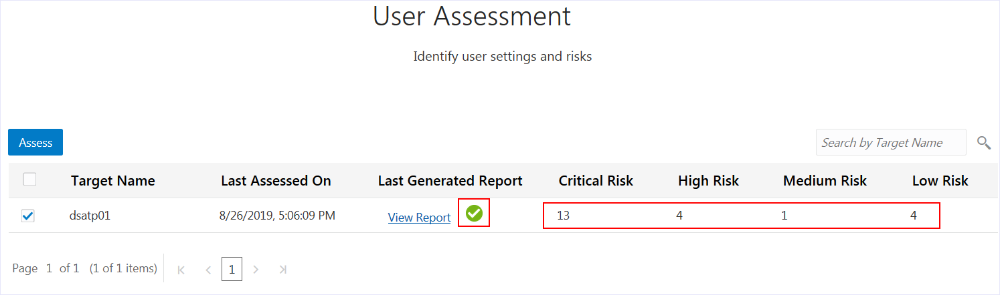

- In the **Last Generated Report** column, click **View Report**.

  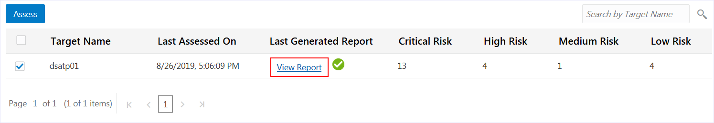

- On the **Users** page, review the 4 charts. You can click the small circles below the charts to navigate between the charts.

  The  **User Risk** chart shows you the percent of users who are  **Critical Risk**, **High Risk**, **Medium Risk**, and **Low Risk**.

   

   The **User Roles** chart shows you the number of users with the **DBA**, **DV Admin**, and **Audit Admin** roles.

   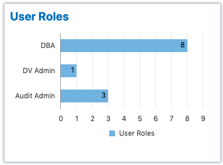

   The **Last Password Change** chart shows you the number of users who have changed their passwords in the last 30 days, the last 30-60 days, and 60 days ago or more.

   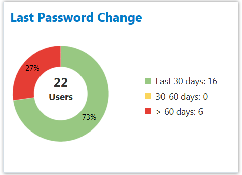

   The **Last Login** chart shows you the number of users that signed in to the database within the last 24 hours, within the last week, within the current month, within the current year, and a year ago or more.

   

- Review the table below the charts.

  This table lets you quickly identify critical and high risk users as well as other users that may pose risks, for example, users who are DBAs, DV Admins, and Audit Admins.

  

- Scroll to the right. In the **Audit Records** column, click **View Activity** for the `ADMIN` user.

  

- View the **All Activity** report.

  The report is automatically filtered to show you the audit records for the `ADMIN` user, for the past week, and for your target database.

  At the top of the report, you can view totals for **Targets**, **DB Users**, **Client Hosts**, **Login Success**, **Login Failures**, **User Changes**, **Privilege Changes**, **DDLs**, and **DMLs**.

  The **Event** column shows you the activites performed by this user.

  

- At the bottom of the page, click the page numbers to view more audit records.

  

- At the top of the report, click **Back to User Assessment report**.

  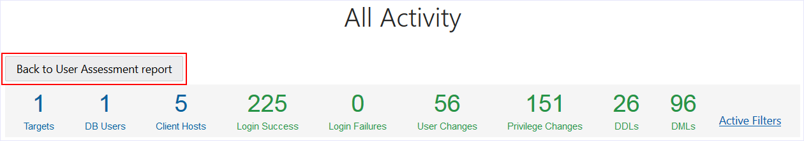

- At the bottom of the **User Assessment** page, click **2** to view page 2.

  

- Notice that the privileged user `VOLDEMORT` is expired. Click **View Activity** to view the audit records for the `VOLDEMORT` user.

  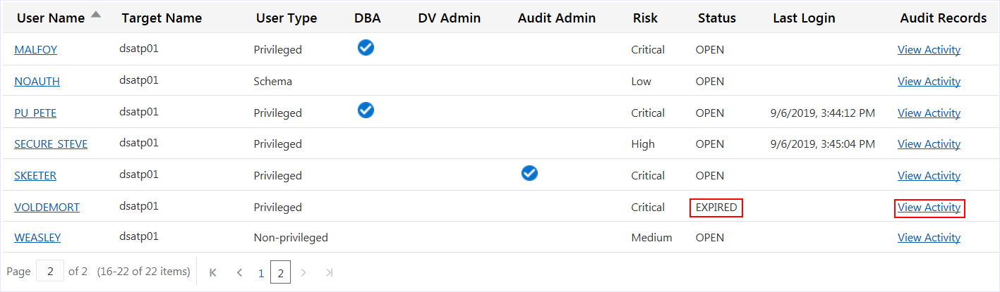

- Notice that `VOLDEMORT` has no activity on the target database.

  Here is a case where you might consider removing this user from the target database.

  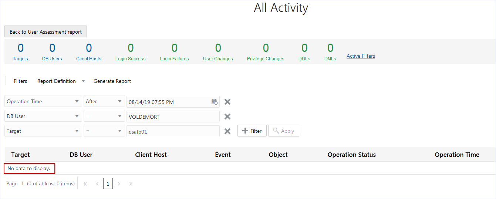

## **STEP 4**: Analyze the security assessment results

- Click the **Home** tab, and then click the **Security Assessment** tab.

  

- On the **Security Assessment** page, view when you last assessed the security of your target database, and the number of **High Risk**, **Medium Risk**, and **Low Risk** users. In the **Last Generated Report** column, click **View Report** to view the **Comprehensive Assessment** report.

  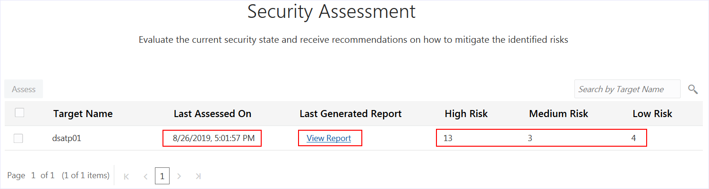

- At the top of the **Comprehensive Assessment** report, you can view the target database name, when the database was assessed, and the database version.

  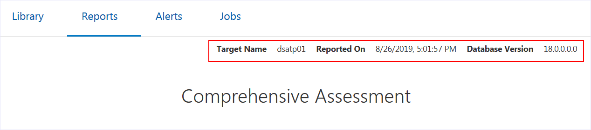

- Also at the top of the report, you can view totals for the following:

  - Risk levels (**High Risk**, **Medium Risk**, **Low Risk**, **Advisory**, **Evaluate**, and **Pass**). These totals give you an idea of how secure your database is. Notice that the risk levels are color coded.
  - **Security Controls**, **User Security**, and **Security Configurations**. These totals show you the number of findings for each high-level category in the report.

  

- In the **Summary** category, you can view a table that compares the number of findings for each category and counts the number of findings per risk level. These values help you to identify areas that need attention.

  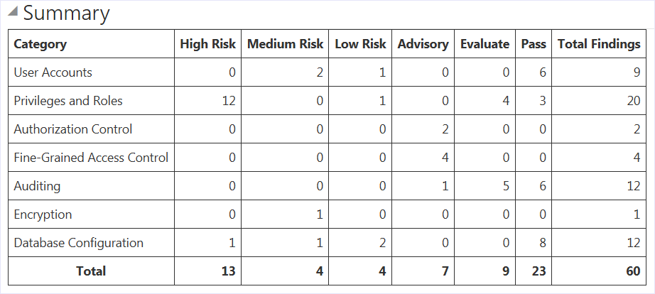

- Expand **User Accounts** to view a list of all the user accounts in the target database. You can view each user's status, profile, and tablespace; whether the user is Oracle defined; and the authentication type for the user.

  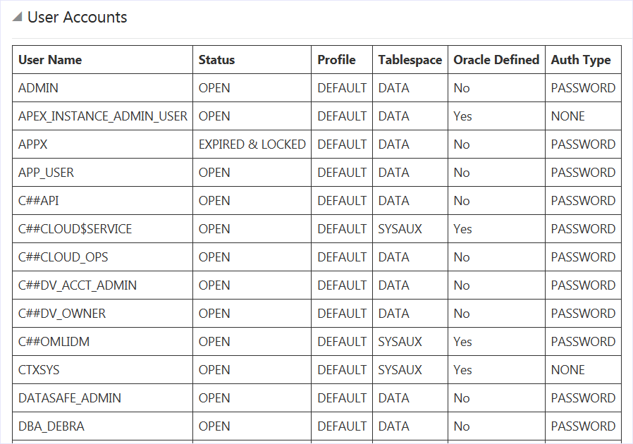

- Expand **User Profiles** to view a list of profile names, parameters, and values.

  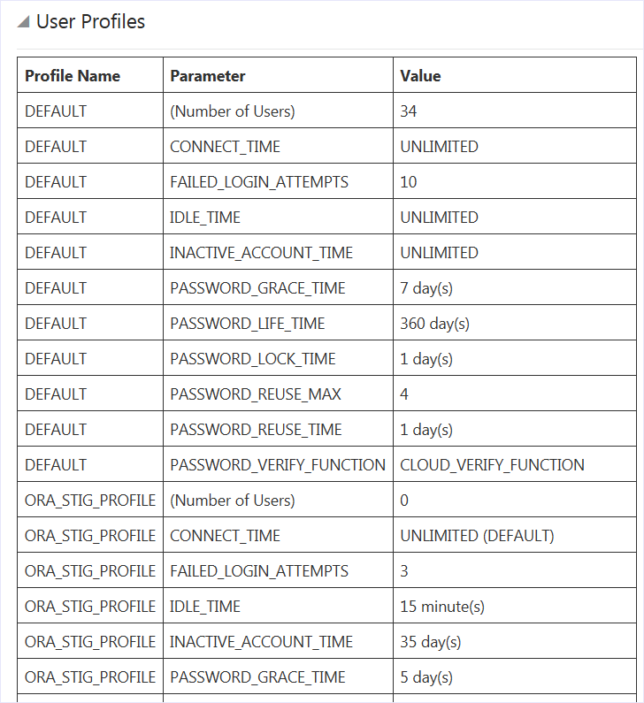

- Scroll down and expand categories. Each category lists related findings about your database and how you can make changes to improve its security.

  On the right, indicators show whether a finding is recommended by the Center for Internet Security (**CIS**), European Union's General Data Protection Regulation (**GDPR**), and/or Security Technical Implementation Guide (**STIG**). These indications make it easy for you to identify the recommended security controls.

  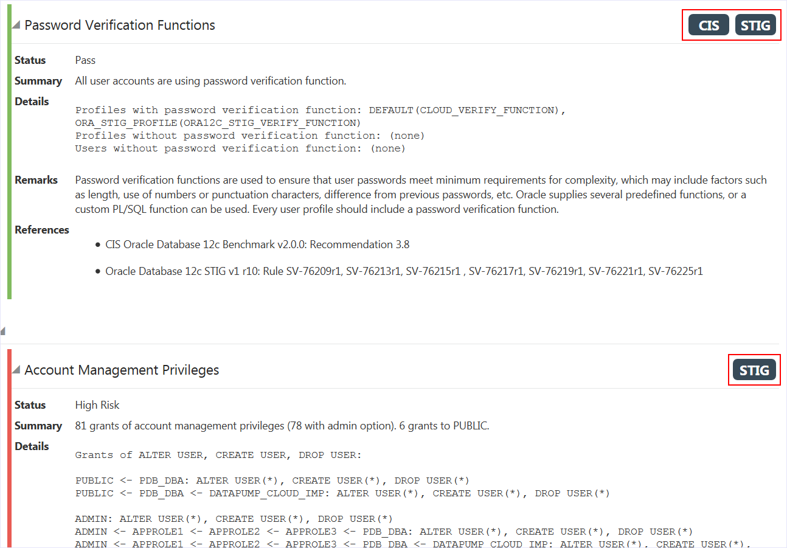

- Scroll to the top of the report, and then click **High Risk** to filter the report to show only high risk findings.

  It's a toggle so if you click it again, the filter is removed.

  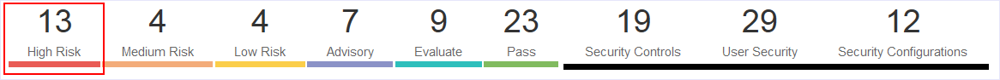

- Scroll down to the **User Impersonation** category and view the information.

  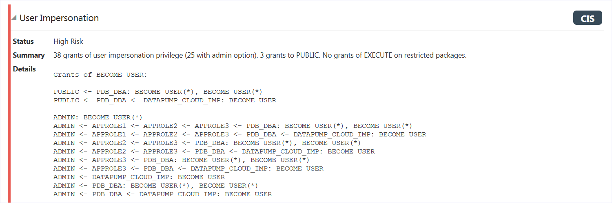

- Notice that the `GRINDELWALD` user becomes a `PDB_DBA` through the grants of the `APPROLE1`, `APPROLE2`, and `APPROLE3` roles.

    Here is a case where you might consider removing these roles from this user.

    