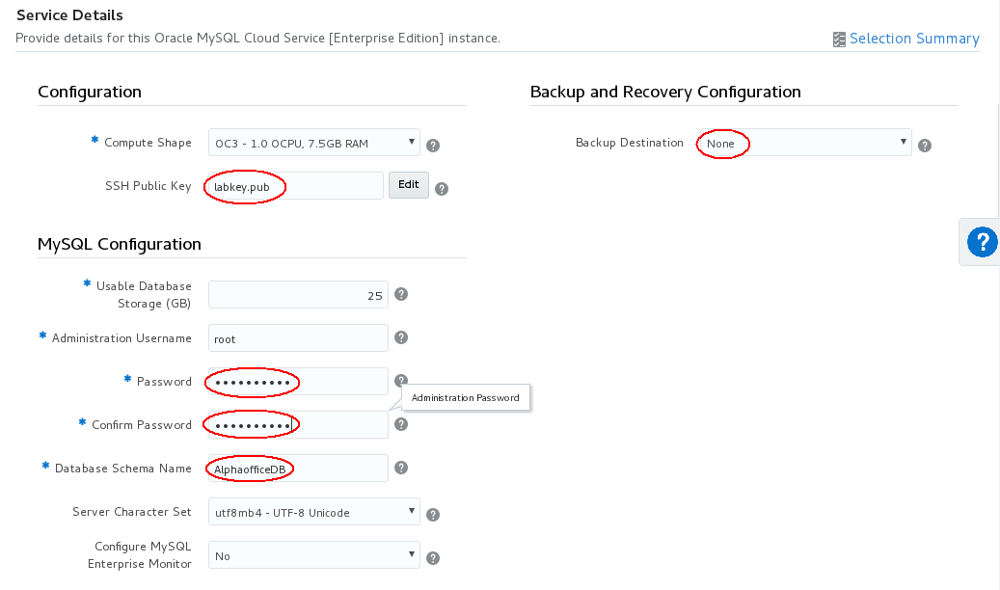
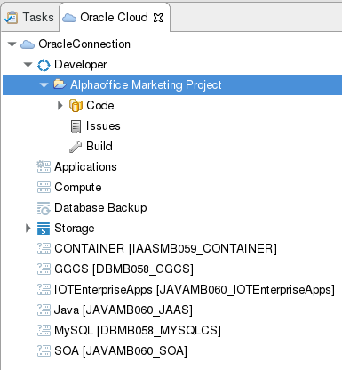

  

Update: May 23, 2017

# Introduction

This is the Second of several labs that are part of the **Oracle Public Cloud Native Database** workshop. This workshop will walk you through the Software Development Lifecycle (SDLC) for a Cloud Native project that will create and use several Microservices.

In the previous lab (100), the Project Manager several tasks and assigned them to the various developer roles.  In this lab, you will assume the role of database developer (Roland Dubois) who will make the required changes to the MySQL Database.

**Please direct comments to: Derrick Cameron (derrick.cameron@oracle.com)**

## Objectives

- Access Developer Cloud Service
- Import code from external Git Repository
- Initialize a new test MySQL Database
- Apply schema and data updates to a local MySQL database
- Deploy updates to the test MySQL Database

## Required Artifacts

The following lab an Oracle Public Cloud account that will be supplied by your instructor. In this account you will use Developer Cloud Service, MySQL Cloud Service, and a Compute Cloud Service.  The Compute Cloud Service is an image that has the required client tools, including Eclipse.

# Create Initial Test MySQL Database

## Explore Developer Cloud Service

### **STEP 1**: Login to your Oracle Cloud Account

- If you just completed lab 100 and you are still logged in you can continue, otherwise log in.
- Click **Sign In** in the upper right hand corner of the browser

      

- ***IMPORTANT*** - Under My Services, ***ask your instructor*** which **Region** to select from the drop down list, and **click** on the **My Services** button.

      

- Enter your identity domain and click **Go**

    **NOTE:** the **Identity Domain, User Name and Password** values will be given to you from your instructor.

      

- Once your Identity Domain is set, enter your User Name and Password and click **Sign In**

    ***NOTE:*** For this lab you will be **acting as** the Database Developer ***Roland Dubois***. As with the previous lab, if you are not able to support multiple users, login as a supported user, and assume the “logical” identify of Roland Dubois, the Database Developer.

      

- You will be presented with a Dashboard displaying the various cloud services available to this account.  Your particular account may differ from this.

      

### **STEP 2:**	Login to Developer Cloud Service

Oracle Developer Cloud Service provides a complete development platform that streamlines team development processes and automates software delivery. The integrated platform includes issue tracking system, agile development dashboards, code versioning and code review platform, continuous integration and delivery automation, as well as team collaboration features such as wikis and live activity stream. With a rich web based dashboard and integration with popular development tools, Oracle Developer Cloud Service helps deliver better applications faster.

- From Cloud UI dashboard click on the **Developer** service. In our example the Developer Cloud Service is named **developer76638**.

      

- The Service Details page gives you a quick glance of the service status.

      

- Click **Open Service Console** for the Oracle Developer Cloud Service. The Service Console will list all projects that you are currently a member.

      

### **STEP 3**: Review Agile Board

- Click **Twitter Feed Marketing Project** to access the project.

    

- Click on **Agile** in navigation panel.

      

- If the **Microservices** is not the default board, click on the current board’s dropdown, select the filter **All**, and click on **Microservices**

      

- Click on the **Microservices** Board **Active Sprints**.

      

## Create Initial Git Repository

### **STEP 4**: Create Initial Git Repository

As in the previous lab, we maintain a separate repository for database related updates. To pull his code into the Developer Cloud Service, we will clone his external GIT repository. First let’s update our agile board to show that we are working on this task:

- Drag and drop **Task 1 - Create Initial GIT Repository for Database changes** into the **In Progress** swim-lane.  Click **OK** on Change Progress popup.

      

- Click on **Project** on upper left screen.

- Click on **New Repository** to create a new Git Repository (upper right)

      

- In the New Repository wizard enter the following information and click **Create**.

    **Name:** `AlphaofficeDB`

    **Description:** `Alphaoffice Database`

    **Initial content:** Import existing repository and enter the URL: `https://github.com/dgcameron/AlphaofficeDB.git` 

      

- You have now created a new GIT repository based on an existing repository.

      

## Create New MySQL Database Service

<!--
### **STEP 5**: Create new MySQL Service:  Option A - Scripted Build Job **(Note Step 6 Option B uses the Cloud Console)**

Now that we have the source code in our managed GIT repository, we need to create a new MySQL Database Service.

- Click **Build** to access the build page and click **New Job**.

    

- In the New Job popup enter 

   **Job Name:** Create New MySQL Databaseand 

   Make sure **Create a free-style job** is checked
   
   Click **Save**.

      

- You are now placed into the job configuration screen.

    

- Click on the **Build Parameters** tab.   Then click, **This build is parameterized.**  We will add four string parameters: **USER_ID**, **USER_PASSWORD**, **ID_DOMAIN**, **PAAS_HOST**

      

    

- Select the **Source Control** tab and select the AlphaofficeDB git repository.

    

- Select the **Build Steps** and specify a shell script.  Enter the following:

    `sh src/main/resources/db/setup/cr_mysql_clean.sh $USER_ID $USER_PASSWORD $ID_DOMAIN $PAAS_HOST`

    

- Select **Save** and then **Build Now**.
    - **USER_ID:** `<your assigned cloud user account>`
    - **USER_PASSWORD:** `<your assigned cloud password>`
    - **ID_DOMAIN:** `<your assigned identity domain>`
    - **PAAS_HOST:** `your assigned PAAS Host (eg psm.us.oraclecloud.com or psm.em.oraclecloud.com)

    

    

- The job will initially be queued and then drop down to Build History.  It will take 10 minutes to process.  When it is finished (or you can monitor while it is executing) select console and you can see the job results.  It should finish with a 'Success' message.

    

    
-->

### **STEP 5:**  Create MySQL Cloud Service 

We will now create a MySQL Database using the Cloud Console.  But we will need to access the web console from within the VNC client.

-  Log into the VNC client with the credentials you have been supplied.

    

- Open a **Terminal** window.  Click on **Applications** then select **Terminal**.

    

- Create a **keys** directory, change its permissions, and cd into it.
    - `mkdir keys`
    - `chmod 700 keys`
    - `cd keys`

    

- Generate a public and private key using the "`ssh-keygen -b 2048 -t rsa`" command.  Save the key to a file called **labkey**.  We don't want to generate a passphrase so just hit **Enter** when prompted to supply one.  When you are done, you will have 2 files, **labkey** (private key) and **labkey.pub** (public key).

    

- Now that we have our keys, open Chrome and log into the Cloud Console by navigating to `http://cloud.oracle.com` and supplying the proper credentials.  Select the **MySQL Cloud Service**, and then press the **Open Service Console** button on the right.

    

    

- Click the **Create Service** button.

    

- Enter the following parameters and click **Next**
    - **Service Name:**  `AlphaofficeDB`
    - **Service Description:**  `Test MYSQL DB for Microservices DB Workshop`
    - **Metering Frequency:**  `Hourly`

    

- On the next screen enter the following parameters in each section and click **Next**
  - **Configruation**
    - **Compute Shape:**  `OC3` (default)
    - **SSH Public Key:**  `labkey.pub` (This is the public key you generated above.  Click the **Edit** button then **Choose File** and navigate to where is was created. **/u01/OPCWorkshop/keys** and select **labkey.pub** )
  - **MySQL Configuration**
    - **Usable Database Storage (GB):**  `25` (default)
    - **Administration Username:**  `root` (default)
    - **Password:**  `Alpha2014_`
    - **Database Schema Name:**  `AlphaofficeDB`
    - **Server Character Set:** `utf8mb3 - UTF-8 Unicode` (default)
    - **Configure MySQL Enterprise Monitor:**  `No` (default)
  - **Backup and Recovery Configuration**
    - **Backup Destination:** `None`

    

    

    

- Confirm your choices and click **Create**.  Note the create process will take 10 - 20 minutes.

    

- Once the MySQL service is created, we need to open port 1521.  Go to Access Rules. 

    

-  Create new Rule with the follow parameters:
    - **Rule Name:**  `MySQL_1521`
    - **Source:**  `PUBLIC-INTERNET`
    - **Destination:**  `mysql_MASTER`
    - **Destination Port:**  `1521`
    - **Protocol:**  `TCP`

    

### **STEP 6:**  Switch MySQL From Port 3306 to 1521

Currently traffic is blocked on 3306 to Developer Cloud Service so we need to switch the port to 1521 (or somewhere in the 1520 to 1530 range) in MySQL.

- Select the new MySQL Service AlphaofficeDB.

    

- Note the public IP address (you will need this later)

    

- Using the terminal you opened to create the keys, run the following.  If you closed the terminal, open a new one and cd into the keys directory. 

    (Remember to use the public IP of your MySQL instance in the **ssh** command below.)

```
ssh -i labkey opc@129.144.152.131
********************************************************************************
*                                 Welcome to                                   *
*                             MySQL Cloud Service                              *
*                                     by                                       *
*                                   Oracle                                     *
*       If you are an unauthorised user please disconnect IMMEDIATELY          *
********************************************************************************
******************************* MySQL Information ******************************
* Status:  RUNNING                                                             *
* Version:   5.7.17                                                            *
********************************************************************************
************************** Storage Volume Information **************************
* Volume      Used             Use%           Available   Size     Mounted on  *
* MySQLlog    6.1G ---- 11%                         50G    59G   /u01/translog *
* bin         2.6G ------- 28%                     6.7G   9.8G   /u01/bin      *
* data        122M -- 1%                            24G    25G   /u01/data     *
********************************************************************************

sudo su

[root@alphaofficedb-mysql-1 opc]# echo 'port=1521'>>/u01/bin/mysql-5.7.17/my.cnf

/etc/init.d/mysqlcsoper stop 

/etc/init.d/mysqlcsoper start

exit

exit
```

### **STEP 7**: Instantiate data to Version 1

We now have an empty database.  We need to populate it with baseline data.  We will use Flyway to version the data and create a baseline set of data.  Oracle Developer Cloud Service supports and encourages the use of Open Source solutions such as Flyway.

- This is how [Flyway](https://flywaydb.org/getstarted/howworks) works:

    

        

- In our case our initial run of Flyway will do the following:
    - Create schemas (AlphaofficeDB and AlphaofficeDB_Dev)
    - Create schema_version tables in the schemas
    - Execute the SQL Scripts sequentially starting at V01__ (default for Flyway)

- Review Script **V01__AlphaofficeDB_init.sql** - go to code, and then drill down to the migration folder and select the file:
    - **Path:** `/src/main/resources/db/migration/V01__AlphaofficeDB_init.sql`

      

    

- Next create a build job that will run the Flyway plug-in to Maven.  Navigate to Build.

    

- Create a new job with the following specifications for each tab identified below:
    - **Main:**
      - **Name:** `Apply Alphaoffice Database Versions`
      - **Description:** `Apply Flyway database updates`
      - **JDK:** 'JDK 8'
    - **Build Parameters:**   ( 7 String Parameters )
      - **flyway_user:** `root`
      - **flyway_password:** `Alpha2014_`
      - **flyway_driver:** `com.mysql.cj.jdbc.Driver`
      - **flyway_url_prefix:** `jdbc:mysql://`
      - **flyway_schemas:** `AlphaofficeDB`
      - **db_ip:** `<your MySQL Database public IP>`
      - **db_port:** `1521`
    - **Source Control:** 
      - check `git` and select the repository `AlphaofficeDB.git`
    - **Trigger:** 
      - Check `Based on SCM polling` (leave Schedule field blank)
    - **Build Steps:** 
      - Add a build step of type `Execute Shell` and use the following commands...
      ```
      mvn clean compile -Dflyway.user=${flyway_user} -Dflyway.password=${flyway_password} -Dflyway.url=${flyway_url_prefix}${db_ip}:${db_port}?useSSL=false -Dflyway.driver=${flyway_driver} -Dflyway.schemas=${flyway_schemas} flyway:migrate
      
      mvn clean compile -Dflyway.user=${flyway_user} -Dflyway.password=${flyway_password} -Dflyway.url=${flyway_url_prefix}${db_ip}:${db_port}?useSSL=false -Dflyway.driver=${flyway_driver} -Dflyway.schemas=${flyway_schemas}_Dev flyway:migrate
      ```

- This is how the Build Step should look:

    

  - **NOTE:** this actually runs Maven/Flyway twice - once to create the test database AlphaofficeDB, and again to create/simulate a local development database AlphaofficeDB_Dev.

- Click **Save** and then run the **Build Job** 

    

- Fill out the parameters (remember to change the **db_ip** to the MySQL public IP) and then press **Build**.  This should take no more than a minute or two.

    

- Review the job results:

    

                      

# Apply Changes to MySQL Database Service

## Clone Project to Eclipse IDE

### **STEP 8**: Load Eclipse IDE

- VNC/Login into the client image and double click on the Eclipse IDE icon on the desktop.

    

- Close the welcome window.

    

### **STEP 9**: Create Connection to Developer Cloud Service
- We will now create a connection to the Developer Cloud Service. To do this, first click on the menu options Window -> Show View ->Other

    

- Enter oracle in the search field. Select Oracle Cloud, and click on OK.

    

- Click on Connect in the Oracle Cloud tab

    

- Enter the following information:
    - **Identity Domain:** `<your identity domain>`
    - **User name:** `<your assigned username>`
    - **Password:** `<your assigned ID Domain password>`
    - **Connection Name:** `OracleConnection`

    

- If prompted, enter and confirm a Master Password for the Eclipse Secure Storage. In our example we use the password of oracle. Next, press OK.  If prompted to enter a Password Hint, click on No.

    

### **STEP 10**: Create a local clone of the repository
- Expand Developer, and then double click on Alphaoffice Marketing
Project to activate the project.

    

- Expand the Code, and double click on the Git Repo
[AlphaofficeDB.git], to cause the Repo to be cloned locally.

    

- Import Projects - navigate to the top left file menu and select Import Projects.

    

- Expand the git menu item and select Projects from Git.

    

- Select **Existing Local repository** 

    

- Select the AlphaofficeDB git repository.

    

- Take the defaults

    

- Take defaults.

    

## Test the Local Cloned Services

### **STEP 11**: Set Feature 1 Status to In Progress

In the previous steps we updated the status of the Tasks assign to Roland Dubois using the web interface to the Developer Cloud Service. In this step we will use the Eclipse connection to the Developer Cloud Service to update the status of Roland’s tasks.

- Within the Oracle Cloud Connection tab, double click the Issues to expand, then double click on **Open** to expand the list. Once you see the list of the Issues, then double click on **Update Database**.

    

- Scroll down to the bottom of the Update Database window. In the Actions section, and change the Actions to Accept (change status to ASSIGNED), then click on Submit.

    

- Optionally, if you return to the Developer Cloud Service web interface, you’ll see that the Eclipse interface caused the Feature 2 - Update Database, assigned to ronald.dubois, to be moved to the “In Progress” column of the Agile > Active Sprints.

    

## Update Database

### **STEP 12**: Create Database Connection

- Open perspective Database by clicking **Window > Perspective > Open Perspective > Other**

    

- Select **Database Development** from the popup and press **OK**

    

- Right click on **Database Connections** and select **New...**.

    

- Select **MySQL**, then Next.

    

- Select New Driver Definition

    

- Select MySQL JDBC Driver, version 5.1, then select the JAR tab.

    

- Clear the existing Jar file.

    

- Add Jar/Zip file.

    

- Navigate to oracle/mysql-connector-java-5.1.41 and select the .jar file.

    

- Select Properties and update the values as follows:
    - **Connection URL:** `jdbc:mysql:<your MySQL IP>:1521/AlphaofficeDB_Dev`
    - **Database Name:** `AlphaofficeDB_Dev`
    - **Driver Class:** `leave existing values`
    - **Password:** `<your assigned MySQL password>`
    - **User ID:** `root`

    

- Check **Save password** and click **Test Connection** to verify your credentional as correct.

    

    

- Click **Finish** to save the connection.

### **STEP 13**: Apply Updates

The required updates are sitting in a versioned Flyway file in a backup directory in the git repository.  We will apply these updates to the AlphaofficeDB_Dev database, confirm the changes are correct, and later apply them to the AlphaofficeDB test database.

- Navigate back to the Resource/Project view, and expand the git repository to the backup folder.  If you have closed the **Oracle Cloud** tab in eclipse, you can report it by **Window > Show View > Other** and in the popup, select **Oracle Cloud**.  Once you have the **Oracle Cloud** tab open, navigate to **OracleConnection > Developer > Alphaoffice Marketing Project > Code > AlphaofficeDB.git > Working Tree > src > main > resources > db > backup** and there you will find the file **V002__AlphaofficeDB_twitterapp.sql**.

    

- Right click and select open in editor.

    

- Set the Connection Profile.  **Note:**  You may need to increase the size of the editor window to allow for the select lists to be shown.

    - **Type:** `MySQL_5.1`
    - **Name:** `New MySQL`
    - **Database:** `AlphaofficeDB_Dev`

    

- Select the sql, right click, and execute all.

    

- Review results of updates. 
    - Enter `select * from PRODUCTS` in the sql window, hightlight the sql and select `Execute All`.  **Note:** The tablename **PRODUCTS** is case sensitive.

    

- Maximize the results windows to review the query results.  Note that there is a new `Twitter Tag` column and it has been populated with a product hash tag.

    

- Resize the results region (hover over and drag the region boundry to the left), and scroll over to to the right to view the new column.

    

- Select the Resource perspective (upper right) and then the Project Explorer panel.

    

- Navigate to **AlphaofficeDB.git > src/main/resources > db > backup** Right click on **file V002__AlphaofficeDB_twitterapp.sql** and copy it. Paste into the migration folder, where it will eventually get picked up by Flyway and deployed to the test MySQL instance.

    

# Create a new Branch and Commit Code

## Create a Branch and Commit Code

### **STEP 14**: Create a new Branch and Commit Code

- To create a new branch in the Git repository, from the **Project Explorer** tab, right click on **AlphaofficeDB.git** and then select **Team > Switch To > New Branch**.

    

- In popup window, **enter** `Feature2` for branch name and click **Finish**.

    

- Add file to index. Right click on the file you just copied to the migrate folder and then select **Team > Add to Index**

    


- We can now commit our code to the branch by Right Clicking on **AlphaofficeDB.git** and then selecting **Team > Commit**

    

- Right click on the new file in the migration folder and select **Team > Commit** 

    

- Enter “Feature2: Applied database updates for twitterfeedapp” in the Commit Message box, and click on Commit and Push. Note: it is possible to change the default Author and Committer to match the current “persona.” However, for the sake of this lab guide, we will leave the defaults.

    

- Click **Next**

    

- Click **Finish**

    

- Click **OK**

    

### **STEP 15**: Complete the Database Updates Task

- Click the **Oracle Cloud** tab and navigate to **Developer > Alphaoffice Marketing Project > Issues > Open** and double click on **Update Database** task.

    

- In the Update Database window, scroll down to the **Actions Section**. Click on **Resolve as FIXED**,  and then click on the **Submit** button.

    

### **STEP 16**: Review Sprint Status and create Merge Request

- Return to the Developer Cloud Service Dashboard in the browser, and select Agile. If your default Board is not set to Microservices, then set the Find Board Filter to All, and select the Microservices board.

- Click on Active Sprints button. Notice that Feature 2 is now in the Verify Code column.

    

- Next, on navigation panel click Code, select the Feature2 branch. i

    

- Click on the **Logs** sub tab. Now view the recent commit made to branch from within Eclipse.

    

- Now that Roland Dubois has completed the task of updating the database, a **Merge Request** can be created by Roland and assigned to Lisa Jones. Click on the **Merge Requests** on the left, and then click on the **New Merge Request** button.

    

- Enter the following information into the New Merge Request and click **Next**
    - **Repository:** `AlphaofficeDB.git`
    - **Target Branch:** `master`
    - **Review Branch:** `Feature2`

    

- Enter the following information click the **Create** button at the bottom right
    - **Summary:** `Merge Feature 2 into master`
    - **Reviewers:** `<assigned user>`

    

- In the **Write** box, enter the comment “I have applied Alphaoffice Database Updates" and then click the **Comment** button to save.

    

## Merge the Branch

In the following steps “Lisa” will merge the branch created by "Roland" into the master.

### **STEP 17**: Merge Requests

- Before moving forward, “Lisa Jones” can take a look at the Burndown and Sprint Reports by clicking on the **Agile** tab on the left, select the **Microservices** Sprint, then the Reports button.

    

- Select Sprint report.

    

- On navigation panel click **Merge Requests**.  Click on the **Merge Feature 2 into master** assigned request.

    

- Once the request has loaded, select the **Changed Files** tab. “Lisa” will now have the opportunity to review the changes in the branch, make comments, request more information, etc. before Approving, Rejecting or Merging the Branch.  Click the **Merge** button.

    

- Leave the defaults, add the commit message and click on the Merge button in the confirmation dialog.

    

- Now that the code has been committed to the Developer Cloud Service repository, the build and deployment will automatically start. On the navigation panel click Build, and you should see a Apply Alphaoffice Database Versions Build in the Queue.  Navigate to build and review jobs.  Click on the job.

    

- Then click on the latest build and review the console output.

    

- You should see the migration of the latest updates at the bottom of the script.

    

### **STEP 18**: Optional - review data Eclipse

- Open Eclipse in your client image.  Select the Database Development perspective and edit the existing database connection to switch from AlphaofficeDB_Dev to AlphaofficeDB.  This is the test instance that was updated when you commited the branch to master.

    

- Remove the _Dev from the database/schema name:

    

    

- Right click on the connection and select connect.


    

- Expand the database and review the schema_versions data.  Note the migrations.

    

    

- Select the PRODUCTS table and note the new populated twitter_tag column.

    

    
