# Microservices on Kubernetes Demo Lab

## Introduction
_Time to Complete: 20 minutes_

  In this demo lab, you begin your container-native development journey by diving in to a Kubernetes sandbox environment with a microservice application partially running in it. You will learn about the components that make up an application in Kubernetes, such as Deployments, Services, Replica Sets, and Pods.

  Next, you complete the deployment of this application yourself using a pre-written deployment descriptor and learn about how the two microservices discover and interact with each other. Finally, you scale out one of the services to learn about handling peak traffic.

  If you would like to learn how to build a highly available Kubernetes cluster on your own hardware or in the cloud, as well as set up a CI/CD pipeline from scratch, check out the last section of this guide for information about our container native workshop.

## Objectives

- Get hands-on with microservices on Kubernetes
- Explore Deployments, Services, Replica Sets, Pods, and more Kubernetes concepts
- Deploy a microservice using the Kubernetes dashboard
- Perform a managed scale out of a running application
- Learn where to go from here

## Instructions

### Investigate Product Catalog Microservice

The application you will be working with is a product catalog website that consists of two separate services. One component, **product-catalog-app**, is a Node.js server that hosts the catalog data and serves the website to customers. The second component, **twitter-feed** is a Java SE service that searches Twitter for tweets about the items in the product catalog. The product catalog microservice requests the twitter data from the twitter-feed service and returns it to the browser.

Let's explore the deployed application using the Kubernetes Dashboard.

- Once your lab is ready, you will see an IP address link on the lower right of your page. Click the link.

- Open your Kubernetes Dashboard by clicking the **Kubernetes Dashboard** button on your demo lab landing page.

  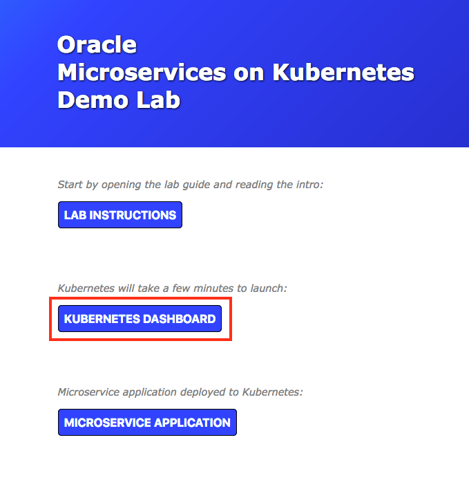

- The dashboard overview page contains tables that describe the current **deployments, pods, replica sets, and services** in your Kubernetes cluster. You should have some product catalog entries in each of the tables. Let's explore what each of those entries contributes to our product catalog application.

  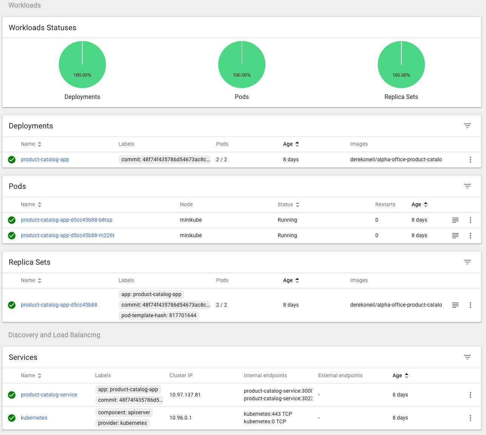

  - **Deployments:** Deployments are high-level objects in Kubernetes that describe the desired state of your service or application. Kubernetes will automatically create several lower level objects (replica sets, pods) to bring the actual state in line with the desired state that you defined. Deployments let you specify which Docker container image(s) you want to run, how many concurrent copies of the application you want, what ports should be open for your application, metadata such as a name and labels, and more. The deployment will manage the lifecycle of the lower level objects that it creates, automatically adding or removing instances of your application in the case of failures or recoveries.

  - **Replica Sets:** The deployment that you created for your application specified the number of copies that should be running at all times. In order to ensure that the correct number of instances are running, the deployment creates a replica set, which is responsible for creating or destroying instances as needed. The actual instances that a replica set manages are called pods.

  - **Pods:** A pod is the smallest unit of compute that Kubernetes can deploy and manage. A pod consists of the Docker container(s) that make up this portion of your application, as well as any shared resources that they require, such as storage and networking. Replica Sets create and delete pods as needed to satisfy the specification you created in your original deployment object.

  - **Services:** In Kubernetes, a service is an object that represents one of the microservices in your application. That microservice may consist of more than one pod for availability and scalability purposes. Traffic between microservices in your application cannot rely on the hostname or IP address of a specific pod, and thus must use a higher level abstraction to address its target. A Kubernetes service provides several ways for different microservices in your application to locate each other, including a built-in DNS resolver, environment variable injection, and direct API lookup.

- Now that you have explored the various concepts that Kubernetes uses to represent our application, let's take a look at the product catalog application itself. From the demo lab landing page (where you found the button to launch the Kubernetes dashboard), click the **Microservice Application** button. You should see the Alpha Office product catalog page, complete with listings for various office supplies.

- The product catalog portion of our application seems to be working fine. Let's check out the relevant tweets for one of the products that should be provided by the other microservice in our application, the **twitter-feed**. Click on **any product image** to load the detail view.

  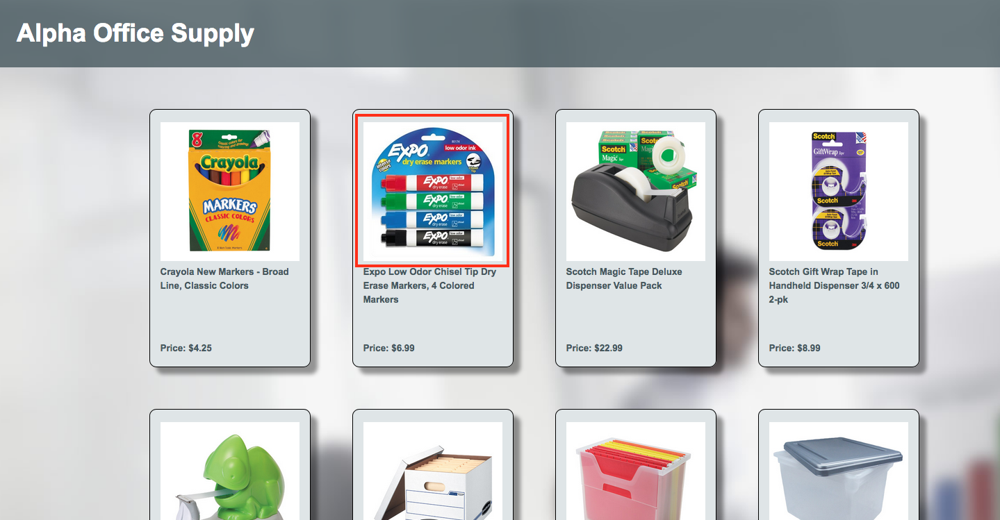

- Hm! No tweets are displayed in the right pane of the details. Looks like the microservice hasn't been deployed to the cluster yet.

  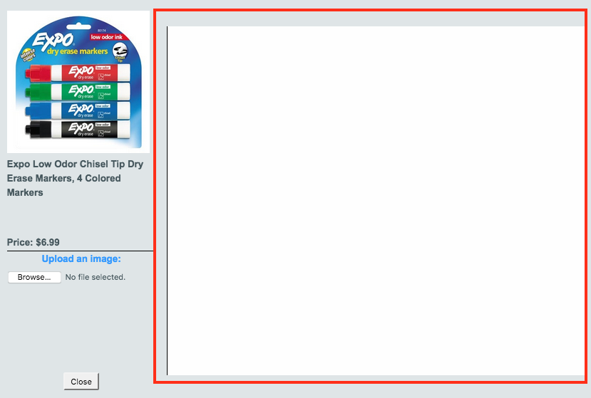

### Deploy Twitter Feed Microservice

- There are a few ways to create a new Kubernetes deployment. One way is to use the command line utility **kubectl**, which allows interactions with Kubernetes to be automated. In this demo lab, you will use the Kubernetes dashboard to do a one-off deployment of the **twitter-feed**. Open the dashboard tab in your browser and click **Create** in the upper right corner.

  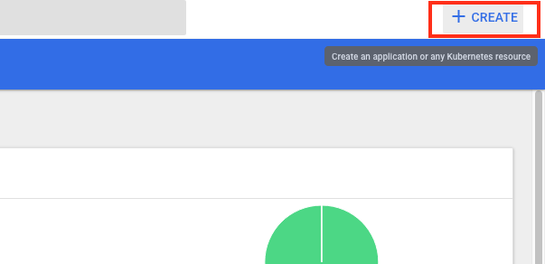

- The create feature allows you to specify the details of a deployment (or other resources) by pasting some text, uploading a file, or filling out a form. Today you will paste in some text that defines our twitter feed microservice. Click the **[https://raw.githubusercontent.com/oracle/learning-library/master/demo-labs/kubernetes/twitter-feed.yml](https://raw.githubusercontent.com/oracle/learning-library/master/demo-labs/kubernetes/twitter-feed.yml)** file to open it. **Select all of the text, copy it, and paste it into the text box** on the Kubernetes dashboard create dialog. Then click **Upload**.

  

  ********

  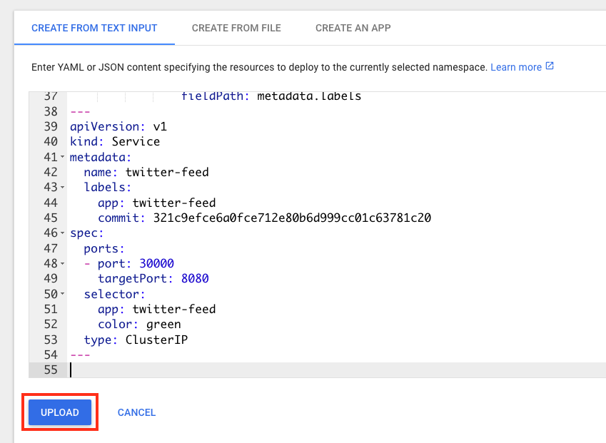

- You'll see a new deployment named **twitter-feed** added to the dashboard overview. Let's look at the details of the deployment while it is provisioning.


  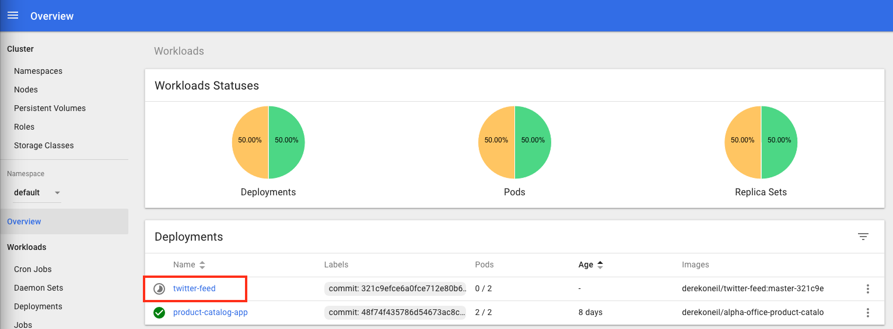


- Here is the whole YAML file that you uploaded to Kubernetes:

  ```
  apiVersion: extensions/v1beta1
  kind: Deployment
  metadata:
    name: twitter-feed
    labels:
      commit: 321c9efce6a0fce712e80b6d999cc01c63781c20
  spec:
    replicas: 2
    selector:
      matchLabels:
        app: twitter-feed
    template:
      metadata:
        labels:
          app: twitter-feed
          commit: 321c9efce6a0fce712e80b6d999cc01c63781c20
          color: green
      spec:
        containers:
        - name: twitter-feed
          image: derekoneil/twitter-feed:master-321c9efce6a0fce712e80b6d999cc01c63781c20
          imagePullPolicy: Always
          ports:
          - name: twitter-feed
            containerPort: 8080
            protocol: TCP
          volumeMounts:
            - name: podinfo
              mountPath: /tmp
              readOnly: false
        volumes:
          - name: podinfo
            downwardAPI:
              items:
              - path: "labels"
                fieldRef:
                  fieldPath: metadata.labels
  ---
  apiVersion: v1
  kind: Service
  metadata:
    name: twitter-feed
    labels:
      app: twitter-feed
      commit: 321c9efce6a0fce712e80b6d999cc01c63781c20
  spec:
    ports:
    - port: 30000
      targetPort: 8080
    selector:
      app: twitter-feed
      color: green
    type: ClusterIP
  ---
  ```

- Let's look at some of the sections in more detail:

  ```
  kind: Deployment
  metadata:
    name: twitter-feed
    labels:
      commit: 321c9efce6a0fce712e80b6d999cc01c63781c20
  ```
  - You are looking at a deployment object, and have provided metadata in the form of a name and labels.

  ```
  spec:
    replicas: 2
    selector:
      matchLabels:
        app: twitter-feed
        ```
    - The start of the deployment specification indicates that you want two twitter-feed pods (replicas) running at all times, and that this deployment should manage any pods with the label: "app: twitter-feed".

  ```
  template:
    metadata:
      labels:
        app: twitter-feed
        commit: 321c9efce6a0fce712e80b6d999cc01c63781c20
        color: green
        ```
    - Next you see the beginning of a (pod) template definition inside the deployment definition. You have given it some labels as well. One of those labels is "app: twitter-feed", so you know that any pods created by this template will be managed by this deployment (which is what we want). Note the "color: green" label, which can be used to facilitate Blue/Green deployments, which is a topic covered in the Container Native Development workshop.

  ```
  spec:
    containers:
    - name: twitter-feed
      image: derekoneil/twitter-feed:master-321c9efce6a0fce712e80b6d999cc01c63781c20
      imagePullPolicy: Always
      ports:
      - name: twitter-feed
        containerPort: 8080
        protocol: TCP
        ```
    - Finally you see the specification for the pods that this deployment will ultimately create. Here is where you define the Docker container image that the pods will run, as well as the ports that the application will need open.

    - The rest of the deployment spec deals with Volumes, which allow us to mount physical or virtual disks inside our pods.

  ```
  apiVersion: v1
  kind: Service
  metadata:
    name: twitter-feed
    labels:
      app: twitter-feed
      commit: 321c9efce6a0fce712e80b6d999cc01c63781c20
    ```
    - Following the deployment details you see two dashes, and then another specification, this time for a Service. This service has a name and some other metadata defined.

  ```
  spec:
    ports:
    - port: 30000
      targetPort: 8080
    selector:
      app: twitter-feed
      color: green
    type: ClusterIP
  ```
    - It also has a specification section that defines it. You can see that some port mapping is done to redirect traffic on port 30000 of the service IP to port 8080 of the pod IP (where our application is listening). The selector section tells the service which pods make up this service, in this case only ones with both the labels "app: twitter-feed" and "color: green". It also specifies that this service is of type ClusterIP, meaning that it is only accessible from inside the Kubernetes cluster. This is ok, since only the product catalog application needs to invoke it.

- **Refresh** the Kubernetes dashboard browser tab. In the **Pods** table, you should see two new pods whose names begin with twitter-feed. **Click on the name** of either one to view the details.

  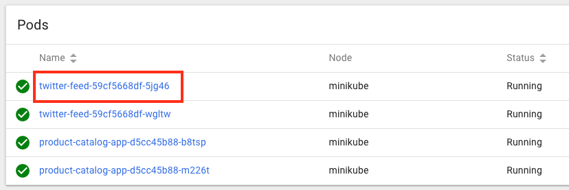

- Note that on the details page you see all of the labels that you saw in the pod template spec, as well as all of the events that this pod has triggered. Let's make sure our twitter feed is functioning properly. Click the **Exec** button in the top menu bar.

  

- The Exec function opens a shell into the pod that you were just inspecting, which allow you to test and debug directly inside the Docker container. Run the following command to invoke the local Java web server that hosts the twitter feed:

  **NOTE:** You may need to use ctrl-shift-v to paste. Alternatively, you can use the mouse-driven browser menu to paste the command.

  `curl -s $HOSTNAME:8080/statictweets | head -c 100`

- You should see some JSON data being returned by the twitter feed service. Your microservice has been deployed successfully! Let's see if it shows up in the product catalog.

  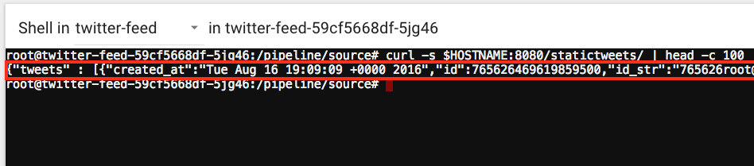

### Revisit Product Catalog Microservice

- Switch to the product catalog browser tab and click **Close** if you still have a product detail window open. Then **click on any product image** to try loading some twitter data.

  

- Looks like the product catalog is able to pull data from the twitter feed microservice successfully. But how did it know how to find the twitter-feed pods? The answer is the twitter-feed service that you created along with your deployment.

  

- The product catalog application uses the following JavaScript code to make an HTTP request to the twitter feed microservice:

  ```javascript
  request('http://twitter-feed:30000/statictweets/color', function (error, response, body) { ... });
  ```

- The product catalog app makes use of Kubernetes DNS to resolve the service name (twitter-feed) into its IP address. Kubernetes DNS assigns a DNS name to every service defined in your cluster, so any service can be looked up by doing a DNS query for the name of the service. Recall that 30000 is the service port that will be forwarded to port 8080 on our pods. This setup allows us to reference constant service names in our code that get resolved by the cluster into a running pod IP address, no code changes required.


### Scale Out Product Catalog Microservice

- One of the major benefits to containerizing your application is the ease of scaling it out or in to accommodate demand. You will scale out your product catalog application.

- Switch to the Kubernetes dashboard tab in your browser. Click on the **product-catalog-app** deployment.

  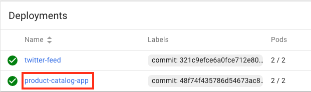

- In the **New Replica Set** table, look in the Pods column to see how many instances of the application are currently running. 2/2 means you have two currently running and that you have requested 2 total.

  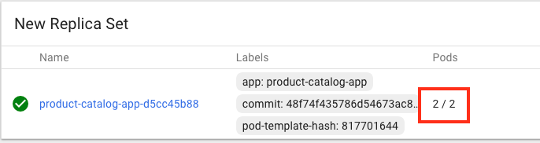

- Click the **Scale** button in the menu bar in the top right.

  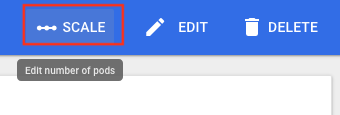

- Change the **Desired number of pods** to **5** and click **OK**

  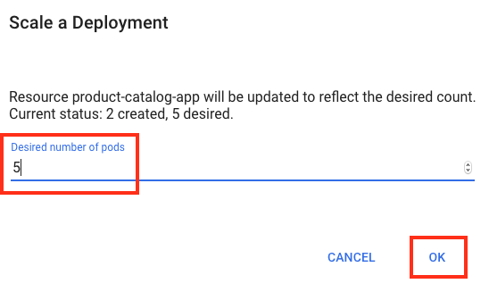

- You'll see that the **Pods** column of the Replica Set has changed to 2/5. Kubernetes will deploy 3 more pods to satisfy the new replica set definition.

  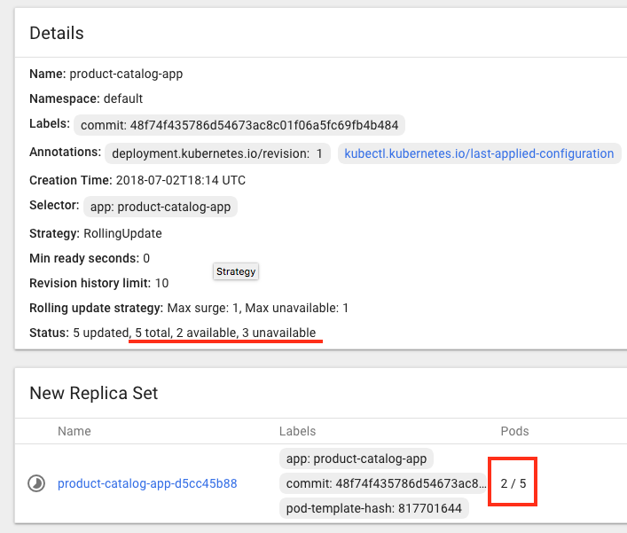

- Refresh the page and you should see that you now have 5/5 pods available. Since Kubernetes had already downloaded the container image, creating new pods is a very fast process.

  

- Kubernetes provides built-in features to scale out/in pods automatically (called Horizontal Pod Autoscaling). You can scale based on CPU utilization or other application-specific metrics. Autoscaling allows you to more efficiently manage cluster resources when application traffic patterns fluctuate over time, due to seasonal spikes in usage, for example. Using the Kubernetes API, you can also create your own scaling logic that alters your deployments based on metrics outside of the cluster, such as historical usage data or weather patterns.

### Next Steps

- You worked with pre-built docker containers and a pre-installed Kubernetes cluster today. To learn how to start from bare VMs and source code, join us for a virtual, in-person, or self-service workshop where you explore container native development in depth. Check out the [Container Native Development Workshop](https://go.oracle.com/LP=65991?elqCampaignId=139312&src1=:ex:tb:::RC_NAMK180927P00041:KubernetesDemoLab&SC=:ex:tb:::RC_NAMK180927P00041:KubernetesDemoLab&pcode=NAMK180927P00041) to learn more.
