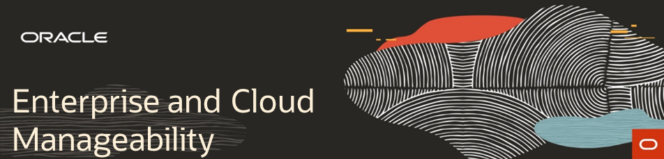

  

# Welcome to Oracle Enterprise and Cloud Manageability Labs

These labs are designed so each section can be done independently. Please look for the order of execution reccomended by your instructor when attending a roadshow workshop. Note: there are a number of assumptions associated and documented for these labs. Please pay attention to those.

PLEASE DO NOT EXPORT OR DELETE THE EM CUSTOM IMAGE - IT WILL REMOVE IT FOR EVERYONE

## General Oracle Cloud Lab Prerequisites
-  Cloud Account or Free Tier Account
-  Putty (Windows users)
-  Google Chrome 

## Enterprise Manager Labs 

1. [Lifecycle Management for PDBs](enterprise_manager/em_db_lifecycle_automation.md)
2. [Find, Fix, and Validate](enterprise_manager/em_find_fix_validate.md)

## Oracle Management Cloud Labs 
3. [Proactive Database Performance Management with IT Analytics](management_cloud/pro_dbperf_ita.md)
4. [Log Analytics for Database Troubleshooting and Root-Cause Analysis](management_cloud/log_analytics_of_databases.md)

