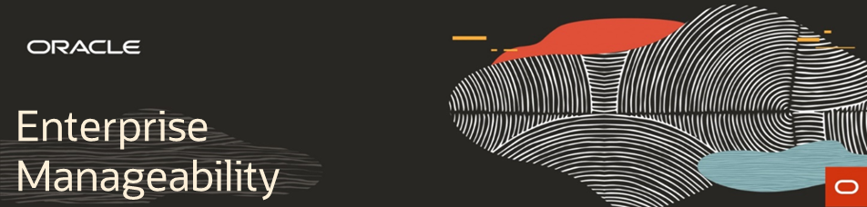

  

# Welcome to Oracle Manageability Labs

These labs are designed to be executed in sequence. There are a number of assumptions associated with these labs that are documented.  Please pay attention to those assumptions.

## Overall Cloud Lab Prerequisites
-  Cloud Account or Free Tier Account
-  Docker Account (hub.docker.com)
-  Putty (Windows users)
-  Google Chrome with JSON Formatter Plugin
-  Familiarity with VI

## Enterprise Manager Labs 
1. [EM Environment Setup](enterprise_manager/em_workshop_setup.md)
2. [Lifecycle Automation](enterprise_manager/em_db_lifecycle_automation.md)
3. [Find, Fix, and Validate](enterprise_manager/em_find_fix_validate.md)

