Introduction
============

>   The objective of this lab is to become familiar with Oracle Enterprise
>   Manager Cloud Control 13c’s Database Lifecycle Management capabilities and
>   ability to move to the cloud using Oracle Multitenant Database. You will
>   learn how to request a pluggable database for testing purposes and perform
>   lifecycle operations like clone, unplug etc. You will set up a private cloud
>   for PDB’s, provision, resize and deleting a PDB using a self-service option.

>   Applicable User Roles in the Organization

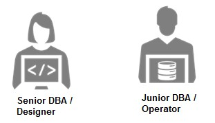

=============================================================

Lab Table of Contents
=================

-   1.1 [Requesting a Pluggable Database
    (PDB)](#create-pluggable-oracle-database)

-   1.3 [Un-Plug a Pluggable Database and then Plug
    it](#un-plugplug-an-existing-pluggable-oracle-database-pdb) back (create
    from unplugged)

-   1.3 [Creating Pluggable Database PDB Full
    Clone](#clone-an-existing-pluggable-oracle-database-pdb)

-   1.4 [Compliance for PDB](#compliance-management-for-pdb)

-   2.1 [Use Self- service to request a PDB using
    PDBaaS](#self-service-to-request-pdb-using-pdbaas) (Private Cloud)

-   2.2 [Administrative Setup for
    PDBaaS](#administrative-setup-for-pdb-as-a-service-private-cloud) (Private
    Cloud)

Hands on Lab Activities
=======================

>   The estimated time to complete the lab exercise is between 50-60 minutes.

| **No** | **Feature**                                                                | **Approx. Time (min)** | **Details**                                                                                                                                                                      | **Value proposition**                                                                                                                                                                                                                   |
|--------|----------------------------------------------------------------------------|------------------------|----------------------------------------------------------------------------------------------------------------------------------------------------------------------------------|-----------------------------------------------------------------------------------------------------------------------------------------------------------------------------------------------------------------------------------------|
| 1.1    | Requesting a Pluggable Database (PDB)                                      | 10                     | Creation Pluggable database (PDB’s) within a CDB and run a post-script to lock/unlock accounts.                                                                                  | Create multiple PDB’s with few clicks while making sure they follow organization’s standards by using automated post-scripts.                                                                                                           |
| 1.2    | Un-Plug a Pluggable Database and then Plug it back (create from unplugged) | 10                     | Un-plug a PDB and later Plug it back in a CDB when needed                                                                                                                        | Unplug a PDB when not needed and plug it back as per need hence maximizing resource utilization in your organization.                                                                                                                   |
| 1.3    | Creating Pluggable Database PDB Full Clone                                 | 5                      | Create multiple copies (Clones) of a PDB to dev/test purpose                                                                                                                     | Create multiple PDB’s clones for Dev/test with few clicks while making sure they follow organization’s standards by using automated post- scripts.                                                                                      |
| 1.4    | Compliance for PDB                                                         | 10                     | Apply a compliance standard on PDB and use corrective action to fix the violation                                                                                                | Make sure PDB’s comply with compliance standards and fix them with a click of a button of there is any anomaly.                                                                                                                         |
| 2.1    | Use Self- service to request a PDB using PDBaaS (Private Cloud)            | 10                     | Request PDB pluggable database using Service Catalog. Resize the PDB and then Delete the PDB while preserving the contents.                                                      | Review self-service option to provision PDB, which only requires minimal inputs.                                                                                                                                                        |
| 2.2    | Administrative Setup for PDBaaS (Private Cloud)- Review only               | 10                     | An overview of the administrative setup involved for PDBaaS which includes setting up a PaaS Infrastructure Zone, Pluggable Database Pool, Data Sources, Service Template, etc., | Setup private cloud using Enterprise Manager where admin can define resources and EM’s placement algorithm makes sure that resources are utilized to their best. It is complimented by metering, and show back/chargeback capabilities. |

>   Easily upgrade PDB’s with few clicks by moving from one container to
>   another.

**Know your environment**
=========================

>   This is a self-sufficient environment with Enterprise Manager 13.3 as well
>   as all Database targets running on a single Virtual Machine.

| **OMS URL**          | https://\<public Ip address\>:7803/em                        |
|----------------------|--------------------------------------------------------------|
| **EM Credentials**   | Username: sysman Password: welcome1                          |
| **Database (CDB)**   | CDB186 (18.8)                                                |
| **DB Credentials**   | Name Credential as specified in use case or use sys/welcome1 |
| **Host Credentials** | Login as OPC user using your private key                     |
| **Startup Scripts**  | All scripts are in /home/oracle                              |

>   Self –Service User:

>   Username: CYRUS Password: welcome1

>   Sales (18.3)

>   Login to root if needed: sudo –s (from opc user)

>   Login to oracle if needed:

>   su – oracle (password : Commit12\#)

1.1 Create Pluggable Oracle Database
====================================

1.  Log into your Enterprise Manager VM using the IP provided on your cheat
    sheet. The Enterprise Manager credentials are “**sysman/welcome1**”.

2.  **Navigate** to the “Enterprise menu \> Provisioning and Patching \>
    Database provisioning”.

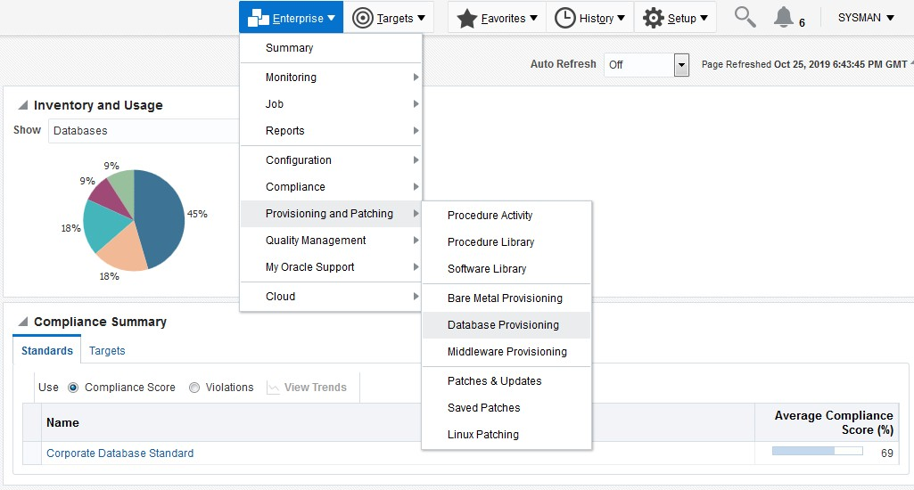

3.  In the Database Provisioning page, in the Related Links section of the left
    menu pane, **click** “**Provision Pluggable Databases**”

4.  In the Provision Pluggable Database Console, in the **Container Database**
    section, **select** the CDB (**CDB186 – 18.8 version**) within which you
    want to create new PDBs.

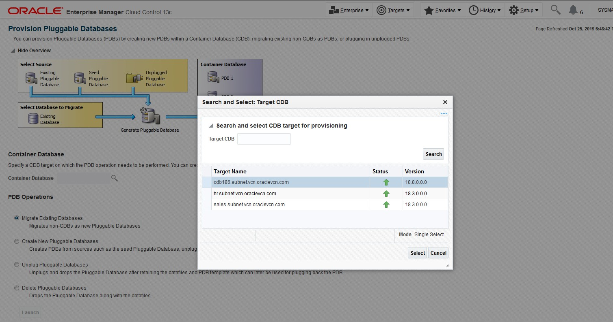

5.  In the PDB Operations section, **select** Create Pluggable Databases ,
    **Click** Launch

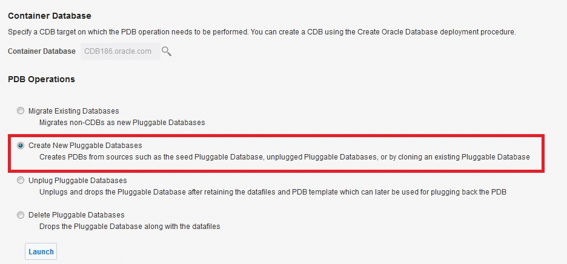

6.  Use the named credentials (CDB186_SYS) for login

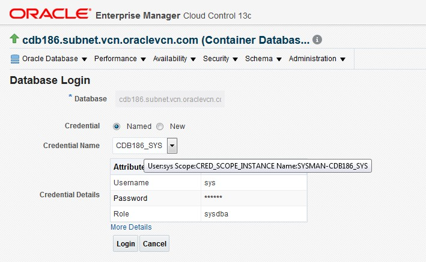

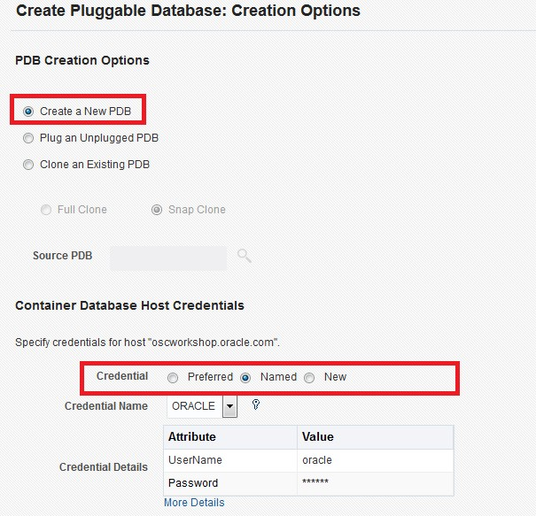

In the Source page of the Create Pluggable Database Wizard, in the Source Type
section, **select** Create a new PDB . **Select** Named credentials “ORACLE”

>   .

7.  In the Identification page, **enter** a unique name for the PDB you are
    creating (your initial_pdb). **Optionally**, **select** check box to “create
    multiple DBs” and put **2** as number of copies.

8.  In the PDB Administrator section, **enter** the credentials of the admin
    user account you need to create for administering the PDB.

**UserName**: pdbadmin **Password**: welcome1 **Click** Next.

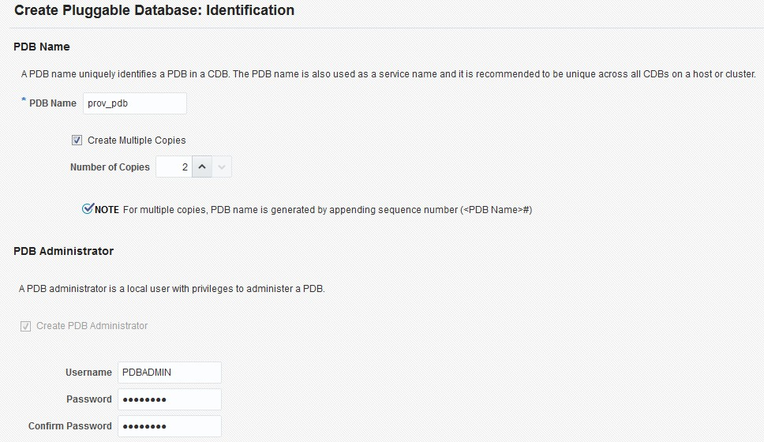

9.  For storage option, **select** “Use Common Location for PDB Datafiles” and
    leave defaults as-is.

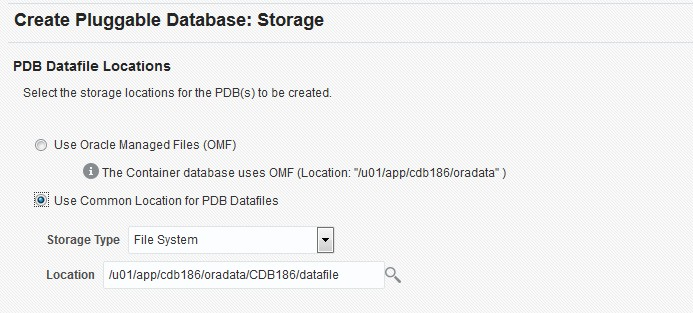

Optionally, you may also want to select a post-script, which will run post
creation of PDB. Choose “Select from software library” and then search for
“**unlock**” and select unlock.sql (Or you can upload a SQL file from your
system).

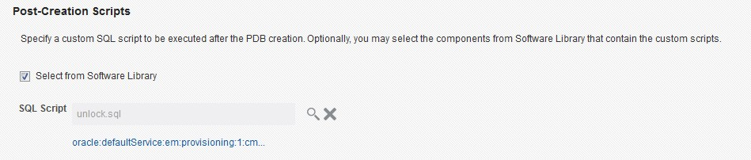

10.  In the Schedule page, **select** immediately check box next to Start.
    **Click** Next**.**

11.  In the Review page, review the details you have provided for the deployment
    procedure. If you are satisfied with the details, click Submit. You can now
    click on View Execution Details link to see details.

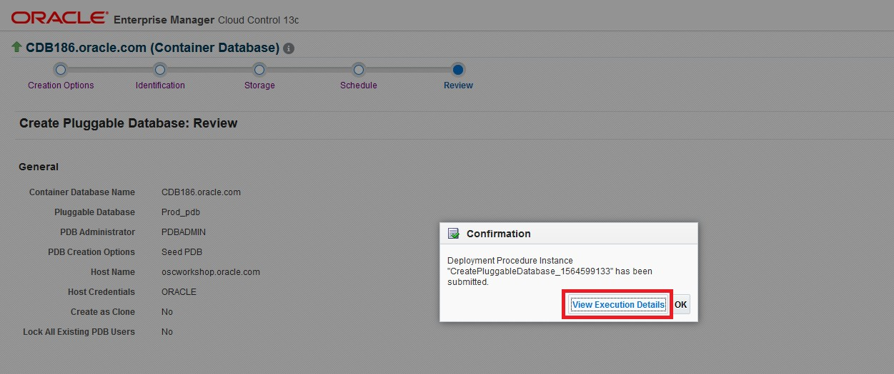

12.  In the Procedure Activity page, view the status of the procedure.

Click the Status link for each step to view the details of the execution of each step.
--------------------------------------------------------------------------------------

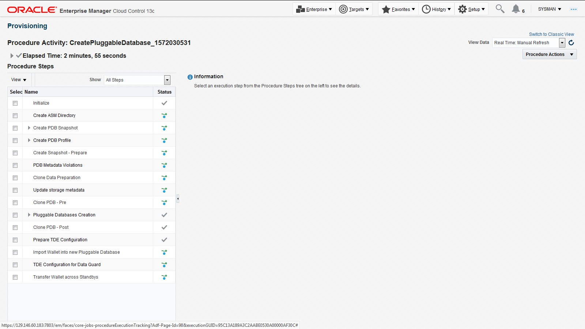

Once the procedure is completed (takes about 3-5 mins), you can **Navigate to
Targets \> Databases, Click on CDB186** and you will see the newly created PDB

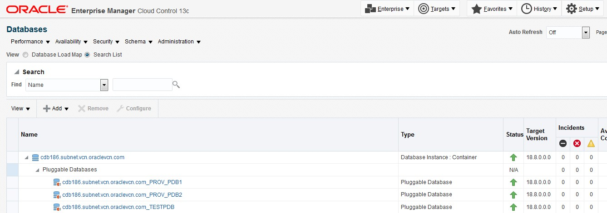

1.2 Un-plug/Plug an existing Pluggable Oracle Database (PDB)
============================================================

1.  **Navigate** to the “Enterprise menu \> Provisioning and Patching \>
    Database provisioning”.

2.  In the Database Provisioning page, in the Related Links section of the left
    menu pane, **click** “**Provision Pluggable Databases**”

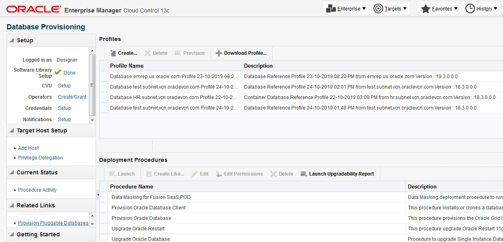

3.  In the Provision Pluggable Database Console, in the Container Database
    section, **select** the CDB (**CDB186**) within which you want to create new
    PDBs.

4.  In the PDB Operations section, **select Unplug** Pluggable Databases ,
    **Click** Launch

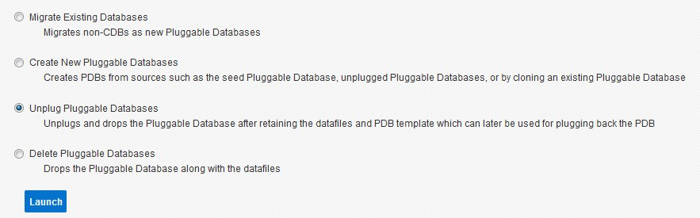

5.  In the **Select** PDB page of the Unplug Pluggable Database Wizard, in the
    Select Pluggable Database section, select the PDB you want to unplug. Also
    **Select** Named credentials “ORACLE”

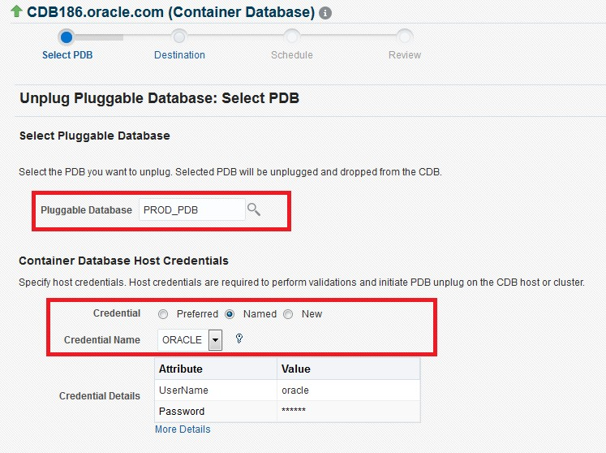

6.  In the Destination page, select the type of PDB template you want to
    generate for unplugging the PDB, and the location where you want to store
    it. The PDB template consists of all datafiles as well as the metadata XML
    file.

**Select** radio button for software library. **Select** Generate PDB archive.

**Enter** /tmp in location under Temporary working directory

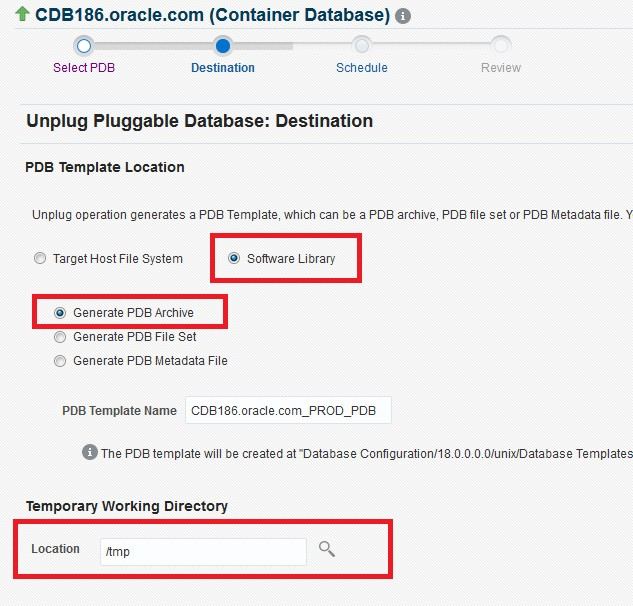

7.  In the Schedule page,

**Select** immediately check box next to Start. **Click Next.**

8.  In the Review page, review the details you have provided for the deployment
    procedure. If you are satisfied with the details, click Submit.

9.  In the Procedure Activity page, view the status of the procedure.

10.  You can **Navigate to Targets \> Databases,** Click on CDB186 and you will
    see the PDB you unplugged is no longer in the list.

Let us continue to next steps and plug the same PDB back into the container database.
-------------------------------------------------------------------------------------

11.  Navigate to the “Enterprise menu \> Provisioning and Patching \> Database
    provisioning”.

12.  In the Database Provisioning page, in the Related Links section of the left
    menu pane, **click** Provision Pluggable Databases

13.  In the Provision Pluggable Database Console, in the Container Database
    section, **select** the CDB (**CDB186**) within which you want to create new
    PDBs.

14.  In the PDB Operations section, **select** Create Pluggable Databases ,
    **Click** Launch

15.  In the Source page of the Create Pluggable Database Wizard, in the Source
    Type section, select **Plug an unplugged PDB**. **Select** Named credentials
    “ORACLE”

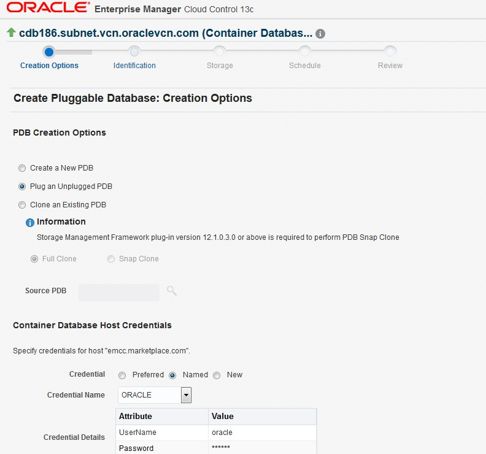

16.  In the Identification page, enter a unique name for the PDB you are plugging
    in.

17.  **Select** Create As Clone to ensure that Oracle Database generates unique
    PDB DBID, GUID, and other identifiers expected for the new PDB.

**Enter** PDB name like “clone_pdb”.

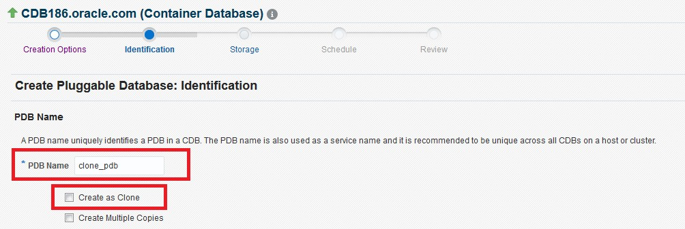

18.  **Note**: We will keep pdbadmin as a default admin. So, don’t select
    anything in this section.

19.  In the PDB Template Location section: **Select** “Software Library” radio
    button.

>   **Click** on the magnifier icon placed on Location text box. **Select** the Name
>   which you created During Unplug **Click** Next

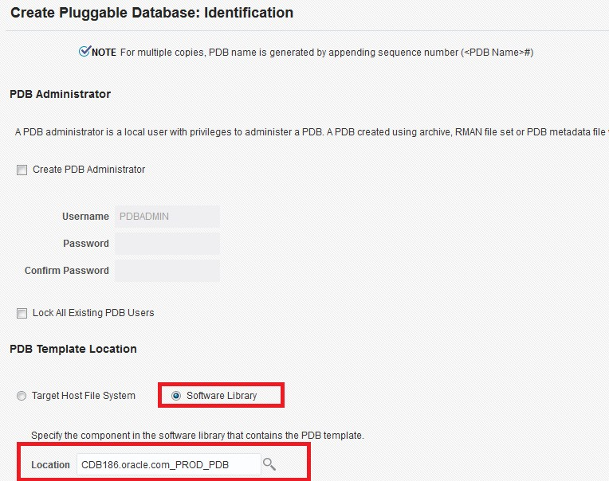

20.  **Select** “Use Common Location for PDB Datafiles” and use **/tmp as
    temporary working directory.**

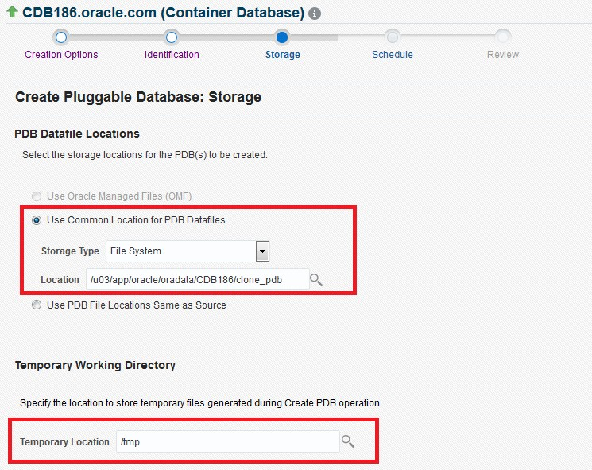

21.  In the Schedule page, **select** immediately check box next to Start.
    **Click** Next.

22.  In the Review page, review the details you have provided for the deployment
    procedure. If you are satisfied with the details, **click** Submit. You can
    now click on View Execution Details link to see details.

23.  In the Procedure Activity page, view the status of the procedure.

Optionally**, Click** the Status link for each step to view the details of the
execution of each step. Once the procedure is completed, you can **Navigate to
Targets \> Databases,** Click on CDB186 and you will see the newly created PDB

Note: You do not have to wait until the steps complete and move on to the next section.
---------------------------------------------------------------------------------------

1.3 Clone an existing Pluggable Oracle Database (PDB)
=====================================================

1.  **Navigate** to the “Enterprise menu \> Provisioning and Patching \>
    Database provisioning”.

2.  In the Database Provisioning page, in the Related Links section of the left
    menu pane, **click** Provision Pluggable Databases

3.  In the Provision Pluggable Database Console, in the Container Database
    section, **select** the CDB (**CDB186**) within which you want to create new
    PDBs.

4.  In the PDB Operations section, **select** Create Pluggable Databases ,
    **Click** Launch

5.  **Select** clone PDB and select source as CDB186 (if you choose any other
    CDB, this operation might fail). Please keep Database link box empty.

>   Select named credentials “ORACLE”, **Click** Next.

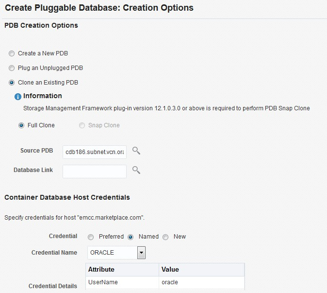

6.  **Enter** new PDB name

7.  **Select** “Use Common Location for PDB Datafiles” in the Source page of the
    Create Pluggable Database Wizard, please enter **/tmp** in temporary working
    directory

Optionally, you can select the postscript as we did in the creation flow.
**Click** Next

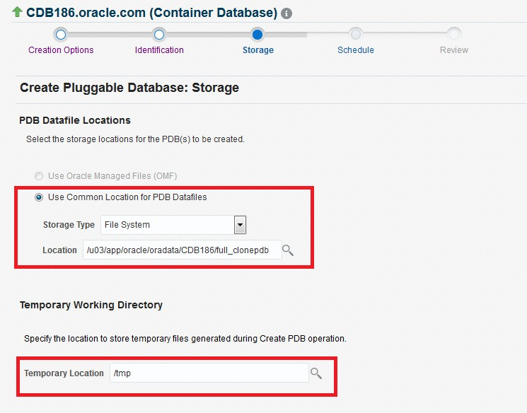

8.  In the Schedule page, **select** immediately check box next to Start.
    **Click** Next.

9.  In the Review page, review the details you have provided for the deployment
    procedure. If you are satisfied with the details, click Submit. You can now
    click on View Execution Details link to see details.

10.  In the Procedure Activity page, view the status of the procedure.

Click the Status link for each step to view the details of the execution of each step.
--------------------------------------------------------------------------------------

>   Once the procedure is completed, you can **Navigate** to Targets \>
>   Databases**, Click** on CDB186 and you will see the newly created PDB

1.4 Compliance Management for PDB
=================================

>   Now database administrator applies a Corporate Standard on the newly created
>   PDB database, which results in a “Violation”. Then, the DBA fixes the issue
>   using corrective actions. Let us examine how a DBA applies the fixes in the
>   following steps.

Click Click Compliance Click Library

1.  Click Compliance Standards tab Choose the row “Corporate Database
    Standard” Click

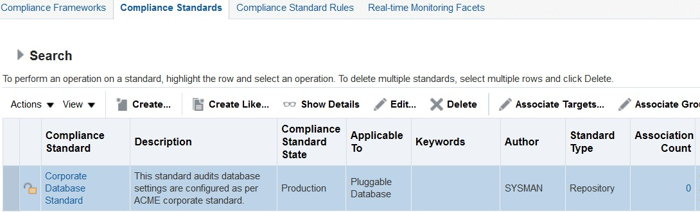

2.  Click OK button

3.  In the Save Association box Click Yes button

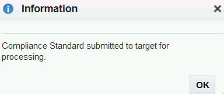

Click OK button

4.  You have to refresh PDB statistics to see notifications, To refresh PDB
    database, 

    1.  click

        

        Click Databases Click View Click Expand All

    2.  Right click on PDB Click Oracle Database Click Configuration Click
        Latest

>   Click Refresh icon on the page(it will take few minutes for refresh to
>   complete)

1.  Click

    

    Click Compliance Click Results

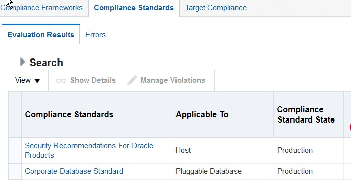

Click Corporate Database Standard under Compliance Standards

1.  You will see the following screen as shown below

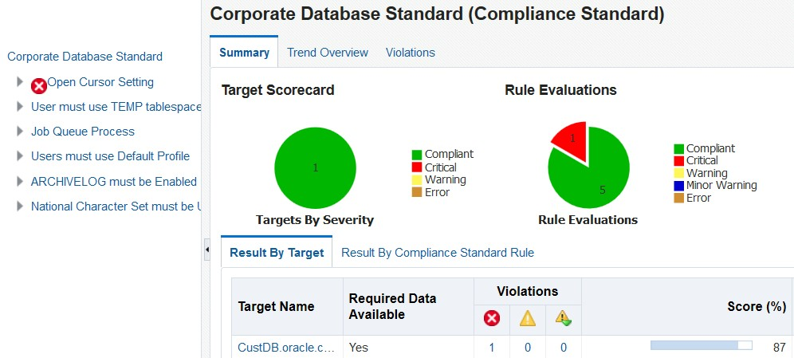

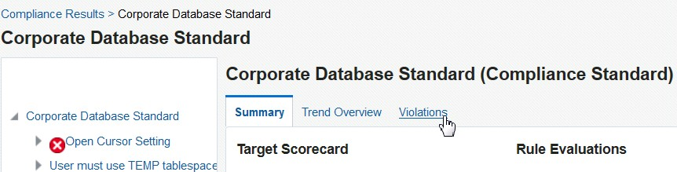

Click Violations link and then click on one of the Open Cursor Setting lines

1.  You will see open cursors notification Scroll down if needed Click on
    the link “Submit from Library” for corrective action.

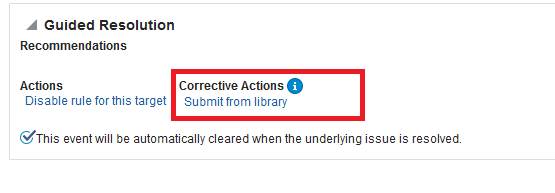

1.  Choose “FIX OPEN CURSOR” corrective action from the pop-up

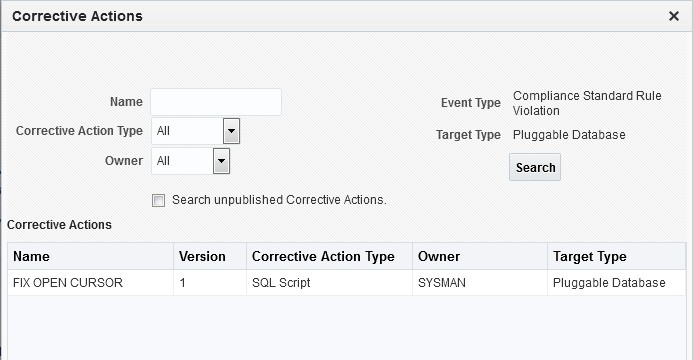

1.  Choose the Named Credentials for Database and Host Click Submit button

    1.  Named Credentials for Database: OEM_SYS (scroll down after Database
        Credentials to see Host Credentials

    2.  Host Credentials: ORACLE_HOST

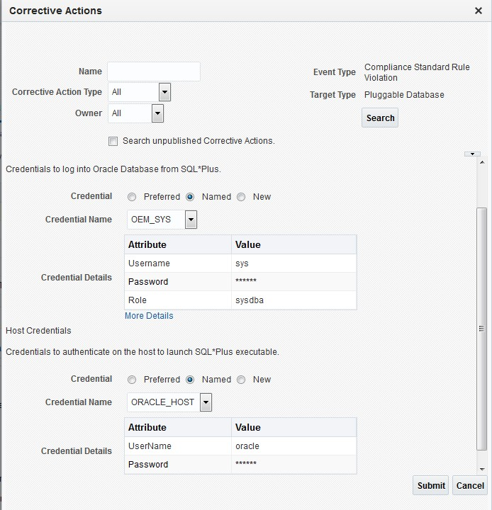

1.  You will see an popup as shown below Click on the link “Click here to view
    the execution details”

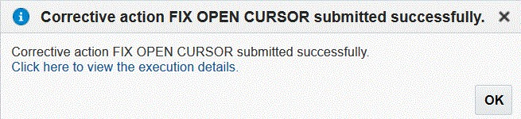

>   Click on refresh icon if the job did not complete. The job will take about a
>   minute to complete 

>   You will see the status change to Succeeded

1.  Once the status changes to Succeeded Click Click Databases Click View
    Click Expand All Click on Your PDB that you choose in earlier step .

2.  Under Administration drop down Click Initialization Parameters

3.  Scroll down You will see the “open_cursors” initialization parameter set
    to 300 as shown below

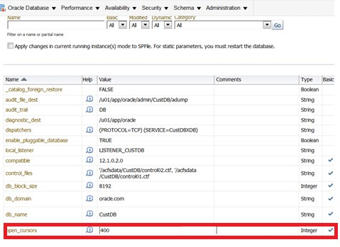

>   Now that you have gone through the various life cycle operation on PDB, we
>   would switch focus and cover the use case of building a private cloud using
>   Enterprise Manager and see how easy and quick it is to provision (with
>   minimal inputs) and manage PDB using PDB-as-a-service (PDBaaS)

2.0 Self-Service to request PDB using PDBaaS
============================================

>   With the Self-Service Portal, cloud users can request a Pluggable Database
>   through a simple process, monitor resource consumptions, and manage the
>   pluggable database through an intuitive graphical user interface.

>   Expiry time is provided while requesting the PDB instance and PDB is
>   automatically deleted based on the expiry time.

1.  Login into Enterprise Manager as a Self-Service User. Self-Service User
    credentials are:

CYRUS/welcome1
--------------

1.  By default, you will see the Database Cloud Self Service Portal landing page
    as shown below.

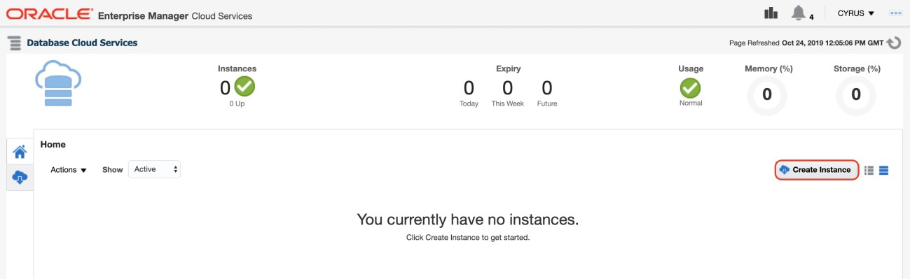

Click “Create Instance” button and then click on Select icon for “**Provision
New Empty Pluggable Database**”

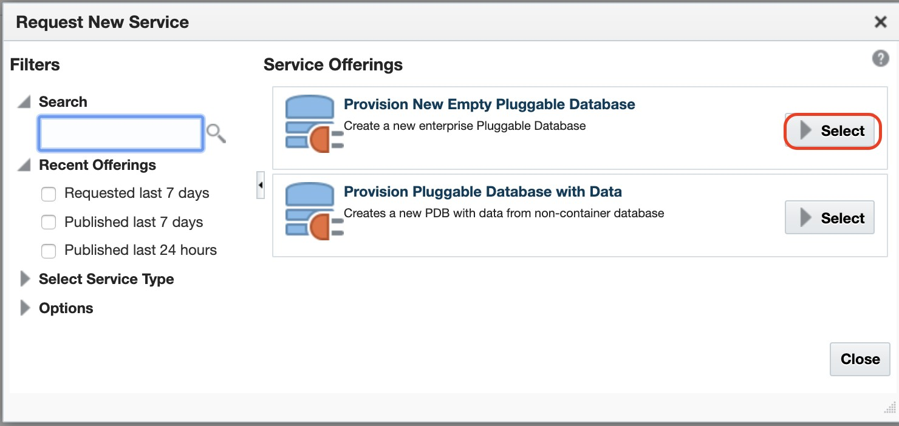

Note: There are two service templates pertaining to Pluggable Database
----------------------------------------------------------------------

-   **Provision New Empty Pluggable Database**

    -   This template allows user to create a new pluggable database in a
        container database configured by DBA

-   Provision Pluggable Database with Data

-   This template allows user to create a new pluggable database with data from
    non-container database.

1.  In the “**Pluggable Database Configuration**” section, enter Service and SID
    details :

2.  Name: YOUR INITIALS_PDB2 (e.g. AS_PDB2)

3.  Database Service Name**: SERVICE_YOUR INITIALS_PDB2 (e.g. SERVICE_AS_PDB2)**

4.  Workload Size: Choose **Small**

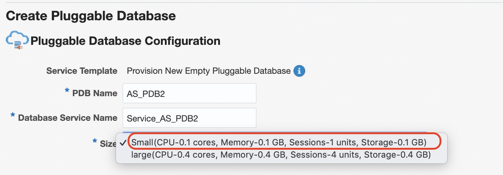

1.  Enter Credentials details in the “**Pluggable Database Administrator
    Account**”

2.  Administrator Name: **PDBADMIN**

3.  Password: **welcome1**

4.  Confirm Password: **welcome1**

5.  (Tablespaces): **Accept default**

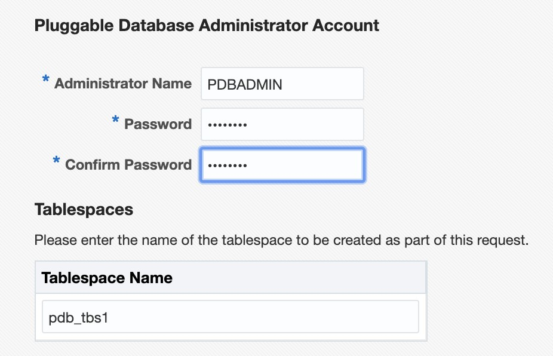

1.  Instance Details

    1.  Keep all defaults as they are

2.  Properties

    1.  Enter properties for instance. Self-Service Administrator has configured
        this as a optional step. However, properties help users find instances
        quickly. Enter

        1.  Contact: **CYRUS**

        2.  Lifecycle Status: **Test**

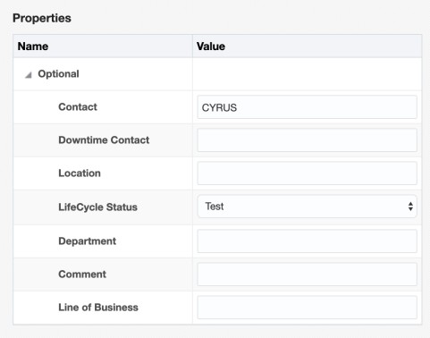

1.  Instance Duration

    1.  (Instance Duration) Start: Accept default (Immediately)

    2.  (Instance Duration) Duration: Specify duration of 4 hours from the
        current time by selecting the “Until” radio button, changing to current
        date and specify time 4 hours from the current time

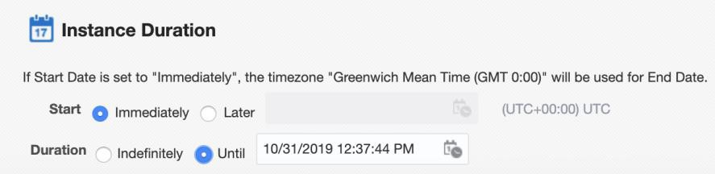

1.  Click on Submit button

>   What do these options represent? In most cases the PDBaaS options are
>   self-explanatory.

>   The self-service user should be able to provision a PDB by entering minimal
>   information.

>   Fields with an ‘\*’ represent mandatory input fields. Please refer to the
>   table listed below for a description of each option:

Note
----

| **Field**                   | **Description**                                                                                                                                                                                                                                                                                    |
|-----------------------------|----------------------------------------------------------------------------------------------------------------------------------------------------------------------------------------------------------------------------------------------------------------------------------------------------|
| Request Name                | By default, it is the Self-Service User Requestor name with timestamp. This field can be modified                                                                                                                                                                                                  |
| Zone                        | The Zone is a PaaS Zone that represents hosts/vm, where the PDB database will be deployed for this request. The zones are configured by the administrator. Self-service user need not know the host or platform details.                                                                           |
| PDB Name                    | Required input. PDB database with user defined will be created for the container database                                                                                                                                                                                                          |
| Database Service Name       | The user defined prefix for the database service or alias for this self-service PDB. The rest of the service name will be system generated and will be associated with a database resource management plan.                                                                                        |
| Workload Size               | The resources allocated to the Database Service. The database resource management plan is derived from this option. You can configure multiple workload sizes. Each service template will contain unique workload sizes. This typically depends on the roles assigned to self-service user.        |
| Schedule Request            | Self-service user has the ability to create a PDB database immediately or choose to create at a later time. In this lab exercise, the administrator has defined a policy, so a self- service user has to specify time duration. The PDB database will be automatically deleted after the duration. |
| Administrator Name/Password | A database user with required administrative privileges will be created on the provisioned PDB. A self-service user will be able to administer the PDB database by logging in as this database user.                                                                                               |

1.  Once you submit a request, you will be redirected back to the “**Database
    Cloud Services**” Page. Your PDB creation request has been submitted to
    Enterprise Manager for execution. Under “**Requests**” region, you should
    see 2 requests: “**Create**” and “**Delete**” request

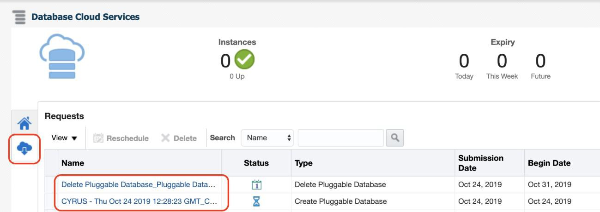

1.  At this point, provisioning engine has received a request to create a PDB
    based on the service template and input provided by self-service user.

2.  You will also notice the delete operation is scheduled for future (not
    started yet) time. Click on the **hourglass** icon under Status column for
    the Create Pluggable Database step. You will see details of request.

>   It will perform the following actions:

1.  Create database roles and PDB

2.  Create a resource plan based on the workload size

3.  Create and register the database

4.  The request should take less than 10 minutes to complete. Click on refresh
    icon or in the alternative set Refresh to 30 seconds. The success status
    indicates that PDB database was successfully created. The new PDB database
    should be visible under Database Cloud Services page.

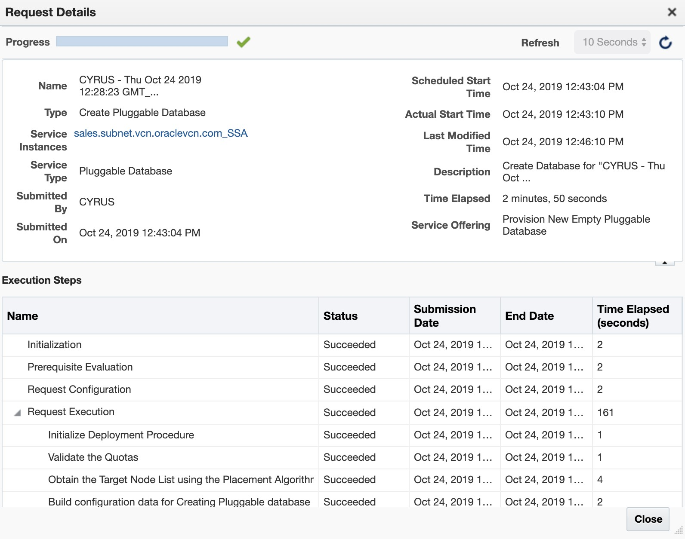

1.  Click on Close button. You will see the following under Requests section.

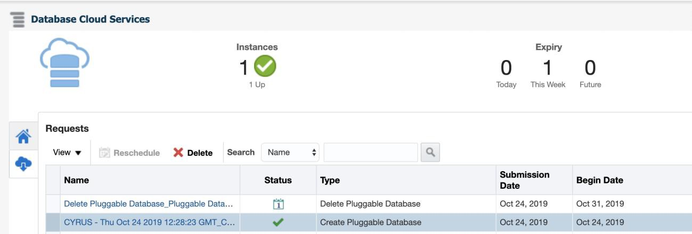

1.  Click on the Home Icon. You will see new PDB instance.

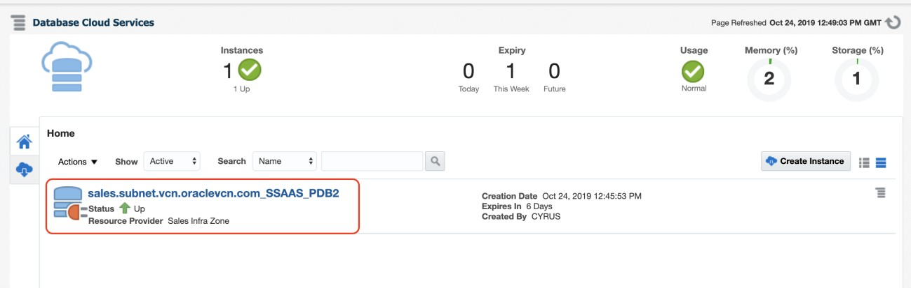

Note
----

>   Following widgets are shown on the Database Cloud Services landing Page

>   **Instances** show the number and status (Up/Down) of the DB/PDB Instances
>   provisioned by the self-service user.

>   **Expiry**, shows the expiration summary of DB/PDB Instances.

>   **Usage**, resource usage status for the Self-Service user, status of the
>   resource consumption for this user.

>   **Memory**, current memory consumption against the Quota for this user.

>   **Storage**, current storage consumption against the Quota for this user.

1.  Click on the name of the PDB.

You can use the connection details to connect to the PDB using SQL tools.

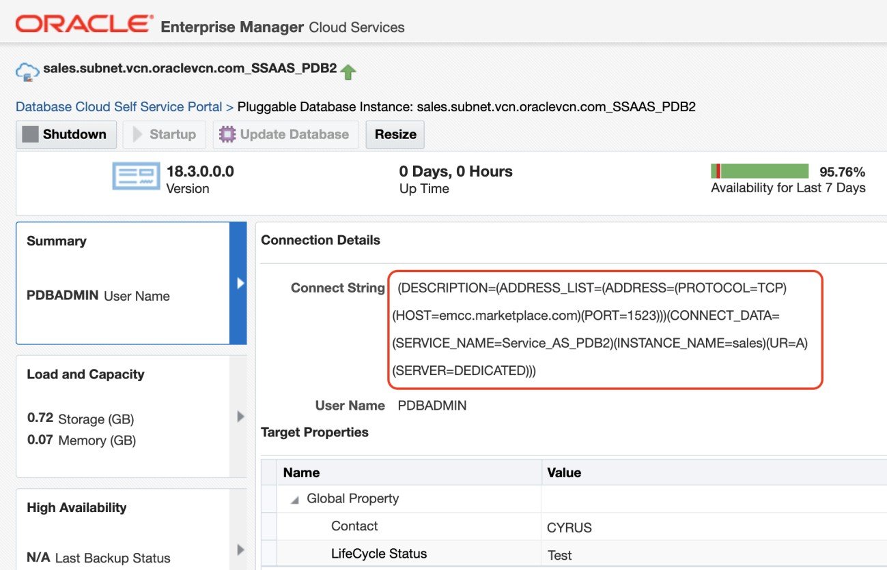

1.  Click on **Resize** button to resize PDB instance.

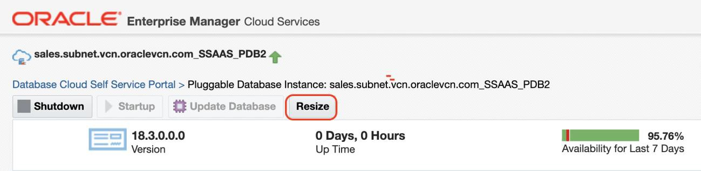

>   Resize allows you to resize your instance to other available resource sizes.
>   We have 2 resource sizes available for Service Template. Both are displayed.
>   Current size of PDB instance is Small, you can now resize it to large.

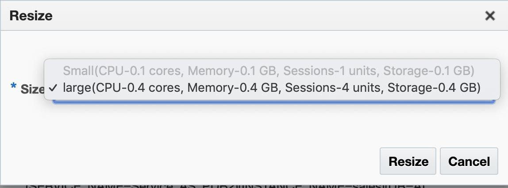

>   One you click on **Resize**, a job will be submitted to resize instance. In
>   few minutes instance resize is completed.

>   Expand **Resource Usage** section on PDB Home page. This shows now new
>   resource usage limits.

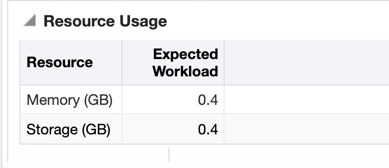

1.  Delete the DB Instance:

    1.  Go to the Database Cloud Services Home page by clicking on **Database
        Cloud Service Portal link**

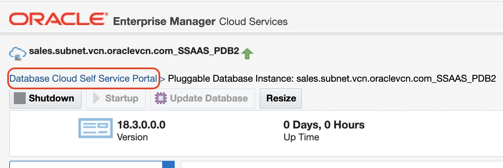

1.  Click on the action menu for new PDB and delete this instance.

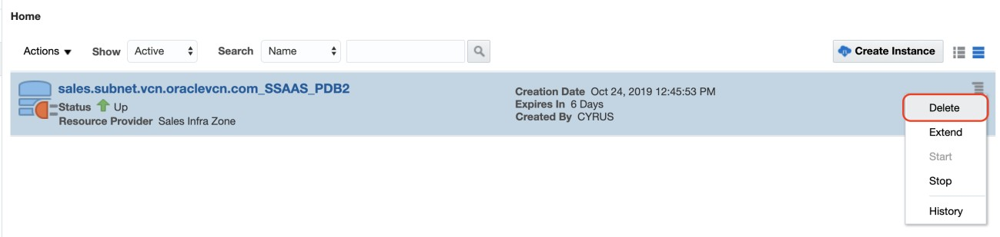

>   While deleting instance you can preserve a backup of the instance and create
>   a new instance using this backup.

>   To store backup of this instance, select check-box: **Preserve a backup of
>   this instance**

>   Click OK. You will see confirmation to delete the instance.

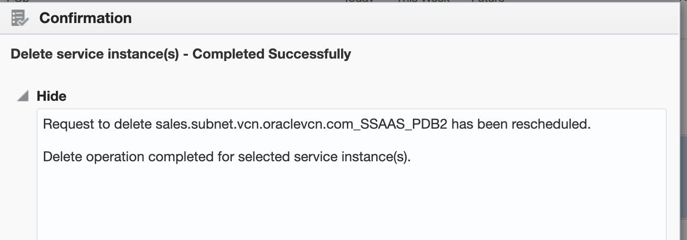

2.1 Administrative setup for PDB-as-a-Service (Private Cloud)
=============================================================

>   Previous exercises demonstrated the process of requesting PDBs using
>   available service templates as done by a Self-Service user. In this section,
>   we will see the Administrative setup for PDBaaS.

>   Login to EM Console as super administrator **sysman/welcome1**

PaaS Infrastructure Zone
------------------------

>   On the EM Console, go to Setup -\> Cloud -\> Database.

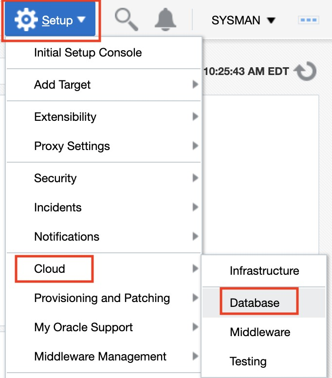

>   Select **Pluggable Database** from the drop-down menu.

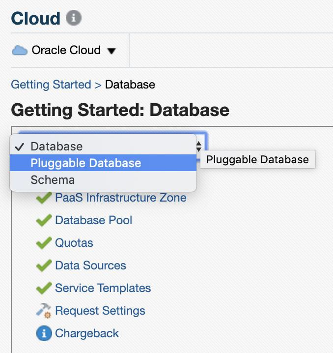

>   And then click on ‘**PaaS Infrastructure Zone**’

>   “**Sales Infra Zone**” is the zone where PDBs were provisioned in the
>   previous sections. Click on name of zone.

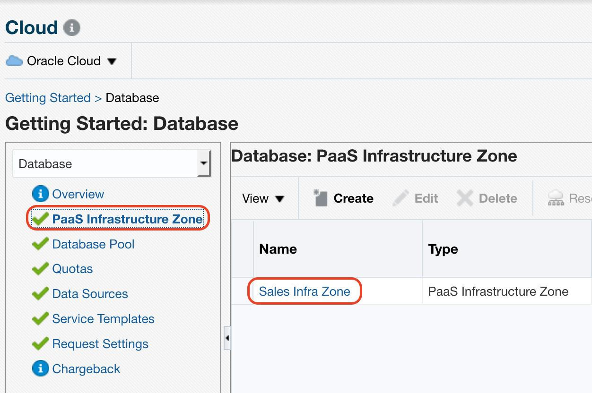

>   You are taken to the Zone Home page; you can see all the details of Zone
>   such as the host members of this zone. You can explore more about the zone
>   on this page.

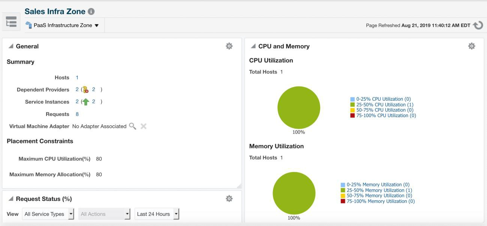

Pluggable Database Pool
-----------------------

>   On the EM Console, go to Setup -\> Cloud -\> Database.

>   Select Pluggable Database from the drop-down menu. And then click on
>   ‘**Pluggable Database Pool**’.

>   A Pluggable Database Pool consists of a set of Container Databases on which
>   PDBs will be provisioned.

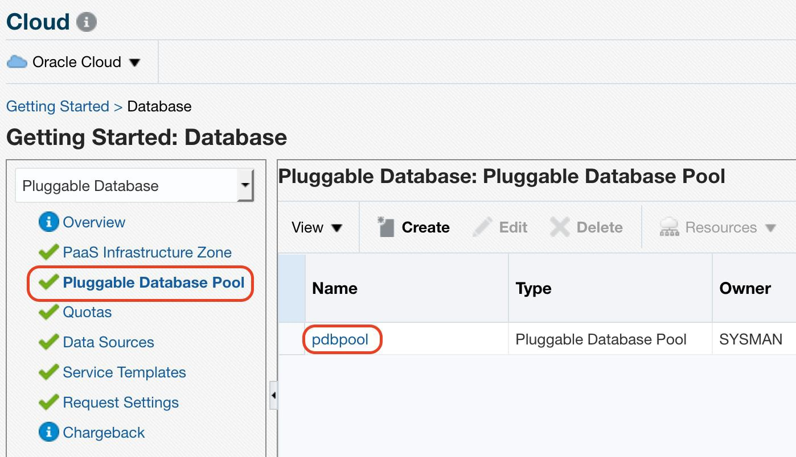

>   Click on Name of the pool to see more details.

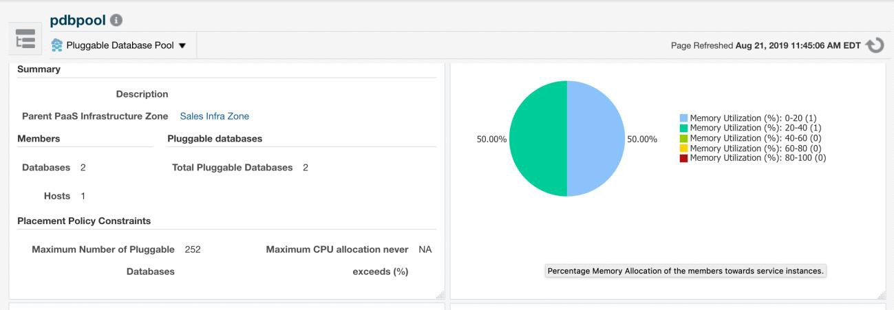

>   Scroll down to see details of Members and Service Templates.

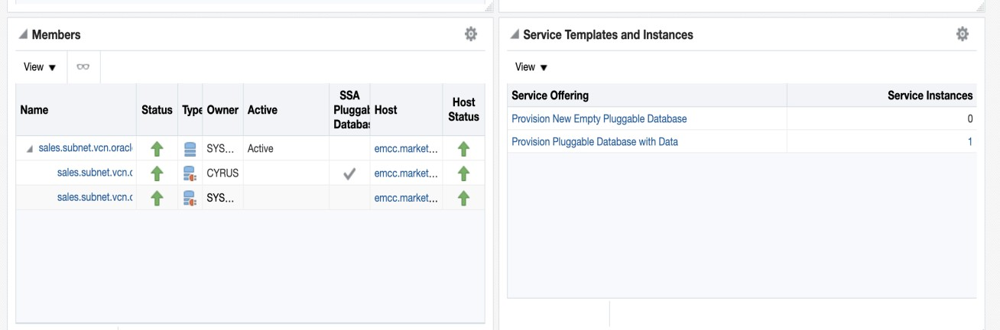

Data Sources
------------

>   On the EM Console, go to Setup -\> Cloud -\> Database.

>   Select Pluggable Database from the drop-down menu. And then click on ‘**Data
>   Sources**’

>   Observe that profile is based on Schema Export(s). This Data Profile was
>   used for provisioning PDB with data.

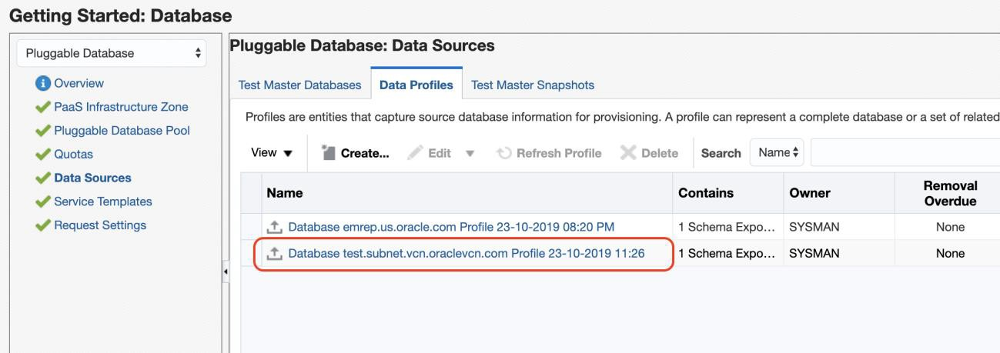

>   Select the row with profile to see more details.

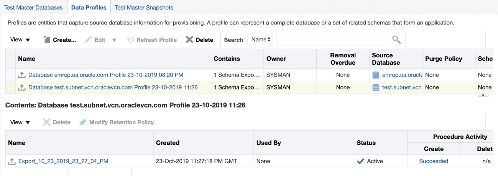

Service Templates
-----------------

>   On the EM Console, go to Setup -\> Cloud -\> Database.

>   Select Pluggable Database from the drop-down menu. And then click on
>   **Service Templates from you left menu.**

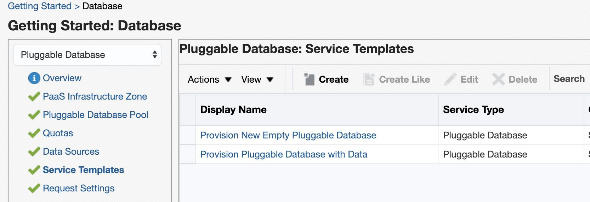

>   There are two service templates pertaining to Pluggable Database

-   Provision New Empty Pluggable Database

    -   This template allows user to create a new pluggable database in a
        container database configured by DBA

-   Provision Pluggable Database with Data

    -   This template allows user to create a new pluggable database with data
        from non-container database.

>   Click on name of any template to explore more details.

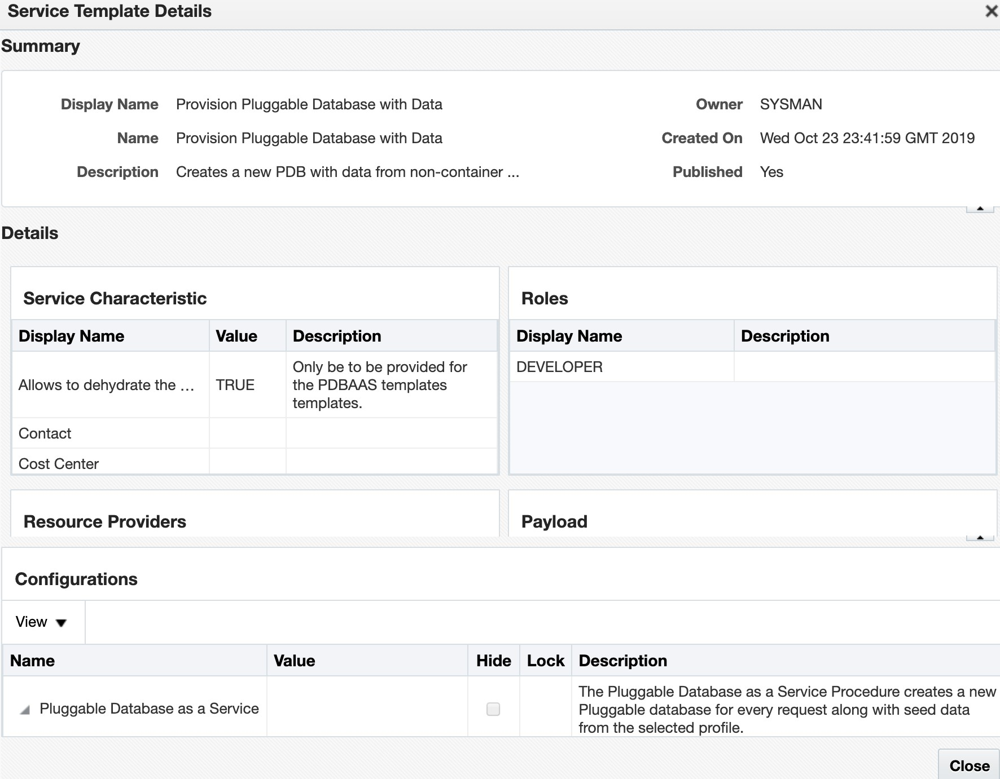

That concludes this lab. 

>   [Return back to top menu listing all available labs](../readme.md)