Introduction
============

>   This lab will show you how to login to the cloud and setup a compute
>   instance using the custom vm images that has Oracle Enterprise Manager as
>   well as Oracle Database targets on it.

Lab Assumptions
===============

-   Each participant has been provided an account on the *[provided tenancy]*
    and the network (VCN) has been pre-created (including ingress rules).

-   Each participant has a public/private key to login to instances post
    creation
    ([instructions](https://github.com/kaymalcolm/learning-library/blob/master/data-management-library/database/options/environment-setup-c4u03.md#section-2-create-an-ssh-key-pair))

Create Compute Instance
=======================

1.  Login to *[provided tenancy]* using your account, once logged-in Click on
    the navigation (hamburger) menu.

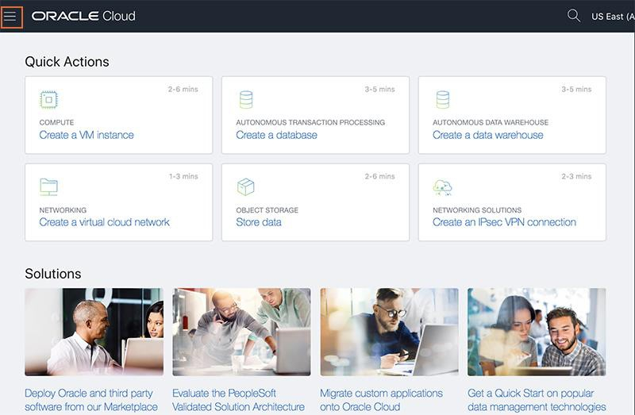

2.  Select **Compute** then **Instances** to go to the screen to create your
    instance.

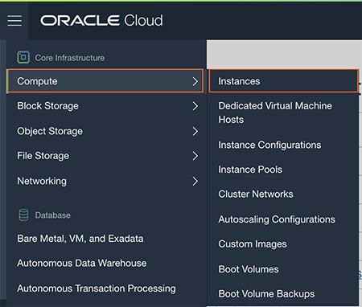

3.  Before creating the instance, it is important you **select the correct
    compartment**, which is **dboptions1105**. Go to the bottom left side of the
    page and expand the root drop down to select the **dboptions1105. Do NOT
    select the root compartment or any other compartment**.

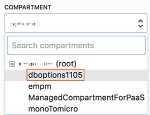

4.  Click the **Create Instance** button.

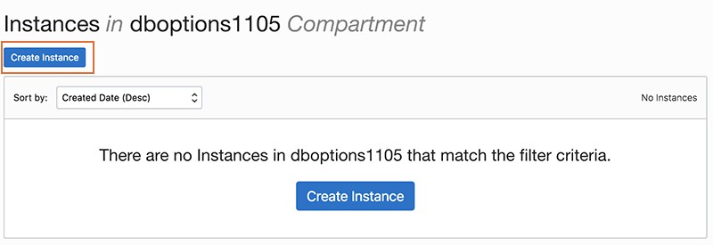

5.  Enter your desired instance name which should be unique. Suggested name:
    [yourGUID]_em_workshop - *Do NOT enter name as-is like the example below, as
    that is for demonstration purposes only*. Click on the **Change Image
    Source** button.

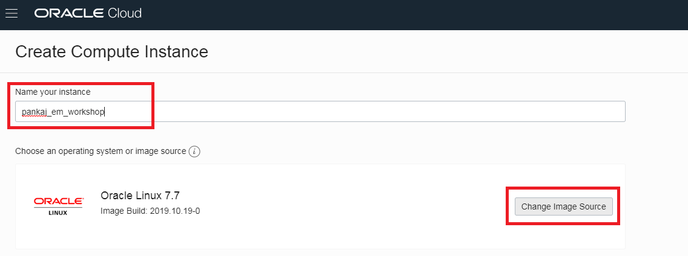

6.  This is the OCI Marketplace library of images. In the **Browse All Images**
    screen, from the options along the top of the screen, click on **Custom
    Images** to select your Oracle Enterprise Workshop Image

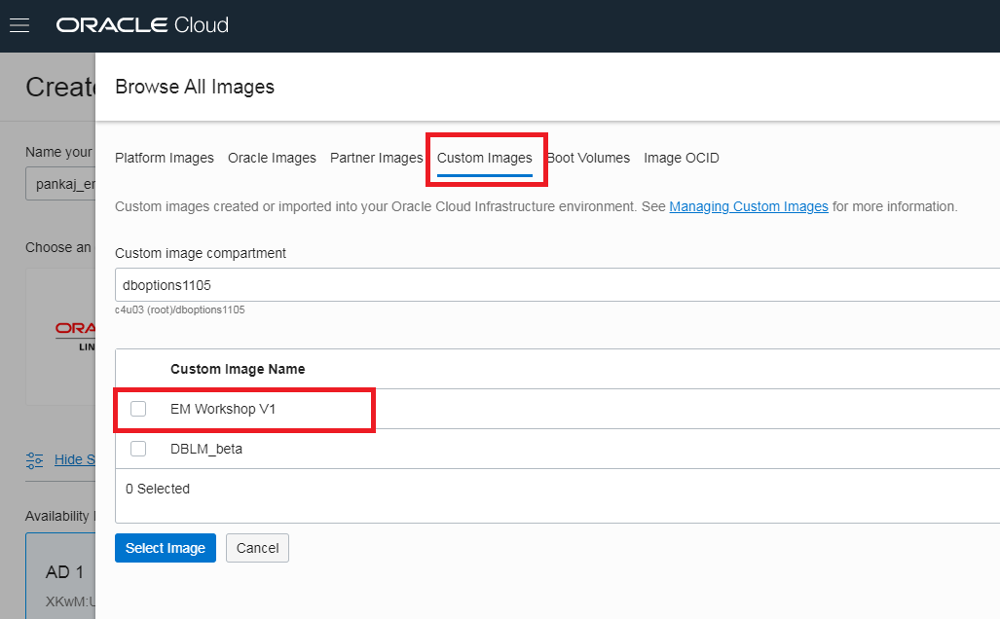

From the list of available custom images, Select the **EM Workshop V1** image
and click on **Select Image** button.

7.  Click **Show Shape, Network, and Storage Options** if it is hidden.

    -   **AD**: Instances will need to be balanced across Availability Domains
        (ADs) to accommodate limits in the tenancy. If your last name is A-J,
        select AD1, J-M; select AD2, N-Z, and select AD3.

    -   **Instance Type**: The instance type we are creating is a **Virtual
        Machine**.

    -   **Instance Shape**: Select the **change shape** button and select
        **VMStandard 2.4** (4 OCPU and 60 GB memory). Click the **Select Shape**
        button to apply the change.

>   **Note:** If there is capacity issue with VMStandard 2.4, use VMStandard 2.2

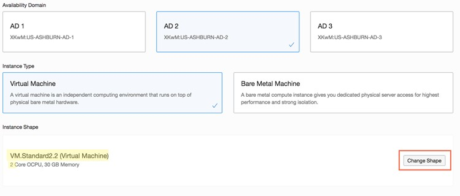

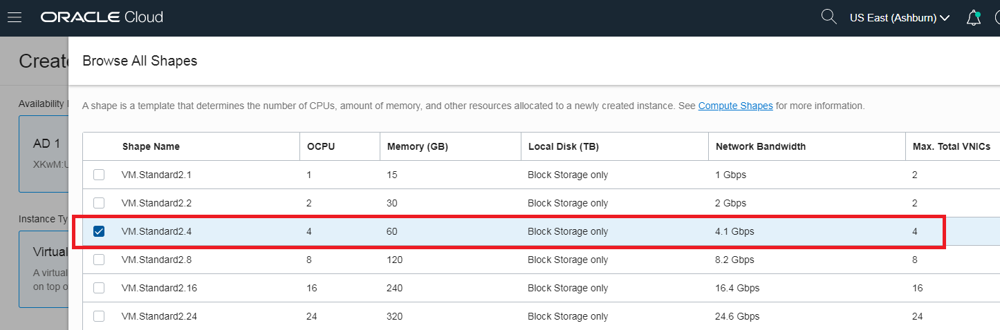

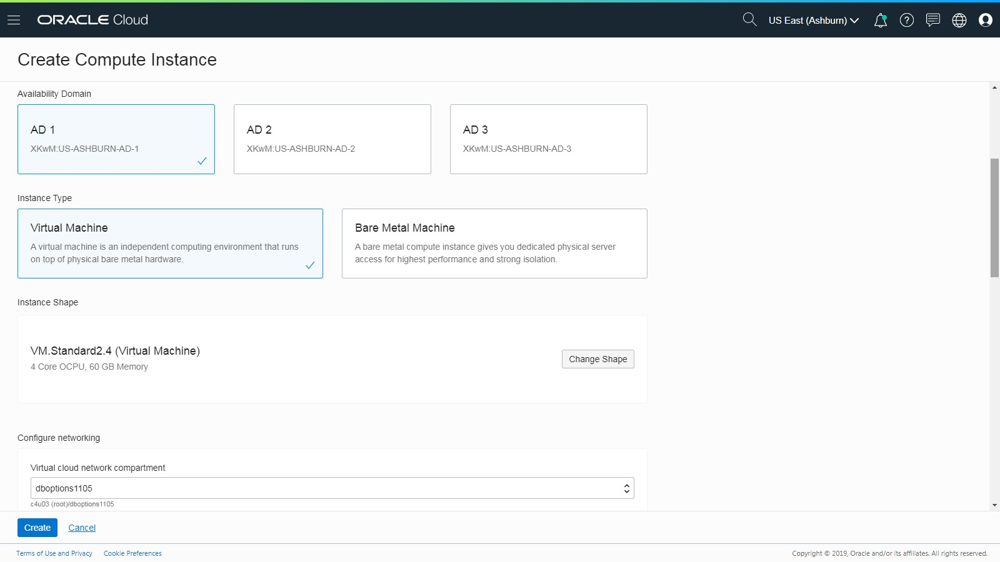

8.  In the Configure networking section, select the dboptions compartment and
    the VCN you created in an earlier section or the default (dboption1105).
    *Click on the radio button to assign a public address. This is critical - DO
    NOT OVERLOOK THIS STEP!!!!!!!*

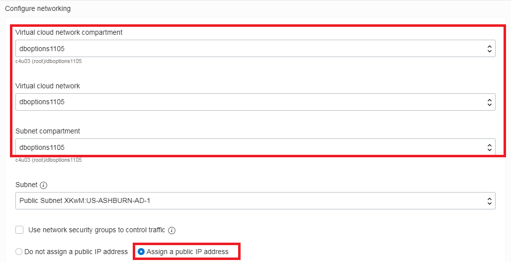

9.  Use the default boot volume settings that comes along with image (changing
    the settings might cause issues)

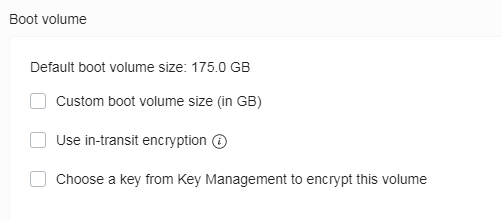

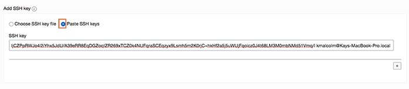

Paste or Choose your SSH key pub file contents

10.  Click the **Create** button to create your instance. Your instance will be
    in the provisioning state for about 4 minutes but it will take about 15 mins
    to start the databases as well as Enterprise Manager on your VM. Verify that
    you chose the correct image. In a few minutes, you can also verify that you
    have a public IP address. View the Work Requests at the bottom, this will
    show where your instance is.

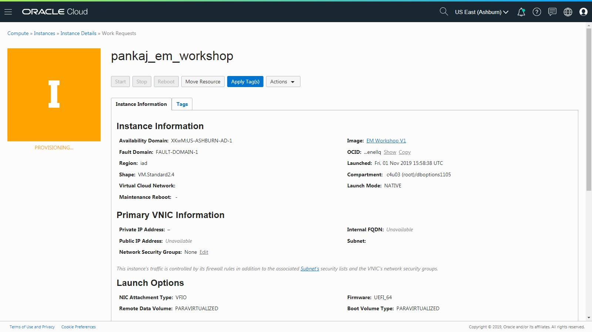

11.  Once the instance moves to the running state, locate your **public IP
    address** and write it down.

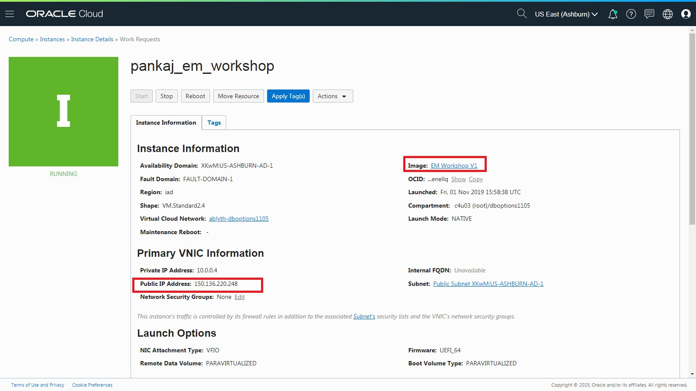

Now that you have your instance, it will need 15 mins to start all the
components after which you can access the EM via URL: **https://\<public Ip
address\>:7803/em.**

You will see a certification warning like below, you can ignore that and move
ahead (click on Advanced and then click on “Accept the risk and continue”)

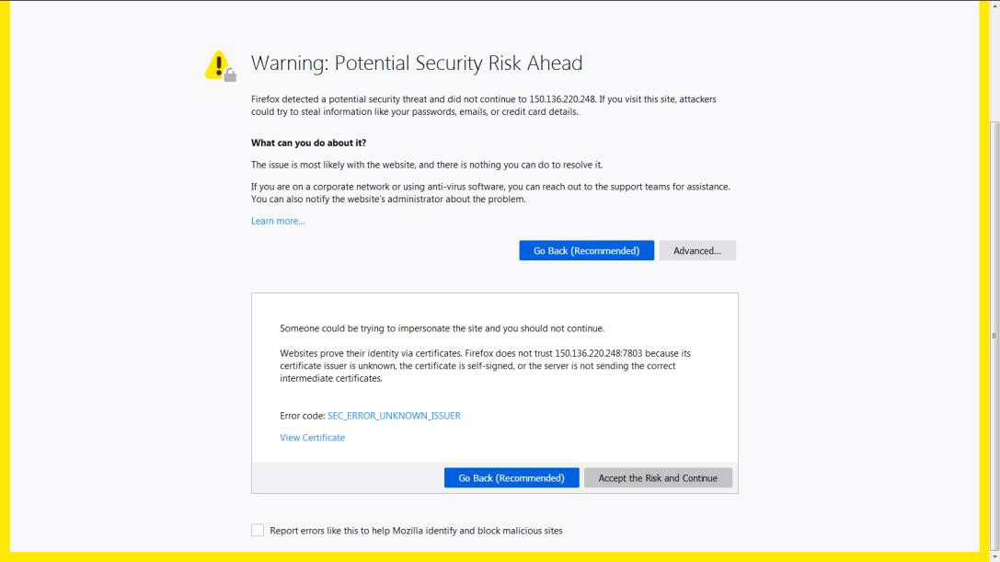

>   Note: if you try to connect to EM and receive “Cannot Connect” screen, give
>   EM more time to start up.

>   Once it’s up, you should see the login screen

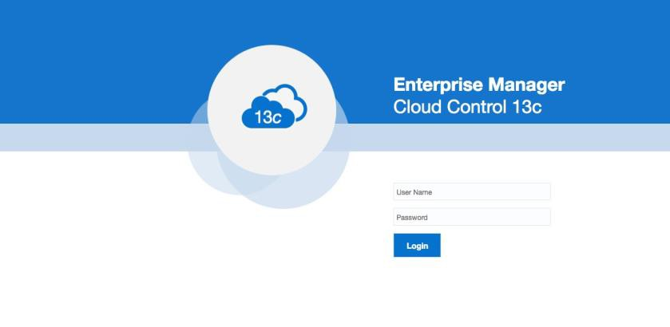
