PERFORM LOG ANALYTICS - ORACLE MANAGEMENT CLOUD DEMONSTRATION
=============================================================

### Contents

**Activity 1:** Analyzing Logs to Diagnose Database Issues

**Activity 2:** Application Topology Approach to Locate Root Cause

**Activity 3:** Use Machine Learning (Cluster and Cluster Compare) to Find Root
Cause

**Activity 4:** Machine Learning (Link) Approach to Find Root Cause – (Optional)

Activity 1: Analyzing Logs to Diagnose Database Issues
======================================================

User Persona: DBA, DevOps, ITOps
--------------------------------

**Scenario Details**

Users want to use OMC Log Analytics to troubleshoot database issues to find
possible root cases through logs

**Task**

Allowing users to get insight about their application by drilling down into
database logs and any host/infrastructure related logs

**Learner Goal**

You will learn how you can use Oracle Management Cloud Log Analytics to gain
visibility to your data

**Value Proposition**

Logs have very valuable information that would be important in troubleshooting
or finding a root cause

**Duration**: 10 mins.

1.1 Click on “Dashboards” link.

Let us log into Oracle Management Cloud. Here we can see all the different
integrated services on Oracle Management Cloud. We are going to start with a
dashboard that shows Oracle Database.

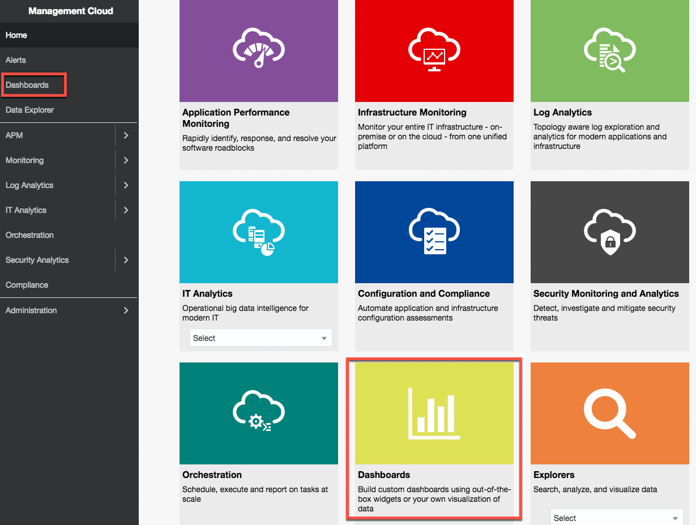

1.2 Click on Dashboards and select the “Oracle Database Dashboard”. Here we see
variety of dashboards. (Built-in & custom ones).

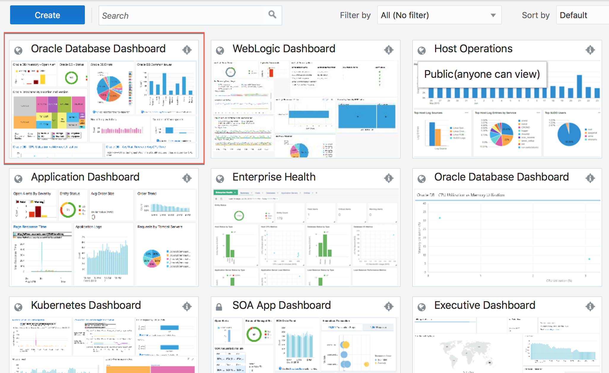

1.3 Click on highlighted arrow below

>   In this dashboard, we have a lot of useful out-of-the-box information about
>   the database health and issues. Click on highlighted arrow “Oracle DB Common
>   Issues”

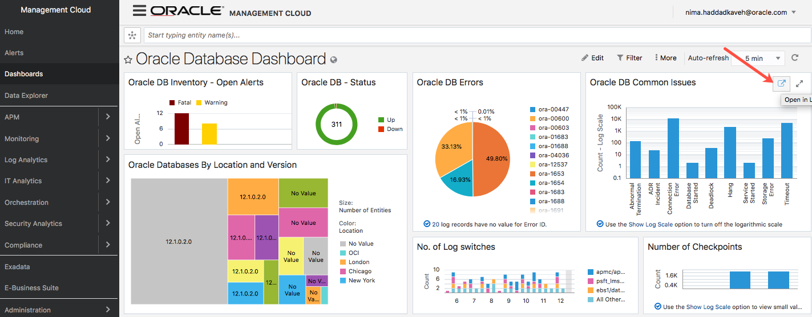

>   Change visualization to “Record & View”

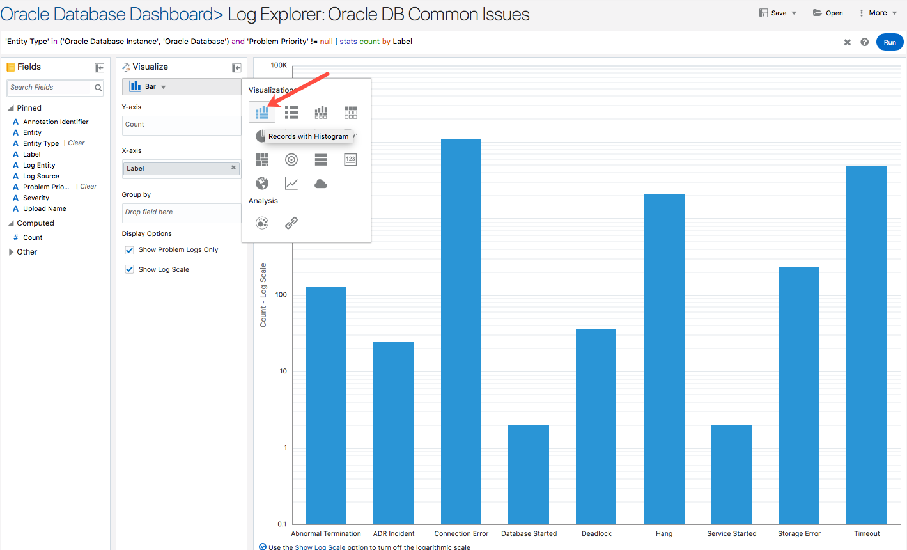

1.4 Change the query to match the highlighted part. There are a lot of
“Connection Error” and “Hang” error in our DB logs and we are not interested in
those for now so we can exclude them from our search.

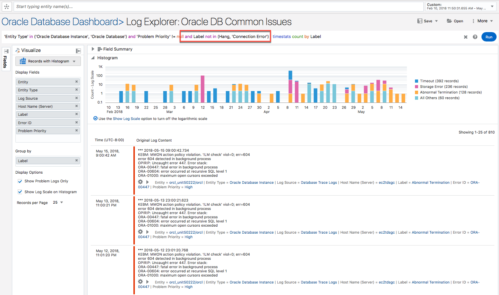

1.5 Click on “Field Summary” and hover your mouse on “Deadlock” “Field Summary”
shows all “Deadlock” logs are coming from entity “orcl_unit50222” on “ec2tdsgc”
host. This could be very useful information and to get to this detailed insight
from the data this fast by just a few clicks is very powerful

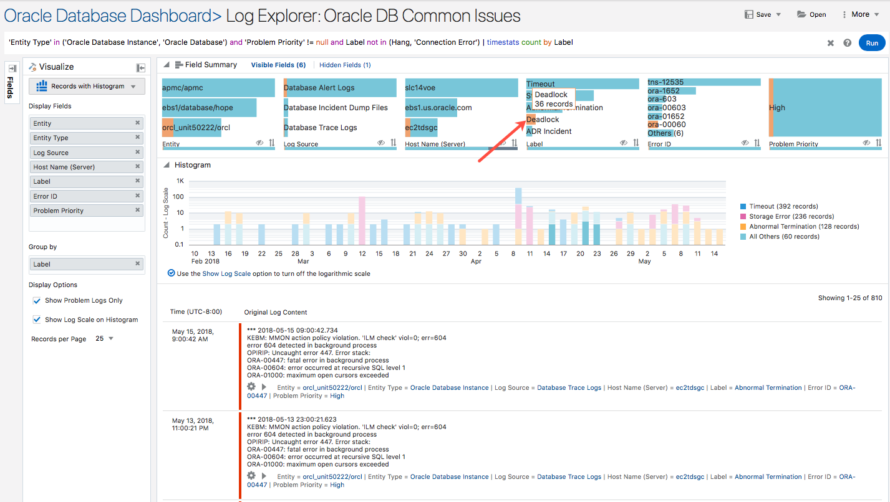

1.6 Now let us drill down into “Deadlock” logs by clicking on “Deadlock” from
Field Summary Oracle deadlocks occur when one or more sessions attempt to
acquire a resource to a database object that is currently being held by a second
session, which is also attempting to acquire a resource held by the first
session. As a DBA I want to make sure there is no Deadlock error in my
application and need more information on specific error/issue

>   If you notice, the query at top is updated.

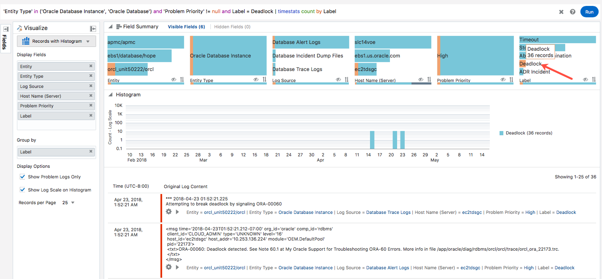

1.7 If you click on Log Source”, you will see we have identified “deadlock”
related logs coming from two log source types: “Alert logs” & “Trace logs”

Based on the specific time selected by default, there are about 36 events

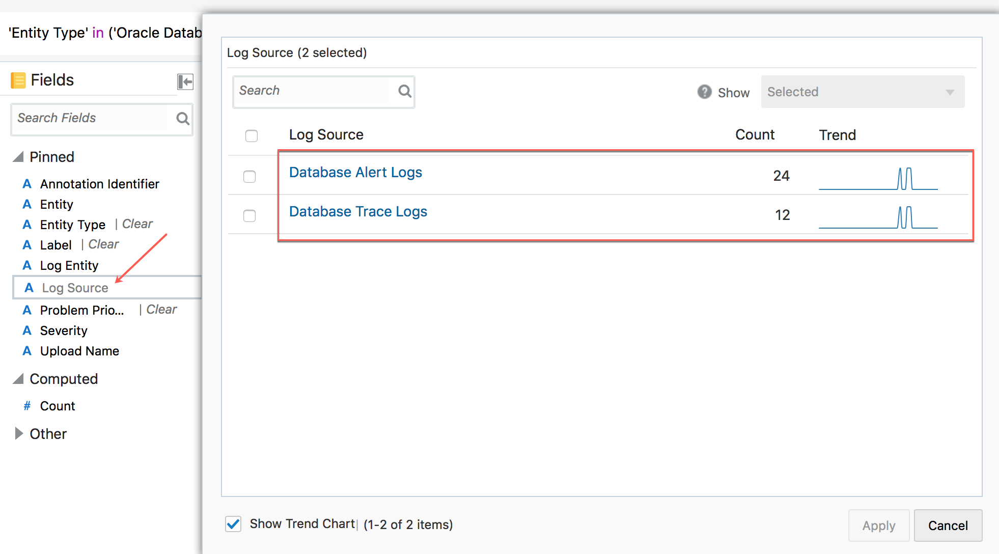

1.8 Scroll down to select the highlighted trace log. Trace logs are very
informative with a lot of detail; however, it is not easy to read through all
those log events and find or compare exact details. Log Analytics provides a
very easy way to compare any two events. This comparison capability is very
powerful and helps users to easily find differences in log events and possibly
get to the root cause. It may take half a day of a dev ops or a developer to get
to this stage and even if they get to this stage, they may easily miss the
difference between events.

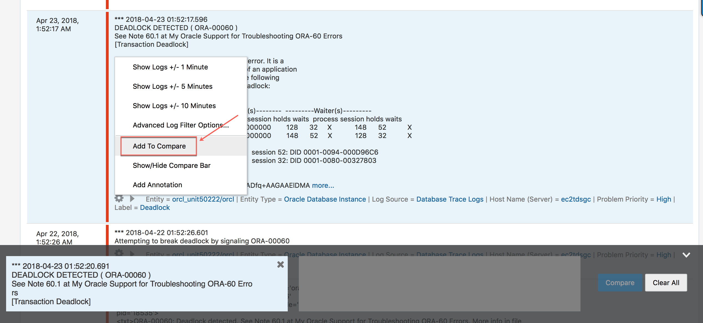

1.9 Select the second interesting log event to the compare list and click on
“Compare”**.** There is another trace logs with a few seconds time difference.
Let’s compare them to see what has changed related to “deadlock” error

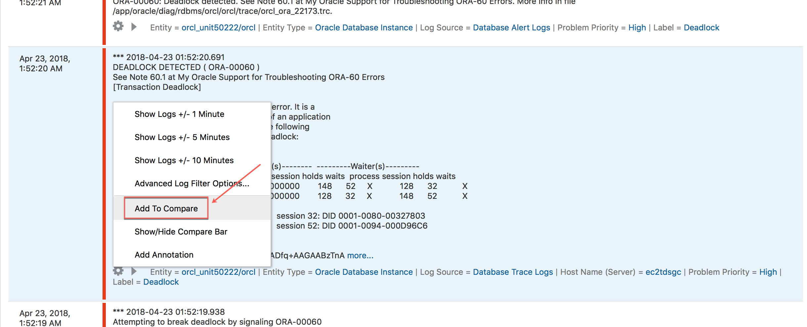

1.10 Click on “Compare”. By comparing these two selected logs, you can easily
compare all the changes/difference with different color-coding in a table format
to find the possible root-cause.

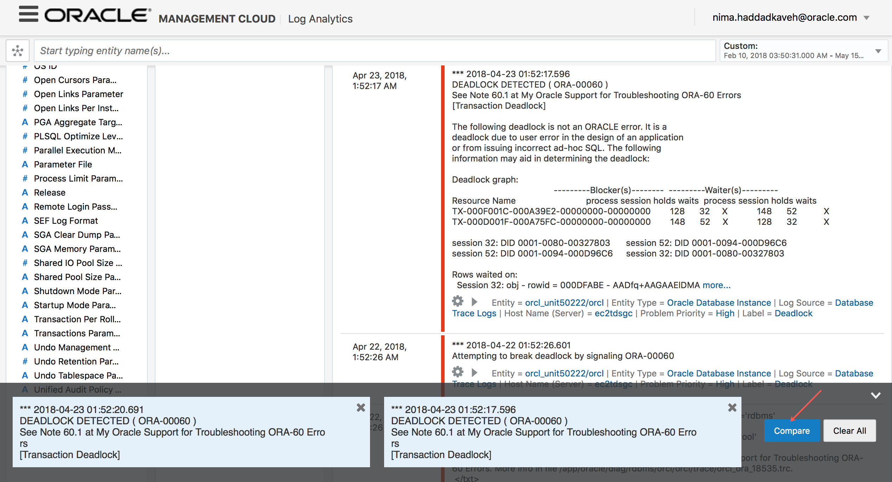

Activity 2: Application Topology Approach to Locate Root Cause 
===============================================================

User Persona: DBA, DevOps, ITOps
--------------------------------

**Scenario Details**

So far, we drilled into specific database issue to gather more context. To
expand our troubleshooting scenarios, this time we start from the topology
diagram

**Task**

Allowing users to understand the topology of their application and associations
between different entities or drill down into a specific entity or all
associated entities.

**Learner Goal**

You will learn how you can use Application Topology to gain visibility to your
data

**Value Proposition**

Application topology adds a huge value in troubleshooting scenarios since users
can understand how their applications work and be able to drill down into a
specific entity to get more insight from available data

**Duration**: 10 mins.

2.1 Click on Log Analytics from the home screen Let us log into Oracle
Management Cloud. Here we can see all the different integrated services on
Oracle Management Cloud. We’re going to start with Log Analytics

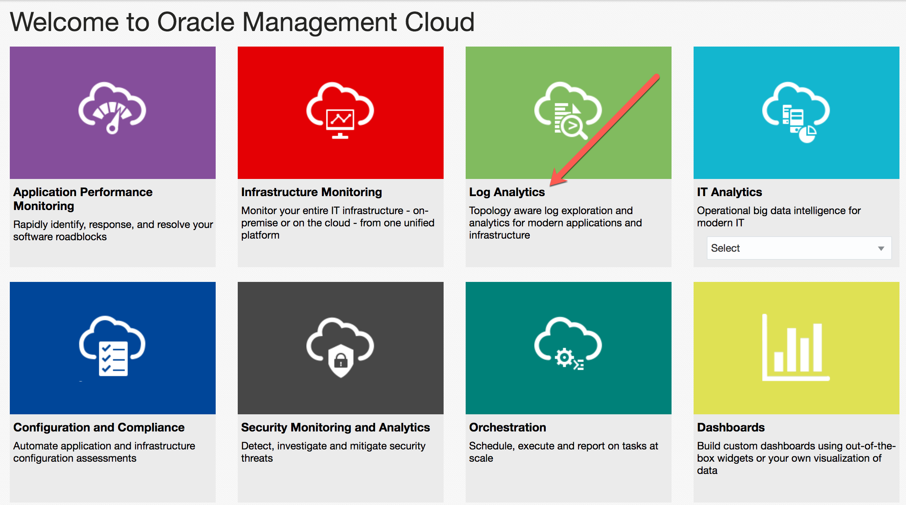

2.2 Filter to only “Order App” application that we were troubleshooting. Click
on Global Content bar and select “Order Application GC”

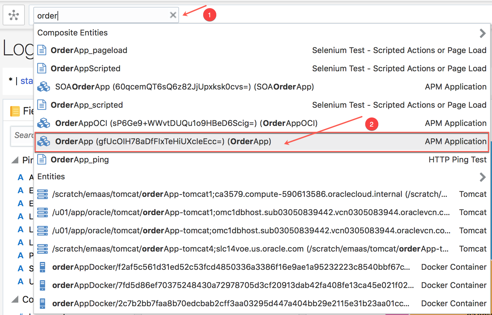

2.3 Click on the topology icon on far left top. This time we start from
Application topology to see if we can quickly find any possible root cause. The
application topology helps us to understand how different entities are connected
and we can easily filter down to data for a specific entities or entity
associations by just clicking on them. **Note**: Make sure you have selected Feb
7th 12 am – Feb 8th 12 pm

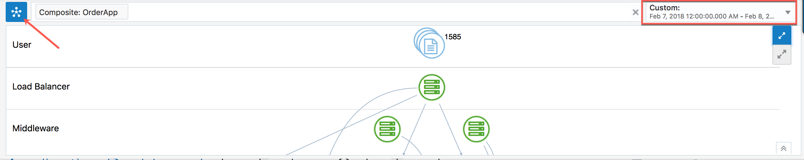

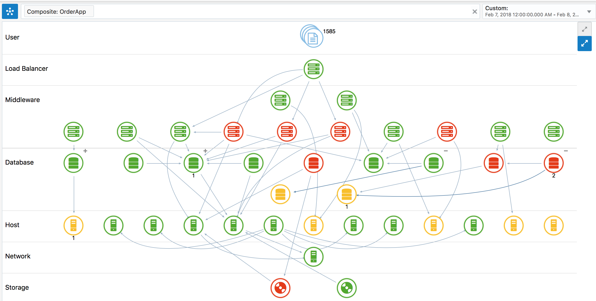

2.5 Select the database entity which is shown as red. By selecting the red
database, we will add its entity to filter bar and show all the logs for that
specific entity from the Order App.

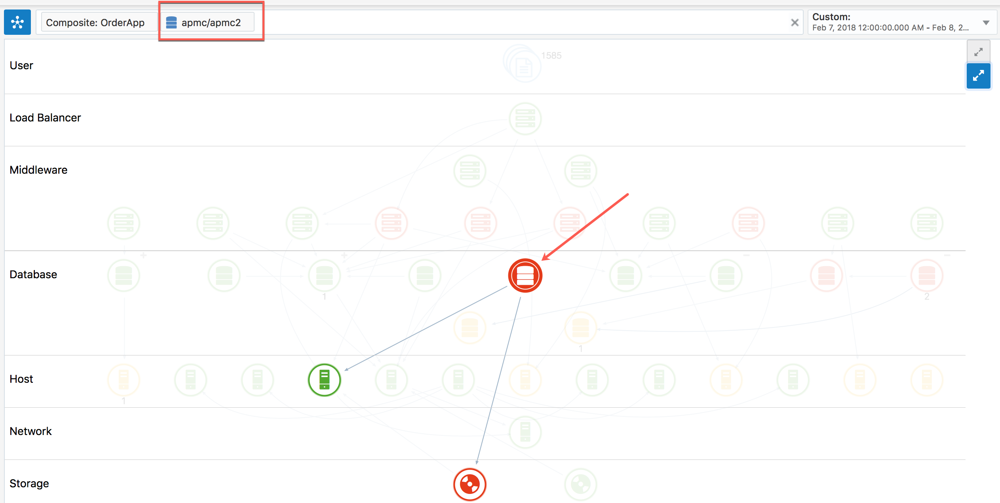

2.6 Select the association line between the red database and its host. Let us
add the associated host log data with the red database by clicking on the line.
If you notice another filter gets added to the filter bar

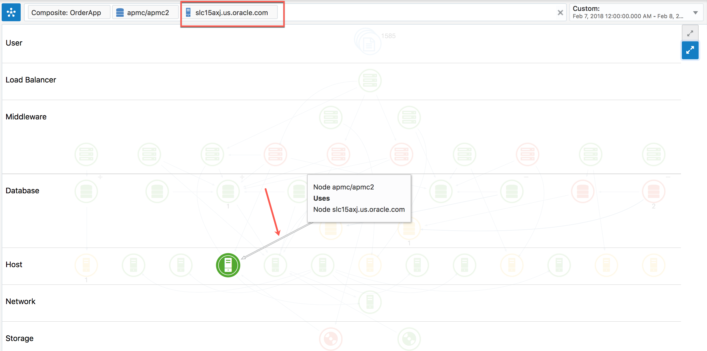

­

2.7 Change the visualization to “Record with Histogram” to see all the relevant
logs

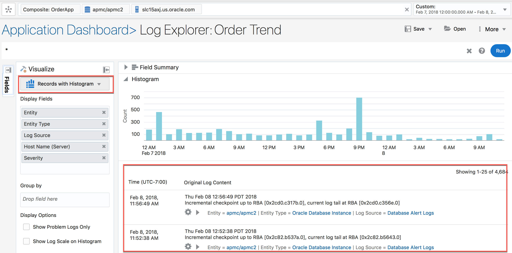

2.8 Click on “Error ID”. It seems there are a few different errors we didn't
know about. As you saw with only three clicks, we could find these errors that
could be the root cause. Let’s select “ora-00343” to see logs events with this
error.

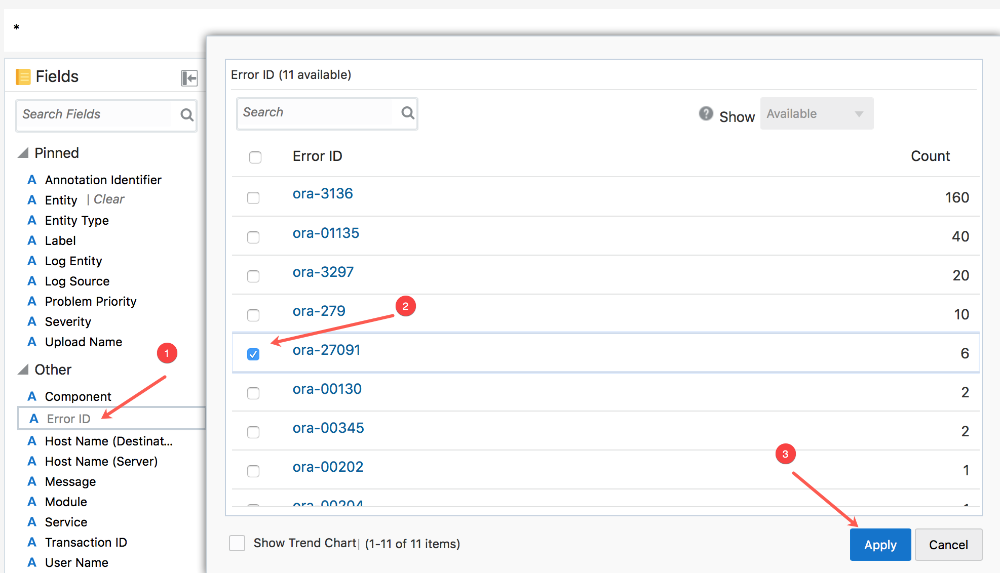

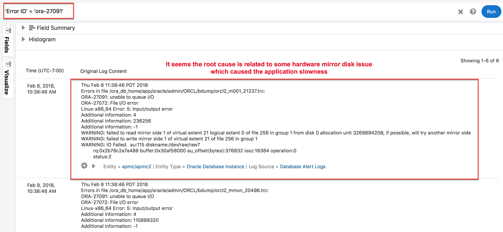

2.9 Lets Create an alert to catch this error next time .

>   **Note: Do not save the alert, click cancel.** Let’s create an alert to
>   notify us if next time this error happened. Click on “Save” and check “Creat
>   Alert Rule” and fill up the alert configuration based on your requirement.

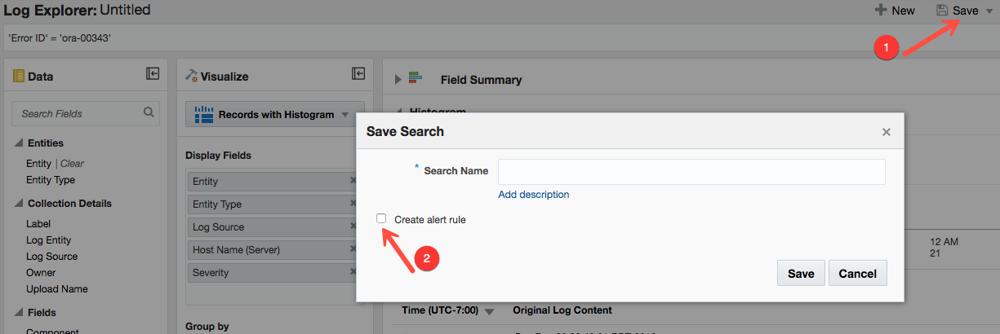

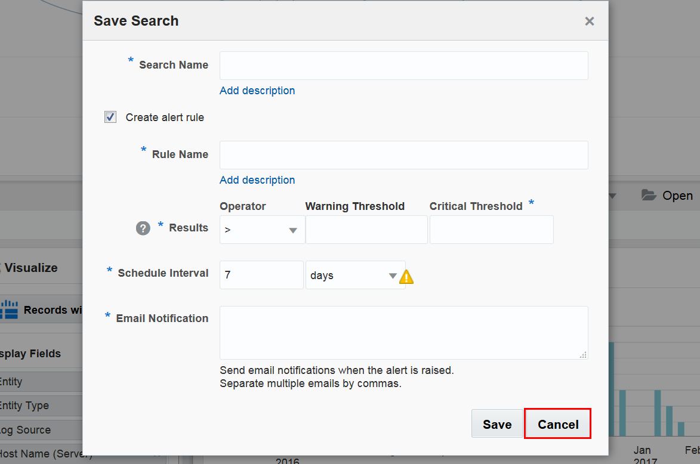

Activity 3: Use Machine Learning (Cluster and Cluster Compare) to Find Root Cause 
==================================================================================

User Persona: DBA, DevOps, ITOps
--------------------------------

**Scenario Details**

In Activity 2a, we drilled into database and host logs to find issues and get
additional context around issues. In this scenario, we take a different approach
and start from log clustering

**Task**

Log volume could be huge; we want to help our users to narrow down their log
events to a much smaller buckets based on similarity in their patterns. You can
help users to find potential issues and outlier OOTB without any pre knowledge
about their data

**Learner Goal**

You will learn how you can use Log Clustering to gain visibility to your data

**Value Proposition**

Log clustering is one of our differentiators compared to other products in the
market. Users can get insight from their data without need of any pre-knowledge
about their data in matter of seconds. Users can use cluster compare capability
to easily compare changes (clusters, potential issue, outliers & trends) based
on time and/or other filtering attributes. These are some of the use cases for
cluster compare:

-   Use cases:

    -   what is different this week compared to last week

    -   what is the difference between set of entity A and entity B

    -   I know things were working fine for a giving week, what has changed this
        week

**Duration**: 15 mins

3.1 Go back to LA home screen and make sure there is no filter selected and
replace the query with a wildcard asterisk “\*”

>   The only filter we need for this demo is “group: Order Application GC” since
>   we are only focusing on the Order App data. Please pay attention to how many
>   events we have for the Order App within that timeframe (Dec 1st – Dec 31st)
>   – it is 1,971,826 events (almost 2 Million events)

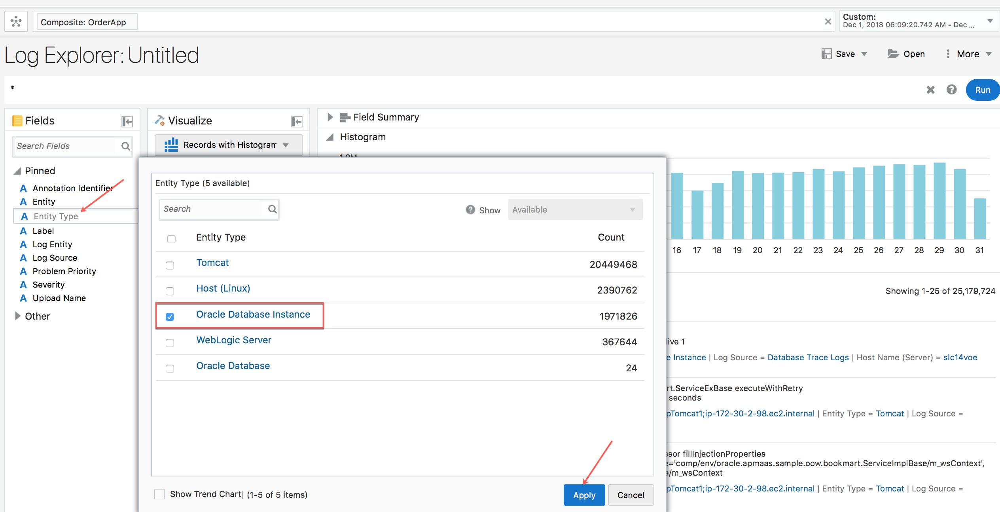

3.2 Run “cluster” command. From the visualize panel select the “Cluster”
visulization. As you see, from almost 8 millions events, we are down to 1108
clusters since there are so many events with the same pattern which get located
into the same cluster. Going through 8 millions events is easier or 1108
clusters?

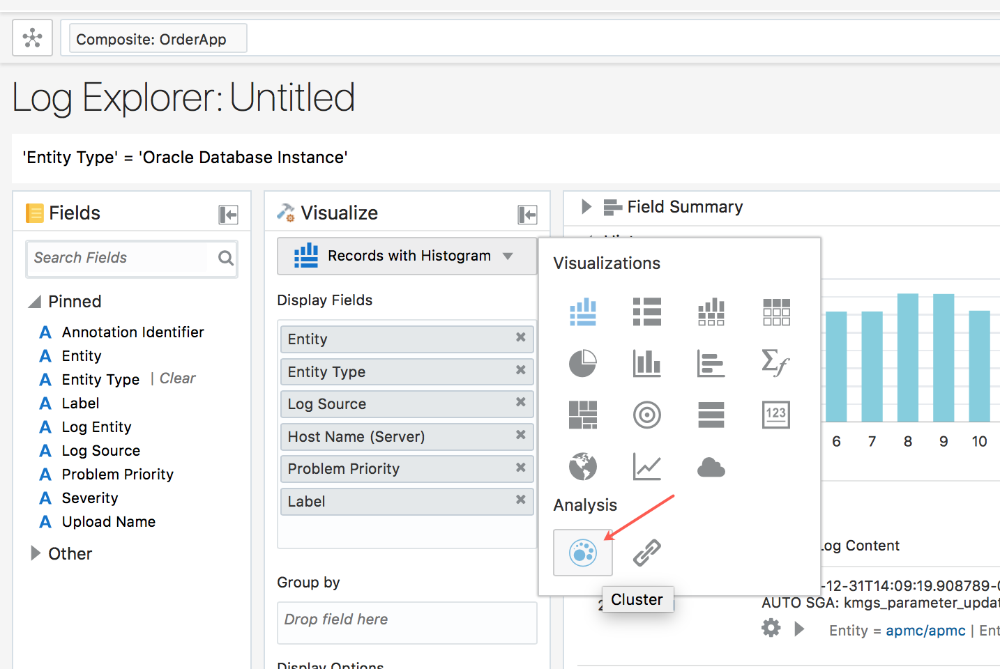

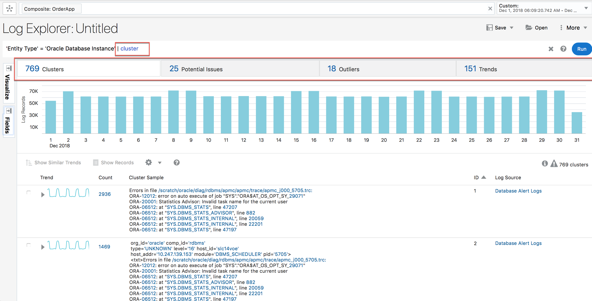

3.3 Switch to “Potential Issue” tab. LA automatically finds all potential issues
OOTB. These are events with different variants of severity like “Error”,
“Fault”, “Fatal”, “Warning” or set of terms that are semantically similar to
these.

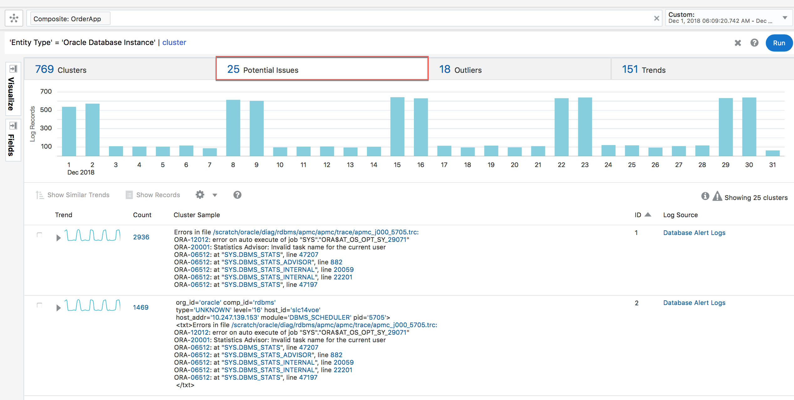

3.4 Switch to “Outliers” tab. We identify all events with 1 occurance and show
them in Outliers tab. As shown below, by expanding one of the events you can
tell when exatelly the event occurred.

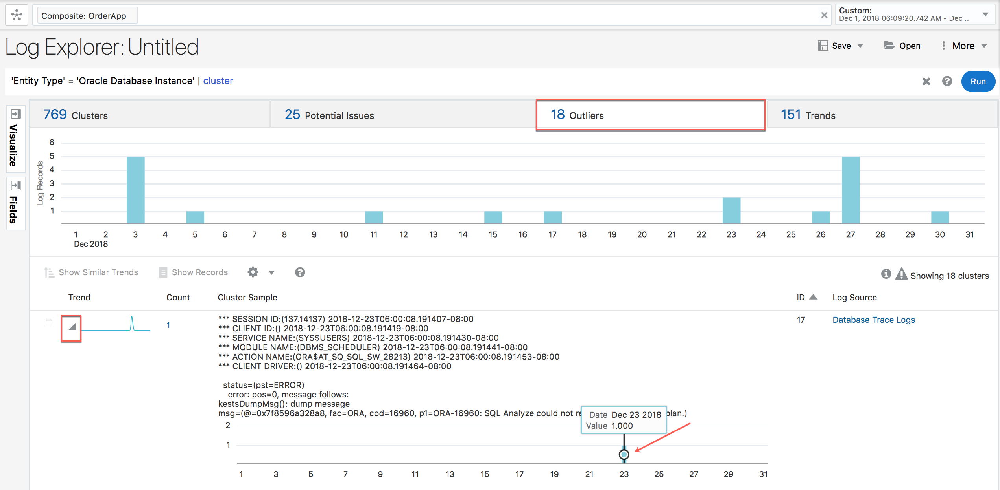

3.5 Switch to “Trends” tab. We monitor all log events and generate a trend graph
for each variant. The trend tab could be extremely valuable to users because
they can find correlations between events based on their trend occurrence across
multiple tiers. For instance, Let’s say a checkout tranaction failed which
generated bunch of error logs in application logs, most probabley there are
other errors which got generated at the web server level in the same time range.
By going to “Trends” tab users may be able to see these events next to each
other once they click on “Similar Trends”.

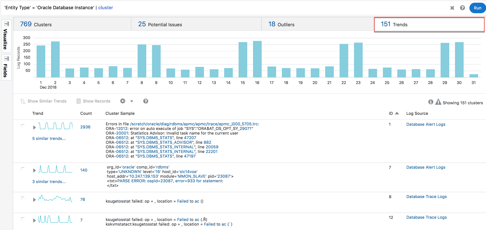

3.6 Narrow down number of events before applying the clustering If users want
they can narrow down their data by adding a few filters before running the
clustering algorithm. For instnce, in vignatte 2a we selected the red database
and its associated host as filters and then started our trobleshooting
investigation, we can do the same thing in here to focus only on those two
entities and then run the cluster command to get more insight from data.

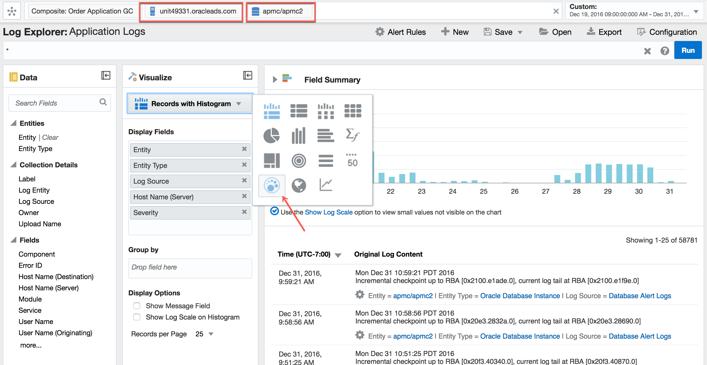

3.7 Go back to LA home screen and make sure there is no filter selected and
replace the query with an asterisk “\*”

While we were using “Cluster” capability as part of our Machine Learning
offering in troubleshooting, there is another capability called “Cluster
Compare” to easily compare changes (clusters, potential issue, outliers &
trends) based on time and/or other filtering attributes. Assume we just had a
new release for our application “Order App” and we want to compare changes based
on the latest release data vs older data to find the potential root-cause.
Please make sure the time picker and the log filters are matching to your
selection as below.

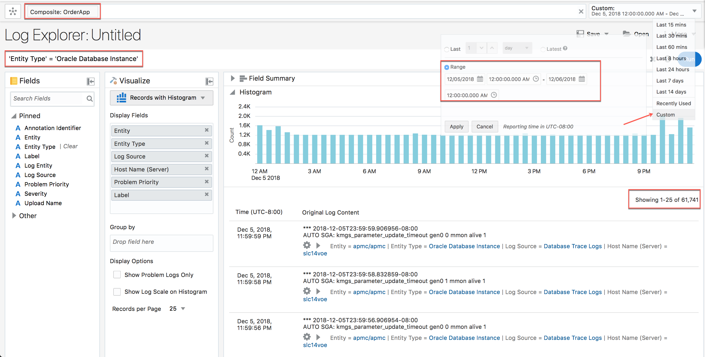

3.8 Run “cluster” command. From the visualize panel select the “Cluster”
visulization. As you see, we found 136 unique clusters from those \~62K events.
Also, we found 12 potential issue and 9 outliers

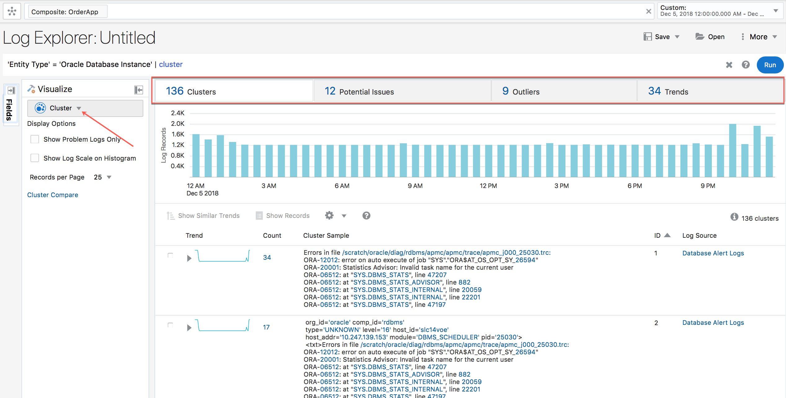

3.9 Select “Cluster Compare”. Since we are investigating an issue within our new
release, we can take advantage of cluster compare capability to compare changes
(clusters, potential issue, outliers & trends) based on time to our previous
release date as explained before. Cluster compare provides capability to change
baseline query and time range for any comparison. For this use case, please make
sure you leave both the query and time “As Is” to compare events to previour
release (1 day before)

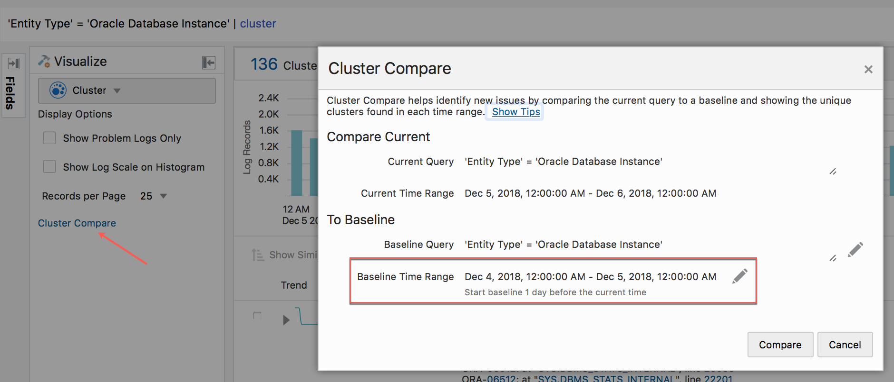

Cluster Compare Results. As you see in the picture below, there are 88 common
clusters between these two release. There are 1 new potentional issue and 2 new
outliers found in this release.

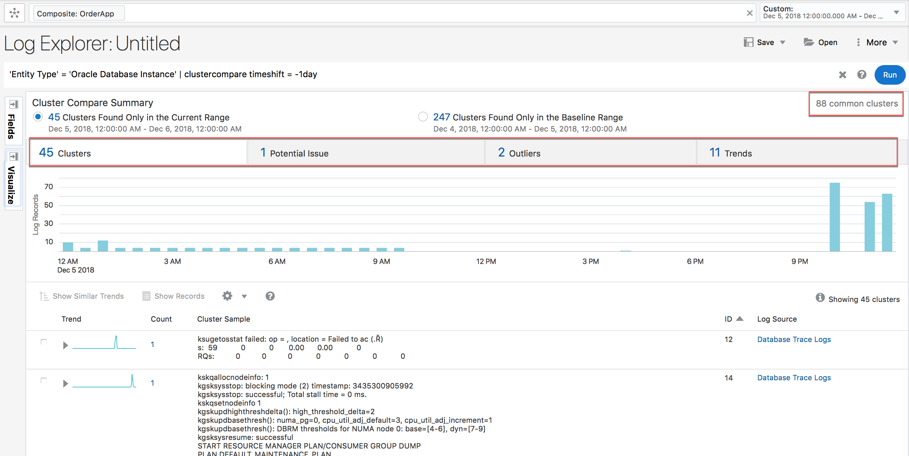

>   Cluster Compare Results. As mentioned above, there are 88 clusters common
>   between these two releases. In addition, there were more potentials issues
>   and outliers found in the previous release.

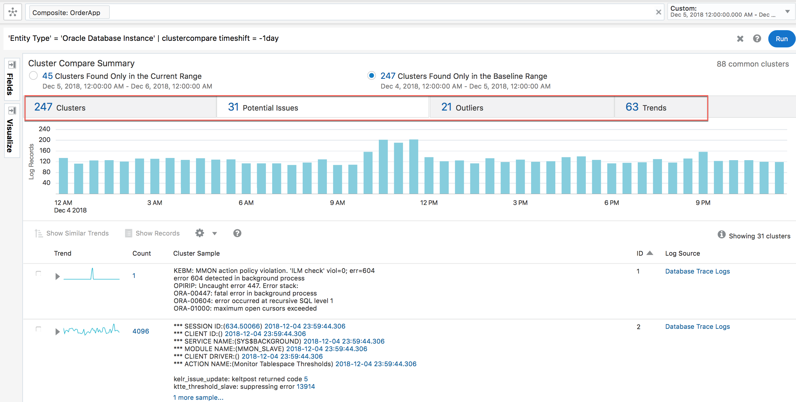

Activity 4: Machine Learning (Link) Approach to Find Root Cause – (Optional)
============================================================================

User Persona: AppOwner, DevOps, ITOps
-------------------------------------

**Scenario Details**

In Activity 3, we learned how to use “Cluster” capability to decrease number of
events in troubleshooting heavily and find potential issues and outlier’s
out-of-the-box. In this scenario, we continue our troubleshooting journey on how
to use “Link” capability.

**Learner Goal**

You will learn how you can use Link to connect event together and find anomalies

**Value Proposition**

Link is a very powerful capability as part of our machine learning capabilities
in LA. Users can link millions events together crossing multiple tiers.
Additionally, analyze those unique groups to find any potential
anomalies/outliers.

**Duration**: 5 mins

4.1 Go back to LA home screen and make sure there is no filter selected and
replace the query with an asterisk “\*”

You just need to change the global time picker to “last 24 hours”

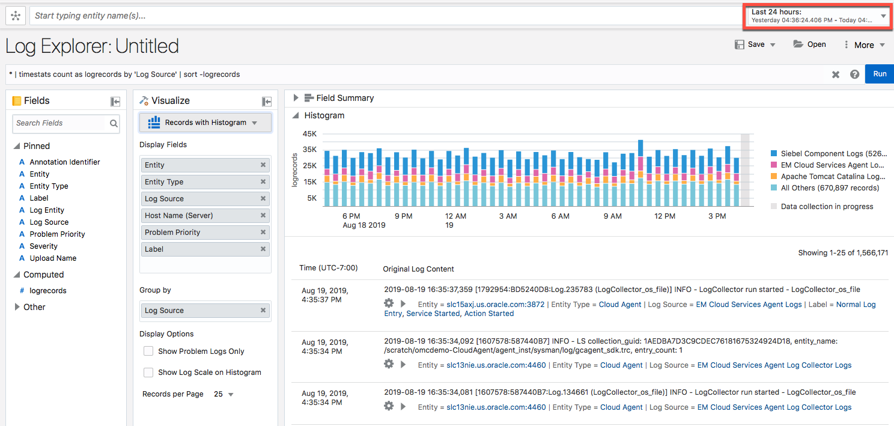

4.2 Select a specific log source. Click on log log source from the field tab on
the left. Search for “EBS and select “EBS concurrent request logs”

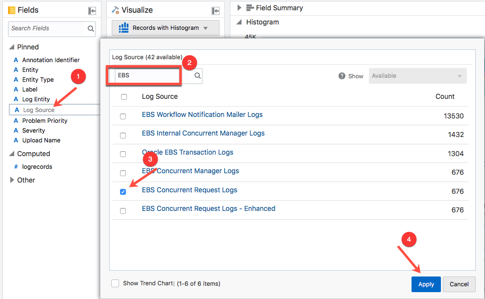

4.3 Click on “Link”. Click on link visualization to link events together. Remove
“Log source” from “link by”, drag “request ID” instead. Also, remove “classify
part of the query. Once you run the query, it links events together based on
shared “Request ID” and automatically calculate “start time”, “end time” and
“group duration” for each group.

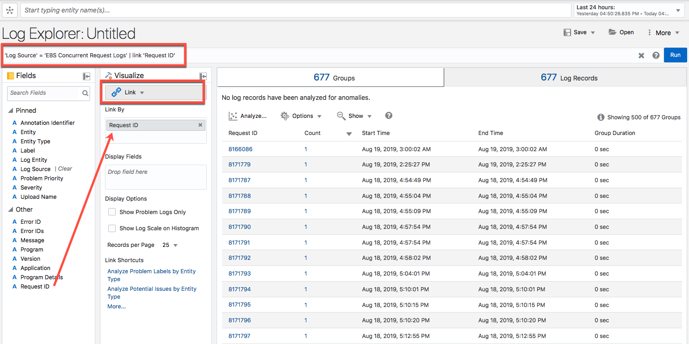

4.4 Build clasiffy part of the link. As mentioned above, link created unique
groups that shared a common “Request ID”. In addition, link can analyze those
events to any find potential anomalies, but to make sense of the data someties
you need to change the query a little bit and rename some fields. Therefore, we
have built a saved search to show how to analyze EBS events in terms of longer
“time taken” to finish than usual, “job status” and “time taken” for each
individual program and mark those events as anomaly. To open the saved search
follow the steps below.

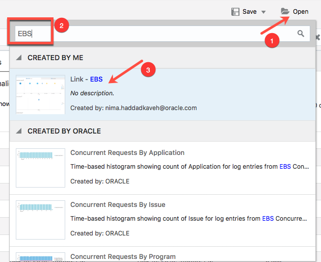

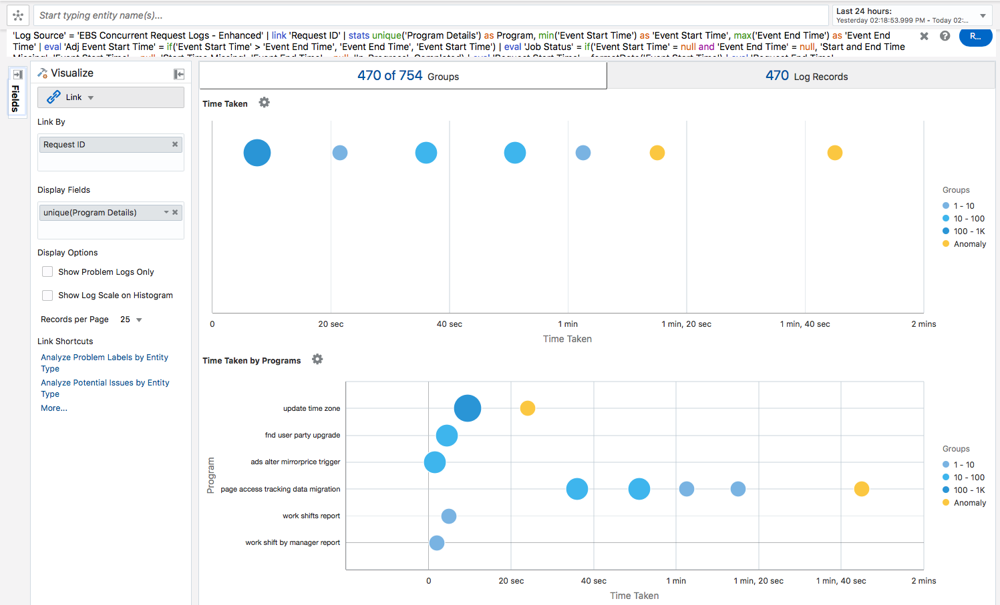

And that concludes this lab. Thank You
