# Oracle Hands-On Lab

 

**ORACLE E-BUSINESS SUITE (EBS) INFRASTRUCTURE MANAGEMENT using OMC** 
================================================================

In these hands-on lab activities, learn how to identify systemic EBS infrastructure issues, and proactively forecast resource utilization. See how to obtain complete and centralized visibility whether EBS is on-premise or in the Oracle Cloud using Oracle Management Cloud (OMC).

=============================================================

Lab Exercise Persona
--------------------

Sarah is an Oracle EBS Applications Administrator. Often she gets calls asking why is EBS running so slow. She needs a way to determine if in fact its an EBS application issue or its something in the infrastructure. Her company Mama Maggy has recently started using Oracle Cloud for EBS staging, and the tools she has been using were not designed for cloud and she needs a solution that can span her cloud and on-premise environments.  

**NOTE**: Use Google Chrome to perform the lab for the best hands on experience

First, you need to get logged in to the Oracle Cloud. [Enter the Identity Domain], then **Click** the Go button.

[Enter Username and Password], then **Click** the Sign In button

## Contents

**Lab Activity 1:** Within a Single View, Review Your EBS Infrastructure

**Lab Activity 2:** Identify EBS Resource & Capacity  Performance Bottlenecks using Log Analysis

**Lab Activity 3:** View EBS User Behavior, Application Issues and Performance.

 **Lab Activity 1: Within a Single View, Review Your EBS Infrastructure**
======================================================================

**Scenario Details**

Administers routinely need to review the health of their applications together along with the infrastructure they are dependent upon.

**Task**

Review key application components, infrastructure in a single view.

NOTE: During activities in this lab, data may appear differently than what appears in screenshots. Please focus on the flow and steps, instead of the actual data values displayed in screenshots.

**Learner Goal**

How an administrator can review health of their EBS application, its key components and infrastructure in a single view using Oracle Management Cloud.

**Value Proposition**

Using and maintaining a whole bunch of tools, especially legacy ones, ones that don't integrate is complex, inefficient and costly to the business and impacts customer satisfaction.

**Duration**: 15 mins.

1. After you have entered your information, click the Sign In button. After login, go to the upper left of the window and use the navigation menu (looks like 3 stacked lines aka hamburger menu) to navigate to Oracle Management Cloud and its Dashboards.

2. **Click** on the Dashboards tile.

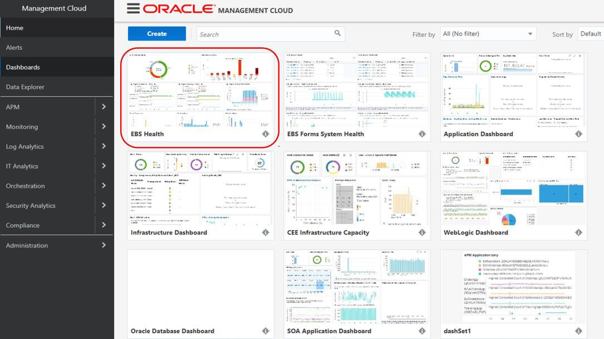

3. From the available dashboards, locate the one for EBS Health. It is a custom dashboard designed to manage all EBS related entities and associated infrastructure. Using it, you will experience an example of how Oracle Management Cloud (OMC) can manage Oracle EBS Infrastructure on the Oracle Cloud within a single view. **Click** the EBS Health dashboard. Alternatively from the left navigation menu of the Oracle Management Cloud home page, **Select** E-Business Suite.

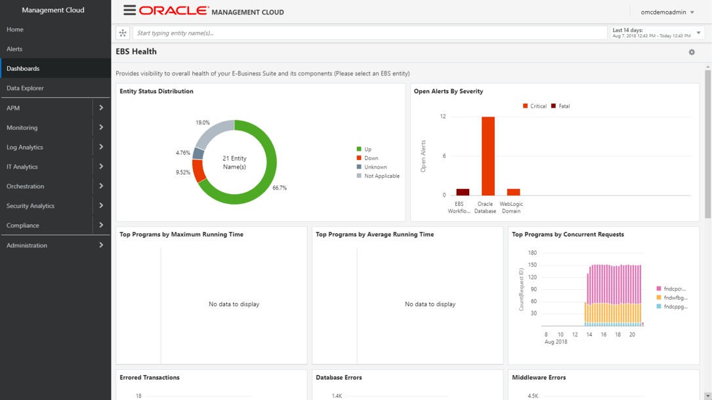

4. See how it provides in one view, complete visibility to E-Business services whether they are running on-premise or deployed in the cloud - natively monitored by OMC. View the associated entities and their status, alerts, performance, database errors, middleware errors, CPU utilization, memory utilization and more.

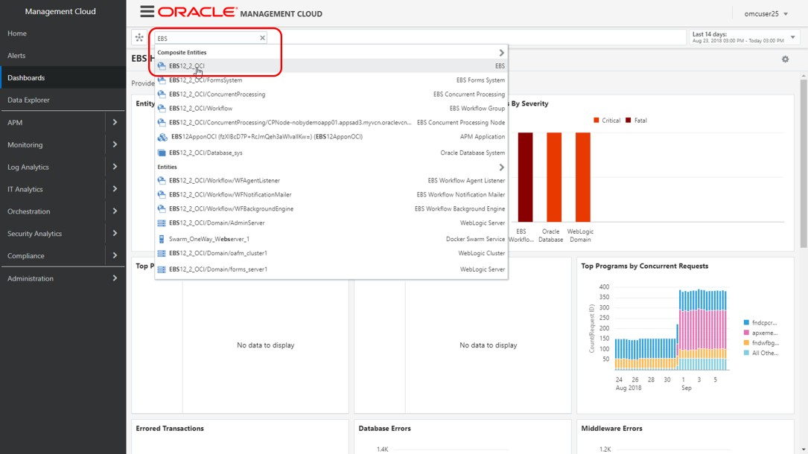

5. Next, we will search for a specific EBS composite entity. **Type** EBS in the Global Context Bar, just to the right of the Topology icon (that looks like a snowflake icon) on the top left and **Select** the EBS12_2_OCI entity from the drop down menu.

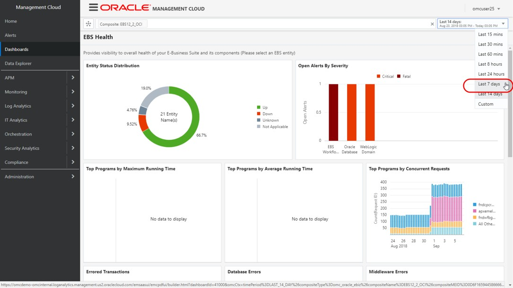

6. Now from the top right, drop down the time period menu and **Select** Last 7 days to display the widget showing Top Programs with Maximum Running Time and Average Running Time details.

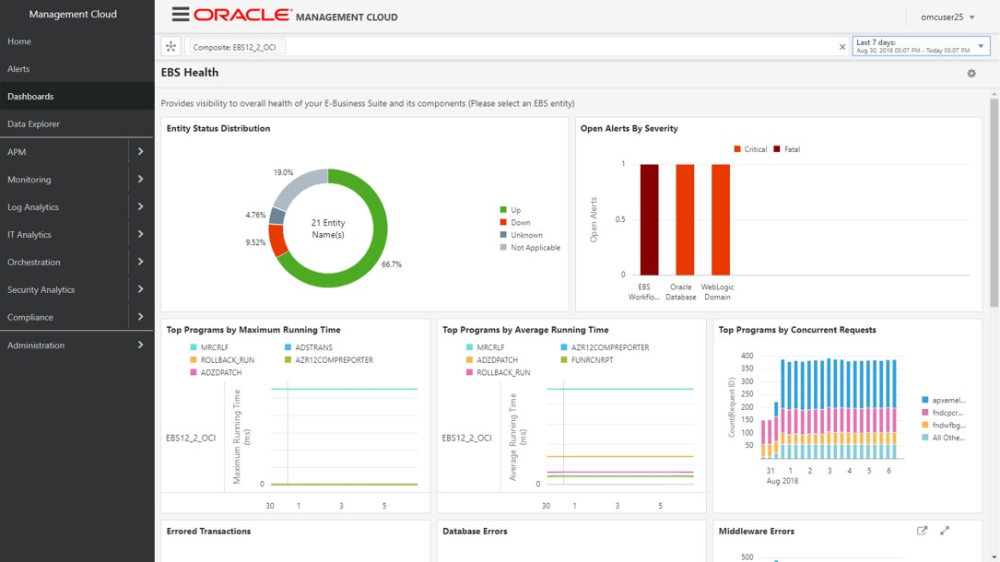

7. From this widget your able to obtain a consolidated view of the most active programs by maximum run time and average run time.

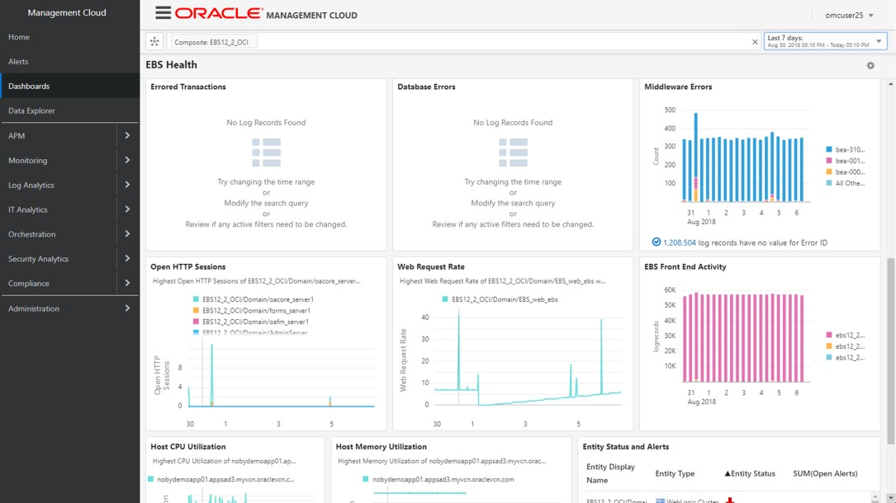

8. Now **Scroll Down** the window using the scroll bar on the right hand side to further view the Errored Transactions, Database Errors, Middleware Errors, Web Request Rate, EBS Front End Activity widgets. Note there have been no Errored Transactions or Database Errors in the last 7 days.

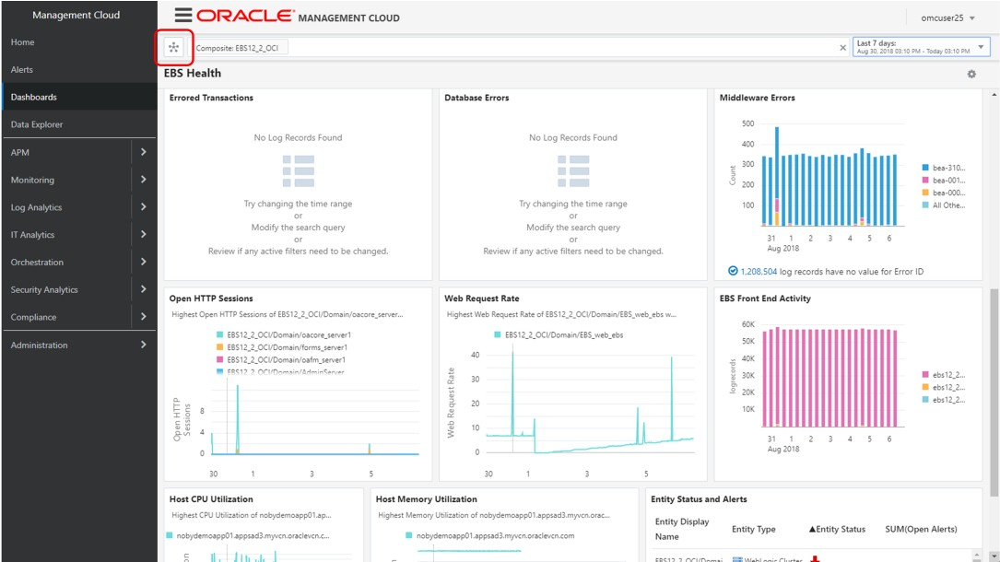

9. From the upper left, **Click** on the Topology icon (looks like a snowflake) to view this application entities topology.

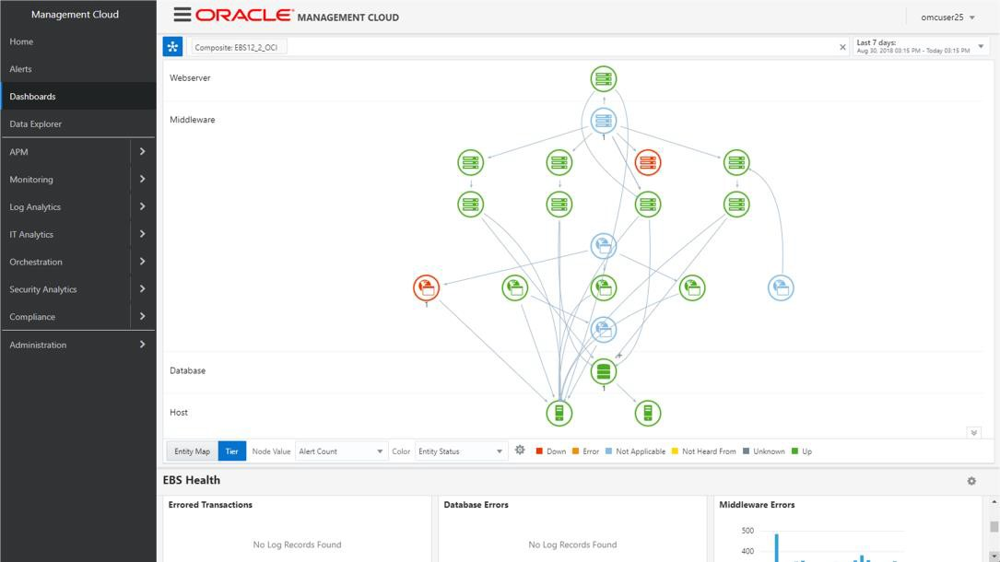

10. Maximizing the topology view, you can see middleware entities displayed in red that are down/unavailable. **Hover** the mouse over those entities to check out the details for each.

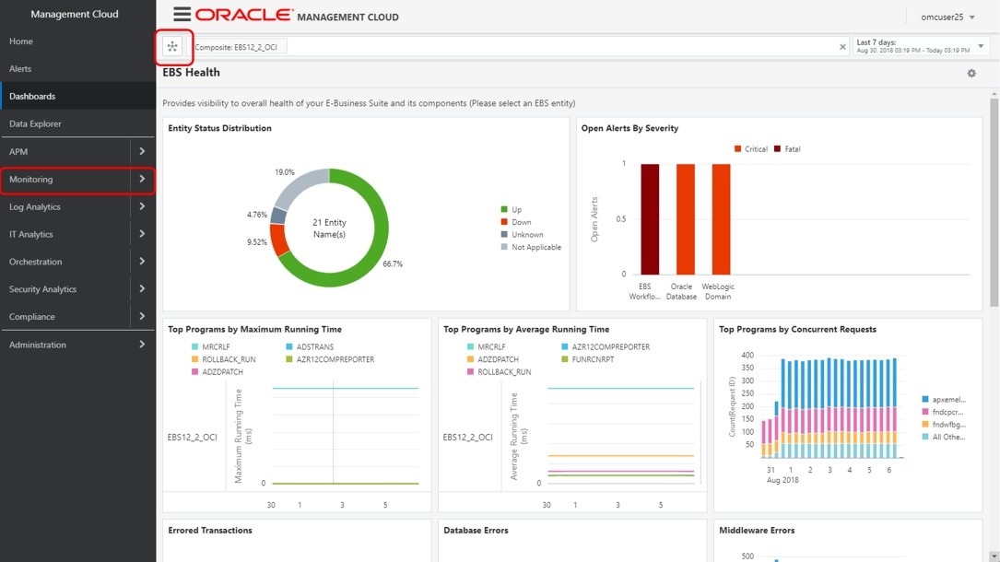

11. Next we will look at the EBS Infrastructure being monitored. Before doing that **Click** on the topology icon to close the topology view and then on the far left **Select** Monitoring from the navigation menu.

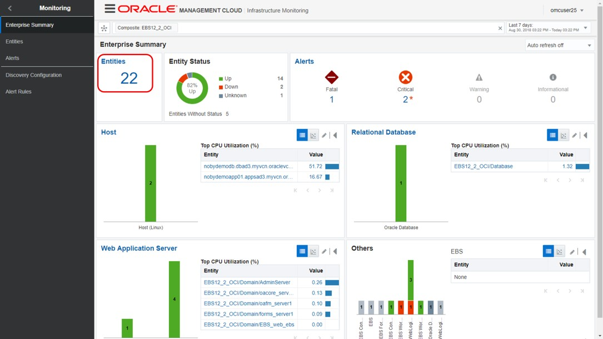

12. On the monitoring Enterprise Summary page is an overall view of monitoring for this EBS composite entity. Next, on the left side, navigate to and **Click** Entities for a detailed view of all the entities associated with this EBS composite.

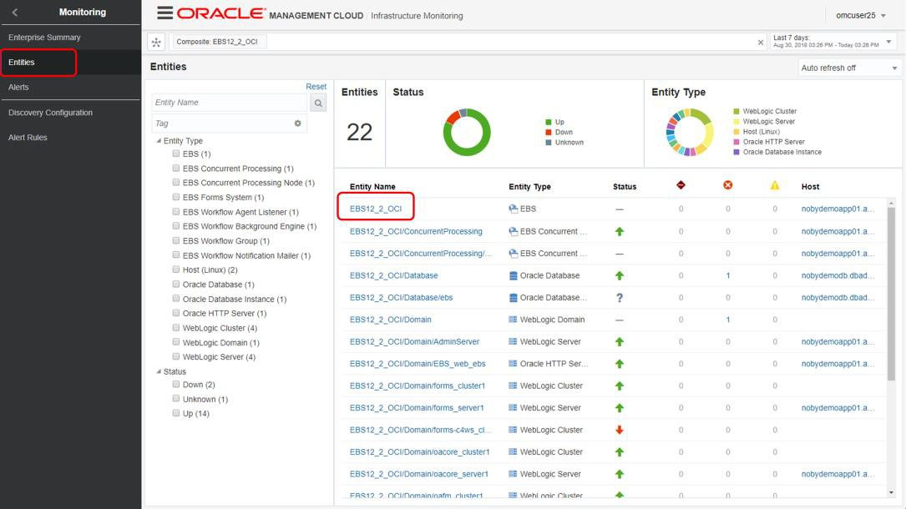

13. View the entity types, the number of entities in each entity type, and overall status. Now **Click** the EBS12_2_OCI entity to drill down into.

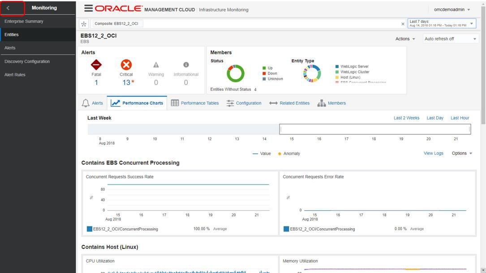

14. Review Key Performance Indicators (KPIs) for the entity: success and error rate of concurrent processing, resource utilization of Hosts, Database, HTTP Server, and WebLogic Server.

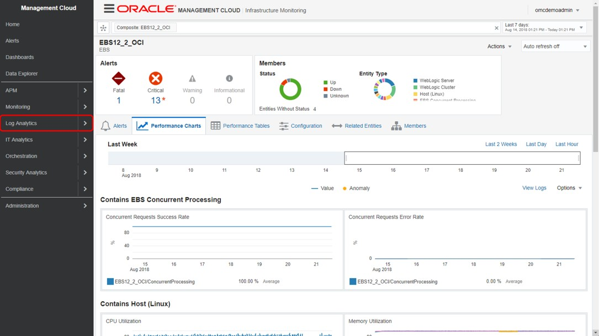

 

 **Lab Activity 2: Identify EBS Resource & Capacity  Performance Bottlenecks using Log Analysis**
======================================================================

**Scenario Details**

 When a problem does occurs, administrators need to diagnose and pinpoint the rootcause wherever it may be. 

**Task**

Isolate root cause of a problem by performing log analysis.

**Learner Goal**

How logs applicable to an EBS environment can be searched and analyzed together using Log Analysis to pinpoint root cause of a problem.

**Value Proposition**

Troubleshooting an application problem, diagnosing whether its the application or the infrastructure that supports it can be like looking for a "Needle in a Haystack". It often result in finger pointing, not resolution because of so many different tools and no “single source of truth”.

**Duration**: 15 mins.
1. From the Navagation selection menu (aka Hamburger menu)  **Click** the arrow icon and **Click** Log Analytics.

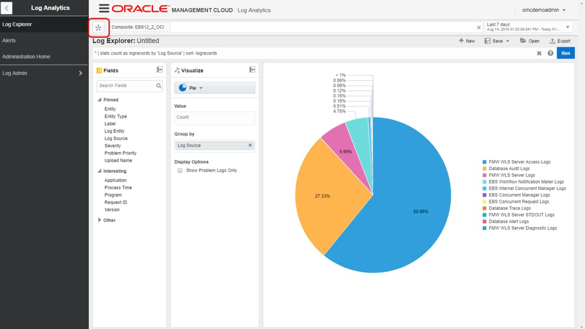

 >You have now switched to Log Analytics which enables you to view all logs associated with this EBS composite entry and drill down for more detail as needed.

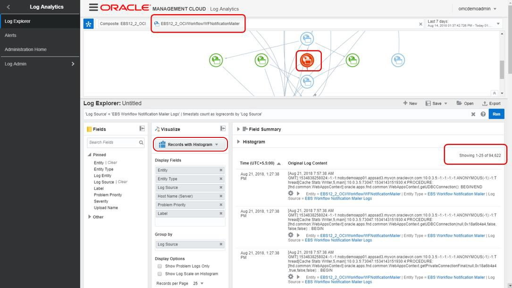

2. On the Log Explorer page goto the Topology icon at the top and **Click** it to gain the toplogy view. Then in the Global Context Bar, just to the right of the Topology icon, locate the Middleware entity *EBS Workflow Notification Mailer* that is down (identified in red) **Click** on it. Next change the default Pie visualization to Records with Historgram by **Selecting** the Records with Histogram dropdown under the Visualize section. That opens the widget in the Log Explorer. Now **Scroll down** from the right and you'll observe that there are 94000+ logs. It's easy to overlook a log or issue that might be leading to a potential bottleneck isn't it? Are you going to look at each and every one of those logs? no. The Log Explorer helps you find the "needle in a haystack" and focus you attention on the key problems.

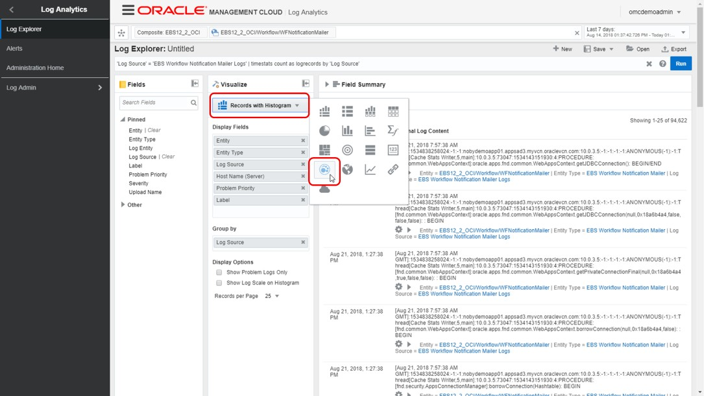

3. Next, under the Visualize section heading, **Select** the Records with Histogram dropdown and then **Click** on the Cluster icon.

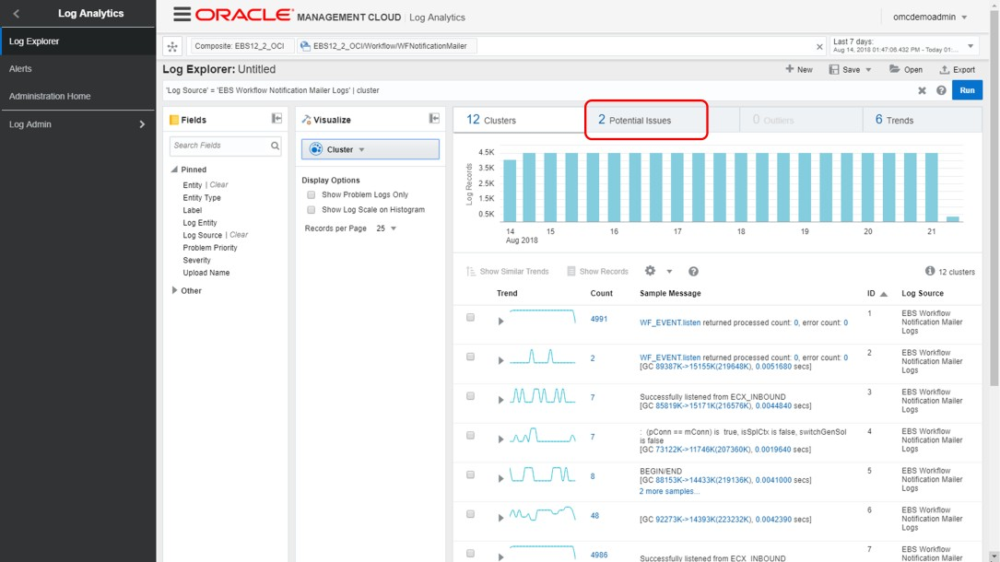

4. The 94000+ logs have now been grouped into clusters and potential issues that need attention have been identified. To view them **Click** the Potential Issues box from the upper middle of the page.

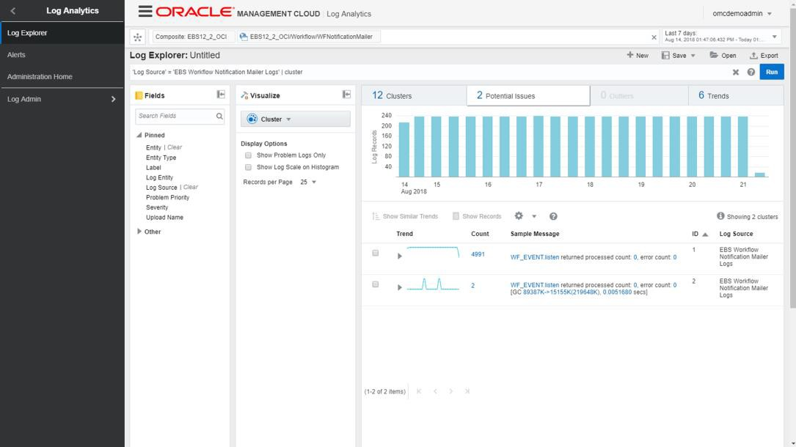

5. You can then drill down into each potential issue identified, isolate them or perform remediations as needed.

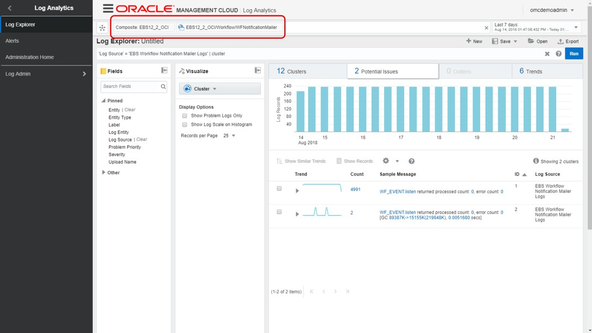

 **Lab Activity 3: View EBS User Behavior, Application Issues and Performance.**
======================================================================
**Scenario Details**

When an administrator gets a report of an application running slow, they need to understand if that is specific to one user or systemic impacting all users.

**Task**

Get application user and infrastructure insight.

**Learner Goal**

How application user and infrastructure insight can be obtained  using OMC Application Performance Monitoring.

**Value Proposition**

Using different point product tools that can only look at a part of an application, components of its infrastructure, its usage provide an incomplete or skewed view subject to interpretation and guessing. Gaining a holistic, complete end to end view of an application eliminates that problem.

**Duration**: 15 mins.

1. Before navigating to the Application Performance Monitor (APM) page, be sure to go to the Global Context Bar, just to the right of the Topology icon (that looks like a snowflake icon) and remove any previous entities you used on the last lab activity.

2. Next from the left navigation menu of the Oracle Management Cloud, **Select** the arrow icon and **Click** APM.

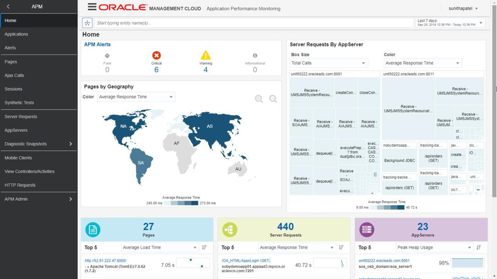

    You will then be brought to the APM Home page.

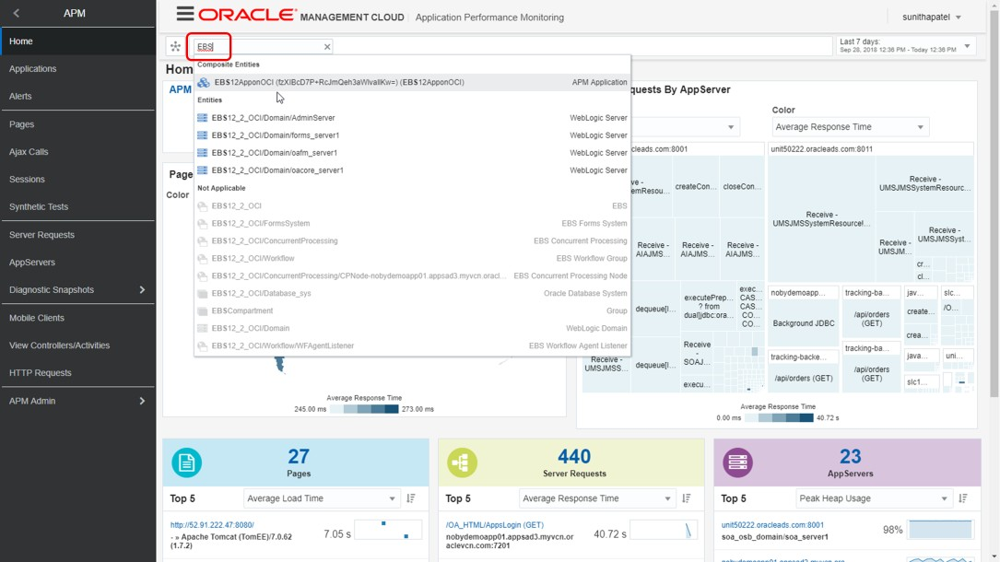

3. In the Global Context Bar, just to the right of the Topology icon, **Type** in *EBS* to search for the *EBS12ApponOCI* entity

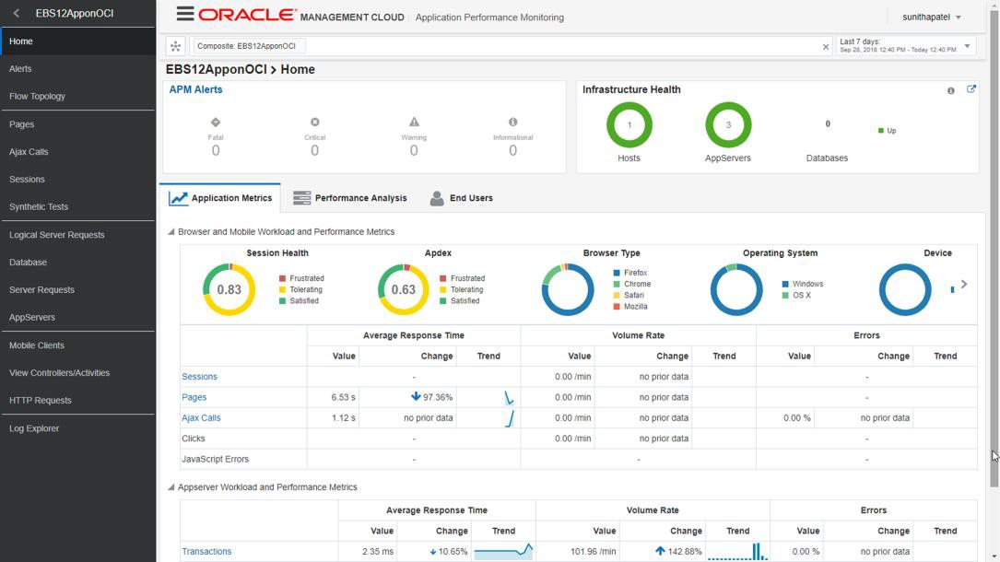

    OMC Application Performance Monitoring enables you to understand an applictions end-user behavior, where users are coming from and whether they are having performance issues or encountering any errors. You can monitor total users, response times, errors and more. It also helps you identify issues in an applications code by identifying top server requests and provides in-context visibility to application server performance.

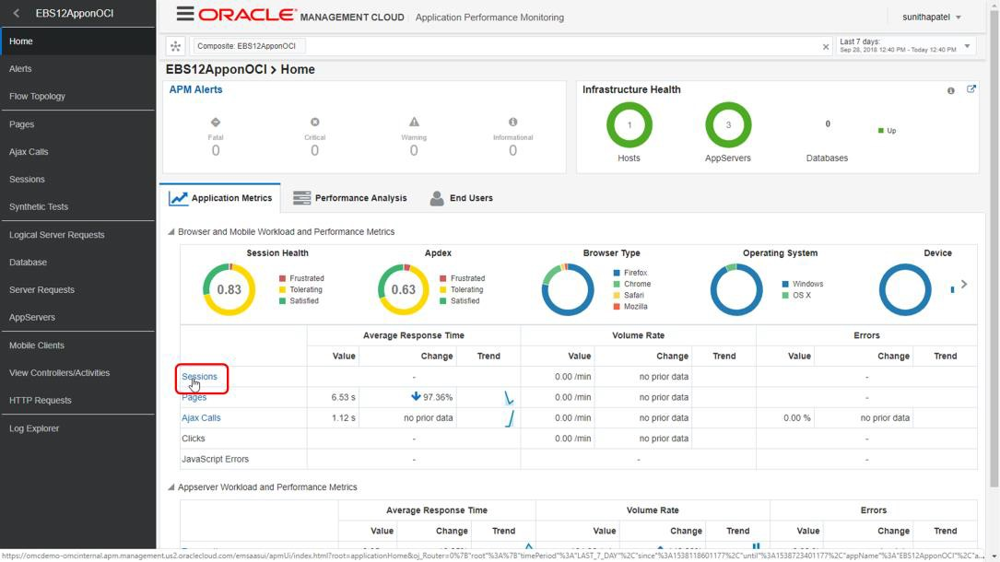

4. On the middle left of the page, just under the Session Health heading, locate and **Click** on Sessions to drill down into Sessions detail.

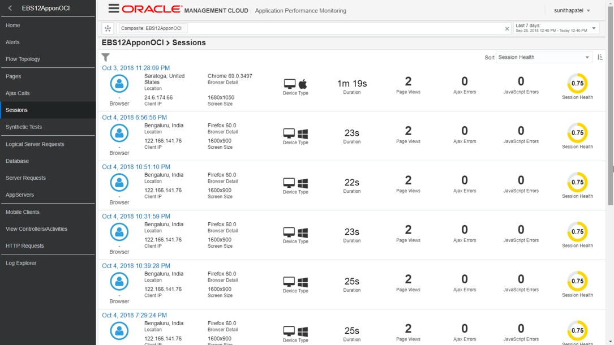

5. Observe key session details like date and time, location, duration and more.

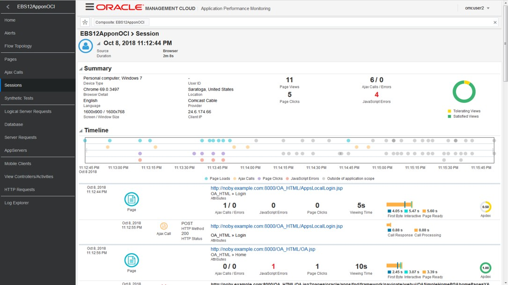

6. **Click** on a session and observe its detailed breakdown of page executions for that specific session.

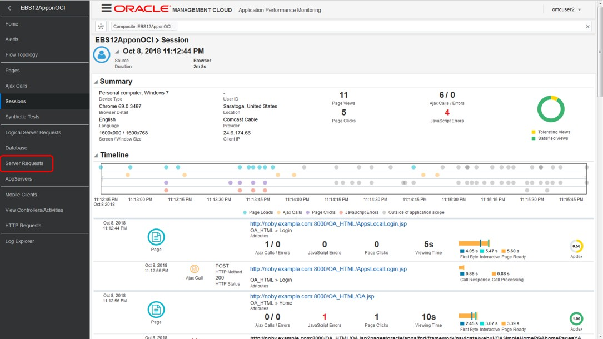

7. Next, move to the middle of the navigation menu bar, to the far left of the page, and **Select** Server Requests.

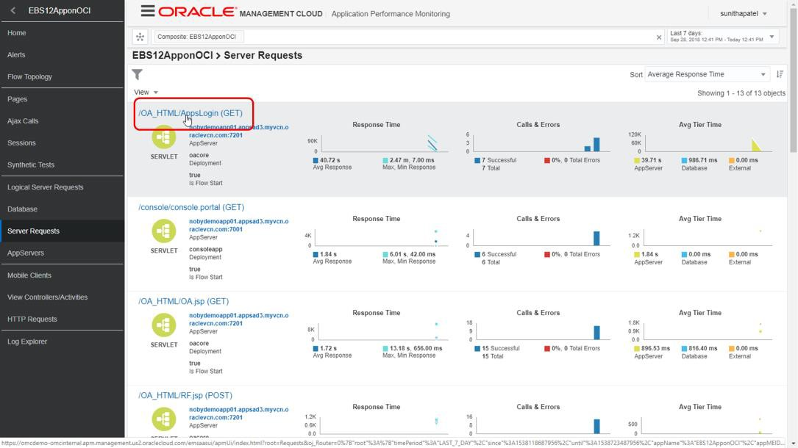

8. See how APM automatically identifies different endpoints associated with EBS such as login page, WebLogic Server console and more. Now **Click** on the drill down on the OA_HTML/AppsLogin (GET) server request to get more details about  requests made to the EBS login page.

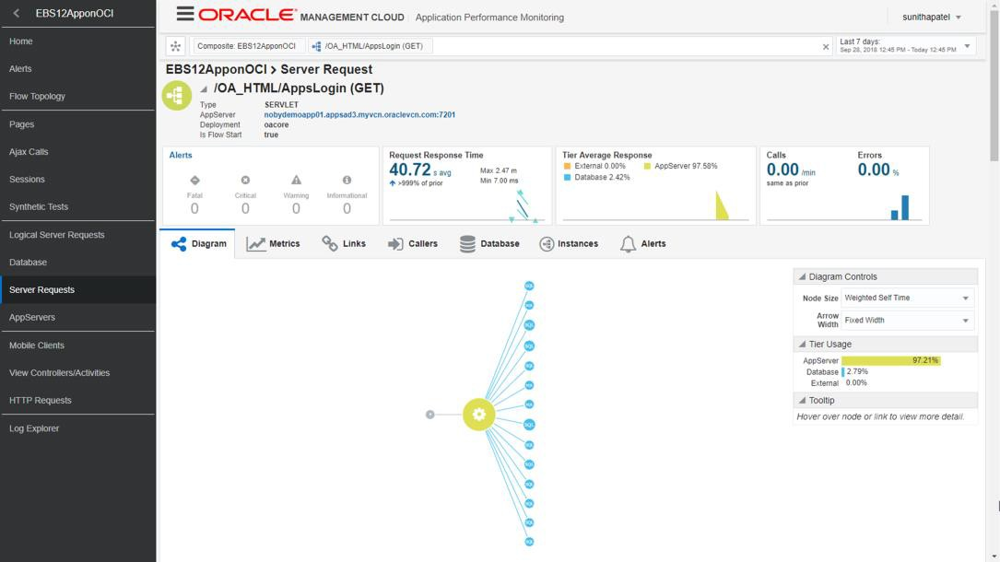

9. This overview provides details on what actions were performed and various database interactions taking place; in the server, in order to process the request. You can view the flow diagram of the server requests and then **Hover** your mouse on any node to get more details.

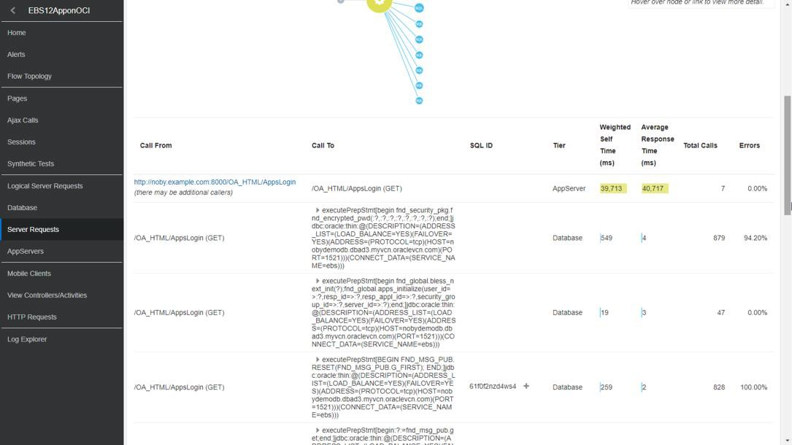

10. On the far right of the page **Scroll** down the page and view more details about the calls.

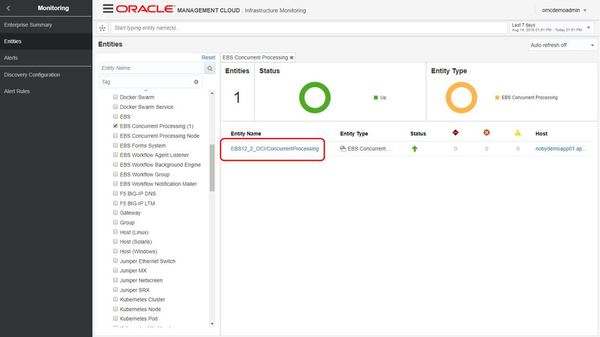

11. Before moving on, in the Global Context Bar at the top of the page, and to the right of the Topology icon, **Remove** the Composite EBS12AppsonOCI and OA_HTML/AppsLogin (GET) server request server request. Then from the navigation menu bar on the left, **Select** the arrow and **Click** *Monitoring* and then *Entities*. Under the Entities heading, look down the list of checkboxes and **Check** the checkbox for EBS Concurrent Processing. Then under the Entity Name heading, **Click** the entity name displayed EBS12_2_OCI/ConcurrentProcessing.

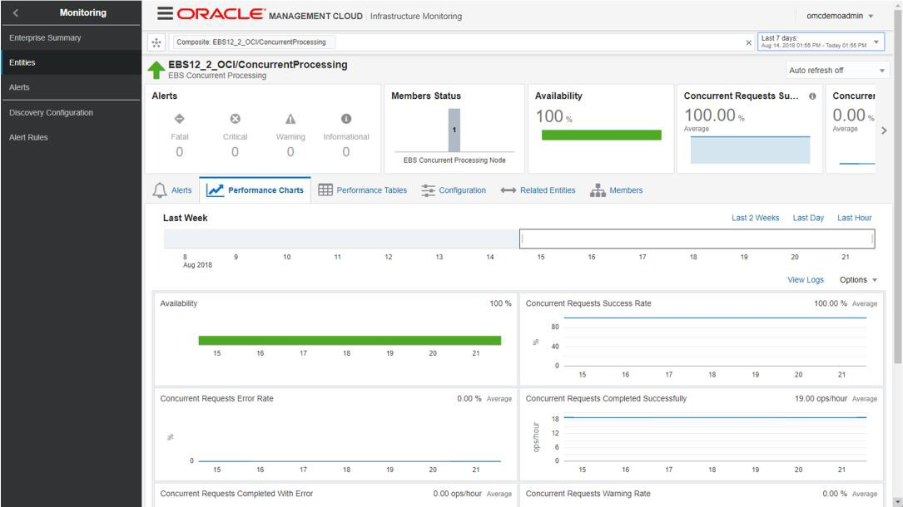

12. Next **Click** the Performance Charts tab found to the right of the Alerts tab. View the availability, success rate and error rate of the concurrent manager.

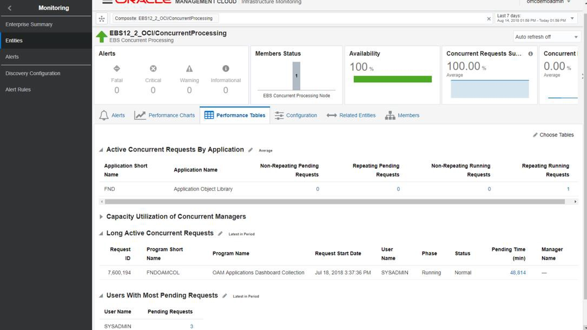

13. **Click** the Performance Tables tab, to the right of the Performance Chart tab and **Expand** the Active Concurrent Requests By Application and observe the repeating
requests on various applications. Then **Expand** Long Active Concurrent Requests to view which user has requests. You will see  the user SYSADMIN has the most requests pending when Users With Most Pending Requests is expanded.

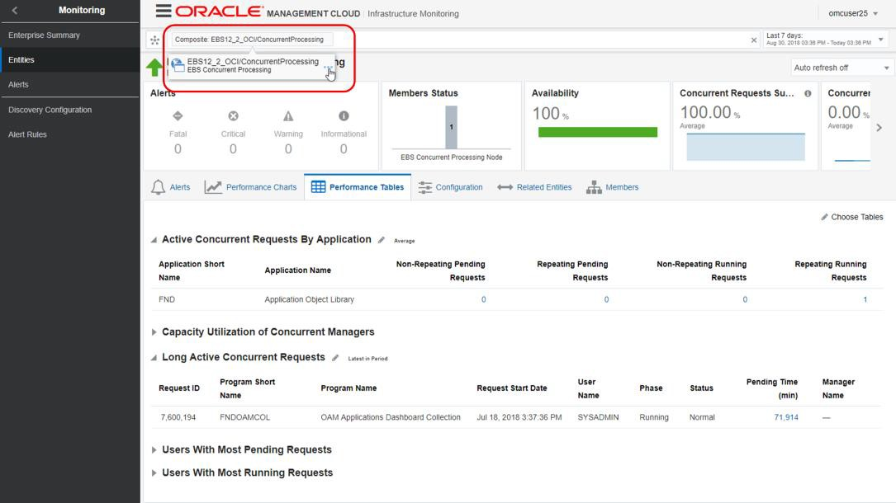

14. Now will switch to the out of the box dashboard for EBS Concurrent Processing. We can access that from the Concurrent Processing entity. **Hover** the mouse over the Global Context Bar, just to the right of the Topology icon, composite and click the 3 dots to open the *EBS12_2_OCI/ConcurrentProcessing* entity. 

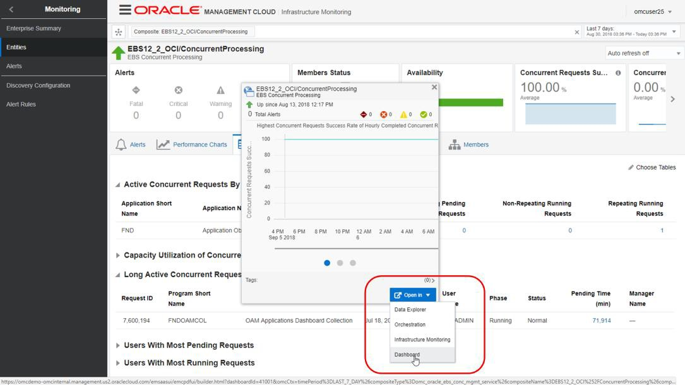

15. In the entity card pop up, in the bottom right corner, **Select** Open In and **Click** on Dashboard. Alternately, you can open the EBS Concurrent Processing Health dashboard directly from the Dashboards page.

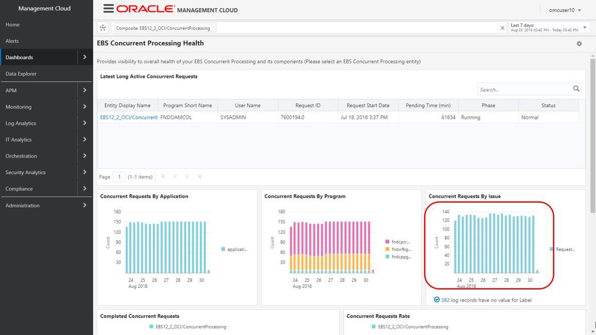

16. View the Latest Long Active Concurrent Requests and make a note of the Request ID (for example 7600194). Then you can search for any logs associated with the request ID’s you noted. You can drill down to the Log Explorer by clicking on any of the widgets. Next, **Click** on Concurrent Requests By Issue pane in the lower right of the page.

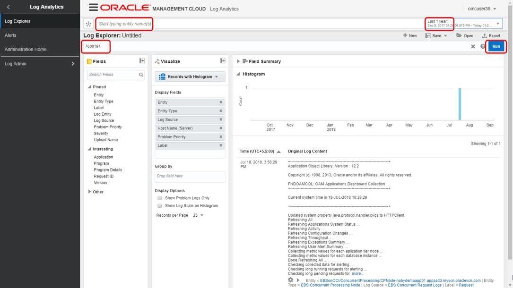

17. Now, remove the composite entity *EBS12_2_OCI/ConcurrentProcessing* and then remove everything in the Log Explorer field. Next, **Type** in the Request ID that you noted  earlier. **Change** the timeline to 1 year and **Click** Run and you will then see the associated log information.

That concludes this lab. To learn more capabilities and information checkout the documentation at https://docs.oracle.com/en/cloud/paas/management-cloud/ebsms/get-started-oracle-e-business-suite-monitoring.html
