1
=

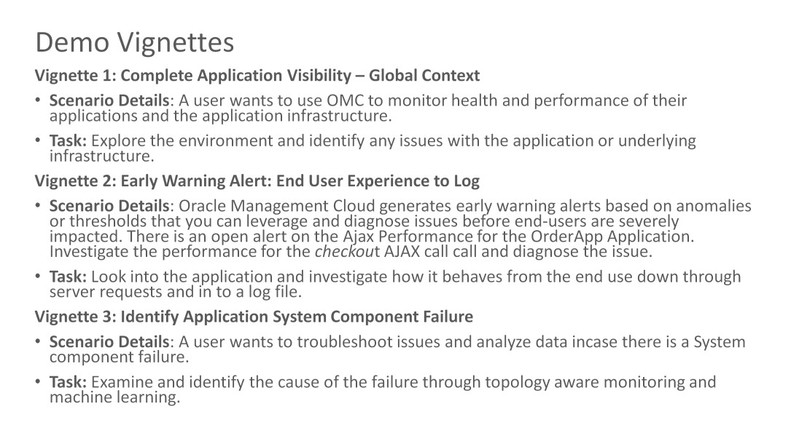

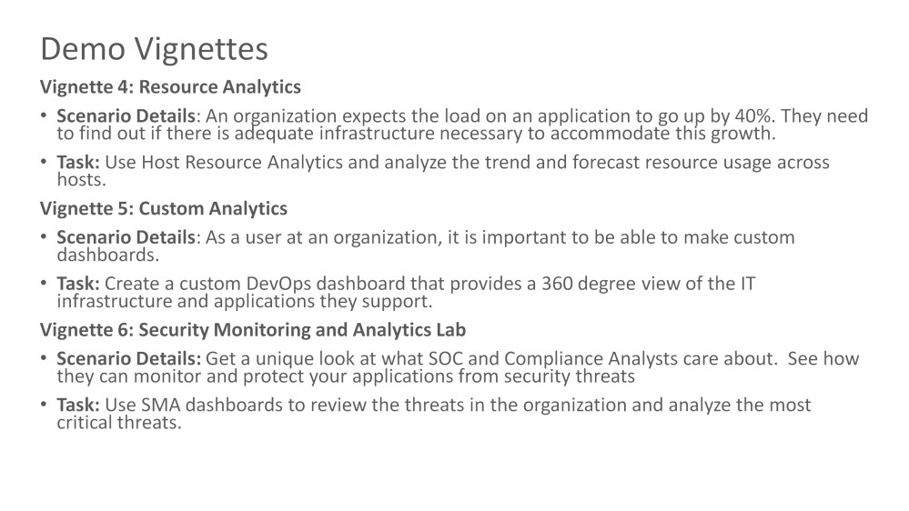

Sign in:

1.  Sign in with your provided Oracle SSO.

2.  Enter the provided [Identity Domain] and click [Go]

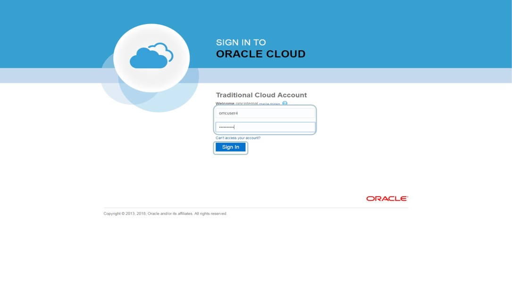

>   Enter the provided [username] and [password] and click [Sign In]

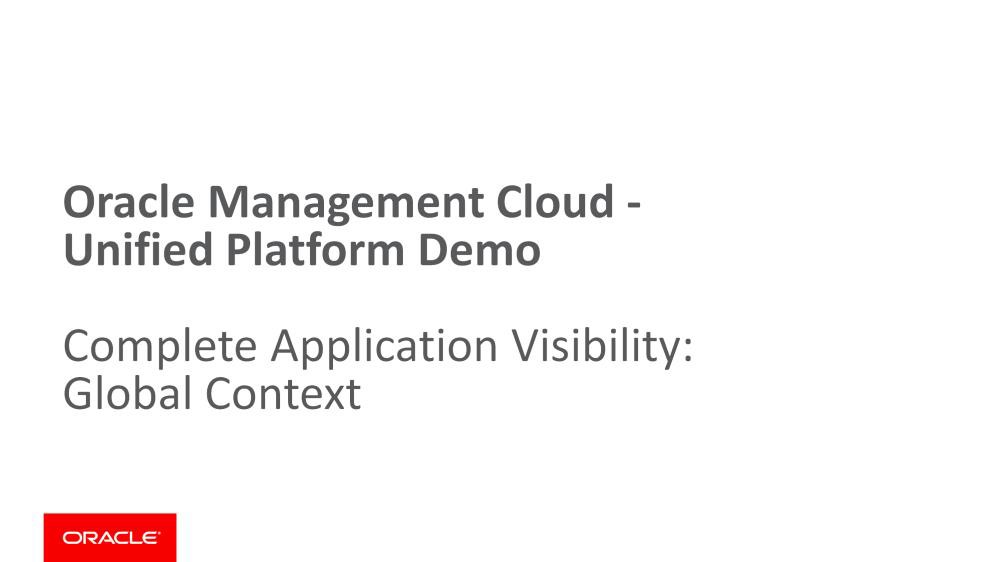

let’s start our demo on complete Application visibility
=======================================================

7

>   This is the OMC landing page showing all the available services. Let’s click
>   on [Dashboards] to start

>   You see a variety of dashboards here. Its possible to create a Custom
>   Dashboard as well.

>   Click on [Application Dashboard]. This has precanned data for an application
>   called “OrderApp”

This is a custom dashboard for an application that provides complete visibility
to application performance, health of components and infrastructure. We see the
full topology of the environment from web server to host to storage all the way
till network switch. Right side, we see the performance metrics like top pages,
entity status etc. Left side you see business metrics number of orders (mined
from logs), average order size – application is uploading this data via REST
API. We have infrastructure level metrics in the bottom like docker container,
load balancer etc.

>   If you do not see “OrderApp” in the **Topology icon \* box (shown in red)**,
>   type it in and hit return.

>   **Browsing tip**: If you do not see the full **Management Cloud** menu (left
>   hand side, in black), it is due to browser resolution. You can always access
>   all these items by “pulling down” from the **Global Navigation Menu** (shown
>   in Blue at very top), sometimes called “**Hamburger**” menu.

>   Next Action: Click on the [**Topology Icon]** (shown in red)

This is the **Global Context Window**. Allows users to carry time and
application/composite context between pages

>   Provide a quick look at application topology and health of entities part of
>   the application Maximize the Window. Click on [Bidirectional Arrow] at the
>   top.

As you can see, this is a simple application that has several Tomcat Servers
load balanced by Oracle Traffic Director and those talk to a clustered Oracle
database with two instances and those connected to two ASM (Storage) instances.
These Tomcat, DB instances run on Linux hosts and the payment gateway run on IIS
that talks to a SQLServer database and these run on Windows machines. All these
hosts are connected to a Network switch.

The topology clearly shows that two entities – two DB and one ASM instance are
down. The application is still running fine because we have redundancies in the
app.

The topology is interactive in nature and you can click on a system component
and associations and view details.

Action: Hover your cursor over SQLServDB2 entity (shown in red here) and click on […] to bring up entity card
-------------------------------------------------------------------------------------------------------------

Hovering a mouse on an entity shows all the adjacent entities that the selected
entity is connected to. It also shows the entity card that provides a quick
health and performance of a managed entity/target such as host or database. You
can use this to view some key metrics and logs for an entity.

In this case, we have hovered over the **Microsoft SQLServ DB** instance and
brought up its entity card. It also shows a relationship to the Payment system
IIS (in the **Middleware** layer) and the Windows hosts that are running it in
the **Host** layer

OMC is very well capable of monitoring resources across the cloud vendors – AWS
as well as Oracle Public Cloud. Here you can see that OMC understand and
monitors the host VM in the Oracle Public Cloud environment (an ec2 internal VM)

Click on the [**Topology]** icon to collapse the full screen view

>   **You have successfully concluded Vignette 1**

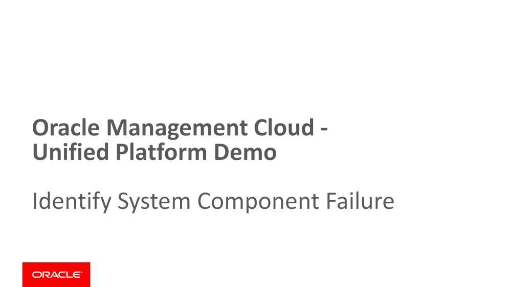

let’s start our demo to Identify System Component Failure.
==========================================================

>   Explore the environment and identify any issues with the application or
>   underlying infrastructure.

15

>   This is again the OMC landing page showing all the available services.

Action: Click on [Dashboards]
-----------------------------

>   **Action: Click on [Application Dashboard].** This has prepopulated data for
>   an application called “OrderApp”. If you do not see that, type in “OrderApp”
>   in the Global Context Window (ie **Topology** window with a \* icon)

Action: Hover over Status window.
---------------------------------

You should be able to see there are some entities (2 or 3) that are down. The
actual numbers may vary for

you since this is an active dashboard

>   **Action: Click on the [Open in Log Explorer] Icon in the Applications Logs
>   tile**. This is the Log Explorer in Oracle Management Cloud and we will see
>   application logs for the complete application infrastructure.

>   OMC supports logs from all types of application and infrastructure
>   components. We support logs for Oracle and non-Oracle components such as
>   such as IIS, SQLServer, etc. **Notice there are 91206 log entries here
>   overall.**

>   **Action: [Click on the Topology Icon] and [Maximize the window]**
>   (bidirectional arrow in right top corner of Topology Window)

We can see the Topology of the Application and Infrastructure as well as all the
Application logs on the same page now. You can hover over any entity and you
will see its status. If you click on one entity, only the logs for that entity
will show up. If you click on a relationship link, then only the logs for that
relationship will show up. **Hover over the “Red” icon in the Storage Tier** to
see that **“OrderAppASM2”** is down.

>   **Action: Click on the [Red Storage Icon]** (bidirectional arrow in right
>   top corner of Topology Window)

22
==

You will notice two things: (1) the number of logs reduced from 91206 to 173
because these are now associated with the selected entity **OrderAppASM2** and
(b) the Global Context in the Topology bar now also has this entity
OrderAppASM2. Which means it is filtering all results now by these two
quantities: first by overall application OrderApp and then by this entity.

We will now use Machine Learning to isolate the errors from this alert set
--------------------------------------------------------------------------

>   **Action: [close the Topology window]** to remove clutter To run Machine
>   Learning’s Clustering algorithm,

>   **Action: Click on [Records with Histogram] tile** and in the options that
>   are presented, **Click on [Cluster]**

>   Notice that the ML algorithm has found 37 Clusters, but more importantly
>   found **5 Potential Issues**.

>   **Action: Click on the [Potential Issues]** tab. You will see the top issues
>   immediately identified and the

>   reason for the Storage Entity being down is a **“Disk Error: unable to read
>   disk”**

Machine Learning is a powerful tool. Even with large number of log entries, it
can effectively narrow down the “needle in the haystack” rapidly.

>   Action: Follow the Red Icon **OrderAppASM2** Entity to the **Host** and
>   click on that host [**slc15axj.us.oracle.com**]

>   Again, as it filters the results further with this new filter (see in the
>   **Topology Window**), the **SCSI error**

>   reported by the Linux Syslog Logs becomes clear. This is the cause of the
>   failure

>   NOTE: The Host slc15axj.us.oracle.com will come up when you hover the host

NOTE: Click the [Topology Icon] and the maximize arrow if it’s not open(\* on
left side of composite orderapp)

You have now successfully completed Vignette 2
----------------------------------------------

>   let’s start our demo to find Early Warning Alert: End user experience to
>   log.

>   Examine and identify the cause of the failure through topology aware
>   monitoring and machine learning. This task combines Infrastructure
>   Monitoring and Log Analytics and applies Machine learning algorithm to
>   isolate errors.

27

>   This takes us back to the OMC landing page showing all the available
>   services.

Action: Click on [Dashboards]
-----------------------------

>   **Action: Click on [Application Dashboard].** This takes us back to canned
>   data for **“OrderApp”.**

>   If you don’t see OrderApp in the Global Context (Topology) bar, then type it
>   in there

>   **Action**: If the Navigation menu is not visible, then **click on the
>   Global Navigation Menu (Hamburger Menu)** and **Click on [APM].**

NOTE: Please use a new browser tab for APM demo flow
----------------------------------------------------

>   This will take us to the APM Home page for **OrderApp**

>   *It is important to remember in this exercise that since the APM data is
>   “live” streamed, some of the data will look different than what is shown in
>   these screenshots. Please pay more attention to the steps, rather than the
>   exactness of data displayed by the widgets.*

>   **Action: Click to change the time to view data to [Last 24 hours]**

Here you see both Browser side as well as AppServer side Workload and
Performance Metrics. In order to troubleshoot issues on the Client side, we
would typically deep-dive into Pages and AJAX calls. For server side, we would
look at Server Requests and Transactions.

Application Performance Monitoring enables you to track AJAX errors in your
applications, monitor AJAX interactions and find and resolve issues.

>   **Action: Click on [Ajax Calls]** from the Navigation Menu (you may have to
>   go through Global Navigation Menu)

You can see the Response time, Calls & Errors for all AJAX calls on this page.
By default, it displays 25 entries (but you can get more, click on “View”) We
will zoom in one likely culprit.

>   **Action**: Click on **[checkout]** item shown

You can see all the details associated with the call to checkout. See the
Timeline metrics, AJAX call Response tie, Response breakdown, Successful calls
and Errors

>   The **Topology “Global Context” area** now includes filter for **checkout**
>   in addition to **OrderApp**. This means we will now focus data for the
>   **checkout** context.

>   You can hover over any data point on the timeline metric and you will get
>   more details (shown).

>   **Action: Click on [Anomalous Periods] and [Average Response time].** The ML
>   algorithm might some anomalies. These Anomalies are based on learned
>   patterns and not just on defined boundaries. However, depending on the data,
>   it may not find anomalies either.

**Action: Click on [Geography]**. This will show you where the calls are coming
from. In the Color pulldown menu, you can see various options by which you can
view this. **Action: Click on [Total Calls]**. You can see the breakdown by
Geographic areas, also in terms of which Browsers were used to access and which
OS/Devices were used

Action: Click on [Server Requests]
----------------------------------

You must monitor http requests to see how your application behaves as load
varies. We can assess server- side performance down to the operation and method
level.

>   The **Server Requests tile** shows the Response time, Calls & Errors and
>   Average Tier time.

Action: Click on [checkout]
---------------------------

Examine the data available on the page. You can see the aggregate path the
**checkout** software request took through the **OrderApp** application. APM
dynamically discovers the flows of requests and their calls through the
application infrastructure. See also how things such as performance and errors
are related to the calls.

>   **Action: Click on [Instances].** An Instance is a Sampling instance. Often
>   there are many so we’ll need to filter by some criteria

This shows recent executions of this server request. For each execution
instance, we see the total execution time, broken down by time spent in each
tier (app server, database), as well as count of errors seen. Let’s look at the
instance that shows an error in the Status column so that we can investigate
further.

>   **Action: Locate an Instance that shows error status** (as shown above, but
>   you may have to scroll down a bit) and **click on its [Start Time]**

Examine the data on this page. Drilling down to this request instance, we can
see exactly the flow of operations that the checkout call took.

The Call Tree tab shows the details, including the stack trace of this instance.

Notice that there was an error found during its execution. Let us check the
health of the app server to see if we can figure out where the error came from.

Action: At the top of the page, click on the [AppServer name: slc15axj.us.oracle.com:8081]
------------------------------------------------------------------------------------------

We are now looking at AppServer data for a Tomcat instance. See the amount of
resources (CPU, Heap Memory, Time in GC, Response Time, Load and Log Messages)by
this **Tomcat AppServer**. At first glance nothing seems unusual, but lets use
**Infrastructure Monitoring Service** of OMC to review the AppServer Performance
in more detail.

>   **Notice: Global Context (Topology) Section** at top contains both
>   **OrderApp and Tomcat AppServer.** This context will transfer to
>   **Infrastructure Monitoring** too

>   **Action: Click back** through the **OrderApp Menu** to go back to **APM
>   Menu** and back out of that to **Oracle Management Cloud Menu** and select
>   **“Monitoring”**

(you may have to go through the Global Navigation – Hamburger – Menu to get to
this)

1.  Click on [OrderApp]

2.  **Click on [APM]**

3.  **Click on [Monitoring (Management Cloud Menu)]**

Notice how we have seamlessly transferred into another service and maintained
the Global Context during the transition.

**Action: Click on [Performance Charts].** See all the metrics: Availability,
CPU utilization, Web Request Processing Time, Web Request Rate, Open HTTP
Sessions, Heap Usage, JDBC Connections in Use, Active Threads and Memory Usage.
You can get a complete understanding of the entity in one simple page. The
service uses ML to detect anomalies. See if you can spot any: they are usually
in orange dots (shown above)

>   **Action: Locate the charts Options Menu (right side, middle) and Click on
>   Show Baselines.** The baseline will now appear in gray area in the charts.
>   You can hover your mouse over datapoints and see their value and expected
>   baseline range

>   **Action: In the same Options Menu, Click on [Choose Metrics].** Lets look
>   at other Performance Metrics

You can see the possibilities of the kind of metrics you can select. You can add
others that are not already present in the default presentation. You can also
reorder them for your convenience.

>   **Action: Click on [Memory Utilization] and move it under CPU utilization.
>   Click [OK].** This is just for your convenience. In reality we don’t see a
>   big performance issue on any of the metrics shown here. Lets explore a
>   different approach; we need to look at application logs to understand
>   behavior in greater depth.

Let us look at application logs to understand behavior in greater depth.

>   **Action: Click on [Cancel]** in the ”Choose Metrics” menu.

>   **Action: Click on [View Logs]**. This will take us into another OMC service
>   called **Log Analytics** and again, the

>   **Global Context** will be seamlessly preserved.

**Log Analytics** is an important service since by default Applications generate
regular (and considerable) logs for transactions, error and alerts. Notice here
that we have about 132K entries coming from the **Tomcat** related logs in the
**OrderApp** Application. Notice also, that we have preserved the **Global
Context** here (shown in blue here)

100K entries is still too much for us to manually look at. So, lets use ML
(Machine Learning) to get to anomalies, using Clustering.

Action: From the Visualize Section, click on [Records with Histograms] and select the [Cluster Option]
------------------------------------------------------------------------------------------------------

>   The **Machine Learning (ML) engine** of **Log Analytics** reduced about 132K
>   entries into **10 Clusters**, making them more manageable. But it also
>   signalled **5 Potential Issues** that are worthy of further investigation
>   and **3 Trends**. (If there were **Outliers**, these would be “one-off” data
>   points that might be the “needle in the haystack)

Examining these issues, eg. Looking at **Potential Issues** here can pinpoint
problems with this AppServer

You have now successfully concluded Vignette 3
----------------------------------------------

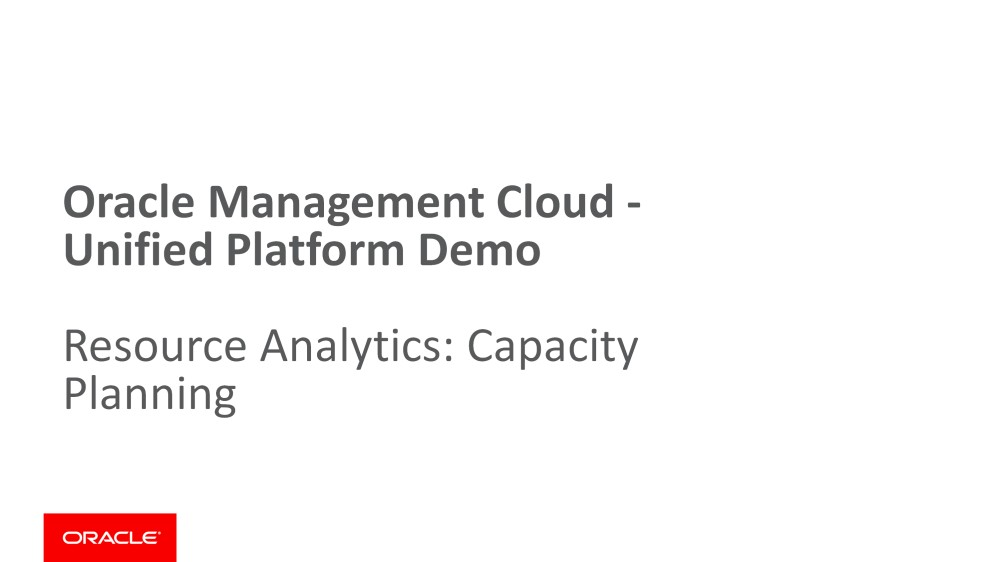

>   So let’s start our demo to plan Resource capacity and Analytics.

>   Look into the application and investigate how it behaves from the end use
>   down through server requests and in to a log file. This is a deep-dive
>   investigation. We will start with the Application Performance Monitoring
>   service (APM), then transition into Infrastructure Monitoring to understand
>   the performance of an AppServer and then go to Log Analytics and use ML to
>   find the root cause of the problem.

47

>   This takes us back to the OMC landing page showing all the available
>   services. **Action: Click on [Dashboards]**

Action: Click on [Host Resource Analytics].
-------------------------------------------

Oracle Management Cloud allows you to perform resource analytics for either
specific application, hosts in private cloud or all hosts for enterprise
application. You can see resource usages for all hosts. Resource Analytics
provide aggregate resource availability and usage, identifies servers with high
and low utilization (right side).

Action: [Change settings to “Last 90 days”]
-------------------------------------------

>   Notice also from the **“Systems Projected to Reach High Utilization”** how
>   much CPU or Memory Headroom there is left. **There are 16 systems with Low
>   Utilization**

>   **Action: Hover over the hosts in the “CPU and Memory Utilization”** to see
>   this for any host (also shown in red here) in the **scatterplot**

>   The bounds for CPU and Memory Utilization are set at 75%. These can be
>   adjusted by users.

>   Let us now explore systems that are high in utilization.

>   **Action: In the Inventory Widget, hover over Hosts** (top left) and see
>   **Utilization for system hosts** by

various criteria (thus: high and low cpu/memory utilization)

Action: Click on the [High CPU and Memory (16 Hosts)] in Inventory section (click on the [number 16])
-----------------------------------------------------------------------------------------------------

This will bring us to (CPU and Memory) Utilization view for all Hosts with
chosen criterion. This colorful view is a “**Loadmap**” view, which shows at a
glance which systems have their loads increasing (red) and decreasing (green).

>   **Action: Hover over any host (Shown here: biz-app-srv5)** and notice its
>   cpu and memory consumption is increasing.

>   **Action: Click on other views, like the [Timeline] view** shown in the
>   Utilization panel to get a timeline view of consumption.

>   **Action: Click on [Group By] both for Memory and CPU** and notice that you
>   can group them by various attributes such as “Target Version”, “Cost
>   Center”, ”Operating System” and “Lifecycle Status”

Next, we will learn to forecast CPU and memory utilization over longer than the
default (30 days) shown here

>   **Action: Click on [biz-app-srv5]** and scroll down a bit to see the CPU and
>   Memory Findings

>   **Action: [Change the Settings to 365 days] and Click on [Run]** and see the
>   forecast (projected) usage over the next year. There are also different
>   Regression Models offered, you can pulldown the menu and see the list.
>   Please change the regression model to “**Linear**” and click on “**Run**”

Action: [Analyze this page.]
----------------------------

The **Linear** regression model gives you a forecast for both memory and CPU
usage for this host based on

your usage pattern in the past.

>   **Action: Go back to the top of the page and select** [**Projected to
>   Maintain Low Utilization].** This will now select systems that have low
>   projected utilization. The system that it picked by default is shown here.

Action: Go to Settings, change [time period to 365 days as before] and Click [Run].
-----------------------------------------------------------------------------------

You will now see that this system will continue to have enough headroom for the
next year and would be a suitable system to host other applications

You have now concluded Vignette 4 successfully!
-----------------------------------------------

>   let’s start our demo on widgets and customized dashboards.

>   Create a new Widget and then Create a custom DevOps dashboard that provides
>   a 360 degree view of the IT infrastructure and applications they support.
>   Understand the variety of data, data sources and visual tools that can be
>   shown on the custom dashboard

56

>   Stay within the same context as the previous exercise (Vignette).

>   **Action: Select [Data Explorer] from the left side of the Global Navigation
>   Menu** (you may have to go to

the Global Navigation, aka Hamburger Menu to reach this, depending on your
browser)

Action: [Delete any Entity selections you might have in the Global Context (aka Topology) section]. Use the x shown above to remove the entity,
-----------------------------------------------------------------------------------------------------------------------------------------------

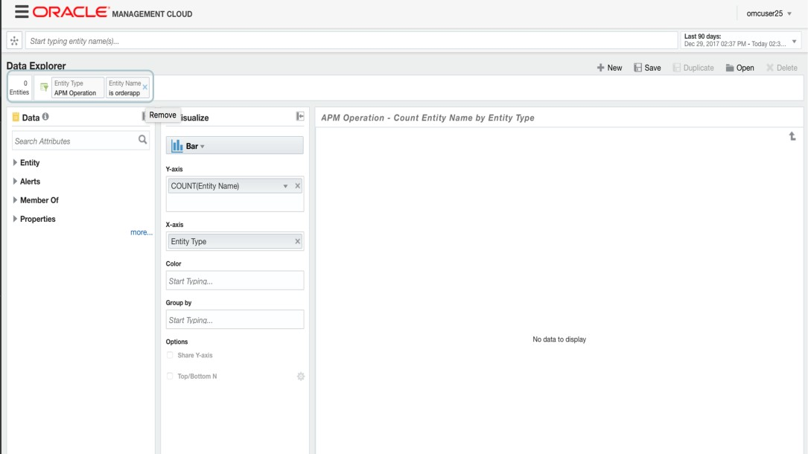

>   **Action: [Delete any Entity selections you might have in the Global Context
>   (aka Topology) section]. Use the x shown above to remove the entity**

Data Explorer allows users to perform several advanced analytics such as
trend/forecast, correlation, seasonal analysis, categorical analysis, etc. As
you can see Data Explorer supports several visualizations such as line, bar,
heat map, donut chart, pareto chart, area chart, etc.

Action: Select the [Scatter Chart]
----------------------------------

>   **Action: From the Entities box at the top, Type in [Host] and select [Host]
>   from the pulldown menu**

>   **Action: In the box for X-axis, type [CPU and select “CPU Usage (CPU)”]**

>   After selection it will say “AVG(CPU Usage) under X-Axis

Action: In the Y-axis box, type “Memory” and Select “Memory Usage”
------------------------------------------------------------------

>   Again, it will say “AVG(Memory Usage)” on the Y-Axis

This creates a scatter chart for (Average) CPU Usage vs. (Average) Memory Usage
for each of the entities. You can hover over any host and gets its Name, CPU and
Memory Usage. You can Click the “**Save**” button at the top right and save this
chart, *but do not do this, for now*

You can custom create your own charts in this fashion.
------------------------------------------------------

>   **Next, we will create a Custom Dashboard.**

>   **Action: For this, go back via the Global Navigation Menu to the Main Menu
>   and Click on [Dashboards]**

>   **Action: Click on [Create]** to create a new Dashboard**.**

>   **Action: In the Pop-up, Select “Dashboard (a single dashboard)”** and fill
>   in a name for this dashboard and a short description**.**

Action: Click on [Create]
-------------------------

>   OK, this creates a Custom Dashboard template. Now we will drop two widgets
>   into this.

>   **Action: Under Add Content (right side) box in the** *Search widgets*
>   **Search bar, type “Host” and Select “Host – Avg CPU Usage by Avg Memory
>   Usage and Entity Display Name”** and drag it anywhere on the dashboard as
>   shown here.

Action: Add [Order Trend] by typing Order into the [Add Content box]. Drag and Drop the widget on the Dashboard where you would like to see it.
-----------------------------------------------------------------------------------------------------------------------------------------------

In this manner, you can explore from a full collection of dashboards, which
widgets you would like to display.

>   *Do not save this Dashboard as it is a common area and there might already
>   be one by the same name*.

>   **You have successfully completed Vignette 5**

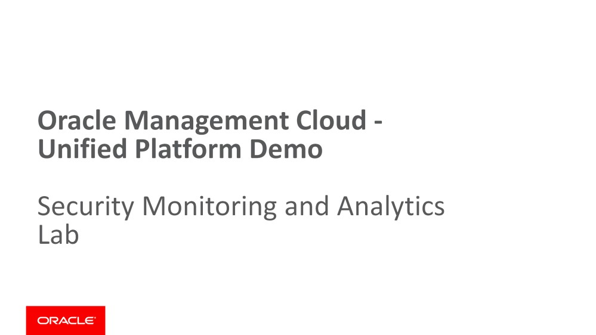

>   let’s start our demo to check security monitoring and analytics.

>   Use SMA dashboards to review the threats in the organization and analyze the
>   most critical threats. You will also learn how User and Entity behavior is
>   leveraged to assign threat vectors to identities and locations.

70

>   This is the OMC landing page showing all the available services.

Action: Click on [Security Monitoring and Analytics] Icon to run the SMA Cloud Service.
---------------------------------------------------------------------------------------

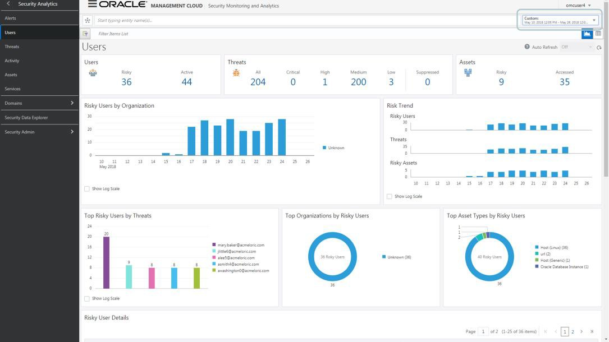

This is the main SMA Landing page showing the “Users” Dashboard. People want to
analyze by common vectors such as users and most modern threats are targeted via
users today. So let’s start reviewing the threat environment by further drilling
down into Users.

Action: [Change the date to “Custom” (right top corner in red) to “10-May-2018 to 26-May-2018”]
-----------------------------------------------------------------------------------------------

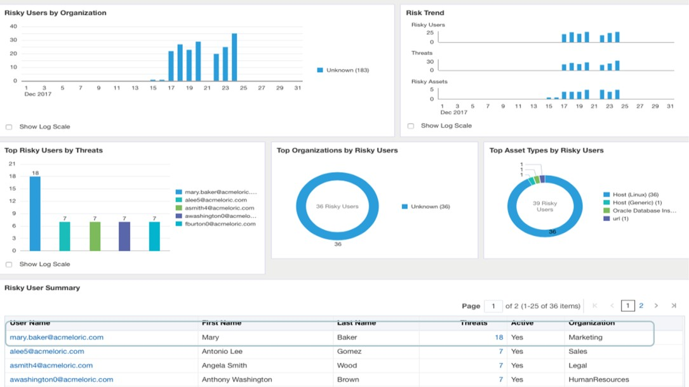

Scroll down and look at “Risky User Summary”. From this list, we can see that
user <mary.baker@acmeloric.com> (Mary Baker) has highest number of threats. She
is an active user from the Marketing department. Given Mary has the highest
number of threats, let’s investigate this user further.

Action: Click on [<mary.baker@acmeloric.com> ]in the User Name column
---------------------------------------------------------------------

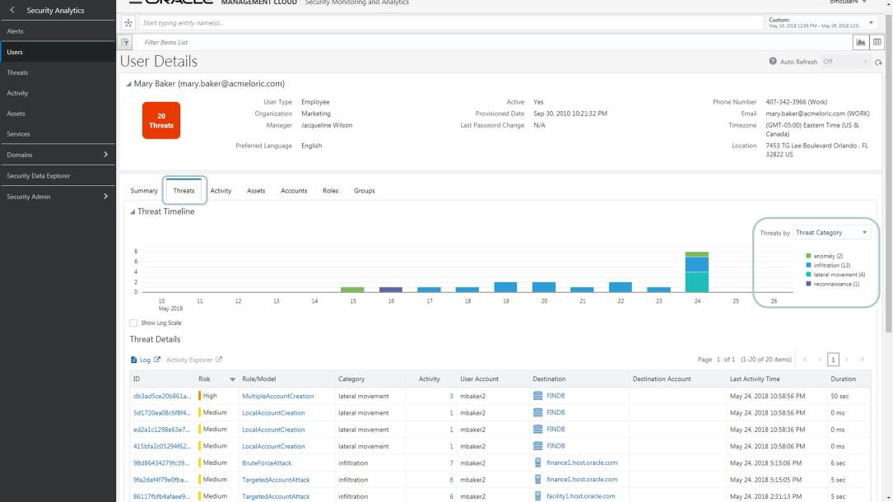

>   **Action: Click on [Threats tab]. [Change the Threats by (pulldown) to
>   “Threat Category”].**

>   Here you see all the credentials for Mary Baker, plus a transactional record
>   of all threats recorded in her

name.

This is the **“Kill Chain”** in action, defined in terms of Reconnaissance,
Infiltration, Lateral movement, Anomaly Actions (Data Stealing), Extraction

>   Look at these actions in timeline sequence from bottom to top to see the
>   progression of the attack. Let’s look at these threats in more detail.

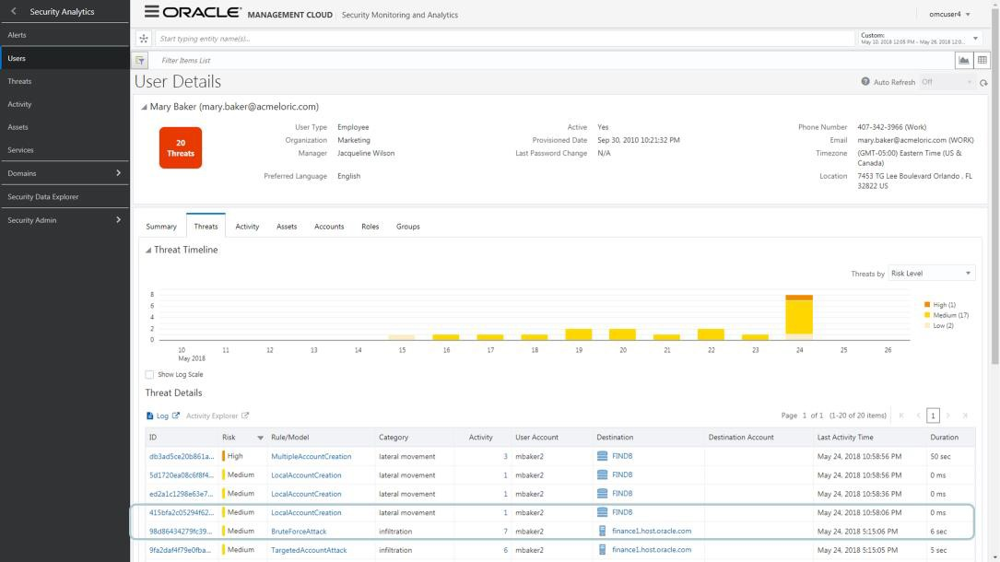

We see two interesting anomalies: **LocalAccountCreation** and
**BruteForceAttack** on the finance database– this is an SQL anomaly that shows
that attacker is doing some unauthorized or anomalous transactions on the
associated asset FINDB. A Marketing person being on a Financial DB is an
anomaly. SMA’s unique SQL anomaly detection was able to detect this which could
have been easily missed with other signature based solutions. The
WebAccessAnomaly is also obviously rogue

Action: Click on [ID-98d864329fc39]
-----------------------------------

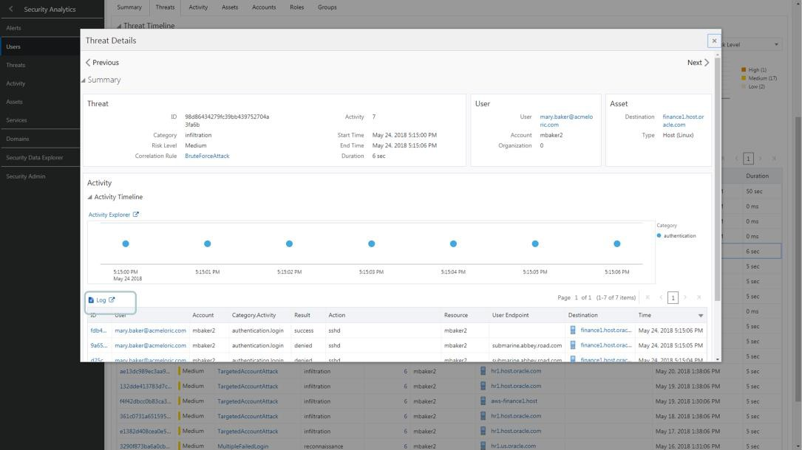

A read access operation on FINDB was successful. Let’s now go to Log Analytics
to see what Action or SQL statement was executed and if it fit the profile.
Clearly, it is suspicious that Mary Baker’s actions are not in line with her
colleagues in accessing the Financial DB .

>   **Action: Click on the [Log Icon].** This will open in a new tab

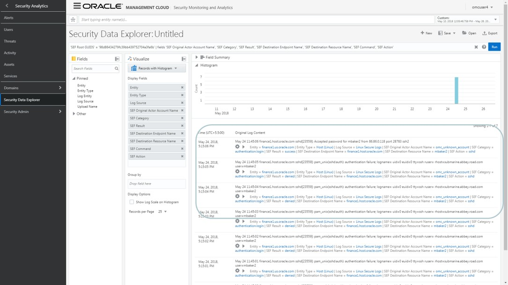

It brings up the original log content and you can see that there is a “Select \* from USER_HISTORY” query being made by the user (mbaker2) which was detected as anomalous by using machine learning within SMA. A peer group baseline for the user (mbaker2) was created here and then mbaker2 doing a SELECT \* query was determined to be anomalous as it’s not normal to execute this query by marketing users.
===================================================================================================================================================================================================================================================================================================================================================================================================================

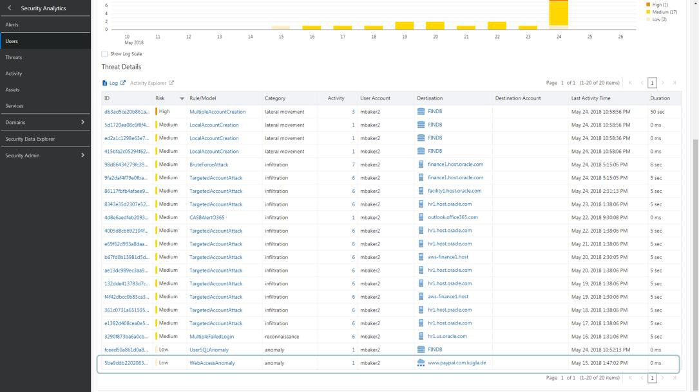

>   Now, lets go back to the previous tab with all the threats.

>   **Action: Click on [WebAccessAnomaly]** (last entry that says paypal.com)

The Threat details brings up this particular Activity. This seems like a rogue
web site (the full name: paypal.com.kugla.de looks suspicious)

Action: Click on [Log] to go to Log Analytics to get access details
-------------------------------------------------------------------

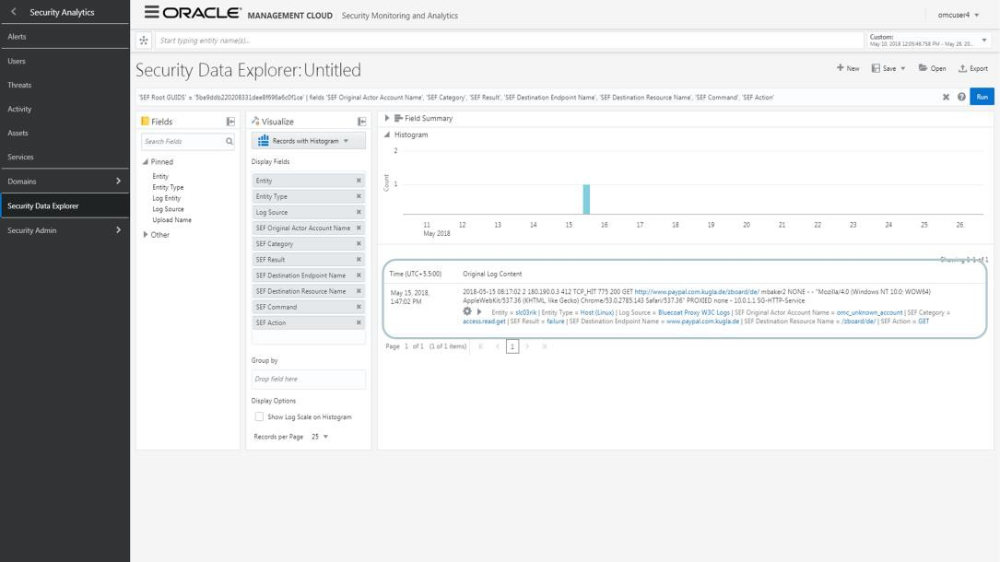

>   Activity Details would show that mbaker2 visited a rogue site
>   (paypal.com.kugla.de) – this could have been part of a spear phishing attack
>   that led to his machine getting infected with malware. As a SOC analyst you
>   might now want to see the corresponding log data and also who are the other
>   users in your organization that might have visited this site. For this, you
>   can pivot to Log Analytics and run the query.

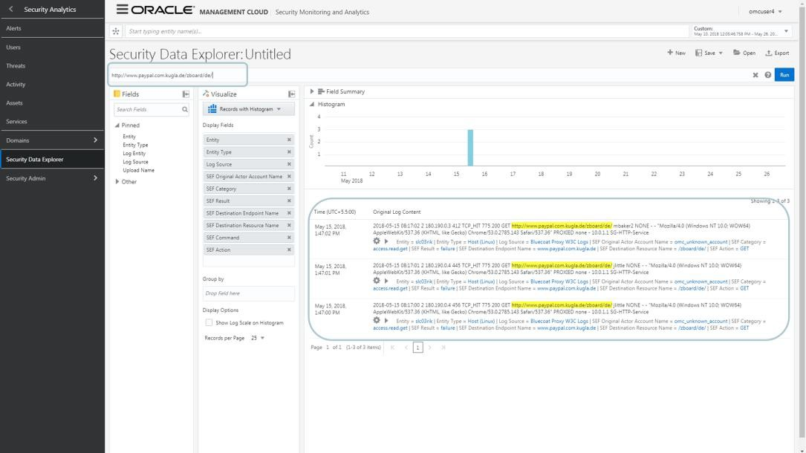

>   Action: Into the log explorer query tab, type:
>   <http://www.paypal.com.kugla.de/zboard/de/>

Log Analytics query results shows 2 results – one for user mbaker2 which we are
investigating. However, another user “jlittle” shows up as well. So SOC analyst
not only ended up investigating the threat on user mbaker2 but also discovered
another user jlittle for which we can now proactively take some action and
prevent the attack much earlier in the kill chain.
