# Oracle Hands-On Lab

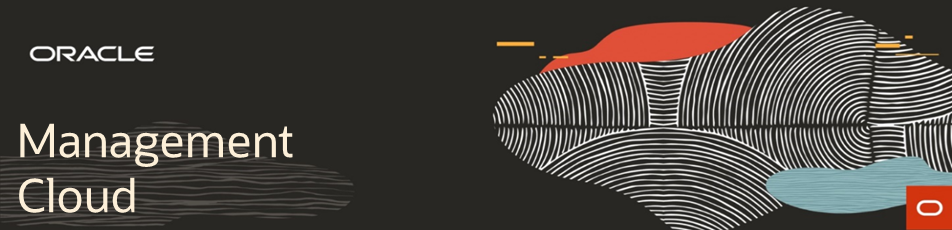 

**UNIFIED APPLICATION INFRASTRUCTURE VISABILITY, DIAGNOSTICS, AND CAPACITY using OMC** 
================================================================

In these hands-on lab activities, learn how to monitor and explore health and performance of applications utilizing Oracle Exadata infrastructure. Diagnose an end-user issue to back-end infrastructure. Identify an application system component failure. Find out if there is adequate infrastructure capacity to accommodate growing application workload and setup a dashboard for DevOps with a 360 degree view of the IT infrastructure and application they support using Oracle Management Cloud (OMC).

=============================================================

Lab Exercise Persona
--------------------
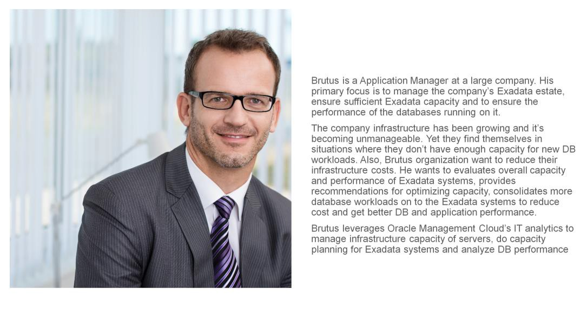
Brutus is an Administrator and his job depends on him staying on top of the health of a number of  loosely coupled applications deployed across his company on Oracle Exadata’s back-ends. After Development pushed a new release out, business operations came to a standstill, so he also needs to prevent any application workload from overloading capacity ever again.

**NOTE**: Use Google Chrome to perform the lab for the best hands on experience

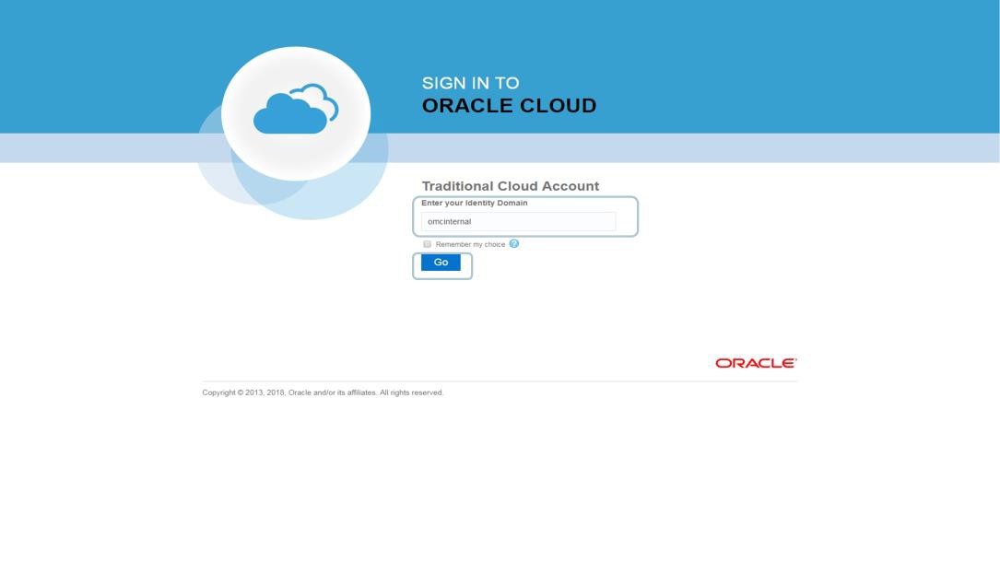

First, you need to get logged in to the Oracle Cloud. [Enter the Identity Domain], then **Click** the Go button.

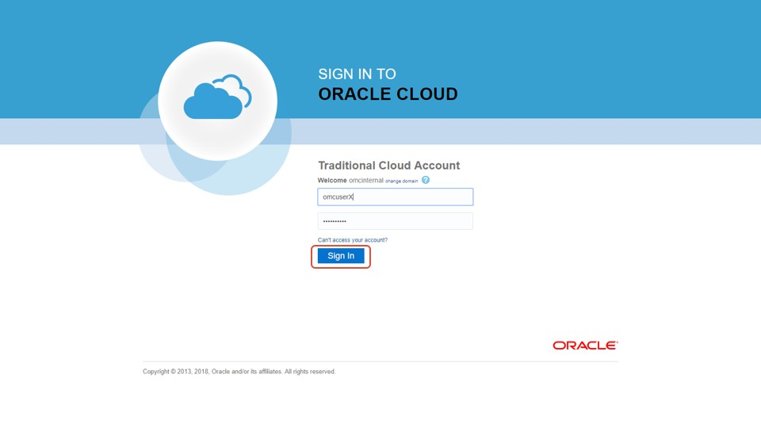
[Enter Username and Password], then **Click** the Sign In button

## Contents

**Lab Activity 1:** Monitor and explore health and performance of applications utilizing Oracle Exadata infrastructure.

**Lab Activity 2:** Diagnose an end-user issue to back-end infrastructure.

**Lab Activity 3:** Identify an application system component failure.

**Lab Activity 4:** Find out if there is adequate infrastructure capacity to accommodate growing application workload.

**Lab Activity 5:** Setup a custom dashboard for a 360 degree view of the IT infrastructure and application.

 **Lab Activity 1: Monitor and explore health and performance of applications utilizing Oracle Exadata infrastructure.**
======================================================================
**Scenario Details**

Brutus needs to monitor health and to identify any performance issues of applications running on Oracle Exadata servers.

**Task**

Explore the environment and identify any issues with an application or its underlying infrastructure.

NOTE: During activities in this lab, data may appear differently than what appears in screenshots. Please focus on the flow and steps, instead of the actual data values displayed in screenshots.

**Learner Goal**

How to obtain insight of an application all the way through its complicated infrastructure.

**Value Proposition**

“Time is money” for business. Troubleshooting application performance and finding root cause is complex and takes a lot of time; requiring review and analysis of a lot of different data. Too often the result is finger pointing, not resolution
because there is no “single source of truth”

**Duration**: 15 mins.

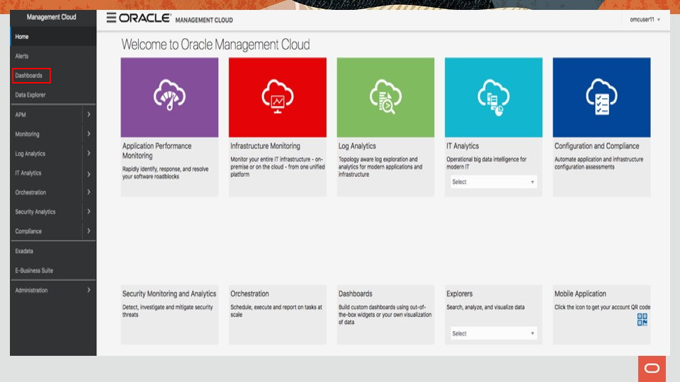
1. After you have entered your information, click the Sign In button. After login, go to the upper left of the window and use the  *Global Navigation* menu (looks like 3 stacked lines aka hamburger menu) to navigate to Oracle Management Cloud and its Dashboards.

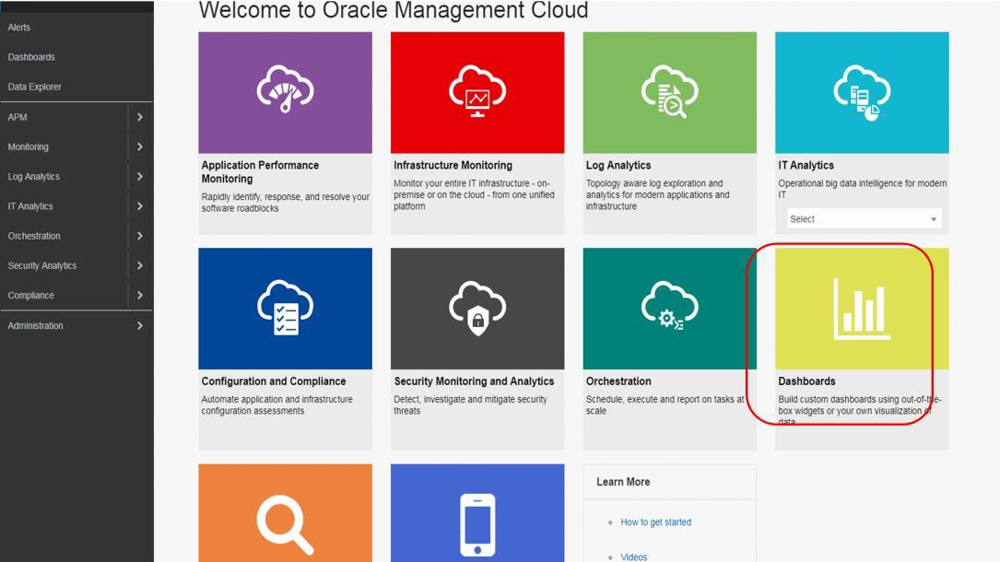

2. **Click** on the Dashboards tile.

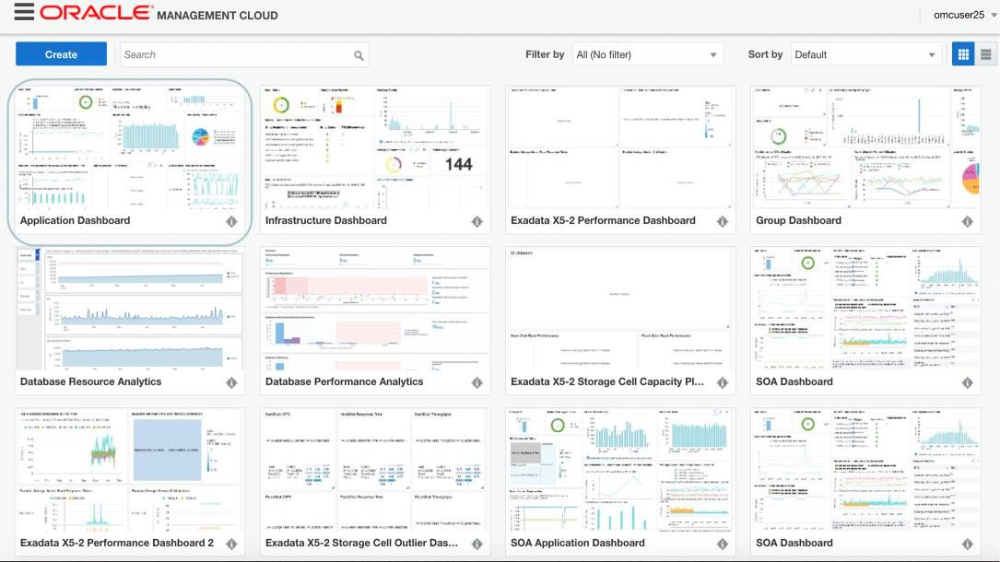

3. Here you see a variety of preconfigured dashboards here and its possible to create a Custom Dashboard as well. From the available dashboards, locate the one labeled Application Dashboard and **Click** on it. This dashboard been has been preconfigured to provide visibility to the *OrderApp* application performance, health of its key components and infrastructure. 

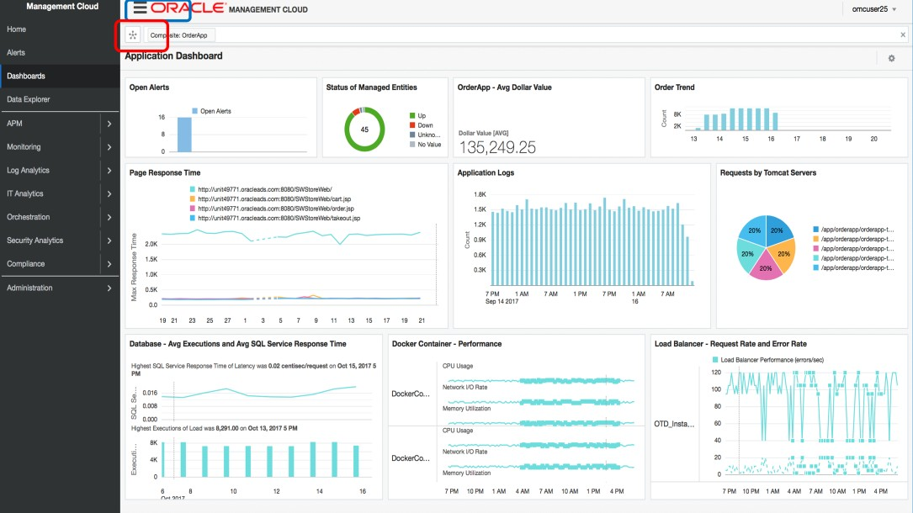

4. You have full topology of the environment from  the web server, to the host and storage all the way to the network switch. On the right side, we see the performance metrics like top pages, entity status etc. Left side you see business metrics number of orders (mined from logs), average order size – the application is uploading this data via REST API. There are infrastructure level metrics found at the bottom like docker container,load balancer etc.

    If you dont see the “OrderApp” in the **Topology icon box** (area shown in red), type in **OrderApp** to the right of the topology icon and then hit return. *Browsing tip*: If you do not see the full **Management Cloud** vertical menu bar (lefthand side, in black), you may need to adjust your browser resolution. You can always access these items by “pulling down” from the  *Global Navigation* menu bar(highlighted in blue at very top left - aka "hamburger menu").
    
    Next, **Click** on the topology icon.

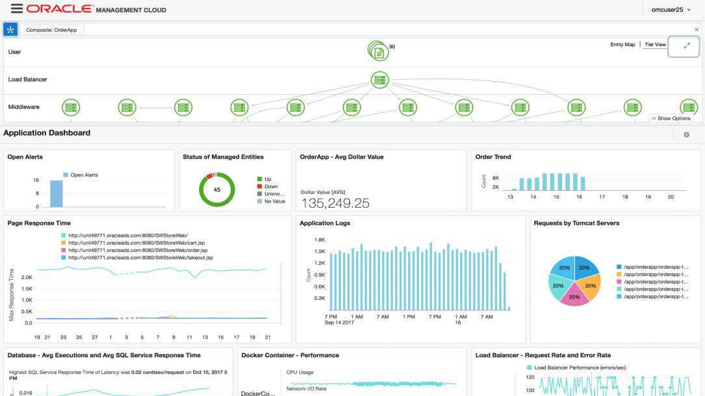

5. This is the *Global Context* window and it enables you to carry time and application/composite context between different pages and services. You get topology and health of entities that are part of the application. Maximize the window, and **Click** on the bidirectional arrow (located on the upper right of the page).

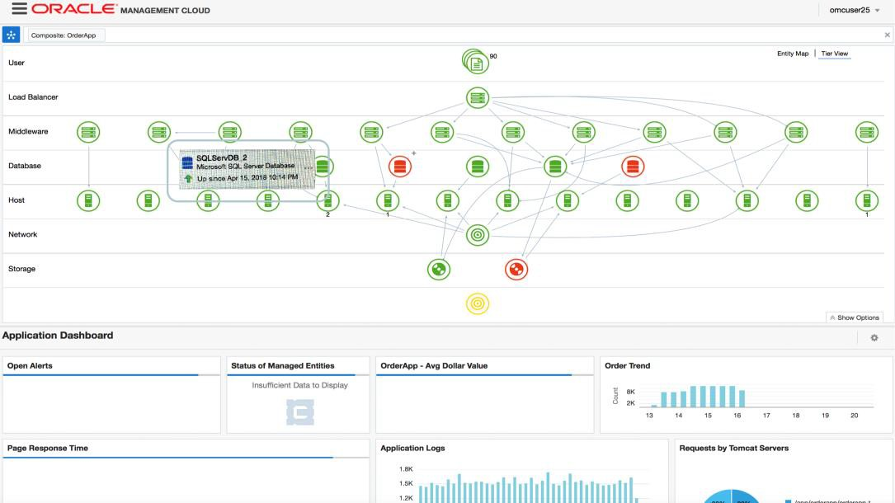

6. This is a simple application with several Tomcat Servers load balanced by Oracle Traffic Director and those communicate with a clustered Oracle Database having two instances connected to two Oracle Automated Storage Management (ASM) instances running on Linux hosts. A payment gateway runs on a Microsoft IIS webserver that communicates to a Microsoft SQLServer database and they run on Windows machines. All of these hosts are connected to a Network switch.

    In the topology view you can see that two entities are down – two databases and one ASM instance. The application is still running because of redundancies in the application. **Click** on a system component, its associations and view the details. Then **Hover** your cursor over the SQLServDB2 entity then and **Click** on its […] to bring up its entity card.
-------------------------------------------------------------------------------------------------------------

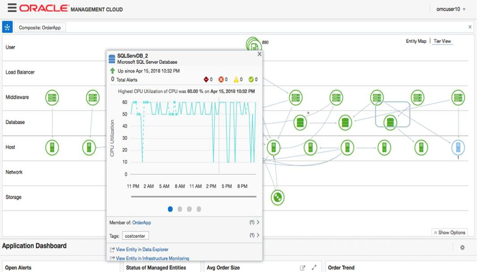

7. **Hover** your mouse on an entity showing all the adjacent entities that the selected entity is connected to. Also shown is an entity card that provides a health and performance overview of a managed entity/target such as host or database. You can use this to view key metrics and logs for an entity. In this example, a **Microsoft SQLServ DB** instance has been **Hovered** over and brought up its entity card. It displays a relationship to the Payment system IIS server in the middleware layer, and the Windows hosts running in the host layer.

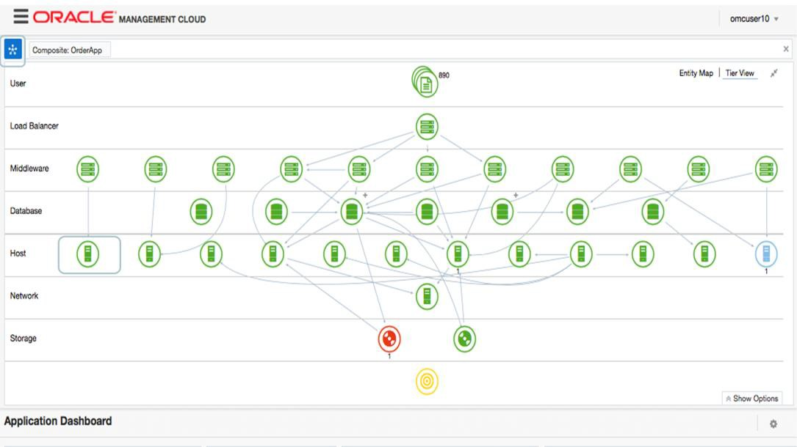

8. OMC is capable of monitoring resources across different Infrastructures whether on-premise, Oracle Cloud or other cloud vendors. In this topology view observe a host on a Virtual Machine (VM) on Amazon EC2 being monitored. **Click** on the topology icon , on the upper left of the page, to now collapse the full screen view to finish off this lab activity.

 **Lab Activity 2: Diagnose an end-user issue to back-end infrastructure.**
======================================================================

**Scenario Details**

Brutus needs to explore his application environment to identify any issues with an application or its underlying infrastructure and pinpoint whether its an application or system component failure.

**Task**

Look into an application and investigate how it behaves from the end use, down through server requests and to a log file.

**Learner Goal**

Quickly pinpoint and identify root cause of an issue impacting application usage or its availability. 

**Value Proposition**

Investigating and actually determing why an application is "running slow" is impossible without the right solution. Guessing leads to finger pointing, not resolution, which further impacts business and customers.

**Duration**: 15 mins.

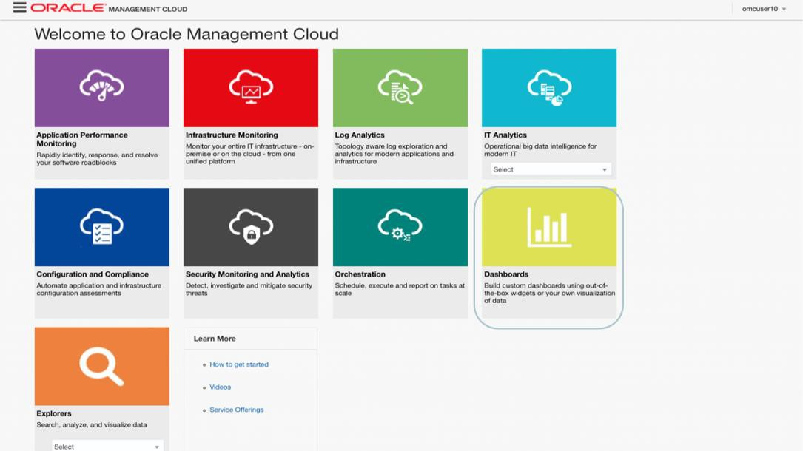

1. From the upper left of the page, you can use the Navigation Bar menu (looks like 3 stacked lines aka hamburger menu) to navigate to Oracle Management Cloud services overview page and **Click** on the Dashboards pane.

2. **Click** on the Application Dashboard which has been prepopulated with data for an application named “OrderApp”. Should you do not see it, type *OrderApp* into the *Global Context* window (the topology icon that looks like a snowflake)

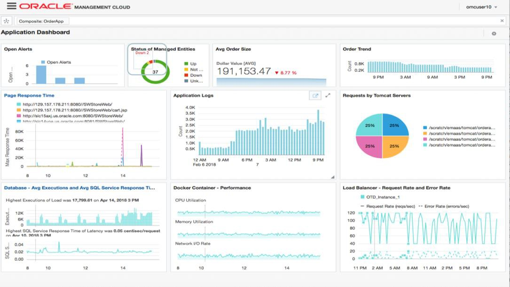

3. **Hover** over the Status of Managed Entities section on the Application Dashboard, towards the top left of the page. You will see there are several entities that are down (identified in red). 

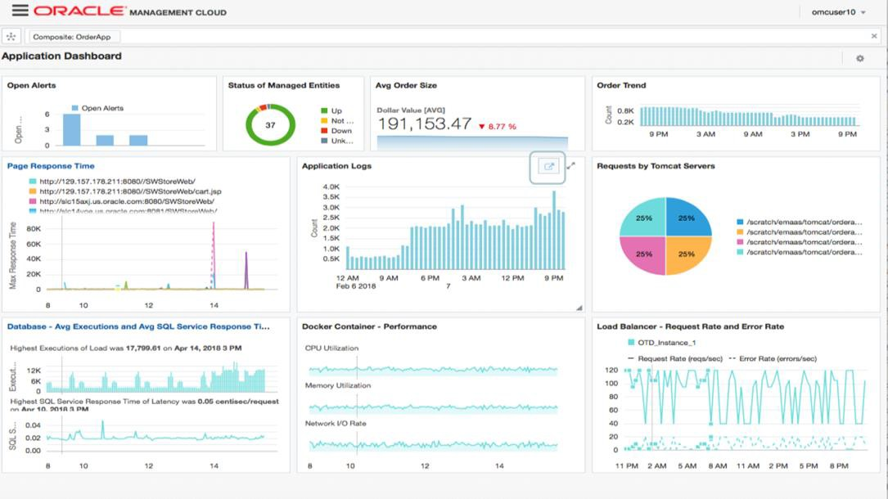

4. In the Application Logs section, seen in the middle of the page, **Click** on the open log explorer icon (highlighted) to access the Applications Log files for the complete application infrastructure.

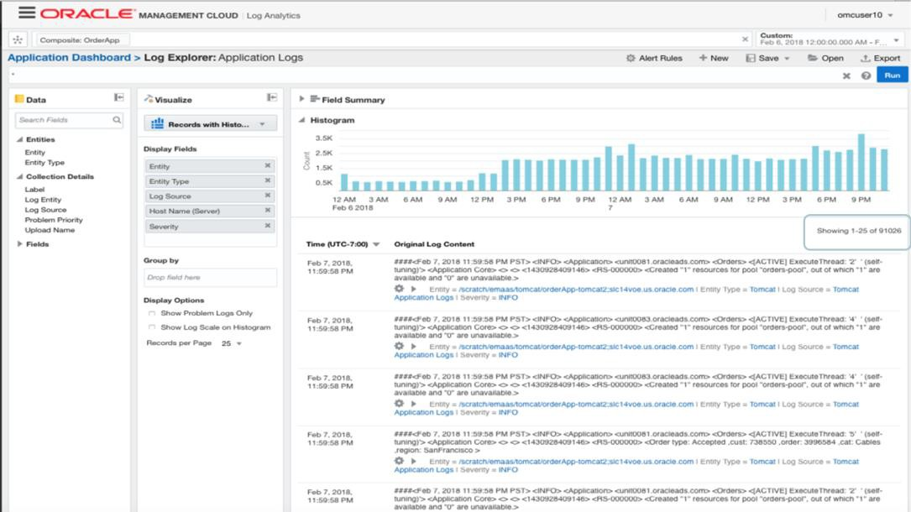

5. OMC supports logs from many different types of application and infrastructure components- Oracle and Third-Party. 

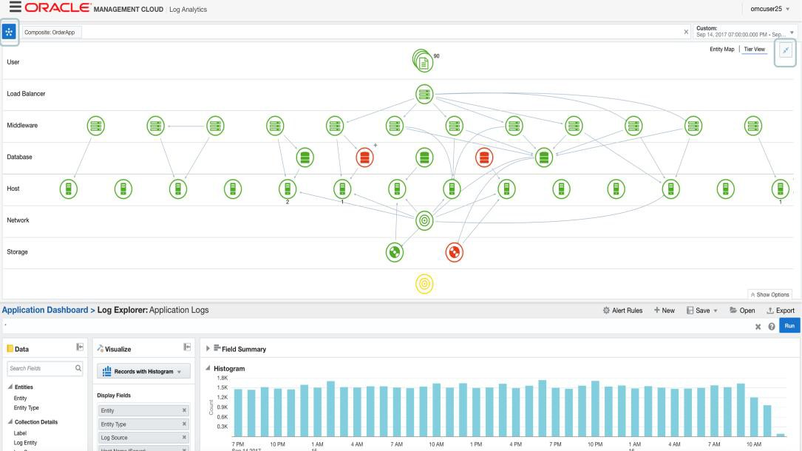

6. **Click** on the Topology Icon (looks like a snowflake) and maximize the page on your monitor using the bidirectional arrow found in right top corner of the page.

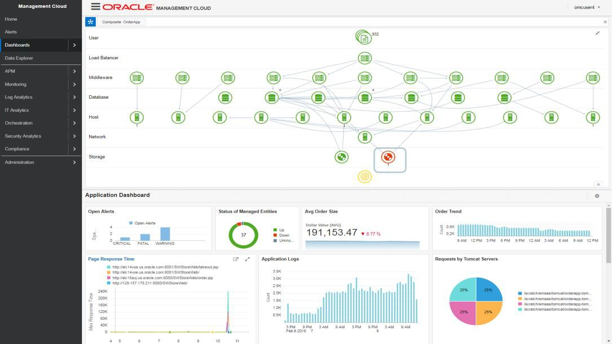

7. You now see the topology of the application and infrastructure and the application logs all on the same page. **Hover** over any entity and you can view its status. **Click** on one entity and only the logs for that entity are shown. When you **Click** on a relationship link, just the logs for that relationship appear. Now in the storage tier **Hover** over the icon in red and you'll see that **“OrderAppASM2”** is down. Click on the icon in red and navigate to the upper right of the page and **Click** on the bidirectional arrow icon.

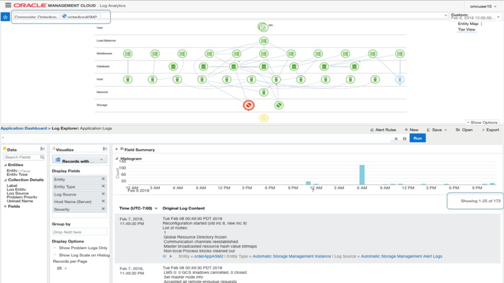

8. Observe two things: First, the number of logs was reduced (from 91206 to 173). This is because logs are now associated with the selected entity *OrderAppASM2* and the *Global Context* in the topology bar now displays this entity *OrderAppASM2*. So now it's filtering all results by two qualities: first by overall application OrderApp and then by this entity. We will now utilize Machine Learning to isolate the errors from this alert set.
--------------------------------------------------------------------------

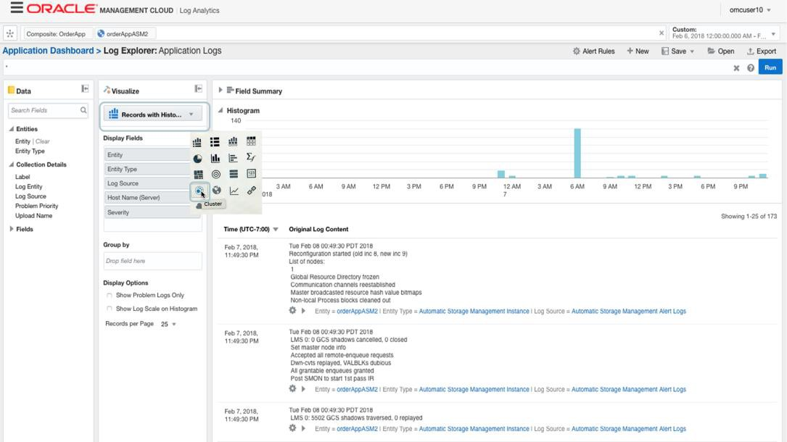

9. **Close** the topology page. Next, to run the Machine Learning Clustering algorithm, **Click** on the Records with Histogram and when presented with its dropdown options, **Click** on the *Cluster* icon (as highlighted by the cursor arrow)

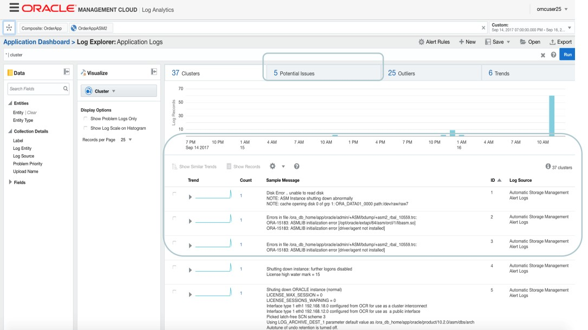

10. You can see that the Machine Learning algorithm found ~37 Clusters, and identified 5 potential issues. **Click** on the Potential Issues tab found in the upper middle of the page to see the top issues identified and details for why the Storage Entity is down. You will see the root cause is a *Disk Error: unable to read disk”* hardware storage issue. 

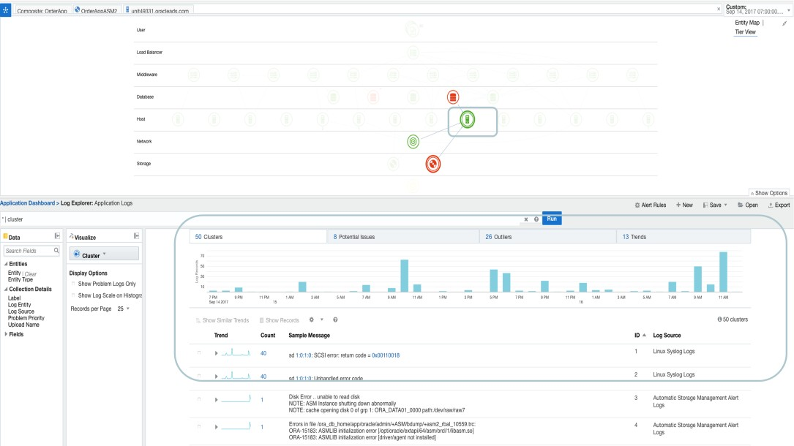

11. Follow the entity *OrderAppASM2* in red to its associated Host ( slc15axj.us.oracle.com appears when you hover over the host icon) and **Click** on it. Results are then refined using this additional filter and from the Linux Syslog log, the SCSI failure error becomes quite apparent.

>NOTE: Click the Topology Icon (looks like a snowflake) and then the maximize arrow if the page is not open/fully visable. 

----------------------------------------------

 **Lab Activity 3: Identify an application system component failure.**
======================================================================

**Scenario Details**

Within Brutus's complicated infrastructure, there appears to be a hardware issue impacting an application. So he needs to examine the applications topology and analyze all the different associated data associated with it.

**Task**

Examine and identify impact and cause of a failure.

**Learner Goal**

Understand where to look and then review and analyze a lot of data, in many formats, from different sources. 

**Value Proposition**

First is understanding where to look and then from there being able to review all the different is impossible without the right solution. And the practice of "Hoping" an issue goes away or never happens again, is an unmitigated risk that can have serious consequences later. For example a data breach.

**Duration**: 15 mins.

1. From the upper left of the page, you can use the  *Global Navigation* menu bar (looks like 3 stacked lines aka hamburger menu) to navigate to Oracle Management Cloud services overview page and **Click** on the Dashboards pane.

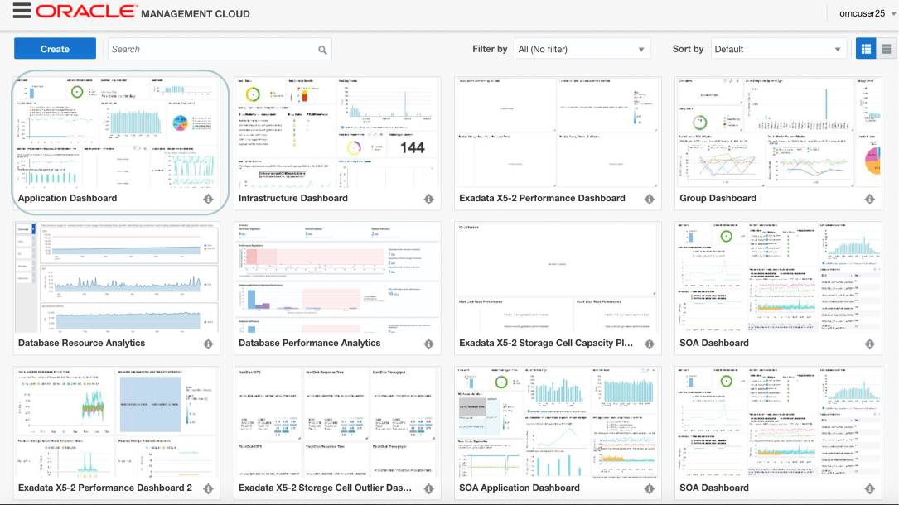

2. **Click** on the Application Dashboard which has been prepopulated with data for an application named “OrderApp”. Should you do not see it, type *OrderApp* into the *Global Context* window (the topology icon that looks like a snowflake) and **Click** on APM and launch it in a new tab of your browser.

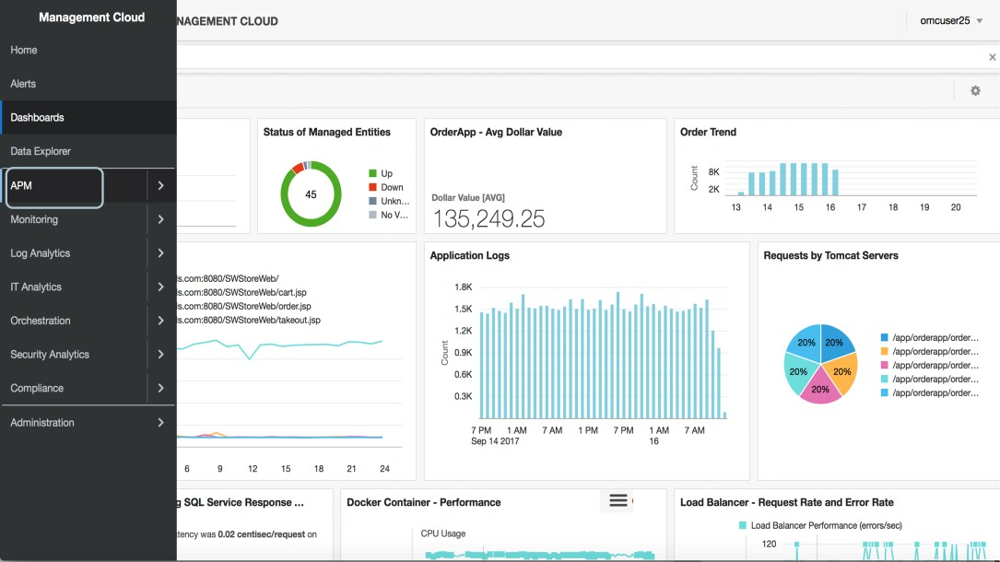

    Arriving to the APM Home page for *OrderApp*

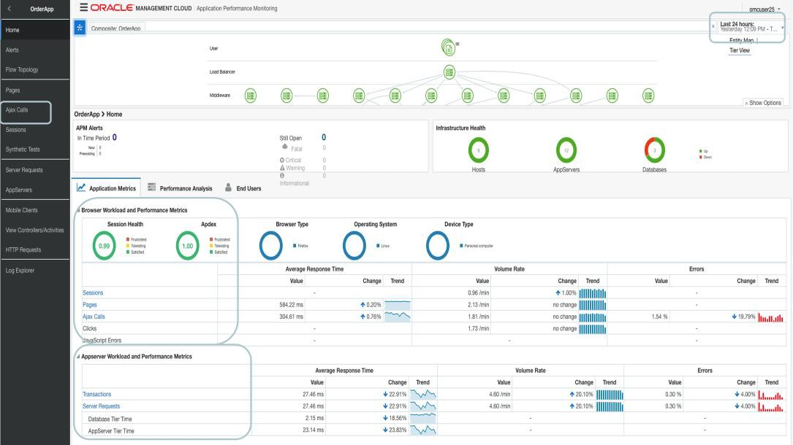

3. Now on the upper right of the page **Select** the time selector drop down and **Click** to change the time to view data to the Last 24 hours. You will see the Browser side and Application Server side Workloads and Performance Metrics displayed. To troubleshoot client side issues you would typically deep-dive into Pages and AJAX calls. And for the server side, look at Server Requests and Transactions. Using OMC Application Performance Monitoring (APM), you can track AJAX errors in your applications, monitor AJAX interactions; find and resolve issues.

    From the  *Global Navigation* menu bar on the left, **Select**  Ajax Calls.

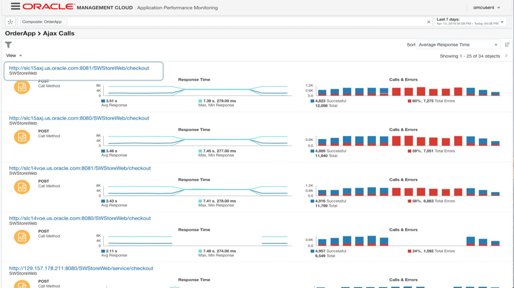

4. View the Response time, Calls & Errors for all AJAX calls on this page. By default 25 entries are displayed. More can be obtained by **Clicking** on the View drop down found on the upper left of the page. **Click** on top *checkout* call as highlighted.

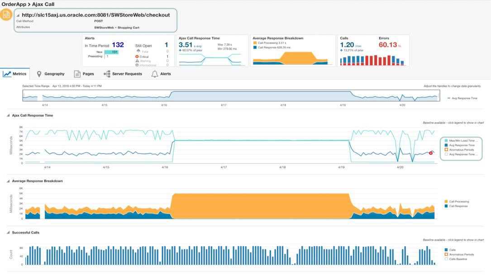

5. View all the details associated with the call to checkout. See the Timeline metrics, AJAX call Response time, Response breakdown, Successful calls and Errors. The Topology *Global Context* now includes a filter for *checkout* in addition to *OrderApp*. So next you will focus reviewing the data context for that  *checkout* call. **Hover** over any data point on the timeline metric and more detail will be displayed.

    **Click** on *Anomalous Periods* and *Average Response time* from the legend displayed on the middle right of the page as highlighted to see if the Machine Learning algorithm identified any anomalies. An anomalie is based on learned patterns and not just a defined boundary. Depending on the live data, anomalies may not appear.

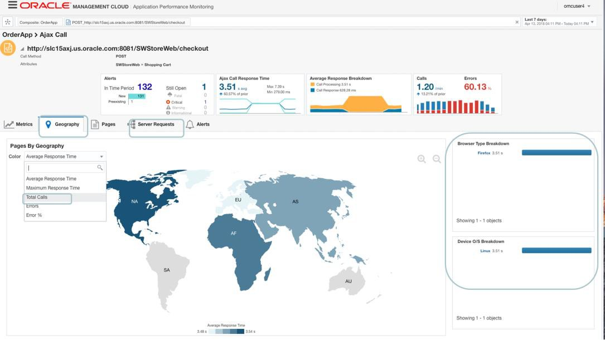

6. **Click** *Geography* and view the source of calls. Using the *Color* drop down menu, located under the Pages by Geography heading on the left middle side of the page, **Select** *Total Calls* and view the breakdown by Geographic areas, Browser and Device O/S Types used. Next **Click** on the *Server Requests* tab to the right of the *Geography* tab

7. To monitor http requests and see how your application behaves as workload changes, you can assess server-side performance down to the operation and method level. For the */SWStoreWeb/checkout (POST)* view its Response time, Calls & Errors and Average Tier time. Next **Click**  on the */SWStoreWeb/checkout (POST)* call.
---------------------------

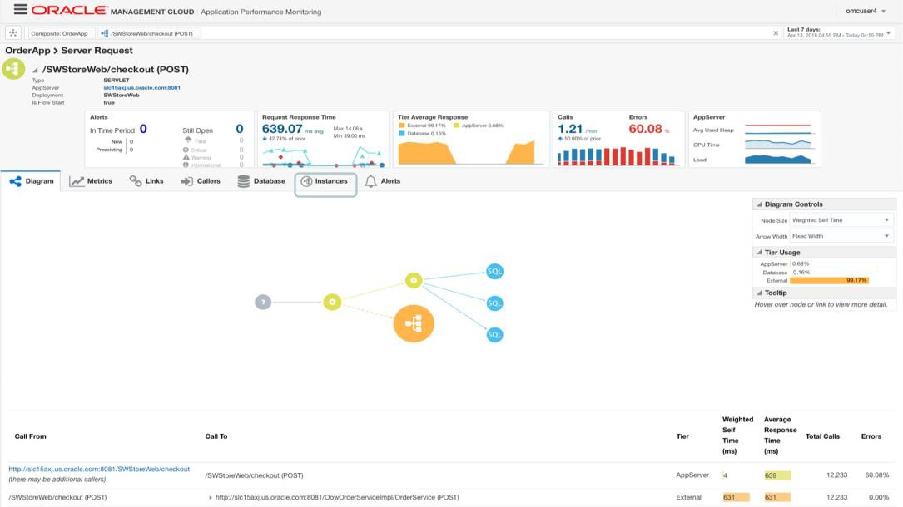

8. Examine the data available on the page. You can see the aggregate path this request took through the **OrderApp** application. OMC APM dynamically discovers the flows of requests and their calls through the application infrastructure, performance and errors related to the call.

    **Click** on the *Instances* tab, between the Database and Alerts tabs. An Instance is a sampling instance. As there can be many we will need to filter by some criteria.

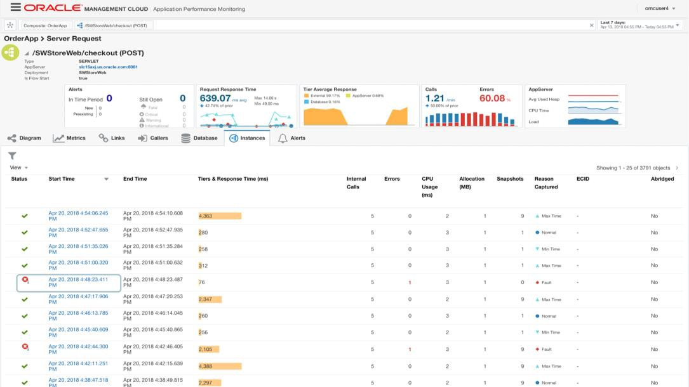

9. Now view the recent executions of this servers requests. For each execution instance, you see the total execution time, broken down by time spent in each tier (application server, database), and a count of errors that have occurred. Let’s look at the instance that shows an error in the Status column so that we can investigate further.

>   Locate an Instance with an error status displayed (as shown above, but you may have to scroll down) and **Click** on its *Start Time*

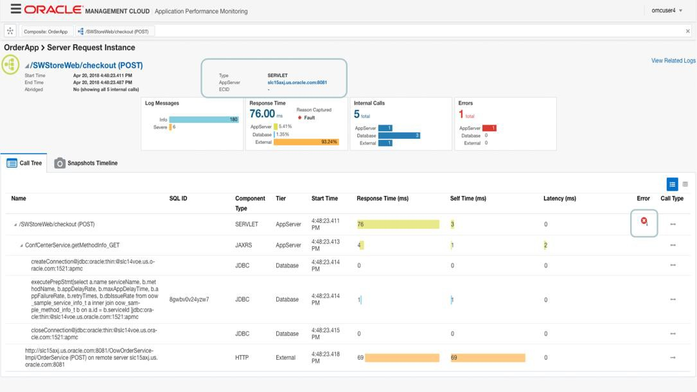

10. Examine the data on the page, then drill down into this instance request, and you can see exactly the flow of operations that the checkout call took. On the far left, middle of the page, the *Call Tree* tab displays the details, including the stack trace of this instance. Notice there was an error found during its execution. Now lets check the health of the application server to identify where the error came from. At the top of the page, **Click** on the Application Server name: slc15axj.us.oracle.com:8081
------------------------------------------------------------------------------------------

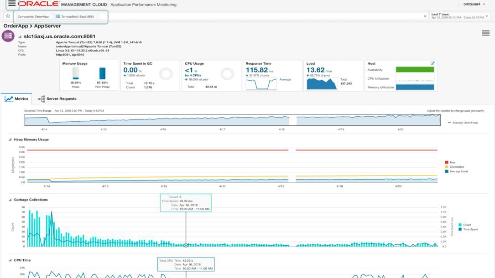

11. You are now viewing the Application Server data for a Tomcat instance. View activity and amount of resources (CPU, Heap Memory,Time in GC, Response Time, Load and Log Messages). At this moment nothing seems unusual, but now look more closely using the OMC Infrastructure Monitoring Service for more detail on the Application Servers Performance.

    **Note:** The Topology Global Context Section at top of the page contains both *OrderApp and Tomcat Application Server.* and this context will automatically transfer over into Infrastructure Monitoring.

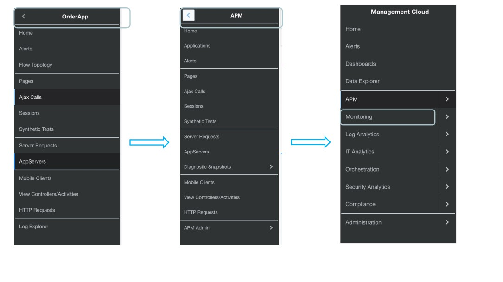

12. *Click* back on the *OrderApp Menu* to return back to the *APM Menu* and then back to *Oracle Management Cloud Menu* and select *Monitoring”* (or use the  *Global Navigation* menu bar on the left of the page aka hamburger menu)

    **Click** on *OrderApp*, then **Click** on *APM* and then **Click** on *Monitoring*

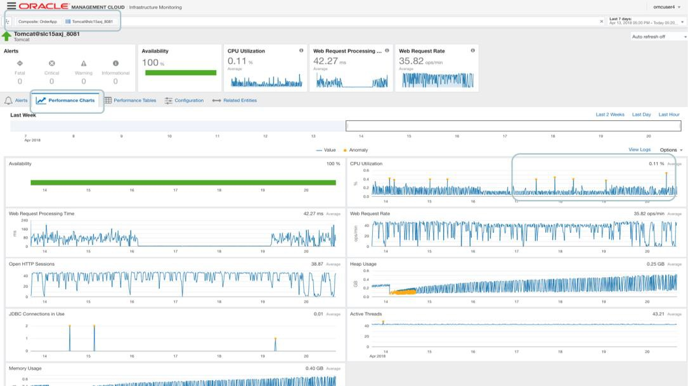

    Notice how you seamlessly maintained the *Global Context* during the transition to another service. *Click* on *Performance Charts* and oberevers have you have an overview of the key performance metrics for this Application Server: Availability, CPU utilization, Web Request Processing Time, Web Request Rate, Open HTTP Sessions, Heap Usage, JDBC Connections in Use, Active Threads and Memory Usage. And Machine Learning is used to identify any anomalies - see if you spot any identified as orange dots.

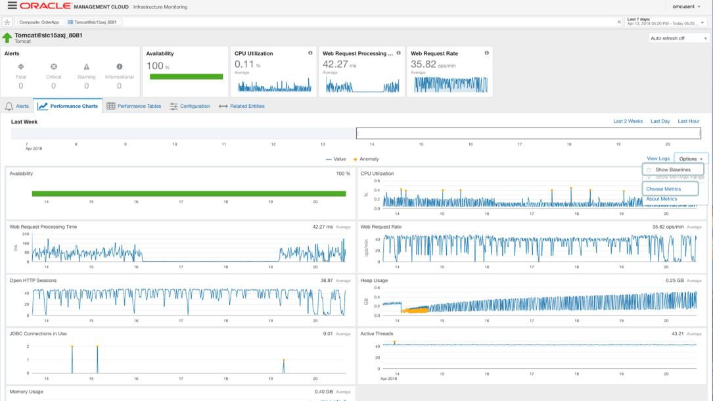

13. On the far right, middle of the page, *Locate* the Options drop down menu and *Select* *Show Baselines* A baseline now appears as gray area in the charts. **Hover** your mouse over datapoints displayed and view their value along with their expected baseline range.

    Going back to the Options drop down menu, next **Select** *Choose Metrics* In the same Options Menu, to selectively review specific performance metrics for this Application Server.

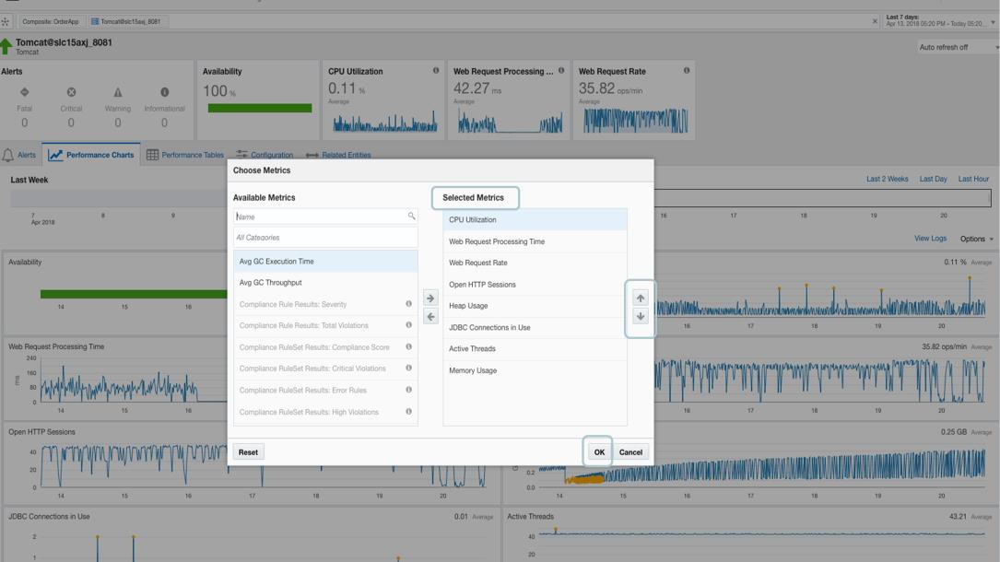

14. Observer that there are many different kinds of metrics you are able to select and view. You can add other metrics that are not already shown, reorder and customize your own view. **Click** on *Memory Utilization* and move it using the arrow icon to appear under CPU utilization and then **Click** *OK* in the bottom right to close the dialog box. There really is not any significant performance issue on any of the metrics displayed here, so its time to move on and see what the application logs have to share.

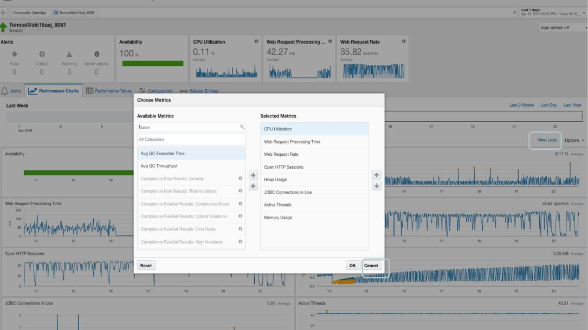

15. After you have finished trying the selection of various metrics and displaying them using the *Available Metrics* dialog box, you can **Click** the *Cancel* button on the lower right to return to the overview page. Then, just to the left of the *Options* drop down menu, **Select** the *View Logs* drop down menu to be transferred in-context to the OMC Log Analytics service where you will perform analysis of this Application Servers logs. 

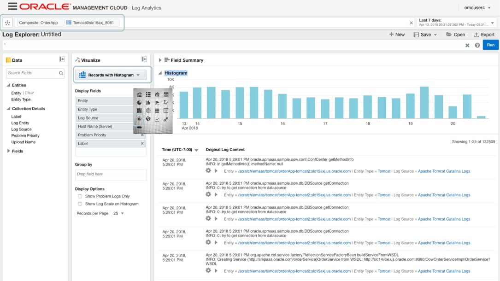

16. **Log Analytics** is an important diagnostics component as by default applications routinely generate logs for transactions, error and alerts. Notice that there are ~132,000 entries coming from *Tomcat* related logs in the *OrderApp* application. Observe also the *Global Context* continues to be preserved (identified in blue).

    100,000 entries is to many for a human to manually review, so this is where Machine Learning comes into play using Clustering to identify anomalies. Under the *Visualize* section heading to the right of the Data section, **Select** the *Records with Histogram* drop down menu and **Click** on the *Cluster* icon.

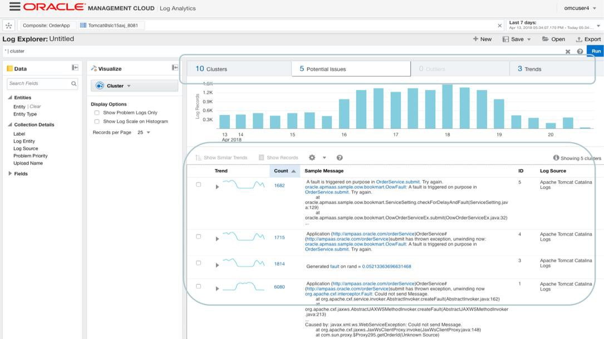

17. Machine Learning (ML) in *Log Analytics* has now reduced the ~ 132,000 entries into 10 Clusters which is manageable. It has also identified 5 potential issues and 3 trends for further investigation. If there were *outliers*, they would be “one-off” data points that might be a “needle in the haystack". Further examination of the items identified leads you to the root cause of the Application Servers problem. Services integration, in-context navigation, automation combined with advanced technology helps you solve issues, not have to guess.

----------------------------------------------
 **Lab Activity 4: Find out if there is adequate infrastructure capacity to accommodate growing application workload.**
======================================================================

**Scenario Details**

Brutus has been asked to help plan an application deployment into the infrastrcuture where growth of its usage has been projected by the Line of Business (LOB) to grow upwards of 40%. He needs to find out if there is adequate infrastructure necessary to accommodate it.

**Task**

Analyze the trend and forecast resource usage across hosts.

**Learner Goal**

How to collect and analyze data from host systems to review and plan capacity. See how an application behaves and investigate its end use, host server request activity all the way down into its log files. You will start from the Application Performance Monitoring service (APM), transition into Infrastructure Monitoring to understand the performance of an Application Server and then go into Log Analytics to surface anything hidden in the log files.

**Value Proposition**

It can be a full time job for 1 or more resources to routinely manually collect, combine and review data dependent on how many hosts there are. And on top of that, another 1 or more resources to analyze, plan and forecast capacity for typical IT Operations and budget planning. Special LOB or application project rollout requests then put addtional burdens and pressure on IT to perform it faster and with greater accuracy.

**Duration**: 15 mins.

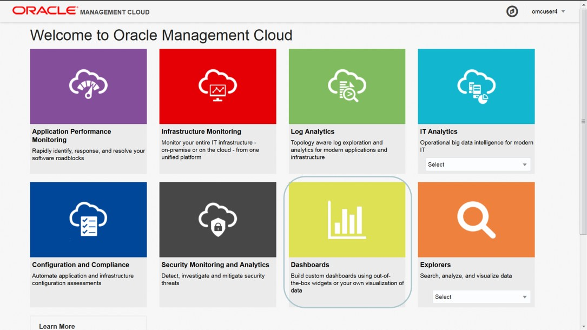

1. Using the  *Global Navigation* menu bar and returning back to the OMC landing page showing all the available services. **Click** on the *Dashboards* pane.

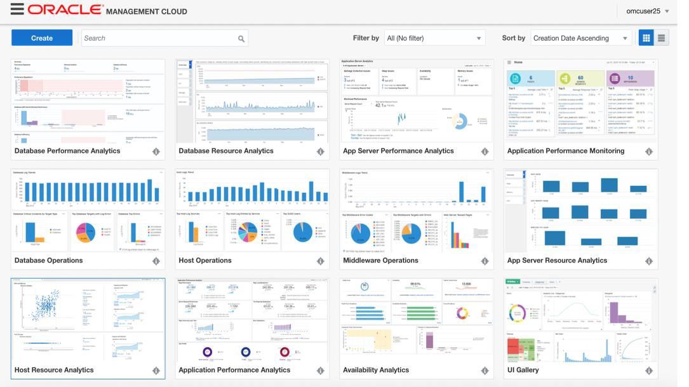

2. **Click** on the *Host Resource Analytics* pane

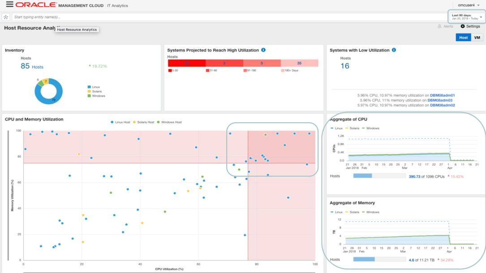

3. Using Oracle Management Cloud you can perform resource analytics for a specific application, hosts in a private cloud or all hosts supporting a enterprise-wide application. View resource usages for all hosts, aggregate resource availability and usage, and identify servers with high and low utilization. From the upper right of the page, alter the time period and **Select** the *Last 90 Days" from the drop down menu.

    In the top middle of the page, observe the *Systems Projected to Reach High Utilization* for how much CPU and Memory Headroom is left. There appear to be 16 systems that have low utilization. **Hover** over those hosts in the *CPU and Memory Utilization* scatterplot (highlighted in red) to review more detail. Note that the boundaries for CPU and Memory Utilization were set at 75% and are alterable.

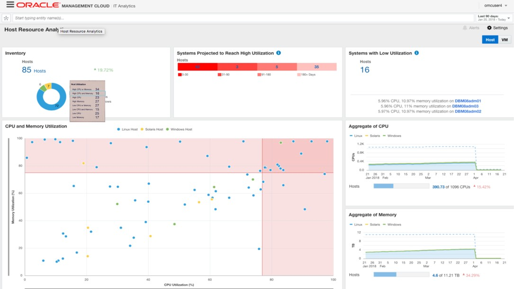

4. Now explore the systems displayed having high utilization. In the upper left of the page, from the Inventory section, **Hover** over Hosts and view *Utilization for system hosts* by different criteria. **Click** on the High CPU and Memory 16 displayed under the Host Utilization pop up.

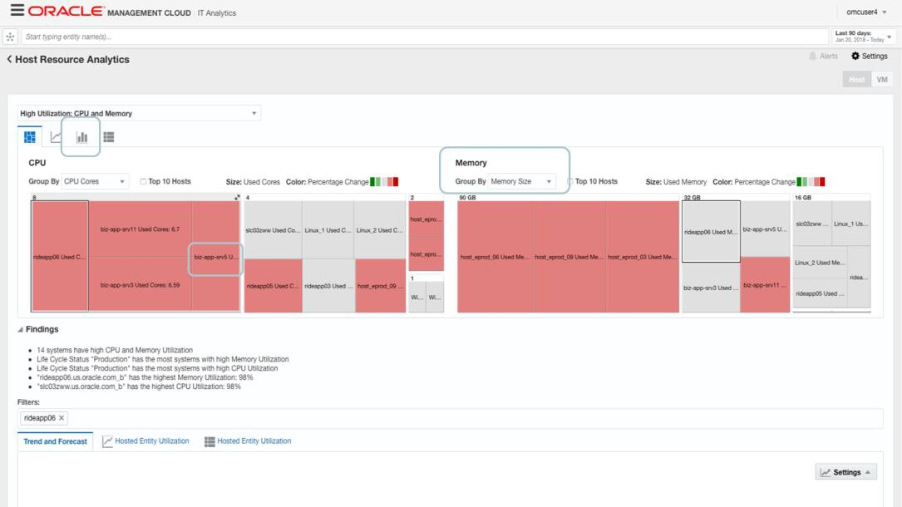

5. This brings you to a CPU and Memory Utilization view for all Hosts matching the chosen criterion. At a glance, the *Loadmap* view, displays the systems that have workloads increasing in red and workloads decreasing in green.  **Hover** over any host and review its CPU and Memory Utilization consumption. Displayed as a highlighted example is the *biz-app-srv5* and how its CPU and Memory consumption are increasing.

    Next, from the upper left of the page and to the right of the Load Map icon, **Click** on the *Timeline* icon (highlighted) to see consumption form a timeline perspective.
    
    Then under the Memory heading, in the *Group By* drop down menu **Click** on both *Memory and CPU* and observe that you can group by different attributes including “Target Version”, “Cost Center”, ”Operating System” and “Lifecycle Status”

    Next, you will forecast future CPU and memory utilization for a longer period than the 30 day default.

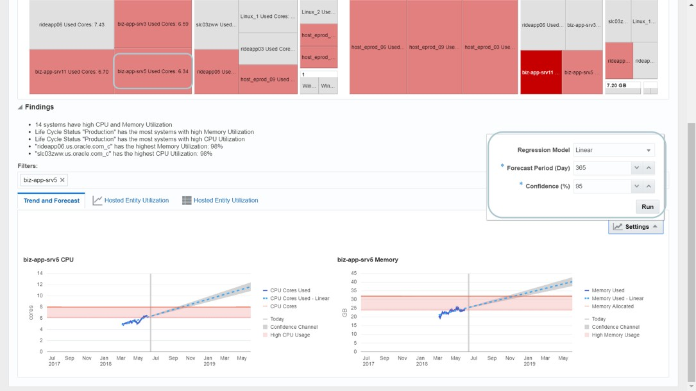

6. **Click** on *biz-app-srv5* and scroll down to view the CPU and Memory Findings. From the middle right of the page, **Select** the *Settings* menu, change the *Forecast Period* to 365 days and then **Click** the *Run* button and observe the projected usage (forecast) over the next year.

    Next return back to the *Settings* menu and this time alter the *Regression Model* to *Linear* and then **Click** the *Run* button

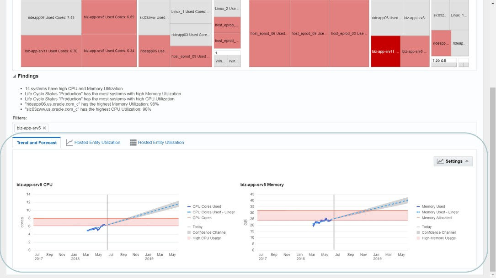

7. Observe using the **Linear** regression model you get a forecast for both memory and CPU usage for this host based on its past usage pattern.

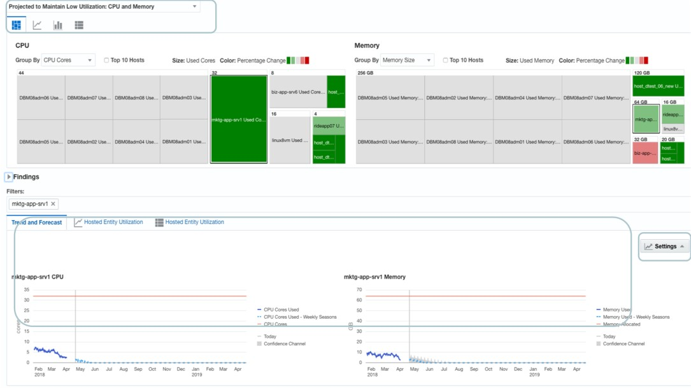

8. From the top left of the page **Select** the drop down *Projected to Maintain Low Utilization* Now systems having low projected utilization are displayed. By default a system is displayed. 

    Go to to the *Settings* menu again on the middle right and change the *Forecast Period* to 365 days and then **Click** the *Run* button and observe the projected usage (forecast) over the next year. Observe that this system will continue to have enough headroom for the next year and a suitable system to host other applications.

----------------------------------------------
 **Lab Activity 5: Setup a custom dashboard for a 360 degree view of the IT infrastructure and application.**
======================================================================

**Scenario Details**

Brutus needs to set up a custom view of the overall enterprise environment he manages for himself and he needs to setup specific custom views for different Application and Development DevOps users.

**Task**

How to create, customize and make available different dashboards for users with different needs.

**Learner Goal**

 Learn how to create a custom dashboard for DevOps using OMC templates and configuring its widgets for a 360 degree view of specific applications and their IT infrastructure. And become familiar with the different types of data, data sources and visual tools that can be displayed on a dashboard.

**Value Proposition**

Many attempt and often duplicate building custom reports or displays of various application, infrastructure and IT Operations data. Different data types and volumes become so overwhelming a project kicked off to try and build a performance and capacity warehouse from where reports could be made available to different users. However it doesn't succeed for several technical or business reasons. OMC is able to bring all the data together and enable it to be viewed in custom dashboards easily and quickly.

**Duration**: 15 mins.

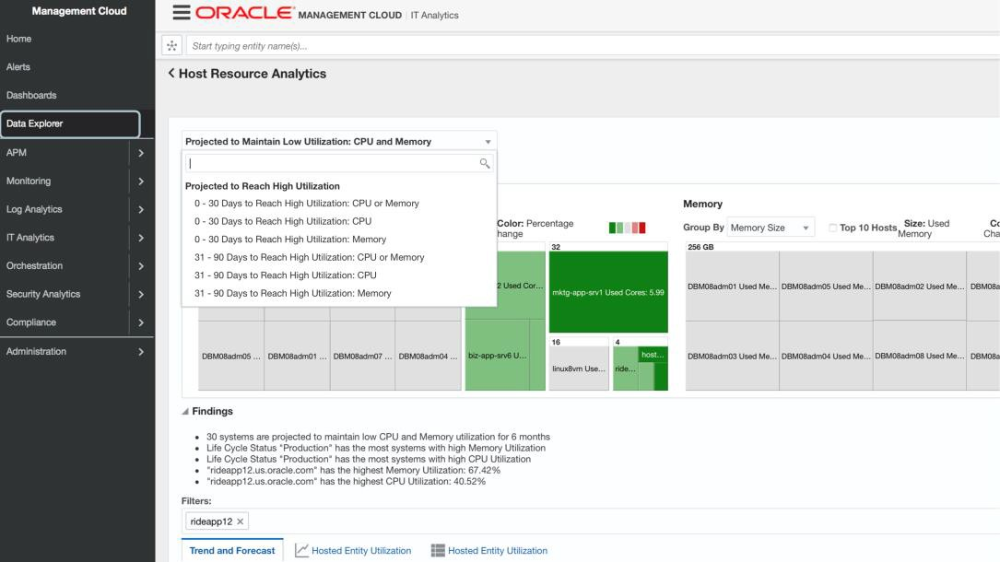
1. Continuing on with the same context you used in the last activity. On the left side, from the  *Global Navigation* menu bar, **Select** Data Explorer from the left side of the *Global Navigation* menu bar. If not shown, go to the upper left of the window and use the  *Global Navigation* menu (looks like 3 stacked lines aka hamburger menu) to navigate to Oracle Management Cloud and Data Explorer.

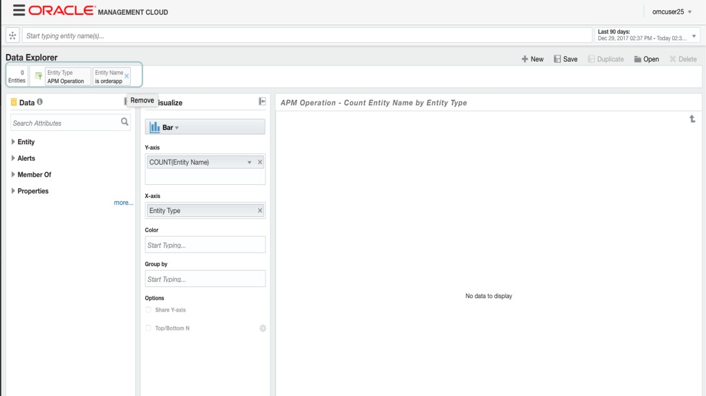

2. Next, delete any entity selections that appear in the *Global Context* window, to the right of the Topology icon. **CLick** on the x to remove an entity.

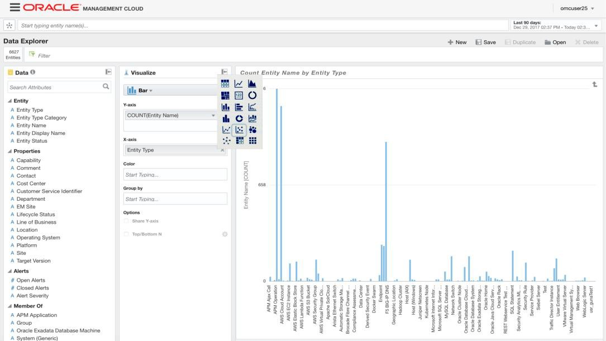

3. The *Data Explorer* enables you to perform advanced analytics functions such as trend/forecast, correlation, seasonal analysis, categorical analysis, and more. It allows you to display data in different visualization formats such as line, bar, heat map, donut chart, pareto chart, area chart, and more. **Click** the *Scatter Chart* icon. 

4. From the top left of the page, where Entities are displayed, **Type** in *Host* and from the drop down menu **Select** *Host*.

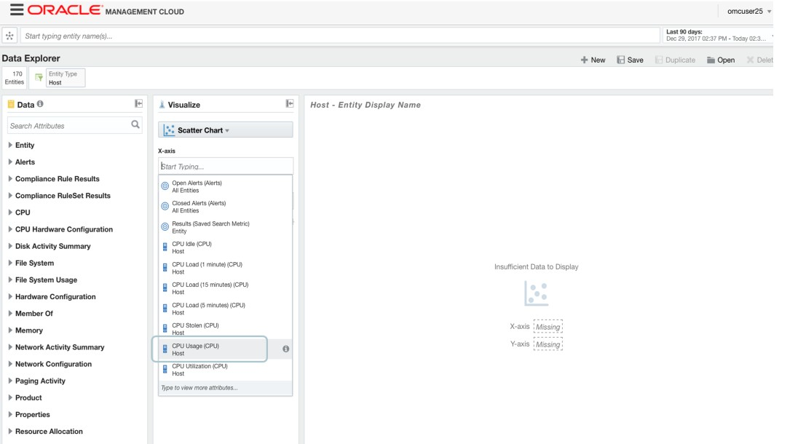

5. Below the Scatter Chart selection, under the X-axis heading, **Type** in the field *CPU* and then **Select** *CPU Usage (CPU)* after it appears. That assigns AVG(CPU Usage) as your X-axis.

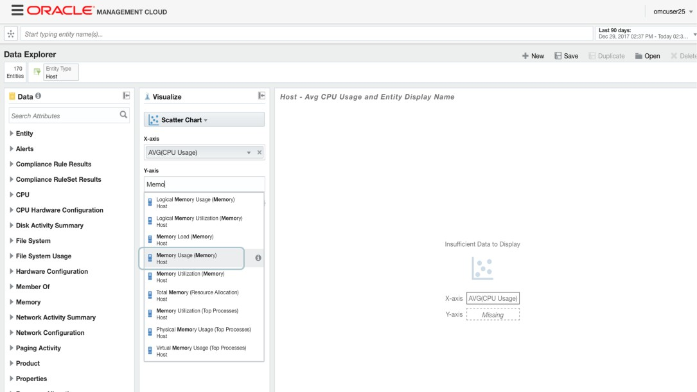

6. Then under the X-axis heading you just entered, in the Y-axis field  **Type** in the box *Memory* and then **Select** *Memory Usage (CPU)* after it appears. That assigns AVG(Memory Usage)” as your Y-axis.

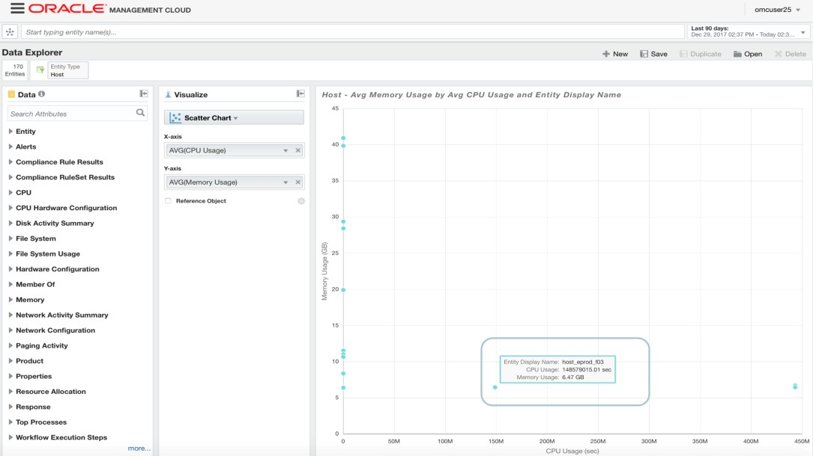

7. A scatter chart for (Average) CPU Usage vs. (Average) Memory Usage is displayed with each of the entities represented as light blue dots. **Hover** over any host entity and view its Name, CPU and Memory Usage. Note: at this time do NOT click the Save button on the top right. Following this method is how you create your own custom charts.

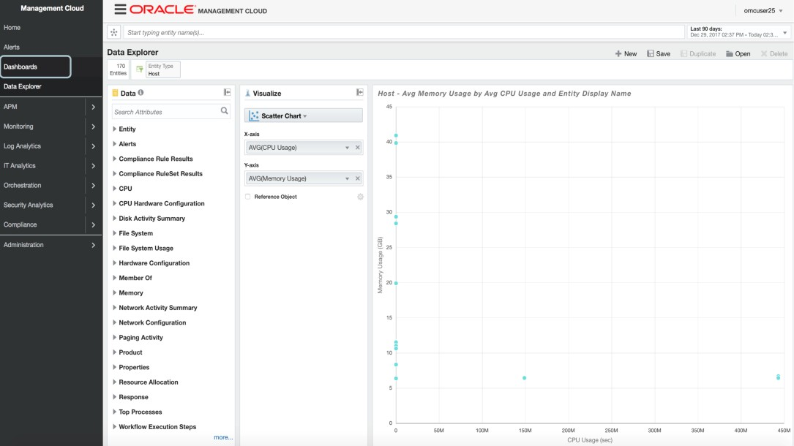

8. Next, you will create a Custom Dashboard. 

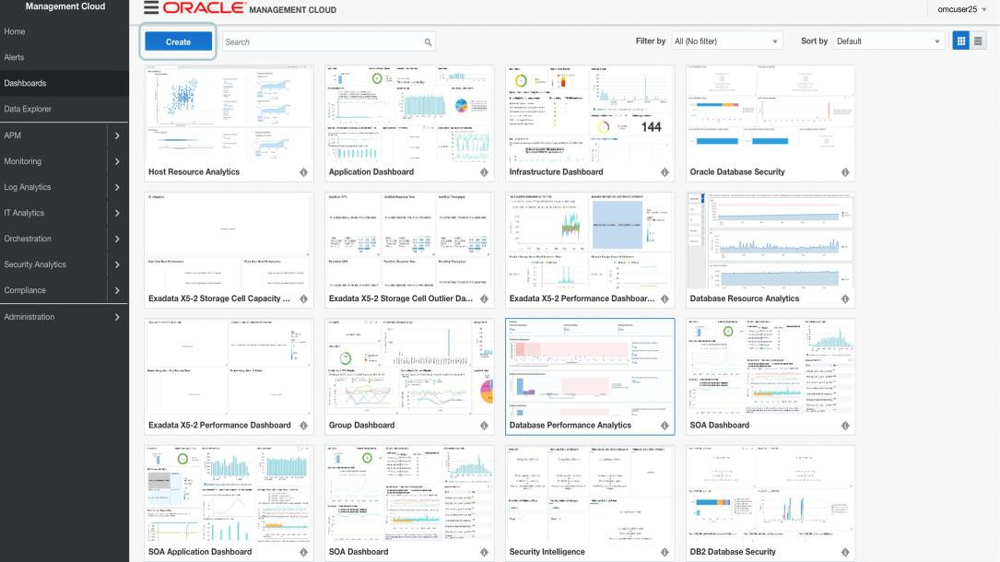

9. From the *Global Navigation* menu bar (aka hamburger menu) on the upper left of your page, return back to the OMC Main Menu of services,  **Select** *Dashboards* and then from the top left of the page **Click** the *Create* button to create your own custom dashboard.

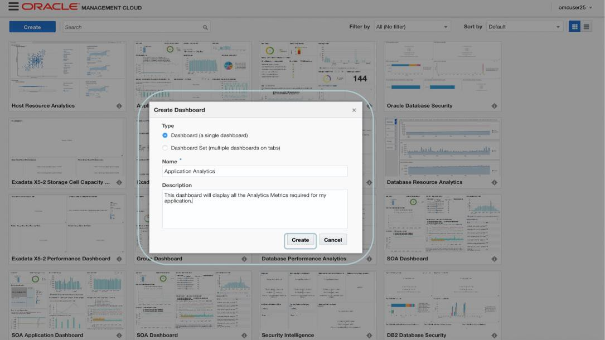

10. In the pop-up, **Select** *Dashboard (a single dashboard)* and then provide a name and short description for your dashboard. **Click** on the *Create* button.

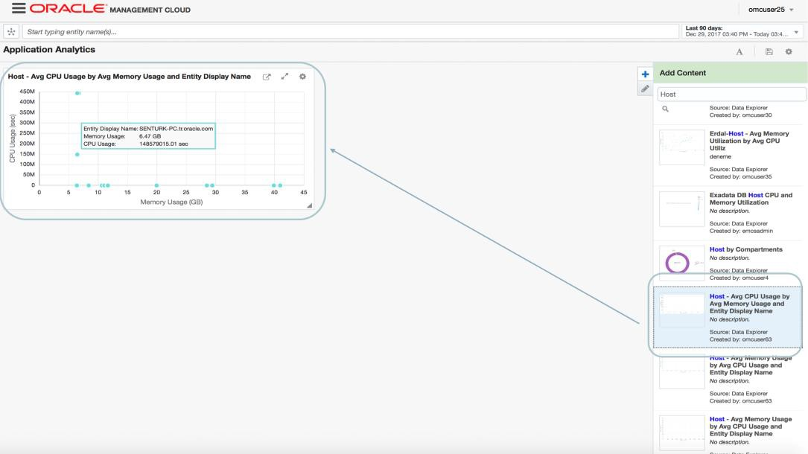

11. An empty custom dashboard template page is displayed with the name you entered in the upper left. On the upper right of the page, under the *Add Content* heading, **Type** *Host* into the box and then **Select**  *Host – Avg CPU Usage by Avg Memory Usage and Entity Display Name* once it appears. Then drag it onto your empty page anywhere. In this example, the upper left.

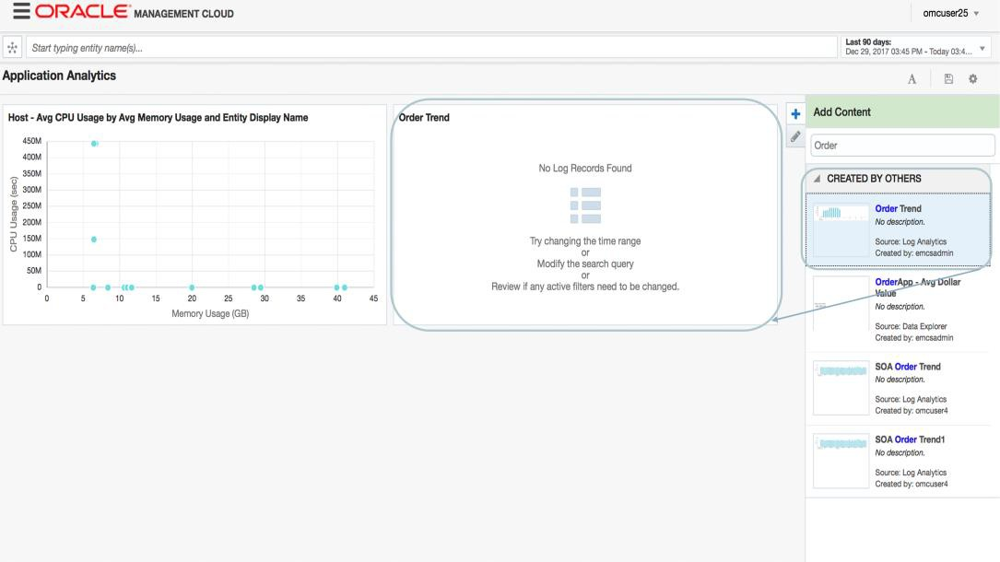

12. Going back to the upper right of the page, and under the *Add Content* heading again, **Type** *Order* into the box and then **Select**  *Order Trend* once it appears and drag it onto your  page anywhere where you would like to have it displayed. 

    Continuing to follow this method, you can further explore dashboards and widgets you would like to have displayed for your business needs.

>   Note: Again do NOT save any dashboards you create in the shared lab environment.

That concludes this lab. To learn more capabilities and information checkout the documentation at https://docs.oracle.com/en/cloud/paas/management-cloud/dashboards_explore.html