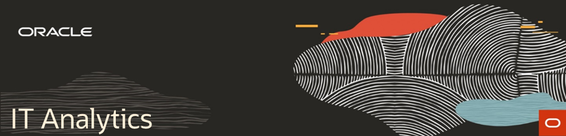 

**PROACTIVE DATABASE PERFORMANCE MANAGEMENT using IT Analytics** 
================================================================

In these hands-on lab activities, learn how to identify systemic database and SQL performance issues, and proactively forecast database resource utilization. See how to obtain complete and centralized visibility of your databases whether they are on-premises or in the Oracle Cloud using Oracle IT Analytics.

=============================================================

Lab Exercise Persona
--------------------

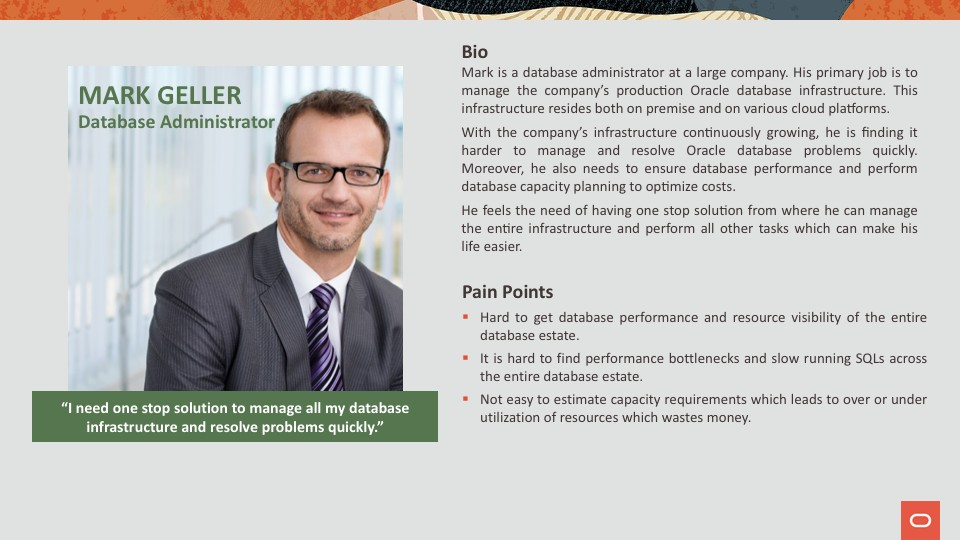

**NOTE**: Use Google Chrome to perform the lab for the best hands on experience

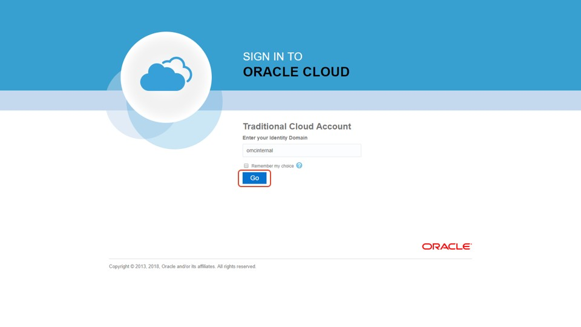

First, you need to get logged in to the Oracle Cloud. [Enter the Identity
Domain], then **Click** the Go button.

[Enter Username and Password], then **Click** the Sign In button

### Contents

**Lab Activity 1:** Identifying Database Performance Bottlenecks

**Lab Activity 2:** Identify Database Resource & Capacity Planning Performance Bottlenecks

**Lab Activity 3:** Maximizing Oracle Exadata Performance, Capacity Planning

 **Lab Activity 1: Identifying Database Performance Bottlenecks**
======================================================================

**Scenario Details**

Users need to identify databases which are degrading or inefficient over a
period of time. Identify the SQL causing performance issues

**Task**

Get insight on performance bottlenecks by performing database performance
analysis.

NOTE: During activities in this lab, data in dashboard may appear differently
than what appears in screenshots. Please focus on the flow and steps, instead of
the actual data values displayed in screenshots.

**Learner Goal**

How performance insights on databases can be obtained starting with the IT
Analytics Database Performance Analytics Dashboard.

**Value Proposition**

“Time is money” for business. Troubleshooting database performance and finding
root cause is complex and takes a lot of time; requiring review and analysis of
a lot of different data. Too often the result is finger pointing, not resolution
because there is no “single source of truth”

**Duration**: 15 mins.

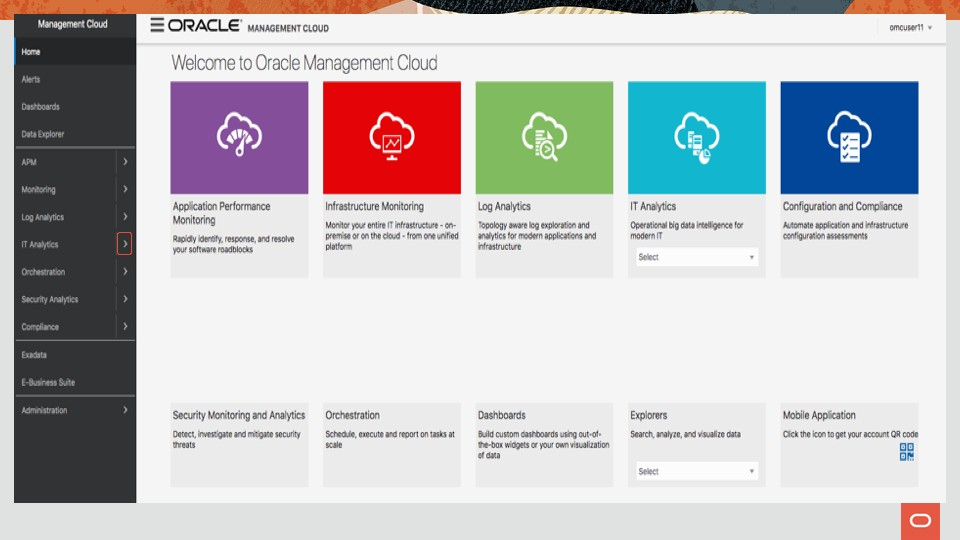

1.  From the left side services navigation listing, **Click** on the greater
    than arrow to the right of the IT Analytics title

    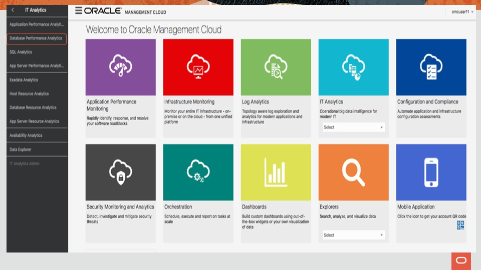

2.  Then Click on Database Performance Analytics

    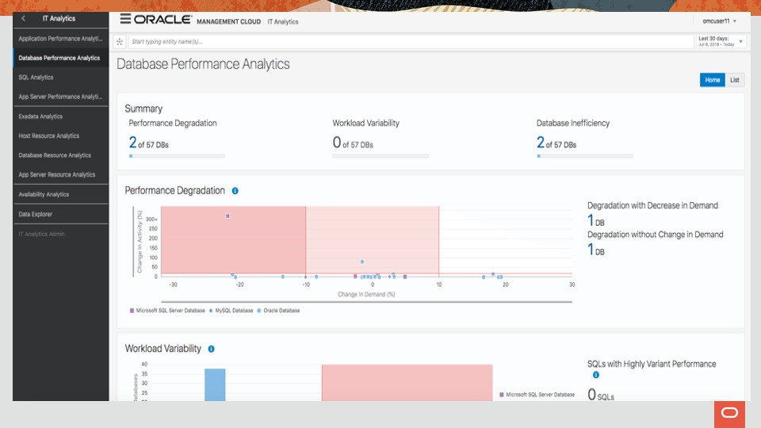

3.  This will open ‘Database Performance Analytics’ dashboard which is an out of
    the box dashboard supplied by OMC for database performance analysis.

    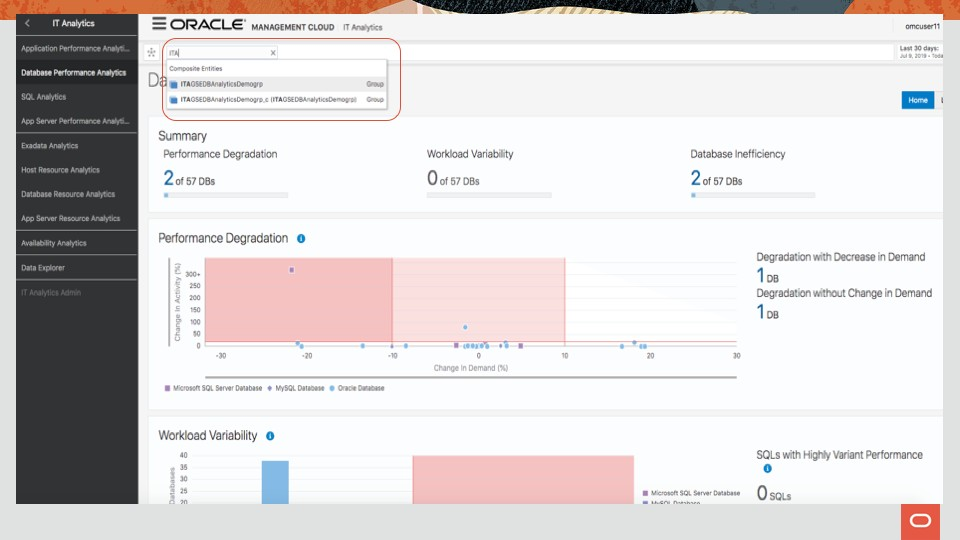

4.  In the global entity selector at the top, type in **ITA** and a drop down
    entry **ITAGSEDBAnalyticsDemogrp** will appear; Select it

    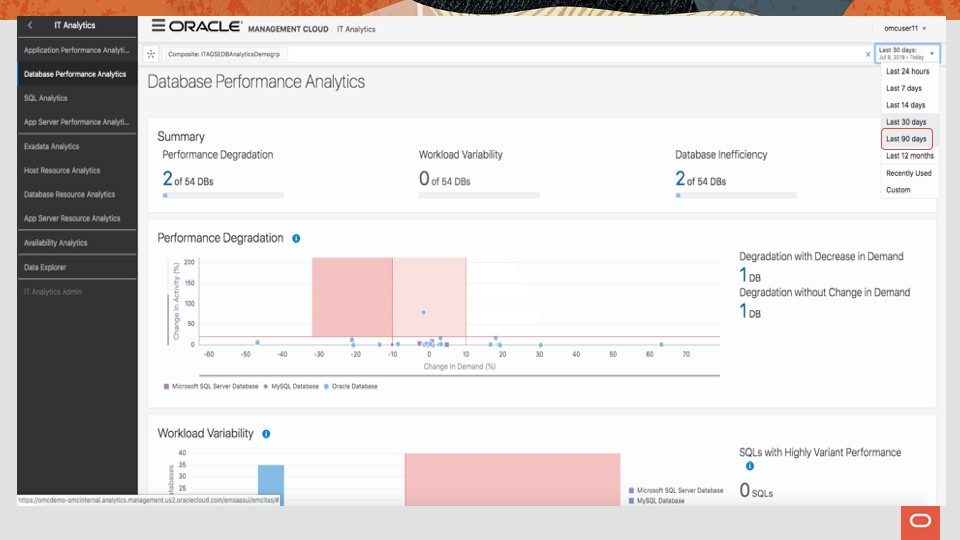

5.  Now, select a time period to review for the performance analysis. From the
    time selector drop down in the upper right that has the default ‘Last 30
    days’ appearing, **Select Last 90 days** from the menu.

    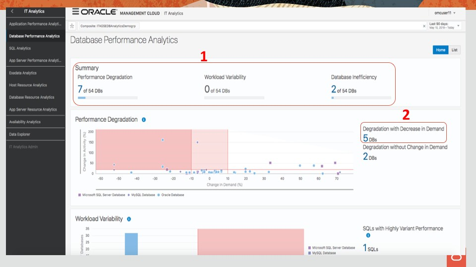

6.  **First** within the ITAGSEDBAnalyticsDemogrp group, the dashboard now
    identifies in the Summary section at the top, the Oracle Databases (DBs)
    that have had the following performance issues in the last 90 days: DBs with
    performance degradations, DBs with workload performance variability, and DBs
    with inefficiency. The Performance Degradation section shows change in
    activity (%) vs change in demand (%) for various DBs in
    “ITAGSEDBAnalyticsDemogrp” group and highlights the DBs whose activity has
    increased with decrease in demand or no change in demand. Databases with
    performance degradation are the databases whose performance has degraded
    over time and is correlated with change in demand. Where Demand = Executions
    and Activity = Database Time. Databases with Decrease in Demand are the
    databases having negative correlations between demand and activity. From the
    Performance Degradation section in Database Performance Analytics, you can
    identify the databases that have degraded in performance as follows:
    Degradation with decrease in demand Change in response time greater than 20%
    Change in activity less than -10% Degradation without change in demand
    Change in response time greater than 20% Change in activity between 10% and
    -10%. **Second**: under the ‘Degradation with Decrease in Demand’ heading
    **Click** on the **5 DBs link.**

    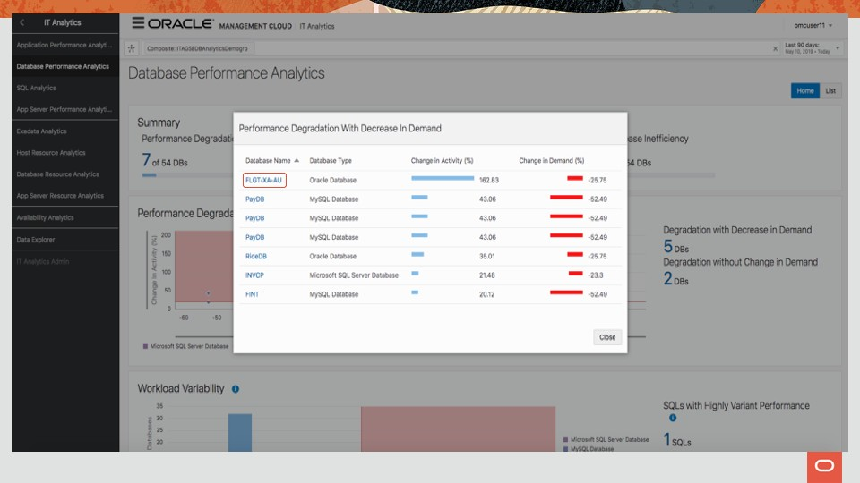

7.  Now shown are the details of databases having performance degradation with
    decrease in demand. To further drill down. **Click** one of the Database
    Name links, for example FLGT-XA-AU.

    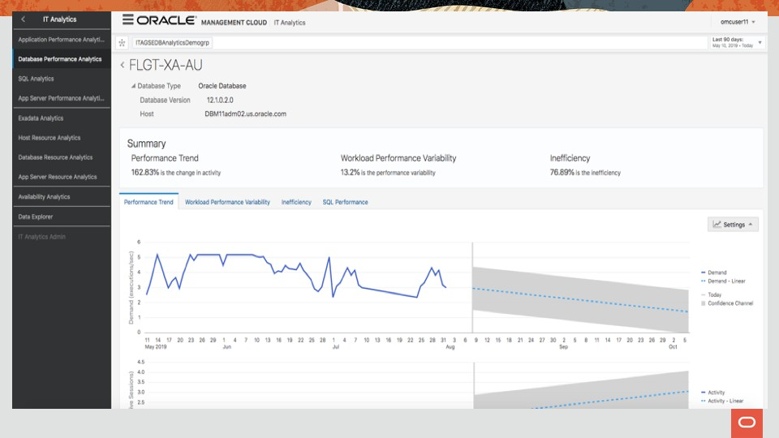

8.  It navigates to a page with more performance details on that database.
    **Scroll** down the page

    

9.  The **Performance Trend** tab provides details of the activity and demand
    trend for the selected database. First, on the right, under the settings
    header **Click** on Settings. Using this, one can also do activity and
    demand projections using different regression models. **Second**, **Click**
    on the **Workload Performance Variability** tab next as databases with
    variable performance are symptomatic of unpredictable workload and
    application response times. These are the databases with high degree of
    variance in SQL response time.

    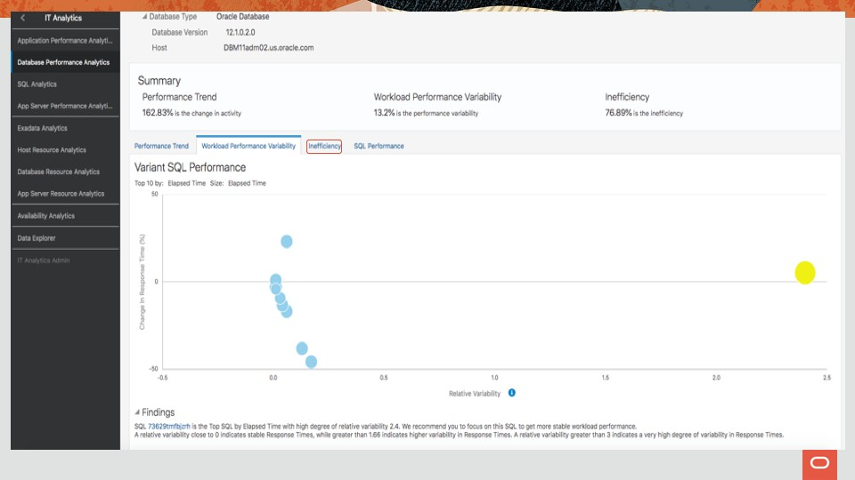

10. Under the Workload Performance Variability tab we see databases having a
    high degree of variance in SQL performance responsiveness. Next, **Click**
    on the **Inefficiency** tab

    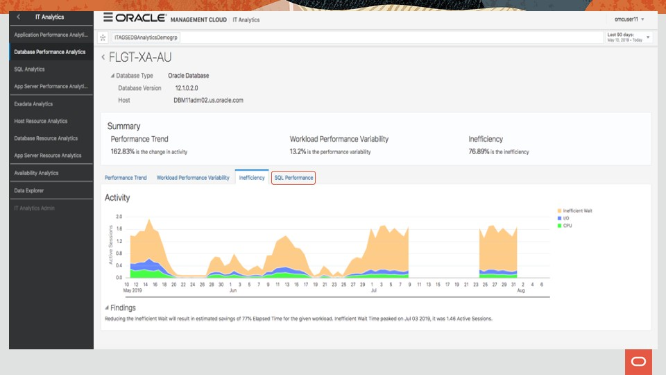

11. The **Inefficiency** tab shows active sessions and their breakdown by CPU,
    I/O and Inefficient Waits. Inefficient databases are those where a large
    percentage of database time in spent waiting on the application and not on
    CPU or I/O. Reduction of Inefficient Waits improves performance of a
    database. Next, **Click** on the **SQL Performance** tab.

    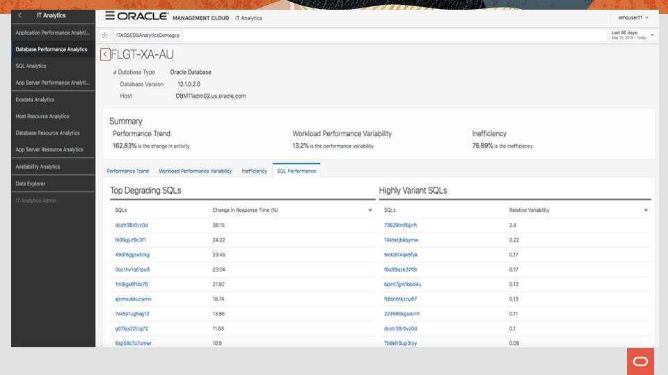

12. The **SQL Performance** tab highlights the top degrading and highly variant
    SQLs in this database. Next, Scroll up the page and next to the database
    name on the upper left (FLGT-XA-AU), **Click** on the back button (the
    greater than sign)

    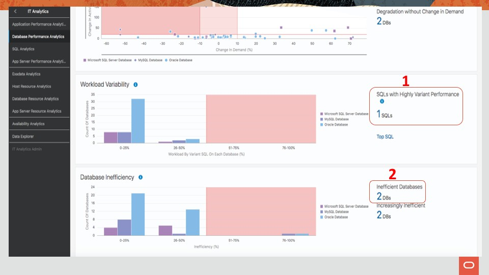

13. That will return us back to the **Database Performance Analytics**
    dashboard. **First, Scroll Down** to the **Workload Variability** section
    that displays Workload by Variant SQL on each database and identifies SQLs
    with **Highly Variant Performance** to its right. The **Database
    Inefficiency** section shows a summary of inefficiency for all databases and
    identifies the inefficient databases. **Second,** under Inefficient
    Databases **Click** on the 2 DBs.

    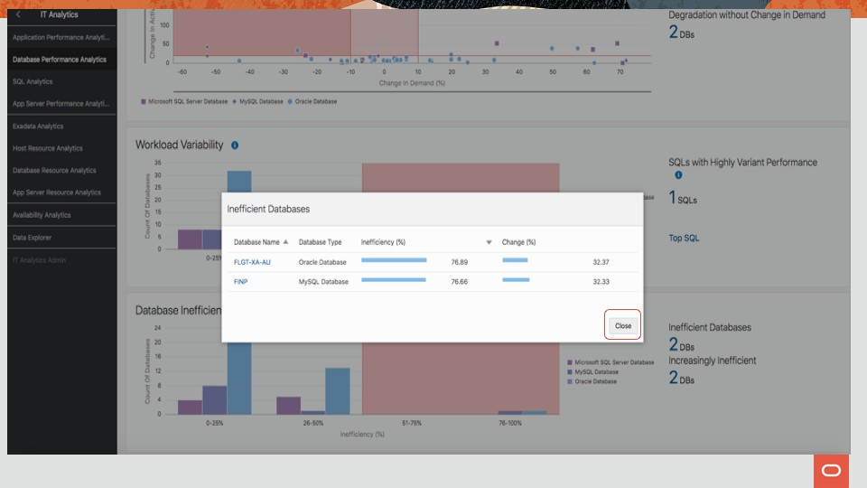

14. That then displays the percentage of database inefficiency. You can drill
    down into to a specific database further by **Clicking** on one of the names
    listed in the Databases Name column. Now **Click** the Close button to
    return back to the **Database Performance Analytics** dashboard.

    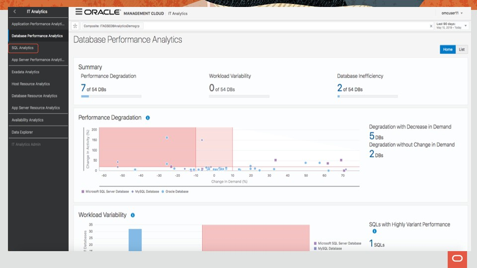

15. From the navigation bar on the far left, now **Click** on **SQL Analytics**

    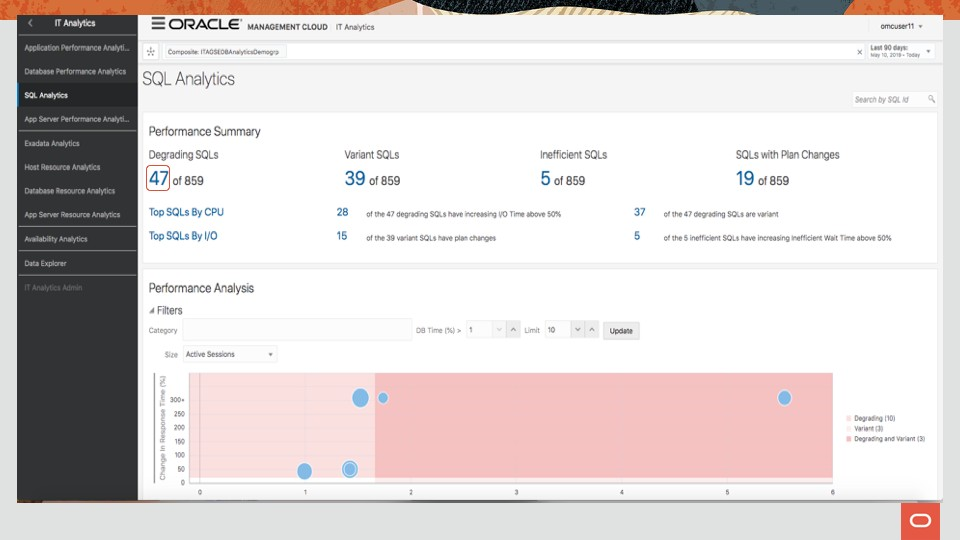

16. That then displays another out of box dashboard provided by OMC for
    performing SQL performance analysis. It shows the degrading, highly variant,
    inefficient SQLs and SQLs with plan changes running across all databases in
    the ITAGSEDBAnalyticsDemogrp and also highlights top SQLs by CPU and I/O. At
    the bottom a performance analysis chart for SQL is displayed with filtering
    options. **Note**: Since you’re using a live environment, data displayed in
    the dashboard may differ from what is shown in screenshots. Please pay
    attention to the functionality, rather than the exactness of data on a page.
    **Next**, under the Degrading SQLs heading, **Click** on the count; in this
    case 47.

    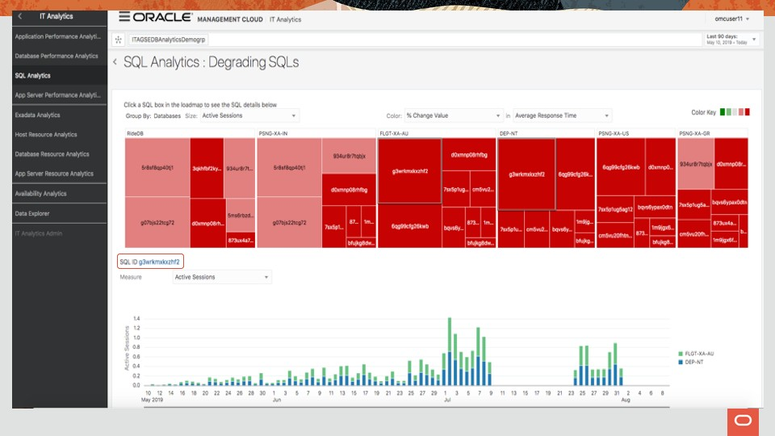

17. Here, degrading SQLs are displayed. To further analyze, **Click** on the SQL
    ID – in this case **g3wrkmxkxzhf2**

    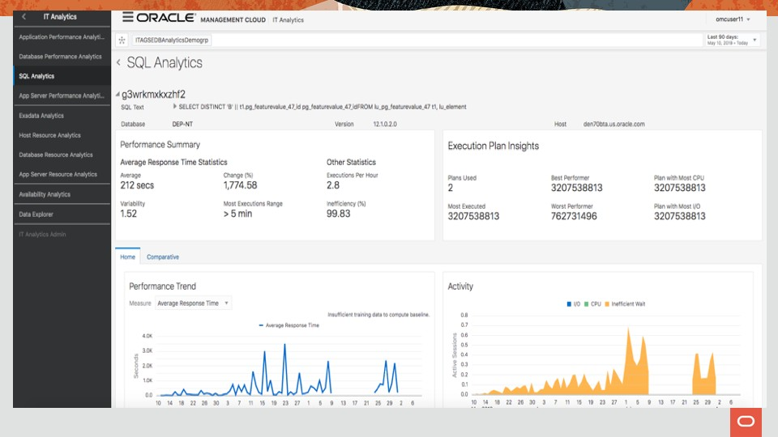

18. From here, you can review statistics, execution plan, trends and activity
    and further drill down and analyze root cause for the slowness.

 **Lab Activity 2: Identify Database Resource &  Capacity Planning Performance Bottlenecks**
======================================================================

**Scenario Details**

Users need to identify under-utilized and over­utilized databases and plan
future database capacity

**Task**

View all Oracle Databases running in the infrastructure, review and analyze them
together to identify any databases that are over-utilized, any databases
under-utilized. Then consolidate under/over-utilized resources using Machine
Learning. **NOTE**: During activities in this lab, data in dashboard may appear
differently than what appears in screenshots. Please focus on the flow and
steps, instead of the actual data values displayed in screenshots.

**Lab Goal**

Successfully perform database resource utilization and capacity planning of
database with IT Analytics.

**Value Proposition**

Proper database resource utilization is essential to maintaining optimal
database performance and cost.

**Duration**: 15 mins.

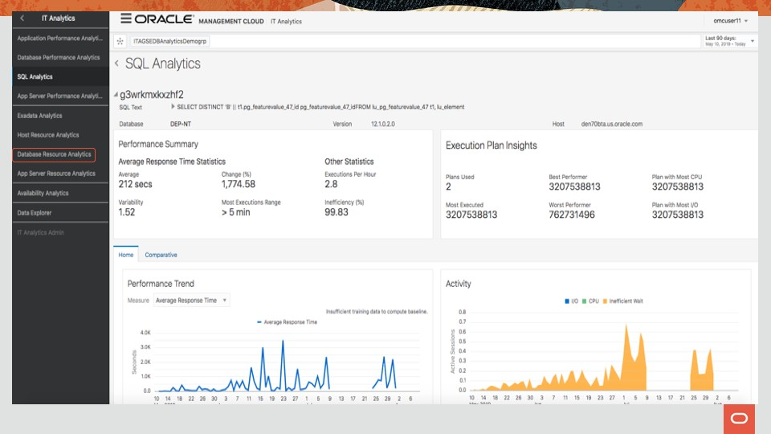

1.  From the navigation bar on the left, Click on Database Resource Analytics as
    highlighted

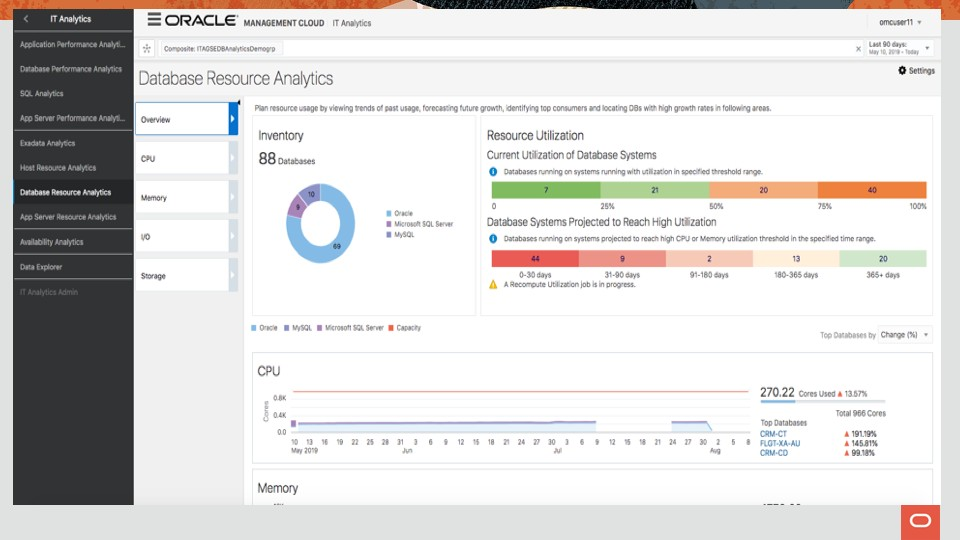

2.  This opens up the **Database Resource Analytics** dashboard. This is an out
    of box dashboard for performing database resource analytics

    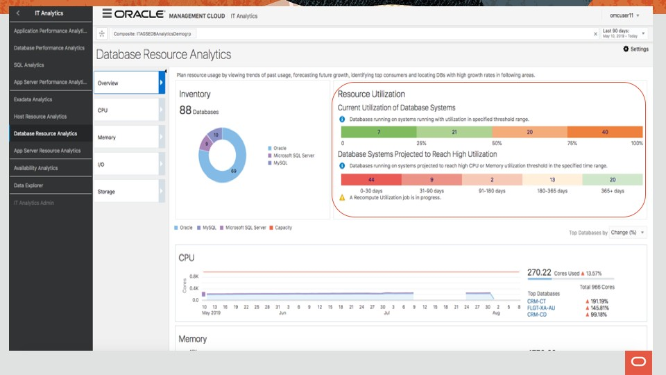

3.  The **Resource Utilization** section of the dashboard categorizes databases
    based on their current resource utilization. It also categorizes databases
    based on when they are projected to reach high CPU or Memory utilization by
    leveraging Machine Learning technology. Next **Scroll** down.

    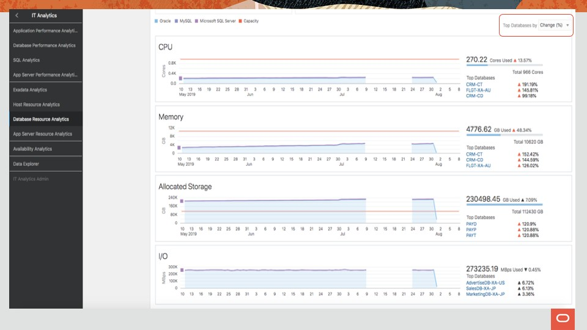

4.  The lower section of the dashboard shows aggregate usage of CPU, Memory,
    Allocated Storage and I/O and highlights top databases by their usage
    percentage for those resources. Next, in the upper right, Click the Top
    Databases by dropdown menu

    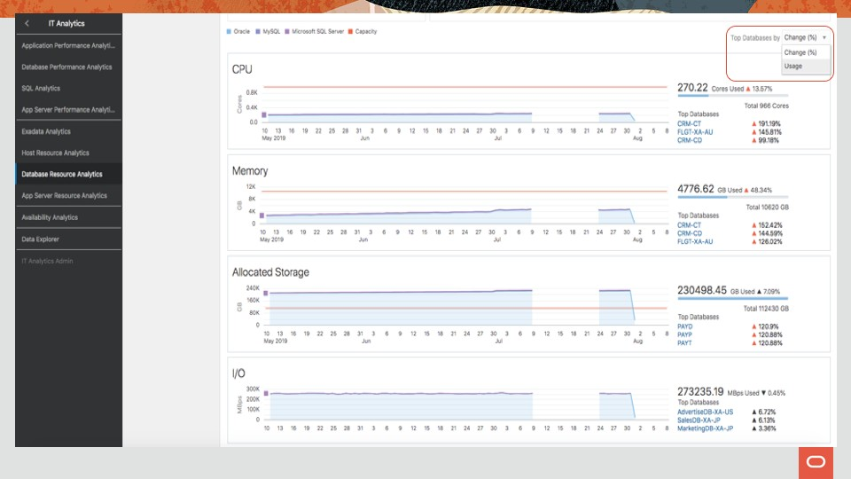

5.  Now, select Usage from the dropdown menu. It then displays the top used
    databases by their resource usage.

    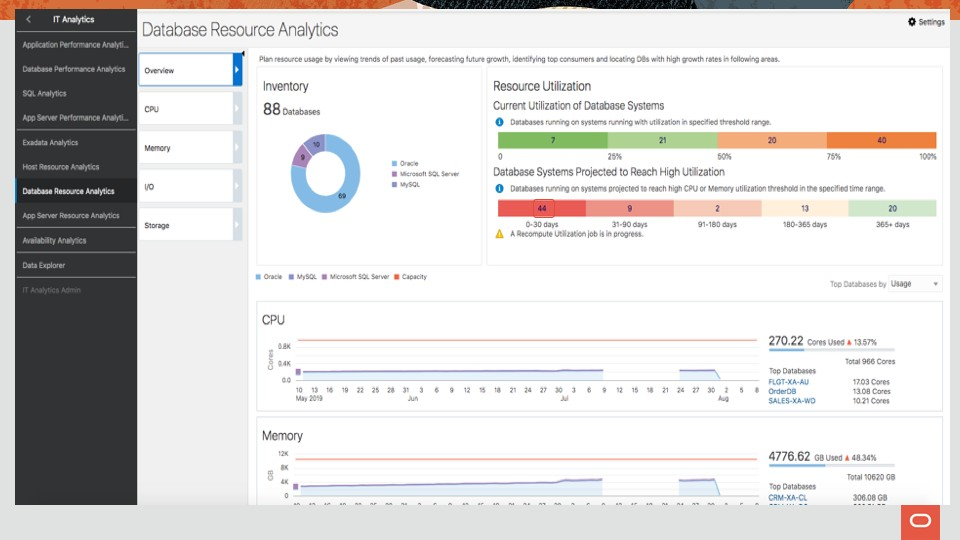

6.  **Scrolling** back up, under the Databases System Projected to Reach High
    Utilization heading now **Hover** over 0-30 days and the number that appears
    above it (in this case 44). Those are the databases projected to reach
    maximum CPU and memory utilization thresholds in next 30 days**.**

    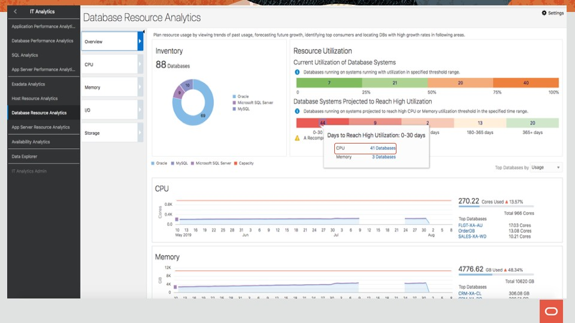

7.  Now **Click** on the number (44) and we see that there are 41 databases
    reaching their CPU maximum threshold in the next 30 days. Now Click on the
    41 Databases link displayed in blue, and the CPU tab opens where you get
    further detail on those databases.

    

8.  You see greater detail about the CPU usage and percentage change in CPU
    usage for those databases. There is also a CPU usage forecast for them also
    displayed.

    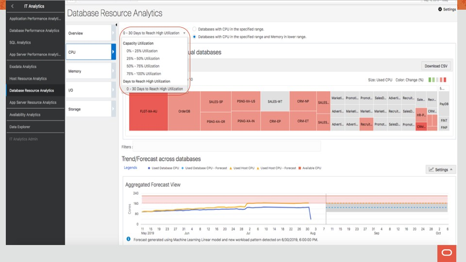

9.  In the upper right, **Click** on the **0-30 Days to Reach High Utilization**
    dropdown. From here you can filter the databases on their current
    utilization or Days to Reach High Utilization.

    

10.  **First** - under the **CPU breakdown by individual databases** heading, from the **Group By** dropdown, **Click** on **Target Version** to what selections are available. You can use the Group By option to review specific database properties (Lifecycle Status, Target Version…) in the treemap. **Selecting Target Version** there further is a check box you can use to filter and just display the **Top 10** databases. **Second** - go ahead and **Check** the **Top 10** check box. **Third** - There is also the option to view the databases in a table format. **Click** on the table icon (looks like small cubes) just to the right of the treemap icon.
    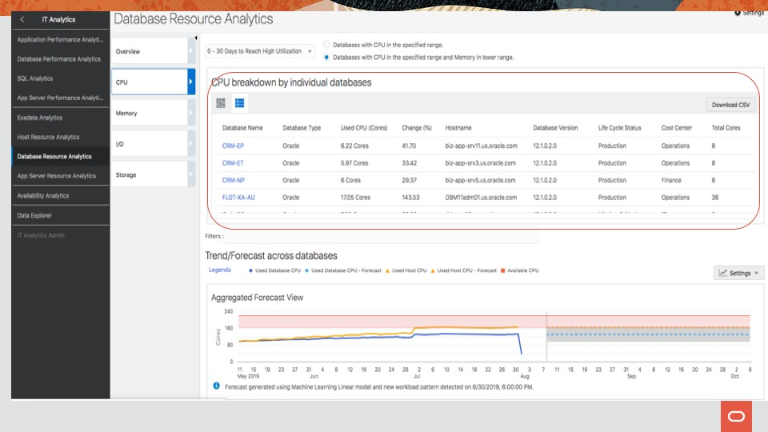

11. Now under the CPU breakdown by individual databases heading, you can review the information displayed for each database in a table format.

    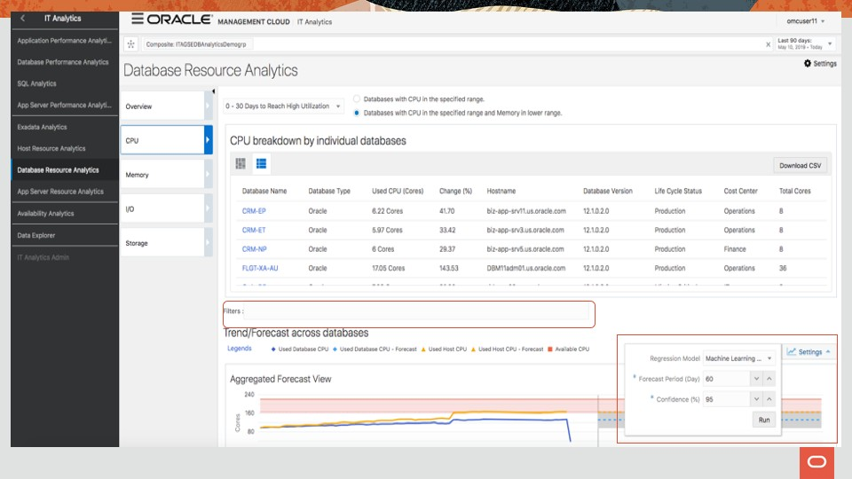

12. Next, on the lower right, Click **Settings** to view different models for
    forecasting database CPU utilization. To the left of **Settings**, using the
    **Filters** command bar, you can perform a forecast on a set of databases
    you specify. **Similar** functionality is available for analysis of other
    resources (Memory, I/O, Storage).

>   That completes Lab 2 for Proactive Oracle Database Performance Management
>   using Oracle IT Analytics.

 **Lab Activity 3: Maximizing Oracle Exadata Performance, Capacity Planning** 
========================================================================

**Scenario Details**

How to ensure performance of databases running on Oracle Exadata’s and that
there is sufficient Exadata capacity.

**Task**

View all Oracle Exadata systems together, review and analyze them together to
identify any that are over-utilized, any under-utilized. Identify Exadata
systems having available capacity to support consolidation of additional
databases. Based on current load growth, what (CPU, Memory, I/O) bottlenecks are
projected. NOTE: During activities in this lab, data in dashboard, names of
Exadata machine host, databases, SQL_IDs and metric numbers may change or appear
differently than what appears in screenshots. Please focus on the flow and
steps, instead of the actual data values displayed in screenshots.

**Lab Goal**

Successfully perform database resource utilization and capacity planning of
Exadata systems with IT Analytics.

**Value Proposition**

Proper resource utilization is essential to maintaining optimal database
performance and cost.

**Duration**: 15 mins.

1.  Let’s identifying which Exadata system(s) will run out of capacity in less
    than a month and which system has databases with less than a month
    remaining. From the navigation bar on the left, **Click** IT Analytics and
    then further **Click** on Exadata Analytics.

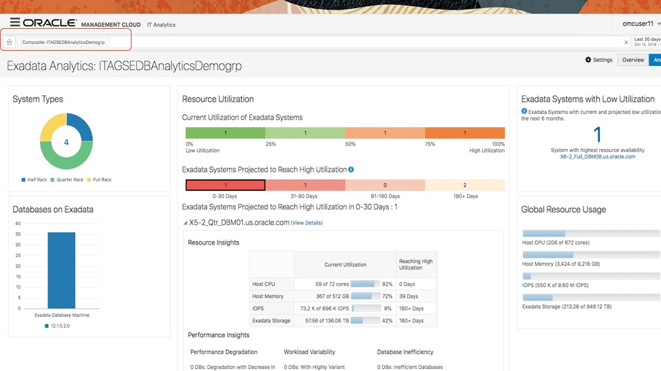

2.  At the top left, in the global entity selector, **Type** in **ITA** and when
    the **ITAGSEDBAnalyticsDemogrp** appears, select it.

    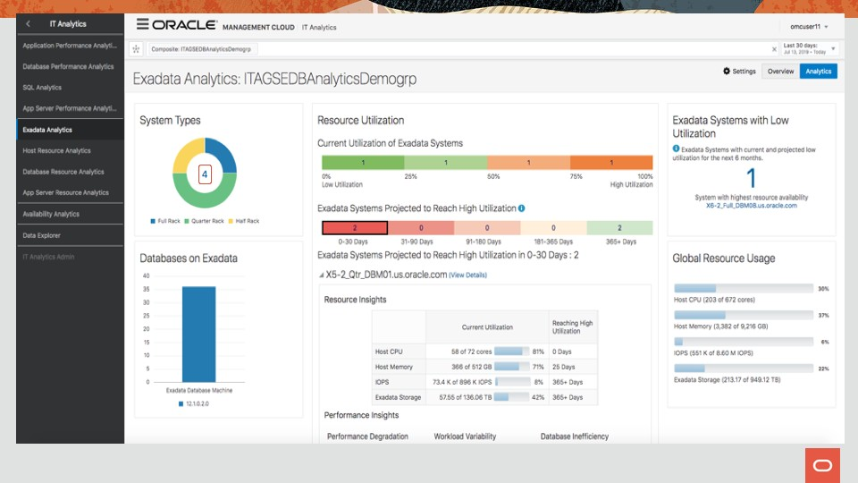

3.  Exadata Analytics enables you to get visibility into your entire fleet of
    Oracle Exadata systems. You can view current utilization of key resources
    (CPU, Memory, Storage, Disk, IOPS...) for last 90 days. In the upper left,
    under the **System Types** heading, **Click** on the number in the middle of
    the circle (in this case 4). That will show an inventory of all Exadata
    systems you have in your fleet.

    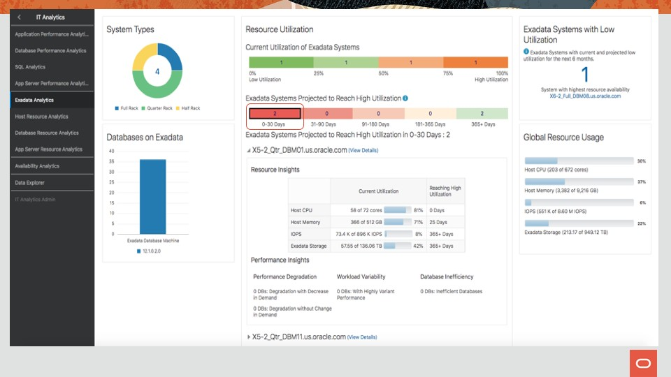

4.  Next go and **Hover** under the **Exadata Systems Projected to Reach High
    Utilization** heading. Analyzed and displayed are the Exadata systems
    reaching capacity in 30, 90, or 180 days. Using Exadata Analytics, you can
    forecast capacity growth, make informed decisions and plan. **Click 0-30
    Days** where 2 Exadata systems are identified.

    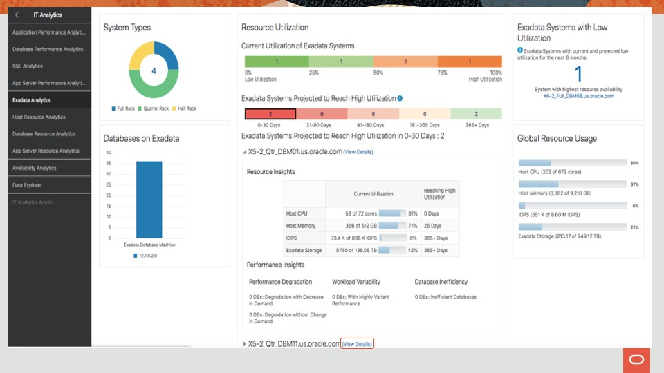

5.  To check on the Exadata systems forecasted to run out of capacity shortly.
    Click on the View Detail link for one of the Exadata system displayed. In
    this case (X5- 2_Qtr_DBM11.us.oracle.com.

    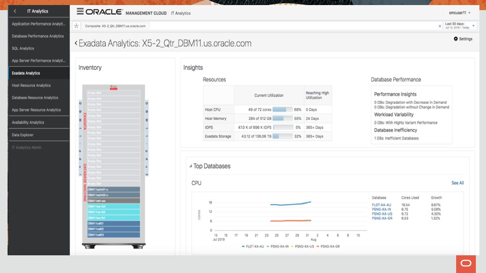

6.  Next on the page for that Exadata system, under the **Insights** heading,
    you can view details about it**.**

    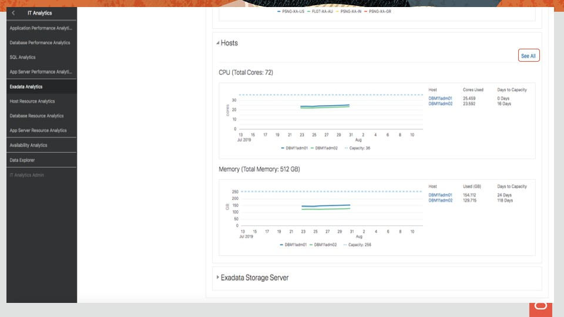

7.  Scroll down the page and when you get to the **Hosts** heading **Click** and
    expand it to view which databases are running out of CPU resources. In this
    case (DBM11adm01). Next in the upper right, **Click See All**

    

8.  In the **Host Resource Analytics** section, Utilization: CPU and Memory drop
    down menu, increasing utilization can be seen. **Hover** your mouse over the
    **CPU Top Hosts** graph to view associated host and CPU utilization. Then
    **Scroll** down further and under the **Trends and Forecast** tab you can
    view additional information. Afterwards, **Click** on the **Hosted Entity
    Utilization** tab to identify the database using most resources.

    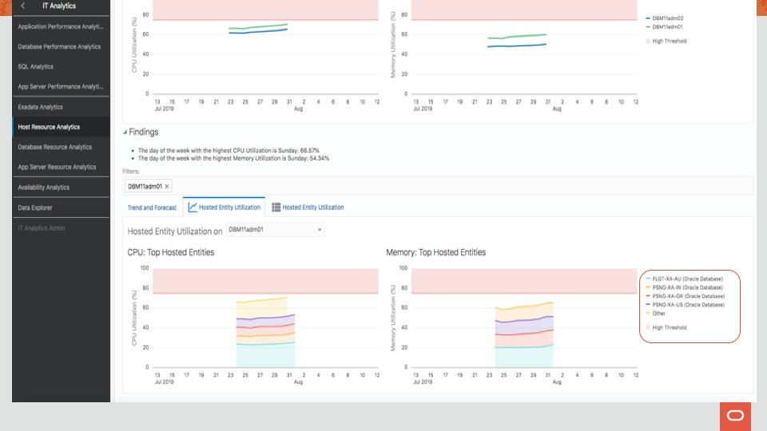

9.  Under the **Hosted Entity Utilization** tab can be viewed all the databases
    running on this host and the top databases using the most CPU resources.

That concludes this lab.

>   [Return back to top menu listing all available labs](../readme.md)

