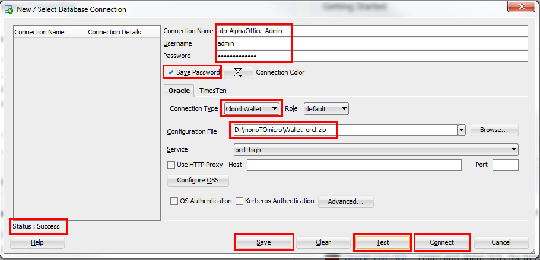
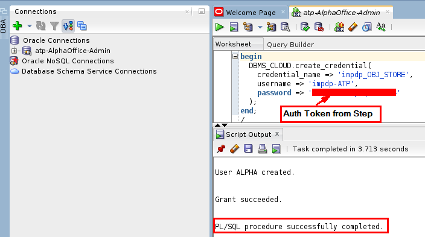

# Monolithic to Microservice Experience -- Autonomous Microservice Data Structure Configuration

# Object Storage Setup, OCI User Creation and Auth Token Generation

### **STEP 1**: Log in to your OCI dashboard

  - From any browser go to

    [https://cloud.oracle.com/en_US/sign-in](https://cloud.oracle.com/en_US/sign-in)

  - Enter your **Cloud Account Name** in the input field and click the **Next** button.

	

  - Enter your **Username** and **Password** in the input fields and click **Sign In**.

	

  - In the top left corner of the dashboard, click the **Guided Navigation Drawer**

	

  - Click to expand the **Services** submenu, then click **Compute**

	

### **STEP 2**: Create Object Storage Bucket

  - Click the **Menu icon** in the upper left corner to open the navigation menu. Under the **Core Infrastructure** section, select **Object Storage** then **Object Storage** .

	

  - Select the **Compartment** `monoTOmicro` and click **Create Bucket**

	

  - In the **Bucket Name** field, enter `atpData` and click **Create Bucket**

	
	
  - In a moment, your new Object Storage Bucket will show up in the list

	

### **STEP 3**: Upload Data Pump File into Object Storage Bucket

  - Click on the `atpData` Bucket and click **Upload Object**

	

  - **Browse** or **Drag/Drop** the Data Pump DMP `.../monolithic-to-microservice/lab-resources/database/expdp_alpha121.dmp` included in the GIT repository you cloned earlier. Click **Upload Object**

	

  - In a moment, the file will be uploaded to Object Storage

	

### **STEP 4**: Create OCI User 

  - Click the **Menu icon** in the upper left corner to open the navigation menu. Under the **Governance and Administration** section, select **Identity** and select **Users**.

	

  - Click **Create User**

	

  - Enter the **Name** `impdp-ATP` and desired **Description** and click **Create**

	

  - In a moment, your new user will show up in the list

	

  - Click on the new user `impdp-ATP`, select the **Resource** `Groups` and click **Add User to Group**

	

  - Select the `Administrators` group and click **Add**

	

**STEP 5**: Generate Auth Token for OCI User

  - For the new user `impdp-ATP`, select the **Resource** `Auth Tokens` and click **Generate Token**

	

  - Enter a **Description** and click **Generate Token**

	

  - Click **Copy** and save the value of the **Generated Token** in a text document. You will need it later when executing the **DBMS_CLOUD.create_credential** Package.

	

# Setup SQL Developer Connection to ATP, Create Database User and DBMS_CLOUD Credential in ATP

### **STEP 6**: Download ATP Wallet Zip File

  - Click the **Menu icon** in the upper left corner to open the navigation menu. Under the **Database** section, select **Autonomous Transaction Processing**.

	

  - Select the **AlphaOffice** ATP Database

	

  - Click **DB Connection**

	

  - Click **Download**

	

  - Enter the **Password** `a1phaOffice1_` and click **Download**

	

  - The ATP Wallet file **Wallet_orcl.zip** contains the following files

	

### **STEP 7**: Create SQL Developer Connection to ATP Database

  - Open **SQL Developer** available on the client image

  - In the **Connections** Pane, Click 

	

  - Enter/Select the following values, click **Test**. After a `Successful` **Status**, click **Save**, then **Connect**

	```
	Connection Name:	atp-AlphaOffice-Admin
	Username:		admin
	Password: 		a1phaOffice1_
	Select 			Save Password
	Connection Type:	Cloud Wallet
	Configuration File:	The Wallet_orcl.zip you downloaded in the previous step
	```
	
	

### **STEP 8**: Create Database User in ATP Database

  - In the **SQL Developer Worksheet**, execute the following SQL Statements to create the `alpha` database user.
	
	```
	create user alpha identified by "a1phaOffice1_";
	grant dwrole to alpha;
	```

	

### **STEP 9**: Create DBMS_CLOUD Credential 

  - In the same **SQL Developer Worksheet**, execute the following SQL Statements to create the **DBMS_CLOUD Credential** `impdp_OBJ_STORE`.

	```
	begin
	  DBMS_CLOUD.create_credential(
		credential_name => 'impdp_OBJ_STORE',
		username => 'impdp-ATP',
		password => 'Auth Token Generated in STEP 5'
	  );
	end;
	/
	```
	
	

# Import Data Pump Export file into ATP Databse and Download/Inspect Data Pump Log File 

### **STEP 10**: Add DBA View and ATP SQL Developer Connection 

### **STEP 11**: Import Data into ATP Instance using Data Pump Import Wizard

### **STEP 12**: Review Data Pump Import Log