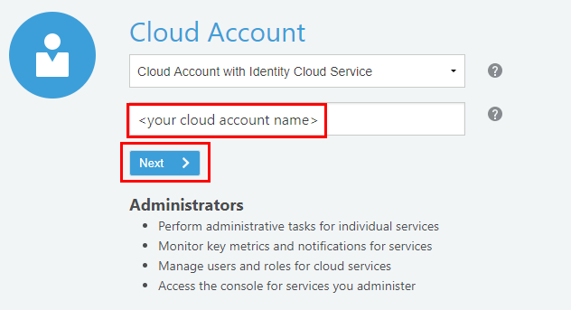
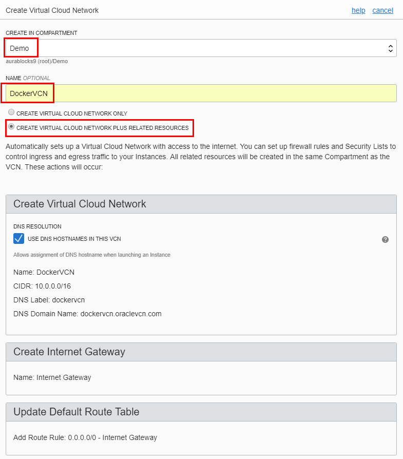
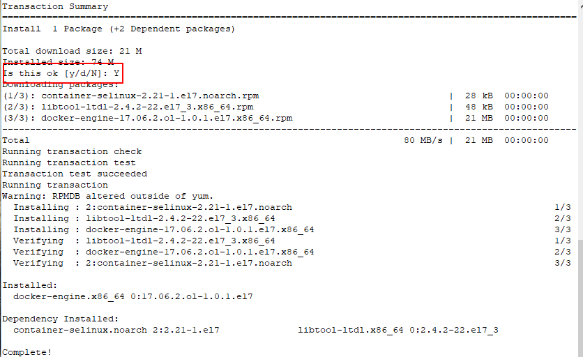
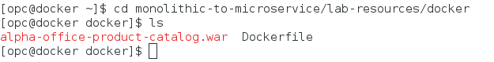

# Monolithic to Microservices Workshop - Container Microservice Deployment

  

## Introduction
In this lab you will use your Oracle Cloud Trial Account, create ssh key pairs, login into your Trial, create a VCN (Virtual Compute Network) and Compartment, create a new compute instance and install docker / git into the instance.

***To log issues***, click here to go to the [github oracle](https://github.com/oracle/learning-library/issues/new) repository issue submission form.

## Objectives

- Create the baseline infrastructure to support a Compute instance
- Create a SSH key pair
- SSH into the instance: Install Docker and GIT
- Create a baseline Docker image and then dDeploy the AlphaOffice application
- Customize the container to connect to your ATP DB and save a new image
- Run a Docker container based off of your new image


## Required Artifacts

- If running from Windows: [Putty and PuttyGen](https://www.chiark.greenend.org.uk/~sgtatham/putty/latest.html)

# Log into  your Trial Account and Create Infrastructure

You will create all required infrastructure components within your Trail account.

## Your Trial Account

### **Step 1**: Your Oracle Cloud Trial Account

- You have already applied for and received you're Oracle Cloud Trial Account.


### **STEP 2**: Log in to your OCI dashboard

- Once you receive the **Get Started with Oracle Cloud** Email, make note of your **Username, Password and Cloud Account Name**.

  

- From any browser go to. :

    [https://cloud.oracle.com/en_US/sign-in](https://cloud.oracle.com/en_US/sign-in)

- Enter your **Cloud Account Name** in the input field and click the **My Services** button. If you have a trial account, this can be found in your welcome email. Otherwise, this will be supplied by your workshop instructor.

  

- Enter your **Username** and **Password** in the input fields and click **Sign In**.

  

- In the top left corner of the dashboard, click the **hamburger menu**

  

- Click to expand the **Services** submenu, then click **Compute**

  


### **STEP 3**: Create a Compartment

Compartments are used to isolate resources within your OCI tenant. User-based access policies can be applied to manage access to compute instances and other resources within a Compartment.

- Click the **hamburger icon** in the upper left corner to open the navigation menu. Under the **Identity** section of the menu, click **Compartments**

  

  

  - Click **Create Compartment**

    

  - In the **Name** field, enter any name you want. For this example we will be using the name `Demo` going forward. Enter a **Description** of your choice. Click **Create Compartment**.

    

  - In a moment, your new Compartment will show up in the list.

    

### **STEP 4**: Create a Virtual Compute Network

We need a default VCN to define our networking within the `Demo` compartment (_Or the name you used for your compartment_). This is where Subnets and Security Lists, to name a couple get defined for each Availablity Domains in your Tenancy. Oracle Cloud Infrastructure is hosted in regions and availability domains. A region is a localized geographic area, and an availability domain is one or more data centers located within a region. A region is composed of several availability domains. Availability domains are isolated from each other, fault tolerant, and very unlikely to fail simultaneously. Because availability domains do not share infrastructure such as power or cooling, or the internal availability domain network, a failure at one availability domain is unlikely to impact the availability of the others.

All the availability domains in a region are connected to each other by a low latency, high bandwidth network, which makes it possible for you to provide high-availability connectivity to the Internet and customer premises, and to build replicated systems in multiple availability domains for both high-availability and disaster recovery.

- Click the **hamburger icon** in the upper left corner to open the navigation menu. Under the **Networking** section of the menu, click **Virtual Cloud Networks**

    

- Select your compartment from the LOV.

    

- Click **Create Virtual Cloud Network**

    

- Fill in the follow values as highlighted below:

    

    

- Click **Create Virtual Cloud Network**

- Click **Close** on the details page:

    

- You will see:

    

### **STEP 5**: Add a Security List entry

A security list provides a virtual firewall for an instance, with ingress and egress rules that specify the types of traffic allowed in and out. Each security list is enforced at the instance level. However, you configure your security lists at the subnet level, which means that all instances in a given subnet are subject to the same set of rules. The security lists apply to a given instance whether it's talking with another instance in the VCN or a host outside the VCN.

- Click on the **DockerVCN** and then **Security Lists**

    

    

- Click on **Default Security List for DockerVCN**

    

For the purposes of the upcoming Docker deployments we need to add five Ingress Rules that allow access from the Internet to ports 9080, 8002, 18002, 5600, and 8085. In a production environment only the UI port (8085) would typically be opened for access but the labs will have us test various other Application and Oracle centric functionality as we go, thus the need to open other ports.

- Click **Edit All Rules** and then select **+ Another Ingress Rule**

  **`NOTE: DO NOT EDIT AN ALREADY EXISTING RULE, ADD A NEW ONE`**

    

    

- **Enter the following**

  **NOTE:** Leave all other values at default

  ```
  Source CIDR: 0.0.0.0/0
  Destination Port Range: 8080
  ```

  

- Click the **Save Security List Rules** button

    

- Your Ingress Rules should look like:

    

### **STEP 6**: Create SSH Key Pair (Linux or Mac client)

Before we create the Compute instance that will contain Docker and application deployments we need to create an ssh key pair so we'll be able to securely connect to the instance and do the Docker installation, etc.

**NOTE:** `This step focuses on key pair generation for Linux or Mac based terminal sessions. If your going to run your terminal sessions from a Windows client then skip to STEP 7`

- In a `Linux/Mac` client terminal window **Type** the following (**You don't have to worry about any passphrases unless you want to enter one**)

```
ssh-keygen -b 2048 -t rsa -f dockerkey
```

- Your key pair is now in the current directory

    

- **NOTE for Linux and Mac Clients:** Just open up the pubic key file in an editor (vi) and select / copy the entire contents to be used in Step 8.   

    

### **STEP 7**: Create SSH Key Pair (Windows client)

For Windows clients this example will show the use of PuttyGen to generate the keypair. [Putty and PuttyGen](https://www.chiark.greenend.org.uk/~sgtatham/putty/latest.html) are available for download.

- Run **PuttyGen** and click **Generate**

    

- Once the generation process completes click the **Save Private Key** button and save to a directory of your choice.

- If prompted to save without a passphrase click yes.

    

**NOTE:** `Do not save the public key as the format is not compatable with Linux openSSH.

- Instead, **Select the entire Public Key in the display and right-click copy**. `This content will be pasted into the Create Instance dialog in Step 8.`

    

### **STEP 8**: Create a Compute Instance

You will now create a Linux based Compute instance using the public key you just generated.

- Go back to your OCI console and from the hamburger menu in the upper left hand corner select **Compute-->Instances**

    

- Click **Create Instance**

   

- **You will (Select / Leave Default) or Type** the following in the `Create Compute Instance` section of the dialog:

```
Name: Docker
Availability Domain: AD 1 (Use default AD 1)
Boot Volume: Oracle-Provided OS Image
Image Operating System: Oracle Linux 7.5 (Select Oracle Linux 7.5)
Shape Type: Virtual Machine (Default)
Shape: VM.Standard2.1 (Default)
SSH Keys: Choose SSH Key Files
```

- After entering the _Docker_ instance name click the **Change Image Source**.

   

- Select **Oracle Linux 7.5** and click **Select Image**.

   

- This selection will now be shown on the page:

   

- Scroll down furthur on the page and select your PUBLIC SSH Key
**NOTE:** You will paste the public key you copied in Step 7 into the SSH KEY field by selecting the "Paste SSH Keys" radio button. `The public key should all be on ONE LINE`

   

- In the Configure networking Section you will take ALL of the defaults as shown:

   

- Click **Create**

After a few minutes you should see a running instance with a Public IP Address.

- `Make a note of the IP Address as we will be using this in the next step.`

   


### **STEP 9**: SSH into the Instance and install Docker

Continue the setup: SSH into the Compute image and install Docker and GIT.

- For a Windows client session bring up Putty, select the **Session** section and type in the IP address:

   

- Select the **Data** section and enter the following as the username:

```
opc
```

- Screenshot:

  

- Select **SSH-->Auth** and browse to the Private Key you created back in Step 7:

   

- Click the **Open** button. You will presented the first time with am alert message. Click **Yes**

   

- You will logged into the Compute image:

   

- **NOTE:** For Linux and Mac client sessions "cd" into the directory where your key pair is. Make sure the dockerkey file has the permissions of "600" (chmod 600 dockerkey) and ssh into the compute instance `substituting your IP address`.

Example:

```
cd <directory of your key pair>
chmod 600 dockerkey
ssh -i ./dockerkey opc@129.213.119.105
```

- Linux / Mac screenshot:

  

### **STEP 10**: Install and configure Docker and GIT

Docker and GIT are required for the subsuquent labs. You will install the Docker engine, enable it to start on re-boot, grant docker privledges to the `opc` user and finally install GIT.

- **Type** the following:

```
sudo -s
yum install docker-engine
usermod -aG docker opc
systemctl enable docker
systemctl start docker
```

- **NOTE:** During the `yum install docker-engine` command press `Y` is asked if installation is ok.

- Screenshot at the end of the Docker installation:

   

   

- **Type** the following:

```
yum install git
```

- Screenshot at the end of the GIT installation:

   

- **Type** the following to verify good installations:

```
su - opc
docker version
docker images
git --version
```

   

### **STEP 11**: Edit /etc/sysconfig/selinux

Set the server to Permissive mode and also ensure that permissive mode survives re-boots by editing `/etc/sysconfig/selinux`

- Using vi, change the SELINUX line to **permissive**. **Type** the following: (**NOTE**: You need to be the root user to edit this file)

```
sudo -s
vi /etc/sysconfig/selinux
```

- **NOTE:** If new to vi, press the letter `i` to edit text. To save press Escape, the type `:wq!`.

   

- Save the file and exit out of vi

- Now, **Type** the following:

```
setenforce 0
sestatus
```

- Verify that your server is in permissive mode.

   

- **Type** the following to exit out of `root` and go back and verify that you're now the `opc` user:

  ```
  exit
  whoami
  ```

  


# Deploy the AlphaOffice Application using Docker

In this section you will clone a github repository containing a Java Application and modify the configuration so it will query your ATP database. After successfull testing you will create a new Docker image and push this up to your Docker Hub account or Oracle Container Registry.

## Deploy AlphaOffice Product Catalog Application

### **Step 1**: Clone the git repository

- Clone the git repository that contains the AlphaOffice application. **Type or Copy and Paste**:

  ```
  got clone https://github.com/derekoneil/monolithic-to-microservice.git
  ```

  

- From the directory you cloned the repository into **Type**:

  ```
  cd monolithic-to-microservice/lab-resources/docker
  ```

- In this step you are going to build a Docker image based on command the the provided Dockerfile. It will take a baseline docker image from Docker Hub and add the Glassfish 4.1.1 application server and then deploy the `alpha-office-product-catalog.war` into the application server running on port 8080. If you recall you opened port 8080 in the Networking Security List earlier in this lab so access from the outside can occur.

  The Dockerfile defines what happens in the image build. The contents look like:

  ```
  FROM        java:8-jdk

  ENV         JAVA_HOME         /usr/lib/jvm/java-8-openjdk-amd64
  ENV         GLASSFISH_HOME    /usr/local/glassfish4
  ENV         PATH              $PATH:$JAVA_HOME/bin:$GLASSFISH_HOME/bin

  RUN         apt-get update && \
              apt-get install -y curl unzip zip inotify-tools && \
              rm -rf /var/lib/apt/lists/*

  #download and install the glassfish server
  RUN         curl -L -o /tmp/glassfish-4.1.zip https://download.oracle.com/glassfish/4.1.1/release/glassfish-4.1.1.zip && \
              unzip /tmp/glassfish-4.1.zip -d /usr/local && \
              rm -f /tmp/glassfish-4.1.zip

  #clone and deploy the project on the glassfish server
  #RUN     git clone http://myrepository.git /usr/local/mypath
  COPY     alpha-office-product-catalog.war /usr/local/glassfish4/glassfish/domains/domain1/autodeploy/alpha-office-product-catalog.war

  EXPOSE      8080

  WORKDIR     /usr/local/glassfish4

  # verbose causes the process to remain in the foreground so that docker can track it
  CMD         asadmin start-domain --verbose
  ```

- You will see the baseline `alpha-office-product-catalog.war` file and a `Dockerfile`:

  


**This completes the Lab!**

**You are ready to proceed to [Lab 300](LabGuide300.md)**
