# Terraform and Oracle Cloud Infrastructure

## Table of Contents

[Overview](#overview)

[Pre-Requisites](#pre-requisites)

[Practice 1: Generate SSH Keys](#practice-1-generate-ssh-keys)

[Practice 2: Signing in OCI Console](#practice-2-signing-in-oci-console)

[Practice 3: Create a Bastion Server](#practice-3-create-a-bastion-server)

[Practice 4: Collect the Required OCIDs for Terraform](#practice-4-collect-the-required-ocids-for-terraform)

[Practice 5: Install and Configure Terraform in Bastion Server](#practice-5-install-and-configure-terraform-in-bastion-server)

[Practice 6: Creating a web server with Terraform](#practice-6-creating-a-web-server-with-terraform)

[Practice 7: Setup Container Engine for Kubernetes OKE using Terraform](#practice-7-setup-container-engine-for-kubernetes-oke-using-terraform)

[Practice 9: Creating an Application on Kubernetes Cluster](#practice-9-creating-an-application-on-kubernetes-cluster)


## Overview

The lab exercise provides instructions for downloading and installing both Terraform and the Oracle Cloud Infrastructure  Terraform provider, and provides a brief introduction to the key concepts for understanding and using the Oracle Cloud Infrastructure  Terraform provider.

Oracle Cloud Infrastructure Container Engine for Kubernetes is a fully-managed, scalable, and highly available service that you can use to deploy your containerized applications to the cloud. Use Container Engine for Kubernetes (sometimes abbreviated to just OKE) when your development team wants to reliably build, deploy, and manage cloud-native applications.

Container Engine for Kubernetes uses Kubernetes - the open-source system for automating deployment, scaling, and management of containerized applications across clusters of hosts. Kubernetes groups the containers that make up an application into logical units (called pods) for easy management and discovery. Container Engine for Kubernetes uses versions of Kubernetes certified as conformant by the  [Cloud Native Computing Foundation (CNCF)](https://github.com/cncf/k8s-conformance)

## Pre-Requisites

- Oracle Cloud Infrastructure account credentials (User, Password, and Tenant)
- Region and compartment with limits for a few small instances (1.1 or 2.1 is sufficient)

## Practice 1: Generate SSH Keys

Generate SSH keys to be used later while launching an instance.

#### MAC/LINUX 

1) Generate ssh-keys for your machine if you don’t have one. As long as an id_rsa and id_rsa.pub key pair is present they can be reused. By default these are stored in ~/.ssh
```   
   # ssh-keygen
```
2) Make sure permissions are restricted, sometimes ssh will fail if private keys have permissive permissions.
``` 
    # chmod 0700 ~/.ssh  
    # chmod 0600 ~/.ssh/id_rsa  
    # chmod 0644 ~/.ssh/id_rsa.pub
```
#### FOR WINDOWS

1) Install git for windows. Download <https://github.com/git-for-windows/git/releases/download/v2.13.0.windows.1/Git-2.13.0-64-bit.exe> and install.

2) Open Git-bash:
    
  

3) Generate ssh-keys by running this command in Git Bash
```
# ssh-keygen  
Generating public/private rsa key pair.  
Enter file in which to save the key
(/c/Users/username/.ssh/id\_rsa):  
Created directory '/c/Users/username/.ssh'.  
Enter passphrase (empty for no passphrase):  
Enter same passphrase again:  
Your identification has been saved in /c/Users/username/.ssh/id\_rsa.  
Your public key has been saved in /c/Users/username/.ssh/id\_rsa.pub.  
```
> **Note**: In Git-Bash, C:\\Users\\username\\ is shown as /c/Users/username/

## Practice 2: Signing in OCI Console

1) Open a supported browser and go to the Console URL. For example, [https://console.us-ashburn-1.oraclecloud.com](https://console.us-ashburn-1.oraclecloud.com).

2) Enter your tenant name: <Tenant> and click **Continue**

  

3) Your instructor has provided you with a username and password combination for your account. Enter your user name and password

 - **Username:** api.user
 - **Password:** _instructor will provide password_
 

When you sign in to the Console, the home page is displayed.


The home page gives you quick links to the documentation and to Oracle Support.

4. The compartment for this hands on lab is 'Demo'

5. Click on **MENU** on top left, **Identity** then to **Policies**. 

Select the tenancy’s root compartment from the list on the left: Tenancy name (root). (gse00014448 in the screenshot)
- Click Create policy and enter the following:
- Name: Enter a unique name for your policy such as "oke-service”
- Description: Enter a description (for example, “oke-service-policy”) o Policy Versioning: Select Keep Policy Current
- Policy Statements: enter the following policy statement:

```
   allow service OKE to manage all-resources in tenancy

```

Click **Create**


## Practice 3: Create a Bastion Server

Oracle Cloud Infrastructure Compute lets you provision and manage compute hosts, known as  instances. In this exercise we will create a bastion server (Oracle Linux). Once the bastion server is created, we will connect with the server and install terraform in it.

1) At your home page, Click on **Create a Compute Instance** 

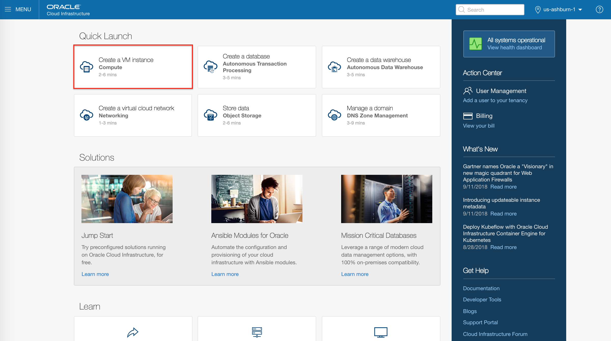

2) The launch browser will automatically fill in the details for launching a single Oracle Linux. Please check each field for better understanding. 

**NOTE** Select Demo comparment from the top

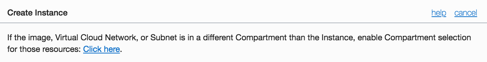

 - **Name**: Bastion-Server
 - **Shape**: VM.Standard 1.1 
 - **Availability Domain**:  AD1
 - **Boot Volume**: Oracle-Provided OS Image
 - **Image Operating System**: Oracle Linux 7.5
 - **Shape type** : Virtual Machine
 - **Image Version**: Latest
 - **Boot Volume Configuration**: Use default
 - **ssh keys** : Attach the .pub key created in the Practice-1
 - **Networking** : Since no vcn is currently setup, provide a name and a basic VCN is setup with required resources. 
   - **VCN Name**: vcn_bastion

Leave the optional elements as is and click **CREATE** 


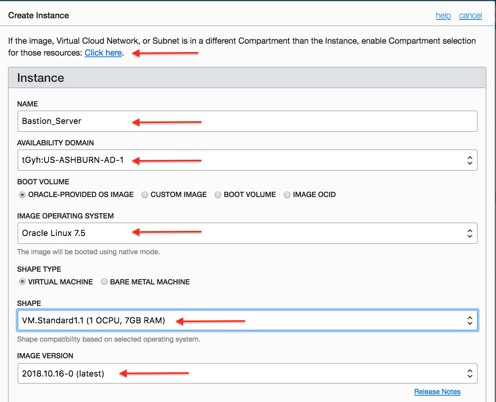


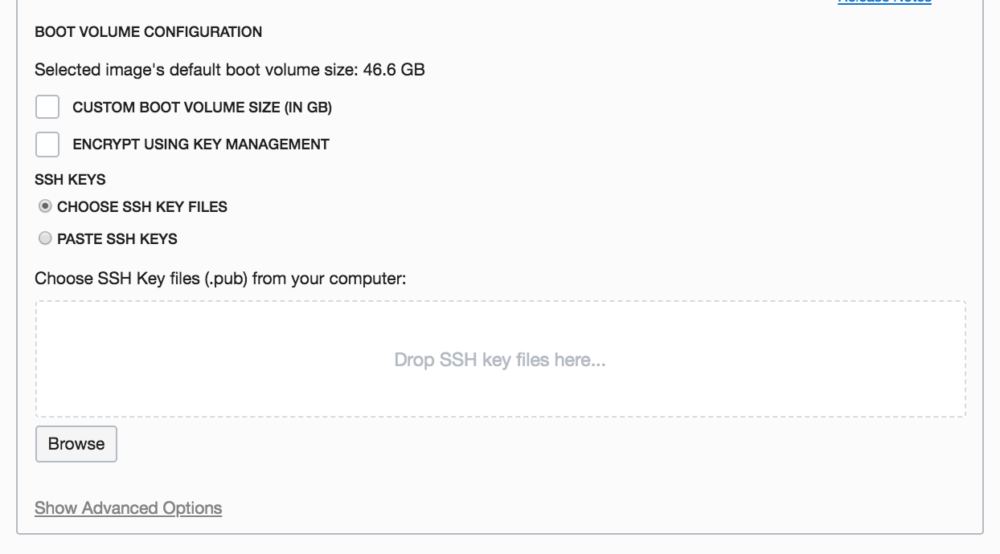
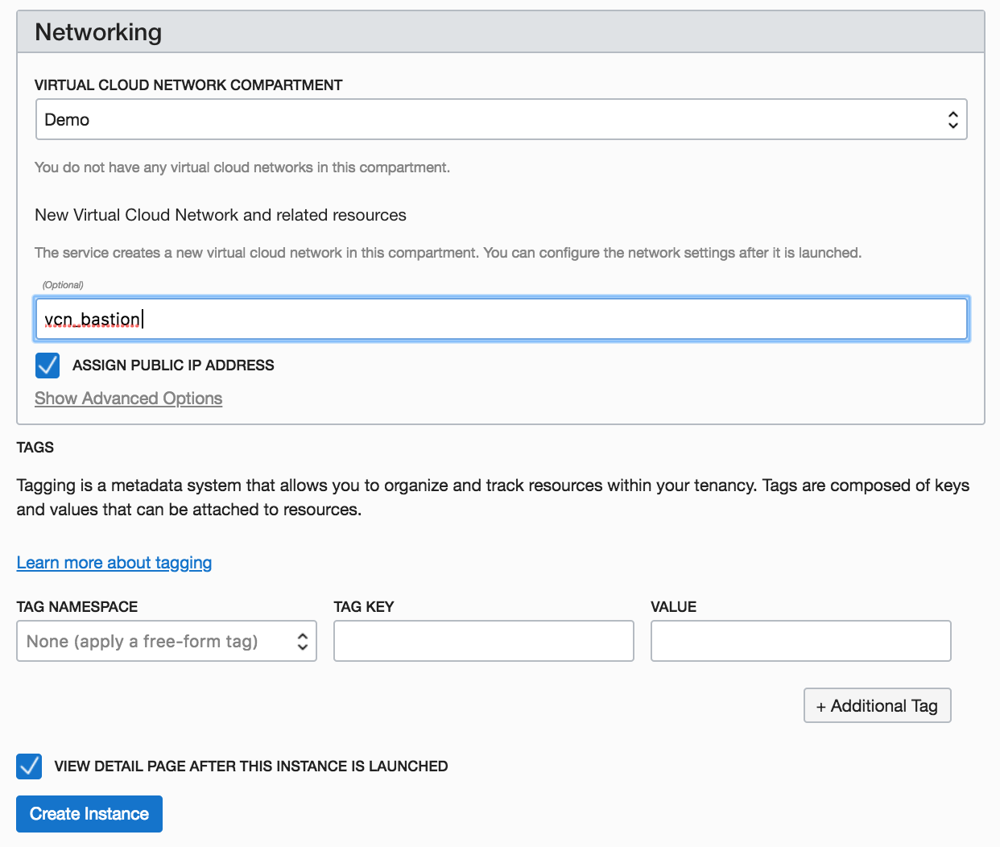


Launching an instance is simple and intuitive with few options to select. Provisioning of the compute instance will complete in less than a minute and the instance state will change from provisioning to running.

A Virtual Cloud Network (VCN) is a virtual version of a traditional network including subnets, route tables, and gateways on which your compute instances run. Customers can bring their network topology to the cloud with VCN. VCN created has the following components. 

 - CIDR block range of 10.0.0.0/16
  - An Internet Gateway
  - A route table with a default route rule to enable traffic between VCN and the Internet Gateway
  - A default security list that allows specific ingress traffic to and all egress traffic from the instance
  - A public subnet in each Availability Domain
  - The VCN will automatically use the Internet and VCN Resolver for DNS

3) Once the instance state changes to Running, you can SSH to the Public IP address of the instance.
    


4) To connect to the instance, you can use ‘Terminal’ if you are using MAC or Gitbash if you are using Windows.

> **Note:** *For Oracle Linux VMs, the default username is **opc**
```
# ssh -i /path/privateKey opc@PublicIP_Address
```

## Practice 4: Collect the Required OCIDs for Terraform
In order to automate with terraform we need to collect a few OCIDs in advance. One thing to note that along with a Tenant/Cloud Tenant, username and password you also received a Compartment Id. Compartments are sub-areas or sub-domains within a tenancy to which you have been delegated full control. In the next few steps we will be collecting the Tenancy OCID, the Compartment OCID and the User OCID.

1) In OCI webconsole, navigate to **Menu** > **Administration** > **Tenancy Details**. Take a note of the Tenancy OCID information. Save on your notepad. 


2) The correct compartment for this exercise is **Demo**. On **Menu** select **Identity** > **Compartments**. Take a note of the Compartment OCID information. Save on your notepad. 


3) For this exercise, we will use **api.user**. Navigate to **Identity**> **Users** and take a note of OCID for the api.user.  Save on your notepad.


**Summary:** This exercise consisted of logging into the OCI Console and collecting the tenancy, compartment and user OCIDs. Save these for use later with terraform. You will have something similar to that:


## Practice 5: Install and Configure Terraform in Bastion Server

1) Connect to the bastion server, you can use ‘Terminal’ if you are using MAC or Gitbash if you are using Windows.

> **Note:** *For Oracle Linux VMs, the default username is **opc**
```
# ssh -i /path/privateKey opc@PublicIP_Address
```

2) Download a script and run it. This will install terraform, OCI CLI, some required packages. It will also create a folder **terraformtest** and save a test terraform .tf file with an environment variable file. 
```
$ curl -L -o tfsetup.sh https://raw.githubusercontent.com/jamalarif/oci/master/scripts/tflabsetup/tfsetup.sh
$ bash ./tfsetup.sh
press enter to continue
```
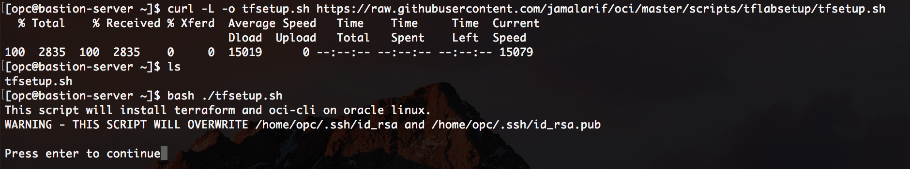

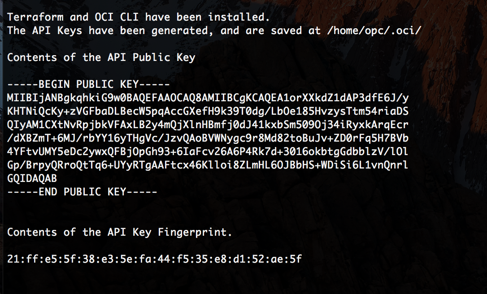

The contents of the API Public Key and Fingerprint are also printed out.  You will upload the PEM public key in the Console. 

2) Navigate to the details for the api.user who will be calling the API with the key pair. In OCI console, on top right corner click on your user, and **user settings**


Click  **Add Public Key** and Paste the contents of the PEM public key in the dialog box and click  **Add**.

**Note**: The key's fingerprint is displayed (for example, 12:34:56:78:90:ab:cd:ef:12:34:56:78:90:ab:cd:ef). It must match the fingerprinted generated and displayed at the end of the install script. 

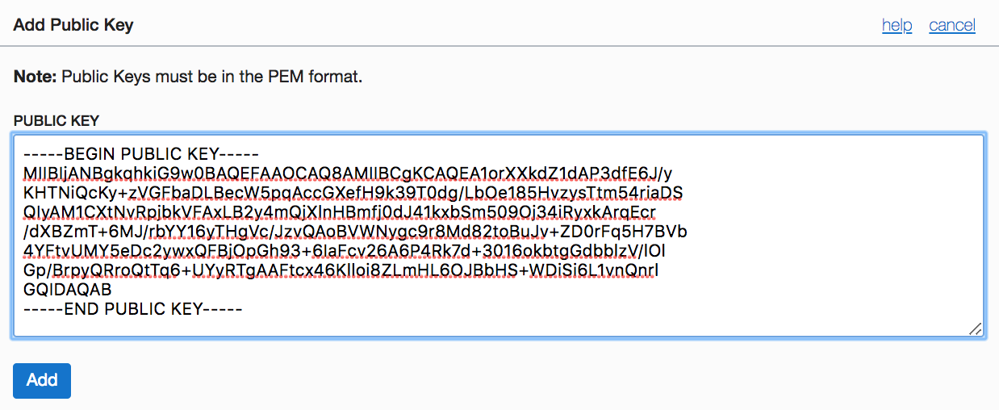


3)  While still being connected to the Bastion Server via SSH, go the terraformtest folder created by the tfsetup script. 

```
# cd terraformtest
# vi env-vars
```
4) Edit the environment variable file and add OCIDs from your Tenancy.  Add OCIDs of Tenancy, User and compartment. 

Use editor of your choice, and save it. 
[vi editor cheat sheet](http://web.mit.edu/merolish/Public/vi-ref.pdf*)

```
# vi env_vars
export TF_VAR_tenancy_ocid=<tenancy_OCID>
export TF_VAR_user_ocid=<api.user_OCID>
export TF_VAR_compartment_ocid=<Demo_Compartment_OCID>

export TF_VAR_fingerprint=$(cat ~/.oci/oci_api_key_fingerprint)
export TF_VAR_private_key_path=~/.oci/oci_api_key.pem

export TF_VAR_ssh_public_key=$(cat ~/.ssh/id_rsa.pub)
export TF_VAR_ssh_private_key=$(cat ~/.ssh/id_rsa)

export TF_VAR_region=us-ashburn-1
```


5) Source the environment file, and test it.
```
# source env_vars
# export | grep TF 
```


6) Run the terraform and test if your terraform setup was successfull! 
```
# terraform init
# terraform plan
# terraform apply 
```

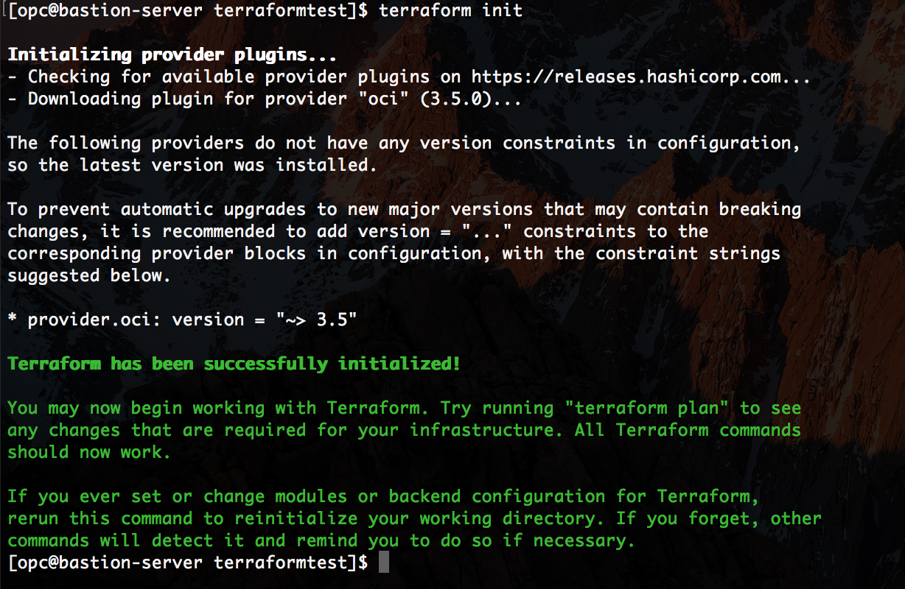

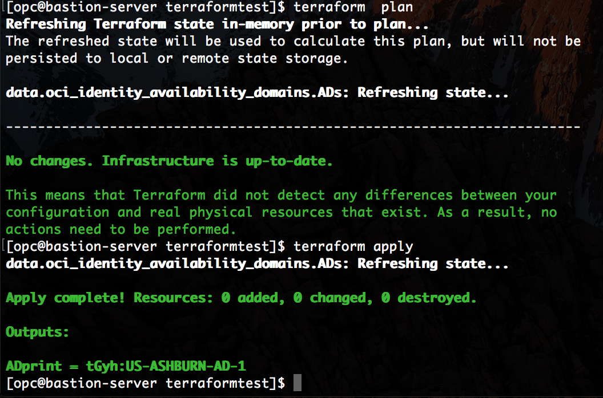

Congratulations! You have just setup and configured your user to use terraform to setup the infrastructure in Oracle Cloud Infrastructure. 


## Practice 6: Creating a web server with Terraform

In this exercise, we will create a basic webserver with terraform.

1) In your bastion host, clone a github repository. This repo has two folders. 
- Webserver Exercise
- OKE cluster Exercise (we will use it in next exercise)


```
# git clone https://github.com/jamalarif/oraclecodelab18.git
# cd oraclecodelab18/webserver-exercise/
```
Here you will see three terraform .tf file (compute.tf, vcn.tf and variables.tf). 


Copy over your *env-vars* file that you created earlier in your last exercise in this folder. And run the terraform. 

```
# cp ~/terraformtest/env-vars .
# source env-vars
# terraform init
# terraform plan
# terraform apply
```

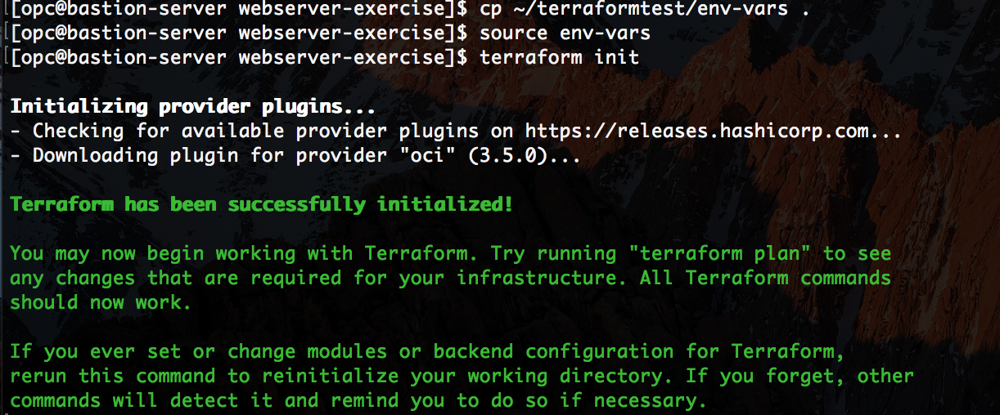

2) This example builds out a VCN with two subnets in different availability domains, and creates two Oracle Linux instances in these two ADs. After creation, it install an apache webserver. Once the terraform apply is complete, it will output the webservers public IPs. 

You can enter the Public IPs in your browser to see the index page of the webserver. 

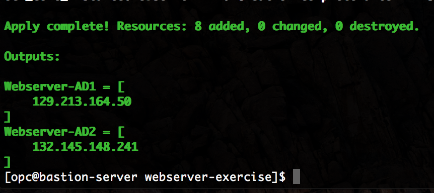


You can also navigate to the OCI web console and see what instances are created and how virtual networks look after this terraform. 


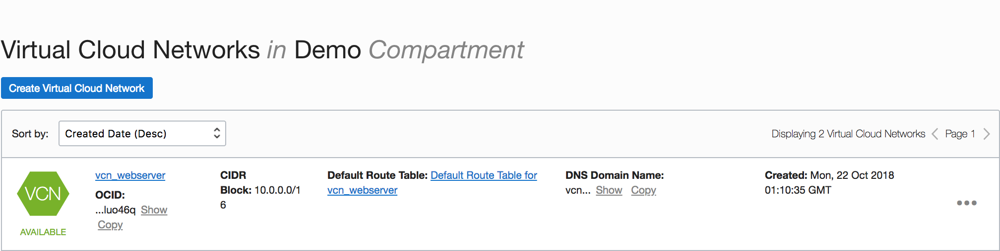

3) Once testing is complete, please delete all resources as we will create a Kubernetes Cluster in the next exercise and will need these resources. 
```
# terraform destroy
```

## Practice 7: Setup Container Engine for Kubernetes OKE using Terraform

In this exercise we will create a OKE cluster. 

Please make sure to delete the webservers created in the last exercise. 

1) In the bastion host, navigate to the oke_cluster_exercise folder. And copy over your tenancy *env-vars* file here. 

```
# cd oraclecodelab18/oke-cluster-exercise/
# cp ~/terraformtest/env-vars .
```
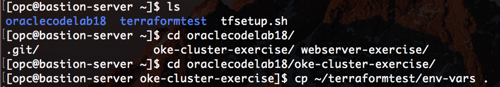

2) Run the terraform. This will create a managed OKE cluster, and couple of worker nodes in your tenancy. 

```
# source env-vars
# terraform init
# terraform plan
# terraform apply
```

Once it completes, it outputs the details of the cluster and node pool. 

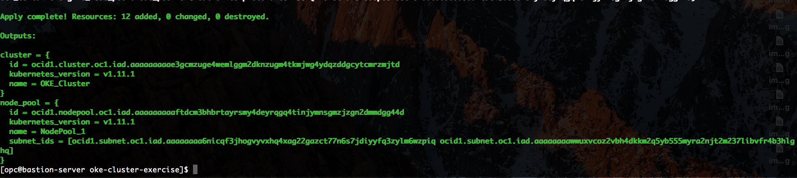

Navigate to OCI Web console, Click **MENU** --> **Developer Services** --> **Container Clusters**. You will see that a cluster has been created. This OKE cluster has multiple Kubernetes Control plane components running in Oracle tenancy. 

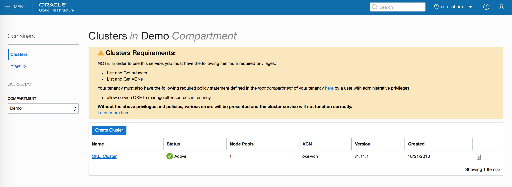

In the details page of your cluster, you will that the worker nodes (Node Pools) are setting up. 

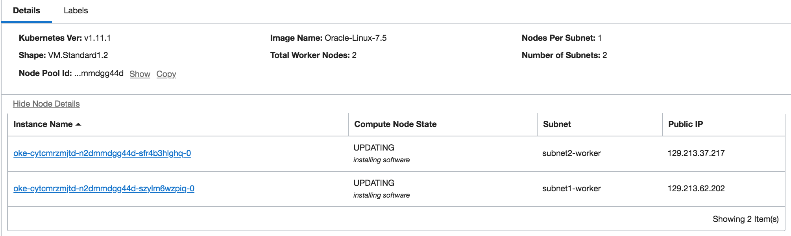

They will move into *ACTIVE* state once the setup is complete and the necessary K8s components are installed in the worker nodes. 

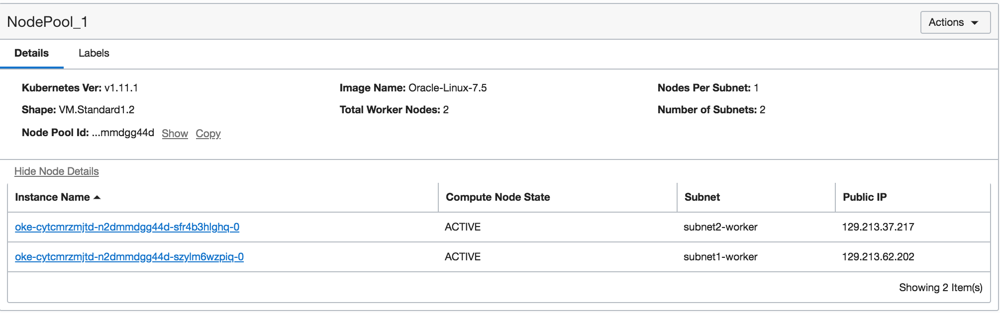

Congratulations! You have just setup a K8s cluster in OCI which has highly available K8s control plane (k8s master nodes) and a highly available k8s data plane (worker nodes across different ADs). 

## Practice 8: Accessing Kubernetes Cluster using kubectl 

1) Before we connect the cluster using kubctl, we need to setup oci-cli in your bastion server. 

Once you run the oci-cli setup, it will inquire about OCIDs of your tenancy, user. You have already collected these in earlier exercises, please provide the same here. 

```
# oci setup config
Enter a location for your config [/home/opc/.oci/config]:
Enter a user OCID: <userOCID>
Enter a tenancy OCID: <tenancy OCID>
Enter a region (e.g. eu-frankfurt-1, uk-london-1, us-ashburn-1, us-phoenix-1): us-ashburn-1
Do you want to generate a new RSA key pair? (If you decline you will be asked to supply the path to an existing key.) [Y/n]: n
Enter the location of your private key file: ~/.oci/oci_api_key.pem
```

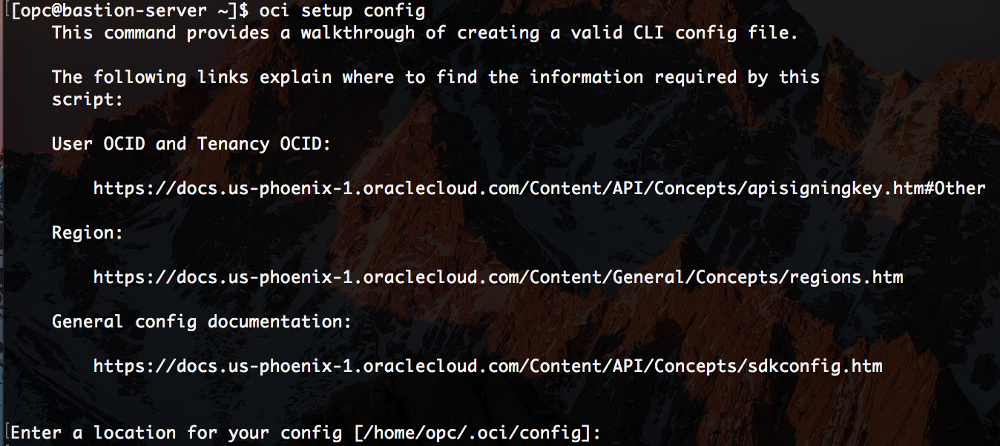


test the oci setup by running

```
# oci iam region list
```

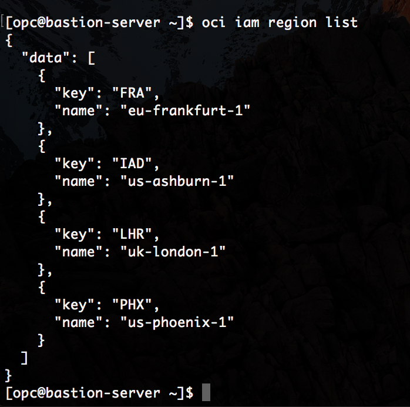

2)Now we will get the kubeconfig file for this cluster and access the cluster using kubectl 

- In the OCI Console, click  ** MENU** **Developer Services**, and then click **Container Clusters**.	
- On the **Cluster List** page, click the name of the cluster you want to access using kubectl and the Kubernetes Dashboard – in this case it is oke-cluster. The **Cluster** page shows details of the cluster.

- Click the **Access Kubeconfig** button to display the **How to Access Kubeconfig** dialog box.

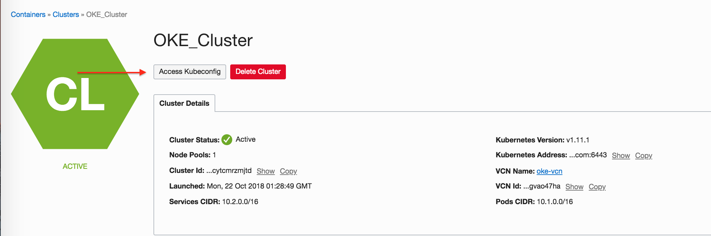

The **How to Access Kubeconfig** dialog box provides the code to include in the get-kubeconfig.sh file. (Please use Google-Chrome browser)

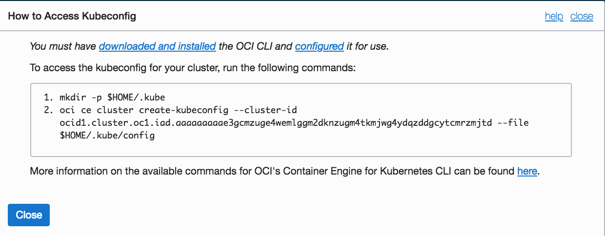

The following commands create a config file at expected default name and location of *$HOME/.kube/config*

**NOTE** Each cluster ID is different. Don't copy below commands, copy the commands provided in your *access kubeconfig* diaglog box. 
```   
   $ mkdir -p $HOME/.kube
   $ oci ce cluster create-kubeconfig --cluster-id ocid1.cluster.oc1.iad.aaaaaaaaae4gezddgbstczbuhaytqnlgmyytqzddmezdqyjvgcrggobxmvsg --file $HOME/.kube/config
```
6) Once completed, run following commands to test cluster connectivity. 
```   
   $ kubectl cluster-info
   $ kubectl get nodes
```

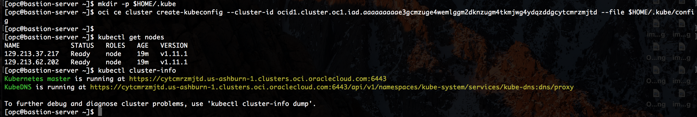

## Practice 9: Creating an Application on Kubernetes Cluster

Lets run a basic nginx webserver on this kubernetes cluster. 

1) Create an nginx deployment with three replicas. 

```   
   $ kubectl run nginx --image=nginx --port=80 --replicas=3
   $ kubectl get deployments
   $ kubectl get pods -o wide
```

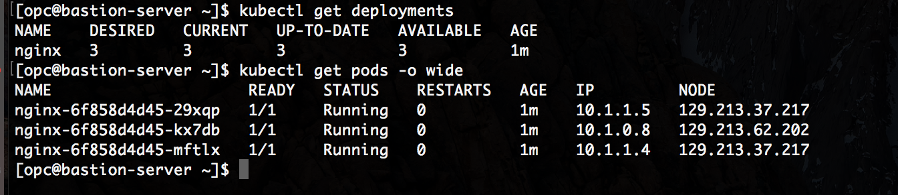

2) Create a service to expose the application. The cluster is integrated with the OCI Cloud Controller Manager (CCM). As a result, creating a service of type --type=LoadBalancer will expose the pods to the Internet using an OCI Load Balancer.
```   
   $ kubectl expose deployment nginx --port=80 --type=LoadBalancer
```

3) List service to get the external IP address (OCI LoadBalancer) of your exposed service. Note, the IP will be listed as <pending> while the load balancer is being provisioned. 

```   
   $ kubectl get services
```

If we take a look at the **OCI Console -> Networking -> Load Balancers** tab, we will see that a new OCI LB is being provisioned for our service. Once provisioned we’ll see the **external IP**.

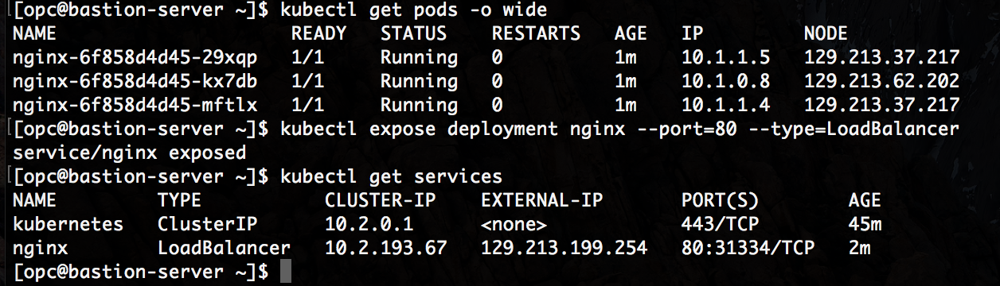

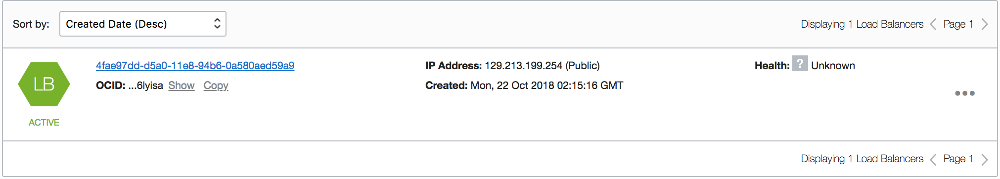

Open the browser open 

http://Load-Balancer-Public-IP


You can delete the deployments by 
```   
   $ kubectl delete service nginx
   $ kubectl delete deployments nginx
    
```

Congratulations on creating your first application in a kubernetes cluster. 

Once the lab is complete, please delete the kubernetes cluster by running terraform destroy

```   
   $ cd oraclecodelab18/oke-cluster-exercise/
   $ terraform destroy
```


