# Autonomous Data Warehouse
  
## Table of Contents

[Overview](#overview)

[Pre-Requisites](#pre-requisites)

[Practice 1: Download the text file ](#practice-1-download-the-text-file)

[Practice 2: Sign in to OCI Console](#practice-2-sign-in-to-oci-console)

[Practice 3: Create an Autonomous Data Warehouse Database](#practice-3-create-an-autonomous-data-warehouse)

[Practice 4: Download the client credentials for ADW Database](#practice-4-download-the-client-credentials-for-adw-database)

[Practice 5: Create a bucket in Object Storage and upload the channels.txt file](#practice-5-create-a-bucket-in-object-storage-and-upload-the-text-file)

[Practice 6: Creating an Auth token for OCI user](#practice-6-creating-an-auth-token-for-oci-user)

[Practice 7: Login to the ADW database and store the object store credentials](#practice-7-login-to-the-adw-database-and-store-the-object-store-credentials)

[Practice 8: Load data into CHANNELS table using channels.txt file](#practice-8-load-data-into-channels-table-using-channels.txt-file)

## Overview

Oracle Autonomous Data Warehouse Cloud provides an easy-to-use, fully autonomous database that scales elastically, delivers fast query performance and requires no database administration. In this hands on lab, we will walk through deploying an Autonomous Data Warehouse database and loading a table using a text file that is stored in object storage. The purpose of this lab is to get familiar with Oracle Autonomous Data Warehouse primitives. At the end of this lab, you will be familiar with launching an Autonomous Data Warehouse database, creating an object storage bucket and loading a table using a text file stored in object storage.

## Pre-Requisites

- Oracle Cloud Infrastructure account credentials (User, Password, and Tenant) with available service limit for Autonomous Data Warehouse
- SQL Developer installation on the laptop and basic knowledge of executing SQL scripts in the SQL Worksheet of SQL Developer
- SQL Developer can be downloaded from http://www.oracle.com/technetwork/developer-tools/sql-developer/downloads/index.html
- A simple text editor like Notepad, vi or Sublime.

## Practice-1: Download the text file

Download the channel.txt file from this link: https://bit.ly/2NSNd4l and save it to your desktop.

This file will be loaded into Object Storage and later used to load data into the CHANNELS table.

## Practice-2: Sign in to OCI Console

1) Open a supported browser and go to the Console URL. For example, [https://console.us-ashburn-1.oraclecloud.com](https://console.us-ashburn-1.oraclecloud.com).

2) Enter your tenant name: <Tenant> and click **Continue**

 

3) Oracle Cloud Infrastructure is integrated with Identity Cloud Services, you will see a screen validating your Identity Provider. You can just click **Continue**.

 

4) Enter your user name and password

 - **Username:** api.user
 - **Password:** _instructor will provide password_

 

When you sign in to the Console, the home page is displayed.

 

The home page gives you quick links to the documentation and to Oracle Support.

## Practice-3: Create an Autonomous Data Warehouse

1) Click on **Menu** > **Autonomous Data Warehouse** 

2) Select **Demo** Comparment and click **Create Autonomous Data Warehouse** 

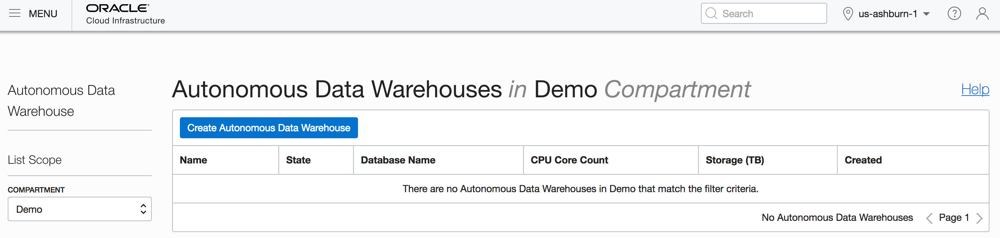

3) Enter the following information:

  - **Display Name**: ADW Finance
 - **Database Name**: ADWFINANCE
 - **CPU Core Count**: 1
 - **Storage**: 1
 - **Password**: Demo_2018DB##
 - **Confirm Password**: Demo_2018DB##
 - Click **Create Autonomous Data Warehouse** 

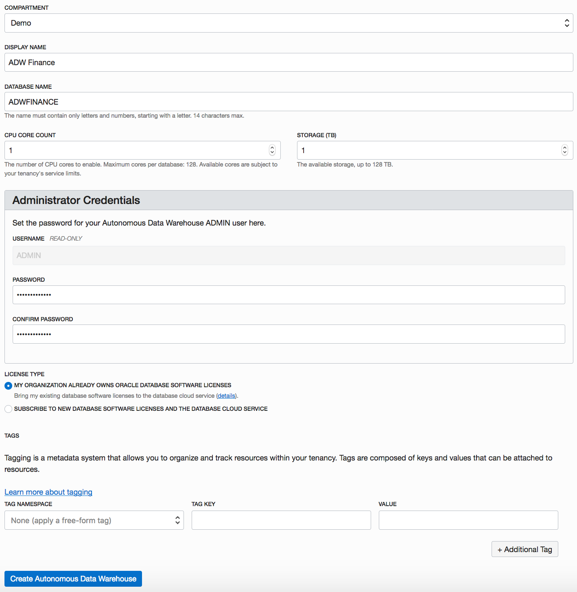

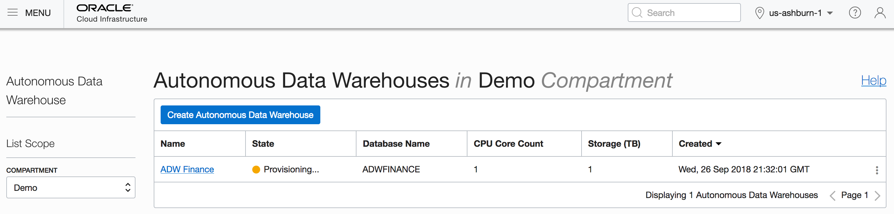

4) Once the ADW Finance database is provisioned, click on the database name to get on details page:

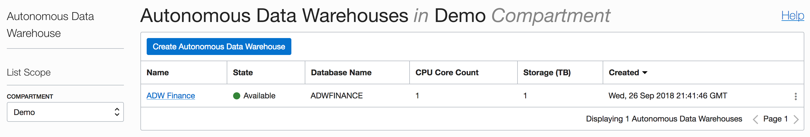
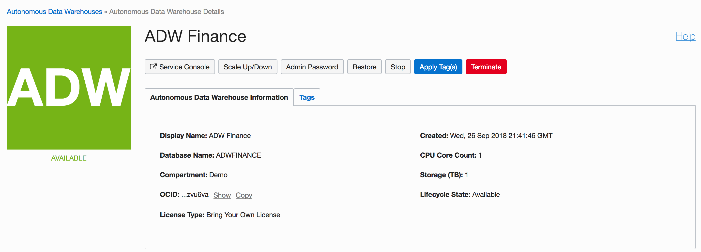

## Practice 4: Download the client credentials for ADW Database

Oracle client credentials (wallet files) are downloaded from the Autonomous Data Warehouse Cloud administrative service console by a service administrator. If you are not an Autonomous Data Warehouse Cloud administrator, your administrator should provide you with the client credentials. Wallet files, along with the Database user ID and password provide access to data in your Autonomous Data Warehouse Cloud.

1. On the details page of your ADW, click on **Service Console**
 
 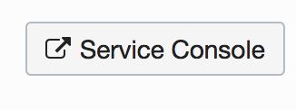
 
2. Enter with the following credentials:
	- **Username**: admin
	- **Password**: *same as database password* 
	


3. On the left side of the page click on ** Administration**
4. Click on **Download Client Credentials** 

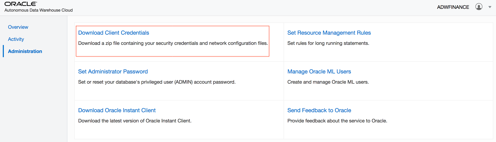

5. You must protect this file to prevent unauthorized database access. Therefore, you need to create a password to protect this file. For this exercise enter *Demo_2018DB##* and click **Download** and save it to your desktop

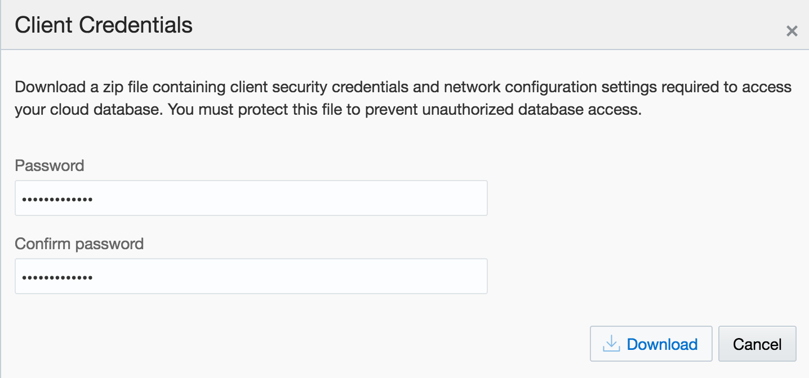


## Practice 5: Create a bucket in Object Storage and upload the text file

For the fastest data loading experience Oracle recommends uploading the source files to a cloud-based object store, such as Oracle Cloud Infrastructure Object Storage, before loading the data into your Autonomous DW Cloud. 
To load data from files in the cloud into your Autonomous DW Cloud database, use the new PL/SQL DBMS_CLOUD package. The DBMS_CLOUD package supports loading data files from the following Cloud sources: Oracle Cloud Infrastructure Object Storage, Oracle Cloud Infrastructure Object Storage Classic, and Amazon AWS S3. Lets create an Object Storage Bucket inside the Demo Compartment.

1. On OCI Dashboard **Menu** click on **Object Storage** > **Object Storage**
2. Make sure to select **Demo** Compartment
3. Click on **Create Bucket** and enter the following information:
	- Bucket Name: ADW_Bucket
	- Storage Tier: Standard
	
4. Click **Create Bucket** 
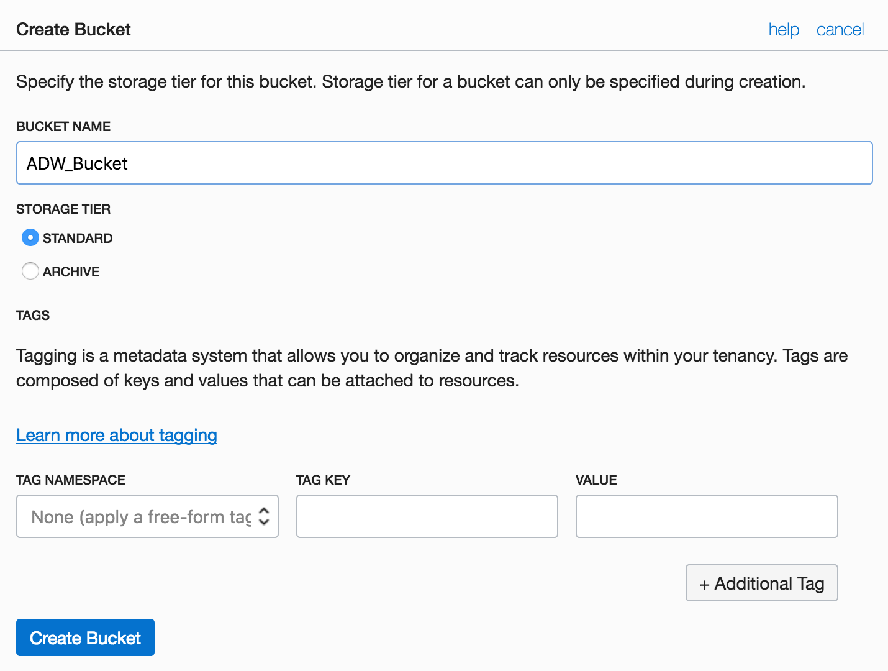


5.  Upload the channels.txt file to the ADW_Bucket
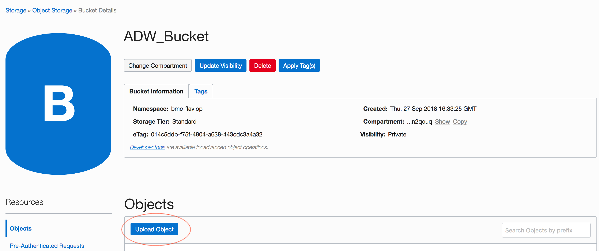

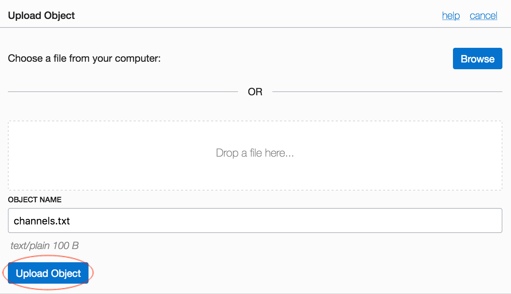

## Practice 6: Creating an Auth token for OCI user
An Auth token is an Oracle-generated token that you can use to authenticate with third-party APIs. For example, use an auth token to authenticate with a Swift client when using Recovery Manager (RMAN) to back up an Oracle Database System (DB System) database to Object Storage. Lets start the process of creating an Auth token:

1. On **Menu** click on **Identity** > **Users** 
2. Find **api.user** and click on **View User Details** 

3. On the left side of page under **Resources**,  click on **Auth Tokens** and then click **Generate Token**
4. Enter the following Description: *Auth Token for ADW Database*
5. Click **Generate Token**

6. Copy the generated token and save it in a notepad/text file. You will use it to create the database credential for api.user. *A portion of the generated token has been hidden for security reasons.*


## Practice 7: Login to the ADW database and store the object store credentials
In this portion of the lab you will use SQL Developer to create a connection to the Autonomous Data Warehouse database you created earlier. You will use the admin user credentials for this part.
Once you connect to the admin user, you will create a ocitest user (a demo user), grant it the DWROLE role and then create a SQL Developer connection using the ocitest user credentials.
The ocitest user will be the owner of the CHANNELS table that will be used for loading data.

1. Launch SQL Developer on your laptop and click on **+** to create a new connection

2. Create a new connection using the following values:
	- **Connection Name**: ADW Finance
	- **Username**: admin
	- **Password**: *Enter admin password*
	- **Connection Type**: Cloud PDB
	- **Configuration File**: *Browse to the credentials file collected from Practice-4* 
	- **Service**: adwfinance_medium
3. Click on **Save** then click **Connect**


4. You are now connected to ADW.
5. Now that you have logged into SQL Developer, execute the following statements to create the **ocitest** user and to grant **DWROLE** to this user:

 ```
create user ocitest identified by "Demo_2018DB##";
grant dwrole to ocitest;
```


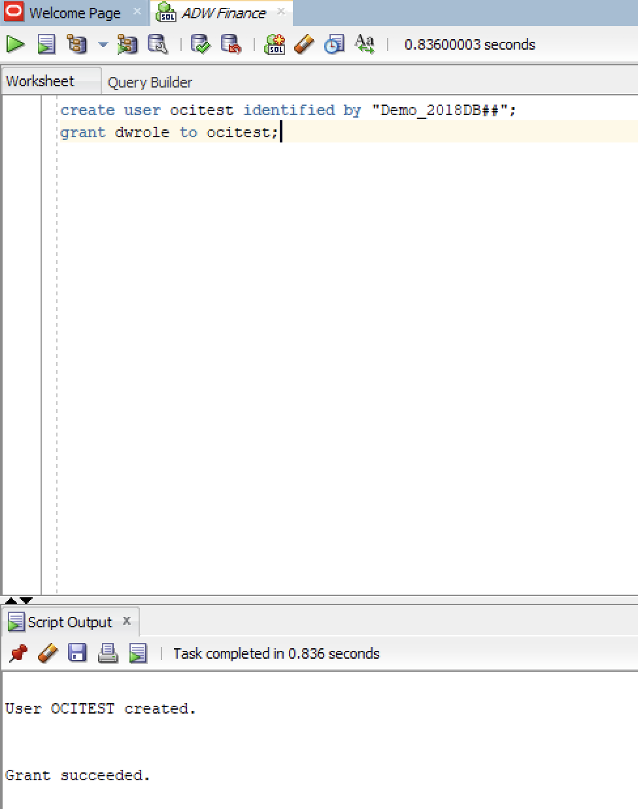

6. Execute the statement by pressing **Run Statement** button 

7.  Now lets create a new connection using the following values:
	- **Connection Name**: ADW-Finance-OCITEST
	- **Username**: ocitest
	- **Password**: *Demo_2018DB##*
	- **Connection Type**: Cloud PDB
	- **Configuration File**: *Browse to the credentials file collected from Practice-4* 
	- **Service**: adwfinance_medium
8. Click on **Save** then click **Connect**

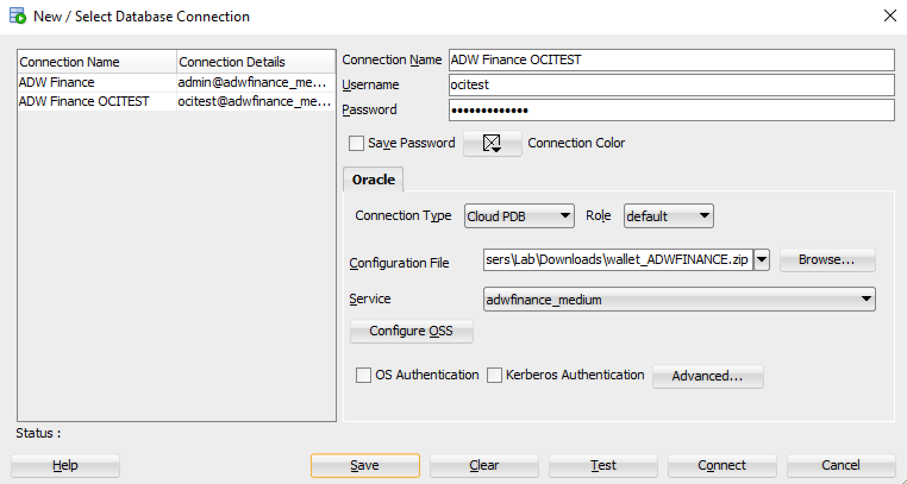

9. Once connected, you will store your object credentials using the procedure **DBMS_CLOUD.CREATE_CREDENTIAL** running the following SQL Statement:
 
> **Note:**  Replace "password" with the generated token you copied from Practice-6.

```
begin
 DBMS_CLOUD.create_credential (
     credential_name => 'OBJ_STORE_CRED',
     username => 'api.user',
     password => '<your Auth Token>'  
  ) ;
end;
/
```

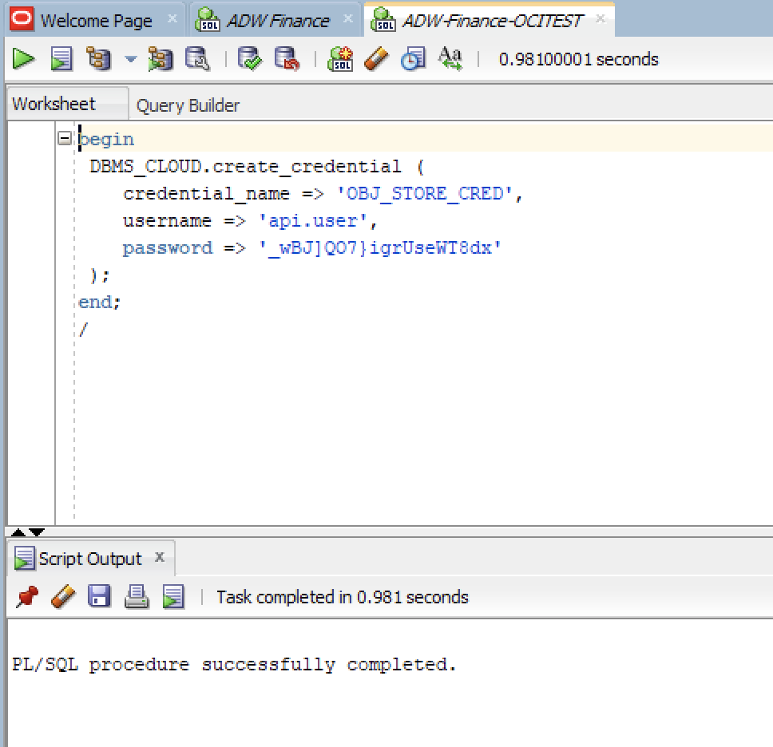

You should see an output of “PL/SQL Procedure successfully completed.” if there are no execution errors or typos in the script.

## Practice 8: Load data into CHANNELS table using channels.txt file

In this portion of the lab you will use SQL Developer to create the CHANNELS table in the ocitest schema. Once the table is created, you will load it with data from the channels.txt file stored in the object storage.

1. Launch SQL Developer on your laptop and connect to the ocitest user.
2. Execute the following SQL script:

```
CREATE TABLE ocitest.channels (
    channel_id                  NUMBER          NOT NULL,
    channel_desc                VARCHAR2(20)    NOT NULL,
    channel_class               VARCHAR2(20)    NOT NULL,
    channel_class_id            NUMBER          NOT NULL,
    channel_total               VARCHAR2(13)    NOT NULL,
    channel_total_id            NUMBER          NOT NULL);
```
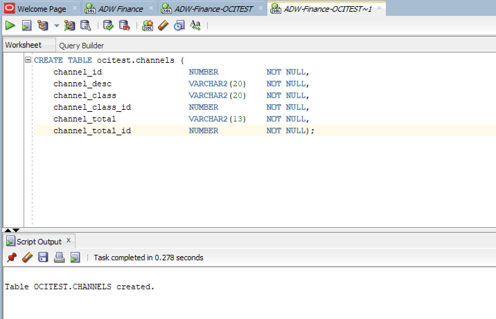

You should see an output of **Table CHANNELS created** if there are no execution errors or typos in the script.

3. Now lets load data into the CHANNELS table using the channels.txt file by executing a modified version of the script bellow:

> **Note:**  For `file_uri_list`, specify the URL that points to the location of the file staged in your object store. The URL is structured as follows. The values you specify are in bold:  
"https://swiftobjectstorage.**region-name**.oraclecloud.com/v1/**tenant-name**/**bucket-name**/**file-name**

``` 
begin
 dbms_cloud.copy_data(
    table_name =>'CHANNELS',
    credential_name =>'OBJ_STORE_CRED',
    file_uri_list =>'https://swiftobjectstorage.us-ashburn-1.oraclecloud.com/v1/gse0001234/ADW_Bucket/channels.txt',
    format => json_object('ignoremissingcolumns' value 'true', 'removequotes' value 'true')
 );
end;
/
```
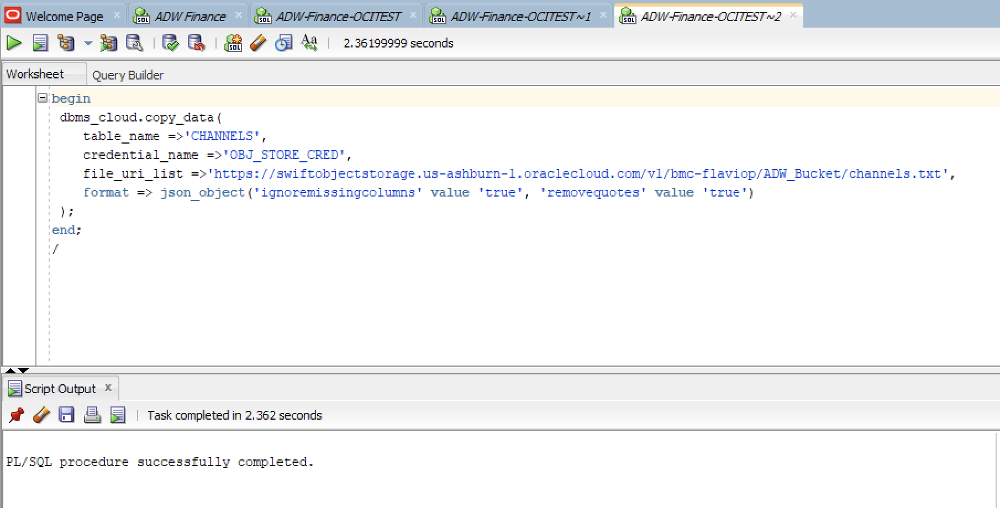

4. Still using the SQL Developer tool, perform the following SQL query:

```
select * from channels;
```

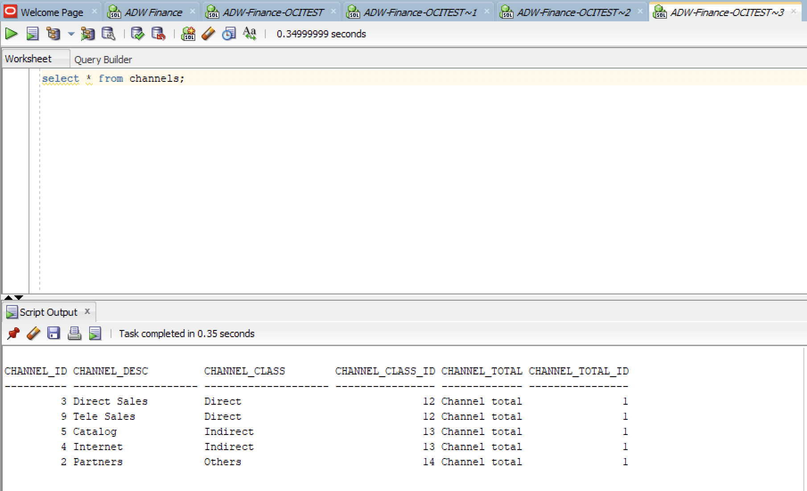

