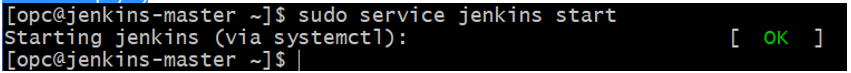
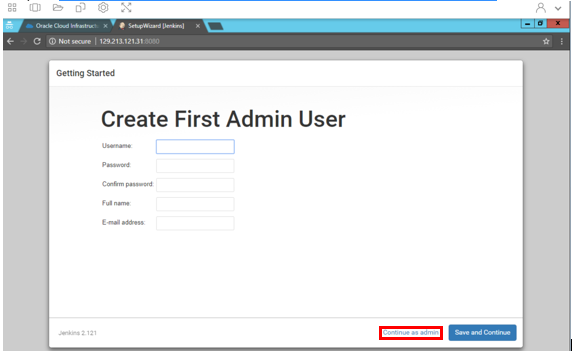
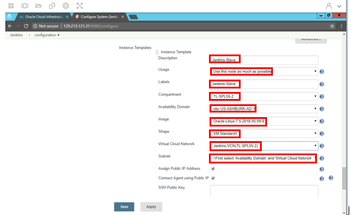

# Deploying Jenkins
  
## Table of Contents

[Overview](#overview)

[Pre-Requisites](#pre-requisites)

[Practice 1: Sign in to OCI Console and create VCN](#practice-1-sign-in-to-oci-console-and-create-vcn)

[Practice 2: Generate ssh keys, Create Compute instance, install OCI CLI and upload API keys](#practice-2-generate-ssh-keys-create-compute-instance-install-oci-cli-and-upload-api-keys)

[Practice 3: Install Jenkins, Configure Jenkins Master instance and create Jenkins Slave instancee](#practice-3-install-jenkins-configure-jenkins-master-instance-and-create-jenkins-slave-instance)

[Practice 4: Delete the resources](#practice-4-delete-the-resources)

## Overview

Faster software development has become a competitive advantage for companies. The automation of software development processes facilitates speed and consistency, which led to the rise for having a Continuous Integration (CI) and Continuous Delivery and Deployment (CD) pipelines. Jenkins is a very popular product among Oracle Cloud Infrastructure customers, which can automate all of the phases of CI and CD. You can host Jenkins on Oracle Cloud Infrastructure to centralize your build automation and scale your deployment as the needs of your software projects grow.

## Pre-Requisites

- Oracle Cloud Infrastructure account credentials (User, Password, Tenant, and Compartment)  

## Practice-1: Sign in to OCI Console and create VCN


**Note:** OCI UI is being updated thus some screenshots in the instructions might be different than actual UI

**Before You Begin**

- We recommend using Chrome or Edge as the broswer. Also set your browser zoom to 80%

1. Sign in using your tenant name, user name and password.

2. From the OCI Services menu,click **Virtual Cloud Network** under Networking and click **Create Virtual Cloud Network**

**NOTE:** Ensure the correct Compartment is selected under COMPARTMENT list


3. Fill out the dialog box:

- **Create in Compartment:** Has the correct compartment

- **Name:** Enter easy to re¬member name

- **Create Virtual Cloud Network Plus Related Resources:** Select this option.

- Click **Create Virtual Cloud Network**

- Click **Close**


## Practice 2: Generate ssh keys, Create Compute instance, install OCI CLI and upload API keys

1. Click the Apps icon in the toolbar and select  Git-Bash to open a terminal window.


2. Enter command 
```
ssh-keygen
```
**HINT:** You can swap between OCI window, 
git-bash sessions and any other application (Notepad, etc.) by clicking the Switch Window icon 


3. Press Enter When asked for ‘Enter File in which to save the key’, ‘Created Directory, ‘Enter passphrase’, and ‘Enter Passphrase again.


4. You should now have the Public and Private keys:

/C/Users/ PhotonUser/.ssh/id_rsa (Private Key)

/C/Users/PhotonUser/.ssh/id_rsa.pub (Public Key)

**NOTE:** id_rsa.pub will be used to create 
Compute instance and id_rsa to connect via SSH into compute instance.

**HINT:** Enter command 
```
cd /C/Users/PhotonUser/.ssh (No Spaces) 
```
and then 
```
ls 
```
to verify the two files exist. 

5. In git-bash Enter command  
```
cat /C/Users/PhotonUser/.ssh/id_rsa.pub
```
 , highlight the key and copy 


6. Click the apps icon, launch notepad and paste the key in Notepad (as backup)


7. Switch to the OCI console. From OCI servies menu, Click **Instances** under **Compute** 

8. Click Create Instance. Fill out the dialog box:

- **Name:** Enter a name 

- **Availability Domain:** Select the first available domain.(usually AD1)

- **Image Operating System:** For the image, we recommend using the Latest Oracle Linux available.

- **Choose Instance Type:** Select Virtual Machine

- **Choose Instance Shape:** Select VM.Standard.E.2.1

- **Configure Boot Volume:** Leave the default

- **Add SSH Keys:** Choose ‘Paste SSH Keys’ and paste the Public Key saved earlier.

- **Virtual Cloud Network Compartment:** Choose your compartment

- **Virtual Cloud Network:** Select the VCN you created in the previous section. 

- **Subnet Compartment:** Choose your compartment. 

- **Subnet:** Choose the first Subnet

9. Click **Create**

**NOTE:** If 'Service limit' error is displayed choose a different shape such as VM.Standard.E2.2 OR VM.Standard2.2


10. Wait for Instance to be in **Running** state. In git-bash Enter Command:
```
 cd /C/Users/PhotonUser/.ssh
```
11. Enter 
```
ls
```
 and verify id_rsa file exists

12. Enter command 
```
ssh –i id_rsa opc@<PUBLIC_IP_OF_COMPUTE_INSTANCE>
```
**NOTE:** User name is opc

**HINT:** If ‘Permission denied error’ is seen, ensure you are using ‘-i’ in the ssh command

13. Enter ‘Yes’ when prompted for security message


 
14. Verify opc@<COMPUTE_INSTANCE_NAME> appears on the prompt

15. To install OCI CLI on the compute instance, Enter Command:

```
bash -c "$(curl –L https://raw.githubusercontent.com/oracle/oci-cli/master/scripts/install/install.sh)"
```


16.  When prompted for Install directory, Press Enter (choose default)


17. When prompted for ‘oci’ directory, Press Enter (choose default)


18. When prompted for ‘Y/N’ for $Path, Enter Y, when prompted for path for rc file Press Enter (choose default)


19. Check oci CLI installed version, Enter command:
```
oci -v
```
**NOTE:** Version shoudl be minimum 2.4.2X


20. Next we will configure OCI CLI. Enter command: 
```
oci setup config
```
Press Enter when prompted for directory name to accept the default. You will be prompted to enter user OCID


21. Switch to OCI Console window, Click user icon (Top Right of OCI Console Window) and click **User Settings**. In User settings click **copy** next to OCID for your user name


22. Switch to git-bash window and paste the user OCID using 
mouse/touch pad and press Enter. You will be prompted to
Enter Tenancy OCID

23. Switch to OCI Console window, Click user icon (Top Right of OCI Console Window) and click your Tenancy name, copy the OCID as was done for user OCID. Also note down your region (in this example "us-ashburn-1")


24. Switch to git-bash window and paste the tenancy OCID using mouse/touch pad and press Enter.You will be prompted to Enter your region.


25. Type your region and press Enter. Enter Y for ‘New 
RSA key pair’. Press Enter and accept default options for directories. Press Enter when prompted for passphrase (i.e leave it empty)


26.  In git-bash session for second compute, Enter command:
```
cd /home/opc/.oci
```
and then 
```
ls
```
Verify the API key files and OCI CLI config files exist.


27. Enter command 
```
cat config
```
and ensure fingerprint exists. Leave the git-bash session open as we will verify the
finger print in config file aginst OCI, once we upload api
keys next.


28. In git-bash window for second compute, Enter command 
```
cat /home/opc/.oci/oci_api_key_public.pem
```
, highlight the output, right click mouse/touchpad and click copy


29. Switch to OCI Console window, Click user iconc(Top Right of OCI Console Window) and click User Settings. In User settings click **API Keys** and **Add Public Key**.


30. Paste the content of oci_api_key_public.pem copied earlier and click **Add**.


31. A new finger print will be generated. Switch to git-bash window and enter command
```
cat /home/opc/.oci/config
```
Compare the finger print in the output of config file to 
the one in OCI console window and make sure they match

**NOTE:** If multiple finger prints exist in OCI console window then identify your finger print by looking at the time stamp.


## Practice-3: Install Jenkins, Configure Jenkins Master instance and create Jenkins Slave instance

1. Swtich to git bash widnow with ssh session to the compute instance

2. Enter below commands:
```
sudo yum install java –y
```
```
sudo wget -O /etc/yum.repos.d/jenkins.repo http://pkg.jenkins-ci.org/redhat/jenkins.repo
```        
```
sudo rpm --import https://jenkins-ci.org/redhat/jenkins-ci.org.key
```
```
sudo yum  install jenkins –y
```
```
sudo service jenkins start   
```
**(Ok message should be displayed)**


```
sudo firewall-cmd --zone=public --permanent --add-port=8080/tcp  
```
**(By default,Jenkins listens on port TCP 8080. Open this port on the instance firewall by configuring the firewall)**
     
```
sudo firewall-cmd --reload
```
3.  To login to Jenkins master node we just set-up its password needs to be retrieved. Enter command ```
```
sudo cat /var/lib/jenkins/secrets/initialAdminPassword. 
```
Copy and paste the password to Notepad


4. Now we need to open port 8080 in Firewall rule for the compute instance. Switch to OCI console window. 

5. From OCI Services menu, click **Virtual Cloud Network** under Networking

6. Click on your VCN name, then Click **Default Security List for <VCN_NAME>**, and then **Edit All Rules**


7. Under Allow Rules for Ingress, Click **+AnotherIngress Rule** . 


Fill out the dialog box:        
- **Source Type:** CIDR
- **SOURCE CIDR:** 0.0.0.0/0
- **IP PROTOCOL:** TCP
- **SOURCE PORT RANGE:** All
- **DESTINATION PORT RANGE:** 8080

8. Click **Save Security List Rules** (At the bottom of dialog box)

9. In OCI Console window, open a new browser tab 


10. Enter the URL 
http://<PUBLIC_IP_OF_COMPUTE_INSTANCE>:8080
In the ‘Unlock Jenkins’ Screen, under ‘Administrator password’, copy/paste the password retrieved using command:
```
sudo cat  /var/lib/jenkins/secrets/initialAdminPassword 
```
from computeinstance earlier (32 character password)


11. In ‘Customize Jenkins’ screen, click **Install suggested plugins**. Wait for plugins installation  to complete


12. In ‘Create First Admin User’ screen, click **Continue as admin**



13.  In ‘Instance Configuration’ screen, verify the correct IP (Public IP of compute instance) and port number is displayed. Click **Save and Finish**


14. In ‘Jenkins is ready’ screen, click **Start using Jenkins**


15. In ‘Welcome to Jenkins’ screen, click **Manage Jenkins**, Scroll down and Click **Manage Plugins**


16. In Plugin Manager screen, Click **Available**, In the Filter search box type oracle. In the resulting list, check **Oracle Cloud Infrastructure Compute** and then click **Install Without restart**


17. Once installation is complete, scroll up and click **Manage Jenkins**.


18. In Manage Jenkins screen, Click **Configure System**, Scroll Down and click **drop down arrow under Add a new cloud**. Click **Oracle Cloud Infrastructure Compute**. New dialog box will appear


19. Fill out the dialog box:
- **Name:** Use easy to remember name (This is the slave node that will be created)
- **Fingerprint:** Copy/paste OCI_api_key_fingerprint file content save earlier
- **APIKey:** Copy/paste OCI_api_key.pem file content saved earlier
- **PassPhrase:** Leave empty
- **Tenant Id:** Copy/Pare Tenant OCID saved earlier
- **User Id:** Copy/Pare User OCID saved earlier
- **Region:** Type your region Name (Shown in OCI console window, us-ashburn-1 etc)

20. Click **Test Connection** and verify ‘Successful’ message. We have now verified connectivityto OCI via the master Jenkins compute node. Next we will create a slave Jenkins node


21. Click **Add a new instance template**. Fill out the dialog box:
- Instance Template Description: Provide description (Jenkins-Slave etc)
- Usage: Leave as is (use this node as much as possible)
- Label: Provide label(Jenkins-Slave etc)
- Compartment: Choose the compartment assigned to you from drop down
- Availability Domain: Choose the same Availability domain as the Compute instance created earlier
- Image: Select latest Oracle Linux (Not anything with‘GPU’ in it)
- Shape: Select a VM shape

**NOTE:** If 'Service limit' error is displayed choose a different shape such as VM.Standard.E2.2 OR VM.Standard2.2
- Virtual Cloud Network: Select the VCN you created in the previous section
- Subnet: Select the same subnet as the Compute instance created earlier
- Assign Public IP address: Check this box
- Connect Agent using public IP: Check this box
- SSH Public key: Copy/Paste ssh public key generated earlier 9Id_rsa_user.pub)
- SSH Private key: Copy/Paste ssh private key generated earlier (id_rsa_user)




22. Click **Verify SSH key pair** and confirm Successful message


23. Click **Advanced**, Fill out the dialog box:
- Remote FS Root: /tmp
- Remote SSH User: opc
- Instance Creation Timeout: 300
- Instance SSH Connection Timeout: 30
- Idle Termination Minutes: 30
- Number of Executors: 1
- Init Script: sudo yum install java –y
- Init Script Timeout: 120


24. Click **Save** . Main Jenkins page will appear

25. In main Jenkins web page, Click Build Executor Status (Left Navigation pan). Click **drop down menu (Under master node information section)** and choose the Newly saved template.(Jenkins-Slave in this case)

26. Verify ‘Started Provisioning’ message is displayed


27. Switch to OCI console window and Click **Instance** (if not already displayed). Verify new compute node (Jenkins-Slave) is being provisioned.
**HINT:** Ensure correct compartment is selected


28. Once compute instance is fully provisioned, switch back to Jenkins window and verify the new node appears on the screen. Click **Refresh Status** a few times to ensure Node is fully accessible (no next to it). You have now successfully deployed Jenkins with two compute nodes


***We have now successfully deployed Jenkins master and slave nodes on OCI.*** 

 ## Practice 4: Delete the resources
**NOTE:**  ***As a practice user will need to figure out any errors encountered during deletion of resources***

1. Switch to  OCI console window

2. If your Compute instance is not displayed, From OCI services menu Click Instances under Compute

3. Locate first compute instance, Click Action icon and then **Terminat** 


4. Make sure Permanently delete the attached Boot Volume is checked, Click **Terminate Instance**. Wait for instance to fully Terminate


5. Repeat steps to delete other compute instance

6. From OCI services menu Click **Virtual Cloud Networks** under Networking, list of all VCNs will 
appear.

7. Locate your VCN , Click Action icon and then **Terminate**. Click **Delete All** in the Confirmation window. Click **Close** once VCN is deleted


***Congratulations! You have successfully completed Deploying Jenkins lab. ***