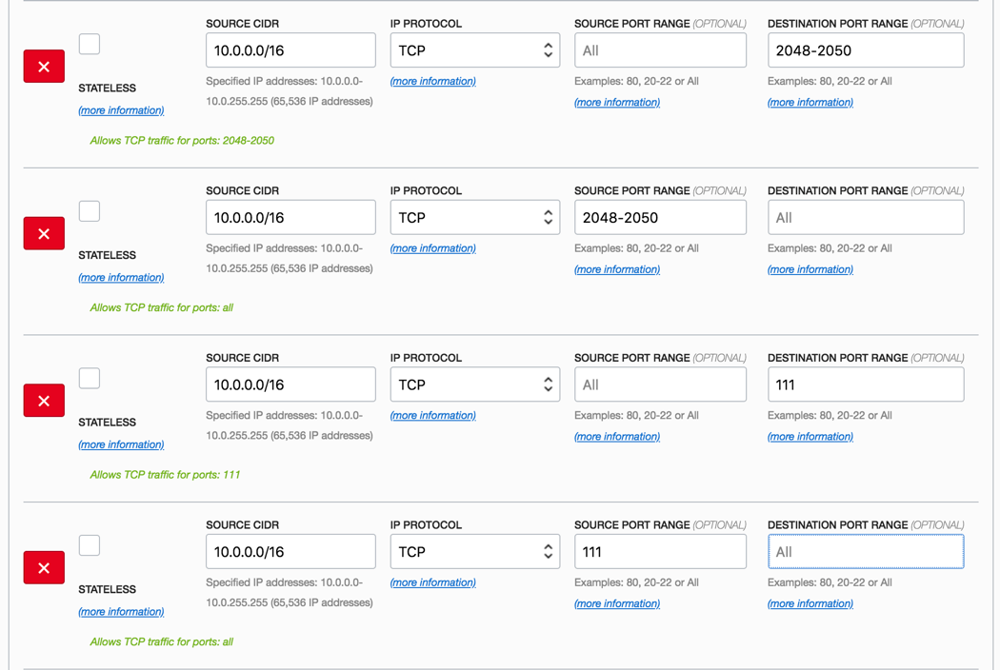
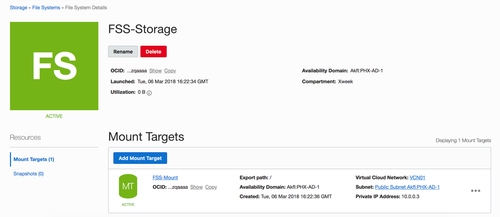

# File Storage Service
  
## Table of Contents

[Overview](#overview)

[Pre-Requisites](#pre-requisites)

[Practice 1: Sign in to OCI Console](#practice-1-sign-in-to-oci-console)

[Practice-2: Creating Security Lists to support FSS](#practice-2-creating-security-lists-to-support-fss)

[Practice-3 Creating a File System](#practice-3-creating-a-file-system)

[Practice-4 Mounting a File System](#practice-4-mounting-a-file-system)

## Overview

Oracle Cloud Infrastructure File Storage service provides a durable, scalable, distributed, enterprise-grade network file system. You can connect to a File Storage service file system from any bare metal, virtual machine, or container instance in your Virtual Cloud Network (VCN). You can also access a file system from outside the VCN using Oracle Cloud Infrastructure FastConnect and Internet Protocol security (IPSec) virtual private network (VPN).

>**Note:** Some of the UIs might look a little different than the screenshots included in the instructions, but students can still use the instructions to complete the hands-on labs.

## Pre-Requisites

- Oracle Cloud Infrastructure account credentials (User, Password, and Tenant) 
- For this lab you will use _cloud.admin_ and <your-name@oracle.com> as the user name to demonstrate the scenarios.

## Practice 1: Sign in to OCI Console

1) Open a supported browser and go to the Console URL. For example, [https://console.us-ashburn-1.oraclecloud.com](https://console.us-ashburn-1.oraclecloud.com).

2) Enter your tenant name and click **Continue**

 

3) Oracle Cloud Infrastructure is integrated with Identity Cloud Services, you will see a screen validating your Identity Provider. You can just click **Continue**.

 

 4) Enter your user name and password

 - **Username:** cloud.admin
 - **Password:** _instructor will provide password_

 

When you sign in to the Console, the home page is displayed.

 

The home page gives you quick links to the documentation and to Oracle Support.

## Practice-2: Creating Security Lists to support FSS

You must configure security list rules for the VCN subnet in which you are planning to create the file system mount target. Security list rules specify what type of traffic can enter and exit a mount target. You configure security lists at the subnet level, but rules are enforced at the instance level. File systems require you to configure bi-directional rules for each port range they use. Therefore, you must set up two stateful rules for each port range, one where the port is the source, and one where the port is the destination.

1) Sign in to the Console, click **Network**, and then click **Virtual Cloud Networks**.
2) Select your VCN
3) On the details page for the cloud network, click **Security Lists**, and then find the security list used by the subnet to be associated with your file system.
4) On the details page of the security list, click **Edit All Rules**
5) Add the following ingress rule for access of NFS and NLM traffic:

- **Source CIDR:** 10.0.0.0/16
- **IP Protocol:** TCP
- **Source Port Range:** All
- **Destination Port Range:** 2048-2050

6) Click **+ Add Rule** to add more rules.
7) Create a second ingress rule for NFS and NLM traffic with a **Source Port Range** of **2048-2050**.
   
- **Source CIDR:** 10.0.0.0/16
- **IP Protocol:** TCP
- **Source Port Range:** 2048-2050
- **Destination Port Range:** All

8) Click **+ Add Rule** to add more rules
9) Create a third ingress rule allowing traffic to a **Destination Port Range** of **111** for the NFS rpcbind utility.
   
- **Source CIDR:** 10.0.0.0/16
- **IP Protocol:** TCP
- **Source Port Range:** All
- **Destination Port Range:** 111

10) Click **+ Add Rule** to add more rules
11) Create a fourth ingress rule allowing traffic to a **Source Port Range** of **111** for the NFS rpcbind utility.
   
- **Source CIDR:** 10.0.0.0/16
- **IP Protocol:** TCP
- **Source Port Range:** 111
- **Destination Port Range:** All

12) When you're done, click **Save Security List Rules**



## Practice-3 Creating a File System
File systems are encrypted by default. You cannot turn off encryption. The mount target must be in the same availability domain as the file system. You cannot change the availability domain after creation.

1) Open the Console, click **Storage**, and then click **File Systems**

2) Click **Create File System**

3) In the **Create File System** dialog, under **File System Information**, enter the following:

- **Name:** FSS-Storage
- **Avaiability Domain:** AD-1

4) Under **Mount Target Information** enter the following:

- **Name:** FSS-Mount
- **Virtual Cloud Network:** Select your VCN
- **Subnet:** select a subnet for the mount target
- **IP Address:** Leave it blank
- **Hostname:** Leave it blank
- **Path Name:** /
- **Maximum Free Space:** Select 100GiB

5) Click **Create File System**:



## Practice-4 Mounting a File System

Users of Ubuntu and Linux operating systems can use the command line to connect to a file system and write files. Mount targets serve as file system network access points. After your mount target is assigned an IP address, you can use it to mount the file system. On the instance from which you want to mount the file system, you need to install an NFS client and create a mount point. When you mount the file system, the mount point effectively represents the root directory of the File Storage file system, allowing you to write files to the file system from the instance

1) Connect to the instance, you can use ‘Terminal’ if you are using MAC or Gitbash if you are using Windows. Use the following SSH command:
  
>**Note:** For Oracle Linux VMs, the default username is **opc**

```
    # ssh –i /path/privateKey opc@PublicIP_Address
```
2) Then, get the NFS client and install it by typing the following:

```
    # sudo yum install nfs-utils
```
3) Create a mount point by typing the following:
```
    # sudo mkdir -p /mnt/nfs-data
```
4) Mount the file system by typing the following. Replace 10.x.x.x: with the local subnet IP address assigned to your mount target. The export path is the path to the file system (relative to the mount target’s IP address or hostname). If you did not specify a path when you created the mount target, then 10.x.x.x:/ represents the full extent of the mount target.
 ``` 
    # sudo mount 10.x.x.x.x:/ /mnt/nfs-data  
    # sudo mount 10.0.0.3:/ /mnt/nfs-data
```


>**Note:** You can mount FSS File System in multiples nodes in different Availability Domains at the same time.
