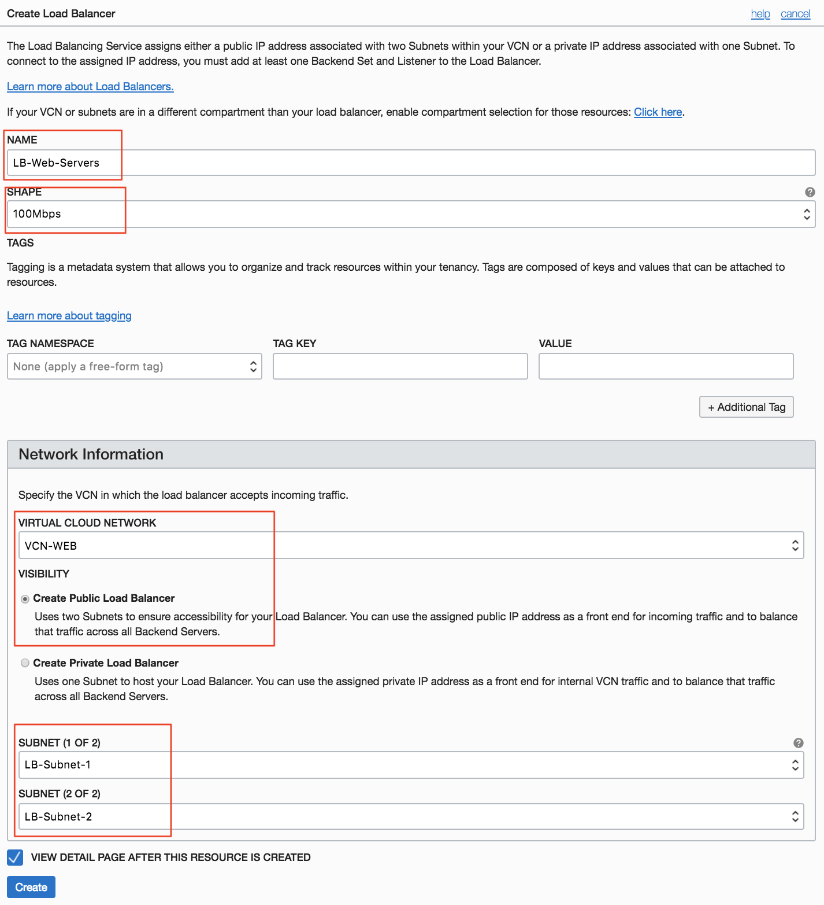
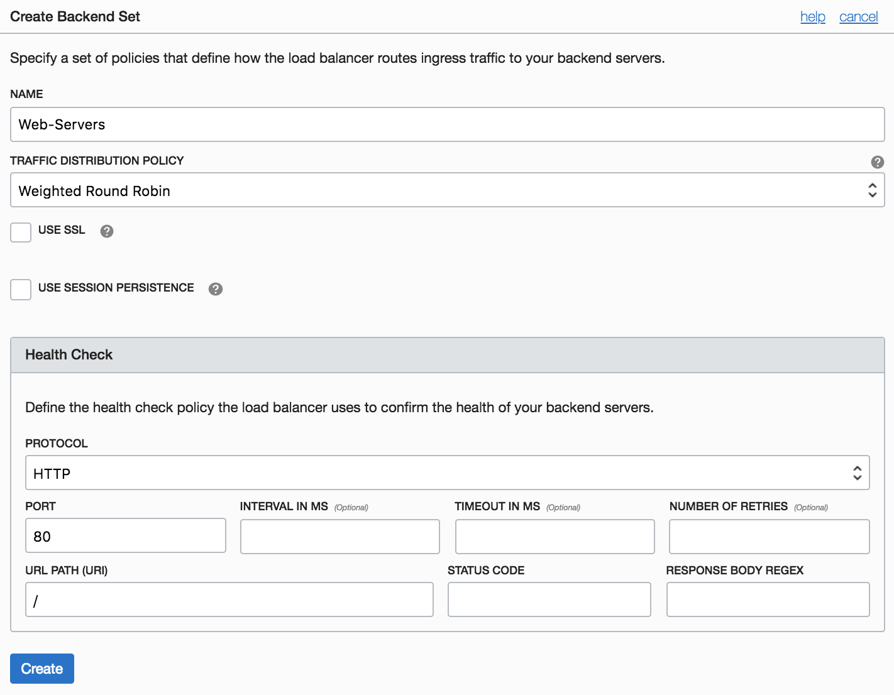
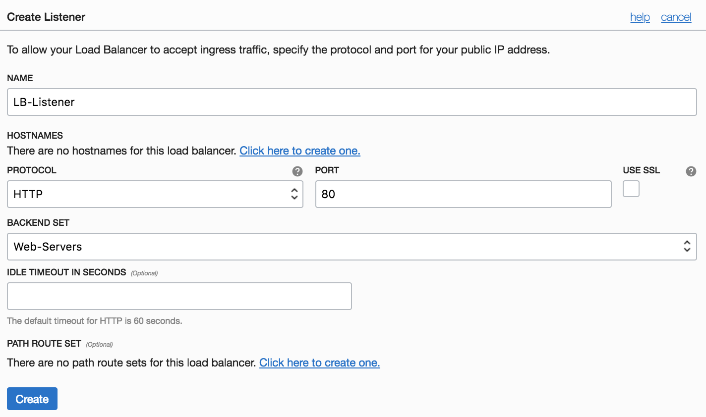

# Load Balancer


## Table of Contents

[Overview](#overview)

[Pre-Requisites](#pre-requisites)

[Practice 1: Creating Virtual Cloud Network](#practice-1-creating-virtual-cloud-network)

[Practice 2: Creating two Web Servers](#practice-2-creating-two-web-servers)

[Practice 3: Creating and Testing the Load Balancer](#practice-3-creating-and-testing-the-load-balancer)

[Summary](#summary)

## Overview

The Oracle Cloud Infrastructure Load Balancing service provides automated traffic distribution from one entry point to multiple servers reachable from your virtual cloud network (VCN). The service offers a load balancer with your choice of a public or private IP address, and provisioned bandwidth.

A load balancer improves resource utilization, facilitates scaling, and helps ensure high availability. You can configure multiple load balancing policies and application-specific health checks to ensure that the load balancer directs traffic only to healthy instances. The load balancer can reduce your maintenance window by draining traffic from an unhealthy application server before you remove it from service for maintenance.

The Load Balancing service enables you to create a public or private load balancer within your VCN. A public load balancer has a public IP address that is accessible from the internet. A private load balancer has an IP address from the hosting subnet, which is visible only within your VCN. You can configure multiple listeners for an IP address to load balance transport Layer 4 and Layer 7 (TCP and HTTP) traffic. Both public and private load balancers can route data traffic to any backend server that is reachable from the VCN.

The following provide an overview of a simple Public Load Balancer:


## Pre-Requisites

- Oracle Cloud Infrastructure account credentials (User, Password, and Tenant)
- Access to Oracle Cloud Infrastructure account

## Practice-1: Creating Virtual Cloud Network

1. Click on **Menu** --> **Networking** --> **Virtual Cloud Network**
2. Click **Create Virtual Cloud Network** 

- Name: *VCN-WEB*
- Select *Create Virtual Cloud Plus Related Resources*
- Click *Create Virtual Cloud Network*

**Note:** This option is the quickest way to get a working cloud network in the fewest steps.

3. Create the following Security List:

- Security List Name: *LB-Security-List*
- Remove all the Ingress and Egress Rules of the *LB-Security-List*
- Click *Create Security List* 


4. Create the following Route Table:

- Route Table Name: *LB-Route-Table*
- Target Type: *Internet Gateway*
- Destination CIDR Block: *0.0.0.0/0*
- Target Internet Gateway: *Select your Internet Gateway*


5. Find your Subnets and edit by clicking on the action button and then click **Edit**. Enter the following parameters:

- For AD1 subnet make the changes:
	- Name: *LB-Subnet-1*
	- Route Table: *LB-Route-Table*
	- Security List: *LB-Security-List*


- For AD2 subnet, make the changes:
	- Name: *LB-Subnet-2*
	- Route Table: *LB-Route-Table*
	- Security List: *LB-Security List*


- For AD3 subnet change ONLY the Name:
	- Name: *Web-Servers*


Your subnets will be similar to this picture:


## Practice-2: Creating two Web Servers

You will create two web servers that will work as backend servers for your Public Load Balancer.

1. Launch two Instances with the following configuration:

- Name: *Web-Server-1*
- Availability Domain: *AD 3*
- Shape: *VM.Standard2.1*
- Enter your public SSH-Key
- Click Create

Repeat the previous steps, but this time enter the name *Web-Server-2*


2. Connect to the Web Servers and run the following commands on both instances:

**Note**: For Oracle Linux VMs, the default username is **opc**.

- Install HTTP Server:
	```
	# sudo yum install httpd -y
	```
- Start the apache server and configure it to start after system reboots:

  ```
  # sudo apachectl start
  # sudo systemctl enable httpd
  ```
- Run a quick check on apache configurations
  ```
  # sudo apachectl configtest
  ```
- Create firewall rules to allow access to the ports on which the HTTP server listens.
  ```
  # sudo firewall-cmd --permanent --zone=public --add-service=http 
  # sudo firewall-cmd --reload
  ```
- Create an index file for your **Web-Server-1**:
  ```
  # sudo su
  # echo 'This is my Web-Server-1 running on Oracle Cloud Infrastructure' >> /var/www/html/index.html
  # exit
  ```

- Create an index file for your **Web-Server-2**:
  ```
  # sudo su
  # echo 'This is my Web-Server-2 running on Oracle Cloud Infrastructure' >> /var/www/html/index.html
  # exit
  ```

## Practice-3: Creating and Testing the Load Balancer

**Note:** Your load balancer should always reside in different subnets than your application instances. This allows you to keep your application instances secured in private subnets, while allowing public Internet traffic to the load balancer in the public subnets.


1. In the Cosole, click **Menu** --> **Networking** --> **Load Balancers**. Click **Create Load Balancer** and enter the following paremeters:

- Name: *LB-Web-Servers*
- Shape: *100Mbps*
- Virtual Cloud Network: *VCN-WEB*
- Visibility: *Create Public Load Balancer*
- Subnet-1: *LB-Subnet-1*
- Subnet-2: *LB-Subnet-2*
- Click Create



When a load balancer is created, you're assigned a public IP address to which you route all incoming traffic. The IP address is highly available, meaning it is available from both subnets that you specified. Note that it is only active in one subnet at a time.


2. Lets create a backend set with health check. Click **Create Backend Set** and enter the following parameters:

- Name: *Web-Servers*
- Traffic Distribution: *Weighted Round Robin*
- Protocol: *HTTP*
- Port: *80*
- URL Path: */*
- Click Create



When the Backend Set is created, the Work Request status changes to Succeeded. 


3. Add Backend Servers to your Backend Set.Click the name of the backend set you created (*Web-Servers*) to view its details.

4. Click on Edit Backends and enter the following information:

- Instance OCID: Paste the OCID of the Web-Server-1*
- Port: *80*

- Instance OCID: Paste the OCID of the Web-Server-2*
- Port: *80*

Click Submit


Scroll down and click Create Rules once it turns green.


5. On your Load Balancer Details page, click **Listeners** and then click **Create Listener** with the following parameters:

- Name: *LB-Listener*
- Protocol: *HTTP*
- Port: *80*
- Backend Set: *Web-Servers*
- Click Create




6. Update the *LB-Security-List* to allow Internet Traffic to the Listener. Go to your VCN details page.

7. Click **Security Lists**

8. Click on the **LB-Security-List**. This displays the details of the LB Security List

9. Click **Edit All Rules**

10. Under **Allow Rules for Ingress**, click **+ Another Ingress Rule**

11. Enter the following ingress rule: 

- Source CIDR: *0.0.0.0/0*
- IP Protocol: *TCP*
- Destination Port Range: *80*
- Click Save Security List Rules


12. Test the functionality of the load balancer by navigating to its public IP address on a web browser.

`http://<Public-IP-Address>`


## Summary

In this lab, you were able to create a Load Balancer and distribute traffic to your Web Servers. 